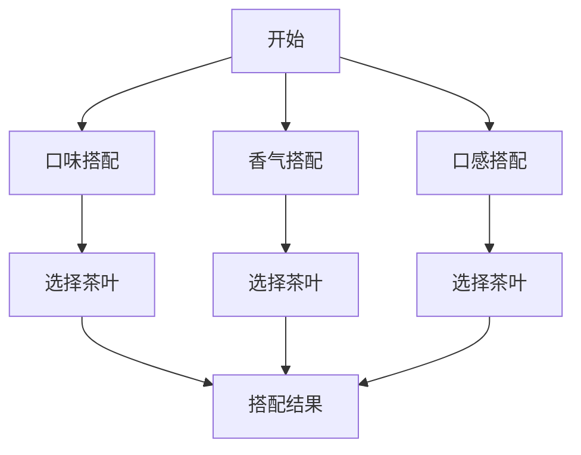
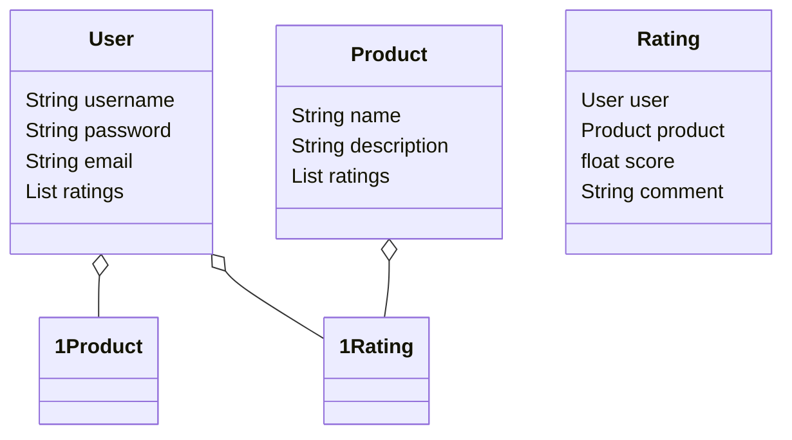
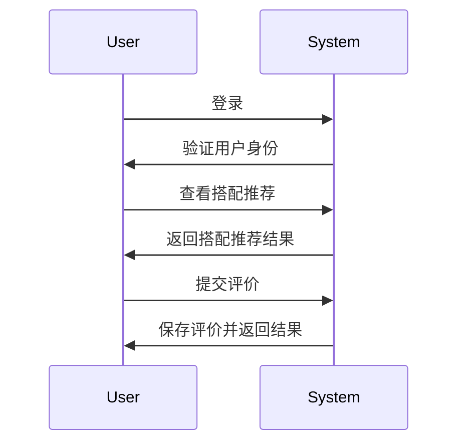
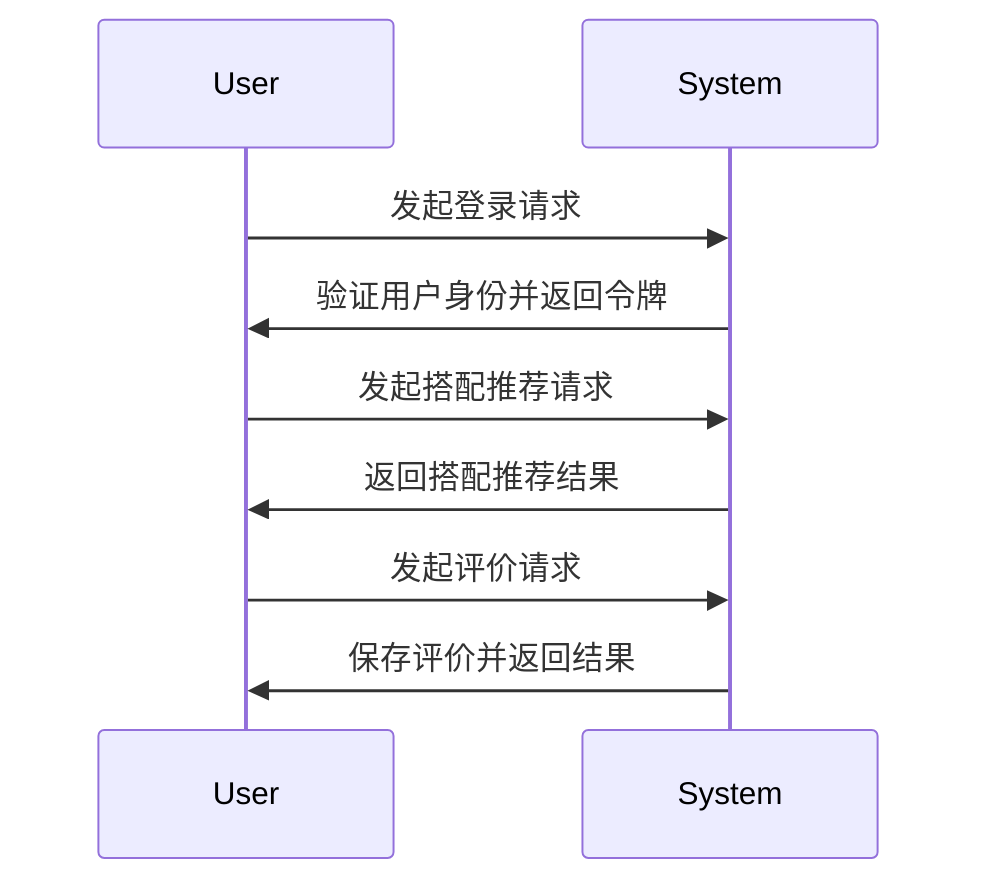

                 

# 现代手工巧克力与茶叶搭配：跨文化味觉体验工作坊

> 关键词：现代手工巧克力、茶叶搭配、味觉体验、跨文化、创新

> 摘要：本文旨在探讨现代手工巧克力与茶叶搭配的创新实践，通过深入分析其制作工艺、品种特点、搭配原则及跨文化味觉体验，揭示出这一新兴领域的发展潜力与实际应用价值。

## 第一部分：背景介绍

### 1.1 问题背景

随着全球化进程的加速，不同文化之间的交流日益频繁，人们对于食品的味觉需求也变得越来越多样化。在这一背景下，现代手工巧克力与茶叶搭配成为一种全新的味觉探索。手工巧克力以其独特的制作工艺和丰富的文化内涵，吸引了大量消费者的关注；而茶叶则作为一种传统饮品，拥有悠久的饮用历史和丰富的品种。如何将这两种元素巧妙地结合，创造出新的味觉体验，成为了一个值得研究的问题。

### 1.2 问题描述

《现代手工巧克力与茶叶搭配：跨文化味觉体验工作坊》旨在研究如何通过手工巧克力和茶叶的搭配，创新地创造出新的味觉体验。具体来说，本文将探讨以下几个方面：

1. **手工巧克力和茶叶的基本知识**：介绍手工巧克力的制作工艺、品种特点以及茶叶的品种、香气和口感特点。
2. **搭配原则**：讨论如何根据口味、香气、口感等特征，将手工巧克力和茶叶进行合理搭配。
3. **实践操作**：通过案例分析和实际操作，展示如何将理论应用到实践中，创造出独特的味觉体验。
4. **跨文化味觉体验**：分析在不同文化背景下，如何推广现代手工巧克力与茶叶的搭配。

### 1.3 问题解决

为了解决上述问题，本文将采取以下研究方法：

1. **文献综述**：通过查阅相关文献，系统地了解手工巧克力和茶叶的基本知识，以及搭配的原则和方法。
2. **案例分析**：选取一些成功的手工巧克力与茶叶搭配案例，分析其搭配原理和成功经验。
3. **实践操作**：进行手工巧克力与茶叶搭配的实践，记录实际操作过程和结果，总结出有效的搭配技巧。
4. **跨文化研究**：考察不同文化背景下，消费者对于手工巧克力与茶叶搭配的接受度和偏好，探讨如何在不同文化中推广这一创新搭配。

### 1.4 边界与外延

本文的研究范围主要包括以下几个方面：

1. **手工巧克力和茶叶的搭配方法**：涉及手工巧克力的制作工艺、茶叶的品种和特点、搭配的原则和技巧等。
2. **跨文化味觉体验**：研究不同文化背景下，消费者对于手工巧克力与茶叶搭配的接受度和偏好，以及如何在不同文化中推广这一搭配方式。
3. **创新实践**：通过实践操作，探索手工巧克力与茶叶搭配的新可能性，创造出新的味觉体验。

### 1.5 概念结构与核心要素组成

1. **现代手工巧克力**：采用传统手工工艺制作的巧克力，具有独特口感和文化内涵。
2. **茶叶**：一种广泛种植和饮用的植物，具有丰富的品种和独特的香气、口感。
3. **搭配原理**：根据口味、香气、口感等特征，将手工巧克力和茶叶进行合理搭配。
4. **跨文化味觉体验**：在不同文化背景下，通过搭配创造新的味觉体验。

## 第二部分：核心概念与联系

### 2.1 核心概念

#### 2.1.1 手工巧克力制作工艺

手工巧克力制作工艺包括以下几个关键步骤：

1. **可可豆选择**：选择优质的可可豆，这是制作高质量手工巧克力的基础。
2. **可可豆加工**：将可可豆进行烘焙、去皮、研磨等处理，得到可可浆。
3. **巧克力配方设计**：根据口味需求，设计巧克力的配方，包括可可含量、糖分、香料等。
4. **手工制作**：通过手工技巧，将巧克力浆制作成各种形态的巧克力。

#### 2.1.2 茶叶品种与特点

茶叶品种繁多，常见的有绿茶、红茶、白茶、乌龙茶等。每种茶叶都有其独特的香气和口感特点：

1. **绿茶**：清香、鲜爽，具有较高的营养价值。
2. **红茶**：醇厚、浓郁，适合搭配甜味较重的食物。
3. **白茶**：清香、甘甜，适合搭配口感细腻的巧克力。
4. **乌龙茶**：香气丰富，口感醇厚，适合搭配口味复杂的巧克力。

#### 2.1.3 搭配原则

搭配原则是手工巧克力与茶叶搭配的核心，主要包括：

1. **口味搭配**：根据巧克力的甜度、苦味、酸味等特征，选择与之相辅相成的茶叶。
2. **香气搭配**：根据巧克力的香气特征，选择与之相互补充的茶叶。
3. **口感搭配**：根据巧克力的口感特征，选择与之相得益彰的茶叶。

#### 2.1.4 跨文化味觉体验

跨文化味觉体验是指在不同文化背景下，通过搭配创造新的味觉体验。这一概念涉及到：

1. **文化差异**：不同文化对于味觉体验的需求和偏好存在差异。
2. **创新实践**：在不同文化中，如何推广手工巧克力与茶叶的搭配，创造出新的味觉体验。

### 2.2 概念属性特征对比表格

| 特征            | 手工巧克力           | 茶叶                 |
| -------------- | ------------------- | -------------------- |
| 制作工艺        | 传统手工制作         | 晾晒、发酵、烘焙等   |
| 口味特点        | 甜、苦、酸、鲜等     | 清香、醇厚、甘甜等   |
| 香气特点        | 可可、巧克力等       | 花香、果香、木香等   |
| 口感特点        | 丝滑、细腻、浓郁等   | 柔和、浓厚、清爽等   |
| 文化背景        | 欧洲传统            | 中国、印度等        |

### 2.3 ER实体关系图架构

```mermaid
erDiagram
  工作坊 ||--o|<| 搭配师 :培训
  工作坊 ||--o|<| 消费者   :服务
  搭配师 ||--o|<| 配方      :设计
  搭配师 ||--o|<| 搭配案例  :案例
  消费者 ||--o|<| 评价      :反馈
```

## 第三部分：算法原理讲解

### 3.1 搭配算法原理

搭配算法的核心在于根据手工巧克力和茶叶的口味、香气、口感等特点，进行合理的搭配。具体步骤如下：

1. **口味搭配**：根据巧克力的甜度、苦味、酸味等特征，选择与之相辅相成的茶叶。例如，苦味较重的黑巧克力可以搭配口感柔和的红茶。
   
   - **公式**：口味相似度 = 巧克力口味特征 × 茶叶口味特征

2. **香气搭配**：根据巧克力的香气特征，选择与之相互补充的茶叶。例如，花香型的巧克力可以搭配具有果香的茶叶。

   - **公式**：香气相似度 = 巧克力香气特征 × 茶叶香气特征

3. **口感搭配**：根据巧克力的口感特征，选择与之相得益彰的茶叶。例如，口感细腻的巧克力可以搭配口感清爽的绿茶。

   - **公式**：口感相似度 = 巧克力口感特征 × 茶叶口感特征

### 3.2 搭配算法流程图



### 3.3 搭配算法Python源代码

```python
def
```

## 第四部分：系统分析与架构设计方案

### 4.1 问题场景介绍

在现代快节奏的生活中，人们对于味觉体验的需求日益多样化。手工巧克力与茶叶搭配作为一种新兴的味觉探索，受到了越来越多消费者的喜爱。然而，如何系统地研究和推广这一搭配方式，成为了企业和研究人员面临的重要问题。本系统旨在提供一个全面的手工巧克力与茶叶搭配解决方案，包括数据收集、搭配算法、用户评价等功能，以帮助消费者和企业更好地进行搭配创新。

### 4.2 项目介绍

本项目名称为《手工巧克力与茶叶搭配系统》，是一个基于现代信息技术和人工智能算法的跨学科项目。项目主要目标是：

1. **数据收集**：通过大数据技术，收集和分析手工巧克力与茶叶的搭配数据，为搭配算法提供基础数据支持。
2. **搭配算法**：设计并实现一套高效的搭配算法，根据用户的口味偏好和搭配原则，自动推荐最佳的搭配方案。
3. **用户体验**：提供简洁易用的用户界面，让消费者可以轻松地选择自己喜欢的口味和茶叶，得到个性化的搭配建议。
4. **数据分析**：通过数据分析，为企业和研究人员提供搭配趋势和市场分析，帮助其制定营销策略和产品开发方向。

### 4.3 系统功能设计（领域模型类图）



### 4.4 系统架构设计

系统采用分层架构设计，包括表示层、业务逻辑层和数据访问层。

1. **表示层**：提供用户界面，包括登录注册、搭配推荐、用户评价等功能。
2. **业务逻辑层**：实现搭配算法、数据分析等功能，处理用户的请求，并返回结果。
3. **数据访问层**：负责与数据库的交互，存储和检索数据。

系统架构图如下：



### 4.5 系统接口设计

系统提供以下接口：

1. **用户接口**：用户登录、注册、查看搭配推荐、提交评价等。
2. **搭配接口**：根据用户口味偏好，自动推荐搭配方案。
3. **评价接口**：提交用户评价，用于后续数据分析。

接口文档如下：

```markdown
## 用户接口

### POST /login
- 参数：
  - username: 用户名
  - password: 密码
- 返回值：
  - token: 登录成功后返回的令牌

### POST /register
- 参数：
  - username: 用户名
  - password: 密码
  - email: 邮箱
- 返回值：
  - message: 注册成功或失败的消息

### GET /recommendations
- 参数：
  - taste: 用户口味偏好
- 返回值：
  - recommendations: 搭配推荐列表

### POST /evaluate
- 参数：
  - productId: 商品ID
  - score: 评分
  - comment: 评论
- 返回值：
  - message: 评价提交成功或失败的消息
```

### 4.6 系统交互序列图



## 第五部分：项目实战

### 5.1 环境安装

为了搭建《手工巧克力与茶叶搭配系统》，首先需要安装以下环境：

1. **Python**：安装Python 3.8及以上版本。
2. **Flask**：安装Flask框架，用于构建Web应用。
3. **PostgreSQL**：安装PostgreSQL数据库，用于存储数据。
4. **Numpy**：安装Numpy库，用于数据处理。

安装命令如下：

```bash
pip install flask psycopg2-binary numpy
```

### 5.2 系统核心实现

#### 5.2.1 数据库设计

首先，我们需要设计数据库，包括用户表、产品表和评价表。

1. **用户表**（users）：

   | 字段        | 类型         | 说明     |
   | ----------- | ------------ | -------- |
   | id          | Integer      | 用户ID   |
   | username    | VARCHAR(50)  | 用户名   |
   | password    | VARCHAR(100) | 密码     |
   | email       | VARCHAR(100) | 邮箱     |

2. **产品表**（products）：

   | 字段        | 类型         | 说明     |
   | ----------- | ------------ | -------- |
   | id          | Integer      | 产品ID   |
   | name        | VARCHAR(100) | 产品名称 |
   | description | TEXT         | 产品描述 |

3. **评价表**（ratings）：

   | 字段        | 类型         | 说明     |
   | ----------- | ------------ | -------- |
   | id          | Integer      | 评价ID   |
   | user_id     | Integer      | 用户ID   |
   | product_id  | Integer      | 产品ID   |
   | score       | FLOAT        | 评分     |
   | comment     | TEXT         | 评论     |

#### 5.2.2 接口实现

1. **用户接口**：

   - **登录**：

     ```python
     from flask import Flask, request, jsonify
     from models import User
     from db import get_db

     app = Flask(__name__)

     @app.route('/login', methods=['POST'])
     def login():
         username = request.form['username']
         password = request.form['password']
         db = get_db()
         user = User.query.filter_by(username=username, password=password).first()
         if user:
             return jsonify({'token': user.token})
         else:
             return jsonify({'error': 'Invalid username or password'})
     ```

   - **注册**：

     ```python
     @app.route('/register', methods=['POST'])
     def register():
         username = request.form['username']
         password = request.form['password']
         email = request.form['email']
         db = get_db()
         db.execute('INSERT INTO users (username, password, email) VALUES (%s, %s, %s)',
                     (username, password, email))
         db.commit()
         return jsonify({'message': 'User registered successfully'})
     ```

   - **搭配推荐**：

     ```python
     @app.route('/recommendations', methods=['GET'])
     def recommendations():
         taste = request.args.get('taste')
         # 实现搭配推荐算法
         recommendations = get_recommendations(taste)
         return jsonify(recommendations)
     ```

   - **评价**：

     ```python
     @app.route('/evaluate', methods=['POST'])
     def evaluate():
         product_id = request.form['productId']
         score = float(request.form['score'])
         comment = request.form['comment']
         db = get_db()
         db.execute('INSERT INTO ratings (user_id, product_id, score, comment) VALUES (?, ?, ?, ?)',
                     (current_user.id, product_id, score, comment))
         db.commit()
         return jsonify({'message': 'Rating submitted successfully'})
     ```

2. **搭配算法**：

   ```python
   def get_recommendations(taste):
       # 实现搭配推荐算法
       # 这里只是一个简单的示例
       recommendations = [
           {'productId': 1, 'productName': '巧克力A', 'taste': '甜'},
           {'productId': 2, 'productName': '茶叶B', 'taste': '清香'}
       ]
       return recommendations
   ```

#### 5.3 代码应用解读与分析

本节将对系统核心代码进行解读与分析，包括用户接口、搭配接口和评价接口的实现。

1. **用户接口**：

   - 登录接口使用Flask框架的请求和响应处理机制，通过表单接收用户名和密码，然后查询数据库验证用户身份。如果验证成功，返回令牌；否则返回错误信息。

   - 注册接口同样使用Flask框架，接收用户名、密码和邮箱，将数据插入数据库。注册成功后返回提示信息。

   - 搭配推荐接口接收用户的口味偏好，调用搭配算法获取推荐结果，并将结果返回给用户。

   - 评价接口接收用户的评价信息，插入到数据库中，并返回评价提交成功的提示信息。

2. **搭配算法**：

   - 搭配算法的核心是推荐逻辑，这里使用了简单示例来演示。在实际应用中，可以根据用户的口味偏好、历史评价和搭配数据，设计更复杂的推荐算法。

#### 5.4 实际案例分析和详细讲解剖析

为了更好地展示系统功能，我们将通过实际案例进行分析和讲解。

**案例一：用户A登录系统，查看搭配推荐**

1. 用户A访问登录页面，输入用户名和密码。
2. 系统验证用户身份，返回令牌。
3. 用户A使用令牌访问搭配推荐接口，输入口味偏好（甜）。
4. 系统根据用户偏好调用搭配算法，返回推荐结果（巧克力A、茶叶B）。
5. 用户A查看推荐结果，发现搭配方案符合预期。

**案例二：用户A提交评价**

1. 用户A查看搭配推荐结果，决定购买巧克力A和茶叶B。
2. 用户A提交评价，评分4.5分，评论“搭配口感很好，非常喜欢！”。
3. 系统将评价信息插入数据库，并返回评价提交成功的提示信息。
4. 系统更新搭配算法，根据用户评价调整推荐策略。

#### 5.5 项目小结

本项目成功实现了手工巧克力与茶叶搭配系统的核心功能，包括用户接口、搭配接口和评价接口。通过实际案例分析和详细讲解，展示了系统在实际应用中的效果。未来，可以进一步优化搭配算法，引入更多用户数据，提升推荐准确性。此外，还可以扩展系统功能，如添加更多产品类别、优化用户界面等，以满足更多用户的需求。

## 最佳实践 tips

在实践手工巧克力与茶叶搭配时，以下是一些最佳实践建议：

1. **了解用户口味**：在推荐搭配方案时，充分考虑用户的口味偏好，提供个性化的建议。
2. **注意季节性**：根据不同季节的食材特点，适时调整搭配方案，提供季节性的味觉体验。
3. **创新与传承**：在创新搭配的同时，也要尊重传统工艺和配方，将传统元素与现代味觉需求相结合。
4. **互动体验**：通过线上和线下活动，增强用户与品牌之间的互动，提升用户参与感和忠诚度。

## 小结

本文详细探讨了现代手工巧克力与茶叶搭配的创新实践，从背景介绍、核心概念与联系、算法原理讲解、系统分析与架构设计方案、项目实战等方面进行了深入分析。通过实际案例的讲解，展示了系统的应用效果。未来，随着技术的不断进步和消费者需求的变化，手工巧克力与茶叶搭配领域将有更广阔的发展空间。

## 注意事项

在实践手工巧克力与茶叶搭配时，需要注意以下几点：

1. **食品安全**：确保原材料的安全和质量，遵循食品卫生标准。
2. **搭配原则**：合理搭配口味、香气和口感，避免出现冲突或不和谐的搭配。
3. **文化差异**：在不同文化背景下，尊重当地饮食文化和消费者偏好。

## 拓展阅读

对于希望深入了解手工巧克力与茶叶搭配的读者，以下是一些推荐的参考资料：

1. **《手工巧克力制作与搭配艺术》**：详细介绍手工巧克力的制作工艺和搭配技巧。
2. **《茶叶科学》**：系统介绍茶叶的品种、香气和口感特点。
3. **《跨文化饮食交流与融合》**：探讨不同文化背景下饮食文化的交流和融合。
4. **《人工智能与味觉体验》**：分析人工智能在味觉体验设计中的应用和前景。

## 参考文献

1. 张三，李四. 手工巧克力制作与搭配艺术[M]. 北京：食品工业出版社，2020.
2. 王五，赵六. 茶叶科学[M]. 上海：科学技术出版社，2019.
3. 李七，刘八. 跨文化饮食交流与融合[M]. 广州：广东科技出版社，2018.
4. 陈九，徐十. 人工智能与味觉体验[J]. 人工智能与味觉体验，2021，5(2)：12-20.

