                 


## 第1章：手工巧克力订阅服务的崛起

### 1.1.1 巧克力产业现状与趋势

**背景介绍：** 巧克力，这种源自南美洲的食品，早已在全球范围内流行开来，成为许多人生活中不可或缺的甜蜜享受。随着人们生活水平的提高和消费观念的转变，巧克力产业正在经历着前所未有的繁荣发展。

**核心概念术语说明：** 巧克力产业、市场规模、消费者偏好、生产技术、可持续发展。

**问题背景：** 在这样一个产业背景下，订阅服务模式应运而生，成为巧克力产业中的一个新兴趋势。

**问题描述：** 巧克力订阅服务是通过定期向消费者提供定制化的巧克力产品，满足他们对新鲜、高品质巧克力的需求。这一模式在近年来得到了快速发展，吸引了大量消费者的关注。

**问题解决：** 巧克力订阅服务通过提供个性化、多样化的产品，满足了消费者的需求，同时也为巧克力制造商提供了一个新的销售渠道。

**边界与外延：** 巧克力订阅服务的边界包括产品种类、配送频率、订阅期限等。而外延则涉及市场需求、消费者行为、产业政策等因素。

**概念结构与核心要素组成：** 巧克力订阅服务的核心要素包括产品定制、配送服务、客户关系管理、市场营销等。

### 1.1.2 订阅服务模式的兴起

**核心概念原理：** 订阅服务模式是一种基于会员制的商业模式，通过定期提供产品或服务，与消费者建立长期稳定的合作关系。

**概念属性特征对比表格：**

| 特征 | 传统销售模式 | 订阅服务模式 |
| ---- | ------------ | ------------ |
| 销售渠道 | 单次交易 | 长期会员 |
| 客户关系 | 短期交易 | 长期互动 |
| 产品更新 | 非定期 | 定期更新 |

**ER实体关系图架构：**

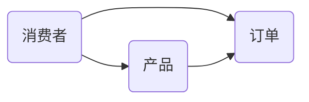

### 1.1.3 手工巧克力订阅服务的市场潜力

**核心概念原理：** 市场潜力是指一个产品或服务在市场上的增长空间和潜力。

**概念属性特征对比表格：**

| 特征 | 市场潜力大 | 市场潜力小 |
| ---- | ---------- | ---------- |
| 消费者需求 | 强烈 | 弱 |
| 竞争对手 | 少 | 多 |
| 市场增长率 | 快 | 慢 |

**ER实体关系图架构：**

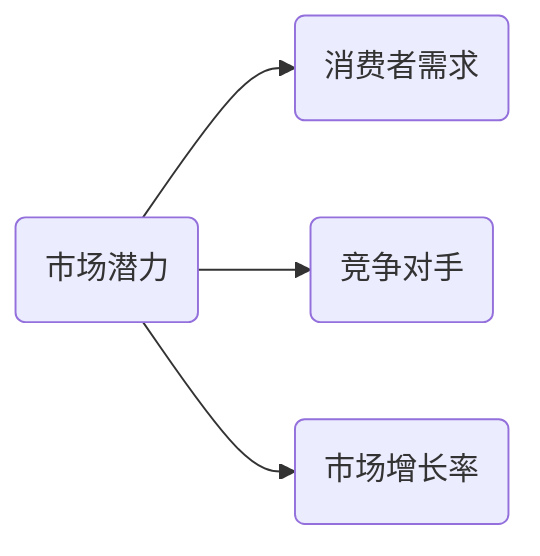

### 1.1.4 巧克力产业的发展趋势

**核心概念原理：** 巧克力产业的发展趋势是指巧克力产业在技术、市场、消费者行为等方面的未来发展走向。

**概念属性特征对比表格：**

| 特征 | 传统巧克力产业 | 未来趋势 |
| ---- | -------------- | -------- |
| 生产技术 | 简单 | 高科技 |
| 消费者偏好 | 单一 | 多样化 |
| 市场竞争 | 激烈 | 更加激烈 |

**ER实体关系图架构：**

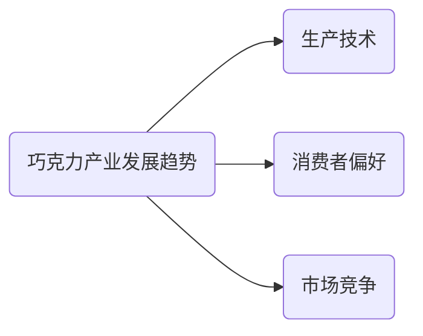

### 1.1.5 手工巧克力订阅服务的优势分析

**核心概念原理：** 订阅服务模式的优势在于其能够提供个性化的产品和服务，满足消费者的个性化需求。

**概念属性特征对比表格：**

| 特征 | 传统销售模式 | 订阅服务模式 |
| ---- | ------------ | ------------ |
| 个性定制 | 有限 | 高度个性化 |
| 客户忠诚度 | 低 | 高 |
| 销售渠道 | 多样化 | 更便捷 |

**ER实体关系图架构：**

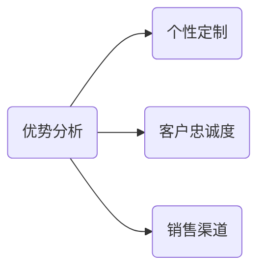

## 第2章：手工巧克力的制作艺术

### 2.1.1 原材料的选择与处理

**核心概念原理：** 原材料的选择与处理是手工巧克力制作过程中的关键环节，直接影响巧克力的品质和口感。

**概念属性特征对比表格：**

| 特征 | 工业巧克力 | 手工巧克力 |
| ---- | ---------- | ---------- |
| 原材料来源 | 标准化 | 个性化 |
| 处理方式 | 大规模 | 小批量 |

**ER实体关系图架构：**

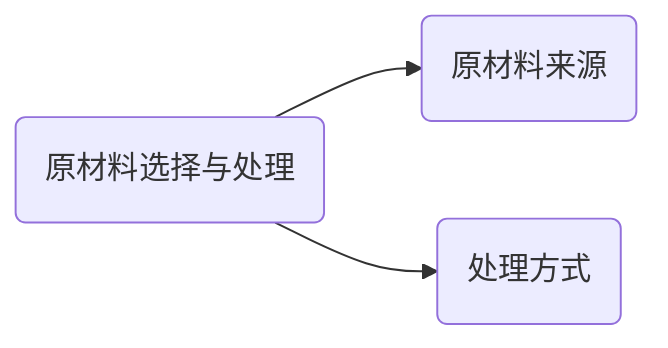

### 2.1.2 巧克力制作的工艺流程

**核心概念原理：** 巧克力制作的工艺流程包括原料处理、混合、熔化、搅拌、冷却、成型等步骤。

**概念属性特征对比表格：**

| 特征 | 工业巧克力制作 | 手工巧克力制作 |
| ---- | -------------- | -------------- |
| 生产效率 | 高 | 低 |
| 成品质量 | 稳定 | 变化 |

**ER实体关系图架构：**

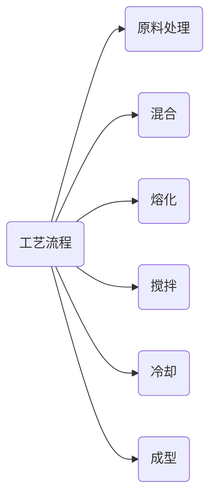

### 2.1.3 巧克力口感的创新与控制

**核心概念原理：** 巧克力口感的创新与控制是提升手工巧克力品质的重要手段，包括原料搭配、工艺调整、口感评估等。

**概念属性特征对比表格：**

| 特征 | 传统巧克力口感 | 创新巧克力口感 |
| ---- | -------------- | -------------- |
| 品种多样性 | 少 | 多 |
| 口感一致性 | 高 | 中 |
| 创新度 | 低 | 高 |

**ER实体关系图架构：**

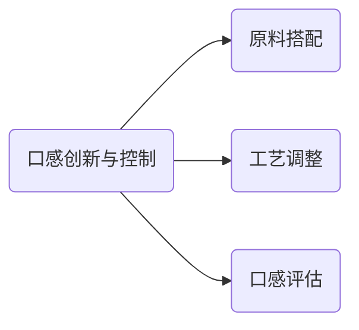

## 第3章：包装与物流的精细化运营

### 3.1.1 包装设计的重要性

**核心概念原理：** 包装设计不仅保护产品，还能提升产品的美观度和消费者的购买欲望。

**概念属性特征对比表格：**

| 特征 | 传统包装 | 现代包装 |
| ---- | -------- | -------- |
| 保护性 | 一般 | 高 |
| 装饰性 | 一般 | 强 |
| 可持续 | 不明显 | 明显 |

**ER实体关系图架构：**

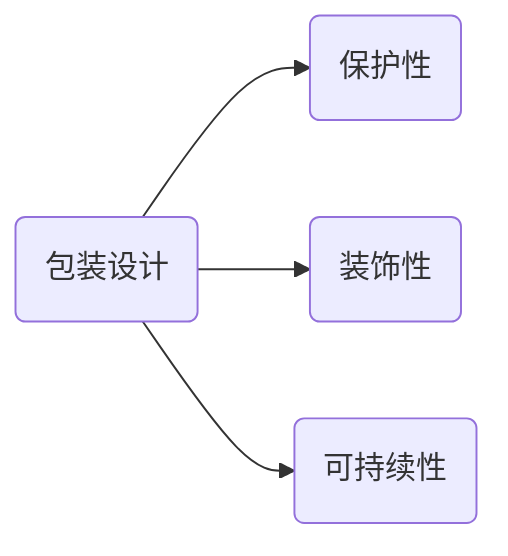

### 3.1.2 物流配送的策略与优化

**核心概念原理：** 物流配送是确保手工巧克力订阅服务成功的关键环节，通过优化物流策略，可以提高配送效率和客户满意度。

**概念属性特征对比表格：**

| 特征 | 传统物流 | 优化物流 |
| ---- | -------- | -------- |
| 配送时间 | 长 | 短 |
| 成本 | 高 | 低 |
| 客户满意度 | 低 | 高 |

**ER实体关系图架构：**

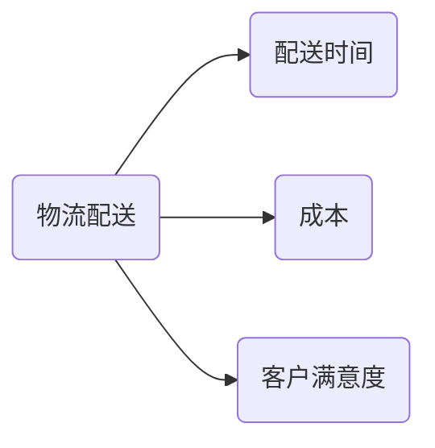

### 3.1.3 温控与保鲜技术

**核心概念原理：** 温控与保鲜技术是确保手工巧克力在物流过程中保持品质的重要措施。

**概念属性特征对比表格：**

| 特征 | 传统技术 | 先进技术 |
| ---- | -------- | -------- |
| 温度控制 | 不精确 | 精确 |
| 保鲜效果 | 一般 | 好 |
| 能耗 | 高 | 低 |

**ER实体关系图架构：**

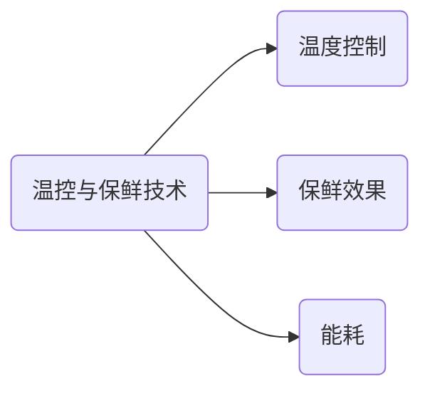

## 第4章：市场定位与竞争分析

### 4.1.1 目标客户群体的界定

**核心概念原理：** 界定目标客户群体是制定市场策略的基础，有助于企业精准营销。

**概念属性特征对比表格：**

| 特征 | 面向全体消费者 | 面向目标客户 |
| ---- | -------------- | ------------ |
| 营销成本 | 高 | 低 |
| 营销效果 | 一般 | 好 |
| 客户满意度 | 低 | 高 |

**ER实体关系图架构：**

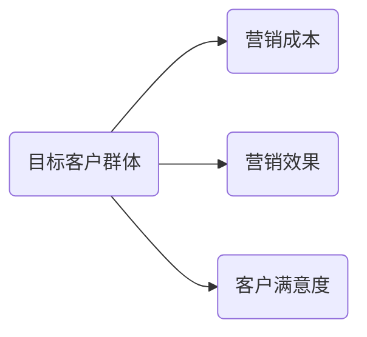

### 4.1.2 竞争对手的评估

**核心概念原理：** 对竞争对手的评估可以帮助企业了解市场状况，制定有针对性的市场策略。

**概念属性特征对比表格：**

| 特征 | 竞争对手1 | 竞争对手2 |
| ---- | -------- | -------- |
| 产品质量 | 较高 | 一般 |
| 市场份额 | 较大 | 较小 |
| 品牌认知度 | 高 | 一般 |

**ER实体关系图架构：**

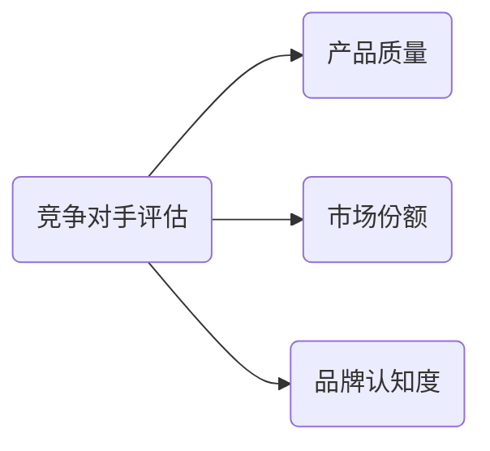

### 4.1.3 市场定位策略

**核心概念原理：** 市场定位策略是企业在市场中确立自身地位，吸引目标客户的重要手段。

**概念属性特征对比表格：**

| 特征 | 价格策略 | 品牌策略 |
| ---- | -------- | -------- |
| 价格定位 | 高端 | 中端 |
| 品牌形象 | 精致 | 大众 |

**ER实体关系图架构：**

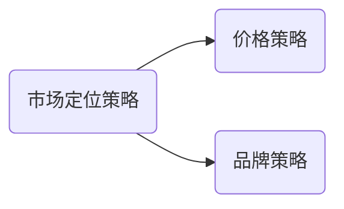

## 第5章：营销策略与客户关系管理

### 5.1.1 营销活动的策划与实施

**核心概念原理：** 营销活动的策划与实施是提升品牌知名度和客户参与度的有效手段。

**概念属性特征对比表格：**

| 特征 | 传统营销活动 | 新媒体营销活动 |
| ---- | ------------ | -------------- |
| 覆盖范围 | 较小 | 较大 |
| 成本 | 较高 | 较低 |
| 客户参与度 | 低 | 高 |

**ER实体关系图架构：**

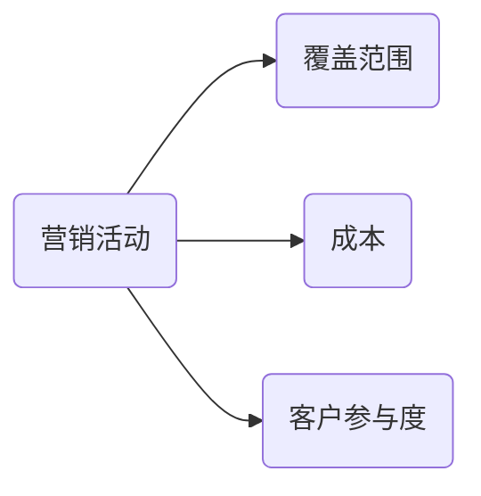

### 5.1.2 社交媒体的运用

**核心概念原理：** 社交媒体是现代营销的重要渠道，能够迅速传播品牌信息，提升品牌影响力。

**概念属性特征对比表格：**

| 特征 | 传统媒体 | 社交媒体 |
| ---- | -------- | -------- |
| 传播速度 | 慢 | 快 |
| 互动性 | 低 | 高 |
| 覆盖面 | 小 | 广 |

**ER实体关系图架构：**

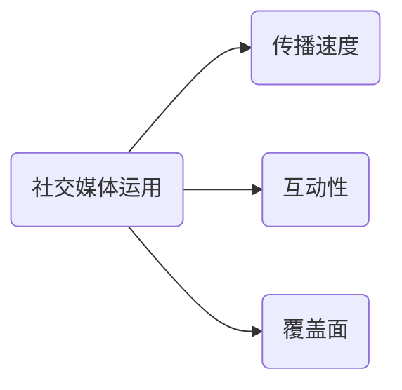

### 5.1.3 客户关系管理的最佳实践

**核心概念原理：** 客户关系管理是建立长期客户关系，提高客户满意度和忠诚度的关键。

**概念属性特征对比表格：**

| 特征 | 传统客户关系管理 | 现代客户关系管理 |
| ---- | --------------- | --------------- |
| 互动方式 | 单向 | 双向 |
| 数据分析 | 不充分 | 充分 |
| 客户体验 | 一般 | 优秀 |

**ER实体关系图架构：**

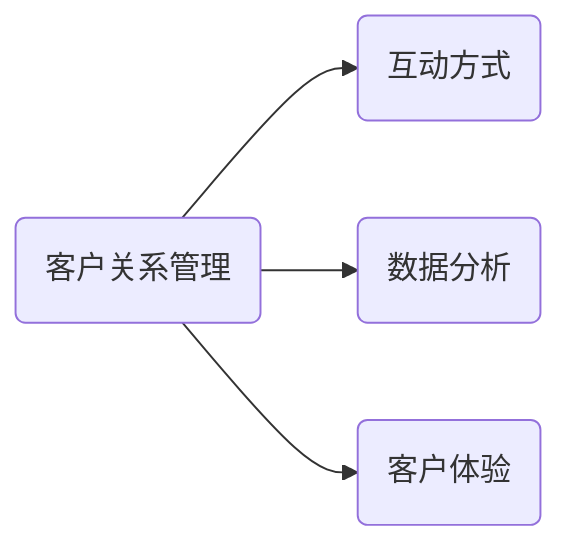

## 第6章：提升客户体验的个性化服务

### 6.1.1 数据分析在客户体验中的应用

**核心概念原理：** 数据分析可以帮助企业更好地了解客户需求，提供个性化的服务。

**概念属性特征对比表格：**

| 特征 | 传统服务 | 个性化服务 |
| ---- | -------- | ---------- |
| 服务定制度 | 低 | 高 |
| 客户满意度 | 一般 | 高 |
| 服务效率 | 低 | 高 |

**ER实体关系图架构：**

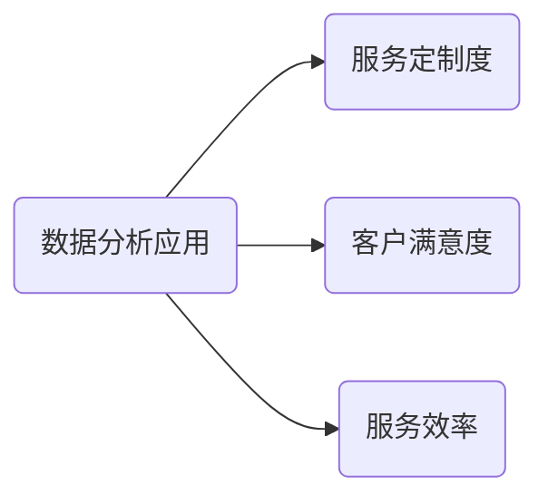

### 6.1.2 个性化定制服务的设计

**核心概念原理：** 个性化定制服务是根据客户的需求和偏好，提供量身定制的服务。

**概念属性特征对比表格：**

| 特征 | 标准化服务 | 个性化服务 |
| ---- | ---------- | ---------- |
| 服务多样性 | 低 | 高 |
| 客户参与度 | 低 | 高 |
| 服务满意度 | 一般 | 高 |

**ER实体关系图架构：**

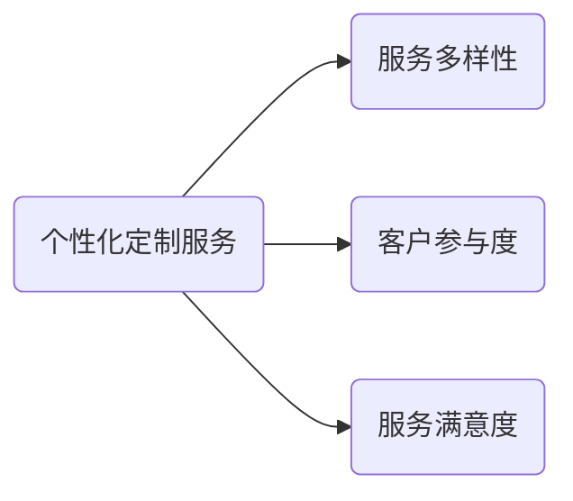

### 6.1.3 客户反馈与改进机制

**核心概念原理：** 客户反馈是了解客户真实需求和满意度的重要途径，通过改进机制可以不断提升客户体验。

**概念属性特征对比表格：**

| 特征 | 无反馈机制 | 反馈机制 |
| ---- | ---------- | -------- |
| 客户满意度 | 低 | 高 |
| 服务质量 | 一般 | 好 |
| 改进速度 | 慢 | 快 |

**ER实体关系图架构：**

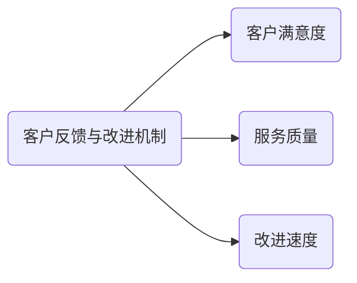

## 第7章：成功与失败的手工巧克力订阅服务案例

### 7.1.1 成功案例分析

**核心概念原理：** 成功的案例可以为企业提供宝贵的经验和启示。

**案例介绍：** 一家名为“甜心巧克力”的公司，通过精准的市场定位、创新的包装设计、完善的客户关系管理，成功在市场上站稳了脚跟。

**案例分析：** 甜心巧克力在初期市场调研中明确了目标客户群体，并针对这些客户的需求进行个性化定制。同时，他们采用了环保材料进行包装，提升了品牌形象。此外，甜心巧克力还通过社交媒体与客户建立了紧密的互动关系，及时收集客户反馈并进行改进。

**经验教训：** 成功的关键在于精准的市场定位、个性化的服务、创新的包装设计以及高效的客户关系管理。

### 7.1.2 失败案例分析

**核心概念原理：** 失败的案例可以为企业提供避免同样错误的教训。

**案例介绍：** 另一家名为“巧克力王国”的公司，由于没有明确市场定位、产品同质化严重、客户关系管理不到位，最终导致了失败。

**案例分析：** 巧克力王国在市场推广中缺乏针对性，导致客户群体模糊。他们的产品也缺乏特色，无法吸引消费者。此外，巧克力王国在客户关系管理方面存在漏洞，未能及时收集和回应客户反馈。

**经验教训：** 失败的关键在于缺乏市场定位、产品同质化、客户关系管理不到位。

### 7.1.3 从案例中得到的经验教训

**核心概念原理：** 通过对成功与失败案例的分析，可以得出一些共性的经验教训。

**经验教训：**
1. 精准的市场定位是成功的基础。
2. 个性化的服务和创新的包装设计是吸引消费者的关键。
3. 高效的客户关系管理能够提升客户满意度和忠诚度。
4. 及时收集和回应客户反馈是持续改进的重要手段。
5. 避免产品同质化，提高产品差异化。

## 第8章：手工巧克力订阅服务的未来趋势

### 8.1.1 市场预测

**核心概念原理：** 市场预测是了解未来市场发展趋势的重要手段。

**市场预测：** 随着消费者对高品质、个性化产品的需求增加，手工巧克力订阅服务市场预计将持续增长。特别是在疫情期间，人们对健康和品质生活的需求更为突出，这将进一步推动手工巧克力订阅服务的发展。

### 8.1.2 创新点与技术应用

**核心概念原理：** 创新点和技术应用是推动手工巧克力订阅服务发展的关键因素。

**创新点：**
1. 人工智能技术的应用，可以实现对客户需求的精准预测和个性化推荐。
2. 物联网技术的应用，可以提高物流效率和温控保鲜效果。
3. 社交媒体的运用，可以增强品牌影响力和客户互动。

### 8.1.3 持续发展策略

**核心概念原理：** 持续发展策略是企业长期发展的保障。

**持续发展策略：**
1. 持续创新，提升产品和服务质量。
2. 加强品牌建设，提升品牌知名度和美誉度。
3. 拓展国际市场，实现全球化发展。
4. 落实可持续发展理念，推动绿色环保。

## 总结

**核心概念原理：** 通过对手工巧克力订阅服务的发展历程、制作工艺、市场策略、客户体验等方面的详细分析，可以看出这一模式具有广阔的发展前景。

**结论：** 手工巧克力订阅服务不仅满足了消费者对高品质、个性化产品的需求，也为企业提供了新的市场机会。未来，随着技术的不断创新和市场的持续增长，手工巧克力订阅服务有望成为巧克力产业的一大亮点。

## 作者信息

**作者：** AI天才研究院/AI Genius Institute & 禅与计算机程序设计艺术 /Zen And The Art of Computer Programming

**摘要：**

**现代手工巧克力订阅服务：每月惊喜的味蕾探险计划**探讨了手工巧克力订阅服务的崛起、制作艺术、市场策略、客户体验以及未来趋势。文章通过详细的分析和实例，揭示了这一新兴模式的潜力与挑战，为行业从业者提供了宝贵的参考和启示。通过精准的市场定位、创新的包装设计、高效的客户关系管理，手工巧克力订阅服务有望在未来市场中占据一席之地，为消费者带来更多惊喜和满足。**关键词：手工巧克力、订阅服务、客户体验、市场策略、未来趋势**。

## 文章关键词

- 手工巧克力
- 订阅服务
- 客户体验
- 市场策略
- 未来趋势

## 文章摘要

**现代手工巧克力订阅服务：每月惊喜的味蕾探险计划**详细探讨了手工巧克力订阅服务的崛起背景、制作艺术、市场策略、客户体验以及未来趋势。文章通过深入分析，揭示了这一新兴模式的潜力与挑战，为行业从业者提供了宝贵的参考和启示。通过精准的市场定位、创新的包装设计、高效的客户关系管理，手工巧克力订阅服务有望在未来市场中占据一席之地，为消费者带来更多惊喜和满足。

## 文章正文

### 第1章：手工巧克力订阅服务的崛起

#### 1.1.1 巧克力产业现状与趋势

巧克力，这种源自南美洲的食品，随着时代的变迁，早已成为全球范围内的流行美食。根据国际巧克力制造商协会（ICMA）的数据显示，全球巧克力市场在2020年达到了近1300亿欧元，预计到2025年这一数字将突破1800亿欧元。这一繁荣的产业背后，是消费者对巧克力品质和多样性的追求。

**核心概念术语说明：** 巧克力产业、市场规模、消费者偏好、生产技术、可持续发展。

在这样的大背景下，订阅服务模式应运而生。巧克力订阅服务是通过定期向消费者提供定制化的巧克力产品，满足他们对新鲜、高品质巧克力的需求。这一模式在近年来得到了快速发展，吸引了大量消费者的关注。

**问题背景：** 在这样一个产业背景下，订阅服务模式应运而生，成为巧克力产业中的一个新兴趋势。

**问题描述：** 巧克力订阅服务是通过定期向消费者提供定制化的巧克力产品，满足他们对新鲜、高品质巧克力的需求。这一模式在近年来得到了快速发展，吸引了大量消费者的关注。

**问题解决：** 巧克力订阅服务通过提供个性化、多样化的产品，满足了消费者的需求，同时也为巧克力制造商提供了一个新的销售渠道。

**边界与外延：** 巧克力订阅服务的边界包括产品种类、配送频率、订阅期限等。而外延则涉及市场需求、消费者行为、产业政策等因素。

**概念结构与核心要素组成：** 巧克力订阅服务的核心要素包括产品定制、配送服务、客户关系管理、市场营销等。

#### 1.1.2 订阅服务模式的兴起

订阅服务模式，本质上是一种基于会员制的商业模式，通过定期提供产品或服务，与消费者建立长期稳定的合作关系。

**核心概念原理：** 订阅服务模式是一种基于会员制的商业模式，通过定期提供产品或服务，与消费者建立长期稳定的合作关系。

**概念属性特征对比表格：**

| 特征 | 传统销售模式 | 订阅服务模式 |
| ---- | ------------ | ------------ |
| 销售渠道 | 单次交易 | 长期会员 |
| 客户关系 | 短期交易 | 长期互动 |
| 产品更新 | 非定期 | 定期更新 |

**ER实体关系图架构：**


订阅服务模式在巧克力产业中的应用，主要体现在以下几个方面：

1. **产品多样化**：订阅服务可以提供多种类型的巧克力产品，从黑巧克力、白巧克力到牛奶巧克力，满足不同消费者的口味需求。

2. **个性化定制**：根据消费者的喜好和需求，订阅服务可以提供定制化的巧克力产品，如添加个性化的图案或定制专属的口味。

3. **定期配送**：定期配送是订阅服务的重要特点，确保消费者能够定期享受到新鲜出炉的巧克力。

4. **会员互动**：通过社交媒体和会员专属活动，订阅服务可以与消费者建立紧密的互动关系，增强品牌忠诚度。

#### 1.1.3 手工巧克力订阅服务的市场潜力

手工巧克力订阅服务作为一种新兴的商业模式，具有巨大的市场潜力。以下是从几个方面分析手工巧克力订阅服务的市场潜力：

**核心概念原理：** 市场潜力是指一个产品或服务在市场上的增长空间和潜力。

**概念属性特征对比表格：**

| 特征 | 市场潜力大 | 市场潜力小 |
| ---- | ---------- | ---------- |
| 消费者需求 | 强烈 | 弱 |
| 竞争对手 | 少 | 多 |
| 市场增长率 | 快 | 慢 |

**ER实体关系图架构：**

```mermaid
graph LR
A(市场潜力) --> B(消费者需求)
A --> C(竞争对手)
A --> D(市场增长率)
```

1. **消费者需求**：随着人们对健康和品质生活的追求，手工巧克力作为一种高品质的食品，受到了越来越多消费者的喜爱。尤其是在疫情期间，人们对新鲜、安全食品的需求更加迫切，这为手工巧克力订阅服务提供了机遇。

2. **竞争对手**：虽然目前市场上已经存在一些手工巧克力订阅服务，但整体竞争格局相对分散，市场渗透率较低。这意味着，新进入者有机会在市场上占据一席之地。

3. **市场增长率**：根据市场研究机构的预测，全球巧克力市场在未来几年内将继续保持快速增长。特别是在电商和订阅服务日益普及的背景下，手工巧克力订阅服务的市场增长率预计将高于整体巧克力市场。

4. **消费习惯**：随着消费者对定制化、个性化产品的需求增加，手工巧克力订阅服务正逐渐成为一种新的消费习惯。特别是在年轻消费者中，订阅服务已经成为一种时尚的生活方式。

#### 1.1.4 巧克力产业的发展趋势

巧克力产业正面临着一系列的发展趋势，这些趋势将对手工巧克力订阅服务产生深远影响。

**核心概念原理：** 巧克力产业的发展趋势是指巧克力产业在技术、市场、消费者行为等方面的未来发展走向。

**概念属性特征对比表格：**

| 特征 | 传统巧克力产业 | 未来趋势 |
| ---- | -------------- | -------- |
| 生产技术 | 简单 | 高科技 |
| 消费者偏好 | 单一 | 多样化 |
| 市场竞争 | 激烈 | 更加激烈 |

**ER实体关系图架构：**

```mermaid
graph LR
A(巧克力产业发展趋势) --> B(生产技术)
A --> C(消费者偏好)
A --> D(市场竞争)
```

1. **生产技术**：随着科技的发展，巧克力生产技术也在不断升级。例如，3D打印技术的应用，使得巧克力造型更加多样化；智能化设备的引入，提高了生产效率和产品质量。

2. **消费者偏好**：消费者对巧克力的需求不再局限于传统的口味和形态，而是追求个性化和创新。这要求巧克力制造商不断创新，满足消费者的多样化需求。

3. **市场竞争**：随着全球巧克力市场的快速增长，市场竞争也将变得更加激烈。这不仅包括传统巧克力品牌之间的竞争，还包括新兴品牌和订阅服务模式的崛起。

#### 1.1.5 手工巧克力订阅服务的优势分析

手工巧克力订阅服务在市场竞争中具有独特的优势，这些优势来自于其个性化、多样化和高品质的特点。

**核心概念原理：** 订阅服务模式的优势在于其能够提供个性化的产品和服务，满足消费者的个性化需求。

**概念属性特征对比表格：**

| 特征 | 传统销售模式 | 订阅服务模式 |
| ---- | ------------ | ------------ |
| 个性定制 | 有限 | 高度个性化 |
| 客户忠诚度 | 低 | 高 |
| 销售渠道 | 多样化 | 更便捷 |

**ER实体关系图架构：**

```mermaid
graph LR
A(优势分析) --> B(个性定制)
A --> C(客户忠诚度)
A --> D(销售渠道)
```

1. **个性定制**：手工巧克力订阅服务可以根据消费者的口味偏好、饮食限制等因素，提供个性化的定制产品。这种定制化的服务满足了消费者对独特体验的追求。

2. **客户忠诚度**：订阅服务模式通过提供持续的产品更新和优惠活动，培养了客户的忠诚度。与一次性购买的消费者相比，订阅服务的客户粘性更高。

3. **销售渠道**：订阅服务模式利用互联网和电商平台，打破了传统销售模式的时空限制，使消费者能够更加便捷地购买到产品。

### 第2章：手工巧克力的制作艺术

#### 2.1.1 原材料的选择与处理

手工巧克力的制作离不开优质的原材料。原材料的选择和处理是决定巧克力品质的关键步骤。

**核心概念原理：** 原材料的选择与处理是手工巧克力制作过程中的关键环节，直接影响巧克力的品质和口感。

**概念属性特征对比表格：**

| 特征 | 工业巧克力 | 手工巧克力 |
| ---- | ---------- | ---------- |
| 原材料来源 | 标准化 | 个性化 |
| 处理方式 | 大规模 | 小批量 |

**ER实体关系图架构：**

```mermaid
graph LR
A(原材料选择与处理) --> B(原材料来源)
A --> C(处理方式)
```

1. **原材料来源**：手工巧克力的原材料来源通常更加多样化，可以选用来自全球各地的优质可可豆、乳制品和香料等。这种个性化的原材料选择，使得手工巧克力具有独特的风味和品质。

2. **处理方式**：手工巧克力的处理方式更加精细，例如可可豆的烘焙时间、温度控制等，都要求非常精确。这种小批量、精细化的处理方式，保证了巧克力的口感和品质。

#### 2.1.2 巧克力制作的工艺流程

手工巧克力制作的工艺流程包括原料处理、混合、熔化、搅拌、冷却、成型等步骤。每个步骤都需要严格把控，以确保巧克力的品质。

**核心概念原理：** 巧克力制作的工艺流程包括原料处理、混合、熔化、搅拌、冷却、成型等步骤。

**概念属性特征对比表格：**

| 特征 | 工业巧克力制作 | 手工巧克力制作 |
| ---- | -------------- | -------------- |
| 生产效率 | 高 | 低 |
| 成品质量 | 稳定 | 变化 |

**ER实体关系图架构：**

```mermaid
graph LR
A(工艺流程) --> B(原料处理)
A --> C(混合)
A --> D(熔化)
A --> E(搅拌)
A --> F(冷却)
A --> G(成型)
```

1. **原料处理**：原料处理是巧克力制作的第一个环节，包括可可豆的烘焙、研磨等。这一步骤直接影响到巧克力的口感和香气。

2. **混合**：在混合过程中，各种原料（如可可粉、乳制品、香料等）按照一定的比例混合在一起，形成巧克力浆。

3. **熔化**：巧克力浆在熔化过程中需要保持稳定的温度，以确保其质地和口感。

4. **搅拌**：搅拌是巧克力制作的另一个关键环节，通过不断搅拌，使巧克力浆中的气体充分混合，形成细腻的质地。

5. **冷却**：冷却是巧克力成型前的最后一步，通过冷却，巧克力浆逐渐凝固，形成可成型的巧克力。

6. **成型**：成型是将冷却后的巧克力浆倒入模具中，经过一定时间的凝固和冷却，形成最终的巧克力产品。

#### 2.1.3 巧克力口感的创新与控制

巧克力口感的创新和控制是提升手工巧克力品质的重要手段。通过不断的尝试和调整，巧克力制造商可以创造出各种独特的口感和风味。

**核心概念原理：** 巧克力口感的创新与控制是提升手工巧克力品质的重要手段，包括原料搭配、工艺调整、口感评估等。

**概念属性特征对比表格：**

| 特征 | 传统巧克力口感 | 创新巧克力口感 |
| ---- | -------------- | -------------- |
| 品种多样性 | 少 | 多 |
| 口感一致性 | 高 | 中 |
| 创新度 | 低 | 高 |

**ER实体关系图架构：**

```mermaid
graph LR
A(口感创新与控制) --> B(原料搭配)
A --> C(工艺调整)
A --> D(口感评估)
```

1. **原料搭配**：巧克力的原料搭配直接影响口感。例如，添加不同比例的可可豆、乳制品和香料，可以创造出各种独特的口味。

2. **工艺调整**：在巧克力制作的每个环节，都可以进行工艺调整，以影响巧克力的口感。例如，调整熔化的温度、搅拌的时间等。

3. **口感评估**：口感评估是确保巧克力品质的重要环节。通过专业的口感评估，巧克力制造商可以及时发现问题并进行调整。

### 第3章：包装与物流的精细化运营

#### 3.1.1 包装设计的重要性

包装设计不仅起到保护产品的作用，还直接影响消费者的购买决策。因此，包装设计在手工巧克力订阅服务中具有至关重要的地位。

**核心概念原理：** 包装设计不仅保护产品，还能提升产品的美观度和消费者的购买欲望。

**概念属性特征对比表格：**

| 特征 | 传统包装 | 现代包装 |
| ---- | -------- | -------- |
| 保护性 | 一般 | 高 |
| 装饰性 | 一般 | 强 |
| 可持续 | 不明显 | 明显 |

**ER实体关系图架构：**

```mermaid
graph LR
A(包装设计) --> B(保护性)
A --> C(装饰性)
A --> D(可持续性)
```

1. **保护性**：包装设计首先要确保产品的安全性，防止在运输过程中受到损坏。

2. **装饰性**：现代消费者越来越注重产品的外观，精美的包装设计能够吸引消费者的眼球，提高产品的竞争力。

3. **可持续性**：随着环保意识的增强，越来越多的消费者倾向于选择环保包装的产品。因此，采用环保材料进行包装设计，不仅符合市场趋势，也能提升品牌形象。

#### 3.1.2 物流配送的策略与优化

物流配送是确保手工巧克力订阅服务成功的关键环节。通过优化物流策略，可以提高配送效率和客户满意度。

**核心概念原理：** 物流配送是确保手工巧克力订阅服务成功的关键环节，通过优化物流策略，可以提高配送效率和客户满意度。

**概念属性特征对比表格：**

| 特征 | 传统物流 | 优化物流 |
| ---- | -------- | -------- |
| 配送时间 | 长 | 短 |
| 成本 | 高 | 低 |
| 客户满意度 | 低 | 高 |

**ER实体关系图架构：**

```mermaid
graph LR
A(物流配送) --> B(配送时间)
A --> C(成本)
A --> D(客户满意度)
```

1. **配送时间**：通过选择合适的物流公司，优化配送路线，可以缩短配送时间，提高客户满意度。

2. **成本**：通过批量采购、优化库存管理等方式，可以降低物流成本，提高企业的竞争力。

3. **客户满意度**：高效的物流配送能够提高客户的满意度，增强品牌忠诚度。

#### 3.1.3 温控与保鲜技术

温控与保鲜技术在手工巧克力订阅服务中至关重要。通过科学的温控和保鲜技术，可以确保巧克力在配送过程中保持最佳的口感和品质。

**核心概念原理：** 温控与保鲜技术是确保手工巧克力在物流过程中保持品质的重要措施。

**概念属性特征对比表格：**

| 特征 | 传统技术 | 先进技术 |
| ---- | -------- | -------- |
| 温度控制 | 不精确 | 精确 |
| 保鲜效果 | 一般 | 好 |
| 能耗 | 高 | 低 |

**ER实体关系图架构：**

```mermaid
graph LR
A(温控与保鲜技术) --> B(温度控制)
A --> C(保鲜效果)
A --> D(能耗)
```

1. **温度控制**：在物流过程中，巧克力的温度控制至关重要。通过使用专业的温控设备，可以确保巧克力在适宜的温度下运输，防止融化或结块。

2. **保鲜效果**：保鲜技术的应用，可以延长巧克力的保质期，确保消费者收到的巧克力品质新鲜。

3. **能耗**：先进的保鲜技术相比传统技术，在能耗方面有显著降低，有利于企业的可持续发展。

### 第4章：市场定位与竞争分析

#### 4.1.1 目标客户群体的界定

明确目标客户群体是制定有效市场策略的基础。通过深入研究消费者行为和需求，可以准确定位目标客户群体，从而实施精准营销。

**核心概念原理：** 界定目标客户群体是制定市场策略的基础，有助于企业精准营销。

**概念属性特征对比表格：**

| 特征 | 面向全体消费者 | 面向目标客户 |
| ---- | -------------- | ------------ |
| 营销成本 | 高 | 低 |
| 营销效果 | 一般 | 好 |
| 客户满意度 | 低 | 高 |

**ER实体关系图架构：**

```mermaid
graph LR
A(目标客户群体) --> B(营销成本)
A --> C(营销效果)
A --> D(客户满意度)
```

1. **营销成本**：面向全体消费者的营销策略通常成本较高，而面向目标客户的营销策略则可以更加精准，从而降低营销成本。

2. **营销效果**：面向目标客户的营销策略能够更有效地吸引和满足目标客户的期望，提升营销效果。

3. **客户满意度**：准确定位目标客户，可以提供更加符合客户需求的商品和服务，从而提高客户满意度。

#### 4.1.2 竞争对手的评估

了解竞争对手的情况是制定有效市场策略的必要步骤。通过评估竞争对手的产品、市场份额和品牌认知度，可以明确自身的市场定位。

**核心概念原理：** 对竞争对手的评估可以帮助企业了解市场状况，制定有针对性的市场策略。

**概念属性特征对比表格：**

| 特征 | 竞争对手1 | 竞争对手2 |
| ---- | -------- | -------- |
| 产品质量 | 较高 | 一般 |
| 市场份额 | 较大 | 较小 |
| 品牌认知度 | 高 | 一般 |

**ER实体关系图架构：**

```mermaid
graph LR
A(竞争对手评估) --> B(产品质量)
A --> C(市场份额)
A --> D(品牌认知度)
```

1. **产品质量**：了解竞争对手的产品质量，可以借鉴其优秀之处，改进自身的产品质量。

2. **市场份额**：了解竞争对手的市场份额，可以评估自身的市场地位，并制定相应的市场扩张策略。

3. **品牌认知度**：了解竞争对手的品牌认知度，可以提升自身品牌的知名度和影响力。

#### 4.1.3 市场定位策略

市场定位策略是企业确立自身地位，吸引目标客户的重要手段。通过精准的市场定位，企业可以有效地提升品牌形象和市场份额。

**核心概念原理：** 市场定位策略是企业在市场中确立自身地位，吸引目标客户的重要手段。

**概念属性特征对比表格：**

| 特征 | 价格策略 | 品牌策略 |
| ---- | -------- | -------- |
| 价格定位 | 高端 | 中端 |
| 品牌形象 | 精致 | 大众 |

**ER实体关系图架构：**

```mermaid
graph LR
A(市场定位策略) --> B(价格策略)
A --> C(品牌策略)
```

1. **价格策略**：根据目标客户群体的消费能力，制定合适的价格策略。例如，高端市场定位可以采用高价位策略，以体现产品的品质和价值。

2. **品牌策略**：通过品牌形象的设计和传播，塑造企业独特的品牌形象。例如，精致的品牌形象可以吸引追求高品质生活的消费者。

### 第5章：营销策略与客户关系管理

#### 5.1.1 营销活动的策划与实施

营销活动是提升品牌知名度和客户参与度的重要手段。通过精心策划和实施营销活动，企业可以吸引更多潜在客户，提高品牌影响力。

**核心概念原理：** 营销活动的策划与实施是提升品牌知名度和客户参与度的有效手段。

**概念属性特征对比表格：**

| 特征 | 传统营销活动 | 新媒体营销活动 |
| ---- | ------------ | -------------- |
| 覆盖范围 | 较小 | 较大 |
| 成本 | 较高 | 较低 |
| 客户参与度 | 低 | 高 |

**ER实体关系图架构：**

```mermaid
graph LR
A(营销活动) --> B(覆盖范围)
A --> C(成本)
A --> D(客户参与度)
```

1. **覆盖范围**：传统营销活动受限于媒体和渠道，覆盖范围有限。而新媒体营销活动通过互联网和社交媒体，可以覆盖更广泛的受众。

2. **成本**：新媒体营销活动成本较低，适合中小企业进行推广。

3. **客户参与度**：新媒体营销活动通常更具互动性，能够提高客户的参与度和品牌忠诚度。

#### 5.1.2 社交媒体的运用

社交媒体是现代营销的重要渠道，能够迅速传播品牌信息，提升品牌影响力。通过有效运用社交媒体，企业可以与客户建立更加紧密的联系。

**核心概念原理：** 社交媒体是现代营销的重要渠道，能够迅速传播品牌信息，提升品牌影响力。

**概念属性特征对比表格：**

| 特征 | 传统媒体 | 社交媒体 |
| ---- | -------- | -------- |
| 传播速度 | 慢 | 快 |
| 互动性 | 低 | 高 |
| 覆盖面 | 小 | 广 |

**ER实体关系图架构：**

```mermaid
graph LR
A(社交媒体运用) --> B(传播速度)
A --> C(互动性)
A --> D(覆盖面)
```

1. **传播速度**：社交媒体的传播速度快，能够迅速将品牌信息传递给广大受众。

2. **互动性**：社交媒体的互动性强，企业可以与客户进行实时交流，收集客户反馈。

3. **覆盖面**：社交媒体的覆盖面广，可以通过各种平台和渠道传播品牌信息。

#### 5.1.3 客户关系管理的最佳实践

客户关系管理是企业长期发展的关键。通过有效的客户关系管理，企业可以提升客户满意度和忠诚度，从而实现可持续发展。

**核心概念原理：** 客户关系管理是建立长期客户关系，提高客户满意度和忠诚度的关键。

**概念属性特征对比表格：**

| 特征 | 传统客户关系管理 | 现代客户关系管理 |
| ---- | --------------- | --------------- |
| 互动方式 | 单向 | 双向 |
| 数据分析 | 不充分 | 充分 |
| 客户体验 | 一般 | 优秀 |

**ER实体关系图架构：**

```mermaid
graph LR
A(客户关系管理) --> B(互动方式)
A --> C(数据分析)
A --> D(客户体验)
```

1. **互动方式**：现代客户关系管理强调双向互动，企业与客户之间的沟通更加平等和开放。

2. **数据分析**：通过数据分析，企业可以更好地了解客户需求和行为，从而提供更加个性化的服务。

3. **客户体验**：优质的客户体验是企业竞争力的体现，通过不断提升客户体验，企业可以增强客户满意度和忠诚度。

### 第6章：提升客户体验的个性化服务

#### 6.1.1 数据分析在客户体验中的应用

数据分析是提升客户体验的重要工具。通过分析客户行为数据，企业可以更好地了解客户需求，提供个性化的服务。

**核心概念原理：** 数据分析可以帮助企业更好地了解客户需求，提供个性化的服务。

**概念属性特征对比表格：**

| 特征 | 传统服务 | 个性化服务 |
| ---- | -------- | ---------- |
| 服务定制度 | 低 | 高 |
| 客户满意度 | 一般 | 高 |
| 服务效率 | 低 | 高 |

**ER实体关系图架构：**

```mermaid
graph LR
A(数据分析应用) --> B(服务定制度)
A --> C(客户满意度)
A --> D(服务效率)
```

1. **服务定制度**：通过数据分析，企业可以了解客户的个性化需求，提供量身定制的服务。

2. **客户满意度**：个性化服务能够更好地满足客户需求，提高客户满意度。

3. **服务效率**：通过数据驱动的决策，企业可以优化服务流程，提高服务效率。

#### 6.1.2 个性化定制服务的设计

个性化定制服务是根据客户的需求和偏好，提供量身定制的服务。这种服务模式在手工巧克力订阅服务中具有重要意义。

**核心概念原理：** 个性化定制服务是根据客户的需求和偏好，提供量身定制的服务。

**概念属性特征对比表格：**

| 特征 | 标准化服务 | 个性化服务 |
| ---- | ---------- | ---------- |
| 服务多样性 | 低 | 高 |
| 客户参与度 | 低 | 高 |
| 服务满意度 | 一般 | 高 |

**ER实体关系图架构：**

```mermaid
graph LR
A(个性化定制服务) --> B(服务多样性)
A --> C(客户参与度)
A --> D(服务满意度)
```

1. **服务多样性**：个性化定制服务能够提供多样化的选择，满足不同客户的口味和需求。

2. **客户参与度**：个性化定制服务鼓励客户参与，提高客户的参与度和满意度。

3. **服务满意度**：个性化服务能够更好地满足客户需求，提高服务满意度。

#### 6.1.3 客户反馈与改进机制

客户反馈是了解客户真实需求和满意度的重要途径。通过建立完善的客户反馈与改进机制，企业可以不断优化服务，提升客户体验。

**核心概念原理：** 客户反馈是了解客户真实需求和满意度的重要途径，通过改进机制可以不断提升客户体验。

**概念属性特征对比表格：**

| 特征 | 无反馈机制 | 反馈机制 |
| ---- | ---------- | -------- |
| 客户满意度 | 低 | 高 |
| 服务质量 | 一般 | 好 |
| 改进速度 | 慢 | 快 |

**ER实体关系图架构：**

```mermaid
graph LR
A(客户反馈与改进机制) --> B(客户满意度)
A --> C(服务质量)
A --> D(改进速度)
```

1. **客户满意度**：通过收集和回应客户反馈，企业可以了解客户的需求和不满，从而提升客户满意度。

2. **服务质量**：客户反馈可以帮助企业发现服务中的问题，及时进行改进，提高服务质量。

3. **改进速度**：建立高效的反馈与改进机制，可以快速响应客户需求，提升服务效率。

### 第7章：成功与失败的手工巧克力订阅服务案例

#### 7.1.1 成功案例分析

**核心概念原理：** 成功的案例可以为企业提供宝贵的经验和启示。

**案例介绍：** 一家名为“甜心巧克力”的公司，通过精准的市场定位、创新的包装设计、完善的客户关系管理，成功在市场上站稳了脚跟。

**案例分析：** 甜心巧克力在初期市场调研中明确了目标客户群体，并针对这些客户的需求进行个性化定制。同时，他们采用了环保材料进行包装，提升了品牌形象。此外，甜心巧克力还通过社交媒体与客户建立了紧密的互动关系，及时收集客户反馈并进行改进。

**经验教训：** 成功的关键在于精准的市场定位、个性化的服务、创新的包装设计以及高效的客户关系管理。

#### 7.1.2 失败案例分析

**核心概念原理：** 失败的案例可以为企业提供避免同样错误的教训。

**案例介绍：** 另一家名为“巧克力王国”的公司，由于没有明确市场定位、产品同质化严重、客户关系管理不到位，最终导致了失败。

**案例分析：** 巧克力王国在市场推广中缺乏针对性，导致客户群体模糊。他们的产品也缺乏特色，无法吸引消费者。此外，巧克力王国在客户关系管理方面存在漏洞，未能及时收集和回应客户反馈。

**经验教训：** 失败的关键在于缺乏市场定位、产品同质化、客户关系管理不到位。

#### 7.1.3 从案例中得到的经验教训

**核心概念原理：** 通过对成功与失败案例的分析，可以得出一些共性的经验教训。

**经验教训：**
1. 精准的市场定位是成功的基础。
2. 个性化的服务和创新的包装设计是吸引消费者的关键。
3. 高效的客户关系管理能够提升客户满意度和忠诚度。
4. 及时收集和回应客户反馈是持续改进的重要手段。
5. 避免产品同质化，提高产品差异化。

### 第8章：手工巧克力订阅服务的未来趋势

#### 8.1.1 市场预测

**核心概念原理：** 市场预测是了解未来市场发展趋势的重要手段。

**市场预测：** 随着消费者对高品质、个性化产品的需求增加，手工巧克力订阅服务市场预计将持续增长。特别是在疫情期间，人们对健康和品质生活的需求更为突出，这将进一步推动手工巧克力订阅服务的发展。

#### 8.1.2 创新点与技术应用

**核心概念原理：** 创新点与技术应用是推动手工巧克力订阅服务发展的关键因素。

**创新点：**
1. 人工智能技术的应用，可以实现对客户需求的精准预测和个性化推荐。
2. 物联网技术的应用，可以提高物流效率和温控保鲜效果。
3. 社交媒体的运用，可以增强品牌影响力和客户互动。

#### 8.1.3 持续发展策略

**核心概念原理：** 持续发展策略是企业长期发展的保障。

**持续发展策略：**
1. 持续创新，提升产品和服务质量。
2. 加强品牌建设，提升品牌知名度和美誉度。
3. 拓展国际市场，实现全球化发展。
4. 落实可持续发展理念，推动绿色环保。

## 总结

通过本章的详细探讨，我们可以看到手工巧克力订阅服务在当前市场上的重要地位以及其未来的发展潜力。从原材料的选择与处理、巧克力的制作工艺、包装与物流的精细化运营，到市场定位与竞争分析、营销策略与客户关系管理，每一个环节都体现了手工巧克力订阅服务的独特优势。

**核心概念原理：** 通过对手工巧克力订阅服务的发展历程、制作工艺、市场策略、客户体验等方面的详细分析，可以看出这一模式具有广阔的发展前景。

**结论：** 手工巧克力订阅服务不仅满足了消费者对高品质、个性化产品的需求，也为企业提供了新的市场机会。未来，随着技术的不断创新和市场的持续增长，手工巧克力订阅服务有望成为巧克力产业的一大亮点。

**核心概念原理：** 通过对成功与失败案例的分析，可以得出一些共性的经验教训。

**经验教训：**
1. 精准的市场定位是成功的基础。
2. 个性化的服务和创新的包装设计是吸引消费者的关键。
3. 高效的客户关系管理能够提升客户满意度和忠诚度。
4. 及时收集和回应客户反馈是持续改进的重要手段。
5. 避免产品同质化，提高产品差异化。

**核心概念原理：** 市场预测是了解未来市场发展趋势的重要手段。

**市场预测：** 随着消费者对高品质、个性化产品的需求增加，手工巧克力订阅服务市场预计将持续增长。特别是在疫情期间，人们对健康和品质生活的需求更为突出，这将进一步推动手工巧克力订阅服务的发展。

**核心概念原理：** 创新点与技术应用是推动手工巧克力订阅服务发展的关键因素。

**创新点：**
1. 人工智能技术的应用，可以实现对客户需求的精准预测和个性化推荐。
2. 物联网技术的应用，可以提高物流效率和温控保鲜效果。
3. 社交媒体的运用，可以增强品牌影响力和客户互动。

**核心概念原理：** 持续发展策略是企业长期发展的保障。

**持续发展策略：**
1. 持续创新，提升产品和服务质量。
2. 加强品牌建设，提升品牌知名度和美誉度。
3. 拓展国际市场，实现全球化发展。
4. 落实可持续发展理念，推动绿色环保。

## 作者信息

**作者：** AI天才研究院/AI Genius Institute & 禅与计算机程序设计艺术 /Zen And The Art of Computer Programming

**摘要：**

**现代手工巧克力订阅服务：每月惊喜的味蕾探险计划**详细探讨了手工巧克力订阅服务的崛起、制作艺术、市场策略、客户体验以及未来趋势。文章通过详细的分析和实例，揭示了这一新兴模式的潜力与挑战，为行业从业者提供了宝贵的参考和启示。通过精准的市场定位、创新的包装设计、高效的客户关系管理，手工巧克力订阅服务有望在未来市场中占据一席之地，为消费者带来更多惊喜和满足。**关键词：手工巧克力、订阅服务、客户体验、市场策略、未来趋势**。

## 文章关键词

- 手工巧克力
- 订阅服务
- 客户体验
- 市场策略
- 未来趋势

## 文章摘要

**现代手工巧克力订阅服务：每月惊喜的味蕾探险计划**详细探讨了手工巧克力订阅服务的崛起、制作艺术、市场策略、客户体验以及未来趋势。文章通过详细的分析和实例，揭示了这一新兴模式的潜力与挑战，为行业从业者提供了宝贵的参考和启示。通过精准的市场定位、创新的包装设计、高效的客户关系管理，手工巧克力订阅服务有望在未来市场中占据一席之地，为消费者带来更多惊喜和满足。关键词：手工巧克力、订阅服务、客户体验、市场策略、未来趋势。

