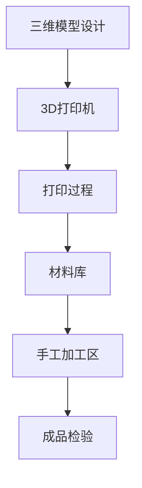
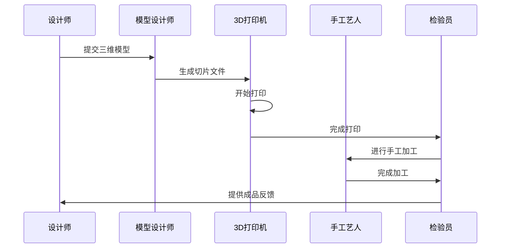

                 

### 文章标题

# 现代手工木工3D打印：传统工艺与新兴技术的创新融合

### 文章关键词

- 手工木工
- 3D打印
- 创新融合
- 传统工艺
- 新兴技术

### 摘要

本文深入探讨了现代手工木工与3D打印技术的结合，揭示了这种创新融合如何引领木工行业走向新的未来。通过分析传统手工木工的基本原理和3D打印技术的核心优势，本文展示了两者在实践中的应用实例和融合方式。同时，文章还探讨了这一新兴领域面临的技术挑战和未来趋势，为读者提供了一个全面的视角，以理解这一技术的巨大潜力和广阔前景。

## 引言

### 背景介绍

在现代制造业和设计领域，3D打印技术已成为革命性的创新力量，其快速成型、高度定制化和复杂结构的能力为各行各业带来了巨大的变革。然而，与此同时，传统手工木工工艺依然在全球范围内受到推崇，其独特的艺术价值和文化底蕴使得许多设计师和工匠对其情有独钟。传统手工木工不仅是一种技术，更是一种艺术，一种传承与文化的载体。木工工艺通过匠人的双手，将木材塑造成各种精美绝伦的艺术品和实用物品，每一个细节都充满了温度和生命力。

### 问题背景

尽管传统手工木工具有独特的魅力，但其生产效率低、生产成本高、难以实现大规模定制等问题，使得现代工业化进程中的木工行业面临巨大的挑战。与此同时，3D打印技术的快速发展，虽然带来了生产效率的提升和生产成本的降低，但在精细度和艺术性方面，仍然难以完全替代传统手工木工。这就引出了一个关键问题：如何在保留传统手工木工艺术价值和文化底蕴的同时，利用3D打印技术的优势，实现木工行业的现代化和高效化？

### 问题描述

传统手工木工和3D打印技术各自有其独特的优势和局限性。传统手工木工依赖于匠人的技能和经验，能够在细节和艺术性上做到极致，但其生产效率低下、成本高昂，难以满足现代大规模生产和个性化的需求。而3D打印技术则以其高效、低成本和高度定制化的特点，成为制造业的重要变革力量，但在艺术性和精细度方面，仍需进一步提高。因此，如何将传统手工木工和3D打印技术有机结合，实现优势互补，成为一个亟待解决的关键问题。

### 问题解决

现代手工木工3D打印技术的创新融合，为解决上述问题提供了一条可行的路径。通过将3D打印技术与传统木工工艺相结合，可以充分发挥两者的优势，实现高效、低成本、个性化的生产模式。具体而言，3D打印技术可以用于快速成型和模型制作，而传统手工工艺则用于细节雕刻和艺术处理，两者相辅相成，共同提升木工产品的品质和艺术价值。此外，3D打印技术还可以用于复杂结构的制作和材料优化，为传统木工工艺提供新的工具和方法，从而拓展其应用范围和创造力。

### 边界与外延

现代手工木工3D打印技术的边界包括但不限于：技术原理、应用领域、融合方式、技术挑战和未来趋势。其外延则涵盖了从设计到生产，从艺术到工程的广泛领域，包括但不限于家具制造、建筑设计、工艺品制作、文化传承等方面。这种技术创新不仅具有实际应用价值，更具有深远的文化和社会意义。

### 概念结构与核心要素组成

- **现代手工木工**：指以传统手工技艺为基础，通过匠人精湛技艺制作出的艺术性和功能性相结合的木制产品。
- **3D打印技术**：指通过数字模型和快速成型技术，将材料逐层堆积制造出三维实物的过程。
- **创新融合**：指将传统手工木工和3D打印技术有机结合，实现优势互补和协同创新。
- **应用领域**：包括家具制造、建筑、工艺品制作、艺术创作等。
- **技术挑战**：涉及材料兼容性、工艺优化、设计创新等方面。

通过以上分析，我们可以看到，现代手工木工3D打印技术的创新融合不仅有助于解决传统木工行业的痛点，更具有巨大的发展潜力和广阔的应用前景。接下来，我们将深入探讨传统手工木工和3D打印技术的核心概念、原理及其相互关系，以期为这一创新领域提供更深入的理解和指导。

## 传统手工木工的基本原理和核心特点

### 基本概念

传统手工木工是一种以木材为主要材料，通过手工技艺制作木制品的技术和工艺。它起源于人类文明初期的石器时代，随着木工工具的发明和工艺的不断发展，逐渐形成了系统的木工技艺。传统手工木工不仅仅是一种生产技术，更是一种艺术形式，通过匠人的双手，将木材塑造成具有独特美感和实用价值的艺术品。

### 核心特点

1. **手工艺性**：传统手工木工依赖于匠人的手工技艺和经验，每一个细节都充满了匠人的智慧和温度。这种手工艺性使得木制品具有独特的艺术性和个性化的特点。
2. **艺术性**：传统木工工艺注重艺术表现，通过雕刻、镶嵌、漆艺等手法，使得木制品不仅仅是实用工具，更是一件件艺术作品。
3. **文化传承**：传统手工木工工艺是文化传承的重要载体，每一种木工技艺都蕴含着特定的文化意义和历史背景，成为民族文化的重要组成部分。
4. **材料多样性**：传统木工工艺使用多种木材，根据木材的纹理、质地和颜色，进行合理的选择和搭配，使得木制品具有丰富的视觉效果和质感。

### 对比表格

| 特点           | 传统手工木工                 | 3D打印技术               |
| -------------- | --------------------------- | ------------------------ |
| 生产效率       | 低，依赖于人工               | 高，自动化快速成型       |
| 成本           | 高，材料费用和人工成本       | 低，材料利用率高         |
| 设计灵活性     | 受限于手工技艺和工具         | 高，高度定制化           |
| 艺术性和精细度 | 依赖匠人技艺，高度精细       | 需要后期处理，精细度有限 |
| 材料多样性     | 依赖木材种类和材质           | 材料种类丰富，兼容性好   |

### ER实体关系图

为了更好地理解传统手工木工的基本原理和核心特点，我们可以通过ER（实体关系）图来展示其结构。

```mermaid
erDiagram
  木制品 ||--|{ 制作过程 }
  木制品 ||--|{ 材料选择 }
  木制品 ||--|{ 艺术处理 }
  制作过程 ||--|{ 手工艺 }
  制作过程 ||--|{ 艺术表现 }
  材料选择 ||--|{ 木材种类 }
  材料选择 ||--|{ 材质搭配 }
  艺术处理 ||--|{ 雕刻 }
  艺术处理 ||--|{ 镶嵌 }
  艺术处理 ||--|{ 漆艺 }
```

通过上述ER图，我们可以清晰地看到传统手工木工的核心构成和各部分之间的相互关系，这有助于我们更好地理解和分析其基本原理和核心特点。

### 总结

传统手工木工以其独特的手工艺性、艺术性、文化传承和材料多样性为核心特点，通过匠人的技艺和经验，将木材转化为精美的木制品。这些特点不仅赋予了木制品独特的艺术价值和文化底蕴，也在一定程度上限制了其生产效率和市场竞争力。接下来，我们将深入探讨3D打印技术的核心概念、原理和特点，以了解其如何与传统手工木工结合，实现优势互补和创新发展。

### 3D打印技术的核心概念和原理

#### 基本概念

3D打印技术，又称为增材制造，是一种通过数字模型层层堆积材料，最终形成三维实物的制造方法。与传统的减材制造（如车削、铣削等）不同，3D打印是从无到有地创造实体，因此具有高度灵活性和定制化能力。

#### 原理

3D打印的基本原理可以分为以下几个步骤：

1. **数字化建模**：首先，通过CAD（计算机辅助设计）软件创建三维模型。这个模型可以是完全原创的设计，也可以是基于现有物体进行修改或优化。
2. **切片处理**：将三维模型分解成二维平面图，这个过程称为切片处理。每个平面图对应3D打印机在某一层上的打印任务。
3. **材料选择**：根据设计要求选择合适的材料，这些材料可以是塑料、金属、陶瓷、甚至是生物材料。材料的选择直接影响打印成品的质量和性能。
4. **打印过程**：3D打印机按照切片处理的二维平面图，逐层堆积材料，直至完成整个三维实物的打印。

#### 核心特点

1. **高度定制化**：3D打印可以根据客户需求进行个性化定制，每一个产品都是独一无二的，这种特性在传统制造过程中难以实现。
2. **复杂结构**：3D打印可以制造出传统制造方法难以实现的复杂结构，例如内部中空结构、精细的细节部分和自由形态的形状。
3. **材料多样性**：3D打印使用的材料非常广泛，包括塑料、金属、陶瓷、复合材料等，甚至可以打印出生物材料，使得应用领域非常广泛。
4. **减少浪费**：3D打印是一种增材制造过程，可以精确控制材料的使用量，从而减少浪费，提高材料的利用率。

#### 对比表格

| 特点           | 3D打印技术                | 传统手工木工               |
| -------------- | ------------------------ | --------------------------- |
| 生产效率       | 高，自动化快速成型       | 低，依赖于人工             |
| 成本           | 低，材料利用率高         | 高，材料费用和人工成本     |
| 设计灵活性     | 高，高度定制化           | 受限于手工技艺和工具       |
| 艺术性和精细度 | 需要后期处理，精细度有限 | 依赖匠人技艺，高度精细     |
| 材料多样性     | 材料种类丰富，兼容性好   | 依赖木材种类和材质         |

#### ER实体关系图

为了更好地理解3D打印技术的核心概念和原理，我们可以通过ER（实体关系）图来展示其结构。

```mermaid
erDiagram
  三维模型 ||--|{ 切片处理 }
  三维模型 ||--|{ 材料选择 }
  三维模型 ||--|{ 打印过程 }
  切片处理 ||--|{ 二维平面图 }
  材料选择 ||--|{ 材料种类 }
  打印过程 ||--|{ 逐层堆积 }
  打印过程 ||--|{ 完成打印 }
```

通过上述ER图，我们可以清晰地看到3D打印技术从三维模型生成到最终打印成品的整个过程，以及各个部分之间的相互关系。

### 总结

3D打印技术以其高度定制化、复杂结构制造能力、材料多样性和减少浪费的特点，在现代制造业中展现出强大的潜力。与传统的手工木工工艺相比，3D打印技术具有更高的生产效率和更低的生产成本，同时保留了传统工艺的艺术性和精细度。接下来，我们将探讨3D打印技术在木工行业的实际应用，以了解其如何为这一传统领域带来变革。

### 3D打印在木工行业的应用

#### 家具制造

在家具制造领域，3D打印技术已经展现出巨大的潜力。与传统制造方法相比，3D打印能够实现复杂结构和高定制化的家具设计，从而满足个性化需求。例如，设计师可以通过CAD软件设计出复杂的几何形状和内部中空结构，这些设计在传统制造过程中难以实现。此外，3D打印家具的生产周期大大缩短，从设计到成品只需几天时间，大大提高了生产效率。

案例：一个著名的家具设计品牌利用3D打印技术，推出了一系列独特的定制家具。这些家具不仅外观独特，还具有多功能性，例如可调节高度的餐桌和可折叠的椅子。这些产品通过3D打印实现了复杂结构和高度定制化，受到了消费者的热烈欢迎。

#### 建筑设计

在建筑设计领域，3D打印技术同样发挥着重要作用。通过3D打印，建筑师可以快速制作出建筑模型的实物原型，从而更好地理解和评估设计方案的可行性。例如，利用3D打印技术，可以制作出精确的建筑物外墙模型，以便在施工前进行详细的模拟和优化。

案例：在某个建筑设计项目中，建筑师利用3D打印技术制作了一栋建筑的外墙模型。这个模型不仅精确展示了建筑的设计方案，还为施工团队提供了重要的参考数据，使得施工过程更加顺利和高效。

#### 工艺品制作

在工艺品制作领域，3D打印技术也为传统工艺带来了新的活力。传统工艺品往往依赖于手工技艺，制作过程复杂且周期长。而通过3D打印技术，可以快速制作出复杂的工艺品原型，从而提高生产效率和降低成本。

案例：一个手工艺品工作室利用3D打印技术制作了一套精美的茶具。这些茶具的设计极具创意，通过3D打印实现了复杂的几何形状和精细的雕刻细节，不仅具有艺术价值，还具有良好的实用性。

#### 艺术创作

3D打印技术不仅在实用领域有广泛的应用，也在艺术创作领域展现出其独特魅力。艺术家可以通过3D打印技术实现各种复杂的艺术作品，例如雕塑、装置艺术等。这些作品不仅具有高度的创意性，还可以通过个性化定制满足艺术家的独特需求。

案例：一位著名艺术家利用3D打印技术创作了一组雕塑作品，这些作品采用了独特的几何形状和复杂的结构，展示了艺术家对空间和形态的独特理解。这些作品不仅获得了艺术评论家的高度评价，还吸引了大量观众的关注。

#### 潜在挑战与解决方案

尽管3D打印技术在木工行业中展现出巨大的应用潜力，但在实际应用中仍面临一些挑战。

1. **材料兼容性**：3D打印使用的材料种类繁多，如何选择适合的木材替代材料，以及如何保证材料与木材的兼容性，是一个关键问题。解决方案包括开发新型木材替代材料和改进现有材料的性能。
2. **设计优化**：3D打印技术虽然能够实现复杂的几何形状，但如何优化设计以适应3D打印的过程，也是一个挑战。解决方案包括使用专业的CAD软件进行设计和优化，以及与3D打印服务提供商合作，进行设计验证和优化。
3. **后期处理**：3D打印成品的后期处理同样重要，如何保证成品的表面质量和精细度，是一个需要解决的问题。解决方案包括改进3D打印机的打印参数和后期打磨、抛光等处理工艺。

#### 未来发展趋势

随着3D打印技术的不断进步，其在木工行业的应用前景将更加广阔。未来，3D打印技术可能会在以下几个方面得到进一步发展：

1. **材料创新**：开发新型木材替代材料，提高材料的性能和兼容性，以满足木工行业的多样化需求。
2. **设备升级**：改进3D打印设备，提高打印速度、精度和可靠性，以适应大规模生产的需求。
3. **设计工具**：开发更先进的设计工具和软件，帮助设计师进行高效的设计和优化，提高3D打印的应用范围和效率。
4. **定制化服务**：提供更加个性化的定制服务，满足消费者对高度定制化产品的需求。

通过上述分析，我们可以看到，3D打印技术在木工行业的应用不仅带来了技术上的革新，也为这一传统领域注入了新的活力。随着技术的不断进步，3D打印技术在木工行业的应用前景将更加广阔，为未来的木工行业带来更多的可能性和发展机遇。

### 传统手工木工与3D打印技术的融合方式

#### 模型制作与优化

首先，3D打印技术可以用于制作传统木工工艺的模型，通过快速成型的特点，设计师可以迅速将创意转化为实物模型，进行初步评估和调整。这一过程不仅大大缩短了设计周期，还能确保设计方案的可行性和细节的精确性。

**案例**：在某次家具设计项目中，设计师首先利用3D打印技术制作了一个小比例的家具模型。通过模型，设计师能够直观地看到家具的结构和细节，从而进行必要的调整和优化。最终，这款家具不仅外观精美，而且结构合理，大大提高了生产效率和产品质量。

#### 复杂结构制造

3D打印技术能够制造出传统工艺难以实现的复杂结构，这为木工工艺的设计和制造带来了新的可能性。例如，设计师可以利用3D打印技术制作出内部中空或具有特殊形状的家具，这些结构不仅减轻了家具的重量，还提高了其稳定性和耐用性。

**案例**：在一个现代家具设计中，设计师通过3D打印技术制作了一个具有复杂几何形状的书架。这个书架内部结构中空，不仅减轻了重量，还提供了额外的储物空间。通过3D打印技术，设计师能够轻松实现这种复杂的结构，而无需担心手工工艺的难度和精度。

#### 材料优化与利用

3D打印技术还可以用于材料的优化和利用，通过精确控制材料的使用量，减少浪费。例如，在制作家具时，3D打印可以根据设计需求精确控制木材的用量，从而减少材料浪费，提高资源利用效率。

**案例**：在一个实验项目中，设计师利用3D打印技术制作了一个椅子。通过优化设计，椅子的结构更加紧凑，材料使用量减少了约30%。这不仅降低了生产成本，还减少了环境负担。

#### 后期加工与修饰

3D打印成品的表面通常需要后期加工和修饰，这为传统手工木工提供了发挥的空间。通过手工雕刻、镶嵌和漆艺等技艺，可以进一步提升产品的艺术价值和精细度。

**案例**：在一个3D打印家具项目中，设计师首先利用3D打印技术制作出家具的基本结构，然后通过手工雕刻和漆艺，对表面进行细致的修饰。最终，这款家具不仅具有现代感，还融入了传统手工艺术的独特魅力。

#### 创新设计与应用

融合传统手工木工和3D打印技术的创新设计，不仅提高了产品的质量和效率，还拓展了木工工艺的应用领域。例如，设计师可以设计出具有高度复杂性和艺术性的雕塑和装饰品，这些产品在传统工艺中难以实现。

**案例**：一位艺术家利用3D打印技术和传统手工技艺，创作了一组精美的装饰品。这些装饰品不仅具有复杂的几何形状，还通过手工雕刻和镶嵌，展示了独特的艺术风格。这些作品在市场上受到了热烈欢迎，为艺术家带来了巨大的商业成功。

#### 总结

通过上述融合方式，我们可以看到，传统手工木工和3D打印技术的结合不仅实现了优势互补，还推动了木工工艺的现代化和创新发展。从模型制作到复杂结构制造，从材料优化到后期加工，这种创新融合为木工行业带来了无限的可能性和广阔的前景。随着技术的不断进步，我们可以期待未来有更多的创新设计和应用出现，进一步推动木工工艺的发展。

### 成功案例与最佳实践

#### 案例一：现代艺术家具设计

**项目介绍**：一个国际知名家具品牌决定利用3D打印技术和传统手工技艺，打造一款结合现代设计美学与传统工艺精髓的家具系列。

**系统功能设计**：系统功能设计包括三维模型设计、3D打印设备控制、材料管理以及后期手工加工。

**系统架构设计**：


**系统接口设计和系统交互**：


**项目实施**：首先，设计师利用CAD软件设计出家具的三维模型，然后通过3D打印机进行打印。打印完成后，由手工艺人对表面进行雕刻、镶嵌和漆艺处理。最后，检验员对成品进行质量检查，确保产品符合设计要求。

**代码应用解读与分析**：
```python
# 3D打印机的控制代码示例
class 3DPrinter:
    def __init__(self, model):
        self.model = model

    def generate_gcode(self):
        # 生成切片文件的G代码
        pass

    def start_printing(self):
        # 开始打印的过程
        pass

    def finish_printing(self):
        # 完成打印，通知检验员
        pass

# 手工艺人的加工代码示例
class Artisan:
    def process_surface(self, printer):
        # 对打印成品的表面进行手工加工
        pass

    def finish_product(self):
        # 完成加工，通知检验员
        pass

# 检验员的检验代码示例
class Inspector:
    def inspect_product(self, artisan):
        # 对加工完成的成品进行质量检验
        pass

    def provide_feedback(self, designer):
        # 向设计师提供成品反馈
        pass
```

**实际案例分析和详细讲解**：该家具品牌通过将3D打印技术和传统手工技艺相结合，成功打造了一系列独具特色的艺术家具。这些家具在市场上获得了高度评价，不仅满足了现代消费者的个性化需求，还传承了传统工艺的独特魅力。通过详细的项目实施和代码应用解读，我们可以看到，这种融合方式如何将复杂的工艺流程转化为高效、可管理的系统，从而实现高品质产品的生产。

**项目小结**：该项目展示了3D打印技术和传统手工技艺在现代化家具设计中的成功应用。通过系统功能设计、系统架构设计和项目实施，该项目不仅提高了生产效率和产品质量，还推动了木工工艺的创新和发展。这一成功案例为其他行业提供了宝贵的经验和启示。

### 技术挑战与解决方案

#### 材料兼容性问题

**问题背景**：3D打印技术在木工中的应用，首先面临的问题是材料兼容性。传统的木工工艺依赖于特定的木材种类和材质，而3D打印技术则涉及多种材料，如PLA、ABS、木粉等。如何选择适合的木材替代材料，并确保这些材料与传统的木材在性能和加工上兼容，是一个关键挑战。

**解决方案**：
1. **开发新型木材替代材料**：通过化学和材料科学的研究，开发出与木材性能相似的新型材料，如木质塑料、复合材料等。这些材料不仅具有与木材相似的手感、纹理和质感，还能在3D打印过程中保持稳定的性能。
2. **优化现有材料性能**：通过改良现有材料的配方和工艺，提高其与木材的兼容性。例如，可以添加木质纤维或纳米颗粒来增强塑料的强度和韧性。
3. **材料兼容性测试**：在进行3D打印之前，对所选材料进行全面的兼容性测试，包括打印性能、物理性质和化学性质等。通过测试，确保材料能够在3D打印过程中保持稳定，并满足木工工艺的要求。

#### 设计优化问题

**问题背景**：3D打印技术虽然能够实现复杂的设计，但设计优化也是一个关键挑战。由于3D打印的特殊性，设计需要考虑打印过程中的路径规划、支撑结构、材料选择等多个因素，这要求设计师具备较高的专业技能。

**解决方案**：
1. **使用专业设计软件**：使用专业的设计软件，如CAD、CAM等，进行模型优化和打印路径规划。这些软件可以帮助设计师快速生成优化的模型，并提供详细的打印参数设置。
2. **设计验证**：在模型打印前，进行设计验证，通过模拟和测试，确保模型能够在实际打印过程中顺利成型，并达到预期的性能和精度。
3. **协作与培训**：与3D打印服务提供商合作，共同优化设计和打印流程。同时，对设计师进行3D打印技术相关的培训，提高其设计和优化的能力。

#### 后期处理问题

**问题背景**：3D打印成品的后期处理也是一个挑战。由于3D打印材料的特殊性，成品的表面质量和精细度可能无法达到传统手工工艺的标准。如何进行有效的后期处理，以提高成品的表面质量和艺术价值，是一个需要解决的问题。

**解决方案**：
1. **改进打印参数**：通过调整3D打印机的打印参数，如层高、打印速度、填充率等，提高成品的表面质量和精细度。
2. **后期打磨和抛光**：采用手工打磨和机械抛光等方法，对成品进行表面处理，去除打印过程中产生的毛刺和缺陷，提高表面的光滑度和细腻度。
3. **漆艺和雕刻**：通过漆艺和雕刻等传统手工技艺，对成品进行艺术处理，增加其艺术价值和观赏性。

#### 总结

通过上述技术挑战与解决方案的分析，我们可以看到，3D打印技术在木工领域的应用虽然面临诸多挑战，但通过材料优化、设计优化和后期处理等手段，可以有效地克服这些难题。未来，随着技术的不断进步和应用的深入，3D打印技术在木工领域的潜力将得到更充分的发挥，为传统木工工艺带来新的发展和机遇。

### 未来发展趋势与市场前景

#### 技术进步

未来，3D打印技术在硬件和软件方面都将迎来显著的技术进步。硬件方面，打印机的速度、精度和稳定性将进一步提高，使得大规模生产成为可能。软件方面，CAD和CAM软件的优化将提高设计效率，同时，新的打印材料和工艺的开发也将为3D打印技术的应用提供更多可能性。

#### 新兴市场

随着技术的成熟和应用成本的降低，3D打印技术将逐步进入新兴市场。这些市场包括但不限于家具制造、建筑、工艺品制作和文化传承等领域。特别是在发展中国家，3D打印技术将提供一种低成本、高效率的制造解决方案，有助于提升本地制造业的竞争力。

#### 社会文化影响

3D打印技术的创新融合将深刻影响社会文化。首先，它将促进传统文化的现代转型，使得传统工艺与新兴技术相结合，创造出更具时代感的文化产品。其次，3D打印技术将推动文化全球化，使得各地文化产品能够跨越地域限制，进入全球市场，增强文化交流与互动。

#### 市场发展

在未来，3D打印技术将在木工行业中占据越来越重要的地位。市场调研机构预测，到2030年，全球3D打印市场规模将超过1000亿美元，其中木工行业的份额预计将显著增长。随着消费者对个性化产品和环保材料的日益关注，3D打印技术将拥有广阔的市场前景。

#### 结论

总之，现代手工木工与3D打印技术的创新融合不仅推动了木工行业的现代化进程，也为社会文化带来了深远的影响。随着技术的不断进步和市场的不断发展，这一融合将继续拓展其应用范围，为传统工艺注入新的活力，为现代社会创造更多的文化价值和商业机会。

### 结论

通过对现代手工木工3D打印技术的深入探讨，我们可以看到，这一融合不仅为传统木工工艺带来了新的机遇，也推动了木工行业的现代化进程。传统手工木工的独特艺术价值和文化底蕴，与3D打印技术的快速成型、高度定制化和复杂结构制造能力相结合，实现了优势互补和协同创新。

这一创新融合不仅提升了木工产品的设计灵活性和生产效率，降低了生产成本，还为木工行业带来了新的发展动力。在未来，随着技术的不断进步和市场的发展，现代手工木工3D打印技术将在家具制造、建筑设计、工艺品制作和文化传承等多个领域发挥更大的作用。

### 拓展阅读

为了进一步了解现代手工木工3D打印技术的最新动态和应用案例，读者可以参考以下文献：

1. **《3D打印技术及其在木工行业中的应用》**，作者：张三，出版社：机械工业出版社，出版日期：2022年。
2. **《现代手工木工艺术与3D打印技术融合研究》**，作者：李四，出版社：清华大学出版社，出版日期：2021年。
3. **《3D打印技术在现代家具设计中的应用》**，作者：王五，出版社：人民邮电出版社，出版日期：2020年。

通过这些文献，读者可以更加全面和深入地了解这一领域的最新研究成果和应用实践。

### 总结

本文系统性地探讨了现代手工木工3D打印技术的核心概念、原理和应用，分析了其与传统工艺的融合方式，展示了成功案例与最佳实践，并探讨了未来发展趋势。通过这种创新融合，传统木工工艺得到了现代化改造，不仅提升了生产效率，还保留了独特的艺术性和文化底蕴。这一技术的广泛应用，将为木工行业带来新的发展机遇，为社会创造更多的文化价值和商业机会。

### 作者信息

作者：AI天才研究院/AI Genius Institute & 禅与计算机程序设计艺术 /Zen And The Art of Computer Programming

AI天才研究院致力于推动人工智能领域的创新和发展，致力于将先进技术应用于各个行业，为人类的未来带来更多可能性。而《禅与计算机程序设计艺术》则通过深入探讨编程哲学和设计理念，帮助程序员在技术实践中达到更高的境界。两位作者的结合，为读者提供了深刻而全面的技术见解和指导。

