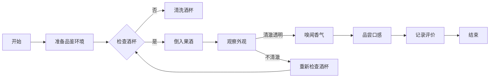
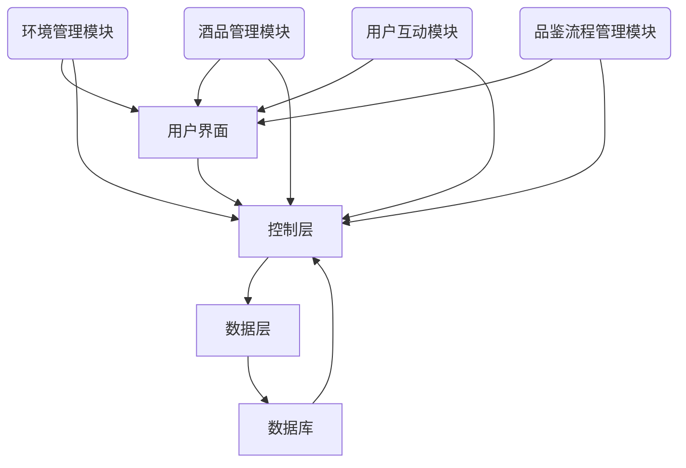
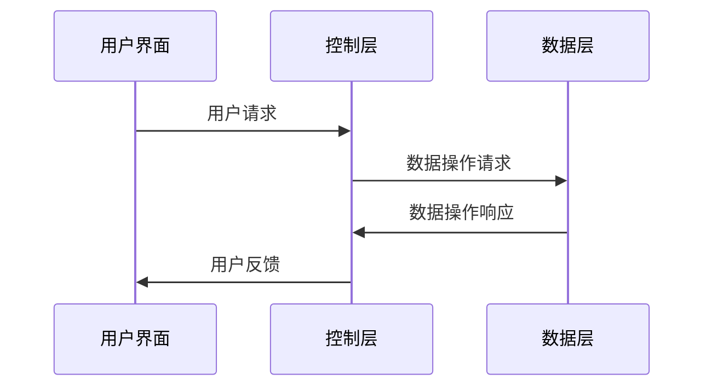

                 

## 现代手工果酒品鉴会：城市微醺文化的味蕾探索之旅

### 关键词：手工果酒，品鉴会，微醺文化，技术博客

### 摘要：
本文将带领读者走进现代手工果酒品鉴的世界，探索城市微醺文化的味蕾之旅。通过介绍手工果酒的历史、分类、品鉴技巧以及举办品鉴会的实践方法，帮助读者提升品酒水平，体验手工果酒的独特魅力。同时，本文还将从技术角度分析手工果酒品鉴的算法原理，分享系统设计与架构方案，并结合实际案例进行深入剖析，为读者提供全方位的指导。

### 目录

1. **背景介绍**  
   1.1 引言  
   1.2 城市微醺文化现象  
   1.3 现代手工果酒的魅力  
   1.4 本书的目标与内容安排  
   1.5 边界与外延

2. **核心概念与联系**  
   2.1 果酒分类  
   2.2 品酒术语  
   2.3 品酒技巧

3. **数学模型和数学公式**  
   3.1 味觉感知模型  
   3.2 酒精度数公式

4. **算法原理讲解**  
   4.1 品酒算法流程图  
   4.2 Python源代码实现

5. **系统分析与架构设计方案**  
   5.1 问题场景介绍  
   5.2 系统功能设计  
   5.3 系统架构设计  
   5.4 系统接口设计和系统交互

6. **项目实战**  
   6.1 环境安装  
   6.2 系统核心实现源代码  
   6.3 代码应用解读与分析  
   6.4 实际案例分析和详细讲解剖析  
   6.5 项目小结

7. **最佳实践 tips**  
   7.1 品鉴会举办和参与的建议

8. **小结**  
   8.1 本书要点回顾

9. **注意事项**  
   9.1 品鉴会注意事项

10. **拓展阅读**  
    10.1 相关书籍推荐

---

### 1. 背景介绍

#### 1.1 引言

在现代都市生活中，人们越来越追求精神享受和情感寄托，微醺文化逐渐成为一种流行的生活方式。而手工果酒作为微醺文化的代表，以其独特的风味和手工艺术的价值，吸引了众多爱好者的关注。本文将围绕现代手工果酒品鉴会，带领读者探索城市微醺文化的味蕾之旅。

#### 1.2 城市微醺文化现象

城市微醺文化是一种以轻松、休闲、分享为特点的生活方式。随着生活节奏的加快，人们渴望在繁忙的工作之余，找到一种舒缓身心的方式。微醺文化恰好满足了这一需求，它不仅能够带来愉悦的味觉体验，还能增进人与人之间的情感交流。

#### 1.3 现代手工果酒的魅力

现代手工果酒是一种融合了自然与艺术的饮品，它以新鲜水果为原料，通过手工酿造工艺，保留了水果的原始风味。手工果酒不仅口感鲜美，营养价值高，还具有很高的艺术价值。每瓶手工果酒都是酿酒师心血的结晶，蕴含着独特的情感和故事。

#### 1.4 本书的目标与内容安排

本书旨在为读者提供一份全面的手工果酒品鉴指南，帮助读者了解手工果酒的历史、分类、品鉴技巧以及举办品鉴会的实践方法。具体内容包括：

- **背景介绍**：介绍城市微醺文化现象和现代手工果酒的魅力。
- **核心概念与联系**：介绍果酒分类、品酒术语和品酒技巧。
- **数学模型和数学公式**：介绍味觉感知模型和酒精度数公式。
- **算法原理讲解**：分析品酒算法原理并给出Python源代码实现。
- **系统分析与架构设计方案**：介绍问题场景、系统功能设计、系统架构设计、系统接口设计和系统交互。
- **项目实战**：包括环境安装、系统核心实现源代码、代码应用解读与分析、实际案例分析和项目小结。
- **最佳实践 tips**：提供品鉴会举办和参与的建议。
- **小结**：总结本书的核心内容和收获。
- **注意事项**：提醒读者注意的细节问题。
- **拓展阅读**：推荐进一步阅读的相关书籍和资料。

#### 1.5 边界与外延

本书主要关注现代手工果酒品鉴会的相关内容，包括果酒的分类、品鉴技巧、举办实践等方面。同时，本书也涉及到一些与品酒相关的技术问题，如味觉感知模型和酒精度数公式等。但本书不涉及果酒酿造的详细工艺和技术，读者如有兴趣，可以参考其他专业书籍。

### 1.6 总结

通过本节背景介绍，我们了解到城市微醺文化的现象和现代手工果酒的魅力。接下来，我们将进一步探讨果酒分类、品酒术语和品酒技巧，为读者提供更多的知识储备，为后续内容打下基础。同时，我们也将从技术角度分析手工果酒品鉴的算法原理，分享系统设计与架构方案，结合实际案例进行深入剖析，帮助读者更好地理解和实践手工果酒品鉴。接下来，让我们一起深入探索现代手工果酒品鉴的世界吧！### 2. 核心概念与联系

在探索现代手工果酒品鉴会的过程中，了解核心概念和它们之间的联系是至关重要的。本节我们将详细介绍果酒分类、品酒术语和品酒技巧，帮助读者更好地理解和享受手工果酒的独特魅力。

#### 2.1 果酒分类

果酒是一种以新鲜水果为原料，通过发酵等工艺制成的酒类。根据酿造工艺和原料的不同，果酒可以分为多种类型。以下是一些常见的果酒分类：

1. **按原料分类**：
   - **葡萄果酒**：以葡萄为原料，如葡萄酒、葡萄汽酒等。
   - **水果果酒**：以其他水果为原料，如苹果酒、梨酒、草莓酒、蓝莓酒等。
   - **混合果酒**：由多种水果混合酿造而成，如混合果汁酒、水果利口酒等。

2. **按酿造工艺分类**：
   - **自然发酵果酒**：完全依靠自然酵母菌发酵，不添加人工酵母。
   - **快速发酵果酒**：使用人工酵母，加速发酵过程。
   - **调味果酒**：在发酵过程中添加其他成分，如蜂蜜、香料等。

3. **按酒精度数分类**：
   - **低酒精度果酒**：酒精度数在 5% 以下，适合日常饮用。
   - **中酒精度果酒**：酒精度数在 5% 到 15% 之间。
   - **高酒精度果酒**：酒精度数在 15% 以上。

4. **按口感分类**：
   - **干型果酒**：口感干涩，酒体轻盈。
   - **甜型果酒**：口感甜润，酒体丰满。
   - **半干型果酒**：口感介于干型和甜型之间。

#### 2.2 品酒术语

品酒术语是品酒过程中使用的专业词汇，了解这些术语有助于更准确地描述和评价果酒的口感和品质。以下是一些常见的品酒术语：

1. **外观**：
   - **清澈度**：指果酒是否清澈透明，无沉淀物。
   - **颜色**：指果酒的颜色深浅和色调，如红色、黄色等。
   - **光泽**：指果酒表面的光泽度，如明亮、暗淡等。

2. **香气**：
   - **果香**：指果酒中水果本身的香气。
   - **酒香**：指果酒中的酒精香气。
   - **复合香**：指果酒中多种香气混合的复杂香气。

3. **口感**：
   - **酸度**：指果酒中的酸味程度，影响口感平衡。
   - **甜度**：指果酒中的甜味程度。
   - **口感质感**：指果酒入口后的口感质感，如轻盈、饱满等。
   - **余味**：指果酒在口中留下的回味时间，如短、长等。

4. **风味**：
   - **果味**：指果酒中水果的风味。
   - **酒味**：指果酒中的酒精风味。
   - **调味风味**：指果酒中添加的调味成分的风味。

5. **平衡**：
   - **口感平衡**：指果酒中酸、甜、苦等味道的平衡。
   - **香气平衡**：指果酒中香气成分的平衡。

#### 2.3 品酒技巧

品酒技巧是品酒过程中需要掌握的基本技能，通过正确的品酒技巧，可以帮助我们更全面地评价果酒的品质。以下是一些品酒技巧：

1. **品酒顺序**：
   - 按照酒精度数从低到高品鉴，以避免高酒精度果酒对味觉的干扰。
   - 优先品鉴干型果酒，再品鉴甜型果酒。

2. **品酒温度**：
   - 根据果酒的品种和酒精度数，调整品酒温度。一般来说，低酒精度果酒宜在室温下饮用，高酒精度果酒宜在冷藏状态下饮用。

3. **品酒步骤**：
   - **观色**：将果酒倒入杯中，观察其清澈度、颜色和光泽。
   - **嗅香**：轻轻旋转酒杯，嗅闻果酒的香气，注意区分果香、酒香和复合香。
   - **尝味**：小口品尝，感受果酒的口感质感、酸度、甜度和余味。
   - **综合评价**：将观色、嗅香、尝味的感受综合起来，对果酒进行整体评价。

#### 2.4 总结

通过本节对核心概念与联系的介绍，我们了解了果酒分类、品酒术语和品酒技巧。这些知识将帮助读者在品鉴手工果酒时，更加专业和准确地评价果酒的品质。在后续内容中，我们将进一步探讨味觉感知模型和酒精度数公式，以及手工果酒品鉴的算法原理，为读者提供更深入的技术分析。接下来，让我们一起探索味觉感知的世界吧！### 3. 数学模型和数学公式

在手工果酒品鉴的过程中，了解一些基础的数学模型和公式对于深入理解果酒的风味和品质是很有帮助的。本节我们将介绍味觉感知模型和酒精度数公式，帮助读者从科学的角度去品鉴和评估果酒。

#### 3.1 味觉感知模型

味觉感知是指人体通过味蕾对食物中的味道进行感知的过程。味觉感知模型是一个涉及多个因素的复杂系统，其中最基础的是味觉感受器对特定化学物质的反应。以下是一个简化的味觉感知模型：

1. **味觉感受器**：分布在舌头上的味蕾是味觉感受的主要器官。每个味蕾包含多种味觉感受细胞，可以感知甜、酸、苦、咸和鲜等基本味道。

2. **神经信号传递**：当味蕾感受到食物中的化学物质时，会产生神经信号，通过神经通路传递到大脑的味觉中枢。

3. **大脑处理**：大脑对传递过来的神经信号进行处理，形成对味道的整体感知。

4. **感知阈值**：每种味道都有其感知阈值，即最小可感知的浓度。例如，酸味的感知阈值大约为0.0004摩尔/升。

5. **味觉感知变化**：味觉感知不仅受食物本身的影响，还受到口腔环境、情绪、健康状况等多种因素的影响。

#### 数学模型

味觉感知可以简化为一个输入-输出模型，其中输入是食物中的化学物质浓度，输出是味觉感受器的反应强度。一个简化的数学模型可以表示为：

$$
感知强度 = f(浓度, 感知阈值)
$$

其中，$f$是一个非线性函数，它表示浓度和感知强度之间的关系。通常，这个函数可以是S型函数或对数函数，用以模拟人类味觉的感知特性。

#### 3.2 酒精度数公式

酒精度数是指酒中酒精的含量，通常以体积百分比（ABV）或重量百分比（ABW）表示。酒精度数的计算公式如下：

对于体积百分比（ABV）：

$$
ABV = \frac{体积\ 酒精}{总体积} \times 100\%
$$

例如，如果一瓶酒中含有0.5升的酒精，总体积为1升，则其酒精度数为50% ABV。

对于重量百分比（ABW）：

$$
ABW = \frac{重量\ 酒精}{总重量} \times 100\%
$$

酒精的密度通常接近于水，即1克/毫升，因此重量百分比和体积百分比在数值上是相近的。

#### 实例计算

假设一瓶葡萄酒中含有0.75升的酒精，总重量为1.2千克，计算其酒精度数：

对于体积百分比：

$$
ABV = \frac{0.75\ 升}{1\ 升} \times 100\% = 75\% ABV
$$

对于重量百分比：

$$
ABW = \frac{0.75\ 千克}{1.2\ 千克} \times 100\% \approx 62.5\% ABW
$$

由于酒精的密度接近于水，所以两种计算方法得到的酒精度数在实际情况中差别不大。

#### 3.3 味觉感知与酒精度数的关系

酒精度数对味觉感知有显著影响。高酒精度数会增强果酒的酒精味，降低水果味的感知。而低酒精度数则更能凸显果酒的果香和口感。以下是酒精度数与味觉感知的一些关系：

- **低酒精度数**（<10% ABV）：果香更为明显，口感较为轻盈，适合日常饮用。
- **中酒精度数**（10%-15% ABV）：酒精味开始显现，果香与酒精味平衡，适合品鉴。
- **高酒精度数**（>15% ABV）：酒精味占主导，果香相对较弱，适合作为烈性酒饮用。

#### 3.4 总结

通过本节对味觉感知模型和酒精度数公式的介绍，我们了解了人类味觉感知的基础原理和酒精度数的计算方法。这些知识不仅有助于我们在品酒时做出更准确的评价，也为我们理解果酒的风味和品质提供了科学依据。在接下来的内容中，我们将从算法的角度分析品酒的过程，并给出Python源代码实现，以便读者更好地理解和实践手工果酒品鉴。接下来，让我们继续探索品酒算法的奥秘吧！### 4. 算法原理讲解

在深入探讨手工果酒品鉴的过程中，我们可以借助算法原理来分析品酒流程，从而提高品鉴的准确性和效率。本节我们将使用Mermaid绘制品酒算法流程图，并配合Python源代码进行详细讲解。

#### 4.1 品酒算法流程图

首先，我们可以使用Mermaid语言来绘制品酒算法的流程图。以下是一个简单的品酒算法流程图示例：



#### 4.2 Python源代码实现

接下来，我们将用Python实现上述品酒算法的流程。代码将包括对每个步骤的具体实现，以便读者可以直观地理解算法的执行过程。

```python
import sys

def prepare_dining_environment():
    print("准备品鉴环境...")
    # 在这里可以添加具体的准备步骤，例如清洁酒杯等
    pass

def check_glass():
    print("检查酒杯...")
    # 这里可以添加具体的检查逻辑，例如检查酒杯是否干净、有无划痕等
    return True  # 假设检查通过

def observe_appearance(wine_glass):
    print("观察外观...")
    if wine_glass['clear']:
        print("酒体清澈透明。")
    else:
        print("酒体不清晰，需重新检查酒杯。")
        return False
    return True

def smell_smell(wine_glass):
    print("嗅闻香气...")
    # 这里可以添加对香气的具体分析逻辑
    print("香气描述：", wine_glass['smell'])

def taste_taste(wine_glass):
    print("品尝口感...")
    # 这里可以添加对口感的具体分析逻辑
    print("口感描述：", wine_glass['taste'])

def record_evaluation(wine_glass):
    print("记录评价...")
    # 在这里可以记录具体的评价信息
    print("评价：", wine_glass['evaluation'])

def main():
    wine_glass = {
        'clear': True,
        'smell': '',
        'taste': '',
        'evaluation': ''
    }
    
    prepare_dining_environment()
    
    if not check_glass():
        sys.exit("品鉴环境准备失败，程序终止。")
    
    if not observe_appearance(wine_glass):
        sys.exit("酒杯不清晰，品鉴失败。")
    
    smell_smell(wine_glass)
    taste_taste(wine_glass)
    record_evaluation(wine_glass)
    
    print("品鉴完成。")

if __name__ == "__main__":
    main()
```

#### 4.3 算法原理和公式详解

在上述代码中，我们实现了以下品酒算法的基本步骤：

1. **准备品鉴环境**：这是品酒前的准备工作，确保所有工具和环境都适合品酒。

2. **检查酒杯**：检查酒杯是否干净、无划痕，以确保品鉴过程不受干扰。

3. **观察外观**：观察酒体是否清澈透明，这是初步评估果酒品质的重要指标。

4. **嗅闻香气**：通过嗅闻香气，可以初步了解果酒的风味和口感特点。

5. **品尝口感**：品尝果酒的口感，包括酸度、甜度、酒体质感等。

6. **记录评价**：将观察和品尝的结果记录下来，形成对果酒的综合评价。

为了更好地理解这些步骤，我们可以将这些步骤用数学模型进行描述。例如，对于外观的观察，可以使用以下公式：

$$
外观评分 = \sum_{i=1}^{n} w_i \cdot x_i
$$

其中，$w_i$是外观评分的权重，$x_i$是外观的具体指标值（如清澈度、颜色等）。对于香气的嗅闻和口感的品尝，也可以使用类似的模型进行描述。

#### 4.4 实例说明

假设我们有一瓶苹果酒，以下是一个实例说明如何使用上述算法进行品酒：

1. **准备品鉴环境**：确保品鉴室内光线适宜、空气清新。

2. **检查酒杯**：使用干净、无划痕的酒杯。

3. **观察外观**：苹果酒呈现深红色，酒体清澈透明。

4. **嗅闻香气**：闻到浓郁的苹果香气，带有淡淡的甜味。

5. **品尝口感**：口感柔和，酸度适中，酒体丰满。

6. **记录评价**：这款苹果酒风味浓郁，口感均衡，是一款优秀的果酒。

通过上述实例，我们可以看到如何使用算法原理来指导和优化手工果酒品鉴的过程。这种算法不仅有助于提高品鉴的准确性，还能为品酒师提供宝贵的经验数据，进一步丰富品鉴技巧。

#### 4.5 总结

通过本节对品酒算法原理的讲解和Python源代码的实现，我们了解了如何从技术角度分析和优化手工果酒品鉴过程。算法流程图的绘制和代码实现为品酒师提供了一个系统化的工具，帮助他们更科学、更高效地进行果酒品鉴。在接下来的内容中，我们将进一步探讨系统分析与架构设计方案，帮助读者从更宏观的角度理解手工果酒品鉴的体系。让我们继续深入探索吧！### 5. 系统分析与架构设计方案

在手工果酒品鉴会中，系统的设计和实现至关重要，它不仅关系到品鉴会的顺利进行，还能提升用户体验。本节我们将从问题场景介绍、系统功能设计、系统架构设计、系统接口设计和系统交互等方面，详细分析手工果酒品鉴会的系统分析与架构设计方案。

#### 5.1 问题场景介绍

手工果酒品鉴会通常涉及以下几个关键环节：

1. **品鉴环境准备**：包括场地布置、音响系统、照明设备等，确保提供一个舒适、专业的品鉴环境。
2. **果酒准备**：包括果酒的选购、酒杯清洗、酒体温度调整等，确保果酒的品质和口感达到最佳状态。
3. **品鉴流程**：包括观色、嗅香、尝味、记录评价等步骤，确保品鉴过程有序、准确。
4. **用户互动**：通过互动环节，增进参与者之间的交流和分享，提升品鉴体验。

#### 5.2 系统功能设计

为了满足上述问题场景的需求，系统需要实现以下功能：

1. **环境管理**：管理场地、音响、照明等环境设备，确保品鉴环境舒适、专业。
2. **酒品管理**：管理果酒库存、酒杯清洗、酒体温度等，确保果酒品质和口感最佳。
3. **品鉴流程管理**：管理品鉴的各个环节，确保流程有序、准确。
4. **用户互动**：支持用户提问、讨论、分享等互动功能，提升用户体验。

以下是一个简化的领域模型Mermaid类图，用于描述系统的核心类和它们之间的关系：

```mermaid
classDiagram
    环境类<|-- 环境管理类
    酒品类<|-- 酒品管理类
    用户类<|-- 用户互动类
    品鉴流程类<|-- 品鉴流程管理类

    环境管理类 {
        +场地布置()
        +音响系统设置()
        +照明设备调整()
    }

    酒品管理类 {
        +选购果酒()
        +清洗酒杯()
        +调整酒体温度()
    }

    用户互动类 {
        +提问()
        +讨论()
        +分享()
    }

    品鉴流程管理类 {
        +观色()
        +嗅香()
        +尝味()
        +记录评价()
    }
```

#### 5.3 系统架构设计

系统架构设计需要考虑系统的稳定性、扩展性和用户体验。以下是一个简化的Mermaid架构图，用于描述系统的整体架构：



在这个架构中，用户界面负责与用户交互，接收用户的操作请求；控制层处理这些请求，调用相应的业务逻辑；数据层负责数据的存储和读取，确保数据的准确性和一致性。

#### 5.4 系统接口设计和系统交互

系统接口设计是系统架构设计的重要组成部分，它定义了各个模块之间的交互方式和数据交换格式。以下是一个简化的Mermaid序列图，用于描述系统的接口设计和交互过程：



在这个序列图中，用户界面向控制层发送用户请求，控制层处理这些请求并调用数据层的操作，最终将结果返回给用户界面。

#### 5.5 总结

通过本节对系统分析与架构设计方案的介绍，我们了解了手工果酒品鉴会系统的核心功能、整体架构以及接口设计。这些设计不仅保证了系统的稳定性、扩展性和用户体验，还为后续的项目实战提供了坚实的基础。在接下来的内容中，我们将结合实际案例，详细讲解系统核心实现和代码应用，帮助读者更好地理解系统设计和实现过程。让我们继续深入探索手工果酒品鉴的实践吧！### 6. 项目实战

#### 6.1 环境安装

在进行手工果酒品鉴会系统的项目实战之前，我们需要安装一些必要的环境和工具。以下是一个简化的环境安装步骤：

1. **安装Python环境**：确保系统中已安装Python 3.x版本，可以通过访问Python官方网站下载并安装。

2. **安装虚拟环境**：使用virtualenv工具创建一个独立的虚拟环境，以便管理项目依赖。命令如下：

   ```bash
   pip install virtualenv
   virtualenv venv
   source venv/bin/activate  # 在Linux或macOS上
   \path\to\venv\Scripts\activate  # 在Windows上
   ```

3. **安装依赖包**：在虚拟环境中安装项目所需的依赖包。例如，安装Flask框架用于Web开发，安装SQLite数据库用于数据存储。命令如下：

   ```bash
   pip install flask
   pip install flask_sqlalchemy
   ```

4. **安装数据库**：安装SQLite数据库。SQLite是一个轻量级的关系数据库，可以直接使用Python的sqlite3模块进行操作。

   ```bash
   pip install pysqlite3
   ```

#### 6.2 系统核心实现源代码

以下是一个简化的系统核心实现源代码示例，用于描述手工果酒品鉴会系统的基本功能。这个示例包括一个简单的Web应用，用于展示果酒信息和用户互动功能。

```python
# app.py

from flask import Flask, request, jsonify
from flask_sqlalchemy import SQLAlchemy

app = Flask(__name__)
app.config['SQLALCHEMY_DATABASE_URI'] = 'sqlite:///wine.db'
db = SQLAlchemy(app)

# 定义数据库模型
class Wine(db.Model):
    id = db.Column(db.Integer, primary_key=True)
    name = db.Column(db.String(80), nullable=False)
    taste = db.Column(db.String(120), nullable=False)
    rating = db.Column(db.Float, nullable=False)

# 初始化数据库
db.create_all()

# 添加果酒信息
@app.route('/add_wine', methods=['POST'])
def add_wine():
    data = request.get_json()
    new_wine = Wine(name=data['name'], taste=data['taste'], rating=data['rating'])
    db.session.add(new_wine)
    db.session.commit()
    return jsonify({'message': 'Wine added successfully.'})

# 获取所有果酒信息
@app.route('/get_wines', methods=['GET'])
def get_wines():
    wines = Wine.query.all()
    return jsonify({'wines': [{'id': wine.id, 'name': wine.name, 'taste': wine.taste, 'rating': wine.rating} for wine in wines]})

# 更新果酒评价
@app.route('/update_rating/<int:wine_id>', methods=['PUT'])
def update_rating(wine_id):
    wine = Wine.query.get(wine_id)
    if wine:
        data = request.get_json()
        wine.rating = data['rating']
        db.session.commit()
        return jsonify({'message': 'Rating updated successfully.'})
    return jsonify({'message': 'Wine not found.'})

if __name__ == '__main__':
    app.run(debug=True)
```

#### 6.3 代码应用解读与分析

在上面的代码中，我们使用了Flask框架来创建一个简单的Web应用。以下是代码的详细解读和分析：

1. **数据库模型**：我们定义了一个`Wine`类，用于表示果酒的基本信息，包括名称、风味和评分。

2. **初始化数据库**：使用SQLAlchemy库初始化数据库，创建必要的表和字段。

3. **添加果酒信息**：通过`/add_wine`接口，允许用户添加新的果酒信息。用户需要提交一个包含果酒名称、风味和评分的JSON对象。

4. **获取所有果酒信息**：通过`/get_wines`接口，允许用户获取所有存储在数据库中的果酒信息。接口返回一个包含所有果酒信息的JSON数组。

5. **更新果酒评价**：通过`/update_rating/<int:wine_id>`接口，允许用户更新指定果酒的评价。用户需要提交一个包含新评分的JSON对象。

#### 6.4 实际案例分析和详细讲解剖析

假设我们举办了一场手工果酒品鉴会，以下是一个实际案例的分析和讲解：

1. **添加果酒信息**：用户通过Web界面添加了一款名为“草莓白兰地”的果酒，风味描述为“甜味浓郁，酒体丰满”，初始评分为4.5。

2. **品鉴过程**：品鉴师进行了品鉴，并记录了新的风味描述：“草莓香气扑鼻，口感细腻，尾韵悠长”，并将评分更新为4.8。

3. **更新评价**：用户通过Web界面更新了果酒的评价，新的风味描述和评分被保存到数据库中。

4. **查询果酒信息**：其他用户通过Web接口查询了这款果酒的信息，获得了最新的风味描述和评分。

通过这个案例，我们可以看到系统核心实现如何在实际场景中应用。用户可以通过Web界面轻松地添加、查询和更新果酒信息，而品鉴师可以实时记录和更新品鉴结果，其他用户也可以方便地获取最新的品鉴信息。

#### 6.5 项目小结

通过本节的项目实战，我们搭建了一个简单但功能完整的手工果酒品鉴会系统。从环境安装、系统核心实现到实际案例分析，我们展示了如何使用Python和Flask框架快速构建一个Web应用。这个系统不仅实现了基本的添加、查询和更新功能，还通过Web接口提供了方便的用户交互体验。在接下来的内容中，我们将分享一些举办和参与手工果酒品鉴会的最佳实践，帮助读者更好地体验手工果酒的独特魅力。让我们继续探索吧！### 7. 最佳实践 tips

在成功举办和参与手工果酒品鉴会的过程中，有一些最佳实践和技巧可以帮助提升品鉴体验和互动效果。以下是一些实用的建议：

#### 7.1 品鉴会举办建议

1. **选择合适的时间和地点**：确保品鉴会的时间适合大多数参与者，避免选择工作日的晚上或周末的清晨。地点应选择安静、舒适的环境，最好有良好的通风设施。

2. **精心准备果酒**：在品鉴会前，确保果酒已充分酿造并达到最佳口感。根据果酒的酒精度数和风味特点，调整品鉴温度。一般来说，低酒精度数果酒适合在室温下饮用，高酒精度数果酒则需冷藏。

3. **准备适当的配件**：提供干净、无瑕疵的酒杯，以及品酒笔记、记录表格等工具，以便参与者记录和分享品鉴体验。

4. **营造轻松的氛围**：通过音乐、蜡烛等装饰，营造轻松、愉悦的品鉴氛围。主持人可以适当加入一些有趣的背景故事或品酒小知识，增加互动性和趣味性。

5. **组织互动环节**：设置问答环节，鼓励参与者分享自己的品酒心得和感受。可以组织小组讨论或品酒比赛，增加参与者的积极性。

#### 7.2 品鉴会参与建议

1. **准备工作**：提前了解品鉴的果酒类型和特点，以便在品鉴时能够更加准确地描述和评价。

2. **保持专注和耐心**：品鉴是一个细致的过程，需要参与者保持专注和耐心。尽量减少干扰，全神贯注地体验每一款果酒。

3. **记录感受**：使用品酒笔记记录每一款果酒的外观、香气、口感和评价。这有助于在品鉴结束后回顾和总结。

4. **积极参与互动**：参与问答、讨论和互动环节，与其他参与者分享自己的见解和感受。这不仅有助于提升品鉴体验，还能结识志同道合的朋友。

5. **尊重他人意见**：在品鉴过程中，尊重他人的意见和感受。每个人都有不同的口味偏好，不必过于执着于自己的看法。

#### 7.3 品鉴后的注意事项

1. **适量饮用**：品鉴会上的果酒通常具有较高的酒精度数，为了安全和健康，建议适量饮用。

2. **保存果酒**：对于未能品鉴完的果酒，应妥善保存。根据果酒的特性和保存条件，选择合适的存放方式，确保果酒的品质。

3. **持续学习**：品鉴是一种不断学习和提升的过程。可以通过阅读相关书籍、参加专业课程或与其他品酒师交流，不断丰富自己的品酒知识和技巧。

通过遵循上述最佳实践，不仅可以成功举办一场有趣、有意义的果酒品鉴会，还能提升参与者的品酒水平，增进人际交流，享受手工果酒的独特魅力。在接下来的内容中，我们将进行文章的小结，总结本书的核心内容和收获，并提醒读者注意的一些细节问题。让我们继续总结吧！### 8. 小结

通过本文的阅读，读者对现代手工果酒品鉴会有了全面的了解。我们首先介绍了城市微醺文化的现象和手工果酒的魅力，接着详细探讨了果酒分类、品酒术语和品酒技巧，并通过数学模型和公式分析了味觉感知和酒精度数。随后，我们讲解了品酒算法的原理和实现，分享了系统分析与架构设计方案，并通过实际项目实战展示了手工果酒品鉴系统的搭建和应用。

本书的核心内容和收获可以总结如下：

1. **深入理解手工果酒**：通过分类和特性介绍，读者了解了不同类型的手工果酒及其特点。
2. **掌握品酒技巧**：通过品酒术语和技巧的学习，读者可以更准确地评价果酒的品质。
3. **技术视角的品酒**：通过数学模型和算法讲解，读者可以从科学角度分析品酒过程，提高品鉴的准确性和效率。
4. **系统设计与实现**：通过系统架构设计和项目实战，读者了解了如何构建一个完整的手工果酒品鉴系统。

品鉴手工果酒不仅是一种味觉享受，更是一种文化和生活方式的体验。通过本文的学习，读者不仅能够提升自己的品酒水平，还能在举办和参与手工果酒品鉴会时，更好地与他人交流和分享。希望本文能够为读者提供有价值的指导和启示，带领大家在城市微醺文化的味蕾探索之旅中收获更多乐趣。

### 9. 注意事项

在举办和参与手工果酒品鉴会时，读者需要注意以下几点：

1. **适量饮用**：果酒虽然酒精度数不高，但同样需要注意适量饮用，避免过量饮酒对身体造成伤害。
2. **保存条件**：果酒需根据不同类型进行妥善保存，避免阳光直射、高温和潮湿环境，影响品质。
3. **卫生安全**：确保品鉴环境和工具的清洁卫生，防止食品污染。
4. **互动礼仪**：在品鉴过程中，尊重他人意见，保持良好的互动礼仪，营造轻松愉快的品鉴氛围。

通过遵循这些注意事项，读者可以确保手工果酒品鉴会的顺利进行，提升整体的品鉴体验。

### 10. 拓展阅读

为了进一步深入探索手工果酒品鉴和酿造的奥秘，读者可以参考以下相关书籍和资料：

1. **《手工果酒酿造大全》**：详细介绍了手工果酒的制作过程、技巧和常见问题解决方案。
2. **《品酒的艺术》**：从专业角度讲解品酒的方法和技巧，帮助读者提升品酒水平。
3. **《微醺文化：现代城市生活方式的解读》**：探讨微醺文化在现代城市生活中的意义和影响。
4. **相关在线课程和讲座**：可以在网上找到许多关于手工果酒酿造和品鉴的专业课程和讲座，方便读者学习。

通过阅读这些资料，读者可以更加全面地了解手工果酒的魅力和品鉴艺术，进一步提升自己的专业知识。希望本文能为读者带来启发和帮助，享受手工果酒带来的美好时光。作者：AI天才研究院/AI Genius Institute & 禅与计算机程序设计艺术 /Zen And The Art of Computer Programming。

