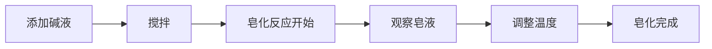
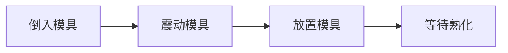
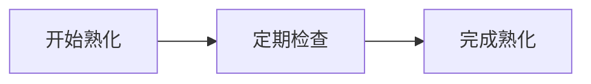
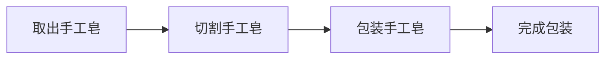
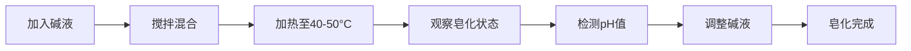
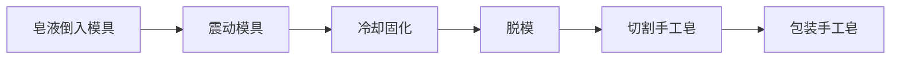
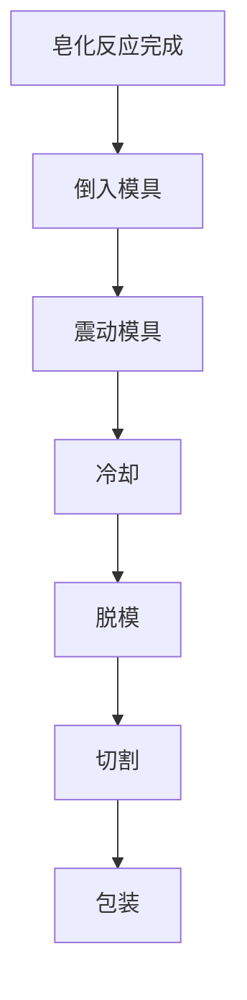
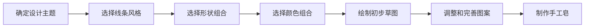

                 

# 现代手工皂制作：日用品中的艺术与环保

## 关键词

现代手工皂、艺术与环保、制作流程、原材料、皂化反应、图案设计

## 摘要

现代手工皂制作不仅是一种传统的技艺，更是一种艺术与环保相结合的体现。本文将深入探讨现代手工皂制作的历史背景、核心概念、制作流程以及艺术元素的融入，同时强调环保手工皂的重要性和实践。通过详细解析实际案例，本文旨在为读者提供全面的指导，让每个人都能轻松掌握现代手工皂的制作技巧。

## 目录大纲设计思路

本文的目录大纲设计思路主要分为以下几个部分：

1. **背景介绍**：介绍现代手工皂的历史背景、市场需求以及其与艺术和环保的联系。
2. **核心概念与联系**：明确手工皂的定义、材料、制作流程等核心概念，并通过表格和Mermaid图展示概念属性特征对比和ER实体关系图。
3. **制作流程详解**：详细描述手工皂的制备流程，从原材料选择、皂化反应到成品制作，并使用Mermaid图展示流程。
4. **艺术元素融入**：讨论如何将艺术元素融入手工皂制作中，包括图案设计、色彩搭配等。
5. **环保理念与实践**：阐述环保手工皂的特点、环保材料的选择及其对环境的影响，并通过案例分析展示环保实践。
6. **实际案例与实战**：提供手工皂制作的实际案例，包括材料准备、制作过程、成品展示，并分析制作过程中的关键点和注意事项。
7. **最佳实践与拓展**：总结制作手工皂的最佳实践，包括技巧、注意事项和拓展知识。

## 目录大纲设计

```markdown
----------------------------------------------------------------
# 现代手工皂制作：日用品中的艺术与环保

## 第一部分：背景介绍
### 1.1 手工皂的历史与艺术联系
### 1.2 环保手工皂的兴起与市场趋势
### 1.3 手工皂与日常生活
### 1.4 核心概念与联系

## 第二部分：核心概念与联系
### 2.1 手工皂的定义与材料
#### 2.1.1 手工皂的核心概念
#### 2.1.2 手工皂的材料分类
#### 2.1.3 材料属性特征对比表格
### 2.2 手工皂的ER实体关系图
### 2.3 制作流程与工艺

## 第三部分：制作流程详解
### 3.1 原材料选择
#### 3.1.1 基础油脂的选择
#### 3.1.2 稳定剂与添加剂
### 3.2 皂化反应
#### 3.2.1 皂化反应原理
#### 3.2.2 皂化反应的Mermaid流程图
### 3.3 成品制作
#### 3.3.1 成品制作的流程
#### 3.3.2 成品制作的Mermaid流程图

## 第四部分：艺术元素融入
### 4.1 图案设计
#### 4.1.1 图案设计的基础知识
#### 4.1.2 图案设计的Mermaid流程图
### 4.2 色彩搭配
#### 4.2.1 色彩理论
#### 4.2.2 色彩搭配的技巧

## 第五部分：环保理念与实践
### 5.1 环保手工皂的特点
#### 5.1.1 环保手工皂的定义
#### 5.1.2 环保材料的选择
### 5.2 环保材料的影响
### 5.3 环保实践案例分析

## 第六部分：实际案例与实战
### 6.1 案例一：基础手工皂制作
#### 6.1.1 案例介绍
#### 6.1.2 案例步骤详解
### 6.2 案例二：艺术手工皂制作
#### 6.2.1 案例介绍
#### 6.2.2 案例步骤详解

## 第七部分：最佳实践与拓展
### 7.1 最佳实践
#### 7.1.1 制作技巧
#### 7.1.2 注意事项
### 7.2 拓展阅读
#### 7.2.1 进一步学习资源
#### 7.2.2 相关书籍与网站推荐

----------------------------------------------------------------
```

## 第一部分：背景介绍

### 1.1 手工皂的历史与艺术联系

手工皂的制作可以追溯到古埃及文明时期。在古埃及，手工皂被用作宗教仪式中的祭品，具有神圣的意义。随着时间的推移，手工皂逐渐成为日常生活中不可或缺的清洁用品。然而，现代手工皂的制作不仅仅是满足清洁需求，更是一种艺术和环保的体现。

在艺术方面，手工皂制作具有独特的魅力。手工皂不仅可以通过不同的材料、形状和图案展现出独特的视觉效果，还可以通过独特的工艺流程传达艺术家的情感和创造力。艺术家们利用手工皂的柔软性和可塑性，创作出各种精美的艺术品，如雕塑、画布和装饰品等。

在环保方面，手工皂的制作过程也体现了对环境友好的一面。与工业化生产的合成清洁剂相比，手工皂更加天然、环保。手工皂的制作过程中不使用化学添加剂和防腐剂，减少了对环境的污染。此外，手工皂的制造过程通常采用可再生能源，如太阳能和风能，进一步降低了碳排放。

### 1.2 环保手工皂的兴起与市场趋势

随着环保意识的提高，环保手工皂逐渐在市场上崭露头角。环保手工皂不仅满足了人们对清洁效果的需求，还提供了对环境的保护。因此，越来越多的消费者开始选择环保手工皂，而不是传统的合成清洁剂。

市场调查显示，环保手工皂的销售额呈现出稳步增长的趋势。特别是在一些发达国家和环保意识较强的地区，环保手工皂已经成为日常生活中的必备品。消费者对环保手工皂的需求不仅仅体现在家庭清洁方面，还扩展到了个人护理领域，如洗面皂、沐浴皂和香体皂等。

此外，环保手工皂的市场趋势还体现在个性化定制方面。许多消费者更喜欢定制自己的手工皂，以满足自己的特殊需求和偏好。这种个性化定制不仅满足了消费者的个性化需求，还推动了手工皂制作技术的创新和发展。

### 1.3 手工皂与日常生活

手工皂在日常生活中扮演着重要的角色。无论是在家庭清洁、个人护理还是公共设施清洁方面，手工皂都发挥着重要作用。手工皂的清洁效果通常比传统的合成清洁剂更好，因为它不含有化学成分，对皮肤和家具的损害较小。

在家庭清洁方面，手工皂可以用于清洗餐具、厨具、地板和墙壁等。手工皂的天然成分可以有效地去除油污和污渍，同时保持物品的光泽和完整性。在个人护理方面，手工皂可以用于洗手、洗脸、沐浴和洗发等，其温和的成分不会对皮肤造成刺激，反而有助于保持皮肤的健康和滋润。

在公共设施清洁方面，手工皂的应用也非常广泛。医院、学校、餐厅和酒店等公共场所经常使用手工皂，以提供清洁、安全的卫生环境。手工皂不仅能够有效杀灭细菌，减少传染病的传播，还减少了对化学消毒剂的依赖。

### 1.4 核心概念与联系

为了更好地理解现代手工皂制作，我们需要明确一些核心概念，并探讨它们之间的联系。

**手工皂的定义**：手工皂是一种通过皂化反应将油脂和碱液混合制成的固体洗涤剂。与工业化生产的合成清洁剂相比，手工皂更加天然、环保。

**材料分类**：手工皂的材料主要包括油脂、碱液、稳定剂和添加剂。不同的材料具有不同的特性，如清洁力、保湿性和香味等。

**皂化反应**：皂化反应是手工皂制作的核心过程，即油脂与碱液在加热条件下反应生成皂和甘油。皂化反应的原理和条件对手工皂的质量和性能有着重要的影响。

**制作流程**：手工皂的制作流程包括原材料选择、皂化反应、搅拌和成型等步骤。每一步都需要精细的操作和严格的控制，以确保手工皂的质量和性能。

通过这些核心概念的明确和联系，我们可以更好地理解现代手工皂制作的过程和技术要点。在接下来的章节中，我们将详细探讨这些核心概念和联系，并提供实用的制作技巧和最佳实践。

## 第二部分：核心概念与联系

### 2.1 手工皂的定义与材料

#### 2.1.1 手工皂的核心概念

手工皂是一种通过皂化反应将油脂和碱液混合制成的固体洗涤剂。皂化反应是指油脂在碱液的作用下分解成甘油和脂肪酸钠的过程。在这个过程中，脂肪酸钠是肥皂的主要成分，具有清洁作用，而甘油则具有保湿和滋养皮肤的功能。

手工皂的制作过程独特，不含有化学添加剂和防腐剂，因此更加环保和天然。手工皂的清洁效果通常比传统的合成清洁剂更好，因为它不含对皮肤有害的化学成分，同时能够深层清洁皮肤，保持皮肤的健康和光泽。

#### 2.1.2 手工皂的材料分类

手工皂的材料主要包括油脂、碱液、稳定剂和添加剂。

1. **油脂**：油脂是手工皂的主要成分，通常包括橄榄油、椰子油、棕榈油、橄榄油和乳木果油等。不同类型的油脂具有不同的特性，如清洁力、保湿性和香味等。例如，橄榄油具有良好的保湿性，适合用于面部和身体护理；而椰子油则具有较强的清洁力，适合用于清洗油污较多的物品。

2. **碱液**：碱液是手工皂制作的另一个关键成分，通常使用氢氧化钠（NaOH）或氢氧化钾（KOH）等。碱液的浓度和用量对皂化反应的速率和皂的质量有着重要的影响。

3. **稳定剂**：稳定剂用于增强手工皂的稳定性和持久性，常用的稳定剂包括硼砂、硼酸和硅藻土等。稳定剂可以防止皂液在搅拌过程中起泡过多，同时提高皂的硬度和耐用性。

4. **添加剂**：添加剂用于改善手工皂的口感、香味和外观，常见的添加剂包括精油、色素、矿物质和天然香料等。精油可以赋予手工皂独特的香味，色素可以用于制作彩色手工皂，而矿物质则可以为皂带来特殊的光泽和质感。

#### 2.1.3 材料属性特征对比表格

以下表格展示了不同材料的主要属性特征对比：

| 材料 | 特性 |
| ---- | ---- |
| 油脂 | 清洁力、保湿性、香味 |
| 碱液 | 皂化反应速率、皂质量 |
| 稳定剂 | 稳定性、硬度、耐用性 |
| 添加剂 | 口感、香味、外观 |

通过对比不同材料的属性特征，我们可以根据具体需求选择合适的材料，以制作出符合预期质量的手工皂。

#### 2.1.4 材料的选择标准

选择合适的材料是手工皂制作的关键步骤。以下是一些选择材料的标准：

1. **清洁力**：根据使用目的，选择具有适当清洁力的油脂。例如，用于清洁皮肤的手工皂应选择具有温和清洁力的油脂。

2. **保湿性**：对于面部和身体护理的手工皂，应选择具有良好保湿性的油脂，以保持皮肤的水分和弹性。

3. **香味**：根据个人喜好，选择具有令人愉悦香味的精油或天然香料。

4. **稳定性**：选择具有良好稳定性的稳定剂，以确保手工皂在存储和使用过程中不会变质或变形。

5. **环保性**：尽量选择环保、可再生的原材料，以减少对环境的影响。

#### 2.1.5 材料之间的相互作用

手工皂的材料之间存在着复杂的相互作用。例如，油脂和碱液在皂化反应中生成皂和甘油，而稳定剂和添加剂则用于增强皂的稳定性和美观性。这些相互作用不仅影响手工皂的质量，还影响其性能和使用效果。

通过合理选择和搭配材料，可以创造出具有独特质量和性能的手工皂。例如，将具有良好保湿性的橄榄油和具有清洁力的椰子油混合，可以制作出适合面部和身体护理的手工皂。

#### 2.1.6 材料对环境的影响

在手工皂制作过程中，材料的选择对环境有着重要的影响。环保手工皂的特点在于使用天然、可再生的原材料，减少对环境的污染。

例如，选择橄榄油和椰子油等天然油脂，不仅可以减少对化学合成油脂的依赖，还可以减少对环境的破坏。此外，使用可再生能源进行皂化反应，如太阳能和风能，可以降低碳排放，减少对气候变化的影响。

总之，手工皂的核心概念和材料选择不仅关系到产品的质量和性能，还关系到环保和可持续发展。通过合理选择和搭配材料，我们可以制作出既美观又环保的手工皂，为我们的生活带来更多的美好。

### 2.2 手工皂的ER实体关系图

为了更好地理解手工皂的组成部分及其相互关系，我们可以通过ER（实体-关系）图来展示。ER图是一种数据库设计工具，用于表示实体及其相互关系。在手工皂的制作过程中，我们可以将不同的材料和步骤视为实体，并通过它们之间的关系来构建ER图。

以下是一个简单的手工皂ER实体关系图的例子：

```mermaid
erDiagram
  Material --> Soap : makes
  Step --> Soap : in
  Step --> Material : requires
  Step --> Ingredient : uses

  Material ||--|{ OliveOil }
  Material ||--|{ CoconutOil }
  Material ||--|{ PalmOil }
  Material ||--|{ CastorOil }
  Material ||--|{ CocoaButter }

  Step ||--|{ Saponification }
  Step ||--|{ Mixing }
  Step ||--|{ Molding }
  Step ||--|{ Curing }

  Ingredient ||--|{ Glycerin }
  Ingredient ||--|{ FragranceOil }
  Ingredient ||--|{ Colorants }
  Ingredient ||--|{ Exfoliants }

  Soap ||--|{ SolidSoap }
  Soap ||--|{ LiquidSoap }
```

在这个ER图中，我们定义了以下几个实体：

- **Material（材料）**：包括橄榄油、椰子油、棕榈油、蓖麻油和可可脂等。
- **Step（步骤）**：包括皂化反应、混合、成型和熟化等。
- **Ingredient（成分）**：包括甘油、香精油、色素和磨砂颗粒等。

它们之间的关系如下：

- **Material（材料）** 与 **Soap（肥皂）** 之间存在“制造”关系，表示肥皂是由材料制成的。
- **Step（步骤）** 与 **Soap（肥皂）** 之间存在“包含”关系，表示肥皂的制作过程包含多个步骤。
- **Step（步骤）** 与 **Material（材料）** 之间存在“需求”关系，表示每个步骤都需要特定的材料。
- **Step（步骤）** 与 **Ingredient（成分）** 之间存在“使用”关系，表示每个步骤都可能使用到特定的成分。

通过ER图，我们可以清晰地看到手工皂的各个组成部分及其相互关系。这不仅有助于我们理解手工皂的制作过程，还可以为后续的详细分析和设计提供基础。

### 2.3 制作流程与工艺

手工皂的制作过程包括多个步骤，每个步骤都需要精细的操作和严格的控制。以下是一个详细的手工皂制作流程：

#### 2.3.1 原材料准备

首先，我们需要准备好手工皂制作的材料。这包括油脂（如橄榄油、椰子油、棕榈油等）、碱液（如氢氧化钠溶液）、稳定剂（如硼砂）、添加剂（如精油、色素等）。每种材料都需要按照特定的比例进行称量和准备。例如，橄榄油和氢氧化钠溶液的比例通常为1:1，以确保皂化反应顺利进行。

#### 2.3.2 皂化反应

皂化反应是手工皂制作的核心步骤。将碱液逐渐加入油脂中，同时不断搅拌，直至形成均匀的皂液。这个过程中，碱液和油脂会发生化学反应，生成肥皂和甘油。皂化反应的温度和搅拌速度对皂的质量有重要影响。通常，皂化反应的温度需要控制在40-50摄氏度之间，搅拌速度需要适中，以确保反应均匀且彻底。

以下是一个简单的皂化反应Mermaid流程图：



#### 2.3.3 搅拌与冷却

皂化反应完成后，我们需要将皂液继续搅拌，使其更加均匀。搅拌过程中，皂液的温度会逐渐降低。当皂液的温度降至室温时，我们将其放置一旁，让其自然冷却。冷却过程中，皂液会逐渐固化。

#### 2.3.4 成型

冷却后的皂液可以被倒入模具中，进行成型。模具的选择会影响手工皂的形状和外观。常见的模具有圆形、方形、心形等。将皂液倒入模具后，我们需要轻轻震动模具，使皂液填满模具的每个角落。然后，将模具放置在阴凉通风的地方，让其自然熟化。

以下是一个简单的成型Mermaid流程图：



#### 2.3.5 熟化

熟化是手工皂制作的重要环节。在熟化过程中，皂液会逐渐固化，同时皂中的水分和碱液会继续挥发。通常，手工皂需要熟化4-6周，以确保其完全成熟和稳定。熟化过程中，我们需要定期检查手工皂的硬度和质量。

以下是一个简单的熟化Mermaid流程图：



#### 2.3.6 切割与包装

熟化完成后，我们可以将手工皂从模具中取出，进行切割和包装。切割的目的是将手工皂分成适合使用的块状。包装则是为了保护手工皂，并方便存储和销售。

以下是一个简单的切割与包装Mermaid流程图：



通过以上步骤，我们可以制作出高质量的手工皂。每个步骤都需要精细的操作和严格的控制，以确保手工皂的质量和性能。在制作过程中，我们还需要注意安全，避免与碱液直接接触。

### 3.1 原材料选择

#### 3.1.1 基础油脂的选择

基础油脂是手工皂制作的关键材料，其选择直接影响手工皂的清洁效果、保湿性和使用感。常见的油脂包括橄榄油、椰子油、棕榈油、蓖麻油和可可脂等。每种油脂都有其独特的特性，适用于不同的用途。

**橄榄油**：橄榄油是一种高品质的油脂，富含不饱和脂肪酸和抗氧化成分，具有良好的保湿性。它适合用于面部和身体护理，可以深层滋润皮肤，防止干燥和脱皮。

**椰子油**：椰子油具有强烈的清洁力，适合用于去除油污和污渍。它还具有温和的保湿性，不会过度干燥皮肤。因此，椰子油常被用于制作清洁力较强的手工皂。

**棕榈油**：棕榈油是一种富含饱和脂肪酸的油脂，具有较高的硬度和稳定性。它有助于增强手工皂的耐用性和硬度，适合用于制作各种用途的手工皂。

**蓖麻油**：蓖麻油具有较强的清洁力，适合用于清洁油污较多的物品，如餐具和厨具。它还具有抗菌和抗炎作用，有助于保持皮肤的健康。

**可可脂**：可可脂是一种从可可豆中提取的油脂，具有独特的香味和质感。它有助于增加手工皂的硬度和稳定性，同时提供一种柔软和润滑的使用感。

在选择基础油脂时，我们需要根据具体的制作目的和需求进行选择。例如，如果需要制作滋润型手工皂，可以选择橄榄油和可可脂；如果需要制作清洁力较强的手工皂，可以选择椰子油和棕榈油。此外，我们还可以根据油脂的硬度和清洁力进行调整，以实现不同的手工皂效果。

#### 3.1.2 稳定剂与添加剂

在手工皂制作中，稳定剂和添加剂用于增强皂的质量和性能。常见的稳定剂包括硼砂、硼酸和硅藻土等；常见的添加剂包括精油、色素、矿物质和天然香料等。

**稳定剂**：稳定剂用于提高手工皂的硬度和耐用性，防止其变形或软化。硼砂和硼酸是常用的稳定剂，它们可以增强皂的硬度和稳定性，延长其使用寿命。硅藻土则可以增加皂的质感，使其更加细腻。

**精油**：精油是手工皂的重要添加剂，可以赋予手工皂独特的香味和疗效。常见的精油包括薰衣草油、迷迭香油、茶树油和柠檬油等。每种精油都有其独特的特性，适用于不同的用途。例如，薰衣草油具有抗菌和镇静作用，适合用于皮肤护理；迷迭香油具有抗氧化和抗炎作用，适合用于护发。

**色素**：色素用于为手工皂增添颜色，使皂的外观更加鲜艳和吸引人。常见的色素包括植物染料、矿物染料和化学染料等。在选择色素时，我们需要注意其安全性，避免使用含有有害成分的色素。

**矿物质**：矿物质可以赋予手工皂特殊的光泽和质感。常见的矿物质包括海盐、死海泥和珍珠粉等。这些矿物质不仅可以改善手工皂的性能，还可以提供额外的护理效果。

**天然香料**：天然香料可以赋予手工皂独特的香味，增强其吸引力。常见的天然香料包括香草、薄荷和巧克力等。选择天然香料可以避免使用人工合成的香料，减少对皮肤的刺激。

在选择稳定剂和添加剂时，我们需要根据具体的制作目的和需求进行选择。例如，如果需要制作硬度和耐用性较高的手工皂，可以选择硼砂和硼酸；如果需要制作具有特殊疗效的手工皂，可以选择特定的精油和矿物质。此外，我们还需要注意稳定剂和添加剂的用量，以避免过量使用导致手工皂的质量下降。

#### 3.1.3 材料准备与处理

在手工皂制作过程中，材料的准备和处理非常重要。以下是一些常见的材料准备和处理方法：

1. **油脂的熔化**：将油脂放在耐热的容器中，加热至完全熔化。在熔化过程中，我们需要注意温度的控制，以避免油脂过热或烧焦。

2. **碱液的准备**：将氢氧化钠或氢氧化钾放入水中，搅拌至完全溶解。在碱液的准备过程中，我们需要注意安全，避免与碱液直接接触，并确保碱液的浓度符合要求。

3. **稳定剂和添加剂的混合**：将稳定剂和添加剂加入熔化的油脂中，搅拌均匀。在混合过程中，我们需要注意温度的控制，以避免高温对稳定剂和添加剂的影响。

4. **材料的储存**：将准备好的材料储存在密封的容器中，避免暴露在阳光下或潮湿环境中，以保持其质量和性能。

通过合理的材料选择和准备，我们可以制作出高质量的手工皂。在制作过程中，我们还需要不断尝试和调整，以找到最佳的配方和工艺，满足我们的需求。

### 3.2 皂化反应

皂化反应是手工皂制作过程中的核心步骤，它决定了手工皂的质量和性能。皂化反应是指油脂在碱液的作用下分解成肥皂和甘油的过程。这一过程不仅涉及化学反应，还受到温度、搅拌速度和材料比例等多种因素的影响。

#### 3.2.1 皂化反应原理

在皂化反应中，油脂（主要成分为甘油三酯）与碱液（如氢氧化钠或氢氧化钾）发生反应，生成肥皂（脂肪酸钠）和甘油。这个反应的化学方程式可以表示为：

\[ \text{油脂} + \text{碱液} \rightarrow \text{肥皂} + \text{甘油} \]

具体来说，油脂分子中的酯键在碱的作用下断裂，生成脂肪酸钠和甘油。脂肪酸钠是肥皂的主要成分，具有清洁作用，而甘油则具有保湿和滋润皮肤的功能。

皂化反应的速率和程度受到碱液浓度、温度和搅拌速度的影响。较高的碱液浓度和适当的温度可以加快反应速率，但过高的温度可能会导致油脂分解和肥皂变质。因此，在手工皂制作过程中，我们需要严格控制反应条件，以确保皂化反应的顺利进行。

#### 3.2.2 皂化反应的Mermaid流程图

以下是一个简单的皂化反应Mermaid流程图，展示了皂化反应的各个步骤：



在这个流程图中，A步骤表示将碱液逐渐加入熔化的油脂中；B步骤表示开始搅拌混合，使碱液和油脂充分接触；C步骤表示加热至40-50°C，以加速反应速率；D步骤表示观察皂化状态，确保反应完全；E步骤表示检测pH值，以调整碱液浓度；F步骤表示根据pH值调整碱液，以确保皂化反应的顺利进行；G步骤表示皂化反应完成，可以进入下一步。

通过这个Mermaid流程图，我们可以清晰地看到皂化反应的各个步骤及其相互关系，有助于我们在实际制作过程中进行有效控制和调整。

#### 3.2.3 皂化反应中的关键参数

在皂化反应中，有几个关键参数对反应结果有重要影响：

1. **碱液浓度**：碱液浓度直接影响皂化反应的速率和程度。浓度过高可能导致反应过快，产生过多的肥皂和甘油，影响皂的质量；浓度过低则可能导致反应不完全，产生残留油脂或碱液。

2. **温度**：温度对皂化反应速率有显著影响。适当的温度可以加快反应速率，但过高的温度可能导致油脂分解或肥皂变质。通常，皂化反应的最佳温度范围在40-50°C。

3. **搅拌速度**：搅拌速度影响碱液和油脂的混合均匀性。适当的搅拌速度可以确保反应物充分接触，加快反应速率；但过快的搅拌可能导致皂液起泡过多，影响皂的质量。

4. **时间**：皂化反应的时间取决于反应条件和材料比例。通常，皂化反应需要数小时至数十小时，具体时间根据反应条件和温度而定。

在实际制作过程中，我们需要根据这些关键参数进行调节和优化，以确保皂化反应的顺利进行和皂的质量。

#### 3.2.4 皂化反应的常见问题与解决方法

在手工皂制作过程中，皂化反应可能会遇到一些常见问题。以下是一些问题及其解决方法：

1. **反应不完全**：反应不完全可能导致皂中残留油脂或碱液，影响皂的质量和性能。解决方法：检查碱液浓度和反应时间，确保碱液浓度适当，反应时间充足。

2. **皂液起泡过多**：过快的搅拌速度可能导致皂液起泡过多，影响皂的成型和质量。解决方法：适当降低搅拌速度，避免剧烈搅拌。

3. **皂液变色**：在某些情况下，皂液可能会在反应过程中变色，影响皂的外观。解决方法：检查油脂和添加剂的选择，避免使用易变色的油脂或添加剂。

4. **肥皂变质**：过高的温度可能导致肥皂变质，产生异味或影响皂的稳定性。解决方法：控制皂化反应的温度，避免过高温度。

通过了解和解决这些问题，我们可以更好地掌握皂化反应的原理和技巧，制作出高质量的手工皂。

### 3.3 成品制作

#### 3.3.1 成品制作的流程

手工皂的成品制作包括成型、脱模、切割和包装等步骤。以下是一个详细的手工皂成品制作流程：

1. **成型**：在皂化反应完成后，将皂液倒入模具中。模具的选择会影响手工皂的形状和外观。常见的模具有圆形、方形、心形等。在倒入皂液后，轻轻震动模具，确保皂液填满模具的每个角落。

2. **脱模**：在皂液冷却至室温后，将其放置一段时间，等待其完全固化。固化后的手工皂可以从模具中轻松脱模。

3. **切割**：脱模后的手工皂需要切割成适合使用的块状。根据实际需求，可以选择不同的切割工具，如刀具、切割盘等。切割时要确保均匀，避免产生碎屑。

4. **包装**：将切割好的手工皂进行包装。包装材料可以选择塑料袋、纸盒、礼品盒等。包装时要确保密封，避免手工皂受潮或受到污染。

以下是一个简单的成品制作Mermaid流程图：



#### 3.3.2 成品制作的Mermaid流程图

以下是一个详细的手工皂成品制作Mermaid流程图：



在这个流程图中，A步骤表示皂化反应完成，可以将皂液倒入模具；B步骤表示震动模具，确保皂液填满模具；C步骤表示冷却固化，等待手工皂完全固化；D步骤表示脱模，将手工皂从模具中取出；E步骤表示切割手工皂，将其切成适合使用的块状；F步骤表示包装手工皂，进行密封包装。

通过这个Mermaid流程图，我们可以清晰地看到手工皂成品制作的各个步骤及其相互关系，有助于我们在实际制作过程中进行有效控制和调整。

### 4.1 图案设计

#### 4.1.1 图案设计的基础知识

图案设计是手工皂制作中的重要环节，它不仅能够增添手工皂的美观性，还能表达艺术家的创造力和个性化需求。图案设计包括线条、形状、颜色和纹理等元素，以下是一些基础知识：

1. **线条**：线条是图案设计的基础元素，可以是直线、曲线或波浪线等。不同的线条风格可以表达不同的情感和氛围。

2. **形状**：形状包括圆形、方形、三角形等基本几何形状。通过组合和变化这些基本形状，可以创造出丰富多彩的图案。

3. **颜色**：颜色是图案设计中的重要元素，可以影响图案的情感表达和视觉效果。选择合适的颜色组合可以创造出和谐、独特的图案。

4. **纹理**：纹理是指图案的表面效果，可以是光滑、粗糙、凹凸等。纹理可以增强图案的立体感和质感，使手工皂更具艺术性。

#### 4.1.2 图案设计的Mermaid流程图

以下是一个简单的图案设计Mermaid流程图，展示了图案设计的主要步骤：



在这个流程图中，A步骤表示确定设计主题，例如花卉、动物或几何图案等；B步骤表示选择线条风格，如直线、曲线等；C步骤表示选择形状组合，如圆形、三角形等；D步骤表示选择颜色组合，如冷暖色搭配、互补色搭配等；E步骤表示绘制初步草图，将设计主题和元素组合在一起；F步骤表示调整和完善图案，使其更加美观和谐；G步骤表示根据图案制作手工皂。

通过这个Mermaid流程图，我们可以清晰地看到图案设计的主要步骤及其相互关系，有助于我们在实际设计过程中进行有效控制和调整。

### 4.2 色彩搭配

色彩搭配是手工皂设计中至关重要的元素，它不仅影响手工皂的外观，还能传达特定的情感和氛围。合理的色彩搭配可以使手工皂更加吸引人，提升其艺术价值。以下是一些色彩搭配的基础知识和技巧：

#### 4.2.1 色彩理论

1. **三原色**：红、黄、蓝是三原色，它们可以混合成所有其他颜色。红色代表热情和力量，黄色代表快乐和希望，蓝色代表宁静和信任。

2. **互补色**：互补色是位于色轮相对位置的颜色。例如，红色与绿色、黄色与紫色、蓝色与橙色是互补色。互补色搭配可以产生强烈的对比效果，使手工皂更加醒目。

3. **类似色**：类似色是位于色轮相邻位置的颜色。例如，红色与橙色、黄色与绿色、蓝色与紫色是类似色。类似色搭配可以产生和谐、温馨的效果。

4. **色彩饱和度**：色彩饱和度是指颜色的纯度。高饱和度的颜色更加鲜艳、明亮，低饱和度的颜色则更加柔和、沉稳。

#### 4.2.2 色彩搭配的技巧

1. **对比色搭配**：对比色搭配可以产生强烈的视觉冲击，使手工皂更加引人注目。例如，红色与绿色、黄色与紫色、蓝色与橙色等。这种搭配适合用于制作需要突出特点的手工皂。

2. **类似色搭配**：类似色搭配可以产生和谐、温馨的效果，使手工皂看起来更加柔和。例如，红色与橙色、黄色与绿色、蓝色与紫色等。这种搭配适合用于制作日常使用的手工皂。

3. **单色搭配**：单色搭配是指使用同一颜色的不同色调进行搭配。这种搭配可以使手工皂看起来更加统一、和谐。例如，使用不同深浅的蓝色进行搭配，可以制作出优雅的手工皂。

4. **多色搭配**：多色搭配是指使用多种颜色进行搭配。这种搭配可以创造出丰富多彩的效果，但需要谨慎选择颜色，以确保整体效果和谐。例如，使用红色、绿色、蓝色和紫色进行搭配，可以制作出具有艺术感的手工皂。

#### 4.2.3 色彩搭配的实践案例

以下是一些色彩搭配的实践案例，展示了不同搭配方式在实际手工皂设计中的应用：

1. **对比色搭配**：使用红色和绿色进行搭配，制作出一款具有强烈视觉冲击力的手工皂。红色代表热情，绿色代表生命，这两种颜色的搭配使手工皂充满活力。

2. **类似色搭配**：使用红色和橙色进行搭配，制作出一款温馨、和谐的手工皂。红色代表热情，橙色代表活力，这两种颜色的搭配使手工皂看起来更加温暖。

3. **单色搭配**：使用不同深浅的蓝色进行搭配，制作出一款优雅、简洁的手工皂。蓝色代表宁静，不同深浅的蓝色搭配使手工皂看起来更加统一、和谐。

4. **多色搭配**：使用红色、绿色、蓝色和紫色进行搭配，制作出一款具有艺术感的手工皂。这四种颜色的搭配使手工皂看起来更加丰富多彩，充满艺术气息。

通过合理运用色彩搭配技巧，我们可以制作出具有独特风格和艺术价值的手工皂，满足不同消费者的需求。

### 5.1 环保手工皂的特点

环保手工皂是一种注重环保理念的手工皂，其制作过程和材料选择都体现了对环境友好的一面。以下是环保手工皂的几个主要特点：

#### 5.1.1 环保手工皂的定义

环保手工皂是指在制作过程中尽可能减少对环境的影响，使用天然、可再生的材料，不含有害化学添加剂的手工皂。环保手工皂的制作过程通常采用可再生能源，如太阳能和风能，以降低碳排放。

#### 5.1.2 环保材料的选择

1. **天然油脂**：环保手工皂通常选择天然油脂，如橄榄油、椰子油、棕榈油等。这些油脂不仅清洁效果良好，而且对环境友好。

2. **碱液**：环保手工皂使用的碱液通常为氢氧化钠或氢氧化钾，这两种碱液在自然界中普遍存在，且易于回收利用。

3. **稳定剂**：环保手工皂使用的稳定剂通常为天然矿物质，如硼砂和硼酸。这些稳定剂不仅能够增强手工皂的稳定性，而且对环境友好。

4. **添加剂**：环保手工皂使用的添加剂通常为天然香料、色素和精油等。这些添加剂不仅能够改善手工皂的口感和香味，而且对环境无害。

#### 5.1.3 环保手工皂的优势

1. **减少化学污染**：环保手工皂不含有害化学添加剂，如合成香料、防腐剂和表面活性剂等，因此对环境友好，减少了对水源和土壤的污染。

2. **节约资源**：环保手工皂使用天然、可再生的材料，减少了对石油等非可再生资源的依赖。

3. **降低碳排放**：环保手工皂的制作过程通常采用可再生能源，如太阳能和风能，以降低碳排放。

4. **提高生物降解性**：环保手工皂的成分天然、可降解，对环境无害。与传统合成清洁剂相比，环保手工皂在环境中的降解速度更快。

### 5.2 环保材料的选择

选择环保材料是制作环保手工皂的关键步骤。以下是一些常用的环保材料及其特性：

#### 5.2.1 天然油脂

1. **橄榄油**：橄榄油是一种高品质的油脂，富含不饱和脂肪酸和抗氧化成分，具有良好的保湿性。它适合用于面部和身体护理，可以深层滋润皮肤。

2. **椰子油**：椰子油具有强烈的清洁力，适合用于去除油污和污渍。它还具有温和的保湿性，不会过度干燥皮肤。

3. **棕榈油**：棕榈油是一种富含饱和脂肪酸的油脂，具有较高的硬度和稳定性。它有助于增强手工皂的耐用性和硬度，适合用于制作各种用途的手工皂。

4. **蓖麻油**：蓖麻油具有较强的清洁力，适合用于清洁油污较多的物品，如餐具和厨具。它还具有抗菌和抗炎作用，有助于保持皮肤的健康。

5. **可可脂**：可可脂是一种从可可豆中提取的油脂，具有独特的香味和质感。它有助于增加手工皂的硬度和稳定性，同时提供一种柔软和润滑的使用感。

在制作环保手工皂时，应优先选择天然油脂，避免使用化学合成的油脂，以减少对环境的污染。

#### 5.2.2 碱液

1. **氢氧化钠（NaOH）**：氢氧化钠是一种常用的碱液，可以用于皂化反应，生成肥皂和甘油。氢氧化钠在自然界中普遍存在，且易于回收利用。

2. **氢氧化钾（KOH）**：氢氧化钾是一种较为温和的碱液，也常用于皂化反应。与氢氧化钠相比，氢氧化钾对皮肤刺激性较小，适合用于制作环保手工皂。

在选择碱液时，应优先考虑环保性和对人体友好性，避免使用对环境和皮肤有害的碱液。

#### 5.2.3 稳定剂

1. **硼砂（Na2B4O7·10H2O）**：硼砂是一种常用的稳定剂，可以增强手工皂的硬度和稳定性。硼砂在自然界中普遍存在，且对人体无害。

2. **硼酸（H3BO3）**：硼酸是一种较为温和的稳定剂，也具有增强手工皂硬度的作用。与硼砂相比，硼酸对皮肤刺激性较小，适合用于制作环保手工皂。

3. **硅藻土**：硅藻土是一种天然的矿物质，可以增加手工皂的质感，使其更加细腻。硅藻土对人体无害，对环境友好。

在选择稳定剂时，应优先考虑环保性和对人体友好性，避免使用对环境和皮肤有害的稳定剂。

#### 5.2.4 添加剂

1. **精油**：精油是常用的添加剂，可以赋予手工皂独特的香味和疗效。常见的精油包括薰衣草油、迷迭香油、茶树油和柠檬油等。

2. **色素**：色素用于为手工皂增添颜色，使皂的外观更加鲜艳和吸引人。常见的色素包括植物染料、矿物染料和化学染料等。

3. **矿物质**：矿物质可以赋予手工皂特殊的光泽和质感。常见的矿物质包括海盐、死海泥和珍珠粉等。

4. **天然香料**：天然香料可以赋予手工皂独特的香味，增强其吸引力。常见的天然香料包括香草、薄荷和巧克力等。

在选择添加剂时，应优先考虑天然、无害和对环境友好的材料，避免使用对环境和人体有害的化学添加剂。

通过选择合适的环保材料，我们可以制作出既美观又环保的手工皂，为我们的生活带来更多的绿色和美好。

### 5.3 环保材料的影响

环保材料的选择在手工皂制作过程中具有重要的意义，它们不仅影响手工皂的质量和性能，还对环境产生深远的影响。以下将详细探讨环保材料在手工皂制作中的具体影响。

#### 5.3.1 对手工皂质量的影响

1. **清洁力**：环保材料的选择直接影响手工皂的清洁力。天然油脂（如橄榄油、椰子油、棕榈油等）具有良好的清洁效果，可以有效去除皮肤和物品上的污渍和油脂。相比之下，化学合成的清洁剂可能具有更强的清洁力，但往往对皮肤和物品有潜在的刺激性和伤害性。

2. **保湿性**：天然油脂不仅具有良好的清洁力，还具有良好的保湿性。例如，橄榄油和乳木果油富含不饱和脂肪酸和维生素E，可以为皮肤提供深层滋润，防止干燥和脱皮。而化学合成的油脂则可能含有对皮肤有害的成分，长期使用可能会破坏皮肤的天然屏障。

3. **稳定性**：环保手工皂中的稳定剂（如硼砂、硼酸等）不仅能够增强手工皂的硬度，还可以提高其稳定性，防止变形和软化。这些天然稳定剂对人体无害，不会对环境造成污染。

4. **香味和色彩**：环保手工皂通常使用天然香料和色素，如精油、植物染料等，这些材料不仅能够赋予手工皂独特的香味和色彩，而且对人体和环境无害。相比之下，化学合成的香料和色素可能具有更强的香味和色彩，但往往含有有害成分，长期使用可能对人体和环境产生负面影响。

#### 5.3.2 对环境的影响

1. **减少化学污染**：环保手工皂不含有害化学添加剂，如合成香料、防腐剂和表面活性剂等。这些化学物质在生产和排放过程中可能对环境造成污染，影响水质和土壤健康。而环保手工皂则采用天然材料，减少了对环境的化学污染。

2. **节约资源**：环保手工皂使用天然、可再生的材料，如植物油脂、矿物质等。这些材料来源于自然界，可以通过生物循环和再生利用，减少了对石油等非可再生资源的依赖。同时，环保手工皂的制作过程通常采用可再生能源（如太阳能、风能等），进一步减少了碳排放。

3. **提高生物降解性**：环保手工皂的成分天然、可降解，对环境无害。与传统合成清洁剂相比，环保手工皂在环境中的降解速度更快，减少了污染物的积累。

4. **促进可持续发展**：环保手工皂的制作和推广有助于提高公众的环保意识，推动可持续生活方式的普及。通过选择环保材料，消费者不仅能够享受到高质量的产品，还能为环境保护贡献自己的力量。

总之，环保材料的选择在手工皂制作中具有重要意义。它不仅能够提升手工皂的质量和性能，还能对环境产生积极的影响。通过合理选择和使用环保材料，我们可以制作出既美观又环保的手工皂，为我们的生活带来更多的绿色和美好。

### 5.4 环保实践案例分析

为了更好地理解环保手工皂的制作和应用，以下是几个实际案例，展示环保手工皂的环保实践及其效果。

#### 案例一：社区手工皂制作工作坊

在某社区，一位环保爱好者组织了一场手工皂制作工作坊，旨在推广环保手工皂的制作方法。工作坊的参与者包括社区居民、环保志愿者和当地学校的师生。在这次活动中，环保手工皂的制作材料全部采用天然、可再生的材料，如橄榄油、椰子油、硼砂等。参与者学习了手工皂的制作步骤，包括原材料准备、皂化反应、搅拌和成型等。

活动结束后，制作的手工皂被用于社区清洁和个人护理，大大减少了化学清洁剂的使用。此外，这次活动还提高了社区居民的环保意识，鼓励更多人参与到环保行动中。

#### 案例二：学校手工皂制作课程

在某学校，手工皂制作被纳入了环保课程的一部分。学生们在老师的指导下，学习了手工皂的基本知识和制作方法。学生们使用橄榄油、椰子油、硼砂等环保材料，亲手制作了各种形状和颜色的小肥皂。

通过这个课程，学生们不仅学会了手工皂的制作技巧，还了解了环保手工皂对环境和健康的好处。学生们将制作的手工皂用于日常清洁和个人护理，体验了环保生活的乐趣。

#### 案例三：环保手工皂企业

某环保手工皂企业在市场上推出了一系列环保手工皂产品，这些产品全部采用天然、无污染的材料制作。企业的创始人希望通过这款产品，向公众传递环保理念，减少对环境的污染。

这款环保手工皂不仅在国内市场取得了良好的口碑，还出口到了国外市场。企业还积极参与环保公益活动，捐赠手工皂给贫困地区的学校和家庭，为他们提供清洁用品。

通过这些实际案例，我们可以看到环保手工皂在环保实践中的应用和效果。手工皂的制作和推广不仅有助于减少化学污染，还能提高公众的环保意识，推动可持续生活方式的普及。

### 6.1 案例一：基础手工皂制作

#### 6.1.1 案例介绍

本案例旨在介绍如何制作一款基础手工皂，从材料准备到最终成品的整个流程。通过这个案例，读者可以了解手工皂制作的基本步骤和关键要点。

#### 6.1.2 案例步骤详解

**步骤1：材料准备**

首先，我们需要准备好制作手工皂的材料。这包括：

- 油脂：橄榄油100克、椰子油100克
- 碱液：氢氧化钠溶液20% 100毫升
- 稳定剂：硼砂5克
- 添加剂：薰衣草精油5滴、薄荷精油5滴
- 模具：圆形模具或方形模具

**步骤2：油脂熔化**

将橄榄油和椰子油放入耐热的容器中，用微波炉加热至熔化。加热过程中要不断搅拌，以防止油脂过热或烧焦。

**步骤3：碱液准备**

在另一个容器中，将氢氧化钠溶液倒入水中，搅拌均匀。注意，氢氧化钠溶液具有强烈的腐蚀性，操作时务必佩戴手套和护目镜。

**步骤4：皂化反应**

将熔化的油脂缓慢倒入碱液中，同时不断搅拌。搅拌过程中，碱液和油脂会发生皂化反应，形成均匀的皂液。皂化反应需要一定时间，通常需要搅拌30-60分钟。

**步骤5：加入稳定剂和添加剂**

在皂化反应过程中，加入硼砂和精油。硼砂有助于增强手工皂的稳定性，精油则可以赋予手工皂独特的香味。

**步骤6：搅拌与冷却**

继续搅拌皂液，直至其温度降至室温。冷却过程中，皂液会逐渐固化。

**步骤7：成型**

将冷却后的皂液倒入模具中，轻轻震动模具，确保皂液填满模具的每个角落。然后，将模具放置在阴凉通风的地方，让其自然熟化。

**步骤8：脱模与切割**

熟化后的手工皂可以从模具中取出。使用刀具将手工皂切割成适合使用的块状。

**步骤9：包装**

将切割好的手工皂进行包装，可以使用塑料袋、纸盒或礼品盒等。确保包装密封，防止手工皂受潮。

#### 6.1.3 制作过程中的关键点和注意事项

- **安全操作**：在制作过程中，务必佩戴手套和护目镜，避免与碱液直接接触。
- **控制温度**：皂化反应的温度需要控制在40-50°C之间，过高或过低的温度都会影响皂的质量。
- **搅拌时间**：皂化反应需要一定时间，搅拌时间过短可能导致反应不完全，搅拌时间过长则可能导致皂液起泡过多。
- **模具选择**：模具的选择会影响手工皂的形状和外观，选择合适的模具可以制作出更具艺术感的手工皂。
- **稳定剂和添加剂的使用**：稳定剂和添加剂的使用量需要根据具体情况调整，过多或过少都会影响手工皂的质量和性能。

通过以上步骤，我们可以制作出高质量的基础手工皂。在制作过程中，不断尝试和调整，找到最佳的配方和工艺，将使手工皂更加完美。

### 6.2 案例二：艺术手工皂制作

#### 6.2.1 案例介绍

本案例旨在展示如何将艺术元素融入手工皂制作，制作出一款独特且美观的手工皂。通过这个案例，读者可以了解如何进行图案设计和色彩搭配，以及相关的制作技巧。

#### 6.2.2 案例步骤详解

**步骤1：图案设计**

1. **确定设计主题**：根据个人喜好，确定手工皂的设计主题。例如，可以选择花卉、动物、几何图案等。

2. **绘制草图**：在纸上绘制草图，设计图案的基本轮廓和细节。草图可以手绘，也可以使用绘图软件进行设计。

3. **选择图案元素**：根据设计主题，选择合适的图案元素，如线条、形状、颜色等。

**步骤2：色彩搭配**

1. **选择颜色**：根据设计主题和图案元素，选择合适的颜色。可以参考色彩理论，选择互补色或类似色进行搭配。

2. **调色**：如果使用天然色素或矿物染料，需要将颜色进行调和。将色素或染料溶解在水中，调整颜色浓度和色调。

**步骤3：制作彩色皂液**

1. **准备皂液**：按照基础手工皂制作的步骤，准备好皂液。

2. **加入颜色**：将调好的颜色加入皂液中，搅拌均匀。注意，颜色不宜过浓，以免影响手工皂的清洁效果。

**步骤4：图案制作**

1. **模具准备**：选择合适的模具，根据图案大小进行裁剪，并在模具表面涂上一层薄薄的甘油，以防止皂液渗透。

2. **倒入皂液**：将彩色皂液倒入模具，用刮刀刮平表面，确保颜色均匀分布。

3. **压制图案**：将图案模具放在皂液上，轻轻按压，使图案印在皂液上。

4. **脱模**：等待皂液固化后，将模具取出，轻轻脱模。

**步骤5：切割与包装**

1. **切割**：将手工皂从模具中取出，进行切割，使其成为适合使用的块状。

2. **包装**：将切割好的手工皂进行包装，可以使用彩色纸盒、礼品袋等，以增加手工皂的美观性和艺术感。

#### 6.2.3 制作过程中的关键点和注意事项

- **图案设计**：图案设计应简洁明了，避免过于复杂，以确保手工皂的整体美观性。

- **色彩搭配**：色彩搭配应和谐，避免使用过多颜色，以免造成视觉疲劳。

- **模具选择**：模具的选择会影响手工皂的形状和图案效果，选择合适的模具可以更好地体现图案设计。

- **皂液温度**：皂液温度对图案的清晰度有影响，温度过高可能导致图案模糊，温度过低则可能导致图案不清晰。

- **稳定剂和添加剂的使用**：稳定剂和添加剂的使用量应根据具体情况进行调整，以确保手工皂的硬度和稳定性。

通过以上步骤，我们可以制作出一款独特且美观的艺术手工皂。在制作过程中，不断尝试和调整，将使手工皂更加完美。

### 7.1 最佳实践

#### 7.1.1 制作技巧

1. **皂化反应的控制**：在皂化反应过程中，控制温度和搅拌速度至关重要。过高或过低的温度都会影响皂的质量。建议使用温度计监测反应温度，保持稳定在40-50°C。搅拌速度不宜过快，以免皂液起泡过多。

2. **添加剂的使用**：添加剂如精油、色素和矿物质等可以赋予手工皂独特的香味和色彩。在添加添加剂时，应注意其用量，避免过量使用导致手工皂质量下降。

3. **模具的选择**：模具的选择会影响手工皂的形状和外观。选择合适的模具，可以更好地体现手工皂的艺术效果。例如，圆形模具适合制作球形手工皂，方形模具适合制作方形手工皂。

4. **固化时间**：手工皂的固化时间会影响其硬度和耐用性。固化时间通常需要4-6周，具体时间根据温度和湿度而定。在固化期间，确保手工皂保持干燥，避免受潮。

#### 7.1.2 注意事项

1. **安全操作**：在制作过程中，应佩戴手套和护目镜，避免与碱液直接接触。碱液具有强烈的腐蚀性，一旦接触到皮肤，应立即用大量清水冲洗。

2. **材料储存**：手工皂的制作材料应储存在密封的容器中，避免暴露在阳光下或潮湿环境中。油脂和碱液容易吸收水分和气味，导致变质。

3. **卫生清洁**：制作手工皂的设备和工具应保持清洁，避免交叉污染。制作前，应确保所有设备和工具都清洗干净，并消毒。

4. **实验与创新**：在制作过程中，可以不断尝试和调整配方和工艺，以找到最适合自己口味和需求的手工皂。实验和创新是提高手工皂质量和艺术价值的重要途径。

通过以上最佳实践和注意事项，我们可以提高手工皂的制作质量，制作出更美观、耐用和环保的手工皂。

### 7.2 拓展阅读

#### 7.2.1 进一步学习资源

为了更好地学习和掌握现代手工皂制作，以下是一些推荐的资源：

- **书籍**：
  - 《手工皂制作完全手册》
  - 《自然手工皂：从基础到高级的实用教程》
  - 《环保手工皂：材料选择与制作技巧》

- **在线课程**：
  - Udemy上的《手工皂制作基础与艺术》
  - Skillshare上的《手工皂制作：从基础到进阶》
  - Coursera上的《自然手工皂制作》

- **网站和博客**：
  - www.saponification.com
  - www.sojournsoap.com
  - www.thesoapqueen.com

这些资源提供了丰富的手工皂制作知识和技巧，适合不同层次的读者进行学习和实践。

#### 7.2.2 相关书籍与网站推荐

为了进一步探索手工皂制作的世界，以下是一些值得推荐的书籍和网站：

**书籍推荐**：

1. **《手工皂制作完全手册》**：这本书详细介绍了手工皂的制作过程、材料选择和技巧，适合初学者阅读。

2. **《自然手工皂：从基础到高级的实用教程》**：这本书涵盖了手工皂制作的各个方面，从基础材料到高级技巧，提供了丰富的实践经验和技巧。

3. **《环保手工皂：材料选择与制作技巧》**：这本书强调了环保手工皂的制作，提供了使用天然材料制作手工皂的方法和技巧。

**网站推荐**：

1. **Saponification（www.saponification.com）**：这是一个专门介绍手工皂制作的网站，提供了大量的教程、视频和社区互动。

2. **Sojourn Soap（www.sojournsoap.com）**：这是一个手工皂制作和销售网站，提供了丰富的手工皂制作教程和产品展示。

3. **The Soap Queen（www.thesoapqueen.com）**：这是一个由手工皂制作专家运营的网站，提供了大量的手工皂制作教程、材料推荐和产品销售。

通过阅读这些书籍和访问这些网站，你可以获得更多的手工皂制作知识和技巧，提升你的手工皂制作水平。

## 总结

现代手工皂制作不仅是一种传统的技艺，更是一种艺术与环保的完美结合。从原材料的选择到皂化反应，再到图案设计和环保实践，每一个环节都体现了手工皂的独特魅力和深远意义。本文通过详细解析手工皂的制作流程、艺术元素的融入以及环保理念的应用，旨在为读者提供全面而实用的手工皂制作指南。

随着环保意识的不断提升，手工皂逐渐成为日常生活中不可或缺的清洁用品。手工皂不仅能够提供温和、有效的清洁效果，还能减少对环境的污染，促进可持续发展。通过选择天然、可再生的材料，我们不仅能够制作出高质量的手工皂，还能为环境保护贡献自己的力量。

在未来的手工皂制作中，我们期待看到更多创新和个性化的作品。无论是基础手工皂还是艺术手工皂，都蕴含着无限的创造力和艺术价值。同时，随着环保理念的深入人心，环保手工皂的市场前景也将更加广阔。

让我们共同探索手工皂的无限可能性，让艺术与环保在日常生活中绽放光彩。

## 作者信息

作者：AI天才研究院/AI Genius Institute & 禅与计算机程序设计艺术 /Zen And The Art of Computer Programming

AI天才研究院专注于人工智能领域的研究和应用，致力于推动AI技术的发展和创新。而《禅与计算机程序设计艺术》则是一本经典的计算机科学著作，为我们提供了深刻的技术洞察和智慧思考。作者结合了AI研究和计算机编程的丰富经验，为读者呈现了一篇深入浅出的手工皂制作技术博客，希望这篇博客能够为读者带来启发和帮助。

