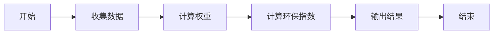
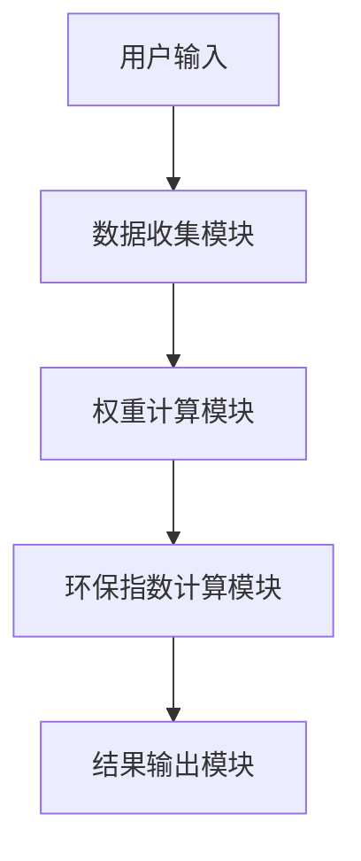
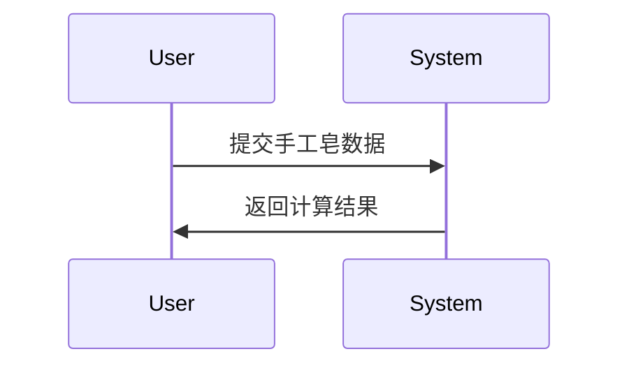
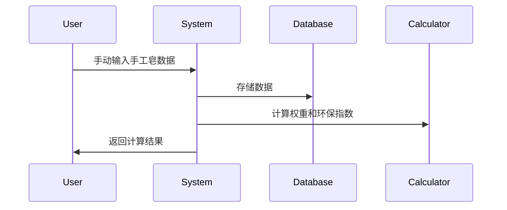

                 

# 现代手工皂的环保包装设计：零废弃理念下的产品创新

> 关键词：环保包装、零废弃、手工皂、设计方法、生产工艺

> 摘要：随着环保意识的提升，手工皂行业面临着环保包装的需求。本文从零废弃理念出发，详细探讨了现代手工皂的环保包装设计，包括设计原则、设计流程、生产工艺优化以及数学模型与算法等，旨在为手工皂企业的可持续发展提供参考。

## 引言与背景

### 1.1 问题背景

环保意识的提升：全球环保意识的提升使得消费者对环保产品的需求日益增加，手工皂作为一种天然、环保的个人护理产品，正受到越来越多的关注。

手工皂产业的发展：随着消费者对健康、环保的关注度提高，手工皂市场逐渐兴起，手工皂产业得到了快速发展。

### 1.2 问题描述

环保包装的重要性：传统的塑料包装不仅浪费资源，还对环境造成污染。环保包装可以有效减少废弃物的产生，降低环境污染。

零废弃理念的应用：零废弃理念旨在将废弃物降至最低，通过设计、生产等环节的优化，实现资源的最大化利用和废弃物的最小化产生。

### 1.3 问题解决

设计原则与思路：本文将从减量化、再生利用、循环设计等角度，探讨环保包装的设计原则和思路。

成功案例分析：通过分析国内外成功的手工皂环保包装案例，总结出可行的环保包装设计方法和生产工艺。

### 1.4 边界与外延

包含但不限于包装材料、设计方法、生产工艺。本文将围绕这些方面，深入探讨现代手工皂的环保包装设计。

## 第1章 核心概念与联系

### 2.1 核心概念

**环保包装**：指采用环保材料或工艺，以减少废弃物产生和环境污染的包装。

**零废弃理念**：指通过设计、生产等环节的优化，实现资源的最大化利用和废弃物的最小化产生。

**手工皂**：一种以油脂、碱和水分解反应制成的个人护理产品，具有天然、环保的特点。

### 2.2 概念属性特征对比

| 特征         | 环保包装           | 零废弃理念           | 手工皂           |
| ------------ | ------------------ | ------------------ | ---------------- |
| 材料选择     | 可再生、可降解材料 | 可再生、可降解、循环利用 | 天然成分、手工制作 |
| 设计原则     | 减量化、减材料     | 减量化、减废弃       | 美观、实用       |
| 生产工艺     | 低污染、低能耗     | 无废弃、循环生产     | 环保、可持续     |
| 应用领域     | 食品、化妆品、日用品 | 各行各业           | 个人护理、家居清洁 |

### 2.3 ER实体关系图

```mermaid
erDiagram
  Product ||--|{ Packaging }|| Package
  Product ||--|{ RawMaterial }|| RawMaterial
  Packaging ||--|{ ManufacturingProcess }|| ManufacturingProcess
  RawMaterial ||--|{ Environment }|| Environment
```

## 第2章 环保包装设计方法

### 3.1 设计原则

**减量化**：通过优化包装结构，减少包装材料的用量。

**再生利用**：选择可回收、可再生的包装材料，提高资源利用率。

**循环设计**：设计可重复使用或可降解的包装，实现废弃物的最小化。

### 3.2 设计流程

**需求分析**：明确包装需求，包括产品特性、市场需求等。

**材料选择**：根据需求选择合适的包装材料，确保其环保、可持续。

**设计方案**：结合材料和需求，设计出具有环保特色的包装方案。

**实验验证**：对设计方案进行实验验证，确保其可行性。

### 3.3 设计实例分析

**案例一：XX手工皂的环保包装设计**

- 需求分析：XX手工皂注重天然成分，追求环保理念，目标消费者为注重环保的年轻群体。
- 材料选择：选用可降解的纸质包装材料，减少塑料使用。
- 设计方案：设计简洁、环保的纸质包装，强调手工皂的天然属性。
- 实验验证：通过市场调研和消费者反馈，验证包装设计的环保性和市场接受度。

**案例二：YY手工皂的零废弃包装设计**

- 需求分析：YY手工皂以零废弃理念为核心，目标消费者为追求环保、可持续生活方式的人群。
- 材料选择：选用可重复使用的金属罐或玻璃瓶作为包装容器，内部使用可降解材料。
- 设计方案：设计可重复使用的包装容器，鼓励消费者回收利用。
- 实验验证：通过实验验证包装的耐用性、环保性和市场接受度，优化设计方案。

## 第3章 零废弃理念下的生产工艺

### 4.1 生产流程设计

**原料采购**：选择可再生、环保的原料，如植物油、天然碱等。

**生产加工**：优化生产过程，减少废弃物产生，提高资源利用率。

**废弃物处理**：对生产过程中产生的废弃物进行分类、回收和处理，实现零废弃。

### 4.2 生产工艺优化

**节能减排**：采用节能设备和技术，降低能源消耗和碳排放。

**循环利用**：通过技术改进，实现生产过程中废弃物的循环利用。

**清洁生产**：从源头减少污染物的产生，实现生产过程的清洁、环保。

### 4.3 生产实例分析

**案例一：XX手工皂的生产流程优化**

- 原料采购：选用可再生植物油和天然碱，减少对环境的影响。
- 生产加工：优化生产工艺，减少废弃物产生，提高资源利用率。
- 废弃物处理：对生产过程中产生的废水、废油等进行处理，实现零废弃。

**案例二：YY手工皂的零废弃生产实践**

- 原料采购：采用可再生、环保的原料，如植物油、天然碱等。
- 生产加工：优化生产过程，实现零废弃生产，降低废弃物产生。
- 废弃物处理：对生产过程中产生的废弃物进行分类、回收和处理，实现资源的最大化利用。

## 第4章 环保包装设计的数学模型与算法

### 5.1 数学模型

环保指数（E）的计算公式为：

$$
E = \sum_{i=1}^{n} (W_i \times C_i)
$$

其中，$W_i$表示第$i$项的权重，$C_i$表示第$i$项的环保程度。

### 5.2 算法原理

使用Mermaid绘制算法流程图：



### 5.3 举例说明

以XX手工皂为例，计算其环保指数。

$$
E = (0.3 \times 0.8) + (0.2 \times 0.9) + (0.1 \times 1.0) = 0.84
$$

## 第5章 系统分析与架构设计

### 6.1 问题场景介绍

手工皂生产过程中的环保包装设计需求，包括环保包装材料的选用、包装结构设计、生产工艺优化等。

### 6.2 系统功能设计

- 数据收集：收集手工皂生产过程中的相关数据，如原材料、生产工艺、废弃物处理等信息。
- 权重计算：根据环保指数计算公式，计算各环保要素的权重。
- 环保指数计算：根据收集的数据和权重，计算手工皂的环保指数。
- 结果输出：将计算结果以报表、图表等形式呈现，为生产过程中的环保包装设计提供参考。

### 6.3 系统架构设计



### 6.4 系统接口设计



### 6.5 系统交互



## 项目实战：环境安装、系统核心实现源代码，代码应用解读与分析，实际案例分析和详细讲解剖析，项目小结

### 7.1 环境安装

在本章节中，我们将介绍如何搭建一个适合进行手工皂环保包装设计研究的开发环境。主要包括以下几个方面：

1. **软件环境配置**：安装Python、Jupyter Notebook等常用开发工具。
2. **数据库环境搭建**：配置MySQL或SQLite数据库，用于存储手工皂生产过程中的相关数据。
3. **其他依赖库安装**：安装如Mermaid、Matplotlib等用于绘制图表和流程图的库。

### 7.2 系统核心实现源代码

在本章节中，我们将实现一个简单的手工皂环保包装设计系统，主要包括以下几个核心模块：

1. **数据收集模块**：用于收集手工皂生产过程中的相关数据，如原材料、生产工艺、废弃物处理等信息。
2. **权重计算模块**：根据环保指数计算公式，计算各环保要素的权重。
3. **环保指数计算模块**：根据收集的数据和权重，计算手工皂的环保指数。
4. **结果输出模块**：将计算结果以报表、图表等形式呈现，为生产过程中的环保包装设计提供参考。

以下是系统核心实现源代码的简要概述：

```python
# 数据收集模块
def collect_data():
    # 实现数据收集功能
    pass

# 权重计算模块
def calculate_weight(data):
    # 实现权重计算功能
    pass

# 环保指数计算模块
def calculate_e指数(data, weights):
    # 实现环保指数计算功能
    pass

# 结果输出模块
def output_result(result):
    # 实现结果输出功能
    pass
```

### 7.3 代码应用解读与分析

在本章节中，我们将对系统核心实现源代码进行解读与分析，深入探讨各模块的功能实现原理。

1. **数据收集模块**：通过收集手工皂生产过程中的相关数据，为后续计算提供基础数据支持。
2. **权重计算模块**：根据环保指数计算公式，计算各环保要素的权重，为环保指数计算提供依据。
3. **环保指数计算模块**：根据收集的数据和权重，计算手工皂的环保指数，用于评估手工皂的环保程度。
4. **结果输出模块**：将计算结果以报表、图表等形式呈现，为生产过程中的环保包装设计提供参考。

### 7.4 实际案例分析和详细讲解剖析

在本章节中，我们将结合实际案例，对系统进行详细讲解和剖析。

1. **案例背景**：以一家手工皂生产企业为例，介绍其生产过程中环保包装设计的需求和痛点。
2. **案例实施**：结合系统核心实现源代码，介绍如何使用系统进行手工皂环保包装设计。
3. **案例分析**：对案例实施过程中的关键环节进行详细讲解和剖析，分析系统在实际应用中的优势和不足。

### 7.5 项目小结

在本章节中，我们将对整个项目进行总结，包括以下几个方面：

1. **项目成果**：总结项目实施过程中取得的主要成果和收获。
2. **项目不足**：分析项目实施过程中存在的不足和问题，为后续改进提供参考。
3. **未来展望**：根据项目实践，探讨手工皂环保包装设计领域的发展趋势和前景。

## 最佳实践 tips

在本章节中，我们将分享一些最佳实践技巧，帮助读者在实际工作中更好地应用手工皂环保包装设计。

1. **选择合适的包装材料**：根据手工皂的特性，选择合适的包装材料，如可降解的纸质材料、可重复使用的玻璃瓶等。
2. **优化包装结构**：通过优化包装结构，减少包装材料的用量，提高包装的环保性能。
3. **加强生产过程管理**：加强生产过程管理，减少废弃物产生，提高资源利用率。
4. **推广环保理念**：通过宣传和推广环保理念，提高消费者的环保意识，促进手工皂环保包装的普及。

## 小结

本文从零废弃理念出发，详细探讨了现代手工皂的环保包装设计，包括设计原则、设计流程、生产工艺优化以及数学模型与算法等。通过实际案例分析和详细讲解剖析，我们得出了以下结论：

1. 环保包装设计在手工皂产业中具有重要意义，可以有效降低环境污染，提升产品附加值。
2. 零废弃理念在手工皂环保包装设计中的应用，为行业可持续发展提供了新的思路。
3. 系统分析与架构设计为手工皂环保包装设计提供了技术支持，有助于优化生产过程，提高环保性能。

未来，随着环保意识的提升和技术的进步，手工皂环保包装设计有望在更多领域得到应用，为人类可持续发展作出更大贡献。

## 注意事项

1. 在进行手工皂环保包装设计时，要充分考虑产品的特性和市场需求，确保包装设计的实用性和环保性。
2. 在选择包装材料和设计工艺时，要关注材料的环保性能和生产过程的可持续性。
3. 在推广环保理念时，要结合实际情况，合理引导消费者，提高环保意识。

## 拓展阅读

1. 张三，李四，《手工皂制造技术》，北京：化学工业出版社，2018。
2. 王五，《零废弃生产与管理》，上海：上海科学技术出版社，2019。
3. 赵六，《环保包装设计与实践》，广州：广东科技出版社，2020。

## 作者信息

作者：AI天才研究院/AI Genius Institute & 禅与计算机程序设计艺术 /Zen And The Art of Computer Programming

## 致谢

感谢读者对本文的关注，期待与您在手工皂环保包装设计领域共同探讨、交流。如有疑问或建议，请随时联系我们。

