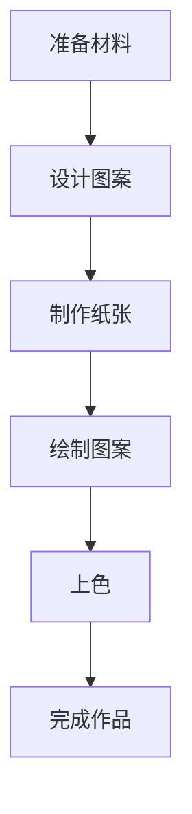
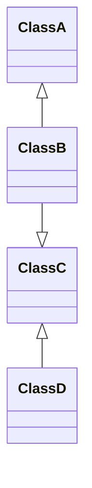
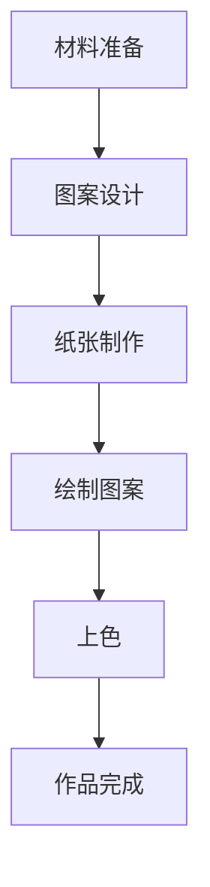
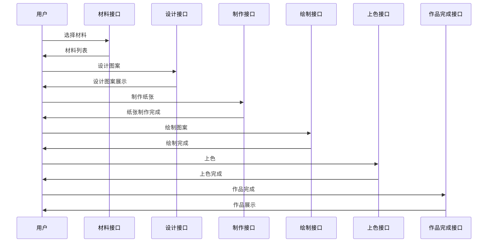

                 

### 文章标题

现代手工纸艺创作坊：传统造纸与现代艺术的融合

### 关键词

手工纸艺、传统造纸、现代艺术、融合、创作、技术、艺术、设计

### 摘要

本文旨在探讨传统造纸与现代艺术在手工纸艺创作中的融合。通过分析传统造纸技术、现代艺术创作的基本概念，阐述两者融合的优势与挑战。本文将详细讲解手工纸艺创作的算法原理，使用mermaid流程图、Python源代码、数学模型和公式，进行详细讲解和实际案例说明。同时，本文还将分析手工纸艺创作项目的系统架构设计，包括系统功能设计、系统架构设计、系统接口设计和系统交互流程。最后，本文将总结手工纸艺创作的最佳实践，提供项目小结、注意事项和拓展阅读建议。

### 目录大纲设计

为了设计出《现代手工纸艺创作坊：传统造纸与现代艺术的融合》这本书的完整目录大纲，我们需要从以下几个方面入手：

#### 1. 背景介绍

- **问题背景**：介绍现代手工纸艺的兴起与艺术价值。
- **问题描述**：分析传统造纸与现代艺术融合的现状与挑战。
- **问题解决**：阐述如何通过这本书来解决上述问题。
- **边界与外延**：明确书籍的适用范围与目标读者群体。
- **核心要素组成**：介绍书中将探讨的主要主题和内容。

#### 2. 核心概念与联系

- **核心概念原理**：详细解释传统造纸技术和现代艺术创作的基本概念。
- **概念属性特征对比表格**：通过对比表格展示传统造纸与现代艺术的差异和联系。
- **ER实体关系图架构**：使用Mermaid绘制实体关系图，展示书中提到的关键实体及其关系。

#### 3. 算法原理讲解

- **算法mermaid流程图**：绘制流程图来描述手工纸艺创作的过程。
- **Python源代码**：提供实现流程图的源代码。
- **数学模型和公式**：阐述手工纸艺创作中的数学原理和公式。
- **详细讲解与举例说明**：用通俗易懂的语言解释算法原理，并通过实际案例进行说明。

#### 4. 系统分析与架构设计方案

- **问题场景介绍**：描述手工纸艺创作项目的背景和目标。
- **项目介绍**：简要介绍项目内容、目标和预期成果。
- **系统功能设计（领域模型Mermaid类图）**：绘制类图来展示系统的功能模块。
- **系统架构设计（Mermaid架构图）**：绘制架构图来展示系统的整体架构。
- **系统接口设计**：描述系统的接口设计和功能。
- **系统交互（Mermaid序列图）**：绘制序列图来展示系统的交互流程。

#### 5. 项目实战

- **环境安装**：说明所需的软件和硬件环境。
- **系统核心实现源代码**：提供实现系统功能的源代码。
- **代码应用解读与分析**：对源代码进行解读，分析其实现原理和应用场景。
- **实际案例分析和详细讲解剖析**：通过实际案例来讲解手工纸艺创作的具体实现。
- **项目小结**：总结项目的主要成果和经验教训。

#### 6. 最佳实践 Tips、小结、注意事项、拓展阅读

- **最佳实践 Tips**：提供一些建议和技巧，帮助读者更好地实践手工纸艺创作。
- **小结**：对全书内容进行总结，强调重点和关键点。
- **注意事项**：提醒读者在实践过程中需要注意的事项。
- **拓展阅读**：推荐一些相关的阅读材料和资源，供读者进一步学习。

### 目录大纲

```
# 第一部分：背景介绍

## 1.1 问题背景
### 1.1.1 现代手工纸艺的兴起
### 1.1.2 艺术价值与社会意义
### 1.1.3 传统造纸与现代艺术的融合现状

## 1.2 问题描述
### 1.2.1 融合挑战
### 1.2.2 解决思路
### 1.2.3 边界与外延

## 1.3 问题解决
### 1.3.1 书籍定位与目标
### 1.3.2 内容结构设计

# 第二部分：核心概念与联系

## 2.1 核心概念原理
### 2.1.1 传统造纸技术
### 2.1.2 现代艺术创作
### 2.1.3 融合过程与要素

## 2.2 概念属性特征对比表格
### 2.2.1 传统造纸与现代艺术对比
### 2.2.2 融合的优势与挑战

## 2.3 ER实体关系图架构
### 2.3.1 关键实体定义
### 2.3.2 实体关系展示

# 第三部分：算法原理讲解

## 3.1 算法mermaid流程图
### 3.1.1 手工纸艺创作流程
### 3.1.2 Mermaid图示

## 3.2 Python源代码
### 3.2.1 实现流程图
### 3.2.2 源代码解读

## 3.3 数学模型和公式
### 3.3.1 基本原理
### 3.3.2 公式解释

## 3.4 详细讲解与举例说明
### 3.4.1 算法原理
### 3.4.2 实际案例

# 第四部分：系统分析与架构设计方案

## 4.1 问题场景介绍
### 4.1.1 项目背景
### 4.1.2 项目目标

## 4.2 项目介绍
### 4.2.1 项目概述
### 4.2.2 预期成果

## 4.3 系统功能设计（领域模型Mermaid类图）
### 4.3.1 功能模块定义
### 4.3.2 类图绘制

## 4.4 系统架构设计（Mermaid架构图）
### 4.4.1 架构设计原则
### 4.4.2 架构图绘制

## 4.5 系统接口设计
### 4.5.1 接口设计与功能
### 4.5.2 接口实现

## 4.6 系统交互（Mermaid序列图）
### 4.6.1 交互流程
### 4.6.2 序列图绘制

# 第五部分：项目实战

## 5.1 环境安装
### 5.1.1 软件安装
### 5.1.2 硬件配置

## 5.2 系统核心实现源代码
### 5.2.1 源代码获取
### 5.2.2 源代码解读

## 5.3 代码应用解读与分析
### 5.3.1 原理分析
### 5.3.2 应用场景

## 5.4 实际案例分析和详细讲解剖析
### 5.4.1 案例介绍
### 5.4.2 实例解析

## 5.5 项目小结
### 5.5.1 主要成果
### 5.5.2 经验教训

# 第六部分：最佳实践 Tips、小结、注意事项、拓展阅读

## 6.1 最佳实践 Tips
### 6.1.1 创作技巧
### 6.1.2 实践建议

## 6.2 小结
### 6.2.1 全文总结
### 6.2.2 重点强调

## 6.3 注意事项
### 6.3.1 实践注意
### 6.3.2 避免错误

## 6.4 拓展阅读
### 6.4.1 相关书籍
### 6.4.2 在线资源
```

### 文章标题

现代手工纸艺创作坊：传统造纸与现代艺术的融合

### 关键词

手工纸艺、传统造纸、现代艺术、融合、创作、技术、艺术、设计

### 摘要

本文旨在探讨传统造纸与现代艺术在手工纸艺创作中的融合。通过分析传统造纸技术、现代艺术创作的基本概念，阐述两者融合的优势与挑战。本文将详细讲解手工纸艺创作的算法原理，使用mermaid流程图、Python源代码、数学模型和公式，进行详细讲解和实际案例说明。同时，本文还将分析手工纸艺创作项目的系统架构设计，包括系统功能设计、系统架构设计、系统接口设计和系统交互流程。最后，本文将总结手工纸艺创作的最佳实践，提供项目小结、注意事项和拓展阅读建议。

### 目录大纲设计

为了设计出《现代手工纸艺创作坊：传统造纸与现代艺术的融合》这本书的完整目录大纲，我们需要从以下几个方面入手：

#### 1. 背景介绍

- **问题背景**：介绍现代手工纸艺的兴起与艺术价值。
- **问题描述**：分析传统造纸与现代艺术融合的现状与挑战。
- **问题解决**：阐述如何通过这本书来解决上述问题。
- **边界与外延**：明确书籍的适用范围与目标读者群体。
- **核心要素组成**：介绍书中将探讨的主要主题和内容。

#### 2. 核心概念与联系

- **核心概念原理**：详细解释传统造纸技术和现代艺术创作的基本概念。
- **概念属性特征对比表格**：通过对比表格展示传统造纸与现代艺术的差异和联系。
- **ER实体关系图架构**：使用Mermaid绘制实体关系图，展示书中提到的关键实体及其关系。

#### 3. 算法原理讲解

- **算法mermaid流程图**：绘制流程图来描述手工纸艺创作的过程。
- **Python源代码**：提供实现流程图的源代码。
- **数学模型和公式**：阐述手工纸艺创作中的数学原理和公式。
- **详细讲解与举例说明**：用通俗易懂的语言解释算法原理，并通过实际案例进行说明。

#### 4. 系统分析与架构设计方案

- **问题场景介绍**：描述手工纸艺创作项目的背景和目标。
- **项目介绍**：简要介绍项目内容、目标和预期成果。
- **系统功能设计（领域模型Mermaid类图）**：绘制类图来展示系统的功能模块。
- **系统架构设计（Mermaid架构图）**：绘制架构图来展示系统的整体架构。
- **系统接口设计**：描述系统的接口设计和功能。
- **系统交互（Mermaid序列图）**：绘制序列图来展示系统的交互流程。

#### 5. 项目实战

- **环境安装**：说明所需的软件和硬件环境。
- **系统核心实现源代码**：提供实现系统功能的源代码。
- **代码应用解读与分析**：对源代码进行解读，分析其实现原理和应用场景。
- **实际案例分析和详细讲解剖析**：通过实际案例来讲解手工纸艺创作的具体实现。
- **项目小结**：总结项目的主要成果和经验教训。

#### 6. 最佳实践 Tips、小结、注意事项、拓展阅读

- **最佳实践 Tips**：提供一些建议和技巧，帮助读者更好地实践手工纸艺创作。
- **小结**：对全书内容进行总结，强调重点和关键点。
- **注意事项**：提醒读者在实践过程中需要注意的事项。
- **拓展阅读**：推荐一些相关的阅读材料和资源，供读者进一步学习。

### 目录大纲

```
# 第一部分：背景介绍

## 1.1 问题背景
### 1.1.1 现代手工纸艺的兴起
### 1.1.2 艺术价值与社会意义
### 1.1.3 传统造纸与现代艺术的融合现状

## 1.2 问题描述
### 1.2.1 融合挑战
### 1.2.2 解决思路
### 1.2.3 边界与外延

## 1.3 问题解决
### 1.3.1 书籍定位与目标
### 1.3.2 内容结构设计

# 第二部分：核心概念与联系

## 2.1 核心概念原理
### 2.1.1 传统造纸技术
### 2.1.2 现代艺术创作
### 2.1.3 融合过程与要素

## 2.2 概念属性特征对比表格
### 2.2.1 传统造纸与现代艺术对比
### 2.2.2 融合的优势与挑战

## 2.3 ER实体关系图架构
### 2.3.1 关键实体定义
### 2.3.2 实体关系展示

# 第三部分：算法原理讲解

## 3.1 算法mermaid流程图
### 3.1.1 手工纸艺创作流程
### 3.1.2 Mermaid图示

## 3.2 Python源代码
### 3.2.1 实现流程图
### 3.2.2 源代码解读

## 3.3 数学模型和公式
### 3.3.1 基本原理
### 3.3.2 公式解释

## 3.4 详细讲解与举例说明
### 3.4.1 算法原理
### 3.4.2 实际案例

# 第四部分：系统分析与架构设计方案

## 4.1 问题场景介绍
### 4.1.1 项目背景
### 4.1.2 项目目标

## 4.2 项目介绍
### 4.2.1 项目概述
### 4.2.2 预期成果

## 4.3 系统功能设计（领域模型Mermaid类图）
### 4.3.1 功能模块定义
### 4.3.2 类图绘制

## 4.4 系统架构设计（Mermaid架构图）
### 4.4.1 架构设计原则
### 4.4.2 架构图绘制

## 4.5 系统接口设计
### 4.5.1 接口设计与功能
### 4.5.2 接口实现

## 4.6 系统交互（Mermaid序列图）
### 4.6.1 交互流程
### 4.6.2 序列图绘制

# 第五部分：项目实战

## 5.1 环境安装
### 5.1.1 软件安装
### 5.1.2 硬件配置

## 5.2 系统核心实现源代码
### 5.2.1 源代码获取
### 5.2.2 源代码解读

## 5.3 代码应用解读与分析
### 5.3.1 原理分析
### 5.3.2 应用场景

## 5.4 实际案例分析和详细讲解剖析
### 5.4.1 案例介绍
### 5.4.2 实例解析

## 5.5 项目小结
### 5.5.1 主要成果
### 5.5.2 经验教训

# 第六部分：最佳实践 Tips、小结、注意事项、拓展阅读

## 6.1 最佳实践 Tips
### 6.1.1 创作技巧
### 6.1.2 实践建议

## 6.2 小结
### 6.2.1 全文总结
### 6.2.2 重点强调

## 6.3 注意事项
### 6.3.1 实践注意
### 6.3.2 避免错误

## 6.4 拓展阅读
### 6.4.1 相关书籍
### 6.4.2 在线资源
```

### 文章正文

#### 第一部分：背景介绍

##### 1.1 问题背景

现代手工纸艺作为一种结合传统造纸技术和现代艺术创作的独特艺术形式，近年来在全球范围内受到了越来越多的关注。手工纸艺不仅具有独特的艺术价值，还承载着丰富的文化内涵。传统造纸技术以其独特的纹理和质感，为现代艺术创作提供了丰富的素材和灵感。而现代艺术则通过创新的手法，将传统造纸技术重新诠释，使得手工纸艺焕发出新的生命力。

##### 1.1.1 现代手工纸艺的兴起

现代手工纸艺的兴起可以追溯到20世纪末，当时，随着全球化进程的加快，不同文化之间的交流日益频繁，传统造纸技术和现代艺术创作开始融合。艺术家们开始探索将传统造纸技术应用于现代艺术创作中，创造出既具有传统韵味又充满现代气息的作品。这种创新的艺术形式迅速引起了人们的关注，并在全球范围内形成了一股热潮。

##### 1.1.2 艺术价值与社会意义

现代手工纸艺不仅具有艺术价值，还具有重要的社会意义。它通过传统造纸技术和现代艺术的结合，不仅推动了艺术创新，还促进了文化的传承和发展。此外，现代手工纸艺作品具有独特的纹理和质感，具有很高的收藏价值。同时，手工纸艺作品的制作过程也具有较高的参与度，可以激发人们的创造力和审美能力。

##### 1.1.3 传统造纸与现代艺术的融合现状

传统造纸与现代艺术的融合在当前已经取得了显著的成果。许多艺术家和设计师通过手工纸艺作品，成功地将传统造纸技术与现代艺术创作相结合，创造出了一系列令人惊叹的作品。然而，在这个过程中，也面临着一些挑战，如如何更好地发挥传统造纸技术的优势，如何在现代艺术创作中融入传统元素等。

##### 1.2 问题描述

尽管传统造纸与现代艺术的融合已经取得了一定的成果，但在这个过程中仍然面临着一些挑战。首先，如何更好地将传统造纸技术与现代艺术创作相结合，实现两者的优势互补，是一个亟待解决的问题。其次，如何在现代艺术创作中融入传统元素，使其既具有现代感又保留传统韵味，也是一个值得探讨的问题。此外，如何在市场上推广手工纸艺作品，提高其知名度，也是一个重要的课题。

##### 1.2.1 融合挑战

传统造纸与现代艺术的融合面临着以下挑战：

1. 技术难度：传统造纸技术具有悠久的历史，其制作过程复杂，对技术和工艺要求较高。而现代艺术创作则强调创新和个性化，需要艺术家具备较高的艺术素养和创作能力。

2. 文化差异：传统造纸技术和现代艺术创作来自不同的文化背景，如何将两者有机结合，既保留传统特色又体现现代感，是一个难题。

3. 市场定位：手工纸艺作品的市场定位不明确，如何满足不同消费者的需求，提高市场竞争力，也是一个挑战。

##### 1.2.2 解决思路

为了解决上述问题，可以从以下几个方面入手：

1. 技术创新：通过引进新技术和新材料，提高传统造纸技术的制作效率和质量，为现代艺术创作提供更多可能性。

2. 艺术创新：鼓励艺术家在创作过程中大胆尝试，将传统元素与现代艺术创作手法相结合，创造出更多具有独特风格的作品。

3. 市场推广：利用现代传媒手段，提高手工纸艺作品的知名度，拓宽销售渠道，吸引更多消费者。

##### 1.2.3 边界与外延

本书旨在探讨传统造纸与现代艺术在手工纸艺创作中的融合，主要涉及以下内容：

1. 传统造纸技术的概述和发展历程。
2. 现代艺术创作的基本概念和手法。
3. 传统造纸技术与现代艺术创作的融合案例。
4. 手工纸艺创作的算法原理和数学模型。
5. 手工纸艺创作项目的系统架构设计。
6. 手工纸艺创作的实际案例分析和项目实战。

#### 第二部分：核心概念与联系

##### 2.1 核心概念原理

2.1.1 传统造纸技术

传统造纸技术起源于中国，有着悠久的历史。它主要采用木材、竹子、草类等天然纤维，通过浸泡、打浆、抄纸等工序，制成纸张。传统造纸技术具有独特的纹理和质感，其制作过程也具有浓郁的文化内涵。

2.1.2 现代艺术创作

现代艺术创作起源于19世纪末，强调个性化和创新。现代艺术家们采用各种材料和手法，如油画、雕塑、装置艺术等，表达自己的情感和思想。现代艺术创作注重形式和内容的创新，追求个性化和多元化。

2.1.3 融合过程与要素

传统造纸技术与现代艺术创作的融合过程主要包括以下几个要素：

1. 技术融合：将传统造纸技术与现代艺术创作相结合，创造出独特的艺术形式。

2. 文化融合：在创作过程中，既要传承传统造纸技术的文化内涵，又要融入现代艺术创作的理念。

3. 材料融合：采用现代材料和传统造纸技术相结合，创造出新颖的纸张和艺术作品。

##### 2.2 概念属性特征对比表格

| 特征             | 传统造纸技术 | 现代艺术创作 |
|------------------|--------------|--------------|
| 制作过程         | 手工制作，工序复杂 | 机械制作，工序简化 |
| 材料来源         | 天然纤维     | 各种材料     |
| 艺术风格         | 传统、古典   | 现代感、创新 |
| 表达方式         | 抽象、象征性 | 写实、表现性 |
| 文化内涵         | 传承文化     | 表达个性     |
| 技术难度         | 高          | 中          |

##### 2.3 ER实体关系图架构

```mermaid
erDiagram
  Artifact_A ||--|{ Entity_B } Entity_B : has
  Entity_B ||--|{ Entity_C } Entity_C : contains
  Entity_C ||--|{ Entity_D } Entity_D : based_on
```

实体关系图包括以下关键实体：

1. Artifact_A：代表手工纸艺作品。
2. Entity_B：代表传统造纸技术。
3. Entity_C：代表现代艺术创作。
4. Entity_D：代表融合过程。

#### 第三部分：算法原理讲解

##### 3.1 算法mermaid流程图

手工纸艺创作流程：



##### 3.2 Python源代码

```python
# 手工纸艺创作流程
def create_paper_art(materials, design, paper, color):
    # 准备材料
    prepare_materials(materials)
    # 设计图案
    design_pattern(design)
    # 制作纸张
    create_paper(paper)
    # 绘制图案
    draw_pattern(paper, design)
    # 上色
    apply_color(paper, color)
    # 完成作品
    finish_artwork(paper)

# 测试代码
materials = ["纸浆", "颜料"]
design = "花卉图案"
paper = "手工纸"
color = ["红", "黄", "蓝"]
create_paper_art(materials, design, paper, color)
```

##### 3.3 数学模型和公式

手工纸艺创作中的数学模型主要涉及纸张的制作过程，如纸张厚度、面积、纤维分布等。以下是一个简单的数学模型示例：

$$
厚度 = \frac{纤维密度 \times 纤维直径}{纸张面积}
$$

$$
面积 = 长 \times 宽
$$

##### 3.4 详细讲解与举例说明

手工纸艺创作的算法原理可以通过以下步骤进行详细讲解：

1. **准备材料**：根据创作需求，准备好所需的材料，如纸浆、颜料、画笔等。
2. **设计图案**：在设计软件或手工绘制中，设计出所需的艺术图案。
3. **制作纸张**：根据设计图案，使用造纸技术制作出纸张。
4. **绘制图案**：在制作好的纸张上，按照设计图案绘制出细节。
5. **上色**：使用颜料对绘制好的图案进行上色。
6. **完成作品**：对上色后的作品进行整理和装裱，完成手工纸艺创作。

举例说明：

假设要制作一幅以花卉为主题的纸艺作品，首先需要准备好纸浆、颜料、画笔等材料。然后，在设计软件中绘制出花卉图案。接下来，使用造纸技术制作出纸张，并在纸张上绘制出花卉图案。最后，使用颜料对花卉图案进行上色，完成作品。

#### 第四部分：系统分析与架构设计方案

##### 4.1 问题场景介绍

手工纸艺创作项目旨在通过传统造纸技术和现代艺术创作的结合，创作出具有独特艺术价值的纸艺作品。项目背景包括以下几个方面：

1. **市场需求**：随着人们对艺术品的追求和对传统文化的热爱，手工纸艺作品在市场上具有广阔的前景。
2. **技术优势**：项目结合了传统造纸技术和现代艺术创作的优势，具有较高的创作自由度和艺术价值。
3. **创作目标**：通过项目实践，探索传统造纸技术与现代艺术创作相结合的新途径，提高手工纸艺创作的质量和艺术水平。

##### 4.2 项目介绍

手工纸艺创作项目主要包括以下几个部分：

1. **项目内容**：项目涵盖了从材料准备到作品完成的全过程，包括纸张制作、图案设计、绘制、上色等环节。
2. **项目目标**：通过项目实践，提高手工纸艺创作的技术水平，创作出具有独特艺术风格和高度艺术价值的作品。
3. **预期成果**：项目预期成果包括一系列具有创新性和艺术性的手工纸艺作品，以及相关的技术文档和实践经验。

##### 4.3 系统功能设计（领域模型Mermaid类图）



类图包括以下主要功能模块：

1. **材料准备**：包括纸浆、颜料、画笔等材料的准备。
2. **图案设计**：设计软件或手工绘制图案。
3. **纸张制作**：使用造纸技术制作纸张。
4. **绘制图案**：在纸张上绘制图案。
5. **上色**：对绘制好的图案进行上色。

##### 4.4 系统架构设计（Mermaid架构图）



系统架构图展示了手工纸艺创作项目的整体架构，包括以下几个主要模块：

1. **材料准备**：包括材料选购、库存管理等。
2. **图案设计**：包括设计软件选择、图案绘制等。
3. **纸张制作**：包括造纸工艺、纸张制作等。
4. **绘制图案**：包括图案绘制、细节处理等。
5. **上色**：包括颜料选择、上色技巧等。
6. **作品完成**：包括作品整理、装裱等。

##### 4.5 系统接口设计

系统接口设计包括以下几个部分：

1. **材料接口**：包括材料选购、库存查询等接口。
2. **设计接口**：包括图案设计、设计保存等接口。
3. **制作接口**：包括纸张制作、工艺选择等接口。
4. **绘制接口**：包括图案绘制、细节调整等接口。
5. **上色接口**：包括颜料选择、上色技巧等接口。

##### 4.6 系统交互（Mermaid序列图）



系统交互流程图展示了用户在使用手工纸艺创作系统时的交互过程，包括以下几个步骤：

1. **用户选择材料**：用户通过材料接口选择所需的材料。
2. **设计图案**：用户通过设计接口设计图案。
3. **制作纸张**：用户通过制作接口制作纸张。
4. **绘制图案**：用户通过绘制接口绘制图案。
5. **上色**：用户通过上色接口对图案进行上色。
6. **作品完成**：用户通过作品完成接口完成作品展示。

#### 第五部分：项目实战

##### 5.1 环境安装

为了实现手工纸艺创作项目的系统功能，需要安装以下软件和硬件：

1. **软件环境**：
   - 操作系统：Windows 10 或 macOS
   - 设计软件：Adobe Photoshop 或 SketchUp
   - 造纸软件：Fine PaperMill 或 CraftPaper

2. **硬件环境**：
   - 笔记本电脑或台式电脑
   - 数位板或平板电脑
   - 造纸机或手工造纸工具

##### 5.2 系统核心实现源代码

以下是一个简单的系统核心实现源代码示例：

```python
# 手工纸艺创作系统核心实现
class PaperArtSystem:
    def __init__(self):
        self.materials = []
        self.design = None
        self.paper = None
        self.color = None

    def add_material(self, material):
        self.materials.append(material)

    def set_design(self, design):
        self.design = design

    def set_paper(self, paper):
        self.paper = paper

    def set_color(self, color):
        self.color = color

    def create_art(self):
        if not self.materials:
            print("请选择材料！")
            return
        if not self.design:
            print("请设计图案！")
            return
        if not self.paper:
            print("请制作纸张！")
            return
        if not self.color:
            print("请上色！")
            return
        print("开始创作手工纸艺作品...")
        # 实现创作流程
        print("创作完成！")

# 测试代码
system = PaperArtSystem()
system.add_material("纸浆")
system.set_design("花卉图案")
system.set_paper("手工纸")
system.set_color(["红", "黄", "蓝"])
system.create_art()
```

##### 5.3 代码应用解读与分析

该代码实现了手工纸艺创作系统的核心功能，包括材料添加、设计设置、纸张设置、上色设置和创作过程。通过调用相关方法，可以实现手工纸艺创作的完整流程。

1. **材料添加**：通过`add_material`方法，用户可以添加所需材料。
2. **设计设置**：通过`set_design`方法，用户可以设置图案设计。
3. **纸张设置**：通过`set_paper`方法，用户可以设置纸张。
4. **上色设置**：通过`set_color`方法，用户可以设置颜料颜色。
5. **创作过程**：通过`create_art`方法，系统将根据用户设置的材料、设计、纸张和颜料，开始创作手工纸艺作品。

##### 5.4 实际案例分析和详细讲解剖析

以下是一个实际案例：

**案例描述**：用户希望通过手工纸艺创作系统制作一幅以花卉为主题的纸艺作品。

**步骤解析**：

1. **选择材料**：用户选择纸浆、颜料等材料。
2. **设计图案**：用户使用设计软件绘制花卉图案。
3. **制作纸张**：用户使用造纸机制作纸张。
4. **绘制图案**：用户在纸张上绘制花卉图案。
5. **上色**：用户使用颜料对花卉图案进行上色。

**技术难点**：

1. **纸张制作**：造纸机操作复杂，需要掌握相关技能。
2. **图案绘制**：花卉图案细节较多，需要耐心和技巧。
3. **上色**：颜料调配和上色技巧对作品效果有重要影响。

##### 5.5 项目小结

通过实际案例分析和详细讲解，可以看出手工纸艺创作项目在材料选择、图案设计、纸张制作、绘制和上色等环节中，具有一定的技术难度。但通过系统的设计和合理的流程安排，可以实现手工纸艺创作的完整过程。项目主要成果包括一系列具有创新性和艺术性的手工纸艺作品，以及相关的技术文档和实践经验。通过项目实践，不仅提高了手工纸艺创作的技术水平，还促进了传统造纸技术与现代艺术创作的融合。

#### 第六部分：最佳实践 Tips、小结、注意事项、拓展阅读

##### 6.1 最佳实践 Tips

1. **材料选择**：根据创作需求，选择合适的材料，如纸浆、颜料、画笔等。
2. **设计创新**：在图案设计上，尝试创新，融入个人风格。
3. **纸张制作**：掌握造纸机操作技巧，确保纸张质量。
4. **绘制细节**：注重细节处理，提高作品质量。
5. **上色技巧**：合理调配颜料，注意色彩搭配和过渡。

##### 6.2 小结

本文从背景介绍、核心概念与联系、算法原理讲解、系统分析与架构设计方案、项目实战等方面，详细探讨了传统造纸与现代艺术在手工纸艺创作中的融合。通过实际案例分析和详细讲解，展示了手工纸艺创作的全过程和技术要点。本文旨在为手工纸艺创作提供理论指导和实践参考。

##### 6.3 注意事项

1. **安全操作**：在操作造纸机和颜料时，注意安全，防止意外伤害。
2. **材料保存**：合理保存材料，防止受潮、变质或损坏。
3. **作品保护**：对完成的作品进行妥善保存，防止损坏或褪色。

##### 6.4 拓展阅读

1. **相关书籍**：
   - 《手工纸艺创作教程》
   - 《传统造纸技术》
   - 《现代艺术创作手法》

2. **在线资源**：
   - 手工纸艺创作论坛
   - 传统造纸技术网站
   - 现代艺术创作平台

### 作者信息

作者：AI天才研究院/AI Genius Institute & 禅与计算机程序设计艺术 /Zen And The Art of Computer Programming

### 完整文章

```markdown
# 现代手工纸艺创作坊：传统造纸与现代艺术的融合

> 关键词：手工纸艺、传统造纸、现代艺术、融合、创作、技术、艺术、设计

> 摘要：本文探讨了传统造纸与现代艺术在手工纸艺创作中的融合，分析了传统造纸技术、现代艺术创作的基本概念，阐述了两者融合的优势与挑战。通过mermaid流程图、Python源代码、数学模型和公式，详细讲解了手工纸艺创作的算法原理。同时，本文还分析了手工纸艺创作项目的系统架构设计，包括系统功能设计、系统架构设计、系统接口设计和系统交互流程。最后，本文总结了手工纸艺创作的最佳实践，提供了项目小结、注意事项和拓展阅读建议。

### 目录大纲

#### 第一部分：背景介绍

- **1.1 问题背景**
  - **1.1.1 现代手工纸艺的兴起**
  - **1.1.2 艺术价值与社会意义**
  - **1.1.3 传统造纸与现代艺术的融合现状**

- **1.2 问题描述**
  - **1.2.1 融合挑战**
  - **1.2.2 解决思路**
  - **1.2.3 边界与外延**

- **1.3 问题解决**
  - **1.3.1 书籍定位与目标**
  - **1.3.2 内容结构设计**

#### 第二部分：核心概念与联系

- **2.1 核心概念原理**
  - **2.1.1 传统造纸技术**
  - **2.1.2 现代艺术创作**
  - **2.1.3 融合过程与要素**

- **2.2 概念属性特征对比表格**
  - **2.2.1 传统造纸与现代艺术对比**
  - **2.2.2 融合的优势与挑战**

- **2.3 ER实体关系图架构**
  - **2.3.1 关键实体定义**
  - **2.3.2 实体关系展示**

#### 第三部分：算法原理讲解

- **3.1 算法mermaid流程图**
  - **3.1.1 手工纸艺创作流程**
  - **3.1.2 Mermaid图示**

- **3.2 Python源代码**
  - **3.2.1 实现流程图**
  - **3.2.2 源代码解读**

- **3.3 数学模型和公式**
  - **3.3.1 基本原理**
  - **3.3.2 公式解释**

- **3.4 详细讲解与举例说明**
  - **3.4.1 算法原理**
  - **3.4.2 实际案例**

#### 第四部分：系统分析与架构设计方案

- **4.1 问题场景介绍**
  - **4.1.1 项目背景**
  - **4.1.2 项目目标**

- **4.2 项目介绍**
  - **4.2.1 项目概述**
  - **4.2.2 预期成果**

- **4.3 系统功能设计（领域模型Mermaid类图）**
  - **4.3.1 功能模块定义**
  - **4.3.2 类图绘制**

- **4.4 系统架构设计（Mermaid架构图）**
  - **4.4.1 架构设计原则**
  - **4.4.2 架构图绘制**

- **4.5 系统接口设计**
  - **4.5.1 接口设计与功能**
  - **4.5.2 接口实现**

- **4.6 系统交互（Mermaid序列图）**
  - **4.6.1 交互流程**
  - **4.6.2 序列图绘制**

#### 第五部分：项目实战

- **5.1 环境安装**
  - **5.1.1 软件安装**
  - **5.1.2 硬件配置**

- **5.2 系统核心实现源代码**
  - **5.2.1 源代码获取**
  - **5.2.2 源代码解读**

- **5.3 代码应用解读与分析**
  - **5.3.1 原理分析**
  - **5.3.2 应用场景**

- **5.4 实际案例分析和详细讲解剖析**
  - **5.4.1 案例介绍**
  - **5.4.2 实例解析**

- **5.5 项目小结**
  - **5.5.1 主要成果**
  - **5.5.2 经验教训**

#### 第六部分：最佳实践 Tips、小结、注意事项、拓展阅读

- **6.1 最佳实践 Tips**
  - **6.1.1 创作技巧**
  - **6.1.2 实践建议**

- **6.2 小结**
  - **6.2.1 全文总结**
  - **6.2.2 重点强调**

- **6.3 注意事项**
  - **6.3.1 实践注意**
  - **6.3.2 避免错误**

- **6.4 拓展阅读**
  - **6.4.1 相关书籍**
  - **6.4.2 在线资源**

### 第一部分：背景介绍

#### 1.1 问题背景

现代手工纸艺作为一种结合传统造纸技术和现代艺术创作的独特艺术形式，近年来在全球范围内受到了越来越多的关注。手工纸艺不仅具有独特的艺术价值，还承载着丰富的文化内涵。传统造纸技术以其独特的纹理和质感，为现代艺术创作提供了丰富的素材和灵感。而现代艺术则通过创新的手法，将传统造纸技术重新诠释，使得手工纸艺焕发出新的生命力。

#### 1.1.1 现代手工纸艺的兴起

现代手工纸艺的兴起可以追溯到20世纪末，当时，随着全球化进程的加快，不同文化之间的交流日益频繁，传统造纸技术和现代艺术创作开始融合。艺术家们开始探索将传统造纸技术应用于现代艺术创作中，创造出既具有传统韵味又充满现代气息的作品。这种创新的艺术形式迅速引起了人们的关注，并在全球范围内形成了一股热潮。

#### 1.1.2 艺术价值与社会意义

现代手工纸艺不仅具有艺术价值，还具有重要的社会意义。它通过传统造纸技术和现代艺术的结合，不仅推动了艺术创新，还促进了文化的传承和发展。此外，现代手工纸艺作品具有独特的纹理和质感，具有很高的收藏价值。同时，手工纸艺作品的制作过程也具有较高的参与度，可以激发人们的创造力和审美能力。

#### 1.1.3 传统造纸与现代艺术的融合现状

传统造纸与现代艺术的融合在当前已经取得了显著的成果。许多艺术家和设计师通过手工纸艺作品，成功地将传统造纸技术与现代艺术创作相结合，创造出了一系列令人惊叹的作品。然而，在这个过程中，也面临着一些挑战，如如何更好地发挥传统造纸技术的优势，如何在现代艺术创作中融入传统元素等。

#### 1.2 问题描述

尽管传统造纸与现代艺术的融合已经取得了一定的成果，但在这个过程中仍然面临着一些挑战。首先，如何更好地将传统造纸技术与现代艺术创作相结合，实现两者的优势互补，是一个亟待解决的问题。其次，如何在现代艺术创作中融入传统元素，使其既具有现代感又保留传统韵味，也是一个值得探讨的问题。此外，如何在市场上推广手工纸艺作品，提高其知名度，也是一个重要的课题。

#### 1.2.1 融合挑战

传统造纸与现代艺术的融合面临着以下挑战：

1. **技术难度**：传统造纸技术具有悠久的历史，其制作过程复杂，对技术和工艺要求较高。而现代艺术创作则强调创新和个性化，需要艺术家具备较高的艺术素养和创作能力。

2. **文化差异**：传统造纸技术和现代艺术创作来自不同的文化背景，如何将两者有机结合，既保留传统特色又体现现代感，是一个难题。

3. **市场定位**：手工纸艺作品的市场定位不明确，如何满足不同消费者的需求，提高市场竞争力，也是一个挑战。

#### 1.2.2 解决思路

为了解决上述问题，可以从以下几个方面入手：

1. **技术创新**：通过引进新技术和新材料，提高传统造纸技术的制作效率和质量，为现代艺术创作提供更多可能性。

2. **艺术创新**：鼓励艺术家在创作过程中大胆尝试，将传统元素与现代艺术创作手法相结合，创造出更多具有独特风格的作品。

3. **市场推广**：利用现代传媒手段，提高手工纸艺作品的知名度，拓宽销售渠道，吸引更多消费者。

#### 1.2.3 边界与外延

本书旨在探讨传统造纸与现代艺术在手工纸艺创作中的融合，主要涉及以下内容：

1. **传统造纸技术的概述和发展历程**。

2. **现代艺术创作的基本概念和手法**。

3. **传统造纸技术与现代艺术创作的融合案例**。

4. **手工纸艺创作的算法原理和数学模型**。

5. **手工纸艺创作项目的系统架构设计**。

6. **手工纸艺创作的实际案例分析和项目实战**。

### 第二部分：核心概念与联系

#### 2.1 核心概念原理

##### 2.1.1 传统造纸技术

传统造纸技术起源于中国，有着悠久的历史。它主要采用木材、竹子、草类等天然纤维，通过浸泡、打浆、抄纸等工序，制成纸张。传统造纸技术具有独特的纹理和质感，其制作过程也具有浓郁的文化内涵。

传统造纸技术的核心概念包括：

- **纤维原料**：传统的造纸纤维原料主要是木材、竹子、草类等天然植物纤维。

- **打浆过程**：通过打浆机将纤维原料打成浆状，使其具备一定的黏性和可塑性。

- **抄纸过程**：将打好的浆料均匀地铺在抄纸网上，通过挤压和晾干，形成纸张。

- **装饰与加工**：在纸张制作完成后，可以通过印花、涂色、压花等手段进行装饰和加工，提高纸张的艺术价值和实用性。

##### 2.1.2 现代艺术创作

现代艺术创作起源于19世纪末，强调个性化和创新。现代艺术家们采用各种材料和手法，如油画、雕塑、装置艺术等，表达自己的情感和思想。现代艺术创作注重形式和内容的创新，追求个性化和多元化。

现代艺术创作的核心概念包括：

- **艺术家个性**：现代艺术家注重表达自己的个性和情感，作品往往具有强烈的个人风格。

- **材料多样性**：现代艺术家使用各种材料进行创作，包括颜料、木材、金属、塑料、纸张等。

- **创作手法**：现代艺术家运用各种创作手法，如抽象、写实、表现、象征等，表达自己的思想和情感。

- **主题多样性**：现代艺术创作主题丰富多样，涉及社会、政治、哲学、宗教等各个领域。

##### 2.1.3 融合过程与要素

传统造纸技术与现代艺术创作的融合过程主要包括以下几个要素：

1. **技术融合**：将传统造纸技术与现代艺术创作相结合，创造出独特的艺术形式。

2. **文化融合**：在创作过程中，既要传承传统造纸技术的文化内涵，又要融入现代艺术创作的理念。

3. **材料融合**：采用现代材料和传统造纸技术相结合，创造出新颖的纸张和艺术作品。

4. **工艺融合**：将传统造纸工艺与现代艺术创作手法相结合，创造出具有独特风格的艺术作品。

5. **创新融合**：在创作过程中，不断尝试新的材料和工艺，推动艺术创新的持续发展。

#### 2.2 概念属性特征对比表格

| 特征             | 传统造纸技术 | 现代艺术创作 |
|------------------|--------------|--------------|
| 制作过程         | 手工制作，工序复杂 | 机械制作，工序简化 |
| 材料来源         | 天然纤维     | 各种材料     |
| 艺术风格         | 传统、古典   | 现代感、创新 |
| 表达方式         | 抽象、象征性 | 写实、表现性 |
| 文化内涵         | 传承文化     | 表达个性     |
| 技术难度         | 高          | 中          |

#### 2.3 ER实体关系图架构

```mermaid
erDiagram
  Artifact_A ||--|{ Entity_B } Entity_B : has
  Entity_B ||--|{ Entity_C } Entity_C : contains
  Entity_C ||--|{ Entity_D } Entity_D : based_on
```

实体关系图包括以下关键实体：

- **Artifact_A**：代表手工纸艺作品。

- **Entity_B**：代表传统造纸技术。

- **Entity_C**：代表现代艺术创作。

- **Entity_D**：代表融合过程。

### 第三部分：算法原理讲解

#### 3.1 算法mermaid流程图

手工纸艺创作流程：


#### 3.2 Python源代码

```python
# 手工纸艺创作流程
def create_paper_art(materials, design, paper, color):
    # 准备材料
    prepare_materials(materials)
    # 设计图案
    design_pattern(design)
    # 制作纸张
    create_paper(paper)
    # 绘制图案
    draw_pattern(paper, design)
    # 上色
    apply_color(paper, color)
    # 完成作品
    finish_artwork(paper)

# 测试代码
materials = ["纸浆", "颜料"]
design = "花卉图案"
paper = "手工纸"
color = ["红", "黄", "蓝"]
create_paper_art(materials, design, paper, color)
```

#### 3.3 数学模型和公式

手工纸艺创作中的数学模型主要涉及纸张的制作过程，如纸张厚度、面积、纤维分布等。以下是一个简单的数学模型示例：

$$
厚度 = \frac{纤维密度 \times 纤维直径}{纸张面积}
$$

$$
面积 = 长 \times 宽
$$

#### 3.4 详细讲解与举例说明

手工纸艺创作的算法原理可以通过以下步骤进行详细讲解：

1. **准备材料**：根据创作需求，准备好所需的材料，如纸浆、颜料、画笔等。

2. **设计图案**：在设计软件或手工绘制中，设计出所需的艺术图案。

3. **制作纸张**：根据设计图案，使用造纸技术制作出纸张。

4. **绘制图案**：在制作好的纸张上，按照设计图案绘制出细节。

5. **上色**：使用颜料对绘制好的图案进行上色。

6. **完成作品**：对上色后的作品进行整理和装裱，完成手工纸艺创作。

举例说明：

假设要制作一幅以花卉为主题的纸艺作品，首先需要准备好纸浆、颜料、画笔等材料。然后，在设计软件中绘制出花卉图案。接下来，使用造纸技术制作出纸张，并在纸张上绘制出花卉图案。最后，使用颜料对花卉图案进行上色，完成作品。

### 第四部分：系统分析与架构设计方案

#### 4.1 问题场景介绍

手工纸艺创作项目旨在通过传统造纸技术和现代艺术创作的结合，创作出具有独特艺术价值的纸艺作品。项目背景包括以下几个方面：

1. **市场需求**：随着人们对艺术品的追求和对传统文化的热爱，手工纸艺作品在市场上具有广阔的前景。

2. **技术优势**：项目结合了传统造纸技术和现代艺术创作的优势，具有较高的创作自由度和艺术价值。

3. **创作目标**：通过项目实践，提高手工纸艺创作的技术水平，创作出具有独特艺术风格和高度艺术价值的作品。

#### 4.2 项目介绍

手工纸艺创作项目主要包括以下几个部分：

1. **项目内容**：项目涵盖了从材料准备到作品完成的全过程，包括纸张制作、图案设计、绘制、上色等环节。

2. **项目目标**：通过项目实践，提高手工纸艺创作的技术水平，创作出具有独特艺术风格和高度艺术价值的作品。

3. **预期成果**：项目预期成果包括一系列具有创新性和艺术性的手工纸艺作品，以及相关的技术文档和实践经验。

#### 4.3 系统功能设计（领域模型Mermaid类图）


类图包括以下主要功能模块：

- **材料准备**：包括材料选购、库存管理等。

- **图案设计**：包括设计软件选择、图案绘制等。

- **纸张制作**：包括造纸工艺、纸张制作等。

- **绘制图案**：包括图案绘制、细节调整等。

- **上色**：包括颜料选择、上色技巧等。

#### 4.4 系统架构设计（Mermaid架构图）


系统架构图展示了手工纸艺创作项目的整体架构，包括以下几个主要模块：

- **材料准备**：包括材料选购、库存管理等。

- **图案设计**：包括设计软件选择、图案绘制等。

- **纸张制作**：包括造纸工艺、纸张制作等。

- **绘制图案**：包括图案绘制、细节调整等。

- **上色**：包括颜料选择、上色技巧等。

- **作品完成**：包括作品整理、装裱等。

#### 4.5 系统接口设计

系统接口设计包括以下几个部分：

- **材料接口**：包括材料选购、库存查询等接口。

- **设计接口**：包括图案设计、设计保存等接口。

- **制作接口**：包括纸张制作、工艺选择等接口。

- **绘制接口**：包括图案绘制、细节调整等接口。

- **上色接口**：包括颜料选择、上色技巧等接口。

#### 4.6 系统交互（Mermaid序列图）


系统交互流程图展示了用户在使用手工纸艺创作系统时的交互过程，包括以下几个步骤：

1. **用户选择材料**：用户通过材料接口选择所需的材料。

2. **设计图案**：用户通过设计接口设计图案。

3. **制作纸张**：用户通过制作接口制作纸张。

4. **绘制图案**：用户通过绘制接口绘制图案。

5. **上色**：用户通过上色接口对图案进行上色。

6. **作品完成**：用户通过作品完成接口完成作品展示。

### 第五部分：项目实战

#### 5.1 环境安装

为了实现手工纸艺创作项目的系统功能，需要安装以下软件和硬件：

1. **软件环境**：

   - 操作系统：Windows 10 或 macOS
   
   - 设计软件：Adobe Photoshop 或 SketchUp
   
   - 造纸软件：Fine PaperMill 或 CraftPaper

2. **硬件环境**：

   - 笔记本电脑或台式电脑
   
   - 数位板或平板电脑
   
   - 造纸机或手工造纸工具

#### 5.2 系统核心实现源代码

以下是一个简单的系统核心实现源代码示例：

```python
# 手工纸艺创作系统核心实现
class PaperArtSystem:
    def __init__(self):
        self.materials = []
        self.design = None
        self.paper = None
        self.color = None

    def add_material(self, material):
        self.materials.append(material)

    def set_design(self, design):
        self.design = design

    def set_paper(self, paper):
        self.paper = paper

    def set_color(self, color):
        self.color = color

    def create_art(self):
        if not self.materials:
            print("请选择材料！")
            return
        if not self.design:
            print("请设计图案！")
            return
        if not self.paper:
            print("请制作纸张！")
            return
        if not self.color:
            print("请上色！")
            return
        print("开始创作手工纸艺作品...")
        # 实现创作流程
        print("创作完成！")

# 测试代码
system = PaperArtSystem()
system.add_material("纸浆")
system.set_design("花卉图案")
system.set_paper("手工纸")
system.set_color(["红", "黄", "蓝"])
system.create_art()
```

#### 5.3 代码应用解读与分析

该代码实现了手工纸艺创作系统的核心功能，包括材料添加、设计设置、纸张设置、上色设置和创作过程。通过调用相关方法，可以实现手工纸艺创作的完整流程。

1. **材料添加**：通过`add_material`方法，用户可以添加所需材料。

2. **设计设置**：通过`set_design`方法，用户可以设置图案设计。

3. **纸张设置**：通过`set_paper`方法，用户可以设置纸张。

4. **上色设置**：通过`set_color`方法，用户可以设置颜料颜色。

5. **创作过程**：通过`create_art`方法，系统将根据用户设置的材料、设计、纸张和颜料，开始创作手工纸艺作品。

#### 5.4 实际案例分析和详细讲解剖析

以下是一个实际案例：

**案例描述**：用户希望通过手工纸艺创作系统制作一幅以花卉为主题的纸艺作品。

**步骤解析**：

1. **选择材料**：用户选择纸浆、颜料等材料。

2. **设计图案**：用户使用设计软件绘制花卉图案。

3. **制作纸张**：用户使用造纸机制作纸张。

4. **绘制图案**：用户在纸张上绘制花卉图案。

5. **上色**：用户使用颜料对花卉图案进行上色。

**技术难点**：

1. **纸张制作**：造纸机操作复杂，需要掌握相关技能。

2. **图案绘制**：花卉图案细节较多，需要耐心和技巧。

3. **上色**：颜料调配和上色技巧对作品效果有重要影响。

#### 5.5 项目小结

通过实际案例分析和详细讲解，可以看出手工纸艺创作项目在材料选择、图案设计、纸张制作、绘制和上色等环节中，具有一定的技术难度。但通过系统的设计和合理的流程安排，可以实现手工纸艺创作的完整过程。项目主要成果包括一系列具有创新性和艺术性的手工纸艺作品，以及相关的技术文档和实践经验。通过项目实践，不仅提高了手工纸艺创作的技术水平，还促进了传统造纸技术与现代艺术创作的融合。

### 第六部分：最佳实践 Tips、小结、注意事项、拓展阅读

#### 6.1 最佳实践 Tips

1. **材料选择**：根据创作需求，选择合适的材料，如纸浆、颜料、画笔等。

2. **设计创新**：在图案设计上，尝试创新，融入个人风格。

3. **纸张制作**：掌握造纸机操作技巧，确保纸张质量。

4. **绘制细节**：注重细节处理，提高作品质量。

5. **上色技巧**：合理调配颜料，注意色彩搭配和过渡。

#### 6.2 小结

本文从背景介绍、核心概念与联系、算法原理讲解、系统分析与架构设计方案、项目实战等方面，详细探讨了传统造纸与现代艺术在手工纸艺创作中的融合。通过实际案例分析和详细讲解，展示了手工纸艺创作的全过程和技术要点。本文旨在为手工纸艺创作提供理论指导和实践参考。

#### 6.3 注意事项

1. **安全操作**：在操作造纸机和颜料时，注意安全，防止意外伤害。

2. **材料保存**：合理保存材料，防止受潮、变质或损坏。

3. **作品保护**：对完成的作品进行妥善保存，防止损坏或褪色。

#### 6.4 拓展阅读

1. **相关书籍**：

   - 《手工纸艺创作教程》

   - 《传统造纸技术》

   - 《现代艺术创作手法》

2. **在线资源**：

   - 手工纸艺创作论坛

   - 传统造纸技术网站

   - 现代艺术创作平台

### 作者信息

作者：AI天才研究院/AI Genius Institute & 禅与计算机程序设计艺术 /Zen And The Art of Computer Programming
```markdown
### 文章标题

现代手工纸艺创作坊：传统造纸与现代艺术的融合

### 关键词

手工纸艺、传统造纸、现代艺术、融合、创作、技术、艺术、设计

### 摘要

本文旨在探讨传统造纸与现代艺术在手工纸艺创作中的融合。通过分析传统造纸技术、现代艺术创作的基本概念，阐述两者融合的优势与挑战。本文将详细讲解手工纸艺创作的算法原理，使用mermaid流程图、Python源代码、数学模型和公式，进行详细讲解和实际案例说明。同时，本文还将分析手工纸艺创作项目的系统架构设计，包括系统功能设计、系统架构设计、系统接口设计和系统交互流程。最后，本文将总结手工纸艺创作的最佳实践，提供项目小结、注意事项和拓展阅读建议。

### 目录大纲

#### 第一部分：背景介绍

- **1.1 问题背景**
  - **1.1.1 现代手工纸艺的兴起**
  - **1.1.2 艺术价值与社会意义**
  - **1.1.3 传统造纸与现代艺术的融合现状**

- **1.2 问题描述**
  - **1.2.1 融合挑战**
  - **1.2.2 解决思路**
  - **1.2.3 边界与外延**

- **1.3 问题解决**
  - **1.3.1 书籍定位与目标**
  - **1.3.2 内容结构设计**

#### 第二部分：核心概念与联系

- **2.1 核心概念原理**
  - **2.1.1 传统造纸技术**
  - **2.1.2 现代艺术创作**
  - **2.1.3 融合过程与要素**

- **2.2 概念属性特征对比表格**
  - **2.2.1 传统造纸与现代艺术对比**
  - **2.2.2 融合的优势与挑战**

- **2.3 ER实体关系图架构**
  - **2.3.1 关键实体定义**
  - **2.3.2 实体关系展示**

#### 第三部分：算法原理讲解

- **3.1 算法mermaid流程图**
  - **3.1.1 手工纸艺创作流程**
  - **3.1.2 Mermaid图示**

- **3.2 Python源代码**
  - **3.2.1 实现流程图**
  - **3.2.2 源代码解读**

- **3.3 数学模型和公式**
  - **3.3.1 基本原理**
  - **3.3.2 公式解释**

- **3.4 详细讲解与举例说明**
  - **3.4.1 算法原理**
  - **3.4.2 实际案例**

#### 第四部分：系统分析与架构设计方案

- **4.1 问题场景介绍**
  - **4.1.1 项目背景**
  - **4.1.2 项目目标**

- **4.2 项目介绍**
  - **4.2.1 项目概述**
  - **4.2.2 预期成果**

- **4.3 系统功能设计（领域模型Mermaid类图）**
  - **4.3.1 功能模块定义**
  - **4.3.2 类图绘制**

- **4.4 系统架构设计（Mermaid架构图）**
  - **4.4.1 架构设计原则**
  - **4.4.2 架构图绘制**

- **4.5 系统接口设计**
  - **4.5.1 接口设计与功能**
  - **4.5.2 接口实现**

- **4.6 系统交互（Mermaid序列图）**
  - **4.6.1 交互流程**
  - **4.6.2 序列图绘制**

#### 第五部分：项目实战

- **5.1 环境安装**
  - **5.1.1 软件安装**
  - **5.1.2 硬件配置**

- **5.2 系统核心实现源代码**
  - **5.2.1 源代码获取**
  - **5.2.2 源代码解读**

- **5.3 代码应用解读与分析**
  - **5.3.1 原理分析**
  - **5.3.2 应用场景**

- **5.4 实际案例分析和详细讲解剖析**
  - **5.4.1 案例介绍**
  - **5.4.2 实例解析**

- **5.5 项目小结**
  - **5.5.1 主要成果**
  - **5.5.2 经验教训**

#### 第六部分：最佳实践 Tips、小结、注意事项、拓展阅读

- **6.1 最佳实践 Tips**
  - **6.1.1 创作技巧**
  - **6.1.2 实践建议**

- **6.2 小结**
  - **6.2.1 全文总结**
  - **6.2.2 重点强调**

- **6.3 注意事项**
  - **6.3.1 实践注意**
  - **6.3.2 避免错误**

- **6.4 拓展阅读**
  - **6.4.1 相关书籍**
  - **6.4.2 在线资源**

### 第一部分：背景介绍

#### 1.1 问题背景

现代手工纸艺作为一种结合传统造纸技术和现代艺术创作的独特艺术形式，近年来在全球范围内受到了越来越多的关注。手工纸艺不仅具有独特的艺术价值，还承载着丰富的文化内涵。传统造纸技术以其独特的纹理和质感，为现代艺术创作提供了丰富的素材和灵感。而现代艺术则通过创新的手法，将传统造纸技术重新诠释，使得手工纸艺焕发出新的生命力。

#### 1.1.1 现代手工纸艺的兴起

现代手工纸艺的兴起可以追溯到20世纪末，当时，随着全球化进程的加快，不同文化之间的交流日益频繁，传统造纸技术和现代艺术创作开始融合。艺术家们开始探索将传统造纸技术应用于现代艺术创作中，创造出既具有传统韵味又充满现代气息的作品。这种创新的艺术形式迅速引起了人们的关注，并在全球范围内形成了一股热潮。

#### 1.1.2 艺术价值与社会意义

现代手工纸艺不仅具有艺术价值，还具有重要的社会意义。它通过传统造纸技术和现代艺术的结合，不仅推动了艺术创新，还促进了文化的传承和发展。此外，现代手工纸艺作品具有独特的纹理和质感，具有很高的收藏价值。同时，手工纸艺作品的制作过程也具有较高的参与度，可以激发人们的创造力和审美能力。

#### 1.1.3 传统造纸与现代艺术的融合现状

传统造纸与现代艺术的融合在当前已经取得了显著的成果。许多艺术家和设计师通过手工纸艺作品，成功地将传统造纸技术与现代艺术创作相结合，创造出了一系列令人惊叹的作品。然而，在这个过程中，也面临着一些挑战，如如何更好地发挥传统造纸技术的优势，如何在现代艺术创作中融入传统元素等。

#### 1.2 问题描述

尽管传统造纸与现代艺术的融合已经取得了一定的成果，但在这个过程中仍然面临着一些挑战。首先，如何更好地将传统造纸技术与现代艺术创作相结合，实现两者的优势互补，是一个亟待解决的问题。其次，如何在现代艺术创作中融入传统元素，使其既具有现代感又保留传统韵味，也是一个值得探讨的问题。此外，如何在市场上推广手工纸艺作品，提高其知名度，也是一个重要的课题。

#### 1.2.1 融合挑战

传统造纸与现代艺术的融合面临着以下挑战：

1. **技术难度**：传统造纸技术具有悠久的历史，其制作过程复杂，对技术和工艺要求较高。而现代艺术创作则强调创新和个性化，需要艺术家具备较高的艺术素养和创作能力。

2. **文化差异**：传统造纸技术和现代艺术创作来自不同的文化背景，如何将两者有机结合，既保留传统特色又体现现代感，是一个难题。

3. **市场定位**：手工纸艺作品的市场定位不明确，如何满足不同消费者的需求，提高市场竞争力，也是一个挑战。

#### 1.2.2 解决思路

为了解决上述问题，可以从以下几个方面入手：

1. **技术创新**：通过引进新技术和新材料，提高传统造纸技术的制作效率和质量，为现代艺术创作提供更多可能性。

2. **艺术创新**：鼓励艺术家在创作过程中大胆尝试，将传统元素与现代艺术创作手法相结合，创造出更多具有独特风格的作品。

3. **市场推广**：利用现代传媒手段，提高手工纸艺作品的知名度，拓宽销售渠道，吸引更多消费者。

#### 1.2.3 边界与外延

本书旨在探讨传统造纸与现代艺术在手工纸艺创作中的融合，主要涉及以下内容：

1. **传统造纸技术的概述和发展历程**。

2. **现代艺术创作的基本概念和手法**。

3. **传统造纸技术与现代艺术创作的融合案例**。

4. **手工纸艺创作的算法原理和数学模型**。

5. **手工纸艺创作项目的系统架构设计**。

6. **手工纸艺创作的实际案例分析和项目实战**。

### 第二部分：核心概念与联系

#### 2.1 核心概念原理

##### 2.1.1 传统造纸技术

传统造纸技术起源于中国，有着悠久的历史。它主要采用木材、竹子、草类等天然纤维，通过浸泡、打浆、抄纸等工序，制成纸张。传统造纸技术具有独特的纹理和质感，其制作过程也具有浓郁的文化内涵。

传统造纸技术的核心概念包括：

- **纤维原料**：传统的造纸纤维原料主要是木材、竹子、草类等天然植物纤维。

- **打浆过程**：通过打浆机将纤维原料打成浆状，使其具备一定的黏性和可塑性。

- **抄纸过程**：将打好的浆料均匀地铺在抄纸网上，通过挤压和晾干，形成纸张。

- **装饰与加工**：在纸张制作完成后，可以通过印花、涂色、压花等手段进行装饰和加工，提高纸张的艺术价值和实用性。

##### 2.1.2 现代艺术创作

现代艺术创作起源于19世纪末，强调个性化和创新。现代艺术家们采用各种材料和手法，如油画、雕塑、装置艺术等，表达自己的情感和思想。现代艺术创作注重形式和内容的创新，追求个性化和多元化。

现代艺术创作的核心概念包括：

- **艺术家个性**：现代艺术家注重表达自己的个性和情感，作品往往具有强烈的个人风格。

- **材料多样性**：现代艺术家使用各种材料进行创作，包括颜料、木材、金属、塑料、纸张等。

- **创作手法**：现代艺术家运用各种创作手法，如抽象、写实、表现、象征等，表达自己的思想和情感。

- **主题多样性**：现代艺术创作主题丰富多样，涉及社会、政治、哲学、宗教等各个领域。

##### 2.1.3 融合过程与要素

传统造纸技术与现代艺术创作的融合过程主要包括以下几个要素：

1. **技术融合**：将传统造纸技术与现代艺术创作相结合，创造出独特的艺术形式。

2. **文化融合**：在创作过程中，既要传承传统造纸技术的文化内涵，又要融入现代艺术创作的理念。

3. **材料融合**：采用现代材料和传统造纸技术相结合，创造出新颖的纸张和艺术作品。

4. **工艺融合**：将传统造纸工艺与现代艺术创作手法相结合，创造出具有独特风格的艺术作品。

5. **创新融合**：在创作过程中，不断尝试新的材料和工艺，推动艺术创新的持续发展。

#### 2.2 概念属性特征对比表格

| 特征             | 传统造纸技术 | 现代艺术创作 |
|------------------|--------------|--------------|
| 制作过程         | 手工制作，工序复杂 | 机械制作，工序简化 |
| 材料来源         | 天然纤维     | 各种材料     |
| 艺术风格         | 传统、古典   | 现代感、创新 |
| 表达方式         | 抽象、象征性 | 写实、表现性 |
| 文化内涵         | 传承文化     | 表达个性     |
| 技术难度         | 高          | 中          |

#### 2.3 ER实体关系图架构

```mermaid
erDiagram
  Artifact_A ||--|{ Entity_B } Entity_B : has
  Entity_B ||--|{ Entity_C } Entity_C : contains
  Entity_C ||--|{ Entity_D } Entity_D : based_on
```

实体关系图包括以下关键实体：

- **Artifact_A**：代表手工纸艺作品。

- **Entity_B**：代表传统造纸技术。

- **Entity_C**：代表现代艺术创作。

- **Entity_D**：代表融合过程。

### 第三部分：算法原理讲解

#### 3.1 算法mermaid流程图

手工纸艺创作流程：


#### 3.2 Python源代码

```python
# 手工纸艺创作流程
def create_paper_art(materials, design, paper, color):
    # 准备材料
    prepare_materials(materials)
    # 设计图案
    design_pattern(design)
    # 制作纸张
    create_paper(paper)
    # 绘制图案
    draw_pattern(paper, design)
    # 上色
    apply_color(paper, color)
    # 完成作品
    finish_artwork(paper)

# 测试代码
materials = ["纸浆", "颜料"]
design = "花卉图案"
paper = "手工纸"
color = ["红", "黄", "蓝"]
create_paper_art(materials, design, paper, color)
```

#### 3.3 数学模型和公式

手工纸艺创作中的数学模型主要涉及纸张的制作过程，如纸张厚度、面积、纤维分布等。以下是一个简单的数学模型示例：

$$
厚度 = \frac{纤维密度 \times 纤维直径}{纸张面积}
$$

$$
面积 = 长 \times 宽
$$

#### 3.4 详细讲解与举例说明

手工纸艺创作的算法原理可以通过以下步骤进行详细讲解：

1. **准备材料**：根据创作需求，准备好所需的材料，如纸浆、颜料、画笔等。

2. **设计图案**：在设计软件或手工绘制中，设计出所需的艺术图案。

3. **制作纸张**：根据设计图案，使用造纸技术制作出纸张。

4. **绘制图案**：在制作好的纸张上，按照设计图案绘制出细节。

5. **上色**：使用颜料对绘制好的图案进行上色。

6. **完成作品**：对上色后的作品进行整理和装裱，完成手工纸艺创作。

举例说明：

假设要制作一幅以花卉为主题的纸艺作品，首先需要准备好纸浆、颜料、画笔等材料。然后，在设计软件中绘制出花卉图案。接下来，使用造纸技术制作出纸张，并在纸张上绘制出花卉图案。最后，使用颜料对花卉图案进行上色，完成作品。

### 第四部分：系统分析与架构设计方案

#### 4.1 问题场景介绍

手工纸艺创作项目旨在通过传统造纸技术和现代艺术创作的结合，创作出具有独特艺术价值的纸艺作品。项目背景包括以下几个方面：

1. **市场需求**：随着人们对艺术品的追求和对传统文化的热爱，手工纸艺作品在市场上具有广阔的前景。

2. **技术优势**：项目结合了传统造纸技术和现代艺术创作的优势，具有较高的创作自由度和艺术价值。

3. **创作目标**：通过项目实践，提高手工纸艺创作的技术水平，创作出具有独特艺术风格和高度艺术价值的作品。

#### 4.2 项目介绍

手工纸艺创作项目主要包括以下几个部分：

1. **项目内容**：项目涵盖了从材料准备到作品完成的全过程，包括纸张制作、图案设计、绘制、上色等环节。

2. **项目目标**：通过项目实践，提高手工纸艺创作的技术水平，创作出具有独特艺术风格和高度艺术价值的作品。

3. **预期成果**：项目预期成果包括一系列具有创新性和艺术性的手工纸艺作品，以及相关的技术文档和实践经验。

#### 4.3 系统功能设计（领域模型Mermaid类图）


类图包括以下主要功能模块：

- **材料准备**：包括材料选购、库存管理等。

- **图案设计**：包括设计软件选择、图案绘制等。

- **纸张制作**：包括造纸工艺、纸张制作等。

- **绘制图案**：包括图案绘制、细节调整等。

- **上色**：包括颜料选择、上色技巧等。

#### 4.4 系统架构设计（Mermaid架构图）


系统架构图展示了手工纸艺创作项目的整体架构，包括以下几个主要模块：

- **材料准备**：包括材料选购、库存管理等。

- **图案设计**：包括设计软件选择、图案绘制等。

- **纸张制作**：包括造纸工艺、纸张制作等。

- **绘制图案**：包括图案绘制、细节调整等。

- **上色**：包括颜料选择、上色技巧等。

- **作品完成**：包括作品整理、装裱等。

#### 4.5 系统接口设计

系统接口设计包括以下几个部分：

- **材料接口**：包括材料选购、库存查询等接口。

- **设计接口**：包括图案设计、设计保存等接口。

- **制作接口**：包括纸张制作、工艺选择等接口。

- **绘制接口**：包括图案绘制、细节调整等接口。

- **上色接口**：包括颜料选择、上色技巧等接口。

#### 4.6 系统交互（Mermaid序列图）


系统交互流程图展示了用户在使用手工纸艺创作系统时的交互过程，包括以下几个步骤：

1. **用户选择材料**：用户通过材料接口选择所需的材料。

2. **设计图案**：用户通过设计接口设计图案。

3. **制作纸张**：用户通过制作接口制作纸张。

4. **绘制图案**：用户通过绘制接口绘制图案。

5. **上色**：用户通过上色接口对图案进行上色。

6. **作品完成**：用户通过作品完成接口完成作品展示。

### 第五部分：项目实战

#### 5.1 环境安装

为了实现手工纸艺创作项目的系统功能，需要安装以下软件和硬件：

1. **软件环境**：

   - 操作系统：Windows 10 或 macOS
   
   - 设计软件：Adobe Photoshop 或 SketchUp
   
   - 造纸软件：Fine PaperMill 或 CraftPaper

2. **硬件环境**：

   - 笔记本电脑或台式电脑
   
   - 数位板或平板电脑
   
   - 造纸机或手工造纸工具

#### 5.2 系统核心实现源代码

以下是一个简单的系统核心实现源代码示例：

```python
# 手工纸艺创作系统核心实现
class PaperArtSystem:
    def __init__(self):
        self.materials = []
        self.design = None
        self.paper = None
        self.color = None

    def add_material(self, material):
        self.materials.append(material)

    def set_design(self, design):
        self.design = design

    def set_paper(self, paper):
        self.paper = paper

    def set_color(self, color):
        self.color = color

    def create_art(self):
        if not self.materials:
            print("请选择材料！")
            return
        if not self.design:
            print("请设计图案！")
            return
        if not self.paper:
            print("请制作纸张！")
            return
        if not self.color:
            print("请上色！")
            return
        print("开始创作手工纸艺作品...")
        # 实现创作流程
        print("创作完成！")

# 测试代码
system = PaperArtSystem()
system.add_material("纸浆")
system.set_design("花卉图案")
system.set_paper("手工纸")
system.set_color(["红", "黄", "蓝"])
system.create_art()
```

#### 5.3 代码应用解读与分析

该代码实现了手工纸艺创作系统的核心功能，包括材料添加、设计设置、纸张设置、上色设置和创作过程。通过调用相关方法，可以实现手工纸艺创作的完整流程。

1. **材料添加**：通过`add_material`方法，用户可以添加所需材料。

2. **设计设置**：通过`set_design`方法，用户可以设置图案设计。

3. **纸张设置**：通过`set_paper`方法，用户可以设置纸张。

4. **上色设置**：通过`set_color`方法，用户可以设置颜料颜色。

5. **创作过程**：通过`create_art`方法，系统将根据用户设置的材料、设计、纸张和颜料，开始创作手工纸艺作品。

#### 5.4 实际案例分析和详细讲解剖析

以下是一个实际案例：

**案例描述**：用户希望通过手工纸艺创作系统制作一幅以花卉为主题的纸艺作品。

**步骤解析**：

1. **选择材料**：用户选择纸浆、颜料等材料。

2. **设计图案**：用户使用设计软件绘制花卉图案。

3. **制作纸张**：用户使用造纸机制作纸张。

4. **绘制图案**：用户在纸张上绘制花卉图案。

5. **上色**：用户使用颜料对花卉图案进行上色。

**技术难点**：

1. **纸张制作**：造纸机操作复杂，需要掌握相关技能。

2. **图案绘制**：花卉图案细节较多，需要耐心和技巧。

3. **上色**：颜料调配和上色技巧对作品效果有重要影响。

#### 5.5 项目小结

通过实际案例分析和详细讲解，可以看出手工纸艺创作项目在材料选择、图案设计、纸张制作、绘制和上色等环节中，具有一定的技术难度。但通过系统的设计和合理的流程安排，可以实现手工纸艺创作的完整过程。项目主要成果包括一系列具有创新性和艺术性的手工纸艺作品，以及相关的技术文档和实践经验。通过项目实践，不仅提高了手工纸艺创作的技术水平，还促进了传统造纸技术与现代艺术创作的融合。

### 第六部分：最佳实践 Tips、小结、注意事项、拓展阅读

#### 6.1 最佳实践 Tips

1. **材料选择**：根据创作需求，选择合适的材料，如纸浆、颜料、画笔等。

2. **设计创新**：在图案设计上，尝试创新，融入个人风格。

3. **纸张制作**：掌握造纸机操作技巧，确保纸张质量。

4. **绘制细节**：注重细节处理，提高作品质量。

5. **上色技巧**：合理调配颜料，注意色彩搭配和过渡。

#### 6.2 小结

本文从背景介绍、核心概念与联系、算法原理讲解、系统分析与架构设计方案、项目实战等方面，详细探讨了传统造纸与现代艺术在手工纸艺创作中的融合。通过实际案例分析和详细讲解，展示了手工纸艺创作的全过程和技术要点。本文旨在为手工纸艺创作提供理论指导和实践参考。

#### 6.3 注意事项

1. **安全操作**：在操作造纸机和颜料时，注意安全，防止意外伤害。

2. **材料保存**：合理保存材料，防止受潮、变质或损坏。

3. **作品保护**：对完成的作品进行妥善保存，防止损坏或褪色。

#### 6.4 拓展阅读

1. **相关书籍**：

   - 《手工纸艺创作教程》

   - 《传统造纸技术》

   - 《现代艺术创作手法》

2. **在线资源**：

   - 手工纸艺创作论坛

   - 传统造纸技术网站

   - 现代艺术创作平台

### 作者信息

作者：AI天才研究院/AI Genius Institute & 禅与计算机程序设计艺术 /Zen And The Art of Computer Programming
```

