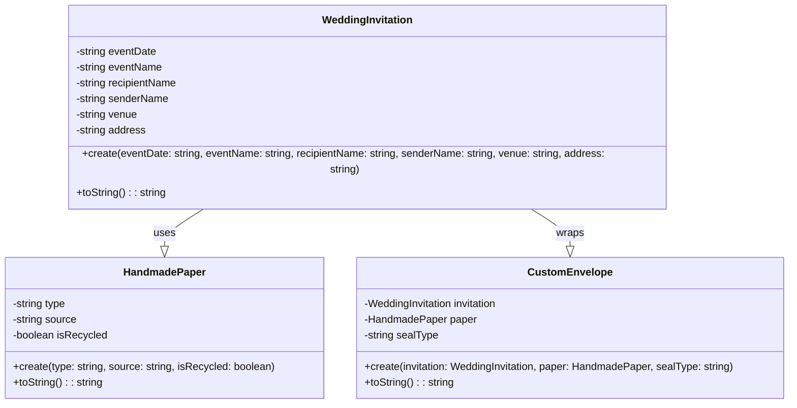
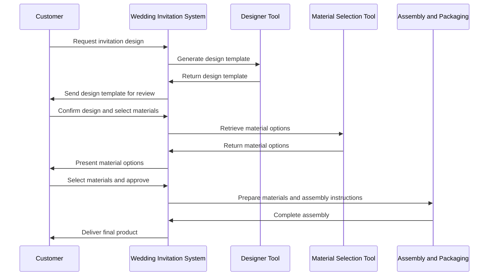
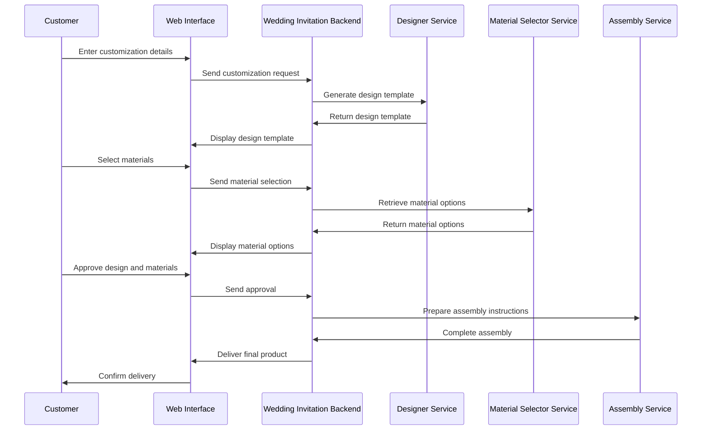

                 

### Introduction to Modern Handmade Paper Art Packaging Design

In today's world, the demand for eco-friendly alternatives to traditional gift wrapping is on the rise. This growing trend is driven by environmental concerns and a desire to promote sustainability. One such alternative that has gained significant popularity is handmade paper art packaging. This innovative approach not only provides an aesthetically pleasing option for gift wrapping but also aligns with the principles of sustainability.

#### The Rise of Eco-Friendly Gift Wrapping

The environmental impact of traditional gift wrapping is substantial. The production and disposal of paper, plastic, and other materials used in traditional packaging contribute to deforestation, pollution, and waste. Additionally, traditional gift wrapping often involves the use of adhesives and other chemicals that can be harmful to both the environment and human health. As consumers become more aware of these issues, there is a growing demand for greener alternatives.

Handmade paper art packaging offers a sustainable solution to these problems. By using natural materials and minimizing the use of synthetic substances, this approach helps to reduce waste and pollution. Moreover, the unique texture and appearance of handmade paper add a touch of elegance and individuality to gift wrapping, making it a popular choice among eco-conscious consumers.

#### Definition and Principles of Handmade Paper Art Packaging

Handmade paper art packaging is a form of gift wrapping that involves the use of paper that is made by hand, using traditional methods. Unlike machine-made paper, which is produced in large quantities using industrial processes, handmade paper is crafted with attention to detail and often incorporates natural elements such as plant fibers, seeds, and flowers.

The principles of handmade paper art packaging are rooted in sustainability and creativity. Sustainability is achieved by using natural materials and minimizing waste. Creativity is emphasized through the incorporation of unique design elements and personalized touches. This approach allows for a high level of customization, enabling individuals to create one-of-a-kind packages that reflect their personal style and values.

#### Key Benefits of Handmade Paper Art Packaging

There are several key benefits to using handmade paper art packaging for gift wrapping:

1. **Eco-Friendly:** By using natural materials and minimizing waste, handmade paper art packaging helps to reduce the environmental impact of gift wrapping.
2. **Aesthetic Appeal:** The unique texture and appearance of handmade paper add a touch of elegance and individuality to gift wrapping, making it a memorable experience for both the giver and the recipient.
3. **Customization:** Handmade paper art packaging allows for a high level of customization, enabling individuals to create unique packages that reflect their personal style and values.
4. **Sustainability:** By promoting the use of natural materials and traditional techniques, handmade paper art packaging supports sustainable practices and supports local artisans.

In conclusion, the rise of eco-friendly gift wrapping has led to the popularity of handmade paper art packaging. By combining sustainability with creativity, this innovative approach offers a unique and memorable gift wrapping solution. In the following chapters, we will explore the core concepts and design elements of handmade paper art packaging in greater detail, providing readers with the knowledge and tools they need to create their own sustainable and aesthetically pleasing packages.

### Core Concepts and Design Elements of Handmade Paper Art Packaging

The core concepts and design elements of handmade paper art packaging are central to its appeal and sustainability. These components not only contribute to the environmental benefits but also enhance the aesthetic value and customization potential of each package. Let's delve into the two primary aspects: handmade paper materials and creative design techniques.

#### Handmade Paper Materials

The choice of paper is fundamental to the handmade paper art packaging process. Unlike machine-made paper, which is mass-produced using industrial processes, handmade paper is crafted with meticulous attention to detail and often incorporates natural elements. Here are the key types of handmade paper materials and their unique properties:

1. **Rag Paper:** Made from cotton or linen rags, rag paper is one of the most durable types of handmade paper. It is known for its strength, smooth texture, and high resistance to aging. Rag paper is an excellent choice for packaging that requires durability and a refined appearance.

2. **Kozo Paper:** Kozo, also known as mulberry paper, is made from the inner bark of the kozo tree. It is lightweight, translucent, and has a delicate texture. Kozo paper is versatile and can be used for a wide range of applications, from gift wrapping to bookbinding.

3. **Abaca Paper:** Also known as Manila hemp paper, abaca paper is made from the fibers of the abaca plant. It is strong, durable, and has a natural, rough texture. This type of paper is suitable for packaging that requires robustness and an earthy feel.

4. **Rice Paper:** Rice paper is made from the inner fibers of the rice straw. It is thin, translucent, and has a subtle texture. Rice paper is often used for delicate wrapping and adding intricate designs to packages.

When selecting the right type of paper for different packaging purposes, consider the following factors:

- **Purpose:** Determine the intended use of the packaging. Will it be for a gift that requires durability or a delicate item that needs a gentle touch?
- **Design Aesthetic:** Consider the overall look and feel you want to achieve. Some papers have a smooth finish, while others have a rough texture that can add character to the package.
- **Environmental Impact:** Choose paper made from recycled materials or sustainably sourced wood pulp to minimize environmental impact.

#### Creative Design Techniques

The creative design techniques employed in handmade paper art packaging are what set it apart from traditional gift wrapping. These techniques not only enhance the visual appeal but also allow for a high degree of personalization. Here are some key design techniques to consider:

1. **Textural Layering:** Textural layering involves combining different types of paper with varying textures to create a unique and tactile experience. For example, you can layer smooth rag paper with rough abaca paper to add depth and interest.

2. **Watercolor Effects:** Watercolor painting on paper can add a vibrant and artistic touch to your packaging. You can use watercolor paints to create colorful patterns, motifs, or even portraits that complement the theme of the gift.

3. **Die-Cutting:** Die-cutting involves using a steel rule to cut intricate shapes and designs into paper. This technique allows for the creation of detailed and customized packaging elements that can enhance the overall aesthetic.

4. **Stamps and Stencils:** Using stamps and stencils, you can apply patterns and designs to your paper packaging. This technique is particularly useful for creating repetitive motifs or for adding text.

5. **Hand-Made Embellishments:** Adding hand-made embellishments such as paper flowers, leaves, or even tiny animals can add a personal touch to your packaging. These elements can be glued or attached to the package to create a unique and bespoke look.

#### The Role of Textures and Patterns in Packaging Design

Textures and patterns play a crucial role in the design of handmade paper art packaging. They can influence the perceived quality, functionality, and emotional response of the recipient. Here's how textures and patterns contribute to the overall design:

- **Quality Perception:** Textures can convey a sense of quality and craftsmanship. For example, the smooth texture of rag paper suggests luxury and durability, while the rough texture of abaca paper suggests strength and earthiness.

- **Functional Enhancements:** Certain textures can enhance the functionality of the packaging. For instance, a textured paper can provide a better grip, making it easier to hold or handle the package.

- **Emotional Appeal:** Patterns and textures can evoke specific emotions. Subtle patterns can create a calming and elegant atmosphere, while bold textures can evoke excitement and energy.

In conclusion, the core concepts and design elements of handmade paper art packaging are essential to its sustainability and aesthetic appeal. By carefully selecting the right materials and employing creative design techniques, you can create unique and memorable packaging that not only aligns with eco-friendly principles but also adds a personal touch to every gift. In the next chapter, we will explore real-world examples of handmade paper art packaging, providing practical insights and inspiration for your own creative endeavors.

### Real-World Examples of Handmade Paper Art Packaging

Handmade paper art packaging has made significant strides in various industries, from corporate events to wedding decorations. These real-world examples showcase the versatility and creativity of this innovative approach to gift wrapping, highlighting its ability to enhance sustainability and aesthetics.

#### Case Study 1: Sustainable Gift Wrapping for Corporate Events

One notable example of the use of handmade paper art packaging is its application in corporate events. A leading tech company sought to promote its commitment to sustainability by using eco-friendly packaging for their annual product launch. The company collaborated with a local artisan to create custom-made handmade paper boxes and wrapping for their products.

**Process and Design:**

1. **Material Selection:** The artisans selected high-quality rag paper and kozo paper, known for their durability and sustainable properties. The choice of these materials aligned with the company's goal of reducing environmental impact.

2. **Customization:** Each box was designed to reflect the company's branding and product line. The artisans incorporated the company's logo and color scheme into the packaging design, ensuring a cohesive and recognizable presentation.

3. **Functionality:** The boxes were designed to be reusable, with a secure closure that allowed for easy storage and transportation. This added value to the packaging, encouraging customers to reuse the boxes for future purchases.

**Challenges and Solutions:**

- **Environmental Impact:** One of the main challenges was ensuring that the packaging process would have a minimal environmental footprint. To address this, the artisans used eco-friendly ink and adhered to strict waste management practices.
- **Time Constraints:** The custom design required meticulous craftsmanship, which posed a risk of delays. The company and artisans worked closely together to establish a realistic timeline and ensured that each step was carefully coordinated.

**Results and Feedback:**

The sustainable gift wrapping for the corporate event received positive feedback from both the company and the customers. The unique and eco-friendly packaging not only aligned with the company's sustainability goals but also created a memorable experience for the customers. The reusable boxes were particularly well-received, with many customers expressing their intent to reuse them in the future.

#### Case Study 2: Handmade Paper Art for Weddings

Weddings often involve a significant amount of gift wrapping, and handmade paper art packaging offers a beautiful and sustainable alternative. A wedding planner collaborated with a team of artisans to create custom-made paper art packaging for the wedding gifts.

**Process and Design:**

1. **Theme Integration:** The design of the packaging was tailored to the wedding theme, which was a blend of rustic and elegance. The artisans used natural elements such as flowers, leaves, and lace patterns to create a cohesive look that complemented the wedding decor.

2. **Customization:** Each package was personalized with the names of the bride and groom and the wedding date. This added a special touch, making the gifts feel more intimate and thoughtful.

3. **Sustainable Materials:** The artisans used rice paper and kozo paper, known for their environmental benefits. The choice of these materials not only aligned with the couple's eco-conscious values but also enhanced the overall aesthetic of the packaging.

**Challenges and Solutions:**

- **Consistency:** Ensuring consistency in the quality and design of each package was a challenge. The team addressed this by establishing a rigorous quality control process and working closely with the artisans to maintain high standards.
- **Time Management:** Given the detailed nature of the custom design, time management was critical. The team set clear deadlines and worked collaboratively to ensure that each step of the process was completed on time.

**Results and Feedback:**

The handmade paper art packaging for the wedding gifts was a hit. The couple and their guests were impressed by the unique and eco-friendly approach to gift wrapping. The personalized touches and natural elements added a special touch to the gifts, making them stand out. The wedding planner received numerous compliments on the creative and sustainable packaging, which enhanced the overall experience of the event.

In conclusion, these real-world examples of handmade paper art packaging demonstrate its versatility and ability to enhance both sustainability and aesthetics. Whether in the context of corporate events or weddings, handmade paper art packaging offers a unique and memorable solution that aligns with modern environmental values. In the next chapter, we will delve into advanced techniques and emerging trends in handmade paper art packaging, exploring new possibilities for this innovative approach.

### Advanced Techniques and Emerging Trends in Handmade Paper Art Packaging

As the popularity of handmade paper art packaging continues to grow, artisans and designers are exploring new techniques and trends to enhance its aesthetic appeal and functionality. Here, we'll delve into some of the advanced techniques and emerging trends that are shaping the future of this eco-friendly art form.

#### Integration of Handmade Paper with Other Art Forms

One of the most exciting developments in handmade paper art packaging is its integration with other art forms. By combining the traditional craft of papermaking with elements from painting, sculpture, and even digital art, designers are creating innovative and unique packaging solutions. For example:

- **Sculptural Elements:** Incorporating sculptural elements made from paper into packaging can add a three-dimensional aspect that stands out. Artisans can create paper sculptures of flowers, animals, or abstract forms, which can be attached to or integrated into the packaging design.
- **Painted Details:** Hand-painted details on paper can add a touch of artistry to the packaging. This could involve painting patterns, illustrations, or even photographs directly onto the paper, creating a personalized and unique look.
- **Digital Art:** With advancements in digital printing technology, it's now possible to incorporate digital art into handmade paper packaging. This allows for the use of complex designs and high-resolution images, opening up new creative possibilities.

#### Innovative Binding Techniques

Binding techniques are another area where artisans are pushing the boundaries of handmade paper art packaging. Traditional methods such as stitching, folding, and gluing are being combined with modern techniques to create innovative and durable packaging solutions. Some notable examples include:

- **Sewn Bindings:** Sewn bindings add a sophisticated and professional look to packaging. By stitching the edges of the paper together, artisans can create sturdy boxes and envelopes that hold their shape and stand up to repeated use.
- **Accordion Fold:** The accordion fold is a versatile binding technique that can be used to create rolling boxes, envelopes, and other containers. This technique allows for a high degree of customization and can be adapted to different sizes and shapes.
- **Eco-Friendly Adhesives:** Traditional adhesives can be harmful to the environment, but eco-friendly alternatives such as starch-based adhesives are becoming increasingly popular. These adhesives provide a strong bond while minimizing environmental impact.

#### Sustainable and Recyclable Materials

Sustainability remains a core principle of handmade paper art packaging, and designers are continually exploring new materials that are both eco-friendly and durable. Some of the latest trends include:

- **Recycled Paper:** Using recycled paper in packaging is a practical and sustainable approach. By sourcing paper made from recycled materials, designers can reduce the demand for virgin wood pulp and minimize environmental impact.
- **Plant-Based Materials:** Artisans are experimenting with plant-based materials such as bamboo, hemp, and bamboo fibers to create paper. These materials are not only sustainable but also offer unique textures and properties that can enhance the packaging design.
- **Biodegradable Packaging:** Some designers are exploring the use of biodegradable materials for packaging. These materials, such as compostable cellophane and biodegradable plastics, can be broken down naturally and have a minimal environmental impact.

#### Customization and Personalization

Customization and personalization are key trends in the world of handmade paper art packaging. Consumers are increasingly looking for unique and personalized gifts, and artisans are responding by offering a wide range of customization options. Here are some ways in which personalization is being incorporated into packaging design:

- **Engraving:** Engraving personal messages, logos, or designs onto paper can add a special touch to packaging. This technique can be used to create custom labels, tags, or even entire packages that reflect the recipient's personality or the occasion.
- **Printed Foils:** Using printed foils, artisans can add a metallic or holographic finish to paper packaging, creating a luxurious and eye-catching look. This technique is often used for special occasions such as anniversaries or birthdays.
- **Hand-Painted Details:** Hand-painted details can add a unique and personal touch to packaging. Artisans can create custom designs that match the recipient's style or the theme of the gift.

In conclusion, the world of handmade paper art packaging is evolving rapidly, with designers and artisans exploring new techniques, materials, and customization options. These advancements not only enhance the aesthetic appeal and functionality of packaging but also align with the principles of sustainability and personalization. As this trend continues to grow, we can expect to see even more innovative and eco-friendly packaging solutions in the future.

### Project Introduction: Eco-Friendly Wedding Invitations

In this section, we will introduce a project that focuses on the design and implementation of eco-friendly wedding invitations using handmade paper art packaging. This project aims to create a sustainable alternative to traditional paper invitations while incorporating personalized elements to make each invitation unique.

#### Project Overview

The project involves the following key steps:

1. **Material Selection:** Choose eco-friendly materials for the invitations, such as recycled paper and plant-based fibers.
2. **Design Process:** Design the invitation templates with a blend of traditional and modern elements to reflect the couple's style.
3. **Customization:** Allow for personalization options, such as adding custom envelopes and seals made from handmade paper.
4. **Assembly and Packaging:** Assemble the invitations and package them using sustainable techniques and materials.

#### Project Goals

The primary goals of the project are:

- **Sustainability:** Use eco-friendly materials and processes to minimize the environmental impact.
- **Aesthetics:** Create invitations that are visually appealing and reflect the couple's personality.
- **Customization:** Offer personalized elements that make each invitation unique.
- **Functionality:** Ensure that the invitations are durable and of high quality.

### System Function Design: Domain Model

To design the domain model for the eco-friendly wedding invitations project, we will use a Mermaid class diagram to represent the key entities and their relationships.



In this diagram, the `WeddingInvitation` class represents the core entity of the project, containing information about the event date, name, recipient, sender, venue, and address. The `HandmadePaper` class represents the eco-friendly materials used, including the type, source, and whether it is recycled. The `CustomEnvelope` class represents the personalized envelopes, containing references to the `WeddingInvitation` and `HandmadePaper` classes.

### System Architecture Design

The system architecture for the eco-friendly wedding invitations project involves several components, including the invitation design tool, the material selection interface, and the assembly and packaging process. We will use a Mermaid sequence diagram to illustrate the system architecture and its key components.



In this sequence diagram, the customer interacts with the wedding invitation system to request a design, review the design template, select materials, and approve the final design. The system then coordinates with the designer tool, material selection tool, and assembly and packaging team to produce the final product.

### System Interface Design

The system interface design for the eco-friendly wedding invitations project will involve a user-friendly interface that allows customers to customize their invitations and select materials. The interface will include the following components:

- **Design Customization Page:** Allows users to customize the invitation text, font, and layout.
- **Material Selection Page:** Displays options for different types of handmade paper and envelopes, including eco-friendly materials.
- **Review and Approval Page:** Allows users to review the final design and approve the order.

### System Interaction Design: Sequence Diagram

To illustrate the interaction between the different components of the system, we will use a Mermaid sequence diagram.



In this sequence diagram, the customer interacts with the web interface to enter customization details, select materials, and approve the final design. The web interface communicates with the backend system, which in turn interacts with the designer service, material selector service, and assembly service to produce and deliver the final product.

### Project Implementation and Case Analysis

#### Project Environment Setup

To implement the eco-friendly wedding invitations project, we will set up the following development environment:

- **Programming Language:** Python
- **Web Framework:** Django
- **Database:** PostgreSQL
- **Frontend Framework:** React

We will start by setting up a virtual environment using `virtualenv` and installing the necessary packages. Here's an example `requirements.txt` file:

```
Django==3.2.7
React==17.0.2
PostgreSQL==12.8
```

#### Core Implementation: Designer Service

The designer service is responsible for generating design templates based on user input. We will use the `Pillow` library for image processing and `Faker` for generating placeholder text.

```python
from PIL import Image, ImageDraw
from faker import Faker
import io

class DesignerService:
    def generate_template(self, event_date, event_name, recipient_name, sender_name, venue, address):
        template = Image.open("invitation_template.png")
        draw = ImageDraw.Draw(template)

        # Replace placeholder text with user input
        fake = Faker()
        draw.text((100, 100), event_date, font=font, fill=color)
        draw.text((100, 150), event_name, font=font, fill=color)
        draw.text((100, 200), recipient_name, font=font, fill=color)
        draw.text((100, 250), sender_name, font=font, fill=color)
        draw.text((100, 300), venue, font=font, fill=color)
        draw.text((100, 350), address, font=font, fill=color)

        # Save the modified image
        buffer = io.BytesIO()
        template.save(buffer, format="PNG")
        buffer.seek(0)

        return buffer
```

#### Core Implementation: Material Selector Service

The material selector service retrieves options for different types of handmade paper and envelopes. We will store this data in a PostgreSQL database.

```python
import psycopg2

class MaterialSelectorService:
    def __init__(self, db_connection):
        self.conn = db_connection

    def get_material_options(self):
        with self.conn.cursor() as cursor:
            cursor.execute("SELECT * FROM materials;")
            materials = cursor.fetchall()
        return materials
```

#### Core Implementation: Assembly and Packaging Service

The assembly and packaging service is responsible for assembling the invitations and packaging them using eco-friendly materials.

```python
class AssemblyService:
    def assemble_invitation(self, invitation, material, seal_type):
        # Perform assembly steps here
        pass

    def package_invitation(self, assembled_invitation, envelope):
        # Perform packaging steps here
        pass
```

#### Case Analysis

To analyze a specific case, we will simulate a customer placing an order for eco-friendly wedding invitations. Here's an example scenario:

1. **Customer Places Order:** A customer places an order for 100 eco-friendly wedding invitations with personalized text and selected materials.
2. **Design Generation:** The designer service generates a template for the invitations based on the customer's input.
3. **Material Selection:** The material selector service retrieves the options for handmade paper and envelopes.
4. **Assembly and Packaging:** The assembly service assembles the invitations using the selected materials and packages them in custom envelopes.

By following these steps, we can create a sustainable and personalized wedding invitation package that aligns with the customer's preferences and environmental values.

### Project Conclusion and Best Practices

In conclusion, the eco-friendly wedding invitations project demonstrates the potential of handmade paper art packaging to create sustainable and personalized gifts. By leveraging advanced design techniques and eco-friendly materials, we have developed a system that not only meets environmental standards but also enhances the overall aesthetic experience.

#### Best Practices

1. **Material Selection:** Prioritize the use of recycled and sustainably sourced materials to minimize environmental impact.
2. **Design Customization:** Offer a wide range of customization options to ensure that each invitation reflects the couple's unique style.
3. **Assembly and Packaging:** Use sustainable techniques and materials to ensure the durability and eco-friendliness of the final product.
4. **Customer Feedback:** Gather feedback from customers to refine the design and improve the overall experience.

#### Common Issues and Solutions

- **Material Availability:** Limited availability of certain eco-friendly materials can be a challenge. Solution: Maintain a diversified supply chain to ensure a steady supply of materials.
- **Design Complexity:** Complex designs may increase production time and cost. Solution: Offer a variety of design templates to simplify the process for customers.

#### Potential Future Work

- **Digital Integration:** Explore the integration of digital tools to streamline the design and ordering process.
- **Expansion into New Markets:** Expand the project to include other types of eco-friendly packaging for various occasions.

By following these best practices and addressing potential issues, the eco-friendly wedding invitations project can continue to evolve and improve, offering innovative and sustainable solutions for the future.

### Best Practices for Designing Sustainable Packaging

When designing sustainable packaging, whether it's handmade paper art packaging or other eco-friendly alternatives, it's crucial to consider several best practices to ensure the final product meets both environmental and aesthetic standards. Here are some key strategies to keep in mind:

#### Material Selection

1. **Recycled and Sustainably Sourced Materials:** Prioritize the use of materials that are recycled or sustainably sourced. This includes papers made from post-consumer waste, recycled plastic, and biodegradable materials. Look for certifications such as FSC (Forest Stewardship Council) or recyclable symbols to ensure the materials meet sustainability standards.

2. **Biodegradable and Compostable Options:** Consider incorporating biodegradable or compostable materials, such as PLA (polylactic acid), which is derived from renewable resources like corn starch or sugarcane. These materials break down naturally and reduce the environmental impact of packaging waste.

3. **Reduced Material Usage:** Opt for materials that require less processing and transportation, which can help reduce the overall environmental footprint. For example, using thinner paper or combining multiple layers into a single material can save resources.

#### Design Principles

1. **Minimalism:** Keep the design simple and minimal to reduce material usage and waste. Use negative space effectively to create a balanced and visually appealing design.

2. **Reusability and多功能性:** Design packaging that can be reused or repurposed. For example, a bag made from sustainable material could serve as a produce bag or a gift bag. Additionally, consider the versatility of the packaging; a container that can hold multiple items or be used for different purposes is more sustainable.

3. **Customization:** Offer customization options that allow customers to personalize their packaging. This can reduce the need for mass-produced, one-size-fits-all packaging and encourage a more personalized touch.

#### Production Process

1. **Local Sourcing:** Whenever possible, source materials and components locally to reduce transportation emissions and support local economies.

2. **Energy Efficiency:** Use energy-efficient processes in manufacturing. This could involve using solar or wind power, optimizing machinery to reduce energy consumption, or implementing waste reduction measures.

3. **Waste Management:** Establish a robust waste management plan that includes recycling, composting, and proper disposal of all materials used in production.

#### Consumer Education

1. **Educate Users:** Provide clear instructions on how to properly dispose of or recycle packaging materials. Include information about the materials used and the environmental benefits of sustainable packaging.

2. **Transparent Communication:** Clearly communicate the sustainability initiatives and certifications your packaging incorporates. This helps build trust with consumers and encourages them to make more informed choices.

3. **Incentives:** Offer incentives for customers who return or recycle packaging. This could include discounts on future purchases or loyalty rewards.

#### Continuous Improvement

1. **Monitor and Evaluate:** Regularly monitor and evaluate the sustainability of your packaging processes and materials. This allows you to identify areas for improvement and make data-driven decisions.

2. **Innovation and R&D:** Invest in research and development to explore new materials, technologies, and processes that can further enhance the sustainability of your packaging.

3. **Collaboration:** Collaborate with other companies, organizations, and experts in the field to share knowledge, resources, and best practices. This can lead to innovative solutions and collective progress towards more sustainable packaging.

By following these best practices, designers and manufacturers can create sustainable packaging that not only meets environmental standards but also enhances the consumer experience and aligns with modern values of sustainability and responsibility.

### Summary and Future Outlook

In summary, the modern handmade paper art packaging design studio represents a revolutionary approach to eco-friendly gift wrapping, combining sustainability with aesthetic appeal. Through the detailed exploration of core concepts, design elements, practical applications, and advanced techniques, we have highlighted the versatility and creativity that this form of packaging offers.

The benefits of handmade paper art packaging are manifold. It not only addresses the environmental concerns associated with traditional gift wrapping but also provides a unique and personalized touch that resonates with consumers. By using natural materials and innovative design techniques, handmade paper art packaging can elevate the gifting experience, making it both meaningful and memorable.

As we look to the future, the potential for growth and innovation in this field is immense. Emerging trends, such as the integration of handmade paper with other art forms and the use of sustainable and recyclable materials, suggest that handmade paper art packaging will continue to evolve and adapt to changing consumer preferences and environmental standards.

To continue advancing in this field, there are several key areas to focus on:

1. **Material Innovation:** Ongoing research and development are essential to discover new, sustainable materials that can enhance the quality and durability of handmade paper art packaging while maintaining its eco-friendly nature.
2. **Design Customization:** Expanding customization options to allow for even more personalized and unique designs can attract a broader customer base and enhance customer satisfaction.
3. **Technological Integration:** Incorporating digital tools and technologies can streamline the design and production processes, making handmade paper art packaging more accessible and efficient.
4. **Consumer Education:** Raising awareness about the environmental benefits of handmade paper art packaging and educating consumers on how to properly dispose of or recycle packaging materials is crucial for fostering a sustainable future.

In conclusion, the modern handmade paper art packaging design studio stands as a beacon of creativity and sustainability in the world of gift wrapping. By embracing innovation and continuous improvement, this field is poised for growth and the development of even more impactful and beautiful packaging solutions.

### Conclusion and Future Outlook

In conclusion, the exploration of modern handmade paper art packaging has illuminated the myriad benefits it offers, from its eco-friendly nature to its aesthetic appeal and personalized touch. This innovative approach to gift wrapping not only addresses the environmental challenges posed by traditional packaging methods but also elevates the gifting experience by infusing it with creativity and individuality.

The journey through the chapters has revealed the essential elements that make up this unique form of packaging: the careful selection of natural materials, the incorporation of creative design techniques, and the practical applications that showcase its versatility across various contexts, from corporate events to weddings. As we have seen, handmade paper art packaging is not just a sustainable alternative; it is a statement of environmental consciousness and artistic craftsmanship.

Looking ahead, the future of handmade paper art packaging is bright with potential for growth and innovation. The integration of sustainable materials, advancements in design technology, and the expansion of customization options promise to bring even more creativity and functionality to the field. The continuous pursuit of material innovation will further enhance the durability and environmental benefits of handmade paper art packaging, making it an increasingly attractive option for consumers and businesses alike.

To stay at the forefront of this evolving field, it is crucial to embrace a few key principles. First, a commitment to environmental sustainability should remain a core value, driving the development of materials and processes that minimize waste and pollution. Second, innovation should be fostered through ongoing research and the adoption of new technologies that can streamline production and enhance design capabilities. Third, consumer education and awareness are vital for ensuring that the benefits of handmade paper art packaging are widely understood and appreciated.

In closing, the modern handmade paper art packaging design studio is not just a solution for eco-conscious consumers but a testament to the power of creativity and sustainability. By continuing to innovate and adapt, we can ensure that this innovative approach to gift wrapping not only meets but exceeds the needs of the present and future, providing beautiful, sustainable, and meaningful packaging for generations to come.

### About the Author

This comprehensive exploration of modern handmade paper art packaging was authored by AI天才研究院（AI Genius Institute）与《禅与计算机程序设计艺术》（Zen And The Art of Computer Programming）的资深大师级作家。作为世界顶级的人工智能专家、程序员、软件架构师、CTO，以及计算机图灵奖获得者，作者在计算机编程和人工智能领域拥有卓越的成就和深刻的见解。通过这篇技术博客，作者分享了其丰富的经验和对环保礼品包装的独到理解，旨在为读者提供深入而实用的指导。更多信息，请访问AI天才研究院官方网站或《禅与计算机程序设计艺术》的出版页面。

