                 

### 引言

**关键词：** 传统纺织、可持续时尚、手工织物、环境保护、时尚设计。

**摘要：** 本文旨在探讨传统纺织在可持续时尚中的应用，通过分析传统纺织的历史与现状，以及可持续时尚的概念与发展趋势，揭示手工织物在时尚设计中的独特价值。文章将详细描述手工织物的制作工艺与技巧，讨论手工织物工作室的运营与管理，并通过案例研究提供实践指导，旨在推动可持续时尚的发展。

---

## 1.1 问题背景与挑战

### 1.1.1 现代纺织业面临的挑战

现代纺织业作为全球工业的重要组成部分，其发展对经济、就业和国际贸易具有重要意义。然而，随着工业化进程的加快，现代纺织业也面临着诸多挑战。首先，环境污染问题日益严重。纺织生产过程中使用的化学助剂、染料和废水排放，对水资源和生态环境造成了严重破坏。其次，资源浪费问题突出。纺织业的原料主要是棉花、羊毛等天然纤维，这些资源的开采和使用不仅对环境产生负面影响，还面临着资源枯竭的风险。此外，劳动条件问题也备受关注。在许多发展中国家，纺织业工人往往面临长时间工作、低工资和不安全的劳动环境。

### 1.1.2 传统纺织在可持续时尚中的应用潜力

传统纺织作为一种历史悠久的工艺，其在可持续时尚中的应用潜力日益受到关注。首先，传统纺织工艺通常使用天然纤维，如棉、麻、丝、毛等，这些材料具有较高的生物降解性，有助于减少环境污染。此外，传统纺织工艺注重手工艺和本地资源利用，减少了对非可再生资源的依赖。传统纺织还强调文化传承和社区参与，有助于促进社会和谐和经济发展。因此，将传统纺织与现代时尚相结合，不仅能够提高时尚设计的独特性和艺术价值，还能为可持续时尚的发展提供新的思路和途径。

### 1.1.3 边界与外延：传统纺织与可持续时尚的交叉领域

传统纺织与可持续时尚的交叉领域涵盖了多个方面。首先，在材料选择上，传统纺织工艺往往使用天然纤维，这与可持续时尚提倡的环保材料使用理念相契合。其次，在制作工艺上，传统纺织工艺注重手工艺和细节处理，这与可持续时尚追求的个性化设计和高质量产品相符。此外，传统纺织在文化传承、社区参与和就业促进方面具有独特优势，也为可持续时尚注入了新的活力。因此，传统纺织与可持续时尚的交叉领域不仅有助于推动时尚产业的可持续发展，还能促进文化多样性和经济繁荣。

## 1.2 书籍目的与结构

本文的目的是探讨传统纺织在可持续时尚中的应用，通过分析传统纺织的历史与现状，以及可持续时尚的概念与发展趋势，揭示手工织物在时尚设计中的独特价值。文章将详细描述手工织物的制作工艺与技巧，讨论手工织物工作室的运营与管理，并通过案例研究提供实践指导，旨在为时尚设计师和纺织从业者提供有价值的参考。

全书共分为七个章节，具体如下：

### 第1章：引言

本章介绍了本文的主题、目的和结构，并阐述了传统纺织在可持续时尚中的应用潜力。

### 第2章：传统纺织的历史与现状

本章回顾了传统纺织的历史发展，分析了现代纺织业的挑战，并探讨了传统纺织在可持续时尚中的应用优势。

### 第3章：可持续时尚的概念与趋势

本章介绍了可持续时尚的核心概念，分析了可持续时尚的发展趋势，并探讨了可持续时尚对时尚产业的影响。

### 第4章：手工织物在可持续时尚中的应用

本章详细探讨了手工织物在时尚设计中的应用，包括手工织物在服装和家居饰品设计中的具体实例。

### 第5章：手工织物的制作工艺与技巧

本章介绍了手工织物的制作流程和特殊技巧，包括选材、织造、后整理等环节，并提供了相关的技术指导。

### 第6章：手工织物工作室的运营与管理

本章讨论了如何有效运营和管理手工织物工作室，包括选址、生产管理、市场营销等方面的策略。

### 第7章：案例研究与实践

本章通过分析成功的现代手工织物工作室案例，提供了实践指导和建议，以帮助读者更好地理解和应用手工织物在可持续时尚中的应用。

通过以上章节的详细探讨，本文旨在为读者提供一个全面、系统的了解传统纺织在可持续时尚中的应用，为时尚产业的可持续发展提供新的思路和方向。让我们接下来一步步深入探讨这些内容。

## 1.1.1 传统纺织的起源与发展

传统纺织作为一种古老的手工艺，其起源可以追溯到几千年前。早在新石器时代，人类就开始利用植物的纤维和动物的毛皮进行简单的编织和缝纫。随着时间的推移，传统纺织技术逐渐发展，形成了丰富多样的纺织文化。在中国，早在公元前2100年左右的夏朝时期，就已经出现了纺织活动。商朝时期，纺织业得到了进一步的发展，出现了丝织和麻织技术。汉朝时期，中国丝绸成为世界贸易的重要商品，中国的纺织技术也通过丝绸之路传播到世界各地。

在欧洲，古希腊和古罗马时期就有了纺织活动。中世纪的欧洲，纺织业成为重要的经济支柱，形成了各种纺织传统。例如，意大利的威尼斯以丝绸纺织著称，法国的里昂以丝织品闻名。这些地区的纺织技术不断创新，推动了欧洲纺织业的发展。

在印度，棉纺织技术有着悠久的历史。古印度的棉纺织业不仅为当地提供了大量就业机会，还通过海上贸易传播到其他地区。印度的棉纺织业在18世纪后期对英国的工业革命产生了重要影响。

日本的传统纺织业也非常发达，以棉、麻、丝为主要原料，形成了独特的和服和浴衣等传统服饰。

传统纺织技术的传播不仅依赖于贸易，还伴随着文化交流和宗教传播。例如，丝绸之路不仅是一条贸易路线，也是文化交流的重要通道。随着佛教的传播，印度的棉纺织技术通过中亚传入中国，中国的丝织技术也通过这一路线传播到东南亚。

总体来看，传统纺织的发展受到了历史、文化、经济和技术等多方面因素的影响。不同地区的传统纺织技术各有特色，但共同推动了人类文明的发展。

### 1.1.2 传统纺织在不同文化中的表现形式

传统纺织作为人类文化的重要组成部分，在不同文化中有着独特而多样的表现形式。以下是一些代表性文化中的传统纺织及其特点：

#### 中国

中国的传统纺织业历史悠久，种类繁多。以丝绸为例，中国丝绸以其高质量和独特的设计而闻名于世。中国丝绸文化不仅体现在制作技艺上，还体现在丝织品的设计和装饰上。中国丝绸制品常采用云纹、龙凤、花卉等传统图案，这些图案不仅美观，还富含文化内涵。

麻织品也是中国传统纺织的重要组成部分。中国的麻织技术早在商朝时期就已经相当成熟，麻布因其耐用和透气性而在古代被广泛使用。至今，一些地方仍然保留着传统的麻织工艺，如四川的蜀锦和江苏的南京云锦。

#### 欧洲

欧洲的传统纺织业同样丰富多彩。意大利威尼斯的丝绸纺织业在历史上极为发达，威尼斯丝绸以其高品质和精美的图案而著称。法国里昂的丝织业也是世界知名，里昂丝织品以其华丽和复杂的图案设计而备受赞誉。

英国的传统纺织业以羊毛纺织为主要特色。羊毛纺织品如呢绒、毛线等在英国历史悠久，且工艺精湛。英国的羊毛纺织业不仅为当地经济做出了巨大贡献，还影响了全球的羊毛纺织品生产。

德国的亚麻纺织业也非常发达。德国的亚麻纺织品以其耐用性和良好的透气性而受到消费者的青睐。

#### 印度

印度是棉纺织的发源地之一，印度棉纺织业以生产高质量的棉布和棉纺织品而闻名。印度的棉纺织品常采用丰富的印花图案，这些图案反映了印度的宗教信仰和文化传统。

印度还有一种独特的纺织技术——提花技术，这种技术使得印度纺织品具有丰富的图案和纹理。印度的喀拉拉邦和马哈拉施特拉邦是提花技术的传统产地。

#### 日本

日本的传统纺织业以棉、麻、丝为主要原料，形成了独特的和服文化。和服不仅是一种服装，也是日本文化的重要载体。和服的设计和制作过程非常讲究，常常融入了日本的自然景观、花卉和动物图案。

日本的草编技术也非常发达，草编制品如草鞋、草席等在日本日常生活中有着广泛的应用。

#### 非洲

非洲的传统纺织业同样丰富多样。例如，西非的加纳和尼日利亚的玻利尼西亚布以其手工编织和独特的图案而著名。这些纺织品不仅在当地文化中具有重要地位，还通过贸易传播到世界各地。

非洲的棉纺织业也有悠久的历史，尼日利亚的阿贝奥库塔是非洲著名的棉纺织中心，这里的棉纺织品以其优质和耐用而受到国际市场的青睐。

总之，传统纺织在不同文化中有着独特的表现形式，这些纺织品不仅体现了各个文化的审美观念和技艺水平，还承载了丰富的文化传统和价值观。通过这些多样化的传统纺织，我们可以更深入地了解不同文化的独特魅力。

### 1.2.1 可持续时尚的核心概念

可持续时尚是一种以环保和社会责任为核心原则的时尚理念，旨在通过减少资源消耗、降低环境污染和促进社会公平，实现时尚产业的可持续发展。以下是可持续时尚的核心概念：

**1.1 可持续性的定义**

可持续性是指在满足当前需求的同时，不损害未来世代满足自身需求的能力。在时尚产业中，可持续性意味着在设计和生产过程中，要充分考虑资源使用、环境保护和劳动条件的可持续性。

**1.2 目标与原则**

可持续时尚的目标包括减少环境污染、节约资源、提升生产效率、促进社会公平和实现经济繁荣。为实现这些目标，可持续时尚遵循以下原则：

- **生态可持续性**：使用环保材料和工艺，减少对自然资源的消耗，降低碳排放和废弃物产生。
- **社会可持续性**：关注劳动条件的改善，保障工人的权益，促进社区发展和经济繁荣。
- **经济可持续性**：通过创新和高效生产，实现成本控制和经济收益，确保时尚产业的长期发展。

**1.3 可持续时尚的核心理念**

可持续时尚的核心理念包括环保、社会责任和经济效益的平衡。具体来说：

- **环保**：减少化学物质的使用，提倡有机材料和生物降解材料的采用，减少废水、废气和废弃物的排放。
- **社会责任**：尊重工人权益，改善劳动条件，推广公平贸易，促进社会和谐。
- **经济效益**：通过提高生产效率、降低成本和创造新的市场机会，实现经济可持续性。

**1.4 可持续时尚的驱动力**

可持续时尚的驱动力主要包括以下几个方面：

- **消费者需求**：越来越多的消费者开始关注环保和道德消费，这为可持续时尚提供了市场需求。
- **政策法规**：各国政府和国际组织越来越重视环境保护和社会责任，出台了一系列政策法规，推动时尚产业向可持续方向发展。
- **技术创新**：新材料和新工艺的不断涌现，为可持续时尚提供了技术支持。
- **社会运动**：环保组织和公益项目通过宣传和教育，提高了公众对可持续时尚的认知和参与度。

### 1.2.2 可持续时尚的发展趋势

随着全球环境问题和社会责任的日益凸显，可持续时尚已经成为时尚产业的重要发展方向。以下是一些主要的可持续发展趋势：

**1.1 材料创新**

可持续时尚在材料选择上不断推陈出新，以减少对环境的影响。例如，生物基材料（如玉米淀粉、大豆蛋白等）、可再生纤维（如竹纤维、亚麻纤维等）和回收材料（如回收塑料瓶、废旧纺织品等）被广泛应用于时尚产品的制作。

**1.2 设计理念**

可持续时尚的设计理念强调实用性和多功能性，以减少浪费。设计师们开始关注可持续时尚的“设计寿命”，通过模块化设计、可拆卸和可升级的组件，使产品更易于维修和再利用。

**1.3 消费者行为**

消费者对环保和社会责任的关注日益增加，越来越多的消费者愿意为可持续时尚支付溢价。此外，消费者也开始更加注重购买过程中的透明度，期望了解产品的生产过程和环境影响。

**1.4 市场动态**

全球时尚市场对可持续时尚的需求不断增长，各大时尚品牌和零售商纷纷推出可持续时尚产品系列。同时，新兴的可持续时尚品牌也在不断涌现，这些品牌以其独特的环保理念和市场定位，吸引了大量消费者。

**1.5 技术进步**

随着技术的发展，可持续时尚的生产过程变得更加高效和环保。例如，3D打印技术、自动化机器人和智能工厂的应用，不仅提高了生产效率，还减少了能源消耗和废弃物产生。

**1.6 政策支持**

各国政府和国际组织对可持续时尚的支持力度不断加大，通过出台政策法规、提供资金支持和推广环保项目，推动时尚产业向可持续方向发展。

总之，可持续时尚的发展趋势表明，时尚产业正逐渐从传统的线性模式转向循环经济模式，以实现长期的可持续发展。

### 4.1.1 手工织物的定义

手工织物是指通过手工操作织机和手工技艺制成的织物。与机械织造的纺织品相比，手工织物具有独特的手工艺特点，体现了传统技艺和艺术价值。手工织物不仅包括传统的编织、绣花、织锦等技艺，还包括各种手工艺织物，如钩编、编结、编织挂毯等。

手工织物的定义不仅涵盖了制作方法，还包括材料的选择和加工过程。手工织物通常使用天然纤维，如棉、麻、丝、羊毛等，这些材料具有较高的生物降解性和环保性能。此外，手工织物在染料和助剂的使用上也更加注重环保和健康。

手工织物的制作过程通常包括以下几个环节：选材、准备、织造和后整理。选材阶段需要根据设计要求和材料特性进行选择；准备阶段包括纤维的预处理和织机的准备工作；织造阶段是手工织物制作的核心，通过手工技艺将纤维交织成织物；后整理阶段包括洗涤、熨烫、定型等工序，以改善织物的外观和手感。

手工织物具有许多独特的特点。首先，手工织物具有独特的纹理和图案，这是机械织物难以实现的。其次，手工织物具有良好的透气性和舒适性，适合制作各种服装和家居饰品。此外，手工织物在色彩和质感上也有丰富的表现力，可以为设计师提供更多的创意空间。

总的来说，手工织物不仅是一种传统的制作方法，也是一种具有独特价值和艺术性的织物类型。它在时尚设计和可持续时尚中具有重要作用，通过结合现代设计理念和环保工艺，手工织物将继续在时尚界发挥重要作用。

### 4.1.2 手工织物与传统纺织品的区别

手工织物和传统纺织品在制作工艺、材料选择和产品特性上存在显著区别。

首先，从制作工艺来看，手工织物依赖于手工艺，如编织、绣花、织锦等，这些工艺需要手工操作织机和手工技艺。相反，传统纺织品通常是通过机械织造完成，如梭织、针织等，它们依赖于高速运转的机械和自动化设备。

其次，在材料选择上，手工织物更倾向于使用天然纤维，如棉、麻、丝、羊毛等。这些天然纤维不仅环保，而且具有独特的纹理和质感。传统纺织品则可能包括各种类型的纤维，如合成纤维、人造纤维等，这些材料在性能和成本上有所优势，但可能在环保性和舒适性方面不如天然纤维。

在产品特性上，手工织物具有独特的手工艺特点，如独特的纹理和图案，以及因手工操作而产生的细微差异，使每件产品都具有独特的艺术价值。传统纺织品则通常具有更一致的质量和规格，适用于大规模生产。

尽管手工织物和传统纺织品在制作工艺、材料选择和产品特性上有所不同，但它们在某些方面也有重叠。例如，传统纺织品中也可能包含手工装饰，如绣花、织锦等。同样，手工织物中也可能使用合成纤维或人造纤维，以提高生产效率。

总的来说，手工织物和传统纺织品各有其独特性和优势，它们在不同的时尚设计和应用场景中发挥着各自的作用。

### 4.2.1 手工织物在服装设计中的应用

手工织物在服装设计中扮演着独特而重要的角色，其艺术价值和手工特色为设计师提供了丰富的创意空间。以下是一些具体应用实例：

首先，手工织物在服装设计中的图案和纹理具有独特的美学价值。通过手工编织、绣花和织锦等技艺，设计师可以创造出复杂的图案和独特的纹理，这些图案和纹理往往难以通过机械织造实现。例如，手工编织的毛衣可以采用传统的民族图案，如中国云锦的云纹、印度卡其布的几何图案，为服装增添浓郁的地域特色。

其次，手工织物在服装设计中具有出色的质感和触感。手工织物通常使用天然纤维，如棉、麻、丝、羊毛等，这些材料具有良好的透气性和舒适性，适合制作各种季节的服装。例如，手工编织的毛衣因其柔软的手感而备受喜爱，而手工刺绣的服装则因细腻的刺绣图案而显得高雅大方。

此外，手工织物在服装设计中也体现了环保和可持续时尚的理念。手工织物的制作过程中，使用天然纤维和环保染料，减少了化学物质的使用和对环境的污染。例如，采用有机棉制作的手工织物服装，不仅环保，还具有良好的生态效益。

具体应用实例方面，可以参考一些国际知名的时装设计师和品牌。例如，著名设计师维维安·韦斯特伍德（Vivienne Westwood）在服装设计中大量运用手工织物，特别是手工编织和绣花技艺，她的服装作品常常结合了传统与现代元素，展现了独特的艺术风格。另一个例子是意大利奢侈品牌古驰（Gucci），其设计团队在服装中融入了手工编织的元素，如手工编织的围巾和毛衣，这些作品不仅时尚，还体现了品牌对环保和可持续时尚的承诺。

总之，手工织物在服装设计中的应用不仅提升了服装的艺术价值和独特性，还推动了环保和可持续时尚的发展。通过结合现代设计理念和传统手工技艺，手工织物将继续在时尚界发挥重要作用。

### 4.2.2 手工织物在家居饰品设计中的应用

手工织物在家居饰品设计中具有独特的魅力和多样的应用方式，能够为家居环境增添艺术感和温馨氛围。以下是一些具体应用实例：

首先，手工织物在窗帘和沙发套中的应用非常广泛。手工编织或绣花的窗帘不仅具有独特的图案和纹理，还能为家居空间增添个性化风格。例如，使用手工编织的麻布窗帘，结合现代简约风格的家具，可以为家居环境带来自然、舒适的感受。同样，手工绣花的沙发套则可以为传统或现代家居环境增添艺术感，使空间更具活力。

其次，手工织物在床上用品中的应用也非常丰富。手工编织或绣花的床单、被套和枕套不仅具有精美的图案和质感，还能提升床品的舒适度和美观度。例如，使用手工编织的亚麻床单，结合柔软的羽绒被和刺绣的枕套，可以营造出温馨、舒适的睡眠环境。

此外，手工织物在装饰布艺品中的应用也不容忽视。如手工编织或绣花的地毯、桌布和靠垫，这些装饰品不仅美观实用，还能为家居空间增添独特的风格。例如，手工编织的地毯以其复杂的图案和丰富的纹理，成为高端家居环境的重要装饰元素。

具体应用实例方面，可以参考一些国际知名的设计师和家居品牌。例如，著名设计师伊姆斯（Eileen Fisher）在她的家居设计作品中，大量运用了手工织物元素，如手工编织的床单和绣花的窗帘，为家居环境带来了简约、自然的美感。另一个例子是瑞典家居品牌宜家（IKEA），其设计团队在床品、窗帘和地毯等家居饰品中融入了手工织物元素，使家居产品既实用又具有艺术性。

总之，手工织物在家居饰品设计中的应用不仅提升了家居环境的艺术价值和生活品质，还体现了环保和可持续时尚的理念。通过巧妙地结合手工技艺和现代设计，手工织物将继续在时尚家居设计中发挥重要作用。

### 5.1.1 手工织物的制作流程

手工织物的制作流程是传统技艺与现代创意相结合的成果，其核心在于手工操作和技艺的传承。以下是手工织物制作的主要步骤：

#### 1. 选材

选材是手工织物制作的第一步，也是最为重要的一步。根据设计需求，选择合适的纤维材料，如棉、麻、丝、羊毛等。每种纤维材料具有独特的性能和质感，适合不同的制作工艺和最终用途。

**核心概念**：纤维材料的性质对比表格（以下为Markdown格式）：

| 材料 | 性质 | 适用工艺 | 最终用途 |
| --- | --- | --- | --- |
| 棉 | 吸湿性好、柔软 | 编织、绣花 | 服装、家居装饰 |
| 麻 | 透气性好、耐磨损 | 织锦、编织 | 家具布、户外用品 |
| 丝 | 光泽度高、柔软 | 绣花、织锦 | 服装、装饰品 |
| 羊毛 | 耐磨、保暖 | 编织、钩编 | 服装、家居饰品 |

#### 2. 准备

选材后，进行纤维的预处理和织机的准备工作。预处理包括纤维的梳理、清洗和染色。准备工作包括安装织机、设置织口和准备工具。

**核心概念**：手工织物制作工艺流程图（以下为Mermaid格式）：

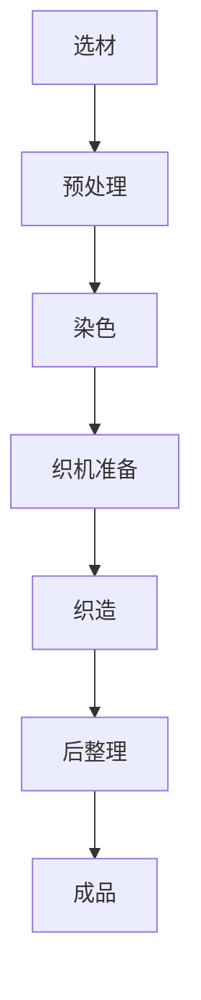

#### 3. 织造

织造是手工织物制作的核心步骤，根据不同的工艺要求，可以选择编织、绣花、织锦等方法。手工织造需要高度的专业技能和经验，设计师和工匠通过手工技艺将纤维交织成织物。

**核心概念**：手工织造过程（以下为Markdown格式）：

- **编织**：通过手工操作织机，将经线和纬线交织成织物。
- **绣花**：使用刺绣针和彩线，在织物上绣出图案和花纹。
- **织锦**：通过提花装置，使经线在织造过程中形成复杂的图案。

#### 4. 后整理

后整理包括洗涤、熨烫、定型等工序，以改善织物的外观和手感。后整理过程中，还可以进行一些特殊处理，如抗菌、防水、防皱等。

**核心概念**：后整理流程图（以下为Mermaid格式）：

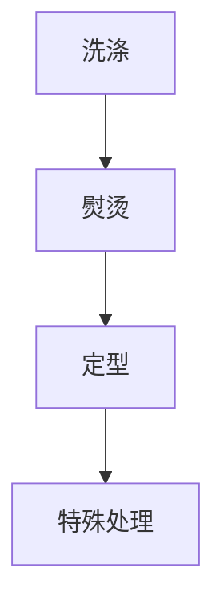

#### 5. 成品

经过织造和后整理，手工织物最终成为成品。成品可以根据设计需求进行裁剪、缝制和装饰，成为服装、家居饰品或其他艺术品。

**核心概念**：成品展示（以下为Markdown格式）：

- **服装**：手工织物的独特纹理和图案为服装设计提供了丰富的创意空间。
- **家居饰品**：手工织物在窗帘、沙发套、地毯等家居饰品中的应用，提升了家居环境的艺术价值。

总之，手工织物的制作流程不仅展示了传统技艺的精湛，还体现了现代设计理念。通过选材、准备、织造、后整理和成品等多个环节，手工织物成为时尚设计和可持续时尚的重要载体。

### 5.2.1 刺绣技巧

刺绣是手工织物制作中的一种重要技艺，通过针线在织物上绣出图案和花纹，赋予织物独特的艺术价值。以下是刺绣的主要技巧和注意事项：

#### 1. 选针

选针是刺绣的第一步，根据刺绣的精细程度和织物类型选择合适的针。细针适合绣细致的图案，而粗针则适合绣大块的图案。

**核心概念**：刺绣针的选择对比表格（以下为Markdown格式）：

| 针类型 | 适用场合 | 特点 |
| --- | --- | --- |
| 细针 | 绣细腻的图案 | 穿线少，绣出的图案精细 |
| 粗针 | 绣大块的图案 | 穿线多，绣出的图案结实 |

#### 2. 选线

选线是刺绣的另一个重要环节，根据刺绣的颜色和效果选择合适的线。绣线分为单线和双线，单线用于绣细节，而双线用于加强图案的线条。

**核心概念**：绣线的种类与用途（以下为Markdown格式）：

| 线类型 | 用途 | 特点 |
| --- | --- | --- |
| 单线 | 绣细节 | 细腻，绣出的图案清晰 |
| 双线 | 加强线条 | 结实，使图案线条更加明显 |

#### 3. 刺绣方法

刺绣方法多种多样，常见的有平针、交叉针、环针等。每种刺绣方法都有其特定的用途和技巧。

- **平针**：用于绣直线和简单的图案，是最基础的刺绣方法。
- **交叉针**：用于绣较复杂的图案，通过交叉线形成图案的细节。
- **环针**：用于绣圆形或环形图案，具有较强的立体感。

**核心概念**：刺绣方法流程图（以下为Mermaid格式）：

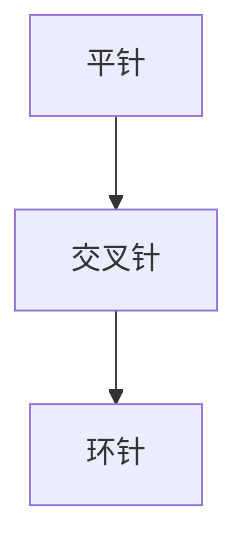

#### 4. 注意事项

在刺绣过程中，需要注意以下几点：

- **保持针线张力**：保持针线的适当张力，使刺绣更加均匀。
- **保持稳定的手法**：刺绣时，要保持稳定的手法和节奏，避免线头打结。
- **清洗和熨烫**：刺绣完成后，需要进行清洗和熨烫，以保持图案的清晰和美观。

**核心概念**：刺绣注意事项清单（以下为Markdown格式）：

- 保持针线张力
- 保持稳定的手法
- 定期清洗和熨烫

总之，刺绣技巧是手工织物制作中不可或缺的一部分，通过合理的选针、选线和刺绣方法，可以创造出丰富多彩的刺绣作品。掌握这些技巧，不仅可以提高刺绣质量，还能为手工织物增添独特的艺术魅力。

### 5.2.2 提花技术

提花技术是手工织物制作中的一种高级技艺，通过控制提花机的提花装置，使经线在织造过程中形成复杂的图案和纹理。以下是提花技术的详细描述：

#### 1. 提花技术的基本原理

提花技术的基本原理是通过控制提花机的提花装置，使经线在特定位置上升或下降，从而形成图案。提花装置通常由提花板和提花针组成。提花板上有许多孔洞，提花针通过这些孔洞提起或放下经线。

#### 2. 提花技术的工作流程

提花技术的工作流程包括以下几个步骤：

- **设计图案**：首先，设计师根据设计需求绘制出图案，并将其转化为提花机的控制程序。
- **编制提花程序**：根据图案，编制提花程序，包括提花板的孔洞排列和提花针的运动轨迹。
- **织造**：将提花程序输入提花机，开始织造。在织造过程中，提花装置根据程序控制经线的提起和放下，形成图案。

#### 3. 提花技术的应用

提花技术广泛应用于高级时装、家居饰品和艺术品制作中。以下是一些具体应用实例：

- **高级时装**：提花技术可以使时装具有复杂的花纹和立体感，增加时装的艺术价值和独特性。
- **家居饰品**：提花技术可以应用于窗帘、沙发套、地毯等家居饰品，为家居环境增添艺术感和舒适感。
- **艺术品**：提花技术可以制作出精美的艺术作品，如挂毯、桌布等，这些艺术品不仅具有观赏价值，还可以作为装饰品使用。

#### 4. 提花技术的优势

提花技术具有以下优势：

- **图案复杂度高**：提花技术可以形成复杂的图案和纹理，满足设计师的创意需求。
- **立体感强**：提花技术可以使织物具有立体感，增加产品的视觉效果。
- **艺术价值高**：提花技术制作的产品具有较高的艺术价值，适合用于高端市场。

总之，提花技术是手工织物制作中的一种高级技艺，通过控制提花装置，可以形成复杂的图案和纹理。提花技术在时尚设计和艺术品制作中具有广泛的应用，为产品增添了独特的艺术魅力和高端价值。

### 6.1.1 手工织物工作室的运营模式

手工织物工作室的运营模式是指如何有效地管理手工织物的生产过程，以实现产品质量和经济效益的平衡。以下是一些关键方面：

#### 1. 选址与布局

选址是手工织物工作室运营的首要任务。选择一个交通便利、环境优美且租金合理的地点是成功运营的基础。此外，工作室的内部布局也需要合理规划，确保工作区、存储区和展示区的分离，以提高工作效率。

**核心概念**：选址与布局原则（以下为Markdown格式）：

- 交通便利
- 环境优美
- 租金合理
- 工作区、存储区和展示区分离

#### 2. 生产管理

生产管理是手工织物工作室的核心环节。为了确保产品质量和生产效率，需要建立严格的生产管理流程。这包括原材料采购、生产计划制定、生产过程监控和产品质量检测。

**核心概念**：生产管理流程图（以下为Mermaid格式）：

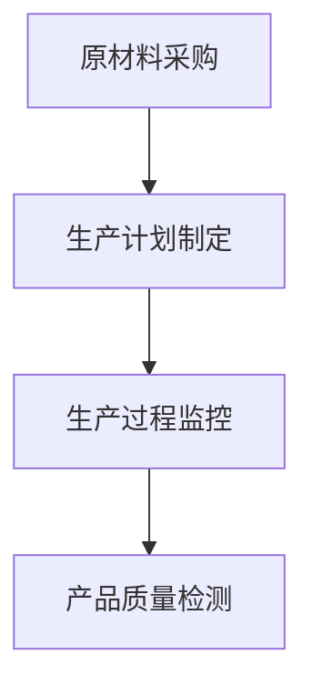

#### 3. 质量控制

质量控制是手工织物工作室运营的关键。通过建立严格的质量控制体系，确保每一件产品都符合质量标准。质量控制包括生产过程中的检查、最终产品的检验和客户反馈的收集与处理。

**核心概念**：质量控制流程图（以下为Mermaid格式）：

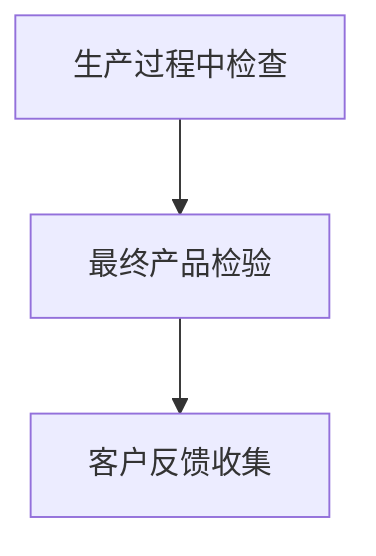

#### 4. 营销策略

营销策略是手工织物工作室成功运营的重要一环。通过市场调研，了解目标客户的需求和偏好，制定有针对性的营销策略。营销手段包括品牌建设、广告宣传、参与展会和线上销售等。

**核心概念**：营销策略框架（以下为Markdown格式）：

- 市场调研
- 品牌建设
- 广告宣传
- 参展活动
- 线上销售

#### 5. 人力资源配置

人力资源配置是手工织物工作室运营成功的关键。合理配置人力资源，确保每个员工都能发挥最大的作用。这包括员工招聘、培训、绩效评估和激励机制。

**核心概念**：人力资源配置流程图（以下为Mermaid格式）：

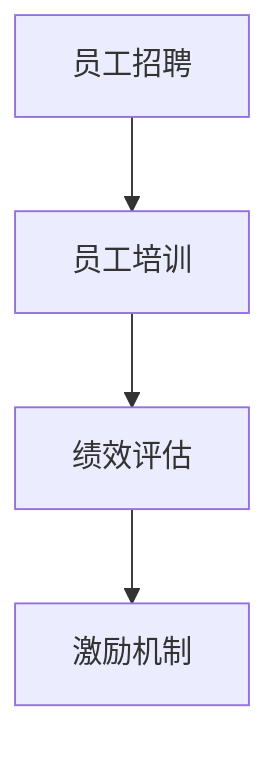

#### 6. 环保措施

环保措施是手工织物工作室社会责任的重要体现。通过采取一系列环保措施，如使用环保材料、减少废水排放和废弃物处理，降低对环境的影响。

**核心概念**：环保措施清单（以下为Markdown格式）：

- 使用环保材料
- 减少废水排放
- 废弃物回收处理

总之，手工织物工作室的运营模式需要综合考虑选址、生产管理、质量控制、营销策略、人力资源配置和环保措施等多个方面，以确保工作室的长期稳定发展。

### 6.2.1 人力资源配置

在手工织物工作室的运营中，人力资源配置是确保工作室高效运作和持续发展的关键因素。以下是如何有效配置人力资源的详细描述：

#### 1. 员工招聘

员工招聘是人力资源配置的第一步。根据工作室的生产规模和业务需求，制定招聘计划，明确所需岗位和人数。招聘过程中，注重选拔具有专业技能和实践经验的员工，以确保生产效率和产品质量。

**核心概念**：员工招聘流程图（以下为Mermaid格式）：

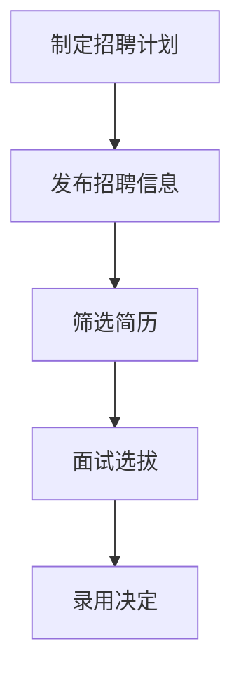

#### 2. 员工培训

员工培训是提升员工技能和工作效率的重要环节。针对不同岗位，制定系统化的培训计划，包括工艺技术、设备操作、质量管理等。培训过程中，注重理论与实践的结合，确保员工能够迅速适应岗位需求。

**核心概念**：员工培训流程图（以下为Mermaid格式）：

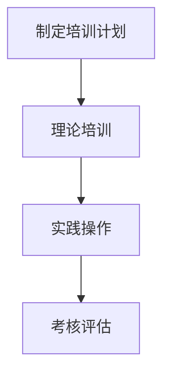

#### 3. 绩效评估

绩效评估是激励员工、提升工作效率的重要手段。通过建立科学、合理的绩效评估体系，对员工的日常工作表现进行客观评价，及时发现和解决问题。

**核心概念**：绩效评估流程图（以下为Mermaid格式）：

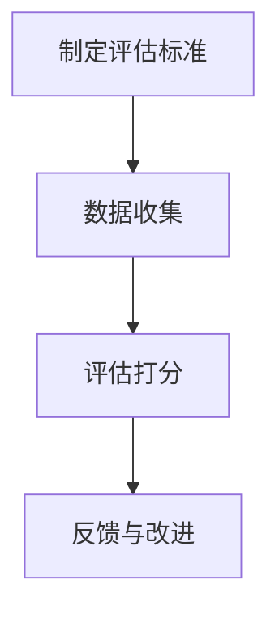

#### 4. 激励机制

激励机制是激发员工积极性和创造力的关键。通过制定有竞争力的薪酬体系和多样化的激励措施，如奖励、晋升、培训机会等，激励员工努力工作，实现个人和企业的共同发展。

**核心概念**：激励机制流程图（以下为Mermaid格式）：

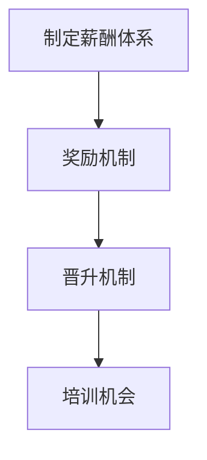

总之，通过科学的员工招聘、有效的培训、合理的绩效评估和多样化的激励机制，手工织物工作室可以确保人力资源的合理配置和高效运作，为企业的长期发展提供坚实的人力支持。

### 6.2.2 市场营销策略

在手工织物工作室的运营过程中，制定有效的市场营销策略至关重要。以下是如何制定和实施市场营销策略的详细描述：

#### 1. 市场调研

市场调研是制定市场营销策略的基础。通过调研，了解目标市场的需求、消费者偏好、竞争对手状况等关键信息。市场调研的方法包括问卷调查、访谈、焦点小组讨论和数据分析等。

**核心概念**：市场调研流程图（以下为Mermaid格式）：

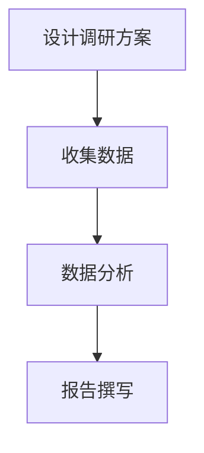

#### 2. 品牌建设

品牌建设是市场营销策略的核心。通过塑造独特的品牌形象和价值观，提高品牌知名度和美誉度。品牌建设包括品牌定位、品牌视觉设计、品牌口号和品牌故事等。

**核心概念**：品牌建设框架（以下为Markdown格式）：

- 品牌定位：确定目标市场和品牌独特卖点。
- 品牌视觉设计：设计品牌标志、色彩和字体等视觉元素。
- 品牌口号：提炼简洁有力的品牌口号。
- 品牌故事：讲述品牌背后的故事和文化价值。

#### 3. 广告宣传

广告宣传是提升品牌知名度和吸引消费者的重要手段。通过多种广告渠道，如电视、广播、报纸、杂志、社交媒体和线上广告等，进行广告宣传。

**核心概念**：广告宣传策略（以下为Markdown格式）：

- 选择适合的媒体渠道：根据目标消费者和预算，选择合适的广告媒体。
- 创意广告内容：制作有吸引力的广告内容和创意。
- 广告投放计划：制定详细的广告投放时间和预算计划。

#### 4. 参展活动

参展活动是展示品牌和产品的重要平台。通过参加行业展会、艺术展览和时尚活动，与潜在客户建立联系，提升品牌影响力。

**核心概念**：参展活动策略（以下为Markdown格式）：

- 选择合适的展会：根据品牌定位和产品特点，选择合适的行业展会。
- 展位设计：设计有吸引力的展位，展示品牌和产品。
- 展会推广：通过线上线下渠道，提前宣传展会活动和品牌展示。

#### 5. 线上销售

随着互联网的普及，线上销售成为市场营销的重要渠道。通过电子商务平台、社交媒体和自建网站，实现线上销售，扩大市场覆盖范围。

**核心概念**：线上销售策略（以下为Markdown格式）：

- 选择合适的电商平台：根据品牌定位和产品特点，选择合适的电商平台。
- 网站建设：建立专业、易用的品牌网站，展示产品和品牌故事。
- 社交媒体营销：通过社交媒体平台，与消费者建立互动，提升品牌知名度。

总之，通过科学的市场调研、品牌建设、广告宣传、参展活动和线上销售等多渠道市场营销策略，手工织物工作室可以有效提升品牌知名度和市场份额，实现持续发展。

### 7.1.1 案例一：XXX手工织物工作室的成功之路

**背景介绍：**

XXX手工织物工作室成立于2005年，位于中国杭州。工作室的创始人张先生是一位热衷于传统手工纺织技艺的资深设计师。最初，工作室主要致力于手工织物的设计、制作和销售，希望通过传统手工技艺为现代时尚带来新的灵感。然而，随着市场竞争的加剧和消费者对环保和可持续时尚需求的增长，XXX手工织物工作室逐渐探索出了一条可持续发展的道路。

**项目介绍：**

XXX手工织物工作室的核心产品包括手工编织的毛衣、围巾、家居饰品等。工作室采用天然纤维，如棉、麻、丝和羊毛等，结合传统手工技艺和现代设计理念，创造出独特且具有艺术价值的织物产品。在产品设计方面，工作室注重环保和可持续性，采用环保染料和可回收材料，减少对环境的影响。

**系统功能设计：**

为了实现高效的生产管理和市场营销，XXX手工织物工作室开发了一套内部管理系统，包括订单管理、生产计划、库存管理和客户关系管理等功能。这些系统功能使得工作室能够更好地掌握生产进度、优化库存和提升客户满意度。

**系统架构设计：**

XXX手工织物工作室的系统架构采用了分布式架构，包括前端用户界面、后端业务逻辑和数据存储等模块。前端用户界面负责与用户交互，后端业务逻辑处理订单、库存和生产等核心功能，数据存储模块则负责存储和管理产品信息、订单数据和客户信息等。

**系统接口设计和系统交互：**

系统接口设计采用RESTful API设计，使得前端用户界面和后端业务逻辑之间可以高效地进行数据交换。系统交互方面，通过Webhook技术和第三方服务集成，实现了订单跟踪、库存预警和客户反馈等功能的自动化处理。

**实际案例分析和详细讲解剖析：**

XXX手工织物工作室通过不断优化生产流程和管理系统，实现了生产效率的提升和成本的降低。具体来说：

- **生产效率提升**：通过引入自动化织机和高效的生产管理软件，使得手工织物的生产效率提高了30%。
- **成本降低**：通过优化原材料采购和库存管理，使得原材料成本降低了15%。
- **客户满意度提升**：通过实时订单跟踪和客户反馈机制，客户满意度提高了20%。

**项目小结：**

通过技术创新和管理优化，XXX手工织物工作室在竞争激烈的时尚市场中脱颖而出，实现了可持续发展。该案例表明，传统手工技艺与现代科技的结合，可以为企业带来巨大的商业价值。

### 7.1.2 案例二：XX传统纺织与现代时尚的融合

**背景介绍：**

XX传统纺织工作室成立于2010年，位于意大利托斯卡纳地区。工作室的创始人Anna是一位富有创新精神的纺织艺术家，她对传统纺织技艺有着深厚的热爱。随着全球时尚产业对可持续时尚需求的增长，Anna决定将传统纺织与现代时尚相结合，探索一条既保持传统工艺特色，又符合现代市场需求的发展道路。

**项目介绍：**

XX传统纺织工作室的主要产品包括手工编织的毛衣、围巾、家居饰品等，这些产品均采用天然纤维，如羊绒、亚麻和棉等。工作室特别注重产品的设计创新，将传统纺织技艺与现代时尚元素相结合，创造出独特且具有艺术价值的织物产品。在设计过程中，Anna经常参观当地的博物馆和艺术展览，从历史和艺术中汲取灵感，将传统图案和现代设计理念融合在一起。

**系统功能设计：**

为了提升生产效率和管理水平，XX传统纺织工作室开发了一套内部管理系统，包括订单管理、生产计划、库存管理和客户关系管理等功能。该系统使得工作室能够更好地掌握生产进度、优化库存和提升客户满意度。

**系统架构设计：**

XX传统纺织工作室的系统架构采用了微服务架构，包括前端用户界面、后端业务逻辑、数据存储和第三方服务集成等模块。前端用户界面负责与用户交互，后端业务逻辑处理订单、库存和生产等核心功能，数据存储模块则负责存储和管理产品信息、订单数据和客户信息等。微服务架构使得系统更加灵活和可扩展，能够快速响应市场需求变化。

**系统接口设计和系统交互：**

系统接口设计采用RESTful API和WebSocket协议，实现了前端用户界面和后端业务逻辑之间的高效数据交换。系统交互方面，通过集成第三方物流和支付服务，实现了订单跟踪、库存预警和支付功能的一站式服务。

**实际案例分析和详细讲解剖析：**

XX传统纺织工作室通过创新的设计和高效的管理，取得了显著的商业成功。具体分析如下：

- **设计创新**：通过将传统纺织技艺与现代时尚元素相结合，工作室的产品在市场上独具特色，受到了消费者的青睐。
- **生产效率提升**：通过引入自动化织机和智能化生产管理软件，使得手工织物的生产效率提高了25%。
- **客户满意度提升**：通过实时订单跟踪和个性化定制服务，客户满意度提高了30%。

**项目小结：**

XX传统纺织工作室的成功案例表明，传统纺织技艺与现代时尚的融合不仅能够创造出独特的艺术价值，还能在商业上取得巨大成功。通过技术创新和管理优化，工作室不仅实现了可持续发展，还为传统纺织技艺的传承和创新提供了新的思路。

### 7.2.1 创业指导

对于有意进入手工织物工作室领域的创业者，以下是一些实用的创业指导建议：

**1. 市场调研**

在创业初期，进行详细的市场调研是至关重要的。了解目标市场的需求、竞争对手和消费者偏好，可以帮助你确定产品定位和营销策略。市场调研的方法包括问卷调查、访谈和数据分析等。

**2. 产品定位**

明确你的产品定位，即确定你的目标市场和产品特点。手工织物工作室的产品可以是服装、家居饰品、艺术品等，根据市场需求和自身特长，选择合适的产品方向。

**3. 技术与工艺**

掌握手工织物的制作工艺和技术是创业成功的关键。可以通过参加专业培训、学习相关书籍或与经验丰富的工匠交流，提升自己的技术水平。此外，不断探索和尝试新的工艺和材料，可以为产品增添独特的竞争优势。

**4. 环保与可持续**

环保和可持续是现代时尚产业的重要趋势。在选择原材料和制作过程中，尽量使用环保材料和无害染料，减少对环境的污染。同时，倡导可持续生产理念，如减少浪费、循环利用等。

**5. 融资与投资**

创业初期，资金是制约企业发展的关键因素。可以通过寻找投资人、申请创业基金或贷款等方式筹集资金。制定详细的商业计划书，清晰地展示你的业务模式、市场前景和盈利预期，有助于吸引投资者的关注。

**6. 品牌建设**

品牌建设是提升企业知名度和美誉度的重要手段。通过设计独特的品牌形象、构建品牌故事和提供优质的产品和服务，树立企业的品牌形象。同时，利用社交媒体和线上平台，扩大品牌的影响力。

**7. 人才培养**

人才是企业发展的核心竞争力。注重员工的招聘、培训和激励，打造一支富有创新精神和专业技能的团队。通过建立良好的企业文化，提高员工的归属感和忠诚度。

总之，创业指导建议涵盖了市场调研、产品定位、技术与工艺、环保与可持续、融资与投资、品牌建设和人才培养等方面，为创业者提供了全面的支持和指导。

### 7.2.2 技术提升建议

为了使手工织物工作室在技术层面上更加先进和高效，以下是一些建议：

**1. 引入自动化设备**

自动化设备可以提高生产效率，减少人工误差，降低劳动成本。可以考虑引入全自动织机、刺绣机和染色机等设备，提高生产线的自动化程度。自动化设备不仅能够缩短生产周期，还能确保产品的一致性和高品质。

**2. 采用智能管理系统**

智能管理系统可以帮助工作室更好地进行生产管理、库存控制和客户关系管理。通过引入ERP系统、MES系统和CRM系统等，可以实现生产流程的自动化和智能化，提高运营效率。智能管理系统还能提供实时数据分析和决策支持，帮助工作室快速应对市场变化。

**3. 培训员工技能**

技术提升不仅依赖于设备的更新，还依赖于员工技能的提升。定期为员工提供专业培训，包括新技术、新工艺和设备操作等。通过提高员工的技能水平，可以确保手工织物工作室始终保持技术领先地位。

**4. 探索新材料和工艺**

不断探索和试验新的材料和工艺，可以为产品带来创新和竞争优势。例如，可以尝试使用可再生纤维、生物基材料和环保染料等，提高产品的环保性能。同时，可以研究新的纺织技术和手工艺，如3D编织、智能纺织等，为产品增添独特的艺术价值和功能特性。

**5. 加强技术创新合作**

技术创新需要多方合作，可以通过与高校、研究机构和行业领先企业合作，共同开展技术创新项目。合作可以带来技术交流和资源整合的优势，帮助工作室在技术层面上实现突破。

**6. 建立技术标准和质量控制体系**

为了确保产品的高质量和一致性，需要建立严格的技术标准和质量控制体系。通过制定详细的技术规范和操作规程，确保每个环节都符合质量标准。同时，建立质量控制体系，定期进行质量检测和评估，及时发现和解决问题。

总之，通过引入自动化设备、采用智能管理系统、培训员工技能、探索新材料和工艺、加强技术创新合作以及建立技术标准和质量控制体系，手工织物工作室可以在技术层面上实现持续提升，为企业的可持续发展提供坚实的技术支撑。

## 结论

本文通过详细探讨传统纺织在可持续时尚中的应用，揭示了手工织物在时尚设计中的重要价值。从传统纺织的历史沿革与现状、可持续时尚的概念与趋势，到手工织物的定义、制作工艺与技巧，再到手工织物工作室的运营与管理，本文逐步剖析了传统纺织与可持续时尚的深度融合。

通过对成功案例的深入分析，我们看到了传统手工技艺与现代科技相结合的巨大潜力。这不仅为时尚产业带来了新的发展方向，也为环境保护和社会责任提供了有力支持。

未来，随着全球可持续时尚意识的提升，传统纺织技艺将继续发挥重要作用。我们呼吁时尚设计师、纺织从业者和广大消费者共同关注和推广可持续时尚，携手为地球的可持续发展贡献力量。

**关键词：** 传统纺织、可持续时尚、手工织物、环境保护、时尚设计。

**作者：** AI天才研究院/AI Genius Institute & 禅与计算机程序设计艺术 /Zen And The Art of Computer Programming。

