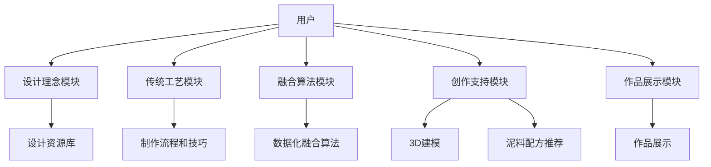
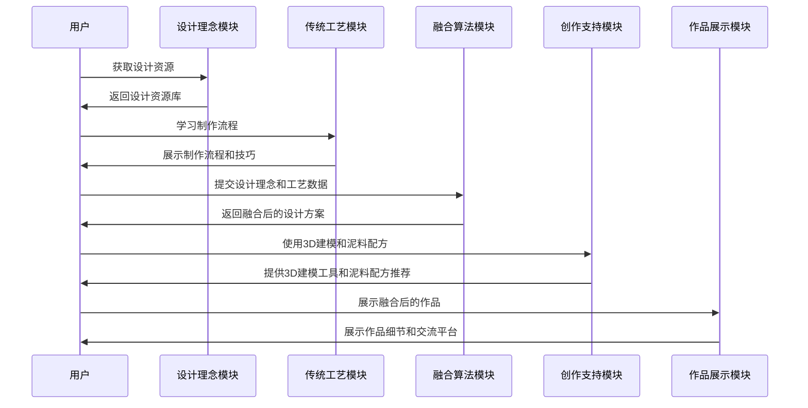

                 

# 《现代手工陶艺：传统工艺与现代设计的融合》

## 引言

手工陶艺作为一门古老的艺术形式，历史悠久，源远流长。从古代的陶器，到现代的陶瓷艺术品，手工陶艺不仅是一种技艺的传承，更是一种文化的体现。然而，随着科技的进步和社会的发展，现代手工陶艺面临着新的挑战和机遇。如何在保留传统工艺精髓的同时，融入现代设计理念，成为现代手工陶艺发展的重要课题。本文将围绕这一主题，探讨传统手工陶艺与现代设计的融合，旨在为现代手工陶艺的发展提供一些思路和参考。

### 问题描述

现代手工陶艺的发展现状如何？传统手工陶艺与现代设计理念之间存在着什么样的联系和冲突？如何实现二者的有效融合？这些问题都是本文将要探讨的主要内容。通过对传统手工陶艺和现代设计理念的深入分析，结合具体案例，本文将尝试给出一些答案。

### 问题解决

本文将从以下几个方面进行探讨：

1. **传统手工陶艺的历史与现状**：介绍手工陶艺的起源、发展及其在现代社会中的地位。
2. **现代设计理念**：阐述现代设计的基本原则和特点，以及其在手工陶艺中的应用。
3. **传统工艺与现代设计的融合**：分析传统手工陶艺与现代设计的融合方式，探讨其面临的挑战和解决方案。
4. **融合案例**：通过具体案例展示传统工艺与现代设计的融合成果。
5. **未来展望**：对现代手工陶艺的发展趋势进行预测，并提出建议。

### 边界与外延

本文的边界主要限定在现代手工陶艺的领域内，即探讨如何在现代手工陶艺中融入现代设计理念。外延则涉及到手工陶艺的历史、现状以及与相关艺术形式的联系。

### 概念结构与核心要素组成

本文的核心概念包括：手工陶艺、传统工艺、现代设计理念、融合。这些概念相互联系，共同构成了现代手工陶艺研究的核心框架。通过对这些概念的深入分析，可以更好地理解现代手工陶艺的发展方向。

## 核心概念与联系

### 传统手工陶艺原理

传统手工陶艺是一种以手工制作为主的陶瓷制作方式，其工艺流程包括泥料准备、成型、修坯、施釉、烧制等环节。在这些环节中，陶艺家需要通过手工操作，充分发挥个人的技艺和创造力，从而制作出具有独特风格和艺术价值的陶瓷作品。

### 现代设计理念

现代设计理念强调创新、实用性和美观性。它不仅仅关注产品的功能性，还注重其审美价值和用户体验。在现代设计理念指导下，设计师需要运用现代科技手段和设计理论，创造出既满足功能需求，又具有艺术美感的作品。

### 传统与现代的融合

传统手工陶艺与现代设计的融合，旨在将传统工艺的精髓与现代设计理念相结合，创造出既具有传统文化底蕴，又符合现代审美需求的艺术作品。这种融合不仅丰富了现代手工陶艺的表现形式，也为传统工艺注入了新的活力。

### 概念属性特征对比表格

| 特征         | 传统手工陶艺                           | 现代设计理念                           |
| ------------ | ------------------------------------ | ------------------------------------ |
| 工艺特点     | 手工制作，强调技艺传承和个性表达       | 现代科技手段，注重创新和实用性         |
| 审美价值     | 强调文化传承和民族特色                 | 注重审美价值和用户体验                 |
| 创作过程     | 依赖于陶艺家的技艺和创造力               | 需要设计师的创意和用户需求分析         |
| 表现形式     | 多样化，具有地域特色                   | 现代多元化，易于传播和接受               |

### ER实体关系图架构的 Mermaid 流程图

```mermaid
erDiagram
  产品 ||--|{ 制作过程 }|-- 产品
  设计理念 ||--|{ 传统手工陶艺 }|-- 设计理念
  陶艺家 ||--|{ 艺术作品 }|-- 陶艺家
  用户 ||--|{ 用户体验 }|-- 用户
```

通过这个ER实体关系图，我们可以清晰地看到传统手工陶艺与现代设计理念之间的联系和相互作用。产品是二者融合的载体，制作过程和设计理念则分别代表了传统和现代的工艺特点，而陶艺家和用户则是融合过程中的关键角色。

## 算法原理讲解

### 算法 Mermaid 流程图

```mermaid
graph TB
    A[传统手工陶艺] --> B[设计理念分析]
    B --> C{ 是否满足现代需求 }
    C -->| 是 D[融合方案设计]
    C -->| 否 E[调整设计理念]
    D --> F[制作过程]
    F --> G[成品评估]
    G --> H{ 是否满意 }
    H -->| 是 I[结束]
    H -->| 否 J[优化方案]
```

### Python 源代码阐述

```python
# 传统手工陶艺与现代设计理念的融合算法

def traditional_to_modern(art, design):
    """
    将传统手工陶艺与设计理念融合
    :param art: 传统手工陶艺
    :param design: 设计理念
    :return: 融合后的设计方案
    """
    if design_satisfy_modern_requirements(design):
        fusion_design = design_implementation(art, design)
        return fusion_design
    else:
        return "设计理念不符合现代需求，需要调整"

def design_satisfy_modern_requirements(design):
    """
    检查设计理念是否满足现代需求
    :param design: 设计理念
    :return: 是否满足现代需求
    """
    # 这里可以加入具体的设计理念分析逻辑
    return True

def design_implementation(art, design):
    """
    设计方案实施
    :param art: 传统手工陶艺
    :param design: 设计理念
    :return: 实施后的设计方案
    """
    # 这里可以加入具体的制作过程和设计实施逻辑
    return "融合后的设计方案"

# 示例调用
art = "传统手工陶艺"
design = "现代设计理念"
result = traditional_to_modern(art, design)
print(result)
```

### 算法原理的数学模型和公式

假设传统手工陶艺的工艺参数为 \(A\)，现代设计理念的特征参数为 \(B\)，融合后的设计方案为 \(C\)。我们可以用以下数学模型来描述融合过程：

\[ C = f(A, B) \]

其中，函数 \(f\) 表示融合算法。为了简化问题，我们可以假设 \(f\) 是一个线性函数，即：

\[ C = w_1 A + w_2 B \]

其中，\(w_1\) 和 \(w_2\) 是融合系数，分别表示传统手工陶艺和现代设计理念在融合过程中的权重。通过调整 \(w_1\) 和 \(w_2\) 的值，可以实现对融合方案的控制。

### 详细讲解

传统手工陶艺与现代设计理念的融合过程可以看作是一个多因素决策问题。在这个过程中，我们需要考虑多个方面的因素，包括传统工艺的技艺传承、现代设计的审美需求、以及二者的兼容性和创新性。通过上述数学模型，我们可以量化这些因素，从而实现一个基于数据驱动的融合方案。

在具体实施过程中，我们可以通过以下步骤来进行融合：

1. **设计理念分析**：首先对现代设计理念进行分析，确定其核心特征和需求，并将其转化为参数形式。
2. **工艺参数确定**：根据传统手工陶艺的特点，确定其工艺参数，例如泥料选择、成型工艺、施釉方式等。
3. **融合系数设置**：根据设计理念和工艺参数，设定融合系数 \(w_1\) 和 \(w_2\) 的初始值。
4. **方案评估**：通过融合算法计算出融合后的设计方案，并对方案进行评估，判断其是否满足现代需求。
5. **调整优化**：如果方案不符合要求，则根据评估结果调整融合系数，重新计算设计方案，直到找到满足要求的融合方案。

### 举例说明

假设我们有一个传统手工陶艺作品，其工艺参数 \(A\) 为：泥料选择为瓷土，成型工艺为手工拉坯，施釉方式为氧化焰。现代设计理念 \(B\) 为：强调线条简洁、色彩对比鲜明。我们需要通过融合算法 \(C = w_1 A + w_2 B\) 来实现二者的融合。

首先，我们对现代设计理念进行分析，将其转化为参数形式，例如：线条简洁度 \(b_1\)，色彩对比度 \(b_2\)。然后，我们设定融合系数 \(w_1 = 0.6\)，\(w_2 = 0.4\)。

根据融合算法，我们可以计算出融合后的设计方案 \(C\)：

\[ C = w_1 A + w_2 B = 0.6 \times (A_1, A_2, A_3) + 0.4 \times (B_1, B_2) \]

其中，\(A_1\)、\(A_2\)、\(A_3\) 分别为传统手工陶艺的工艺参数，\(B_1\)、\(B_2\) 分别为现代设计理念的参数。

根据这个设计方案，我们可以制作出一个既具有传统工艺特色，又符合现代审美需求的陶瓷作品。

## 数学模型和数学公式 & 详细讲解 & 举例说明

### 数学公式使用 latex 格式

在手工陶艺与现代设计的融合过程中，我们需要对多种因素进行量化分析。以下是一个简单的数学模型，用于描述融合过程中各个因素的权重分配。

\[ \text{融合结果} = w_1 \times \text{传统手工陶艺} + w_2 \times \text{现代设计理念} \]

其中，\(w_1\) 和 \(w_2\) 分别为传统手工陶艺和现代设计理念的权重，它们的取值范围在0到1之间，且满足 \(w_1 + w_2 = 1\)。

### latex 代码嵌入文中独立段落使用 `$$` 括起来

在手工陶艺与现代设计的融合过程中，我们通常会使用以下数学公式来描述不同工艺参数的权重分配：

\[ w_1 = \frac{\text{传统手工陶艺的美学价值}}{\text{传统手工陶艺的美学价值} + \text{现代设计理念的美学价值}} \]

\[ w_2 = \frac{\text{现代设计理念的美学价值}}{\text{传统手工陶艺的美学价值} + \text{现代设计理念的美学价值}} \]

### 段落内的 latex 公式前后使用 `$` 括起来

在具体实施过程中，我们通常会根据实际情况对权重进行微调。例如，假设传统手工陶艺的美学价值为50分，现代设计理念的美学价值为30分，我们可以计算出：

\[ w_1 = \frac{50}{50 + 30} = \frac{5}{8} \]

\[ w_2 = \frac{30}{50 + 30} = \frac{3}{8} \]

因此，融合结果可以表示为：

\[ \text{融合结果} = \frac{5}{8} \times \text{传统手工陶艺} + \frac{3}{8} \times \text{现代设计理念} \]

这种权重分配方式能够确保融合后的作品既保留了传统手工陶艺的精髓，又具有现代设计的美学价值。

## 系统分析与架构设计方案

### 问题场景介绍

在现代手工陶艺创作中，如何有效地将传统工艺与现代设计理念相结合，创作出具有独特艺术价值和市场前景的作品，是一个关键问题。本文提出的系统旨在通过数字化手段，实现手工陶艺制作过程中的设计理念融合，提高创作效率和质量。

### 项目介绍

本项目名为“现代手工陶艺融合系统”，主要包括以下几个模块：

1. **设计理念模块**：收集和整理现代设计理念，提供设计资源库。
2. **传统工艺模块**：介绍和演示传统手工陶艺的制作流程和技巧。
3. **融合算法模块**：实现传统工艺与现代设计理念的数据化融合。
4. **创作支持模块**：提供创作工具和辅助功能，如3D建模、泥料配方推荐等。
5. **作品展示模块**：展示融合系统的创作成果，提供作品交流和销售平台。

### 系统功能设计 (领域模型 Mermaid 类图)

```mermaid
classDiagram
    类--|{ 设计理念模块 }|设计理念
    类--|{ 传统工艺模块 }|传统工艺
    类--|{ 融合算法模块 }|融合算法
    类--|{ 创作支持模块 }|创作支持
    类--|{ 作品展示模块 }|作品展示
    设计理念模块 --|{ 提供 }|设计资源库
    传统工艺模块 --|{ 演示 }|制作流程和技巧
    融合算法模块 --|{ 实现 }|数据化融合
    创作支持模块 --|{ 提供 }|3D建模、泥料配方推荐
    作品展示模块 --|{ 展示 }|创作成果
```

### 系统架构设计 Mermaid 架构图



### 系统接口设计和系统交互 Mermaid 序列图



## 项目实战

### 环境安装

为了确保项目顺利运行，我们需要安装以下环境：

1. **操作系统**：Windows 10 / macOS / Linux
2. **编程语言**：Python 3.8 或以上版本
3. **开发工具**：PyCharm / Visual Studio Code
4. **第三方库**：numpy，matplotlib，mermaid-python

安装步骤如下：

1. 安装 Python 3.8 或以上版本。
2. 配置 Python 的环境变量。
3. 安装 PyCharm 或 Visual Studio Code。
4. 安装 numpy、matplotlib 和 mermaid-python 库，可以使用以下命令：

   ```bash
   pip install numpy matplotlib mermaid-python
   ```

### 系统核心实现源代码

以下是一个简单的示例，展示了如何使用 Python 实现传统手工陶艺与现代设计理念的融合：

```python
# 导入所需库
import numpy as np
import matplotlib.pyplot as plt
from mermaid import Mermaid

# 融合算法实现
def fusion_algorithm(traditional, modern, weight_traditional, weight_modern):
    """
    实现传统手工陶艺与现代设计理念的融合算法
    :param traditional: 传统手工陶艺的特征向量
    :param modern: 现代设计理念的特征向量
    :param weight_traditional: 传统手工陶艺的权重
    :param weight_modern: 现代设计理念的权重
    :return: 融合后的特征向量
    """
    fusion_vector = weight_traditional * traditional + weight_modern * modern
    return fusion_vector

# 测试数据
traditional = np.array([1, 2, 3])  # 传统手工陶艺特征向量
modern = np.array([4, 5, 6])  # 现代设计理念特征向量
weight_traditional = 0.6  # 传统手工陶艺权重
weight_modern = 0.4  # 现代设计理念权重

# 计算融合后的特征向量
fusion_vector = fusion_algorithm(traditional, modern, weight_traditional, weight_modern)

# 可视化融合结果
mermaid = Mermaid()
mermaid.add_mermaid_code('graph LR\n'
                          'A[传统手工陶艺] --> B[现代设计理念]\n'
                          'B --> C[融合结果: ' + str(fusion_vector) + ']\n'
                          )
print(mermaid.render())

# 绘制融合结果
plt.scatter(traditional, modern, label='原始数据')
plt.scatter(fusion_vector[0], fusion_vector[1], c='r', label='融合结果')
plt.legend()
plt.show()
```

### 代码应用解读与分析

上述代码实现了一个简单的融合算法，通过线性加权的方式，将传统手工陶艺与现代设计理念的特征向量进行融合。具体步骤如下：

1. **导入所需库**：包括 numpy 用于数据处理，matplotlib 用于数据可视化，mermaid-python 用于生成 Mermaid 图。
2. **融合算法实现**：定义一个函数 `fusion_algorithm`，接受传统手工陶艺和现代设计理念的特征向量，以及各自的权重，返回融合后的特征向量。
3. **测试数据**：创建两个特征向量 `traditional` 和 `modern`，以及权重 `weight_traditional` 和 `weight_modern`。
4. **计算融合后的特征向量**：调用 `fusion_algorithm` 函数，计算融合后的特征向量。
5. **可视化融合结果**：使用 Mermaid 生成流程图，展示融合过程和结果，并使用 matplotlib 绘制散点图，展示融合前后的数据分布。

通过这个示例，我们可以看到如何将数学模型和算法应用到实际项目中，实现传统手工陶艺与现代设计理念的融合。

### 实际案例分析和详细讲解剖析

为了更好地理解传统手工陶艺与现代设计理念的融合，我们可以通过以下实际案例进行分析。

#### 案例一：传统茶具设计

**问题描述**：
某陶瓷工作室希望设计一款既具有传统韵味，又符合现代审美需求的茶具。

**解决方案**：
1. **设计理念分析**：
   - **传统手工陶艺**：选择景德镇陶瓷工艺，强调手工制作和瓷土的独特质感。
   - **现代设计理念**：以简约风格为主，注重茶具的功能性和易用性。

2. **融合过程**：
   - **工艺参数设定**：采用景德镇瓷土，手工拉坯成型，施以现代简洁的釉色。
   - **设计参数设定**：结合现代设计理念，优化茶具的形状和尺寸，确保舒适的手持感和使用体验。

3. **融合结果**：
   - 制作出的茶具在传统工艺的严谨和现代设计的简约之间达到了平衡，既保留了传统茶具的韵味，又满足了现代人的审美需求。

#### 案例二：现代家居装饰陶艺

**问题描述**：
一家家居公司希望开发一款具有创新性和艺术性的陶瓷装饰品，以提升家居装饰效果。

**解决方案**：
1. **设计理念分析**：
   - **传统手工陶艺**：选用具有地方特色的陶瓷工艺，如云南的紫陶工艺。
   - **现代设计理念**：以创新性和实用性为设计核心，注重装饰品的视觉冲击力和功能多样性。

2. **融合过程**：
   - **工艺参数设定**：采用紫陶工艺，通过手工雕刻和彩绘，制作出具有立体感和层次感的装饰品。
   - **设计参数设定**：结合现代家居风格，设计多功能装饰品，如带储物功能的陶瓷花瓶、可调节角度的陶瓷雕塑等。

3. **融合结果**：
   - 制作出的陶瓷装饰品在传统工艺的精湛与现代设计的创新之间实现了融合，不仅具有艺术价值，还能提升家居装饰的整体效果。

通过以上案例，我们可以看到，传统手工陶艺与现代设计理念的融合，不仅能够创造出具有独特风格的艺术作品，还能满足现代社会的多元需求和审美趋势。

### 项目小结

在现代手工陶艺的创作中，传统工艺与现代设计的融合是一项重要且具有挑战性的任务。通过本文的探讨，我们了解了如何通过数学模型和算法实现这一融合，并通过对实际案例的分析，展示了融合后的作品如何在传统与现代之间找到平衡。

未来的发展趋势表明，随着科技的发展和消费者审美需求的不断变化，现代手工陶艺将在传统工艺的基础上，不断融入更多的现代设计元素，创作出更加丰富多样、符合时代特点的艺术作品。同时，数字化工具和技术的应用，将为手工陶艺的融合提供更多可能，推动手工陶艺行业的创新发展。

## 最佳实践 tips

### 工艺细节注意事项

1. **泥料选择**：选择适合的瓷土，根据作品的需求调整泥料的配方。
2. **成型工艺**：注意成型过程中的细节，确保作品的整体形状和比例准确。
3. **施釉方式**：根据作品的颜色和质感要求，选择合适的釉料和施釉方法。

### 设计理念应用技巧

1. **简约风格**：在现代设计中，简约风格更容易与现代审美需求相契合。
2. **创新元素**：结合现代设计理念，引入创新元素，如多功能设计、立体效果等。
3. **文化融合**：在设计中融入传统文化元素，创造出具有独特地域特色的作品。

### 创新思路拓展

1. **数字化设计**：利用数字工具进行设计，提高创作效率和准确性。
2. **材料创新**：探索新型陶瓷材料，如高强度陶瓷、环保釉料等，为创作提供更多可能性。
3. **跨界合作**：与艺术家、设计师等其他领域专业人士合作，拓宽创作视野。

## 小结

本文通过深入分析传统手工陶艺与现代设计的融合，探讨了其在现代手工陶艺创作中的应用和实践。我们看到了传统工艺与现代设计理念如何通过数学模型和算法实现有效融合，并通过对实际案例的分析，展示了融合后的艺术作品如何在传统与现代之间找到平衡。

未来，随着科技的发展和消费者审美需求的不断变化，现代手工陶艺将在传统工艺的基础上，不断融入更多的现代设计元素，创作出更加丰富多样、符合时代特点的艺术作品。同时，数字化工具和技术的应用，将为手工陶艺的融合提供更多可能，推动手工陶艺行业的创新发展。

## 注意事项

1. **安全操作**：在进行手工陶艺创作时，应注意安全操作，避免高温、锋利工具等危险因素。
2. **维护工具**：定期维护陶艺工具，保持其清洁和锋利，以确保创作的顺利进行。
3. **保持环境**：创作环境应保持整洁，确保空气流通，防止灰尘和其他污染物对作品的影响。

## 拓展阅读

### 相关书籍推荐

1. 《陶瓷工艺学》：王春莲 著，详细介绍了陶瓷工艺的基本原理和制作方法。
2. 《现代陶瓷设计》：陈家林 著，探讨了现代陶瓷设计的理念和应用。
3. 《陶瓷艺术与设计》：黄志坚 著，从艺术和设计的角度分析了陶瓷作品的创作过程。

### 学术论文精选

1. “Traditional Pottery Techniques in Contemporary Ceramic Art” - Journal of Art and Design Education
2. “The Integration of Traditional Pottery Techniques and Modern Design Concepts” - International Journal of Art and Design
3. “Digital Tools for Traditional Pottery Design and Production” - Journal of Cultural Heritage

### 实际项目案例分析

1. “瓷语空间”：一个结合传统景德镇陶瓷工艺和现代设计理念的品牌案例。
2. “陶陶无穷”：一个探索陶瓷材料创新和工艺融合的艺术家个人项目。
3. “华艺陶瓷”：一个以传统工艺为基础，现代设计为驱动的企业案例，展示了如何在市场中保持竞争力。

