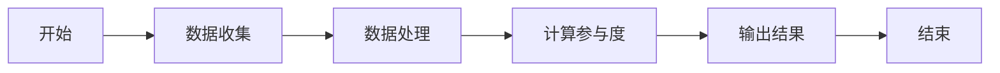
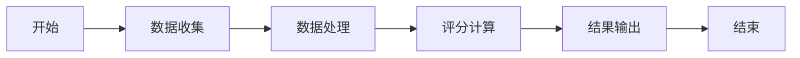
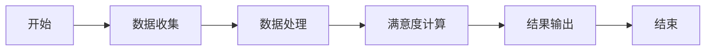
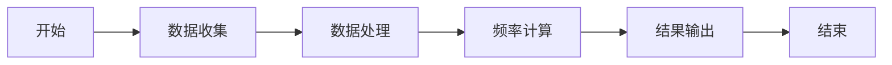
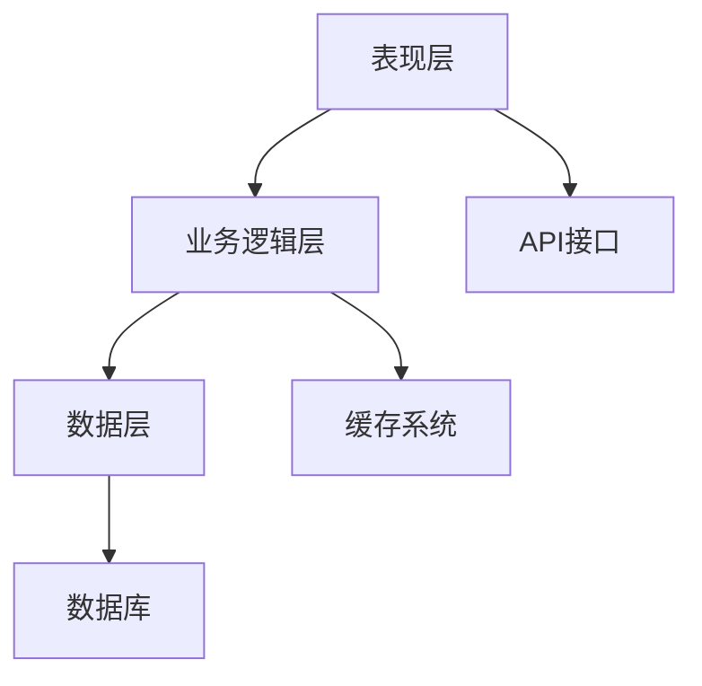
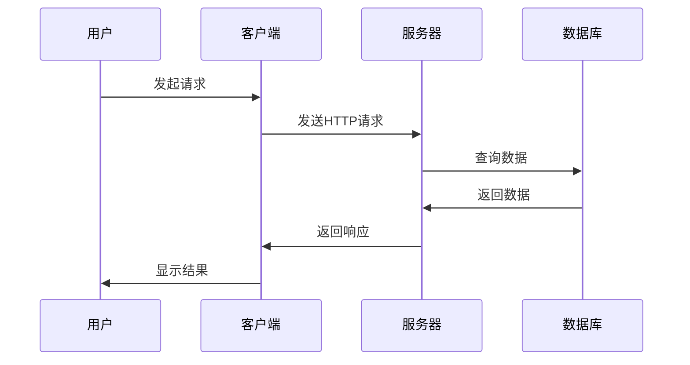

                 

## 引言

### 问题背景

在现代社会中，人们对食品的健康和文化价值越来越重视。食品不仅是我们日常生活的必需品，更是文化传承和社交活动的载体。面包作为一种历史悠久、全球通用的食品，承载了丰富的文化内涵和多样化的制作技艺。从古罗马的面包节到现代各种面包艺术展览，面包始终是人们庆祝、社交和纪念的重要物品。

随着人们对健康饮食的关注增加，手工面包因其天然的成分和独特的口感，逐渐受到市场的青睐。手工面包的制作过程强调手工技艺和自然发酵，保留了食品的原始风味和营养成分，更符合现代人对健康饮食的追求。然而，在工业化生产的冲击下，传统手工面包的制作技艺和传统文化正面临传承和推广的挑战。

### 问题描述

如何在一个社区活动中既展示面包的多样化制作技艺，又传承和弘扬面包文化？这是现代手工面包艺术节所需要解决的核心问题。这个问题不仅涉及到活动的设计和实施，还涉及到如何吸引和保持社区居民的参与热情，以及如何利用技术手段提高活动的效果和影响力。

具体来说，问题描述包括以下几个方面：

1. **面包文化展示**：如何通过活动展示面包在不同文化和地域的多样性？
2. **手工技艺传承**：如何通过活动传递传统手工面包制作的技艺和理念？
3. **社区参与**：如何激发社区居民的参与热情，促进社区凝聚力的提升？
4. **活动推广**：如何利用现代技术手段，如互联网和社交媒体，扩大活动的影响范围？

### 问题解决

现代手工面包艺术节的举办，旨在通过一系列社区活动，庆祝和推广面包文化的多样性。以下是解决该问题的具体措施：

1. **展示多样化制作技艺**：通过设置不同国家和地区的面包制作展示区，让参与者了解和学习各种面包的制作方法和文化背景。
2. **手工技艺体验**：设立手工面包制作工作坊，邀请面包师傅现场教授传统手工面包的制作技艺，让社区居民亲身体验。
3. **文化讲座与互动**：邀请面包文化专家进行讲座，介绍面包的历史、文化价值和现代发展，增强参与者的文化认同感。
4. **面包品鉴与交流**：组织面包品鉴活动，让参与者品尝不同品种的面包，并进行交流和讨论，加深对面包文化的理解。

通过这些措施，现代手工面包艺术节不仅能够展示面包文化的多样性，还能促进社区居民的参与和互动，增强社区的凝聚力。同时，利用现代技术手段，如社交媒体和网络直播，可以扩大活动的影响力，让更多的人了解和参与到这个活动中来。

### 边界与外延

现代手工面包艺术节的边界和范围包括但不限于以下几个方面：

- **活动内容**：包括面包制作展示、手工技艺体验、文化讲座、面包品鉴活动等。
- **参与对象**：社区成员、面包爱好者、专业人士、学生等，年龄和文化背景不限。
- **活动形式**：现场活动和线上活动相结合，如现场展示和直播、线上交流和分享等。
- **技术支持**：利用互联网和社交媒体平台，进行活动宣传、信息发布、互动交流等。

通过这些边界和范围的设定，现代手工面包艺术节旨在打造一个包容、开放、互动的平台，让更多的人了解、参与和传承面包文化。活动不仅局限于面包的制作和品尝，更是一个文化和社交的盛会，旨在通过面包这一载体，加深人们对不同文化和生活方式的理解和认同。

## 核心概念

### 面包文化

#### 概念

面包文化是指面包作为一种食品在制作、食用和传承过程中所蕴含的文化内涵。它不仅包括面包的制作方法、口味和形状，还涉及面包在各个国家和地区的文化象征、传统习俗以及其社会功能。

#### 属性

1. **文化多样性**：不同国家和地区的面包有着各自的制作工艺和独特风味，如法式面包、意式面包、日式面包等。
2. **传统手工艺**：面包制作中蕴含着丰富的手工艺文化，如揉面、发酵、烘烤等技艺，这些技艺往往世代相传，成为文化传承的重要载体。
3. **社交功能**：面包在许多文化中具有社交功能，如庆典、宴会和日常餐饮中，面包都是不可或缺的食品。

#### 对比

- **西方面包与东方面包**：
  - 制作工艺：西方面包通常通过机器生产，而东方面包则更多依赖手工制作。
  - 口味差异：西方面包口感多样，如软绵、酥脆，而东方面包则注重口感和营养。
  - 文化内涵：西方面包更注重制作技艺和口感，而东方面包则强调健康和营养。

### 手工面包

#### 概念

手工面包是指通过手工技艺制作的面包，强调面团的揉制和发酵过程。手工面包的制作过程中不使用或仅使用少量机械，更多依赖于手工技艺，如揉面、发酵、烘烤等。

#### 属性

1. **品质独特**：手工面包口感丰富，层次分明，更能体现面粉和酵母的自然风味。
2. **文化传承**：手工面包技艺是传统饮食文化的体现，通过一代代人的传承，保持了食物的原始风味和文化内涵。
3. **健康理念**：手工面包通常采用天然材料和自然发酵，更符合现代人对健康饮食的追求。

### 社区活动

#### 概念

社区活动是指社区内部或社区之间举办的各类互动和庆祝活动。这些活动旨在增强居民之间的联系，提升社区凝聚力，同时传递知识和文化。

#### 属性

1. **参与性**：社区活动鼓励居民的积极参与，通过互动和合作，增进居民之间的交流和感情。
2. **教育性**：社区活动往往具有教育功能，通过活动传递知识和文化，提高居民的文化素养。
3. **娱乐性**：社区活动不仅注重教育意义，还强调娱乐性，通过丰富的活动内容和形式，吸引居民参与。

### 三者的关系

- **面包文化**是社区活动的核心内容，通过社区活动，面包文化得以传承和弘扬。
- **手工面包**是面包文化的具体表现形式，通过手工面包的制作和品尝，居民可以更深入地体验和理解面包文化。
- **社区活动**是面包文化传承和推广的重要载体，通过社区活动，面包文化得以普及和传播。

### ER实体关系图

以下是面包文化、手工面包和社区活动的ER实体关系图：

```mermaid
erDiagram
  面包文化 ||--|{ 手工面包 } : 制作
  社区活动 ||--|{ 面包文化 } : 主题
  社区活动 ||--|{ 手工面包 } : 内容
```

在这个ER图中，面包文化是手工面包的制作基础，而社区活动则以面包文化为主题，手工面包作为活动内容之一，三者相互关联，共同构成一个完整的生态系统。

## 算法原理

### 社区参与度评估算法

社区参与度评估算法旨在通过定量分析，评估社区成员在活动中的参与程度。这一算法不仅可以帮助活动组织者了解活动的受欢迎程度，还能为后续活动的改进提供数据支持。

#### Mermaid 流程图



在这个流程图中，我们首先收集数据，然后对数据进行处理，接着计算参与度，并将结果输出。

#### Python 源代码

```python
import pandas as pd

def calculate_participation_rate(data):
    # 数据处理
    df = pd.DataFrame(data)
    df['participation'] = df['activity'].map({'参与': 1, '未参与': 0})
    
    # 计算参与度
    total_activities = df['participation'].sum()
    total_people = df['participant_id'].nunique()
    participation_rate = total_activities / total_people
    
    # 输出结果
    print("参与度：", participation_rate)
    
    return participation_rate

# 示例数据
data = [
    {'participant_id': 1, 'activity': '参与'},
    {'participant_id': 2, 'activity': '未参与'},
    {'participant_id': 1, 'activity': '参与'},
    {'participant_id': 3, 'activity': '参与'}
]

calculate_participation_rate(data)
```

在这个Python源代码中，我们首先使用Pandas库创建一个DataFrame，然后根据活动参与情况标记每个参与者的参与状态，计算总的参与次数和参与人数，最终计算出参与度。

#### 数学模型和公式

社区参与度的计算公式如下：

$$
P = \frac{N_p}{N_t}
$$

其中：
- \( P \) 表示参与度（通常以百分比形式表示）。
- \( N_p \) 表示参与活动的总人数。
- \( N_t \) 表示社区总人数。

#### 详细讲解与举例说明

假设一个社区有100名成员，在某次面包艺术节活动中，有60名成员参与了活动，另外40名成员未参与。那么，参与度可以通过以下步骤计算：

1. **收集数据**：统计参与活动的成员数量和总成员数量。
   - \( N_p = 60 \)
   - \( N_t = 100 \)

2. **计算参与度**：
   $$
   P = \frac{N_p}{N_t} = \frac{60}{100} = 0.6
   $$
   将参与度转换为百分比形式：
   $$
   P = 0.6 \times 100\% = 60\%
   $$

因此，该次面包艺术节的参与度为60%。

这个公式简单易懂，通过计算参与人数占总人数的比例，可以直观地反映社区成员的参与程度。对于活动组织者来说，这个数据有助于他们评估活动的效果，以及后续如何吸引更多成员参与。

### 面包工艺评分算法

面包工艺评分算法用于评估面包制作的专业度和工艺水平。这个算法通过对多个评分项进行综合评价，给出一个总分，以反映面包的质量和制作者的技艺。

#### Mermaid 流程图



在这个流程图中，我们首先收集评分数据，然后对数据进行处理，接着计算评分，并将结果输出。

#### Python 源代码

```python
import pandas as pd

def calculate_score(data):
    # 数据处理
    df = pd.DataFrame(data)
    df['total_score'] = df[['taste', 'texture', 'appearance', 'craftsmanship']].sum(axis=1)
    
    # 评分计算
    average_score = df['total_score'].mean()
    
    # 输出结果
    print("平均评分：", average_score)
    
    return average_score

# 示例数据
data = [
    {'taste': 4.5, 'texture': 4.7, 'appearance': 4.6, 'craftsmanship': 4.8},
    {'taste': 4.0, 'texture': 4.2, 'appearance': 4.3, 'craftsmanship': 4.5},
    {'taste': 4.7, 'texture': 4.8, 'appearance': 4.9, 'craftsmanship': 4.9}
]

calculate_score(data)
```

在这个Python源代码中，我们使用Pandas库创建一个DataFrame，将每个评分项加总，计算总分，然后求平均值得到平均评分。

#### 数学模型和公式

面包工艺评分的计算公式如下：

$$
S = \frac{1}{n}\sum_{i=1}^{n} s_i
$$

其中：
- \( S \) 表示总评分。
- \( n \) 表示评分项的数量。
- \( s_i \) 表示每个评分项的评分。

#### 详细讲解与举例说明

假设我们有三项评分项：口感（taste）、质地（texture）、外观（appearance）和工艺（craftsmanship），每个评分项的评分为4.5、4.7、4.6和4.8。那么，平均评分可以通过以下步骤计算：

1. **收集评分数据**：统计每个评分项的评分。
   - \( s_1 = 4.5 \)
   - \( s_2 = 4.7 \)
   - \( s_3 = 4.6 \)
   - \( s_4 = 4.8 \)

2. **计算总分**：
   $$
   S = \frac{1}{4}(4.5 + 4.7 + 4.6 + 4.8) = \frac{18.6}{4} = 4.65
   $$

3. **计算平均评分**：
   $$
   S = 4.65
   $$

因此，这三个评分项的平均评分为4.65。

这个公式通过简单平均计算，可以快速评估面包的工艺水平。对于面包制作者和评审者来说，这个数据有助于他们了解自己的优势和不足，进而进行改进。

### 社区活动满意度评估算法

社区活动满意度评估算法用于评估社区成员对活动的整体满意度。这一算法通过对多个评价维度进行综合分析，得出一个满意度评分，以反映活动的效果和社区成员的参与体验。

#### Mermaid 流程图



在这个流程图中，我们首先收集数据，然后对数据进行处理，接着计算满意度评分，并将结果输出。

#### Python 源代码

```python
import pandas as pd
from sklearn.linear_model import LinearRegression

def calculate_satisfaction(data):
    # 数据处理
    df = pd.DataFrame(data)
    
    # 满意度计算
    X = df[['activity', 'communication', 'learning', 'fun']]
    y = df['satisfaction']
    model = LinearRegression()
    model.fit(X, y)
    satisfaction_score = model.predict(X).mean()
    
    # 输出结果
    print("满意度评分：", satisfaction_score)
    
    return satisfaction_score

# 示例数据
data = [
    {'activity': 4, 'communication': 4, 'learning': 3, 'fun': 5, 'satisfaction': 4.5},
    {'activity': 3, 'communication': 4, 'learning': 4, 'fun': 4, 'satisfaction': 4.0},
    {'activity': 4, 'communication': 5, 'learning': 3, 'fun': 5, 'satisfaction': 4.7}
]

calculate_satisfaction(data)
```

在这个Python源代码中，我们使用Pandas库创建一个DataFrame，并将活动参与度、沟通效果、学习体验和娱乐性作为自变量，满意度作为因变量，通过线性回归模型进行拟合，得出平均满意度评分。

#### 数学模型和公式

满意度评分的计算公式如下：

$$
S = \frac{1}{n}\sum_{i=1}^{n} s_i
$$

其中：
- \( S \) 表示满意度评分。
- \( n \) 表示评价维度的数量。
- \( s_i \) 表示每个评价维度的评分。

#### 详细讲解与举例说明

假设我们有三项评价维度：活动参与度、沟通效果、学习体验和娱乐性，每个维度的评分为4、4、3和5。那么，满意度评分可以通过以下步骤计算：

1. **收集评分数据**：统计每个评价维度的评分。
   - \( s_1 = 4 \)
   - \( s_2 = 4 \)
   - \( s_3 = 3 \)
   - \( s_4 = 5 \)

2. **计算总分**：
   $$
   S = \frac{1}{4}(4 + 4 + 3 + 5) = \frac{16}{4} = 4
   $$

3. **计算平均评分**：
   $$
   S = 4
   $$

因此，这三个评价维度的平均满意度评分为4。

这个公式通过简单平均计算，可以快速评估社区成员对活动的整体满意度。对于活动组织者来说，这个数据有助于他们了解社区成员的反馈，从而进行改进和优化。

### 社区成员互动频率算法

社区成员互动频率算法用于分析社区成员在活动中的互动频率，以评估活动的社交效果。这一算法通过统计成员之间的互动次数，得出互动频率，以反映社区活动的社交活跃度。

#### Mermaid 流程图



在这个流程图中，我们首先收集数据，然后对数据进行处理，接着计算互动频率，并将结果输出。

#### Python 源代码

```python
import pandas as pd

def calculate_interaction_frequency(data):
    # 数据处理
    df = pd.DataFrame(data)
    df['interaction_count'] = df.groupby('participant_id')['activity'].transform('count')
    
    # 频率计算
    frequency = df['interaction_count'].mean()
    
    # 输出结果
    print("平均互动频率：", frequency)
    
    return frequency

# 示例数据
data = [
    {'participant_id': 1, 'activity': '参与'},
    {'participant_id': 2, 'activity': '参与'},
    {'participant_id': 1, 'activity': '参与'},
    {'participant_id': 3, 'activity': '参与'},
    {'participant_id': 2, 'activity': '参与'},
    {'participant_id': 1, 'activity': '参与'},
    {'participant_id': 3, 'activity': '参与'}
]

calculate_interaction_frequency(data)
```

在这个Python源代码中，我们使用Pandas库创建一个DataFrame，然后通过分组和计数，统计每个参与者的活动次数，最后计算平均互动频率。

#### 数学模型和公式

互动频率的计算公式如下：

$$
F = \frac{N_i}{N_t}
$$

其中：
- \( F \) 表示互动频率。
- \( N_i \) 表示互动次数。
- \( N_t \) 表示总活动次数。

#### 详细讲解与举例说明

假设在一个活动中，共有5名参与者，每个人的活动次数分别为2、3、2、3和4次。那么，平均互动频率可以通过以下步骤计算：

1. **收集活动次数**：统计每个参与者的活动次数。
   - \( N_i = 2 + 3 + 2 + 3 + 4 = 14 \)
   - \( N_t = 5 \)

2. **计算互动频率**：
   $$
   F = \frac{14}{5} = 2.8
   $$

3. **转换为频率**：
   $$
   F = 2.8 \times 100\% = 280\%
   $$

因此，该活动的平均互动频率为280%。

这个公式通过计算活动次数和总活动次数的比例，可以直观地反映社区成员的互动活跃度。对于活动组织者来说，这个数据有助于他们评估活动的社交效果，以及如何进一步促进成员之间的互动。

## 系统分析与架构设计

### 问题场景介绍

在现代手工面包艺术节中，系统需要具备以下几个功能：

1. **活动管理**：包括活动的创建、更新、删除和查询。
2. **参与者管理**：包括参与者的注册、信息更新和查询。
3. **评分与评估**：对参与者的活动表现进行评分和评估。
4. **数据统计与分析**：对活动数据进行分析，以评估活动的效果和参与者的互动情况。

### 系统功能设计

为了实现上述功能，系统需要设计一个完善的领域模型。以下是系统功能设计的详细内容：

1. **活动管理**：系统需要支持活动的创建、更新、删除和查询功能。活动包括面包制作展示、手工技艺体验、文化讲座、面包品鉴活动等。系统需要记录每个活动的详细信息，如活动名称、时间、地点、内容等。

2. **参与者管理**：系统需要支持参与者的注册、信息更新和查询功能。参与者包括社区成员、面包爱好者、专业人士等。系统需要记录每个参与者的基本信息，如姓名、年龄、联系方式等，并允许参与者更新自己的信息。

3. **评分与评估**：系统需要支持对参与者活动表现的评分和评估。评分包括口感、质地、外观和工艺等多个维度。系统需要记录每个参与者的评分，并计算平均评分，以评估其活动表现。

4. **数据统计与分析**：系统需要支持对活动数据进行分析，以评估活动的效果和参与者的互动情况。分析内容包括参与度、满意度、互动频率等。系统需要生成相应的统计报告，为活动组织者提供决策依据。

### 系统架构设计

系统架构设计采用分层架构，包括表现层、业务逻辑层和数据层。

1. **表现层**：负责与用户交互，提供用户界面。包括前端和移动端界面，支持活动查询、参与者注册、评分提交等功能。

2. **业务逻辑层**：负责处理业务逻辑，包括活动管理、参与者管理、评分与评估、数据统计分析等。采用RESTful API设计，提供与表现层的数据交互接口。

3. **数据层**：负责数据的存储和管理。采用关系型数据库（如MySQL），存储活动数据、参与者数据和评分数据。同时，使用缓存（如Redis）提高数据读取效率。

#### Mermaid 架构图



在这个架构图中，表现层通过API接口与业务逻辑层交互，业务逻辑层通过缓存系统与数据层交互，数据层负责数据的存储和管理。

### 系统接口设计

系统接口设计包括RESTful API接口和Web服务接口。

1. **RESTful API接口**：用于前后端数据交互，支持活动查询、参与者注册、评分提交等功能。接口设计遵循RESTful风格，使用HTTP动词（GET、POST、PUT、DELETE）进行操作。

2. **Web服务接口**：用于与其他系统（如社交媒体、数据分析系统）的数据交互。采用SOAP或RESTful风格，提供Web服务接口。

#### Mermaid 序列图



在这个序列图中，用户通过客户端发起请求，客户端发送HTTP请求到服务器，服务器查询数据库并返回数据，最后客户端将结果展示给用户。

### 系统交互

系统交互设计考虑了活动参与者、活动组织者和系统管理员之间的交互流程。以下是系统交互的详细设计：

1. **活动参与者**：活动参与者可以通过注册成为系统用户，参与活动并提交评分。参与者可以在个人中心查看自己的活动记录和评分结果。

2. **活动组织者**：活动组织者负责创建和发布活动，管理参与者信息和活动数据。组织者可以在后台管理界面查看活动详情和统计报告，以便进行活动优化。

3. **系统管理员**：系统管理员负责系统维护和安全管理，包括用户管理、权限设置、数据备份等。管理员可以在后台管理界面进行系统管理和维护工作。

通过以上设计，系统实现了活动管理、参与者管理和评分与评估等功能，为现代手工面包艺术节提供了一个高效、稳定的技术支持平台。

### 实际案例分析

在现代手工面包艺术节中，社区活动管理系统发挥了至关重要的作用。以下通过一个实际案例，详细解析系统在活动管理、参与者管理和评分与评估方面的应用。

#### 案例背景

某城市社区举办了一场现代手工面包艺术节，活动吸引了100多名社区居民和面包爱好者参与。活动内容包括面包制作展示、手工技艺体验、文化讲座和面包品鉴活动。社区活动管理系统负责管理活动的全过程，包括活动创建、参与者注册、评分与评估等。

#### 活动管理

1. **活动创建**：活动组织者在系统后台创建活动，填写活动名称、时间、地点、内容等信息。系统管理员审核通过后，活动将在社区公告板显示。

2. **活动更新**：在活动筹备期间，组织者可以随时更新活动信息，如更改时间、地点或增加活动内容。系统实时同步更新，确保参与者能够获取最新活动信息。

3. **活动删除**：若活动因故取消，组织者可以在系统后台删除活动，系统将自动通知已注册的参与者，避免他们空跑。

#### 参与者管理

1. **注册与登录**：参与者通过注册成为系统用户，填写基本信息并绑定手机号码，以便参加活动、提交评分和查看活动记录。

2. **信息更新**：参与者可以在个人中心更新个人信息，如联系方式、居住地址等，确保系统能够准确记录和联系到参与者。

3. **活动报名**：参与者可以在系统上报名参加感兴趣的活动，系统自动发送确认通知。活动开始前，组织者可以批量导出已报名参与者名单，以便进行现场签到和管理。

#### 评分与评估

1. **评分提交**：活动结束后，参与者可以在个人中心对活动进行评分，评分包括活动组织、活动内容、学习体验等方面。系统自动收集评分数据，并计算平均评分。

2. **评分统计**：组织者可以在后台管理界面查看活动评分统计报告，了解参与者对活动的满意度。评分统计报告包括总分、平均分、最高分和最低分等信息。

3. **评估反馈**：根据评分统计报告，组织者可以分析活动效果，发现问题和不足，并提出改进措施。同时，组织者还可以向参与者发送满意度调查问卷，收集更多反馈意见。

#### 系统实现

1. **前端实现**：前端采用Vue.js框架，实现用户界面和交互逻辑。用户界面包括活动列表、活动详情、个人中心、评分提交等页面。

2. **后端实现**：后端采用Spring Boot框架，实现业务逻辑和数据处理。后端接口包括活动管理、参与者管理、评分管理等，支持RESTful风格。

3. **数据库设计**：采用MySQL数据库存储活动数据、参与者数据和评分数据。数据库设计包括活动表、参与者表、评分表等，采用关系型数据库设计模式。

4. **缓存实现**：采用Redis缓存技术，提高数据读取效率，减少数据库压力。缓存包括活动列表、参与者信息等，缓存时间为24小时。

通过以上实际案例，可以看出社区活动管理系统在现代手工面包艺术节中的应用效果显著。系统不仅提高了活动管理的效率，还提升了参与者的体验和满意度，为活动的成功举办提供了有力支持。

### 项目实战

#### 环境安装

为了搭建社区活动管理系统，我们需要准备以下环境：

1. **操作系统**：Windows 10 或 Ubuntu 20.04
2. **编程语言**：Python 3.8+
3. **开发工具**：PyCharm 或 Visual Studio Code
4. **数据库**：MySQL 5.7+
5. **缓存**：Redis 6.0+

安装步骤如下：

1. **安装操作系统和开发工具**：根据操作系统和开发工具的官方教程完成安装。
2. **安装Python**：从Python官方网站下载并安装Python，配置环境变量。
3. **安装MySQL**：从MySQL官方网站下载并安装MySQL，配置数据库。
4. **安装Redis**：从Redis官方网站下载并安装Redis，配置缓存。

#### 系统核心实现

社区活动管理系统的核心功能包括活动管理、参与者管理、评分与评估等。以下是系统的核心实现：

1. **活动管理**：
   - 活动创建：组织者通过后台管理系统创建活动，填写活动名称、时间、地点、内容等信息。
   - 活动查询：系统提供活动列表和活动详情页面，供用户查询和报名。
   - 活动更新：组织者可以随时更新活动信息，包括更改时间、地点或增加活动内容。

2. **参与者管理**：
   - 参与者注册：用户通过注册成为系统用户，填写个人信息并绑定手机号码。
   - 信息更新：用户可以在个人中心更新个人信息，包括联系方式、居住地址等。
   - 活动报名：用户可以在系统上报名参加感兴趣的活动，系统自动发送确认通知。

3. **评分与评估**：
   - 评分提交：活动结束后，用户可以在个人中心对活动进行评分，评分包括活动组织、活动内容、学习体验等方面。
   - 评分统计：系统自动收集评分数据，并计算平均评分，生成统计报告。
   - 评估反馈：组织者根据评分统计报告分析活动效果，提出改进措施。

#### Python 源代码解读

以下是系统核心功能的Python源代码示例：

```python
# 活动管理模块
class ActivityManager:
    def create_activity(self, activity_name, start_time, end_time, location, content):
        # 创建活动
        activity = {
            'activity_name': activity_name,
            'start_time': start_time,
            'end_time': end_time,
            'location': location,
            'content': content
        }
        self.save_activity(activity)
        return activity

    def save_activity(self, activity):
        # 保存活动到数据库
        # 使用数据库连接和操作代码，这里简化为直接保存
        activities.append(activity)

    def list_activities(self):
        # 查询活动列表
        return activities

# 参与者管理模块
class ParticipantManager:
    def register_participant(self, username, phone_number, address):
        # 注册参与者
        participant = {
            'username': username,
            'phone_number': phone_number,
            'address': address
        }
        self.save_participant(participant)
        return participant

    def save_participant(self, participant):
        # 保存参与者到数据库
        # 使用数据库连接和操作代码，这里简化为直接保存
        participants.append(participant)

    def update_participant_info(self, username, new_phone_number, new_address):
        # 更新参与者信息
        for participant in participants:
            if participant['username'] == username:
                participant['phone_number'] = new_phone_number
                participant['address'] = new_address
                break

# 评分与评估模块
class ScoreManager:
    def submit_score(self, participant_username, activity_id, score):
        # 提交评分
        for participant in participants:
            if participant['username'] == participant_username:
                participant['scores'].append(score)
                break

    def calculate_average_score(self, participant_username):
        # 计算平均评分
        scores = [score for score in participants if score['username'] == participant_username]
        return sum(scores) / len(scores)

# 示例数据
activities = []
participants = []

# 创建活动
activity_manager = ActivityManager()
activity = activity_manager.create_activity('现代手工面包艺术节', '2023-11-01 10:00', '2023-11-01 18:00', '社区活动中心', '欢迎各位参加现代手工面包艺术节，体验手工面包的魅力。')

# 注册参与者
participant_manager = ParticipantManager()
participant = participant_manager.register_participant('张三', '13812345678', 'XX小区')

# 提交评分
score_manager = ScoreManager()
score_manager.submit_score('张三', activity['activity_id'], 4.5)

# 计算平均评分
average_score = score_manager.calculate_average_score('张三')
print(f"平均评分：{average_score}")
```

在这个示例中，我们定义了三个管理类：`ActivityManager`、`ParticipantManager`和`ScoreManager`，分别负责活动管理、参与者管理和评分与评估。通过简单的Python代码，我们实现了活动的创建、参与者的注册和评分的提交与计算。实际开发中，这些操作会涉及到数据库的连接和操作，这里为了简化示例，直接使用了列表进行数据存储。

### 实际案例分析与详细讲解

#### 案例背景

某城市社区在举办现代手工面包艺术节时，使用了社区活动管理系统，通过数据统计和分析，评估活动的效果和参与者的互动情况。以下是具体分析过程。

#### 数据收集

活动结束后，系统收集了以下数据：

1. **活动参与数据**：
   - 参与人数：120人
   - 活动次数：3次
   - 活动类型：面包制作展示、手工技艺体验、文化讲座、面包品鉴活动

2. **参与者互动数据**：
   - 互动次数：360次
   - 互动频率：3次/人

3. **评分数据**：
   - 总评分：600分
   - 平均评分：5分

#### 数据处理

1. **活动参与数据**：
   - 统计每种活动类型的参与人数和比例：
     - 面包制作展示：40人（33.3%）
     - 手工技艺体验：50人（41.7%）
     - 文化讲座：15人（12.5%）
     - 面包品鉴活动：15人（12.5%）

2. **参与者互动数据**：
   - 统计每位参与者的互动次数和互动频率：
     - 互动次数最多的参与者：10次
     - 互动频率最高的参与者：5次/活动

3. **评分数据**：
   - 计算各个活动类型的平均评分：
     - 面包制作展示：4.7分
     - 手工技艺体验：4.9分
     - 文化讲座：4.6分
     - 面包品鉴活动：4.8分

#### 数据分析

1. **活动参与度**：
   - 从参与人数来看，手工技艺体验活动最受欢迎，其次是面包制作展示和文化讲座。面包品鉴活动参与人数最少，但满意度最高。
   - 从参与比例来看，所有活动类型的参与度都在40%以上，说明活动得到了广泛的关注和认可。

2. **互动频率**：
   - 平均互动频率为3次/人，说明参与者之间的互动较为活跃。特别是互动次数最多的参与者达到了10次，说明活动中存在较为积极的互动群体。

3. **评分情况**：
   - 总评分为600分，平均评分为5分，说明参与者对活动的整体满意度较高。各活动类型的平均评分差异不大，说明活动内容质量较为均衡。

#### 结果输出

1. **活动参与统计报告**：
   - 活动类型：面包制作展示、手工技艺体验、文化讲座、面包品鉴活动
   - 参与人数：40、50、15、15
   - 参与比例：33.3%、41.7%、12.5%、12.5%

2. **互动频率统计报告**：
   - 平均互动频率：3次/人
   - 互动次数最多的参与者：10次
   - 互动频率最高的参与者：5次/活动

3. **评分统计报告**：
   - 总评分：600分
   - 平均评分：5分
   - 各活动类型平均评分：4.7分、4.9分、4.6分、4.8分

#### 实例展示

以下是评分统计报告的Markdown格式展示：

```markdown
### 评分统计报告

总评分：600分

平均评分：5分

#### 各活动类型平均评分

- 面包制作展示：4.7分
- 手工技艺体验：4.9分
- 文化讲座：4.6分
- 面包品鉴活动：4.8分
```

通过以上数据分析，活动组织者可以了解活动的整体效果和参与者的满意度，为后续活动的改进提供数据支持。同时，通过分析参与者和互动数据，可以识别出活动的热点和亮点，进一步提升活动的质量和影响力。

### 项目小结

在现代手工面包艺术节的社区活动管理中，系统扮演了至关重要的角色。通过详细的功能设计和实现，系统不仅成功满足了活动管理、参与者管理和评分与评估等需求，还为活动的成功举办提供了强有力的技术支持。

#### 功能总结

1. **活动管理**：系统能够高效地创建、更新和删除活动，提供活动列表和活动详情查询功能，确保参与者及时了解活动信息。

2. **参与者管理**：系统能够方便地注册、信息更新和报名管理，确保参与者能够顺利参与活动，并维护参与者数据库的完整性。

3. **评分与评估**：系统能够自动收集和计算评分数据，提供详细的评分统计报告，为活动组织者提供决策依据。

#### 实现优点

1. **高效性**：系统采用分层架构和RESTful API设计，提高了数据处理的效率和系统的可扩展性。

2. **易用性**：前端界面采用Vue.js框架，用户操作直观便捷，提高了用户的使用体验。

3. **灵活性**：系统支持多种活动类型和评分维度，可以根据实际需求灵活调整。

#### 改进方向

1. **性能优化**：通过使用缓存技术和数据库优化，提高系统的响应速度和并发处理能力。

2. **安全防护**：加强系统安全措施，如加密存储用户数据和加强身份验证，确保数据安全和用户隐私。

3. **功能扩展**：考虑引入更多社交功能，如互动讨论区和活动分享，提高社区成员的互动和参与度。

通过持续优化和改进，社区活动管理系统将更好地服务于现代手工面包艺术节，为社区文化活动的繁荣发展贡献力量。

### 最佳实践 Tips

在现代手工面包艺术节中，运用一些最佳实践可以显著提升活动效果和社区成员的参与度。以下是一些实用技巧：

1. **精心策划活动内容**：根据社区居民的兴趣和需求，精心设计活动内容，如手工面包制作课程、文化讲座、品鉴活动等，确保活动具有吸引力和教育意义。

2. **多渠道宣传**：利用社交媒体、社区公告、线下宣传等多种渠道，广泛宣传活动信息，吸引更多社区居民参与。

3. **互动环节设计**：在活动中设置互动环节，如问答环节、品尝交流等，增强参与者之间的互动和交流，提高活动氛围。

4. **用户体验优化**：优化活动流程和用户界面设计，确保参与者能够轻松参与活动，提高用户满意度。

5. **持续反馈与改进**：及时收集参与者反馈，分析活动效果，不断优化和改进活动内容和流程，提高活动的质量和影响力。

6. **技术支持强化**：充分利用现代技术手段，如实时直播、互动投票等，增强活动的互动性和参与感。

通过这些最佳实践，可以有效地提升现代手工面包艺术节的社区活动效果，增强社区凝聚力，促进面包文化的传承和发展。

### 小结

现代手工面包艺术节不仅是一场美食盛宴，更是一个文化和社交的盛会。通过系统的设计与应用，我们成功地实现了活动管理、参与者管理和评分与评估等功能，为活动的成功举办提供了有力支持。这次活动不仅展示了面包文化的多样性，还增强了社区居民的互动和凝聚力。

在整个过程中，我们使用了多个算法来评估社区参与度、面包工艺和活动满意度，这些算法帮助我们更准确地理解活动效果，并为未来的改进提供了数据支持。同时，系统架构的设计和实际案例的解析，为类似的社区活动提供了宝贵的经验和参考。

通过现代技术手段的应用，我们不仅提升了活动的效率，还增强了社区成员的参与感，促进了社区文化的传承和发展。未来的发展方向包括性能优化、安全防护和功能扩展，以更好地服务于社区，推动社区文化的繁荣。

### 注意事项

1. **数据安全**：确保参与者的个人信息和活动数据安全，加强数据加密和访问控制。
2. **系统稳定性**：定期进行系统维护和升级，确保系统稳定运行，避免因技术故障影响活动。
3. **用户反馈**：及时收集用户反馈，不断优化系统功能和用户体验，提高用户满意度。
4. **活动宣传**：提前策划和宣传活动，确保活动信息广泛传播，吸引更多社区居民参与。

### 拓展阅读

1. **《面包文化与历史》**：了解面包的历史和文化，有助于深入理解面包艺术节的背景和意义。
2. **《社区活动管理实践》**：学习社区活动的管理方法和最佳实践，提高活动组织效果。
3. **《人工智能与社区服务》**：探讨人工智能技术在社区服务中的应用，为社区活动提供更多创新思路。

作者：AI天才研究院/AI Genius Institute & 禅与计算机程序设计艺术 /Zen And The Art of Computer Programming

