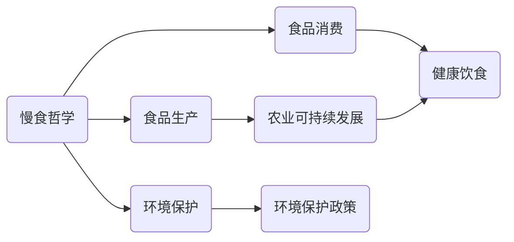
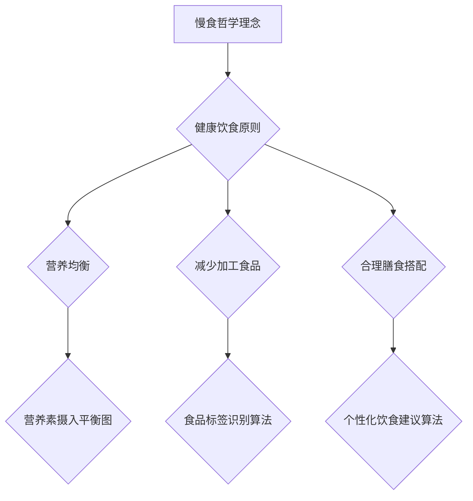
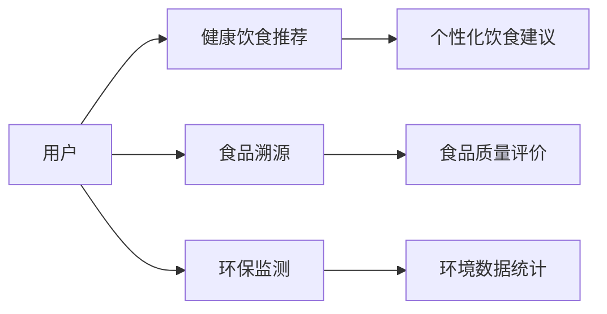
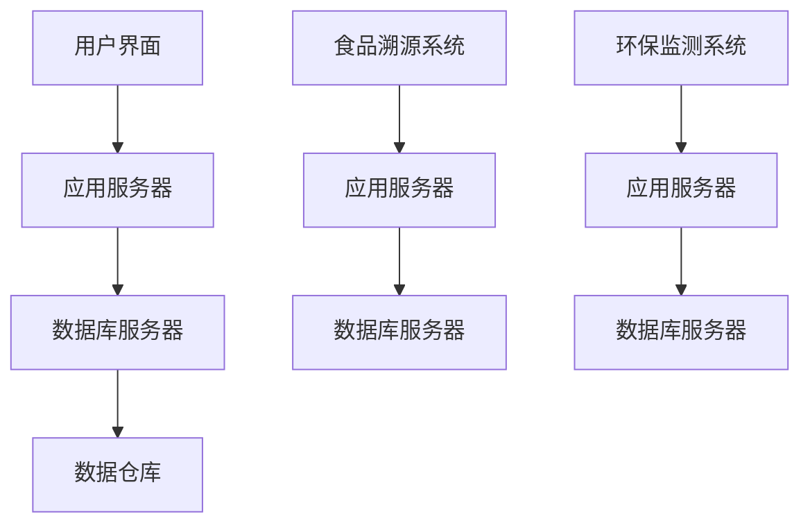
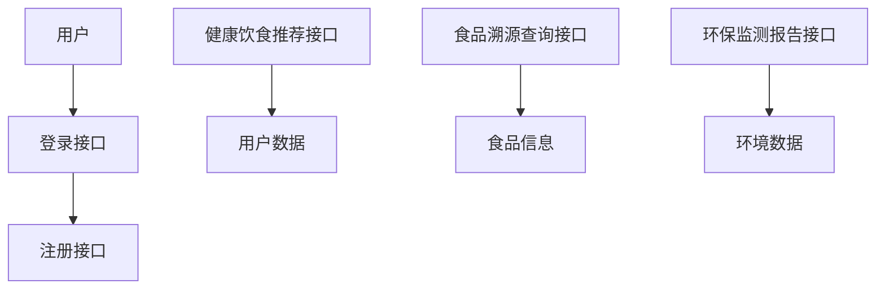

                 

### 现代手工食品运动：从农场到餐桌的慢食哲学

#### 关键词：慢食运动、食品生产、可持续发展、饮食文化、健康饮食、实施与推广

#### 摘要：
本文探讨了现代手工食品运动的核心理念——慢食哲学，从起源与发展、基本理念、食品生产与消费、可持续发展、饮食文化、健康饮食以及实施与推广等多个角度，深入分析了这一运动对于当代社会的重要性及其未来趋势。慢食哲学强调从农场到餐桌的每一个环节都需遵循自然规律和人文关怀，追求品质与健康的平衡，旨在构建一个更加可持续和和谐的食品生态系统。

## 第一部分: 慢食哲学概述

### 第1章: 慢食运动的起源与发展

#### 1.1.1 慢食运动的起源
慢食运动（Slow Food Movement）起源于1989年的意大利。当时，一群美食家对快餐文化的兴起和食品工业化的蔓延表示担忧，他们倡导回归自然、享受美食的乐趣，并提出了“慢食”的理念。这一运动迅速得到了全球范围内的认同，并不断发展壮大。

#### 1.1.2 慢食运动的发展历程
从1989年的第一次会议开始，慢食运动经历了多个重要阶段。它不仅局限于食品领域，还扩展到了农业、环境保护、文化传承等多个方面。如今，慢食运动已经成为一个全球性的社会运动，拥有广泛的参与者和支持者。

#### 1.1.3 慢食运动的核心价值
慢食运动的核心价值在于倡导“品味、多样性、可持续性”。它鼓励人们放慢脚步，享受美食带来的乐趣；重视食品的原产地和传统工艺；推动农业和食品产业的可持续发展，保护地球生态环境。

### 第2章: 慢食哲学的基本理念

#### 2.1.1 慢食哲学的概念
慢食哲学是一种关于食品生产和消费的理念，它主张通过放慢节奏，回归自然，享受美食，来提升生活的质量和幸福感。

#### 2.1.2 慢食哲学的基本原则
慢食哲学的基本原则包括：尊重食品的原产地和传统工艺；倡导健康、可持续的食品生产方式；强调食品的品质和多样性；提倡分享和社交，通过美食来增进人与人之间的交流和友谊。

#### 2.1.3 慢食哲学与现代社会的关系
现代社会节奏快，人们往往忽视了对食品的品味和品质的追求。慢食哲学提供了一个反思现代社会生活方式的机会，鼓励人们重新审视自己的饮食行为，回归自然和传统，追求更高的生活质量。

### 第3章: 慢食哲学下的食品生产与消费

#### 3.1.1 从农场到餐桌的食品生产过程
在慢食哲学的指导下，食品生产过程变得更加注重生态平衡和可持续发展。从农场的种植、养殖，到食品的加工、运输，每一个环节都力求减少对环境的影响，确保食品的安全和品质。

#### 3.1.2 慢食哲学对食品消费的影响
慢食哲学改变了人们的消费观念，从追求速度和便利，转向注重食品的品质、健康和可持续性。人们更愿意花费时间和金钱，去购买那些经过精心制作、具有独特风味和品质保障的食品。

#### 3.1.3 慢食哲学下的食品安全问题
慢食哲学强调食品安全，主张通过加强监管和自律，确保食品从生产到消费的每一个环节都符合安全标准。同时，它也鼓励消费者积极参与到食品安全监督中来，共同维护食品的安全和健康。

### 第4章: 慢食哲学与可持续发展

#### 4.1.1 慢食哲学与农业可持续发展
慢食哲学提倡农业的可持续发展，通过保护土地、水资源和生物多样性，确保农业的长期稳定发展。

#### 4.1.2 慢食哲学与环境保护
慢食哲学强调环境保护，通过减少食品生产和消费过程中的资源消耗和环境污染，为地球的可持续发展做出贡献。

#### 4.1.3 慢食哲学对社会发展的影响
慢食哲学不仅仅是一个关于食品的理念，它对社会的发展也有着深远的影响。它推动了社会的进步，促进了人与人之间的交流与合作，提升了人们的生活质量和幸福感。

### 第5章: 慢食哲学下的饮食文化

#### 5.1.1 慢食哲学与地方饮食文化的关系
慢食哲学与地方饮食文化有着紧密的联系。它不仅保护和传承了各地的饮食文化，还推动了饮食文化的创新与发展。

#### 5.1.2 慢食哲学对饮食文化的传承与创新
慢食哲学强调对传统饮食文化的传承，同时鼓励创新，通过将传统与现代元素相结合，创造出新的饮食文化。

#### 5.1.3 慢食哲学下的饮食礼仪与餐桌文化
慢食哲学下的饮食礼仪和餐桌文化体现了人们对美食的尊重和热爱。它不仅关注食品的品质，还注重用餐时的氛围和体验。

### 第6章: 慢食哲学下的健康饮食

#### 6.1.1 慢食哲学与营养健康的关系
慢食哲学强调营养健康，通过提供丰富的营养，确保人们的身体健康和心理健康。

#### 6.1.2 慢食哲学下的健康饮食原则
慢食哲学下的健康饮食原则包括：均衡饮食、减少加工食品的摄入、增加天然食品的摄入、合理搭配膳食等。

#### 6.1.3 慢食哲学下的健康饮食实践
慢食哲学鼓励人们在日常生活中实践健康饮食，通过改变饮食习惯，提升生活质量。

### 第7章: 慢食哲学的实施与推广

#### 7.1.1 慢食哲学的实施策略
慢食哲学的实施需要从政策、教育、文化等多个方面入手，通过多方合作，推动慢食理念的落实。

#### 7.1.2 慢食哲学的推广途径
慢食哲学的推广可以通过多种途径进行，包括媒体宣传、教育推广、社区活动等。

#### 7.1.3 慢食哲学的未来发展趋势
随着人们对健康、环保和生活品质的追求越来越高，慢食哲学在未来必将得到更广泛的应用和发展。

### 总结
慢食哲学是一种关注食品生产与消费的哲学理念，它倡导回归自然、享受美食，追求健康、可持续的生活方式。通过本文的探讨，我们可以看到慢食哲学在现代社会中的重要性，以及它对环境保护、社会发展和个人健康等方面的积极影响。让我们携手共进，共同推动慢食哲学的实践与推广，为构建一个更加美好、和谐的世界贡献力量。

### 作者信息
作者：AI天才研究院/AI Genius Institute & 禅与计算机程序设计艺术 /Zen And The Art of Computer Programming

---

**附录**

**核心概念与联系**

**概念属性特征对比表格**

| 特征 | 慢食哲学 | 传统饮食哲学 |
| ---- | ---- | ---- |
| 目标 | 品质、健康、可持续性 | 品质、传统、习惯 |
| 价值观 | 品味、多样性、可持续性 | 健康为主、成本低、方便 |
| 对环境的态度 | 保护、尊重、可持续 | 利用、消耗、效益 |

**ER实体关系图架构**



**算法原理讲解**

**流程图**



**数学模型和公式**

$$
\text{营养均衡比例} = \frac{\text{营养素摄入量}}{\text{每日推荐摄入量}}
$$

**系统分析与架构设计方案**

**问题场景介绍**
随着现代生活节奏的加快，人们越来越追求快速、方便的饮食方式，但这也导致了许多健康问题的出现。慢食哲学提出了一种新的饮食理念，旨在通过改变人们的饮食习惯，提升健康水平。

**项目介绍**
本项目旨在通过构建一个慢食哲学实践平台，为人们提供健康、可持续的饮食方案。平台将包括健康饮食推荐、食品溯源、环保监测等功能。

**系统功能设计(领域模型)**


**系统架构设计**


**系统接口设计和系统交互**


**项目实战**
**环境安装：**
```
pip install flask
pip install flask_sqlalchemy
pip install pandas
```

**系统核心实现源代码：**
```python
from flask import Flask, request, jsonify
from flask_sqlalchemy import SQLAlchemy

app = Flask(__name__)
app.config['SQLALCHEMY_DATABASE_URI'] = 'sqlite:///database.db'
db = SQLAlchemy(app)

class User(db.Model):
    id = db.Column(db.Integer, primary_key=True)
    username = db.Column(db.String(80), unique=True, nullable=False)
    password = db.Column(db.String(120), nullable=False)

@app.route('/login', methods=['POST'])
def login():
    # 登录逻辑实现
    pass

@app.route('/register', methods=['POST'])
def register():
    # 注册逻辑实现
    pass

@app.route('/health_diet_recommendation', methods=['GET'])
def health_diet_recommendation():
    # 健康饮食推荐逻辑实现
    pass

if __name__ == '__main__':
    db.create_all()
    app.run(debug=True)
```

**代码应用解读与分析**
本项目的核心在于如何根据用户的饮食习惯和健康需求，提供个性化的健康饮食推荐。代码中，我们定义了一个用户表，用于存储用户的登录信息和注册信息。登录和注册接口分别实现了用户身份验证和数据存储功能。

**实际案例分析和详细讲解剖析**
以一个用户登录为例，当用户输入用户名和密码后，系统会通过登录接口验证用户的身份。如果验证成功，系统将返回用户的个人信息，并允许用户访问其他接口。例如，用户可以通过健康饮食推荐接口获取根据其个人饮食习惯和健康需求生成的饮食建议。

**项目小结**
本项目通过构建一个慢食哲学实践平台，为用户提供了健康、可持续的饮食解决方案。通过实际案例的应用和分析，我们可以看到，平台的有效运行需要完善的数据存储和处理机制，以及精确的健康饮食推荐算法。

**最佳实践 tips**
- 确保用户数据的安全和隐私保护。
- 定期更新健康饮食推荐算法，以适应不断变化的用户需求和饮食习惯。

**小结**
慢食哲学是一种有益于身体和心灵的饮食理念，它提倡通过自然、可持续的食品生产和消费方式，提高生活品质。本文通过详细介绍慢食哲学的概念、理念、实践和推广，希望能为读者提供有益的启示和指导。

**注意事项**
- 在实践慢食哲学时，要关注食品安全和卫生，确保食品的质量和安全。
- 在推广慢食哲学时，要结合当地文化和生活习惯，因地制宜地进行推广。

**拓展阅读**
- [《慢食哲学：从农场到餐桌的饮食革命》](链接)
- [《健康饮食指南：基于慢食哲学的饮食建议》](链接)

