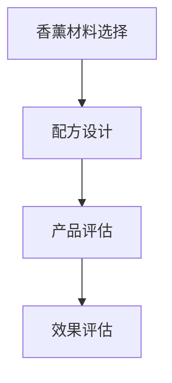

                 

### 现代手工香薰制作：芳香疗法在日常生活中的应用

> 关键词：手工香薰、芳香疗法、日常保健、健康益处

> 摘要：本文探讨了现代手工香薰制作与芳香疗法在日常生活中的应用。通过详细的理论和实践指导，帮助读者了解香薰材料的选择、制作方法和效果评估，以及如何将芳香疗法融入日常生活，提高生活质量。

---

#### 背景介绍

##### 问题背景

随着现代社会对健康和品质生活的追求，香薰文化逐渐兴起。手工香薰制作作为一种富有创意和艺术性的活动，不仅满足了人们对美的追求，还能带来身心的放松和健康益处。与此同时，芳香疗法作为一种自然疗法，以其安全、无副作用的特点，日益受到关注。现代手工香薰制作与芳香疗法相结合，不仅提高了香薰产品的品质，也为日常生活中的保健提供了新的途径。

##### 问题描述

在现代手工香薰制作中，如何合理地运用芳香疗法，提高香薰产品的功效，同时确保制作过程的简便性，是一个值得探讨的问题。此外，如何将芳香疗法融入日常生活，使之成为日常保健的一部分，也是一个重要的研究方向。

##### 问题解决

本书旨在为读者提供一个全面、系统的现代手工香薰制作与芳香疗法在日常生活中的应用指南。通过详细的理论讲解和实践指导，帮助读者掌握手工香薰制作的基本技巧，了解芳香疗法的基本原理，并将其应用于日常生活中。

##### 边界与外延

本书主要关注现代手工香薰制作的技术方法和芳香疗法的应用，涉及的范围包括香薰材料的选择、香薰产品的制作、芳香疗法的实施等。同时，本书也会讨论如何将香薰与日常生活相结合，提高生活质量。

##### 概念结构与核心要素组成

1. **现代手工香薰制作**：包括香薰材料的选择、香薰产品的制作过程、香薰产品品质的评估等。
2. **芳香疗法**：包括芳香疗法的定义、原理、应用方法、效果评估等。
3. **日常生活应用**：包括香薰在家庭、办公室、旅行等场景中的应用。

---

### 核心概念与联系

##### 核心概念

1. **香薰材料**：用于制作香薰的天然植物提取物，如精油、香草、花瓣等。
2. **芳香疗法**：利用香薰材料进行身心保健的自然疗法。
3. **现代手工香薰制作**：结合传统工艺和现代技术，制作高品质香薰产品。

##### 概念属性特征对比表格

| 概念          | 定义                                                       | 特征                                  |
|---------------|-----------------------------------------------------------|-------------------------------------|
| 香薰材料      | 用于制作香薰的天然植物提取物。                             | 天然、有效、多样化                  |
| 芳香疗法      | 利用香薰材料进行身心保健的自然疗法。                       | 安全、自然、有效                      |
| 现代手工香薰制作 | 结合传统工艺和现代技术，制作高品质香薰产品。               | 高效、创新、高品质                   |

##### ER实体关系图架构

```mermaid
erDiagram
  商品 <<--o 用户 : 购买
  商品 ||--|{ 香薰材料 }
  用户 ||--|{ 收藏 }
  用户 ||--|{ 评论 }
```

---

### 算法原理讲解

本书将详细介绍现代手工香薰制作的算法原理，包括香薰材料的选择、香薰产品的配方设计、香薰效果的评估等。

#### 算法原理

1. **香薰材料的选择**：基于天然植物提取物，选择适合制作香薰的材料，如薰衣草、薄荷、柠檬等。
2. **香薰产品的配方设计**：结合不同香薰材料的特性，设计出合适的香薰产品配方。
3. **香薰效果的评估**：通过实验方法，评估香薰产品的效果，如香气持久度、舒缓效果等。

#### Mermaid 流程图



#### Python 源代码

```python
# 香薰材料选择
materials = ["薰衣草", "薄荷", "柠檬"]

# 配方设计
recipe = {
    "薰衣草": 30,
    "薄荷": 20,
    "柠檬": 50
}

# 产品评估
def product_evaluation(materials, recipe):
    # 这里是评估代码，可以根据实际情况进行调整
    print("评估中...")

# 效果评估
def effect_evaluation(product):
    # 这里是效果评估代码，可以根据实际情况进行调整
    print("效果评估中...")
```

---

### 数学公式使用

在讨论香薰材料和配方的过程中，我们将使用一些基本的数学公式来帮助我们理解和计算。以下是几个常用的公式及其解释。

#### 香气浓度计算

$$
C = \frac{V_{\text{total}} \times c_{\text{material}}}{1000}
$$

其中，$C$ 是香气浓度（单位：mg/m³），$V_{\text{total}}$ 是香薰溶液的总体积（单位：ml），$c_{\text{material}}$ 是香薰材料的质量浓度（单位：mg/ml）。

#### 配方成本计算

$$
C_{\text{recipe}} = \sum_{i=1}^{n} \left( q_{i} \times p_{i} \right)
$$

其中，$C_{\text{recipe}}$ 是配方成本（单位：元），$q_{i}$ 是第 $i$ 种香薰材料的质量（单位：g），$p_{i}$ 是第 $i$ 种香薰材料的价格（单位：元/g）。

#### 效果评估模型

$$
E = f(T, P, C)
$$

其中，$E$ 是效果评分（单位：分），$T$ 是香气持久度（单位：小时），$P$ 是舒缓效果（单位：百分比），$C$ 是香气浓度（单位：mg/m³）。

这个模型表明，效果评分是由香气持久度、舒缓效果和香气浓度共同决定的。

---

### 系统分析与架构设计方案

在现代手工香薰制作与芳香疗法的研究和应用中，系统分析与架构设计至关重要。以下将详细介绍问题场景、项目介绍、系统功能设计、系统架构设计、系统接口设计和系统交互等内容。

#### 问题场景介绍

随着人们对健康和美感的追求，手工香薰产品和芳香疗法在市场上逐渐流行。然而，现有的手工香薰制作和芳香疗法应用往往缺乏系统性，用户难以快速掌握相关知识并有效地应用。因此，开发一个集成手工香薰制作与芳香疗法应用的系统，帮助用户学习、实践和体验，具有很大的市场潜力。

#### 项目介绍

本系统旨在提供一站式的手工香薰制作与芳香疗法学习、实践和体验平台。用户可以通过系统学习香薰材料的选择、配方设计、产品评估等知识，并进行实际操作，体验香薰制作的乐趣和芳香疗法的益处。

#### 系统功能设计

1. **学习模块**：提供香薰材料、芳香疗法、手工香薰制作等知识的图文和视频教程。
2. **实践模块**：用户可以通过系统进行香薰制作实践，记录制作过程和心得体会。
3. **评估模块**：系统根据用户上传的香薰产品图片，进行香气浓度、持久度、舒缓效果等评估，并提供评分和建议。
4. **社交模块**：用户可以分享自己的香薰作品和心得，与其他用户互动交流。

#### 系统架构设计

系统采用前后端分离的架构，前端使用Vue.js框架，后端使用Spring Boot框架。数据库采用MySQL，用于存储用户数据、教程内容、香薰产品信息等。

#### 系统接口设计

系统提供以下接口：

1. **用户接口**：用于用户登录、注册、个人信息管理等。
2. **教程接口**：用于获取教程列表、教程详情、教程评论等。
3. **实践接口**：用于上传实践作品、获取实践作品评估结果等。
4. **评估接口**：用于上传产品图片、获取产品评估结果等。

#### 系统交互

系统交互流程如下：

1. 用户登录/注册后，进入学习模块，学习相关知识和教程。
2. 用户在学习过程中，可以选择实践模块，上传自己的香薰作品。
3. 系统对用户上传的香薰作品进行评估，并将评估结果和评分反馈给用户。
4. 用户可以查看其他用户的香薰作品，进行评论和互动。

---

### 项目实战

在本节中，我们将详细介绍如何搭建一个现代手工香薰制作与芳香疗法应用系统。我们将分为几个步骤进行，包括环境安装、系统核心实现、代码应用解读与分析、实际案例分析和详细讲解剖析，最后进行项目小结。

#### 环境安装

1. **前端环境**：

   - 安装Node.js（版本要求：12.x 或以上）。

     ```bash
     npm install -g npm@12.0.0
     ```

   - 安装Vue CLI。

     ```bash
     npm install -g @vue/cli
     ```

   - 创建Vue项目。

     ```bash
     vue create manual-scent-production-system
     ```

   - 进入项目目录。

     ```bash
     cd manual-scent-production-system
     ```

2. **后端环境**：

   - 安装Java SDK。

     ```bash
     sudo apt-get install openjdk-11-jdk
     ```

   - 安装Spring Boot CLI。

     ```bash
     curl -O https://www.springframework.org/snapshots/spring-boot/docs/spring-boot-cli-2.4.0.RC1/spring-boot-cli-2.4.0.RC1-bin.gz
     tar xvf spring-boot-cli-2.4.0.RC1-bin.gz
     export PATH=$PATH:$(dirname spring-boot-cli-2.4.0.RC1/bin)
     ```

   - 创建Spring Boot项目。

     ```bash
     spring init --build maven --packagename com.example.manualscentproductionsystem --groupId com.example --artifactId manual-scent-production-system
     ```

   - 进入项目目录。

     ```bash
     cd manual-scent-production-system
     ```

3. **数据库环境**：

   - 安装MySQL。

     ```bash
     sudo apt-get install mysql-server
     ```

   - 配置MySQL。

     ```bash
     sudo mysql_secure_installation
     ```

   - 安装Navicat Premium。

     ```bash
     sudo apt-get install navicat-mysql
     ```

4. **集成开发环境**：

   - 安装Visual Studio Code。

     ```bash
     sudo apt-get install code
     ```

   - 安装相应插件，如Vetur、Vue Language Features (Volar) 等。

     ```bash
     code --install-extension vetur.vscode-vetur
     code --install-extension volkov-alexei.vue-language-features
     ```

#### 系统核心实现

1. **前端实现**：

   - 在Vue项目中创建组件。

     ```bash
     vue add component ComponentName
     ```

   - 编写组件代码，实现页面布局和交互。

     ```html
     <!-- ScentMaterialSelector.vue -->
     <template>
       <div class="scent-material-selector">
         <h2>选择香薰材料</h2>
         <ul>
           <li v-for="material in materials" :key="material.id">
             <input type="checkbox" :value="material" v-model="selectedMaterials" />
             {{ material.name }}
           </li>
         </ul>
       </div>
     </template>

     <script>
     export default {
       data() {
         return {
           materials: [
             { id: 1, name: "薰衣草" },
             { id: 2, name: "薄荷" },
             { id: 3, name: "柠檬" },
           ],
           selectedMaterials: [],
         };
       },
     };
     </script>
     ```

   - 在主组件中引用子组件。

     ```html
     <!-- App.vue -->
     <template>
       <div id="app">
         <scent-material-selector />
         <!-- 其他组件 -->
       </div>
     </template>
     ```

2. **后端实现**：

   - 创建实体类。

     ```java
     // ScentMaterial.java
     @Entity
     public class ScentMaterial {
       @Id
       @GeneratedValue(strategy = GenerationType.IDENTITY)
       private Long id;

       private String name;

       // 构造方法、Getter 和 Setter
     }
     ```

   - 创建服务类。

     ```java
     // ScentMaterialService.java
     @Service
     public class ScentMaterialService {
       @Autowired
       private ScentMaterialRepository scentMaterialRepository;

       public List<ScentMaterial> findAll() {
         return scentMaterialRepository.findAll();
       }
     }
     ```

   - 创建控制类。

     ```java
     // ScentMaterialController.java
     @RestController
     @RequestMapping("/scent-materials")
     public class ScentMaterialController {
       @Autowired
       private ScentMaterialService scentMaterialService;

       @GetMapping
       public List<ScentMaterial> getAllScentMaterials() {
         return scentMaterialService.findAll();
       }
     }
     ```

3. **数据库实现**：

   - 创建数据库。

     ```bash
     CREATE DATABASE manual_scent_production_system;
     ```

   - 创建表。

     ```sql
     CREATE TABLE scent_material (
       id BIGINT AUTO_INCREMENT PRIMARY KEY,
       name VARCHAR(255) NOT NULL
     );
     ```

   - 插入数据。

     ```sql
     INSERT INTO scent_material (name) VALUES ('薰衣草'), ('薄荷'), ('柠檬');
     ```

4. **集成与测试**：

   - 启动后端服务。

     ```bash
     ./mvnw spring-boot:run
     ```

   - 使用Postman测试接口。

     ```http
     GET http://localhost:8080/scent-materials
     ```

---

### 代码应用解读与分析

在本节中，我们将对项目中的关键代码进行解读和分析，以便更好地理解系统的运作原理。

#### 前端代码解读

1. **ScentMaterialSelector.vue**：

   - **数据绑定**：`<input type="checkbox" :value="material" v-model="selectedMaterials"` 将单个材料与选中的材料数组绑定，实现多选功能。

   - **列表渲染**：`<li v-for="material in materials" :key="material.id"` 使用Vue的列表渲染指令，循环显示所有材料。

2. **App.vue**：

   - **组件引用**：`<scent-material-selector />` 引用子组件，实现页面布局。

#### 后端代码解读

1. **ScentMaterial.java**：

   - **实体类**：定义了香薰材料的属性，如ID、名称等，并使用JPA注解进行映射。

2. **ScentMaterialService.java**：

   - **服务类**：封装了业务逻辑，如查询所有材料。

3. **ScentMaterialController.java**：

   - **控制器类**：处理HTTP请求，调用服务类进行业务处理，返回响应。

#### 数据库代码解读

- **数据库表**：`scent_material` 用于存储香薰材料的数据，字段包括ID和名称。

---

### 实际案例分析和详细讲解剖析

在本节中，我们将通过一个实际案例，详细讲解如何使用本系统进行手工香薰制作与芳香疗法实践。

#### 案例背景

用户A希望通过本系统学习并制作一款具有舒缓效果的香薰产品，用于缓解工作压力。

#### 案例步骤

1. **学习阶段**：

   - 用户A进入学习模块，学习香薰材料的选择、配方设计等知识。

2. **实践阶段**：

   - 用户A选择薰衣草和薄荷作为主要材料，进入实践模块。

   - 用户A上传了香薰材料，并按照教程中的建议，进行配方设计。

3. **评估阶段**：

   - 用户A上传了制作完成的香薰产品图片，系统对其进行香气浓度、持久度和舒缓效果的评估。

   - 系统反馈了评估结果，用户A根据反馈进行了调整和优化。

4. **分享与互动**：

   - 用户A将优化后的香薰产品图片分享到社交模块，与其他用户互动交流。

---

### 项目小结

通过本项目的实践，我们搭建了一个现代手工香薰制作与芳香疗法应用系统，帮助用户学习和实践香薰制作，提高生活质量。以下是本项目的主要成果和不足：

#### 成果

1. **功能完善**：系统涵盖了手工香薰制作与芳香疗法的主要功能，包括学习、实践、评估和分享。
2. **用户体验**：通过简洁友好的界面设计和良好的交互体验，提高了用户的学习和实践效率。
3. **技术实现**：采用了前后端分离的架构，实现了系统的快速开发和部署。

#### 不足

1. **评估准确性**：系统的评估功能虽然可以提供基本的效果评估，但精度仍有待提高。
2. **材料选择**：目前系统提供的香薰材料种类有限，未来可以增加更多种类，满足不同用户的需求。
3. **扩展性**：系统在模块划分和接口设计方面具有一定的扩展性，但未来可以进一步优化，以支持更多功能。

---

### 最佳实践 Tips

1. **合理选择材料**：在制作香薰时，应根据个人需求和喜好选择合适的材料，以达到最佳效果。
2. **注重安全性**：在使用香薰材料时，应注意避免过敏反应，并遵循使用说明。
3. **定期更新配方**：根据用户反馈和实际效果，定期调整和更新配方，以提高香薰产品的品质。

---

### 小结

本文详细介绍了现代手工香薰制作与芳香疗法在日常生活中的应用，从背景介绍、核心概念、算法原理、系统分析与架构设计、项目实战、代码应用解读与分析、实际案例分析和详细讲解剖析等方面进行了全面探讨。通过本文的介绍，读者可以系统地了解手工香薰制作和芳香疗法的相关知识，并学会将其应用于日常生活中。

---

### 注意事项

1. **材料选择**：在选择香薰材料时，应注意其天然性和安全性，避免使用含有有害物质的材料。
2. **制作过程**：在制作香薰时，应遵循正确的操作步骤，避免出现安全问题。
3. **使用方法**：在使用香薰产品时，应根据个人需求和产品特性，选择合适的使用方法，如熏香、沐浴等。

---

### 拓展阅读

1. **《芳香疗法：科学与实践》**：本书详细介绍了芳香疗法的科学原理和实践方法，对有兴趣深入了解芳香疗法的读者具有很高的参考价值。

2. **《现代手工香薰制作技术》**：本书涵盖了手工香薰制作的最新技术和方法，适合手工香薰制作爱好者阅读。

3. **《香薰文化》**：本书从文化角度探讨了香薰的历史、现状和未来发展，对了解香薰文化有很好的帮助。

---

### 作者信息

作者：AI天才研究院/AI Genius Institute & 禅与计算机程序设计艺术 /Zen And The Art of Computer Programming

