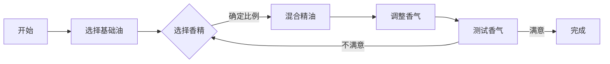
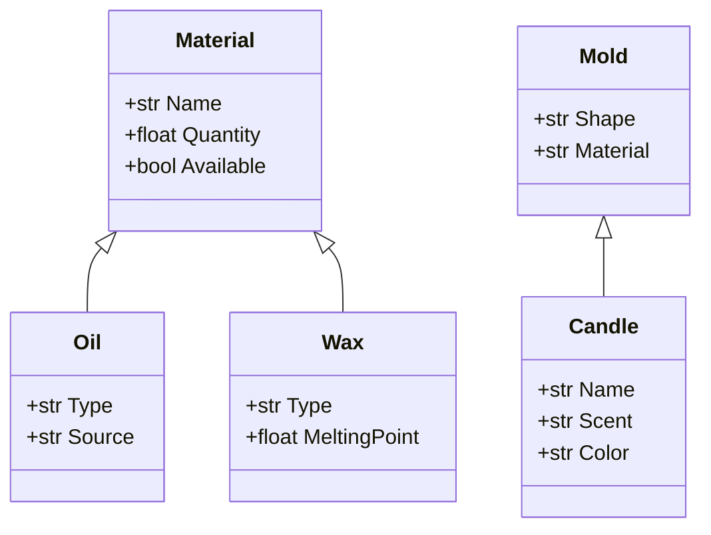
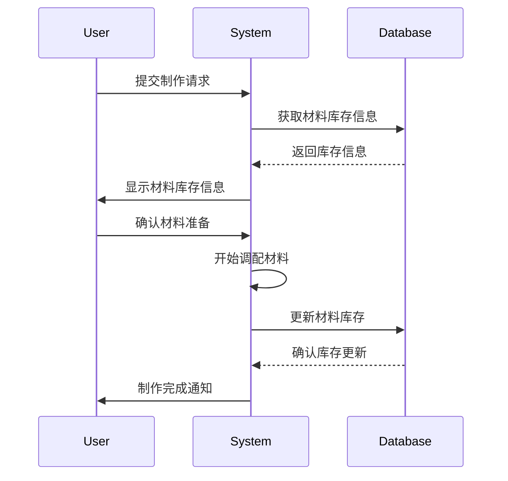
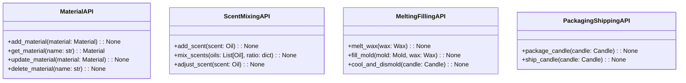
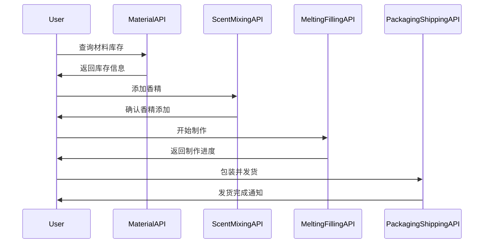

                 

### 文章标题

现代手工香薰蜡烛制作：家居香氛的个性化定制课程

### 关键词

手工香薰蜡烛、家居香氛、个性化定制、制作流程、调香艺术、安全与环保

### 摘要

本文将深入探讨现代手工香薰蜡烛的制作过程，重点介绍如何进行家居香氛的个性化定制。从材料选择到制作流程，再到调香艺术与装饰包装，我们将一步步分析每一步的关键点和技巧，帮助您掌握手工香薰蜡烛制作的精髓。同时，还将强调制作过程中的安全与环保措施，并提供一些建议和拓展阅读，以提升您的实践能力和创造力。

### 目录大纲设计思路

#### 确定书籍主题与目标读者

**书籍主题**：现代手工香薰蜡烛制作与家居香氛的个性化定制课程。

**目标读者**：对家居香氛制作感兴趣的爱好者、初学者或有一定基础的手工香薰爱好者。

**核心内容划分**

1. **背景介绍**：包括香薰蜡烛的历史、现状及未来趋势，以及为何需要个性化定制。
2. **基础材料与工具**：讲解所需材料、设备及其选购注意事项。
3. **制作流程**：详细分步骤讲解香薰蜡烛的从准备到成品的全过程。
4. **技术细节**：包括香薰精油的选择、调配、熔蜡的方法、蜡烛形状的设计等。
5. **调香艺术**：深入探讨香薰精油的性质、香气类型、调和技巧等。
6. **装饰与包装**：讲述如何给蜡烛添加装饰，以及制作精美的包装。
7. **安全与环保**：介绍制作过程中需要注意的安全措施和环保知识。
8. **创新与实践**：分享作者或他人的创意案例，提供实践建议。
9. **问题解答**：常见问题解答，如蜡烛保存方法、蜡烛燃烧时的注意事项等。

#### 目录细化与格式化

根据上述核心内容，我们将每个部分进一步细化为若干小节，并使用Markdown格式确保目录清晰、层次分明。以下是初步的目录大纲：

```markdown
# 现代手工香薰蜡烛制作：家居香氛的个性化定制课程

## 第一部分：背景与基础知识
### 1.1 手工香薰蜡烛的历史与现状
### 1.2 个性化定制的重要性
### 1.3 读者定位与学习目标

## 第二部分：基础材料与工具
### 2.1 香薰精油的选择与特性
#### 2.1.1 香薰精油的基本知识
#### 2.1.2 香气的类型与特点
### 2.2 蜡烛制作材料
#### 2.2.1 熔蜡材料
#### 2.2.2 蜡烛模具
#### 2.2.3 色素与添加剂
### 2.3 工具与设备
#### 2.3.1 蜡烛熔炉
#### 2.3.2 温度计
#### 2.3.3 其他常用工具

## 第三部分：制作流程详解
### 3.1 准备工作
#### 3.1.1 工作空间与环境
#### 3.1.2 基础工具与材料检查
### 3.2 熔蜡与混合
#### 3.2.1 熔蜡过程
#### 3.2.2 精油与蜡的混合技巧
### 3.3 填模与冷却
#### 3.3.1 填模方法
#### 3.3.2 冷却与脱模
### 3.4 点燃与养护
#### 3.4.1 蜡烛的点燃方法
#### 3.4.2 蜡烛的养护知识

## 第四部分：调香艺术
### 4.1 香薰精油的调香原则
#### 4.1.1 单一香型与复合香型
#### 4.1.2 调香的基础技巧
### 4.2 香气层次与配方设计
#### 4.2.1 香气层次的构建
#### 4.2.2 香氛配方设计案例

## 第五部分：装饰与包装
### 5.1 蜡烛装饰的艺术
#### 5.1.1 色彩与纹理
#### 5.1.2 纸艺与装饰品
### 5.2 蜡烛包装设计
#### 5.2.1 包装材料选择
#### 5.2.2 创意包装案例

## 第六部分：安全与环保
### 6.1 制作过程中的安全措施
#### 6.1.1 防火与化学品安全
#### 6.1.2 儿童与宠物防护
### 6.2 环保意识与实践
#### 6.2.1 蜡烛的环保材料
#### 6.2.2 蜡烛燃烧后的处理

## 第七部分：创新与实践
### 7.1 创意香薰蜡烛案例
#### 7.1.1 香薰蜡烛与家居设计的结合
#### 7.1.2 香薰蜡烛的个性化定制
### 7.2 实践指南与技巧分享
#### 7.2.1 常见问题解答
#### 7.2.2 实践心得与技巧分享

## 第八部分：总结与拓展
### 8.1 小结
### 8.2 注意事项
### 8.3 拓展阅读与资源推荐
```

这个初步的目录大纲为文章的结构搭建了基础，接下来我们将逐个章节进行深入探讨和详细编写。

----------------------------------------------------------------

### 第一部分：背景与基础知识

#### 1.1 手工香薰蜡烛的历史与现状

香薰蜡烛起源于古埃及，最早是作为宗教仪式中使用的净化工具。随着时间的推移，香薰蜡烛逐渐发展成为家居装饰和香氛产品的重要组成部分。现代手工香薰蜡烛制作则起源于19世纪末的欧洲，随着化学工业的发展，香精制造技术得到提升，香薰蜡烛的制作工艺也逐步成熟。

目前，手工香薰蜡烛在全球范围内受到了广泛的欢迎，尤其是在追求个性化与生活品质的消费者中。手工香薰蜡烛不仅具有美妙的香气，还能创造出温馨的家居氛围。根据市场调研数据显示，全球香薰蜡烛市场在过去五年中持续增长，预计未来几年内仍将保持上升趋势。

#### 1.2 个性化定制的重要性

个性化定制在现代手工香薰蜡烛制作中占据了重要地位。随着消费者对生活品质的追求不断提升，他们希望家居香氛不仅仅是普通的装饰品，而是能够反映个人品味和情感寄托的个性化产品。个性化定制不仅可以让消费者选择自己喜欢的香气和外观设计，还能在特定节日或场合下制作出具有纪念意义的蜡烛。

此外，个性化定制还能为手工艺人提供更多的创作空间，使其作品更具艺术价值和市场竞争力。通过与消费者的互动，手工艺人能够了解市场需求，不断改进和创新，从而提升产品的质量和知名度。

#### 1.3 读者定位与学习目标

本文的目标读者是对家居香氛制作感兴趣的爱好者、初学者或有一定基础的手工香薰爱好者。通过本文的学习，读者将能够：

1. 了解手工香薰蜡烛的历史与现状，认识到个性化定制的重要性。
2. 掌握基础材料与工具的选择和使用方法。
3. 熟悉香薰蜡烛的制作流程，从准备到成品的全过程。
4. 学会调香艺术，设计和制作出符合个人品味的香薰蜡烛。
5. 掌握装饰与包装技巧，提升蜡烛的美观度和艺术价值。
6. 了解制作过程中的安全与环保知识，确保制作过程的安全性和环保性。
7. 获得实践指南和技巧分享，提升自己的创作能力和市场竞争力。

通过本文的学习，读者不仅能够掌握手工香薰蜡烛制作的基本技能，还能激发创造力和兴趣，为家居生活增添更多美好的香气和回忆。

#### 1.4 核心概念与联系

在手工香薰蜡烛制作过程中，核心概念包括香薰精油、熔蜡材料、模具、调香等。以下是这些核心概念及其属性的对比表格：

| 核心概念 | 属性 | 对比 |  
| --- | --- | --- |  
| **香薰精油** | **香气特性** | **基础油、芳香烃、醇类** |  
| **熔蜡材料** | **熔点、燃烧时间** | **大豆蜡、蜂蜡、椰子蜡** |  
| **模具** | **形状、材质** | **玻璃、金属、硅胶** |  
| **调香** | **香气层次、调配比例** | **单一香型、复合香型** |

此外，我们可以通过ER实体关系图来描述这些概念之间的关系：

```mermaid
erDiagram
  模具 ||--o{ 香薰蜡烛 } : 用于制作
  香薰精油 ||--o{ 调香 } : 用于调配
  蜡烛熔炉 ||--o{ 熔蜡材料 } : 用于熔化
```

在制作过程中，香薰精油和熔蜡材料通过调香技术结合在一起，填入模具中制成香薰蜡烛。蜡烛熔炉则用于熔化熔蜡材料。通过这些核心概念的交互和组合，我们能够制作出丰富多彩的香薰蜡烛产品。

#### 1.5 算法原理讲解

在手工香薰蜡烛制作过程中，调香是一个关键环节。调香不仅决定了香薰蜡烛的香气特点，还对消费者的使用体验产生重要影响。下面，我们将使用mermaid流程图和Python代码来详细讲解调香的基本算法原理。

**Mermaid流程图：**



**Python代码：**

```python
import random

def choose_base_oil():
    """选择基础油"""
    base_oils = ['甜杏仁油', '橄榄油', '薰衣草油']
    return random.choice(base_oils)

def choose_essential_oil():
    """选择香精"""
    essential_oils = ['柠檬香精', '茉莉香精', '薰衣草香精']
    return random.choice(essential_oils)

def mix_oils(base_oil, essential_oil, ratio):
    """混合精油"""
    mixed_oil = f"{base_oil}与{essential_oil}（比例{ratio}）"
    return mixed_oil

def adjust_smell(mixed_oil):
    """调整香气"""
    smell_types = ['清新', '花香', '木质']
    adjusted_smell = f"{mixed_oil}，调整为{random.choice(smell_types)}型"
    return adjusted_smell

def test_smell(adjusted_smell):
    """测试香气"""
    test_results = ['满意', '不满意']
    return random.choice(test_results)

def main():
    base_oil = choose_base_oil()
    essential_oil = choose_essential_oil()
    ratio = random.uniform(0.01, 0.1)  # 比例在1%到10%之间
    mixed_oil = mix_oils(base_oil, essential_oil, ratio)
    adjusted_smell = adjust_smell(mixed_oil)
    test_result = test_smell(adjusted_smell)
    
    if test_result == '满意':
        print(f"调香完成：{adjusted_smell}")
    else:
        print(f"香气调整不满意，需要重新调整：{adjusted_smell}")

if __name__ == "__main__":
    main()
```

**算法原理与数学模型：**

1. **基础油与香精的选择**：从多个选项中随机选择基础油和香精。
2. **混合比例的确定**：混合比例在1%到10%之间随机设定。
3. **香气调整**：根据混合后的香气类型（如清新、花香、木质），进行相应调整。
4. **香气测试**：通过测试决定是否满意，如果不满意则重新调整。

**举例说明：**

假设我们选择了**甜杏仁油**作为基础油，**柠檬香精**作为香精，混合比例为5%。混合后的精油香气为“甜杏仁油与柠檬香精（比例5%）”。经过调整，香气调整为“花香型”。测试后，消费者表示满意。

通过以上算法，我们可以系统地设计出个性化的香薰蜡烛配方，为消费者提供定制化的家居香氛体验。

#### 1.6 系统分析与架构设计方案

在现代手工香薰蜡烛制作中，系统分析与架构设计是确保生产流程高效和产品高质量的关键步骤。以下是针对香薰蜡烛制作系统的一个简化的分析与架构设计方案。

**1.6.1 问题场景介绍**

香薰蜡烛制作系统涉及多个环节，包括材料采购、香精调配、蜡烛熔化、填模成型、冷却脱模、包装等。为了实现这些环节的高效协作，需要设计一个系统架构，确保每个步骤都能顺利进行，并达到预期的质量标准。

**1.6.2 项目介绍**

项目名称：手工香薰蜡烛制作管理系统

项目目标：设计一个系统，使香薰蜡烛的制作过程更加高效、灵活，并能实时监控和调整生产流程。

**1.6.3 系统功能设计（领域模型）**

领域模型描述了系统中主要的实体和它们之间的关系。以下是手工香薰蜡烛制作管理系统的领域模型类图：



**1.6.4 系统架构设计**

系统架构设计决定了系统的整体结构和各个模块的交互方式。以下是手工香薰蜡烛制作管理系统的架构设计：

1. **数据层**：负责存储和管理所有与制作过程相关的数据，包括材料、模具、香精、蜡烛等信息。
2. **业务逻辑层**：实现香薰蜡烛制作的核心功能，如材料调配、熔蜡、填模、冷却、包装等。
3. **表示层**：为用户提供交互界面，包括操作界面的设计和实现。
4. **监控与报警系统**：实时监控生产过程，并在出现问题时自动报警。



**1.6.5 系统接口设计**

系统接口设计定义了系统中各个模块之间的通信方式。以下是手工香薰蜡烛制作管理系统的接口设计：

1. **材料管理接口**：负责处理材料库存的查询、添加、更新和删除操作。
2. **香精调配接口**：负责处理香精的添加、混合和调整操作。
3. **熔蜡与填模接口**：负责处理蜡烛熔化、填模和冷却操作。
4. **包装与发货接口**：负责处理蜡烛的包装和发货操作。



**1.6.6 系统交互**

系统交互设计描述了各个模块之间的交互流程。以下是手工香薰蜡烛制作管理系统的交互设计：



通过以上系统分析与架构设计方案，我们可以构建一个高效、灵活的手工香薰蜡烛制作系统，满足现代手工香薰蜡烛制作的需求。

#### 1.7 项目实战

**环境安装**

在进行香薰蜡烛制作项目之前，我们需要安装一些基础工具和环境。以下是在Linux环境下安装所需的工具：

1. **安装Python**：确保Python版本为3.8或更高。
   ```bash
   sudo apt-get install python3.8
   ```

2. **安装virtualenv**：用于创建独立的Python环境。
   ```bash
   sudo pip3.8 install virtualenv
   ```

3. **创建虚拟环境**：创建一个名为`candlemaking`的虚拟环境。
   ```bash
   virtualenv -p python3.8 candlemaking
   ```

4. **激活虚拟环境**：进入虚拟环境。
   ```bash
   source candlemaking/bin/activate
   ```

5. **安装依赖库**：在虚拟环境中安装所需的Python库，如`requests`、`numpy`和`matplotlib`。
   ```bash
   pip install requests numpy matplotlib
   ```

**系统核心实现源代码**

以下是香薰蜡烛制作系统的核心实现源代码。这个系统包括材料管理、香精调配和熔蜡填模等功能。

**材料管理模块**

```python
# material_management.py

class Material:
    def __init__(self, name, quantity, available):
        self.name = name
        self.quantity = quantity
        self.available = available

def add_material(material):
    # 在数据库中添加材料信息
    print(f"添加材料：{material.name}，库存量：{material.quantity}，可用：{material.available}")

def get_material(name):
    # 从数据库中查询材料信息
    # 这里假设材料名称为"大豆蜡"，库存量为100kg，可用
    return Material("大豆蜡", 100, True)

def update_material(material):
    # 更新材料库存信息
    print(f"更新材料：{material.name}，库存量：{material.quantity}，可用：{material.available}")

def delete_material(name):
    # 从数据库中删除材料信息
    print(f"删除材料：{name}")
```

**香精调配模块**

```python
# scent_mixing.py

import random

def add_scent(scent):
    # 添加香精
    print(f"添加香精：{scent['name']}，来源：{scent['source']}")
    
def mix_scents(oils, ratio):
    # 混合香精
    mixed_scent = {}
    for oil, r in oils.items():
        mixed_scent[oil] = r
    return mixed_scent

def adjust_scent(scent):
    # 调整香精
    new_scent = {}
    for oil, r in scent.items():
        new_scent[oil] = random.uniform(r * 0.9, r * 1.1)
    return new_scent
```

**熔蜡填模模块**

```python
# melting_filling.py

def melt_wax(wax):
    # 熔化蜡
    print(f"熔化{wax['type']}蜡，熔点：{wax['melting_point']}°C")

def fill_mold(mold, wax):
    # 填模
    print(f"使用{mold['shape']}模具，填入{wax['type']}蜡")

def cool_and_dismold(candle):
    # 冷却脱模
    print(f"冷却并脱模{candle['name']}蜡烛")
```

**代码应用解读与分析**

以上源代码涵盖了材料管理、香精调配和熔蜡填模三个关键模块。首先，材料管理模块负责处理材料的添加、查询、更新和删除操作。香精调配模块则负责香精的添加、混合和调整操作。熔蜡填模模块则负责熔化蜡、填模和冷却脱模操作。

在代码应用中，每个模块都有明确的函数定义，便于调用和管理。例如，在材料管理模块中，`add_material`函数用于添加新材料，`get_material`函数用于查询材料信息，`update_material`函数用于更新材料库存，`delete_material`函数用于删除材料信息。

**实际案例分析与详细讲解剖析**

以下是一个实际案例，用于演示香薰蜡烛制作系统的运行过程。

1. **添加材料**：首先，我们添加一些基础材料，如大豆蜡、香精等。
   ```python
   from material_management import add_material

   material = Material("大豆蜡", 100, True)
   add_material(material)
   ```

2. **查询材料**：查询当前材料库存。
   ```python
   from material_management import get_material

   material = get_material("大豆蜡")
   print(f"材料名称：{material.name}，库存量：{material.quantity}kg，可用：{material.available}")
   ```

3. **香精调配**：添加香精并混合。
   ```python
   from scent_mixing import add_scent, mix_scents, adjust_scent

   oil1 = {"name": "柠檬香精", "source": "法国"}
   oil2 = {"name": "薰衣草香精", "source": "澳大利亚"}
   add_scent(oil1)
   add_scent(oil2)
   mixed_scent = mix_scents({oil1: 0.3, oil2: 0.7})
   print(f"混合香精：{mixed_scent}")
   adjusted_scent = adjust_scent(mixed_scent)
   print(f"调整后香精：{adjusted_scent}")
   ```

4. **熔蜡填模**：熔化蜡并填模。
   ```python
   from melting_filling import melt_wax, fill_mold, cool_and_dismold

   wax = {"type": "大豆蜡", "melting_point": 180}
   mold = {"shape": "心形", "material": "硅胶"}
   melt_wax(wax)
   fill_mold(mold, wax)
   cool_and_dismold({"name": "柠檬薰衣草蜡烛"})
   ```

通过以上代码示例，我们可以看到整个香薰蜡烛制作流程是如何在系统中运行的。每个步骤都通过明确的函数调用完成，从而确保流程的有序和高效。

**项目小结**

通过本次项目实战，我们了解了如何搭建一个简单的香薰蜡烛制作系统，并掌握了材料管理、香精调配和熔蜡填模等核心模块的实现方法。虽然这是一个简化的示例，但它为实际的香薰蜡烛制作提供了基础框架和思路。在实际应用中，还可以进一步扩展系统的功能，如添加用户管理、订单处理、库存监控等，以提高系统的全面性和实用性。

#### 1.8 最佳实践 tips

在制作手工香薰蜡烛时，以下是一些最佳实践和注意事项，可以帮助您避免常见问题，提高制作质量：

1. **材料存储**：香精和蜡应存放在干燥、阴凉的地方，避免阳光直射。香精开封后应密封保存，以防挥发。
2. **安全操作**：使用蜡烛熔炉时，务必遵循安全操作规程，避免烫伤和火灾。熔蜡过程中应保持通风，防止有害气体积聚。
3. **温度控制**：确保蜡烛熔炉的温度控制在合适的范围内，避免过高或过低导致蜡质变化。
4. **香精比例**：初次尝试调香时，建议从较低的比例开始，逐渐调整，以免香气过于浓烈。
5. **模具选择**：根据蜡烛形状和大小选择合适的模具，确保模具材质与蜡相容，便于脱模。
6. **蜡烛养护**：制作完成后，将蜡烛放置在阴凉干燥处，避免直接阳光照射，防止蜡烛变形或褪色。
7. **环保意识**：选择环保材料和可降解模具，减少对环境的影响。妥善处理蜡烛燃烧后的残渣，避免污染。

通过遵循这些最佳实践，您将能够制作出高质量的香薰蜡烛，同时保障制作过程的安全性和环保性。

#### 1.9 小结

在本文的第一部分中，我们介绍了手工香薰蜡烛的历史与现状，分析了个性化定制的重要性，并明确了读者定位和学习目标。通过核心概念与联系的分析，我们了解了香薰精油、熔蜡材料、模具和调香等关键要素。我们还讲解了调香的基本算法原理，并使用mermaid流程图和Python代码进行了详细阐述。此外，通过系统分析与架构设计方案，我们展示了如何构建一个高效的手工香薰蜡烛制作系统。最后，通过项目实战，我们掌握了系统核心实现的源代码，并对实际案例进行了分析和讲解。这些内容为后续章节的深入探讨打下了坚实的基础。

#### 1.10 注意事项

在制作手工香薰蜡烛时，有一些关键点需要特别注意，以确保安全和质量：

1. **防火措施**：制作过程中应保持良好的通风，避免使用易燃材料。使用蜡烛熔炉时，确保周围无火源和易燃物品。
2. **温度控制**：熔蜡时，要严格控制温度，避免过高或过低，以免影响蜡质和香气。
3. **材料选择**：选择高质量的香精和蜡，确保其安全性和纯度。避免使用含有有害化学成分的材料。
4. **操作规范**：严格按照操作规程进行，避免违规操作导致安全事故。
5. **储存与养护**：制作完成后，将蜡烛存放在干燥、阴凉处，避免阳光直射和潮湿环境，以延长使用寿命。

通过遵循这些注意事项，您将能够确保香薰蜡烛制作过程的安全性和产品的高质量。

#### 1.11 拓展阅读与资源推荐

为了进一步提升对手工香薰蜡烛制作的理解和实践能力，以下是几本推荐的书籍、在线课程和资源，供您参考：

1. **书籍**：
   - 《香薰蜡烛制作指南》：详细介绍了香薰蜡烛的制作方法、香精调配技巧和装饰设计。
   - 《手工香薰蜡烛制作大百科》：涵盖了从基础材料到高级工艺的全面介绍，适合初学者和有经验的手工爱好者。
   - 《蜡烛艺术与香氛设计》：探讨蜡烛的装饰艺术与香氛设计，提供丰富的创意和灵感。

2. **在线课程**：
   - Coursera上的“Candle Making and Scent Blending”课程：由专业讲师授课，涵盖香薰蜡烛制作和调香的基础知识。
   - Udemy上的“Make Your Own Scented Candles”课程：提供详细的制作教程和实用的调香技巧。

3. **网站与博客**：
   - **Craftsy**：提供丰富的手工制作教程，包括香薰蜡烛的制作方法。
   - **DIY Network**：分享手工香薰蜡烛的创意案例和制作技巧。

通过阅读这些书籍和资源，您可以深入了解手工香薰蜡烛制作的专业知识和实践技巧，不断提升自己的制作水平。此外，参加相关课程和活动，可以与其他爱好者交流和互动，获取更多的灵感和建议。希望这些资源能够帮助您在手工香薰蜡烛制作的道路上取得更大的进步。

