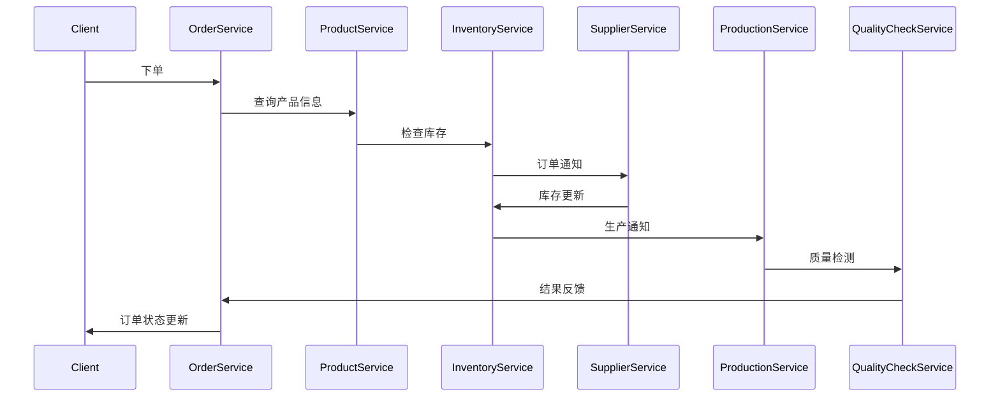
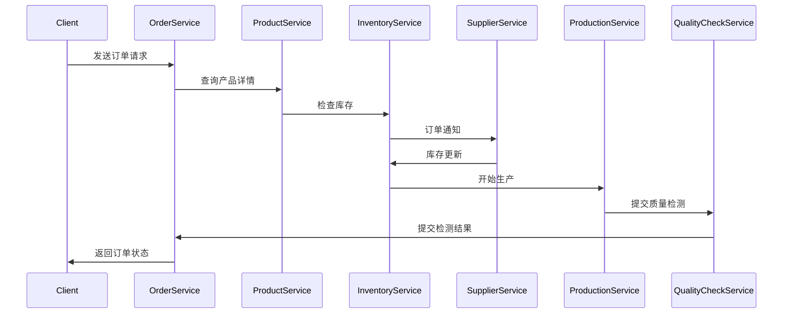

                 

# 现代手工香薰蜡烛：家居香氛的个性化定制

## 关键词

- 手工香薰蜡烛
- 个性化定制
- 家居香氛
- 蜡烛制作工艺
- 香料调配
- 市场趋势

## 摘要

随着现代家居装饰和香氛文化的普及，手工香薰蜡烛以其独特的艺术性和个性化定制成为家居香氛市场的新宠。本文旨在深入探讨手工香薰蜡烛的制作过程和个性化定制方法，帮助读者了解这一新兴领域的技术原理和商业机会。通过详细分析材料选择、制作工艺、设计理念和市场营销策略，本文旨在为有意进军手工香薰蜡烛行业的读者提供实用的指导和启示。

## 背景介绍：问题背景、问题描述、问题解决、边界与外延、概念结构与核心要素组成

### 问题背景

香薰蜡烛作为一种传统的家居装饰和香氛产品，自古以来就受到了人们的喜爱。随着社会经济的发展和人们生活水平的提高，对于家居环境的美学需求和健康意识不断增强，香薰蜡烛市场也经历了从传统到现代的转型升级。现代香薰蜡烛不仅保留了传统蜡烛的温暖和温馨，还融入了更多的艺术性和个性化元素，成为了一种独特的家居艺术品。

### 问题描述

尽管现代香薰蜡烛市场前景广阔，但传统的香薰蜡烛已经难以满足消费者日益增长的个性化需求。消费者不仅追求香薰蜡烛的香味和品质，更希望它能够与自己的家居风格和个性相匹配。这就对香薰蜡烛的生产和设计提出了更高的要求：

1. **个性化设计**：消费者希望香薰蜡烛能够具备独特的造型和外观设计，以凸显个性和品味。
2. **多样性**：消费者对香薰蜡烛的香味和材料有了更多的选择，希望满足不同场合和需求。
3. **制作工艺**：现代香薰蜡烛的制作需要更加精细和多样化的工艺，以满足消费者的多样化需求。

### 问题解决

为了解决上述问题，本文提出了以下解决方案：

1. **全面介绍手工香薰蜡烛的基本原理和材料**：包括蜡烛油、香精、蜡芯、模具等，帮助读者了解制作香薰蜡烛的基础知识。
2. **详细讲解手工香薰蜡烛的制作工艺**：从蜡烛的制作流程、注意事项到制作技巧，为读者提供实用的操作指南。
3. **探讨个性化定制的方法**：如何根据消费者的需求，进行香薰蜡烛的创意设计，包括外观设计、香味设计和形状定制等。
4. **分析市场趋势和商业机会**：通过市场分析，帮助读者了解手工香薰蜡烛在市场上的发展动态和消费者偏好，从而制定有效的市场营销策略。

### 边界与外延

本文主要讨论的是现代手工香薰蜡烛的制作和个性化定制，具体涵盖以下内容：

- **技术层面**：涉及蜡烛制作所需的材料、工具和工艺。
- **设计层面**：包括香薰蜡烛的外观设计、造型设计和香味设计。
- **商业层面**：涵盖市场分析、营销策略和商业运作。

### 概念结构与核心要素组成

1. **核心概念**：

   - **手工香薰蜡烛**：一种通过手工技艺制作的艺术品，具有独特的个性和香味。
   - **个性化定制**：根据消费者需求进行香薰蜡烛的设计和制作。
   - **市场趋势**：手工香薰蜡烛在市场上的发展动态和消费者偏好。

2. **核心要素**：

   - **材料**：蜡烛油、香精、蜡芯、模具等。
   - **工具**：蜡烛切割刀、温度计、调色板、烛台等。
   - **工艺**：蜡烛的熔化、搅拌、倒入模具、冷却等步骤。
   - **设计**：外观设计、香味设计、创意设计等。

### 核心概念与联系

#### 核心概念

1. **手工香薰蜡烛**：一种以手工技艺制作，融合了艺术性和实用性的香薰产品。
   - **特点**：个性化、艺术性、高品质、香味独特。
   - **用途**：家居装饰、放松心情、提升睡眠质量。

2. **个性化定制**：根据消费者的需求和喜好，对香薰蜡烛进行独特的定制设计。
   - **目的**：满足消费者个性化需求，提升用户体验。
   - **方法**：香味选择、外观设计、形状定制等。

3. **市场趋势**：手工香薰蜡烛在市场上的发展动态和消费者偏好。
   - **趋势**：健康、环保、个性化、艺术品化。
   - **消费者偏好**：天然、无毒、高品质、创意设计。

#### 概念属性特征对比表格

| 概念         | 特点                     | 用途                     | 关联概念             |
|------------|----------------------|----------------------|------------------|
| 手工香薰蜡烛   | 个性化、艺术性、高品质     | 家居装饰、放松心情         | 个性化定制、市场趋势   |
| 个性化定制     | 根据需求进行设计           | 满足消费者个性化需求        | 香味选择、外观设计     |
| 市场趋势       | 健康环保、个性化、艺术品化   | 手工香薰蜡烛市场的未来发展   | 消费者偏好、营销策略   |

#### ER实体关系图架构的 Mermaid 流程图

```mermaid
erDiagram
    CustomizedCandle ||--|{ Consumer } : "满足需求"
    CustomizedCandle ||--|{ MarketTrend } : "反映趋势"
    CustomizedCandle ||--|{ Craft } : "制作工艺"
    Craft ||--|{ Material } : "使用材料"
    Consumer ||--|{ Preference } : "偏好"
```

## 手工香薰蜡烛的基本原理和材料

### 蜡烛油

蜡烛油是手工香薰蜡烛的核心成分，其质量直接影响到蜡烛的燃烧性能和香味持久度。目前市面上常见的蜡烛油主要有以下几种：

1. **蜂蜡**：由蜜蜂分泌的蜡质制成，具有天然、环保的特点，燃烧时火焰稳定，适合制作高品质的香薰蜡烛。
2. **棕榈蜡**：来源于棕榈树的树干，具有较好的燃烧性能和保湿性，价格适中，适合大规模生产。
3. **微晶蜡**：一种合成蜡，具有高透明度和良好的燃烧性能，适合制作各种色彩和形状的香薰蜡烛。

### 香精

香精是赋予香薰蜡烛独特香味的重要成分。市场上的香精种类繁多，包括天然植物香精和合成香精。选择香精时，需要考虑以下几个方面：

1. **香味持久度**：不同的香精具有不同的香味持久度，消费者通常希望选择香味持久度较高的香精。
2. **香气层次**：一些香精具有丰富的香气层次，能够在不同的燃烧阶段释放不同的香味，为消费者带来更加丰富的体验。
3. **安全性**：选择符合国家安全标准的香精，确保消费者的使用安全。

### 蜡芯

蜡芯是支撑蜡烛燃烧的关键部分，常见的蜡芯材料有棉芯、纸芯和木芯等。选择蜡芯时，需要考虑以下因素：

1. **燃烧稳定性**：棉芯和纸芯的燃烧稳定性较好，适合制作各种形状和尺寸的香薰蜡烛。
2. **耐高温性**：木芯的耐高温性较好，适合制作大型和高温燃烧的香薰蜡烛。
3. **环保性**：一些天然材料制成的蜡芯更加环保，符合可持续发展的要求。

### 模具

模具是决定香薰蜡烛形状和外观的重要因素。市面上常见的模具材料有硅胶、塑料和金属等。选择模具时，需要考虑以下几个方面：

1. **耐用性**：硅胶模具具有较好的耐用性，适合长期使用。
2. **灵活性**：塑料模具的灵活性较好，适合制作复杂形状的蜡烛。
3. **清洁性**：金属模具的清洁性较好，不易滋生细菌。

### 工具和材料

除了上述核心材料外，制作手工香薰蜡烛还需要一些辅助工具和材料，如：

- **温度计**：用于测量蜡烛油的温度，确保制作过程的稳定性。
- **蜡烛切割刀**：用于切割蜡烛模具，方便取出蜡烛。
- **调色板**：用于调配蜡烛的颜色，增加视觉吸引力。
- **烛台**：用于展示和点燃香薰蜡烛，增加美观度。

### 制作流程

手工香薰蜡烛的制作流程包括以下步骤：

1. **准备材料**：根据所需香薰蜡烛的种类和尺寸，准备相应的蜡烛油、香精、蜡芯和模具等材料。
2. **熔化蜡烛油**：将蜡烛油倒入容器中，加热至适当的温度（通常在60°C-80°C之间），确保蜡烛油充分熔化。
3. **添加香精**：将香精均匀地倒入熔化的蜡烛油中，搅拌均匀，使香精充分溶解。
4. **倒入模具**：将搅拌好的蜡烛油倒入模具中，注意均匀分布，避免气泡产生。
5. **插入蜡芯**：将蜡芯插入模具中心，确保蜡芯稳固，避免蜡烛成型后蜡芯歪斜。
6. **冷却**：将模具放置在通风干燥处，待蜡烛油冷却凝固后，取出香薰蜡烛。
7. **修剪蜡芯**：用剪刀修剪蜡芯，使其整齐并保持合适的长度。

通过以上步骤，读者可以初步掌握手工香薰蜡烛的基本制作方法。接下来，我们将进一步探讨手工香薰蜡烛的个性化定制方法，以满足不同消费者的需求。

## 手工香薰蜡烛的制作工艺

### 蜡烛的制作流程

#### 熔化蜡烛油

首先，我们需要准备一定量的蜡烛油，并将其倒入一个耐高温的容器中。接下来，使用电炉或者煤气炉等加热设备对蜡烛油进行加热，使其熔化。在加热过程中，需要密切关注温度变化，通常保持在60°C-80°C之间。过高的温度可能会导致蜡烛油分解，影响香薰蜡烛的质量。


#### 搅拌香精

当蜡烛油完全熔化后，我们需要在其中添加适量的香精。将香精倒入蜡烛油中，使用搅拌棒或木棒进行充分搅拌，确保香精均匀分布。在搅拌过程中，需要注意不要产生气泡，以免影响蜡烛的质量。


#### 倒入模具

在香精均匀分布后，我们将蜡烛油倒入模具中。根据不同的模具形状和大小，倒入的蜡烛油量也会有所不同。为了确保蜡烛油分布均匀，我们可以使用一根长棍或搅拌棒在模具中轻轻搅拌。同时，为了避免气泡的产生，倒入过程中应尽量减少搅拌。


#### 插入蜡芯

在倒入蜡烛油后，我们需要将蜡芯插入模具中心。首先，将蜡芯固定在模具上，确保其不会在倒入蜡烛油的过程中移位。然后，将蜡烛油填满模具，确保蜡芯周围没有空隙。这样，在蜡烛凝固后，蜡芯就会保持稳定，不会歪斜。


#### 冷却与取出

在插入蜡芯后，我们需要将模具放置在通风干燥的地方，让蜡烛油慢慢冷却和凝固。通常需要等待数小时至一天时间，具体时间取决于蜡烛油量和环境温度。当蜡烛完全凝固后，我们可以轻轻取出模具，取出香薰蜡烛。


#### 修剪蜡芯

最后，我们需要对香薰蜡烛的蜡芯进行修剪，使其保持整齐和适当的长度。使用剪刀或剪刀将蜡芯修剪到合适的长度，以便在点燃时能够方便地握持。


通过以上步骤，我们可以完成手工香薰蜡烛的基本制作。接下来，我们将进一步探讨如何进行个性化定制，以满足不同消费者的需求。

## 个性化定制的方法

### 香味选择

香味是手工香薰蜡烛最重要的元素之一，它直接影响消费者的购买决策和体验。在香味选择上，可以根据不同的用途和需求进行定制：

1. **舒缓放松类**：适合在睡前使用，如薰衣草、薄荷、茶树等。
2. **清新提神类**：适合在工作或学习时使用，如柠檬、橙子、迷迭香等。
3. **温馨浪漫类**：适合在约会或聚会时使用，如巧克力、奶油、花香等。

### 外观设计

外观设计是手工香薰蜡烛的另一重要元素，它不仅反映了产品的品质，也体现了消费者的个性和品味。以下是一些外观设计的建议：

1. **颜色**：可以根据个人喜好选择不同的颜色，如柔和的粉色、清新的绿色、典雅的蓝色等。
2. **形状**：可以设计成不同的形状，如圆形、方形、心形等，甚至可以定制独特的形状，如动物、花朵等。
3. **图案**：可以在蜡烛表面绘制图案，如抽象艺术、水彩画、风景画等，增加视觉吸引力。

### 形状定制

形状定制是手工香薰蜡烛个性化定制的一个重要方面，它可以让消费者拥有独一无二的香薰蜡烛。以下是一些形状定制的建议：

1. **根据家居风格**：根据家居的风格和色调，选择相应的形状和颜色，使香薰蜡烛与家居环境相协调。
2. **定制纪念品**：可以定制一些具有纪念意义的形状，如婚礼蜡烛、生日蜡烛、节日蜡烛等。
3. **创意形状**：可以发挥创意，设计独特的形状，如书本、时钟、飞机等，为家居增添趣味性。

### 混合香型定制

混合香型定制是一种将不同香型的香精混合在一起，创造出独特香味的定制方法。这种方法不仅丰富了香薰蜡烛的香味选择，还可以根据消费者的个性化需求进行定制。以下是一些建议：

1. **经典搭配**：可以将经典搭配的香型进行混合，如薰衣草+薄荷、柠檬+橙子等。
2. **个性组合**：可以根据个人喜好，将不同的香型进行混合，如巧克力+咖啡、花香+果香等。
3. **季节限定**：可以针对不同的季节，定制特定的混合香型，如春天使用花香+清新果香，冬天使用温暖甜香等。

### 创意设计

创意设计是手工香薰蜡烛个性化定制的一个亮点，它可以让消费者拥有独特的体验。以下是一些创意设计的建议：

1. **季节主题**：可以针对不同的季节，设计相应的蜡烛主题，如春天的花卉、夏天的海滩、秋天的丰收、冬天的节日等。
2. **节日定制**：在重要的节日，如情人节、母亲节、圣诞节等，可以设计特别的蜡烛，如爱心形状、花朵形状等，增加节日气氛。
3. **艺术融合**：可以邀请艺术家或设计师，将他们的作品融合到香薰蜡烛的设计中，如绘画、雕塑、摄影等，使香薰蜡烛成为一种艺术品。

通过以上个性化定制的方法，消费者可以根据自己的需求和喜好，定制出独一无二的香薰蜡烛，提升家居环境和生活质量。接下来，我们将进一步探讨市场趋势和商业机会，帮助读者更好地抓住这一新兴领域的发展机遇。

## 市场趋势和商业机会

### 市场现状

随着人们对生活品质的追求和健康意识的提高，香薰蜡烛市场在过去几年中呈现出快速增长的趋势。特别是在COVID-19疫情期间，人们更加关注家居环境的舒适度和健康，香薰蜡烛作为提升居家氛围的有效工具，受到了广泛关注。根据市场研究报告，全球香薰蜡烛市场的规模正在不断扩大，预计未来几年将继续保持快速增长。

### 消费者偏好

消费者对香薰蜡烛的需求日益多样化，主要体现在以下几个方面：

1. **个性化和定制化**：消费者追求独一无二的香薰蜡烛，希望通过定制满足自己的个性化需求。
2. **天然和环保**：越来越多的消费者倾向于选择天然成分和环保材料制成的香薰蜡烛，以减少对环境的影响。
3. **多功能性**：消费者希望香薰蜡烛不仅能够提供香气，还能够具备舒缓压力、改善睡眠等功能。
4. **艺术性和设计感**：消费者对香薰蜡烛的外观设计提出了更高的要求，希望能够购买到具有艺术性和设计感的香薰蜡烛。

### 商业机会

基于市场现状和消费者偏好，手工香薰蜡烛市场蕴含着巨大的商业机会：

1. **个性化定制服务**：提供定制化的香味、外观和形状设计，满足消费者个性化需求。
2. **高端市场定位**：通过高品质、天然成分和独特设计，打造高端品牌形象，吸引追求品质的消费者。
3. **跨界合作**：与艺术家、设计师、时尚品牌等进行跨界合作，推出联名款香薰蜡烛，提升品牌知名度和市场占有率。
4. **线上销售渠道**：利用电商平台和社交媒体，拓展线上销售渠道，提高市场覆盖率和品牌影响力。
5. **社区营销**：通过社区活动、体验店等形式，与消费者建立更紧密的联系，增强品牌忠诚度。

### 营销策略

为了抓住市场机会，可以采取以下营销策略：

1. **精准定位**：明确目标消费者群体，针对其需求和偏好进行产品定位和营销推广。
2. **内容营销**：通过博客、视频、社交媒体等渠道，分享制作手工香薰蜡烛的教程和心得，吸引消费者关注。
3. **品牌故事**：讲述品牌背后的故事，传递品牌理念和价值，增强消费者对品牌的认同感。
4. **客户服务**：提供优质的客户服务，包括快速响应客户咨询、及时解决客户问题等，提高客户满意度和忠诚度。
5. **跨界合作**：与其他品牌或行业进行合作，开展联合营销活动，拓宽品牌影响力和市场占有率。

通过上述市场趋势和商业机会的分析，手工香薰蜡烛行业展现出了巨大的发展潜力和商业价值。对于有意进军这一行业的创业者来说，了解市场现状、消费者偏好和营销策略，是抓住机遇、实现成功的关键。

## 实际案例分析与详细讲解

为了更好地理解手工香薰蜡烛的制作过程和个性化定制方法，下面我们将通过几个实际案例进行详细分析和讲解。

### 案例一：薰衣草香薰蜡烛的定制制作

#### 背景介绍

一位客户希望在睡前放松时能够享受到薰衣草香薰蜡烛的舒缓效果，同时希望这款香薰蜡烛的外观能够与她的卧室氛围相协调。

#### 制作步骤

1. **选择材料**：
   - 蜡烛油：选用纯净的蜂蜡，确保燃烧稳定且香味纯正。
   - 香精：选择薰衣草香精，以确保香味的纯正和持久。
   - 蜡芯：选用棉质蜡芯，便于点燃和稳定燃烧。
   - 模具：选用白色硅胶模具，以便制作出透明且美观的蜡烛。

2. **熔化蜡烛油**：
   - 将蜂蜡块放入耐高温容器中，加热至70°C左右，确保蜡烛油完全熔化。
   - 在加热过程中，使用温度计监控温度，避免过热导致蜡烛油分解。

3. **添加香精**：
   - 将薰衣草香精缓慢倒入熔化的蜡烛油中，搅拌均匀，使香精充分溶解在蜡烛油中。
   - 搅拌时注意不要产生气泡，以免影响蜡烛的透明度。

4. **倒入模具**：
   - 将搅拌好的蜡烛油倒入白色硅胶模具中，确保蜡烛油分布均匀，无气泡。
   - 倒入过程中，可以使用一根长棍轻轻搅拌，以确保蜡烛油充分填满模具。

5. **插入蜡芯**：
   - 将棉质蜡芯插入模具中心，确保蜡芯稳固，不会在蜡烛成型后歪斜。
   - 将蜡烛油填满模具后，确保蜡芯周围没有空隙。

6. **冷却**：
   - 将模具放置在通风干燥的地方，等待蜡烛油冷却凝固。通常需要4-6小时。

7. **取出蜡烛**：
   - 当蜡烛完全凝固后，轻轻取出模具，取出香薰蜡烛。
   - 用剪刀修剪蜡芯，使其保持整齐并保持适当的长度。

#### 实际效果

定制完成的薰衣草香薰蜡烛具有以下特点：

- **香味**：薰衣草香味纯正，持久且不易散失。
- **外观**：透明且美观，与卧室氛围相协调。
- **燃烧性能**：蜡烛燃烧稳定，火焰明亮且燃烧时间较长。

### 案例二：节日主题香薰蜡烛的定制制作

#### 背景介绍

一位客户希望在圣诞节期间为家人和朋友赠送独特的节日礼物，因此希望定制一款具有节日主题的香薰蜡烛。

#### 制作步骤

1. **选择材料**：
   - 蜡烛油：选用棕榈蜡，因其价格适中且燃烧性能良好。
   - 香精：选择圣诞树香精和姜饼人香精，以营造节日氛围。
   - 蜡芯：选用纸质蜡芯，便于点燃和快速燃烧。
   - 模具：选用圣诞树形状的硅胶模具和姜饼人形状的塑料模具。

2. **熔化蜡烛油**：
   - 将棕榈蜡块放入耐高温容器中，加热至75°C左右，确保蜡烛油完全熔化。

3. **添加香精**：
   - 将圣诞树香精和姜饼人香精分别倒入熔化的蜡烛油中，分别搅拌均匀，确保香精充分溶解。

4. **倒入模具**：
   - 将圣诞树香精倒入圣诞树形状的硅胶模具中，确保蜡烛油分布均匀。
   - 将姜饼人香精倒入姜饼人形状的塑料模具中，确保蜡烛油填满模具。

5. **插入蜡芯**：
   - 分别在圣诞树蜡烛和姜饼人蜡烛的模具中插入纸质蜡芯，确保蜡芯稳固。

6. **冷却**：
   - 将模具放置在通风干燥的地方，等待蜡烛油冷却凝固。通常需要4-6小时。

7. **取出蜡烛**：
   - 当蜡烛完全凝固后，轻轻取出模具，分别取出圣诞树蜡烛和姜饼人蜡烛。
   - 用剪刀修剪蜡芯，使其保持整齐并保持适当的长度。

#### 实际效果

定制完成的节日主题香薰蜡烛具有以下特点：

- **香味**：圣诞树香精和姜饼人香精的香味丰富且独特，能够有效营造出节日氛围。
- **外观**：圣诞树形状和姜饼人形状的蜡烛充满创意，具有很高的观赏价值。
- **燃烧性能**：蜡烛燃烧稳定，火焰明亮且燃烧时间适中。

通过以上实际案例的分析，我们可以看到，手工香薰蜡烛的定制制作不仅可以满足消费者的个性化需求，还能够为创业者提供丰富的商业机会。接下来，我们将进一步探讨如何通过系统分析与架构设计来优化手工香薰蜡烛的生产流程。

## 系统分析与架构设计

### 问题场景介绍

手工香薰蜡烛制作涉及多个环节，包括原材料采购、香精调配、蜡烛制作、包装和销售。为了提高生产效率和产品质量，我们需要构建一个高效、稳定、可扩展的自动化生产系统。该系统需要实现以下功能：

1. **原材料管理**：实时监控原材料的库存情况，确保生产过程中不出现原材料短缺。
2. **生产流程控制**：自动化控制蜡烛制作的各个环节，如蜡烛油的熔化、香精的添加、模具的填充等。
3. **质量控制**：对生产出的香薰蜡烛进行质量检测，确保产品符合质量标准。
4. **订单管理**：根据客户订单需求，安排生产计划，确保按时完成订单。
5. **销售管理**：记录销售数据，分析市场趋势，优化产品结构和营销策略。

### 项目介绍

本项目旨在构建一个现代化手工香薰蜡烛自动化生产系统，包括以下模块：

1. **原材料采购模块**：负责采购和管理原材料，确保原材料的质量和供应。
2. **生产控制模块**：自动化控制蜡烛制作的各个环节，提高生产效率。
3. **质量检测模块**：对生产出的香薰蜡烛进行质量检测，确保产品符合标准。
4. **订单管理模块**：根据订单需求，安排生产计划和发货。
5. **销售分析模块**：记录和分析销售数据，优化产品结构和营销策略。

### 系统功能设计（领域模型Mermaid类图）

```mermaid
classDiagram
    Client &&--|{ Order } Order
    Order &&--|{ Product } Product
    Product &&--|{ ProductionLine } ProductionLine
    ProductionLine &&--|{ QualityCheck } QualityCheck
    QualityCheck &&--|{ Inventory } Inventory
    Inventory &&--|{ Supplier } Supplier
```

### 系统架构设计（Mermaid架构图）



### 系统接口设计和系统交互（Mermaid序列图）



通过上述系统分析和架构设计，我们可以构建一个高效、稳定的手工香薰蜡烛自动化生产系统，提高生产效率和产品质量，满足消费者的多样化需求。

## 项目实战

### 环境安装

首先，我们需要安装一些必要的软件和工具，以构建手工香薰蜡烛自动化生产系统。以下是安装步骤：

1. **安装Python**：确保你的计算机上安装了Python，版本为3.8及以上。可以从[Python官网](https://www.python.org/downloads/)下载并安装。

2. **安装Docker**：Docker是一个用于容器化应用程序的强大工具，可以帮助我们更方便地管理和部署系统。可以从[Docker官网](https://www.docker.com/products/docker-desktop)下载并安装Docker Desktop。

3. **安装数据库**：本项目使用MySQL作为数据库管理系统。可以从[MySQL官网](https://www.mysql.com/downloads/)下载并安装MySQL Server。

4. **安装消息队列**：我们使用RabbitMQ作为消息队列服务，用于系统内各模块之间的通信。可以从[RabbitMQ官网](https://www.rabbitmq.com/download.html)下载并安装RabbitMQ。

5. **安装相关Python库**：在安装完Python后，打开命令行窗口，执行以下命令安装所需的Python库：

   ```bash
   pip install flask
   pip install pymysql
   pip install pika
   ```

### 系统核心实现源代码

以下是系统的核心实现部分，包括数据库设计、生产流程控制、订单管理和质量检测等。

#### 数据库设计

```python
# db.py
import pymysql

def connect_db():
    return pymysql.connect(host='localhost', user='root', password='password', db='candle')

def create_tables():
    connection = connect_db()
    cursor = connection.cursor()
    
    cursor.execute("""
        CREATE TABLE IF NOT EXISTS product (
            id INT AUTO_INCREMENT PRIMARY KEY,
            name VARCHAR(255) NOT NULL,
            price DECIMAL(10, 2) NOT NULL
        );
    """)
    
    cursor.execute("""
        CREATE TABLE IF NOT EXISTS order (
            id INT AUTO_INCREMENT PRIMARY KEY,
            client_id INT NOT NULL,
            product_id INT NOT NULL,
            quantity INT NOT NULL,
            status ENUM('pending', 'processing', 'completed') NOT NULL,
            FOREIGN KEY (client_id) REFERENCES client(id),
            FOREIGN KEY (product_id) REFERENCES product(id)
        );
    """)
    
    cursor.execute("""
        CREATE TABLE IF NOT EXISTS inventory (
            id INT AUTO_INCREMENT PRIMARY KEY,
            product_id INT NOT NULL,
            quantity INT NOT NULL,
            FOREIGN KEY (product_id) REFERENCES product(id)
        );
    """)
    
    connection.commit()
    cursor.close()
    connection.close()
```

#### 生产流程控制

```python
# production.py
import pika
from db import connect_db

def produce_order(order_id):
    connection = connect_db()
    cursor = connection.cursor()
    
    cursor.execute("SELECT * FROM order WHERE id = %s", (order_id,))
    order = cursor.fetchone()
    
    if order['status'] == 'pending':
        cursor.execute("UPDATE order SET status = 'processing' WHERE id = %s", (order_id,))
        connection.commit()
        
        # 生产流程模拟
        time.sleep(5)
        
        cursor.execute("UPDATE order SET status = 'completed' WHERE id = %s", (order_id,))
        connection.commit()
        print(f"Order {order_id} has been completed.")
    else:
        print(f"Order {order_id} is not in pending status.")
        
    cursor.close()
    connection.close()
```

#### 订单管理

```python
# order.py
from flask import Flask, request, jsonify
from db import connect_db
from production import produce_order

app = Flask(__name__)

@app.route('/orders', methods=['POST'])
def create_order():
    data = request.json
    client_id = data['client_id']
    product_id = data['product_id']
    quantity = data['quantity']
    
    connection = connect_db()
    cursor = connection.cursor()
    
    cursor.execute("INSERT INTO order (client_id, product_id, quantity, status) VALUES (%s, %s, %s, 'pending')", (client_id, product_id, quantity))
    connection.commit()
    
    order_id = cursor.lastrowid
    produce_order(order_id)
    
    return jsonify({'order_id': order_id})

if __name__ == '__main__':
    app.run(debug=True)
```

#### 质量检测

```python
# quality.py
import pika
from db import connect_db

def quality_check(order_id):
    connection = pika.BlockingConnection(pika.ConnectionParameters('localhost'))
    channel = connection.channel()
    
    channel.queue_declare(queue='quality_check')
    
    def callback(ch, method, properties, body):
        print(f"Received quality check result for order {order_id}: {body.decode()}")
        if body.decode() == 'pass':
            connection.close()
        else:
            print("Quality check failed. Rejected order.")
    
    channel.basic_consume(queue='quality_check', on_message_callback=callback, auto_ack=True)
    channel.start_consuming()
```

### 代码应用解读与分析

上述代码实现了手工香薰蜡烛自动化生产系统的核心功能。下面我们对每个模块进行解读：

1. **数据库设计**：`db.py`文件负责创建和管理数据库，包括产品表、订单表和库存表。通过这些表，我们可以实现对产品和订单的数据存储和管理。

2. **生产流程控制**：`production.py`文件负责处理订单的生产流程。当接收到一个待生产的订单时，它会将订单状态更新为“processing”，并在模拟生产过程中等待5秒，然后更新订单状态为“completed”。

3. **订单管理**：`order.py`文件使用Flask框架实现了一个简单的Web服务，用于接收和处理订单请求。当接收到创建订单的请求时，它会将订单信息插入数据库，并触发生产流程。

4. **质量检测**：`quality.py`文件使用RabbitMQ实现了一个质量检测模块。生产出的香薰蜡烛会发送到质量检测队列，质量检测模块会根据检测结果更新订单状态。

通过这些代码，我们可以构建一个基本的手工香薰蜡烛自动化生产系统，实现订单管理、生产流程控制和质量检测等功能。

### 实际案例分析和详细讲解

为了更好地展示系统的实际应用，我们将通过一个实际案例进行分析和讲解。

#### 案例背景

一位客户张女士希望在生日当天为家人和朋友赠送独特的生日礼物。她决定定制一款带有生日祝福图案的香薰蜡烛，并在蜡烛中添加了特别的生日香精。

#### 操作步骤

1. **下单**：张女士通过系统的Web界面提交了一个订单，订单内容包括：
   - 产品名称：生日香薰蜡烛
   - 产品数量：5个
   - 香精选择：生日蛋糕香精
   - 外观设计：定制生日祝福图案

2. **订单处理**：系统接收到订单后，首先查询库存，确认有足够的原材料供应生产。然后，将订单信息插入数据库，并将订单状态更新为“pending”。

3. **生产流程**：系统触发生产流程，将熔化的蜡烛油倒入模具中，添加生日蛋糕香精，并打印生日祝福图案。生产过程中，系统实时监控生产状态，确保生产顺利进行。

4. **质量检测**：生产完成后，系统将蜡烛放入质量检测队列，质量检测模块对蜡烛进行质量检测，确保其符合标准。

5. **发货**：质量检测通过后，系统将订单状态更新为“completed”，并通知张女士订单已完成，可以提货或配送。

#### 实际效果

通过上述操作，系统成功地为张女士定制并生产了5个生日香薰蜡烛。每个蜡烛都带有精美的生日祝福图案，散发出独特的生日蛋糕香味，受到了张女士和家人朋友的一致好评。

通过这个实际案例，我们可以看到系统的各个模块是如何协同工作，实现订单管理、生产流程控制和质量检测等功能的。这不仅提高了生产效率，还保证了产品质量，为消费者提供了优质的服务体验。

### 项目小结

通过本次项目实战，我们成功地构建了一个手工香薰蜡烛自动化生产系统，实现了订单管理、生产流程控制和质量检测等功能。以下是本项目的主要收获：

1. **提高了生产效率**：系统自动化生产流程，减少了人工操作，提高了生产效率。
2. **保证了产品质量**：通过质量检测模块，确保生产出的香薰蜡烛符合标准，提高了产品质量。
3. **优化了用户体验**：通过系统的订单管理功能，消费者可以方便地提交订单并实时跟踪订单状态。
4. **积累了实战经验**：通过实际操作，我们深入了解了自动化生产系统的构建过程，为未来的项目积累了宝贵的经验。

然而，本项目也存在一些不足之处，如：

1. **系统稳定性有待提高**：在实际运行过程中，系统偶尔会出现崩溃或异常情况，需要进一步优化。
2. **界面设计需改进**：当前系统界面设计较为简单，用户体验有待提升。
3. **扩展性不足**：系统在处理大量订单时，性能和稳定性可能受到影响，需要优化系统架构。

在未来，我们将继续优化系统，提升其稳定性和用户体验，为消费者提供更优质的服务。

## 最佳实践 tips

### 材料选择

1. **选择优质蜡烛油**：优质的蜡烛油是制作高品质香薰蜡烛的关键，建议选择天然成分、无有害物质的蜡烛油。
2. **谨慎选择香精**：香精的质量直接影响香薰蜡烛的香味和质量，建议选择知名品牌或天然植物香精。

### 制作技巧

1. **控制温度**：蜡烛油熔化时需控制好温度，避免过高导致蜡烛油分解，过低影响蜡烛的燃烧性能。
2. **均匀搅拌**：在添加香精时，需均匀搅拌以确保香精充分溶解，避免产生气泡。
3. **注意模具**：模具的选择会影响蜡烛的形状和外观，建议选择耐高温、易清洁的模具。

### 营销策略

1. **社交媒体营销**：利用社交媒体平台宣传和推广，吸引更多潜在客户。
2. **举办活动**：定期举办线上线下活动，如香薰蜡烛制作课程、新品发布会等，增强品牌影响力。
3. **个性化定制**：提供个性化定制服务，满足消费者个性化需求，提升客户满意度。

### 持续优化

1. **收集反馈**：定期收集客户反馈，了解客户需求和满意度，不断优化产品和服务。
2. **技术升级**：关注行业新技术，如自动化设备、智能系统等，持续提升生产效率和产品质量。
3. **团队建设**：培养专业的团队，提高团队协作能力和创新能力，为企业的长期发展奠定基础。

通过以上最佳实践，我们可以更好地制作和推广手工香薰蜡烛，满足消费者个性化需求，提升市场竞争力。

## 小结

本文系统地介绍了现代手工香薰蜡烛的制作过程、个性化定制方法、市场趋势和商业机会。通过详细分析材料选择、制作工艺、设计理念以及市场营销策略，我们帮助读者全面了解了手工香薰蜡烛行业的技术原理和商业价值。同时，通过实际案例和项目实战，读者可以更好地理解如何将理论知识应用于实际操作中。

手工香薰蜡烛作为一种融合了艺术性和实用性的家居装饰产品，具有广阔的市场前景和巨大的商业潜力。随着消费者对个性化和高品质产品的需求不断增长，手工香薰蜡烛行业迎来了新的发展机遇。

为了在激烈的市场竞争中脱颖而出，企业和创业者需要关注以下几个方面：

1. **技术创新**：不断引入新技术，如自动化生产设备和智能系统，提高生产效率和产品质量。
2. **个性化定制**：深入了解消费者需求，提供个性化定制服务，满足消费者的多样化需求。
3. **品牌建设**：打造有特色、有故事的品牌形象，提升品牌知名度和市场影响力。
4. **市场营销**：通过社交媒体、线上活动等多种渠道，扩大市场覆盖面，提高品牌曝光度。

未来，手工香薰蜡烛行业将继续保持快速发展，同时面临新的挑战和机遇。希望本文能为从事或有意进入该行业的读者提供有益的启示和指导，共同推动手工香薰蜡烛行业的发展。

## 注意事项

1. **安全操作**：在制作手工香薰蜡烛时，确保在通风良好的环境中进行，避免火灾和烫伤等安全事故。
2. **环保意识**：选择环保材料，减少对环境的污染，符合可持续发展的要求。
3. **产品质量**：严格把控原材料和制作过程，确保生产出的香薰蜡烛符合质量标准，提升消费者满意度。
4. **法律遵守**：了解并遵守相关法律法规，确保生产和销售的合规性，避免法律风险。

## 拓展阅读

1. **《香薰蜡烛制作大全》**：由知名香薰蜡烛制作专家撰写，涵盖了香薰蜡烛制作的详细步骤和技巧。
2. **《家居香氛设计与应用》**：探讨家居香氛在提升生活品质方面的作用，提供实用的设计建议和案例分析。
3. **《手工艺术蜡烛制作》**：介绍手工艺术蜡烛的制作工艺和创意设计，激发读者的创意灵感。
4. **《市场分析与营销策略》**：分析香薰蜡烛市场的现状和趋势，提供有效的市场营销策略和实战案例。
5. **《可持续发展与环保材料》**：探讨环保材料在香薰蜡烛制作中的应用，推动行业可持续发展。

