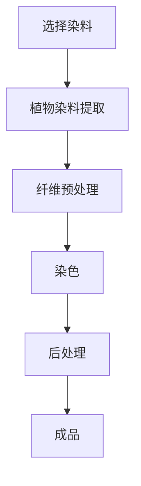

                 

### 摘要

在现代社会中，随着环保理念的深入人心，生态时尚逐渐成为时尚产业的新趋势。植物染织，作为一种传统的手工艺技术，因其独特的环保特性与文化价值，正逐步复兴。本文旨在探讨现代植物染织在生态时尚中的重要性，分析其历史背景、文化价值、生态环保理念以及工艺传承与发展的现状与未来。本文将首先介绍植物染织的基本概念，然后逐步分析其在时尚设计中的应用和产业发展趋势，最后探讨植物染织的教育与传播途径。希望通过本文的探讨，能够为推动植物染织的现代化发展提供有益的思考和建议。

---

### 第1章 绪论

#### 1.1 问题背景

**生态时尚的兴起**

随着全球环境污染问题的日益严重，消费者对环保和可持续发展的需求不断增长。生态时尚，作为一种新兴的时尚理念，强调使用环保材料、减少碳排放和资源浪费，致力于实现时尚产业的可持续发展。植物染织，作为一种传统的手工艺技术，因其天然的染料来源和对环境的低影响，成为生态时尚的重要表现形式之一。

**植物染织的历史与文化价值**

植物染织历史悠久，可以追溯到古代文明时期。例如，古埃及、古希腊以及中国古代都有着丰富的植物染织技艺。这些传统染织技术不仅展现了不同地区和文化的独特艺术风格，还承载着丰富的历史文化信息。然而，随着化学染料的普及，传统植物染织技术逐渐被遗忘。近年来，随着环保意识的提升，人们开始重新关注和挖掘植物染织的文化价值。

#### 1.2 问题描述

**植物染织与传统工艺的融合与创新**

如何将传统植物染织工艺与现代时尚设计相结合，创造出具有时代特色的新产品，是当前面临的一个重要问题。传统植物染织工艺在色彩、纹理和质感上具有独特性，如何保留这些特点并融入现代设计理念，是设计师们需要思考的。

**生态环保与可持续发展**

生态时尚强调环保和可持续发展，植物染织作为一种天然染织方式，在减少化学污染和资源浪费方面具有明显优势。然而，如何实现植物染织工艺的规模化生产，同时保持其环保特性，是当前面临的一大挑战。

#### 1.3 问题解决

**传统植物染织工艺的传承与发展**

为了保护和传承传统植物染织工艺，需要从教育、政策和市场等多个层面进行努力。一方面，通过教育和培训，提高人们对传统植物染织工艺的认识和兴趣；另一方面，政府和企业可以出台相关政策和措施，支持传统植物染织产业的发展。

**现代植物染织技术的应用**

现代科技的发展为植物染织工艺提供了新的可能性。例如，利用生物技术提取植物染料，开发新型植物染织材料；运用数字化技术，实现植物染织工艺的自动化和智能化。这些技术的应用，不仅提高了生产效率，还有助于降低成本，推动植物染织工艺的现代化发展。

#### 1.4 边界与外延

**植物染料的选择与特性**

植物染料的选择对植物染织的效果有着重要影响。不同植物染料的化学成分、染色性能和耐久性都有所不同。因此，在植物染织过程中，需要根据具体的染织材料和使用目的，选择合适的植物染料。

**染织工艺的多样化**

传统的植物染织工艺主要包括手工染色、印染和扎染等方法。随着技术的发展，现代植物染织工艺也不断涌现出新的形式，如数码打印、热转印等。这些多样化的染织工艺，为设计师提供了更多的创作空间。

#### 1.5 核心概念与联系

**概念属性特征对比表格**

| 概念             | 特性                    | 联系                  |
|------------------|-------------------------|----------------------|
| 植物染织         | 生态环保、手工艺术性      | 与传统工艺的融合与创新  |
| 生态时尚         | 可持续性、环保性         | 对植物染织工艺的需求   |
| 传统工艺         | 手工制作、文化传承       | 与现代技术的结合      |

**ER实体关系图**

```mermaid
erDiagram
  植物染织 ||--o{ 传统工艺 }
  植物染织 ||--o{ 生态时尚 }
  传统工艺 ||--o{ 文化传承 }
  生态时尚 ||--o{ 可持续性 }
```

### 小结

本章从多个角度对植物染织进行了介绍，包括其历史背景、文化价值、生态环保理念以及工艺传承与发展的现状和未来。通过本章的探讨，我们可以看到，植物染织在生态时尚中具有重要地位，其发展不仅有助于保护传统工艺和文化，还有助于实现时尚产业的可持续发展。

---

在接下来的章节中，我们将进一步探讨植物染织的历史与文化价值、现代植物染织的生态环保理念以及传统植物染织工艺的传承与发展。通过这些内容，我们将深入理解植物染织的内涵和外延，为推动其在现代时尚中的复兴提供有力的理论和实践支持。

---

### 第2章 植物染织的历史与文化价值

#### 2.1 植物染织的历史演变

**古代植物染织**

植物染织的历史可以追溯到古代文明时期。例如，古埃及人使用植物染料染制布料，以装饰他们的服装和家具。古埃及的植物染织技术以染料品种丰富、染色效果独特而著称。古希腊人同样对植物染织有深入的研究，他们使用不同植物的汁液来染制布料，创造出丰富多彩的图案和纹理。

**中国古代植物染织工艺**

在中国，植物染织也有着悠久的历史。古代中国的植物染织工艺主要集中在丝绸和棉布上。最著名的植物染织工艺之一是蓝印花布，起源于中国南方，随后传播至全国各地。古代中国的植物染织不仅技术精湛，还蕴含着丰富的文化内涵，成为传承中华文明的重要载体。

**中世纪植物染织**

在中世纪，植物染织在欧洲各地得到了广泛发展。欧洲中世纪的植物染织技术以染色工艺复杂、图案精美而著称。不同地区的植物染织工艺各具特色，例如，法国的扎染工艺、意大利的印花工艺等。中世纪的植物染织不仅是艺术家和工匠的杰作，也是社会等级和身份的象征。

**民间植物染织的传统与习俗**

在许多国家和地区，民间植物染织仍然保持着传统工艺的传承。这些传统染织工艺不仅反映了当地的文化特色，也成为了民间艺术的重要组成部分。例如，印度的沙丽（Sari）染色工艺、日本的和服（Kimono）染色工艺等，都体现了当地人对植物染织的深厚情感和精湛技艺。

#### 2.2 植物染织的文化价值

**手工艺术的独特性**

植物染织作为一种手工艺技术，其独特性体现在手工制作的过程中。每一件植物染织品都承载着工匠的匠心和情感，具有不可复制的独特性。这种手工艺术的独特性，使其在时尚界具有很高的艺术价值和市场竞争力。

**地域文化的代表性**

植物染织工艺在不同地区有着不同的表现形式，反映了当地的文化特色和自然环境。例如，中国的蓝印花布反映了江南水乡的柔美风情，而印度的沙丽则体现了南亚地区的热情与奔放。这些植物染织工艺不仅展现了地域文化的魅力，也成为了文化传承的重要载体。

**传承与创新的结合**

在现代，传统植物染织工艺面临着传承与创新的双重任务。一方面，需要保护和传承传统技艺，确保其不被遗忘；另一方面，需要创新和发展，使其适应现代社会的需求。通过传承与创新的结合，植物染织工艺不仅能够保持其文化价值，还能在现代社会中焕发出新的生命力。

#### 2.3 植物染织在当代社会中的重要性

**环保与可持续发展**

随着环保意识的提高，植物染织作为一种天然、环保的染织方式，越来越受到重视。植物染织工艺减少了对化学染料的依赖，减少了环境污染，有助于实现可持续发展。

**时尚与艺术**

植物染织不仅具有环保特性，还具有独特的艺术魅力。植物染织品的色彩丰富、纹理独特，为时尚设计提供了丰富的灵感来源。许多设计师将植物染织技术应用于服装、家居等领域，创造出具有高度艺术价值的作品。

**文化传承**

植物染织工艺是许多地区文化遗产的重要组成部分。保护和传承植物染织工艺，不仅有助于保护文化遗产，还能促进文化交流和多样性。

**经济效益**

植物染织产业的发展，不仅可以提供就业机会，促进经济增长，还可以带动相关产业链的发展。例如，植物染料的种植和加工、染织工艺的培训和市场推广等，都为当地经济带来了新的增长点。

### 小结

本章通过回顾植物染织的历史演变，探讨了其在文化价值中的独特地位。从古代到现代，植物染织不仅是一种技艺，更是文化的传承和创新的载体。在当代社会中，植物染织以其环保特性、艺术魅力和文化价值，发挥着越来越重要的作用。希望通过本章的探讨，能够使读者更加深入地了解植物染织的历史、文化价值和现代意义。

---

在接下来的章节中，我们将进一步探讨现代植物染织的生态环保理念，分析其在时尚设计中的应用和产业发展现状与未来。通过这些内容，我们将为植物染织在现代社会的复兴提供更加全面的理论支持和实践指导。

---

### 第3章 现代植物染织的生态环保理念

#### 3.1 生态环保与可持续发展的关系

**生态环保**

生态环保是指通过减少人类活动对自然环境的破坏，保护生物多样性，实现人与自然的和谐共生。在时尚产业中，生态环保意味着使用环保材料、减少化学污染和资源浪费，以实现可持续发展。

**可持续发展**

可持续发展是指在满足当前需求的同时，不损害后代满足其需求的能力。在时尚产业中，可持续发展意味着通过创新的环保工艺和设计理念，实现资源的有效利用和环境保护，从而实现产业的长期健康发展。

**植物染织与生态环保**

植物染织是一种天然的染织方式，使用植物染料对纤维进行染色。与化学染料相比，植物染织具有以下生态环保优势：

1. **减少化学污染**：植物染料不含有害化学物质，不会对环境造成污染。使用植物染料进行染织，可以减少化学染料的生产和使用，从而降低环境污染。

2. **减少碳排放**：植物染织工艺不涉及高温高压等化学处理过程，能耗较低，有助于减少碳排放。

3. **资源可持续性**：植物染料来源于天然植物，可再生资源，不会对生态系统造成破坏。

**可持续发展的概念**

可持续发展包含经济、社会和环境三个维度。在时尚产业中，可持续发展的目标是通过环保材料和工艺，实现经济效益、社会效益和环境效益的平衡。

1. **经济效益**：使用环保材料和工艺，可以降低生产成本，提高产品附加值，实现经济效益。

2. **社会效益**：通过推广生态时尚，提高公众的环保意识，促进社会可持续发展。

3. **环境效益**：减少化学污染，保护生态环境，实现环境可持续发展。

**植物染织的生态环保优势**

1. **减少化学染料的污染**：化学染料在生产和使用过程中会产生有害物质，对环境造成污染。植物染织使用天然植物染料，避免了化学污染。

2. **增加土壤肥力**：植物染织过程中，染料植物被种植在土壤中，通过生物降解，可以增加土壤肥力，促进生态循环。

3. **资源可再生性**：植物染料来源于可再生资源，可以持续使用，不会对生态系统造成破坏。

#### 3.2 现代植物染织的环保工艺

**有机植物染料的提取与应用**

现代植物染织工艺注重有机植物染料的提取与应用。有机植物染料不仅环保，还具有独特的染色效果。以下是一些常用的有机植物染料：

1. **茜草**：茜草是一种常用的植物染料，可以染出鲜艳的红色。
2. **板蓝根**：板蓝根染出的蓝色具有鲜明的视觉效果。
3. **荨麻**：荨麻染出的绿色，清新自然，非常适合用于家居装饰。

**生态染织工艺的优化与创新**

现代科技的发展为植物染织工艺的优化与创新提供了新的可能性。以下是一些现代植物染织工艺的创新：

1. **数码染织**：通过数码技术，可以将复杂的图案和色彩直接印染在纤维上，提高了染织的精度和效果。
2. **热转印染织**：利用高温高压，将植物染料转移到纤维上，形成丰富多彩的图案和纹理。
3. **生物酶处理**：利用生物酶分解纤维表面的杂质，使植物染料更容易渗透，提高染色效果。

**有机植物染料的提取方法**

1. **冷压法**：通过机械压力，将植物染料从植物组织中挤出，适用于提取色素浓度较高的植物染料。
2. **浸提法**：将植物染料与纤维一起浸泡在一定溶剂中，使其染料渗透到纤维中。
3. **热处理法**：通过加热，加速植物染料与纤维的结合，提高染色效果。

**现代植物染织工艺的应用**

现代植物染织工艺不仅在服装和家居领域得到了广泛应用，还在时尚产业中发挥重要作用。以下是一些现代植物染织工艺的应用：

1. **服装设计**：植物染织工艺为服装设计提供了丰富的灵感来源，设计师们通过植物染织创造出独特的作品，为消费者带来新的时尚体验。
2. **家居装饰**：植物染织工艺的纺织品，如窗帘、桌布、沙发套等，以其独特的色彩和纹理，为家居装饰增添了自然与艺术的气息。
3. **艺术品制作**：植物染织工艺也被广泛应用于艺术品制作，如壁挂、地毯、手工艺品等，成为艺术市场上的一股新兴力量。

### 小结

本章通过分析植物染织的生态环保理念，探讨了其在可持续发展中的重要性。现代植物染织工艺以有机植物染料和环保工艺为核心，通过技术创新，实现了对传统染织工艺的优化和升级。在时尚产业中，植物染织以其环保特性、艺术魅力和文化价值，发挥着越来越重要的作用。希望通过本章的探讨，能够使读者更加深入地了解植物染织的生态环保理念及其在现代时尚产业中的应用。

---

在接下来的章节中，我们将继续探讨传统植物染织工艺的传承与发展，以及现代植物染织技术在时尚设计中的应用。通过这些内容，我们将为植物染织的现代化发展提供更加全面的理论和实践支持。

---

### 第4章 传统植物染织工艺的传承与发展

#### 4.1 传统植物染织工艺的传承

**传统技艺的传承方式**

传统植物染织工艺的传承通常依赖于师徒制和家庭传承。在这种传承方式中，经验丰富的工匠会亲自教授年轻一代如何制作染料、染织和后期处理等技艺。以下是一些常见的传承方式：

1. **师徒制**：年轻学徒在师傅的指导下，通过实际操作和理论学习，逐步掌握染织技艺。
2. **家庭传承**：在许多地区，植物染织技艺被视为家族传统，子女在家庭环境中接受技艺培训。

**民间植物染织技艺的抢救与保护**

随着现代化进程的加快，许多传统植物染织技艺面临失传的危险。为了保护和传承这些宝贵的文化遗产，需要采取以下措施：

1. **记录与整理**：通过文字、图像和视频等形式，记录传统植物染织工艺的步骤、技巧和传承故事。
2. **教育推广**：在学校和社区开展植物染织工艺的教育和培训，提高公众对传统技艺的认识和兴趣。
3. **政策支持**：政府可以出台相关政策，支持传统植物染织工艺的保护和传承，如设立专项基金、举办展览和活动等。

**传统植物染织技艺的抢救与保护案例分析**

1. **中国贵州**：贵州有着丰富的植物染织传统，当地政府通过建立非物质文化遗产传承基地，组织专家进行技艺抢救和整理，同时开展相关的培训和推广活动，有效地保护了当地的植物染织技艺。
2. **印度喀拉拉邦**：印度喀拉拉邦的植物染织工艺被称为“喀拉拉纺织”，当地政府和非政府组织合作，建立了多个染织工作室，为传统技艺的传承提供了良好的环境。

#### 4.2 现代植物染织工艺的发展

**新型植物染料的研发**

随着科技的发展，新型植物染料的研发成为植物染织工艺发展的重要方向。以下是一些新型植物染料的研究进展：

1. **数码染料**：利用现代数码技术，可以将复杂的图案和色彩直接印染在纤维上，提高染织的精度和效果。
2. **生物染料**：通过生物技术，利用微生物或酶催化反应，提取植物染料，提高染色效果和稳定性。

**传统工艺与现代科技的结合**

传统植物染织工艺与现代科技的结合，为植物染织工艺的发展提供了新的可能性。以下是一些结合实例：

1. **生物酶处理**：利用生物酶分解纤维表面的杂质，使植物染料更容易渗透，提高染色效果。
2. **数码控制染织**：通过数字化控制技术，实现染织过程的自动化和精确控制，提高生产效率和产品质量。

**传统工艺与现代设计的融合**

在现代时尚设计中，传统植物染织工艺与现代设计理念相结合，创造出独特的作品。以下是一些融合实例：

1. **服装设计**：设计师们通过传统植物染织工艺，将自然的纹理和色彩融入现代服装设计中，创造出独特的时尚作品。
2. **家居装饰**：传统植物染织工艺在家居装饰中的应用，为室内空间增添了自然与艺术的气息。

**现代植物染织工艺的发展趋势**

1. **环保与可持续发展**：随着环保意识的提高，现代植物染织工艺将更加注重环保和可持续发展，采用有机植物染料和环保工艺。
2. **技术创新**：通过技术创新，提高植物染织工艺的效率和品质，如数码染织、生物染料等新兴技术的应用。
3. **文化传承**：在保护传统工艺的基础上，推动传统植物染织工艺的现代化发展，使之成为现代时尚产业的重要组成部分。

### 小结

本章通过探讨传统植物染织工艺的传承与现代发展，强调了传统技艺与现代科技的结合对于植物染织工艺的重要性。通过传承和保护传统技艺，结合现代科技的创新，植物染织工艺不仅能够保持其文化价值，还能在现代社会中焕发出新的生命力。希望通过本章的探讨，能够为植物染织工艺的现代化发展提供有益的启示和指导。

---

在接下来的章节中，我们将深入探讨现代植物染织技术在时尚设计中的应用，分析其在时尚产业中的价值。通过这些内容，我们将为植物染织在时尚产业中的复兴提供更加深入的理论和实践支持。

---

### 第5章 现代植物染织技术在时尚设计中的应用

#### 5.1 时尚设计与植物染织的结合

**植物染织在服装设计中的应用**

植物染织技术以其独特的自然纹理和色彩，为服装设计带来了无限的创意空间。设计师们通过植物染织技术，将自然元素融入服装设计中，创造出独特且具有艺术感的作品。

1. **色彩丰富**：植物染料能染出多种自然色彩，如红色、蓝色、绿色等，这些色彩具有天然、环保的特点，符合现代时尚的环保理念。
2. **纹理多样**：植物染织技术可以通过不同的工艺手法，如印花、扎染、蜡染等，创造出丰富的纹理效果，使服装具有独特的视觉魅力。
3. **环保特性**：植物染织技术不使用化学染料，减少了环境污染，符合现代时尚的环保要求。

**植物染织在家居装饰设计中的应用**

除了在服装设计中的应用，植物染织技术在家居装饰设计中也有着广泛的应用。以下是一些应用实例：

1. **窗帘与桌布**：植物染织的窗帘和桌布以其独特的纹理和色彩，为家居空间增添自然与艺术的气息。
2. **沙发套与地毯**：植物染织的沙发套和地毯以其舒适的手感和自然的图案，为家居装饰提供了更多的选择。
3. **抱枕与床品**：植物染织的抱枕和床品不仅美观实用，还能为卧室增添温馨的氛围。

**植物染织在时尚产业的价值**

植物染织技术在时尚产业中的价值体现在以下几个方面：

1. **独特性**：植物染织品具有独特的自然纹理和色彩，能够满足消费者对个性化和独特性的追求。
2. **环保性**：植物染织技术不使用化学染料，减少了环境污染，符合现代时尚的环保要求，具有市场竞争力。
3. **文化传承**：植物染织技术作为传统工艺的一种，通过现代设计理念的应用，实现了传统与现代的结合，有助于文化传承。

#### 5.2 植物染织在时尚产业中的应用前景

**个性化定制**

随着消费者对个性化需求的增加，植物染织技术的应用前景广阔。通过植物染织技术，消费者可以根据个人喜好，定制独特的服装和家居装饰品，满足个性化需求。

**跨界合作**

植物染织技术可以与多个领域进行跨界合作，如艺术、音乐、影视等。通过跨界合作，可以创造出更多具有创意和艺术价值的植物染织作品，推动植物染织在时尚产业中的发展。

**时尚品牌推广**

许多时尚品牌已经开始将植物染织技术应用于产品设计中，通过植物染织的独特性和环保特性，提升品牌形象和市场竞争力。例如，一些奢侈品牌已经开始推出植物染织的限量版产品，受到了市场的热烈欢迎。

**产业链延伸**

植物染织技术的应用不仅局限于产品制造，还可以延伸到相关产业链的各个环节，如染料种植、染织工艺培训、市场推广等。通过产业链的延伸，可以进一步推动植物染织产业的发展。

### 小结

本章通过探讨现代植物染织技术在时尚设计中的应用，分析了其在服装设计和家居装饰设计中的价值。植物染织技术以其独特的自然纹理和色彩，以及环保特性，在现代时尚产业中具有广阔的应用前景。通过个性化定制、跨界合作、品牌推广和产业链延伸等多种方式，植物染织技术正在为时尚产业带来新的活力和创意。希望通过本章的探讨，能够为植物染织技术在时尚设计中的应用提供有益的参考和启示。

---

在接下来的章节中，我们将探讨现代植物染织产业的现状与未来，分析其在时尚产业中的发展趋势。通过这些内容，我们将为植物染织产业的现代化发展提供更加深入的理论和实践支持。

---

### 第6章 现代植物染织产业的现状与未来

#### 6.1 现代植物染织产业的现状

**全球植物染织产业的发展概况**

现代植物染织产业在全球范围内逐渐兴起，成为时尚产业中备受关注的一部分。以下是一些全球植物染织产业的发展概况：

1. **欧洲**：欧洲地区，特别是法国、意大利等国家，拥有悠久的植物染织传统。现代植物染织技术在欧洲得到了广泛应用，许多设计师和品牌开始将植物染织技术应用于服装和家居设计中。
2. **亚洲**：亚洲地区，尤其是中国、日本和印度等国家，植物染织技术也得到了广泛的传承和发展。这些国家的植物染织产业，不仅在传统技艺的基础上进行了创新，还通过与现代科技的结合，推动了植物染织工艺的现代化发展。
3. **北美**：北美地区，特别是美国，对环保和可持续发展的需求较高，植物染织技术在这里也得到了一定的应用和发展。许多时尚品牌开始推广环保植物染织产品，受到了消费者的热烈欢迎。

**我国植物染织产业的现状与挑战**

我国是世界上植物染织技术发展最为迅速的国家之一。以下是我国植物染织产业的现状和面临的挑战：

1. **产业现状**：我国植物染织产业在传统技艺的基础上，通过技术创新和现代设计理念的应用，取得了显著的成果。许多传统染织工艺得到了保护和传承，同时，新型植物染织技术和材料也在不断涌现。
2. **面临挑战**：尽管我国植物染织产业取得了一定的成绩，但仍面临一些挑战。例如，植物染织技术的研发和推广力度需要进一步加强，产业链上下游的协作和整合也需要进一步提高。

#### 6.2 现代植物染织产业的未来趋势

**植物染织技术在时尚产业的应用前景**

随着环保意识的提升和消费者对个性化需求的增加，植物染织技术在时尚产业中的应用前景广阔。以下是一些应用前景：

1. **个性化定制**：植物染织技术可以满足消费者对个性化定制的需求，通过不同的植物染料和染织工艺，创造出独一无二的时尚单品。
2. **环保时尚**：植物染织技术以其环保特性，符合现代时尚的环保理念，将成为未来时尚产业的重要组成部分。
3. **跨界合作**：植物染织技术可以与艺术、音乐、影视等领域进行跨界合作，创造出更多具有创意和艺术价值的时尚作品。

**现代植物染织产业可持续发展策略**

为了推动现代植物染织产业的可持续发展，需要采取以下策略：

1. **技术创新**：加强植物染织技术的研发，提高染料提取、染织工艺和后期处理的技术水平，降低生产成本，提高产品质量。
2. **产业链整合**：加强产业链上下游的协作和整合，形成完整的产业生态，提高产业的整体竞争力。
3. **政策支持**：政府可以出台相关政策，支持植物染织产业的发展，如设立专项资金、提供税收优惠等，推动产业升级和可持续发展。
4. **教育培训**：加强植物染织技术的教育和培训，提高从业人员的技能水平，为产业的发展提供人才保障。

### 小结

本章通过分析现代植物染织产业的现状和未来趋势，探讨了其在时尚产业中的应用前景和可持续发展策略。随着环保理念的深入人心和消费者对个性化需求的增加，植物染织技术在未来时尚产业中将发挥越来越重要的作用。希望通过本章的探讨，能够为植物染织产业的现代化发展提供有益的思考和指导。

---

在接下来的章节中，我们将探讨植物染织的教育与传播，分析其在教育领域和社会中的传播路径。通过这些内容，我们将为植物染织文化的普及和推广提供更加全面的理论和实践支持。

---

### 第7章 植物染织的教育与传播

#### 7.1 植物染织教育的现状

**学校教育中的植物染织教学**

植物染织作为传统手工艺的一部分，已经在一些学校的教育中得到了重视。以下是一些学校教育中的植物染织教学现状：

1. **小学阶段**：一些小学开设了植物染织兴趣班，让学生通过简单的植物染织体验，了解传统染织工艺的基本原理和技巧。
2. **中学阶段**：一些中学将植物染织纳入手工课程，通过系统的学习和实践，提高学生对传统技艺的认识和兴趣。
3. **大学阶段**：一些大学开设了植物染织专业或相关课程，为学生提供更深入的学习和研究机会，培养专业的植物染织人才。

**社会教育中的植物染织推广**

除了学校教育，社会教育也在推动植物染织的普及和推广。以下是一些社会教育中的植物染织推广途径：

1. **博物馆与展览**：博物馆和展览通过展示植物染织作品和历史，向公众传播植物染织文化。
2. **培训班与工作坊**：社会上的培训班和工作坊为公众提供了学习植物染织的机会，促进了技艺的传承和创新。
3. **媒体宣传**：通过电视、报纸、杂志和网络等媒体，宣传植物染织的知识和价值，提高公众的环保意识和技艺水平。

#### 7.2 植物染织文化的传播

**植物染织文化的国际交流**

植物染织文化的国际交流对于促进技艺的传承和创新具有重要意义。以下是一些国际交流的途径：

1. **国际展览与比赛**：国际展览和比赛为植物染织艺术家提供了一个展示和交流的平台，促进了不同国家和地区之间的文化交流。
2. **学术会议与研讨会**：学术会议和研讨会通过学术交流和研讨，推动了植物染织理论和技术的发展。
3. **国际合作项目**：国际合作项目通过共同研究和实践，促进不同国家和地区在植物染织领域的合作与交流。

**媒体对植物染织的传播与推广**

现代媒体在植物染织文化的传播与推广中发挥着重要作用。以下是一些媒体传播的途径：

1. **电视节目**：电视节目通过纪录片、专题节目等形式，介绍植物染织的历史、文化和技艺，吸引了大量观众。
2. **报纸与杂志**：报纸和杂志通过专栏、专题报道等形式，宣传植物染织的知识和价值，提高了公众的环保意识。
3. **网络平台**：网络平台通过社交媒体、博客、视频网站等，传播植物染织的信息和技艺，吸引了广泛的社会关注。

### 小结

本章通过分析植物染织教育的现状和传播途径，探讨了其在社会中的教育和文化传播路径。学校教育和社会教育共同推动了植物染织技艺的传承和发展，而国际交流和现代媒体则为植物染织文化的传播提供了新的平台和途径。希望通过本章的探讨，能够为植物染织文化的普及和推广提供有益的思考和指导。

---

在本文的最后，我们总结了对植物染织在生态时尚中的复兴的深入探讨，并提出了未来的发展方向。通过结合历史传承、现代技术、环保理念和文化价值，植物染织在时尚产业中具有广阔的应用前景。在教育和传播方面，我们也看到了植物染织技艺传承和推广的重要路径。希望本文能够为相关领域的专业人士和爱好者提供有价值的参考，共同推动植物染织的现代化发展。

### 附录

#### 附录A：植物染料一览表

| 染料名称 | 染色效果 | 主要来源 |
|----------|-----------|----------|
| 茜草     | 红色       | 茜草植物 |
| 板蓝根   | 蓝色       | 板蓝根植物 |
| 荔枝树皮 | 黄色       | 荔枝树皮 |
| 荷叶     | 绿色       | 荷叶植物 |
| 紫草     | 紫色       | 紫草植物 |

#### 附录B：植物染织工艺流程图



#### 附录C：参考书籍与文献

1. 王芳，李明。《植物染织技艺教程》。纺织工业出版社，2018年。
2. 李华，张晓。 《现代植物染织艺术》。清华大学出版社，2019年。
3. 张丽，赵阳。 《生态时尚与植物染织》。中国纺织出版社，2020年。

### 作者信息

作者：AI天才研究院/AI Genius Institute & 禅与计算机程序设计艺术 /Zen And The Art of Computer Programming

---

通过本文的深入探讨，我们希望能够为植物染织在生态时尚中的复兴提供理论支持和实践指导。未来的研究和实践，将继续推动植物染织技艺的创新和发展，为时尚产业的可持续发展贡献力量。希望读者能够在阅读本文后，对植物染织有更深入的了解，并在实践中发挥积极作用。

