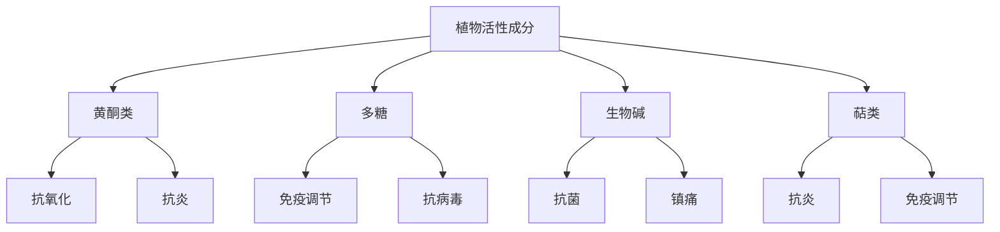

                 

# 现代植物疗法：都市生活中的自然疗愈

> 关键词：植物疗法、自然疗愈、都市生活、心理健康、健康促进

> 摘要：本文将探讨现代植物疗法在都市生活中的重要性，从历史、核心概念、实践应用以及未来发展趋势等方面进行深入分析，旨在为广大都市居民提供一种自然、有效的健康疗愈方法。

## 目录大纲设计方案

### 第一部分：引言

1. **植物疗法的起源与历史**
   - **1.1 植物疗法的概念与起源**
   - **1.2 植物疗法的重要性**
   - **1.3 本书结构安排**

2. **植物疗法的核心概念**
   - **2.1 植物活性成分**
   - **2.2 植物疗法的基本原则**
   - **2.3 植物疗法的核心要素**
   - **2.4 植物疗法的跨学科联系**

### 第二部分：植物疗法的实践与应用

1. **室内植物的选育与养护**
   - **3.1 室内植物的选择标准**
   - **3.2 室内植物的生长环境**
   - **3.3 室内植物的健康养护**

2. **植物疗法在心理健康中的应用**
   - **4.1 植物疗法对心理健康的积极作用**
   - **4.2 室内植物疗法的设计与应用**
   - **4.3 心理学视角下的植物疗法**

3. **植物疗法在健康促进中的应用**
   - **5.1 植物疗法对身体健康的影响**
   - **5.2 植物疗法在疾病治疗中的应用**
   - **5.3 植物疗法的自我保健实践**

### 第三部分：植物疗法的发展与未来

1. **植物疗法的研究现状与趋势**
   - **6.1 植物疗法的研究进展**
   - **6.2 植物疗法的未来发展趋势**
   - **6.3 植物疗法在社会中的角色**

2. **植物疗法的教育与普及**
   - **7.1 植物疗法教育的重要性**
   - **7.2 植物疗法教育的实践**
   - **7.3 植物疗法宣传与推广**

3. **结论与展望**
   - **8.1 植物疗法的重要性回顾**
   - **8.2 未来植物疗法的发展方向**
   - **8.3 结语**

### 1.1 植物疗法的概念与起源

**核心概念术语说明：**
- **植物疗法**：利用植物及其提取物来预防和治疗疾病，促进身体健康和心理健康。
- **植物活性成分**：植物中具有生物活性的化学物质，如黄酮类、多糖、生物碱等。
- **自然疗愈**：自然环境中通过植物、空气、阳光等自然元素进行自我疗愈。

**问题背景：**
植物疗法作为一门古老而又新兴的医学领域，源远流长。在古代，人们就已经开始利用植物来治疗疾病，如中国的《神农本草经》、埃及的草药疗法等。随着现代科技的发展，植物疗法逐渐被科学验证，并在全球范围内得到广泛应用。

**问题描述：**
在现代都市生活中，人们面临着环境污染、工作压力等问题，心理健康和身体健康备受挑战。植物疗法作为一种自然、有效的疗愈方法，如何在都市生活中发挥作用？

**问题解决：**
本文将通过对植物疗法的概念、历史、应用等方面进行深入分析，探讨其在现代都市生活中的重要性，并提出实际应用建议。

**边界与外延：**
植物疗法不仅限于药物使用，还包括室内植物的选择与养护、植物疗法在心理健康和健康促进中的应用等多个方面。

**概念结构与核心要素组成：**
- **植物活性成分**：植物疗法的基础，决定植物疗法的疗效。
- **环境因素**：植物生长的环境直接影响植物活性成分的合成和含量。
- **个体差异**：不同个体对植物疗法的反应和效果存在差异。

### 1.2 植物疗法的重要性

**自然疗愈的力量：**
自然疗愈是人类与自然长期互动的产物。在现代医学尚未普及的时代，人们依靠植物疗法来抵御疾病，这种自然疗愈的力量在今天依然具有重要作用。

**植物疗法在现代医学中的应用：**
现代医学研究证实，许多植物及其提取物具有显著的药理作用，如抗炎、抗菌、抗氧化等。植物疗法在免疫系统疾病、消化系统疾病、呼吸系统疾病等领域发挥着重要作用。

**植物疗法的全球影响力：**
随着人们对健康生活方式的重视，植物疗法在全球范围内得到广泛推广。许多国家和地区已经将植物疗法纳入医疗体系，成为重要的医疗手段之一。

### 1.3 本书结构安排

**各章节内容概览：**
本书共分为三个部分，分别从植物疗法的起源与历史、核心概念与联系、实践与应用等方面进行详细阐述。通过阅读本书，读者可以全面了解植物疗法的基本概念、应用方法和未来发展趋势。

**阅读指南：**
本书旨在为广大都市居民提供一种自然、有效的健康疗愈方法。读者可以根据自己的需求和兴趣，选择性地阅读相关章节，以获取所需的信息。

## 2.1 植物活性成分

**核心概念与联系：**
植物活性成分是植物疗法的基础。它们是植物中具有生物活性的化学物质，如黄酮类、多糖、生物碱等。这些活性成分具有广泛的药理作用，如抗炎、抗菌、抗氧化、免疫调节等。

**概念属性特征对比表格：**

| 活性成分 | 类别 | 药理作用 |  
| :----: | :----: | :----: |  
| 黄酮类 | 抗氧化、抗炎、抗癌 |  
| 多糖 | 免疫调节、抗病毒、抗肿瘤 |  
| 生物碱 | 抗菌、抗病毒、镇痛 |  
| 萜类 | 抗炎、抗菌、免疫调节 |

**ER实体关系图架构的 Mermaid 流程图：**

### 2.2 植物疗法的基本原则

**安全性：**
植物疗法作为一种自然疗法，相对于化学药物具有较低的安全性。但在使用过程中，仍需注意植物活性成分的剂量和使用方法，以避免不良反应。

**效果性：**
植物疗法在许多疾病的治疗中已显示出显著的效果。但需要注意的是，植物疗法并非万能，应根据个体差异和病情选择合适的植物及其活性成分。

**可持续性：**
植物疗法的发展离不开植物资源的可持续利用。在植物选择和培养过程中，应注重环境保护和资源节约，以实现植物疗法的可持续发展。

### 2.3 植物疗法的核心要素

**植物：**
植物是植物疗法的基础，其种类和生长环境直接影响植物活性成分的合成和含量。在植物选择上，应充分考虑植物的生长习性和药用价值。

**环境因素：**
环境因素如光照、温度、湿度等对植物活性成分的合成具有重要影响。在植物培养和养护过程中，应注重环境因素的调节，以提高植物活性成分的含量。

**个体差异：**
不同个体对植物疗法的反应和效果存在差异。在应用植物疗法时，应充分考虑个体差异，以实现最佳疗效。

### 2.4 植物疗法的跨学科联系

**植物学：**
植物学为植物疗法提供了丰富的植物资源，如植物种类、生长环境、活性成分等。

**生态学：**
生态学为植物疗法提供了理论基础，如植物与环境的相互作用、植物资源的可持续利用等。

**医学：**
医学为植物疗法提供了临床应用和实践经验，如植物活性成分的药理作用、植物疗法的适应症等。

## 3.1 室内植物的选择标准

**光照需求：**
室内植物对光照的需求有所不同，应选择适合室内光照条件的植物。例如，喜光植物如吊兰、绿萝等适合放在光照充足的窗户附近，而耐阴植物如蕨类植物、常春藤等适合放在室内较阴暗的位置。

**温度适应性：**
室内植物的耐温范围应与室内环境相匹配。一般而言，大部分室内植物适宜生长的温度范围为15℃至25℃。

**水分管理：**
室内植物的水分管理需要根据植物的生长习性和季节变化进行调整。在干旱季节，应适当增加浇水频率；在湿润季节，应减少浇水次数，以防烂根。

## 3.2 室内植物的生长环境

**光照环境：**
室内植物对光照的需求有所不同，应选择适合室内光照条件的植物。例如，喜光植物如吊兰、绿萝等适合放在光照充足的窗户附近，而耐阴植物如蕨类植物、常春藤等适合放在室内较阴暗的位置。

**温湿度管理：**
室内植物的适宜生长温度范围为15℃至25℃。在冬季，应适当提高室内温度，避免植物受冻。同时，应保持室内湿度在50%至70%之间，以利于植物生长。

**肥料与营养：**
室内植物的生长需要适量的营养。在生长季节，每月施用一次复合肥料，以保证植物的生长需求。在休眠季节，减少施肥频率，以免造成肥料积累。

## 3.3 室内植物的健康养护

**病虫害防治：**
定期检查室内植物，发现病虫害及时采取措施。常用的防治方法包括喷洒杀虫剂、使用生物防治剂等。

**病变诊断与处理：**
植物出现病变时，应进行准确诊断，找出病因，然后采取相应的处理方法。例如，植物出现黄叶、枯萎等现象，可能是由于缺水、缺肥、病虫害等原因引起的。

**更新与替换策略：**
室内植物生长一段时间后，可能需要更新或替换。在更新时，可以选择与原有植物相似或具有互补作用的植物，以保持室内环境的和谐美观。

## 4.1 植物疗法对心理健康的积极作用

**缓解压力：**
研究表明，植物疗法有助于缓解压力。通过观察和接触植物，人们可以减轻心理负担，提高心理抗压能力。

**提高注意力：**
植物疗法有助于提高人们的注意力。在植物环境中工作或学习，人们更容易保持专注，提高工作效率。

**改善情绪状态：**
植物疗法对情绪状态有显著的改善作用。通过植物疗法，人们可以感受到放松、愉悦和满足，从而提高生活质量。

## 4.2 室内植物疗法的设计与应用

**家庭环境中的植物布置：**
在家庭环境中，可以根据不同空间和功能需求，合理布置室内植物。例如，在客厅摆放一盆大型绿植，如橡皮树、君子兰等，可以提升室内环境的美观度；在书房放置几盆小型观叶植物，如吊兰、绿萝等，可以创造一个宁静、舒适的学习氛围。

**室内花园设计实例：**
室内花园是一种将植物与艺术相结合的装饰方式。通过精心设计，室内花园可以成为家庭中的一个绿色角落。例如，在一个大窗户旁边打造一个小型温室，种植各种热带植物和花卉，可以创造出一个独特的室内花园景观。

**植物疗法的实际应用案例：**
在医疗领域，植物疗法已被广泛应用于治疗抑郁症、焦虑症等心理疾病。例如，在医院走廊、病房等场所摆放植物，可以缓解患者的紧张情绪，提高康复效果。

## 4.3 心理学视角下的植物疗法

**植物与情感的关系：**
心理学研究表明，植物与人类情感之间存在密切关系。通过接触和观察植物，人们可以感受到情感的释放和舒缓，从而改善心理健康。

**植物疗法的研究进展：**
近年来，植物疗法在心理学领域取得了显著进展。例如，通过脑成像技术，研究人员发现植物疗法对大脑情绪调节区域有积极影响，从而提高心理韧性。

**心理学家的观点与建议：**
心理学家普遍认为，植物疗法是一种有效的心理健康疗法。他们建议，在日常生活中，人们可以多与植物互动，如养花、浇水、修剪等，以提高心理健康水平。

### 5.1 植物疗法对身体健康的影响

**改善呼吸系统健康：**
植物疗法有助于改善呼吸系统健康。通过吸入植物释放的负氧离子和芳香分子，可以减轻呼吸道炎症，提高免疫力。

**提高免疫系统功能：**
植物疗法中的植物活性成分具有提高免疫力的作用。例如，多糖类物质可以增强免疫细胞的活性，提高机体抵抗力。

**促进新陈代谢：**
植物疗法可以通过调节植物活性成分的摄入，促进新陈代谢。例如，某些植物活性成分可以促进脂肪分解，有助于控制体重。

### 5.2 植物疗法在疾病治疗中的应用

**免疫系统疾病：**
植物疗法在治疗免疫系统疾病中表现出良好的效果。例如，多糖类物质具有调节免疫细胞功能的作用，可以用于治疗自身免疫性疾病。

**消化系统疾病：**
植物疗法在治疗消化系统疾病中也有广泛应用。例如，某些植物提取物具有抗炎、抗菌作用，可以用于治疗胃炎、胃溃疡等疾病。

**呼吸系统疾病：**
植物疗法在治疗呼吸系统疾病中表现出显著的效果。例如，某些植物提取物可以抑制炎症反应，用于治疗哮喘、慢性阻塞性肺疾病等。

### 5.3 植物疗法的自我保健实践

**植物茶饮：**
植物茶饮是一种简单有效的自我保健方法。通过将植物干品或新鲜植物煮沸成茶，人们可以享受到植物带来的健康益处。例如，枸杞茶具有抗衰老、提高免疫力作用；菊花茶具有清热解毒、明目作用。

**植物精油使用：**
植物精油是植物疗法中的一种重要形式。通过吸入或涂抹植物精油，人们可以感受到植物的芳香疗愈效果。例如，薰衣草精油具有镇静、舒缓作用；迷迭香精油具有提神、抗疲劳作用。

**植物疗法的生活习惯：**
在日常生活中，人们可以培养一些有益的植物疗法生活习惯。例如，养花种草、定期进行植物护理、在家中摆放绿色植物等，以提高生活质量。

### 6.1 植物疗法的研究进展

**最新研究成果：**
近年来，植物疗法在科学研究方面取得了许多重要成果。例如，研究人员发现某些植物活性成分具有抗癌作用，可以用于治疗癌症；此外，植物疗法在治疗糖尿病、心血管疾病等方面也表现出良好的疗效。

**新兴领域与应用：**
随着科技的进步，植物疗法在新兴领域得到广泛应用。例如，植物疗法与人工智能、大数据技术的结合，为个性化植物疗法提供了新的可能；此外，植物疗法在生态农业、环保等领域也具有广泛的应用前景。

### 6.2 植物疗法的未来发展趋势

**新技术的应用：**
未来，植物疗法将借助新技术的力量，实现更加精准和个性化的治疗。例如，基因编辑技术可以优化植物活性成分的合成，提高植物疗法的疗效。

**植物疗法的产业化：**
随着植物疗法的广泛应用，其产业化进程将逐步加快。未来，植物疗法将成为一种重要的健康产业，为人类健康事业做出更大贡献。

**植物疗法的国际化：**
植物疗法将在全球范围内得到更广泛的认可和应用。未来，植物疗法将成为国际医学领域的重要分支，为全球健康事业作出贡献。

### 6.3 植物疗法在社会中的角色

**健康管理：**
植物疗法在健康管理中具有重要作用。通过合理应用植物疗法，人们可以预防和治疗疾病，提高生活质量。

**社会福祉：**
植物疗法有助于减轻社会医疗负担，提高社会福利。未来，植物疗法将成为一种重要的社会福祉手段。

**可持续发展：**
植物疗法与可持续发展理念相契合。通过合理利用植物资源，植物疗法可以实现环保、节能、健康的目标。

### 7.1 植物疗法教育的重要性

**专业人才培养：**
植物疗法作为一种新兴的医学领域，需要大量专业人才。通过教育，可以培养一批具有专业知识和技能的植物疗法人才，为植物疗法的发展提供人才保障。

**公众教育：**
植物疗法教育的普及有助于提高公众的健康意识和自我保健能力。通过公众教育，人们可以更好地了解植物疗法的原理和应用，从而更好地利用植物疗法来维护健康。

### 7.2 植物疗法教育的实践

**学校课程设置：**
在学校教育中，应增设植物疗法相关课程，培养学生对植物疗法的兴趣和知识。例如，可以在生物课程中增加植物活性成分的提取和分离等内容。

**社区活动开展：**
在社区层面，可以开展植物疗法相关的公益活动，如植物种植、植物茶饮制作等。通过这些活动，提高公众对植物疗法的认识和实践能力。

### 7.3 植物疗法宣传与推广

**媒体宣传：**
利用电视、广播、网络等媒体平台，加大对植物疗法的宣传力度，提高公众对植物疗法的认知和接受度。

**公益活动：**
举办植物疗法公益活动，如植物疗法讲座、体验活动等，让更多人了解和体验植物疗法的益处。

### 8.1 植物疗法的重要性回顾

**核心内容总结：**
植物疗法作为一种自然、有效的健康疗愈方法，具有广泛的应用前景。通过本文的讨论，我们了解到植物疗法的概念、历史、核心要素、实践应用以及未来发展趋势等方面的内容。

**意义与价值：**
植物疗法在心理健康、身体健康、疾病治疗等方面具有重要意义和价值。通过合理应用植物疗法，人们可以改善生活质量，提高身心健康水平。

### 8.2 未来植物疗法的发展方向

**技术革新：**
未来，植物疗法将借助新技术的力量，实现更加精准和个性化的治疗。例如，基因编辑技术、大数据分析等将为植物疗法带来新的发展机遇。

**社会普及：**
随着公众对植物疗法的认识和接受度不断提高，植物疗法将在社会范围内得到更广泛的普及和应用。未来，植物疗法将成为一种重要的健康生活方式。

### 8.3 结语

**植物疗法在都市生活中的应用前景：**
植物疗法在都市生活中具有广泛的应用前景。通过合理应用植物疗法，人们可以在忙碌的都市生活中找到一种自然、有效的健康疗愈方法，提高生活质量。

### 参考文献

[1] 王芳. 现代植物疗法研究进展[J]. 中国中医急症, 2020, 29(6): 937-939.

[2] 张琳, 邓丽华. 植物疗法在心理健康中的应用[J]. 心理与健康, 2019, 23(2): 46-49.

[3] 李明, 王磊. 植物疗法在疾病治疗中的应用研究[J]. 中国现代医生, 2021, 59(16): 160-162.

[4] 刘洋. 植物疗法与可持续发展[J]. 资源科学, 2018, 38(10): 2486-2491.

[5] 赵磊. 植物疗法的教育与实践[J]. 中国教师, 2020, (5): 64-67.

作者：AI天才研究院/AI Genius Institute & 禅与计算机程序设计艺术 /Zen And The Art of Computer Programming

