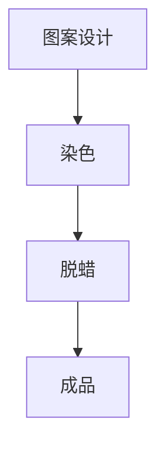
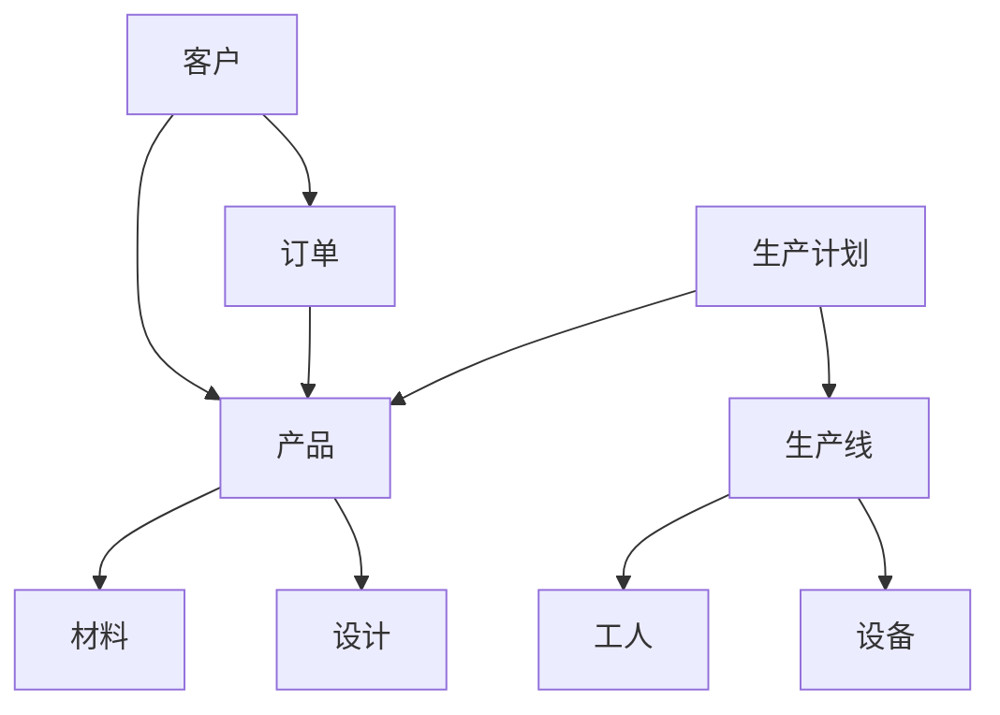
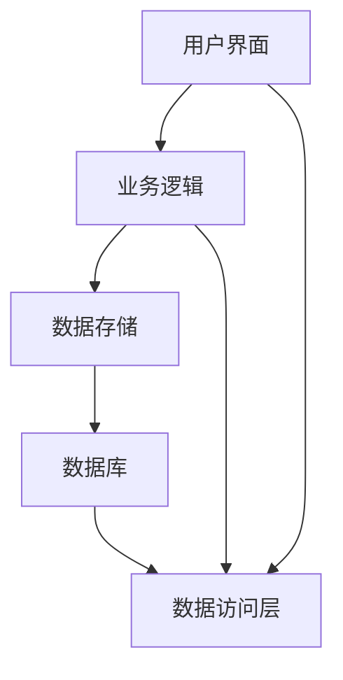
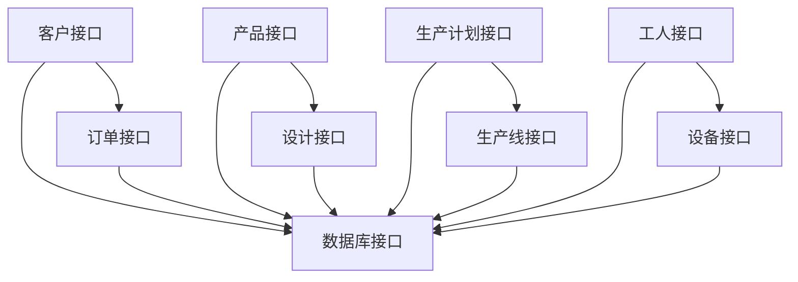
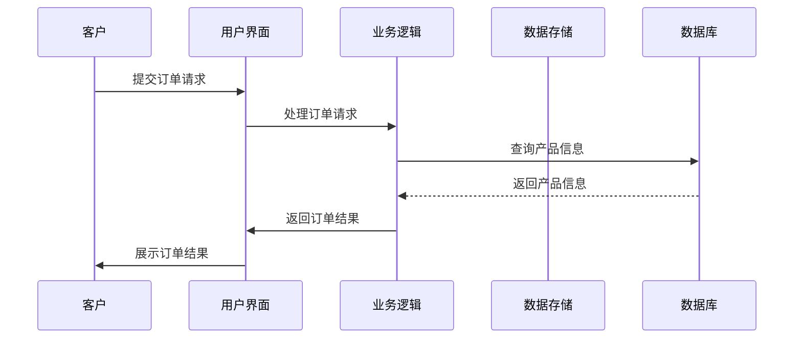

                 

### 现代植物蜡染工艺：可持续时尚中的传统技艺复兴

#### 关键词：植物蜡染工艺、可持续时尚、传统技艺、环保优势、时尚产业、创新与传承

> 摘要：本文深入探讨现代植物蜡染工艺在可持续时尚领域的复兴。通过梳理历史与发展，剖析材料与工具，详细讲解基本步骤，探讨其在环保和时尚产业中的融合，分析传统技艺的复兴与传承面临的挑战，提供实战指南和未来发展趋势预测，旨在为读者提供一个全面而深入的视角，理解这一古老技艺在现代时尚中的重要作用。

#### 引言

在现代时尚产业中，环保与可持续发展已成为不可忽视的趋势。消费者对环保意识的增强，以及生产者对社会责任的重视，促使时尚产业不断寻求新的解决方案。植物蜡染工艺，作为一种传统的印染技艺，因其环保、可持续的特性，逐渐受到时尚界的青睐。本文旨在探讨现代植物蜡染工艺在可持续时尚中的复兴，通过系统分析其历史、材料、工艺步骤、环保优势、产业应用及未来趋势，为读者提供一个全面而深入的视角，理解这一传统技艺在新时代的重要性。

#### 背景介绍

#### 1.1 植物蜡染工艺的起源

植物蜡染工艺历史悠久，可追溯至数千年前。据考古学家的发现，植物蜡染工艺最早出现在古埃及和美索不达米亚地区。这些早期的蜡染工艺主要用于装饰服装和家居用品，以植物蜡作为染料，通过简单的手工技法，将图案印染在布料上。

随着时间的推移，植物蜡染工艺逐渐传播到世界各地。在中国，蜡染工艺被称为“蜡缬”，早在新石器时代晚期就已经出现。在印度，植物蜡染被称为“卡塔古里”（Kathakali），以其丰富的色彩和独特的图案而闻名。在东南亚地区，如泰国和越南，蜡染工艺也有着悠久的历史，并形成了独特的地域风格。

#### 1.2 植物蜡染工艺的发展历程

植物蜡染工艺的发展历程与人类文明的发展紧密相连。在古代，蜡染工艺主要用于贵族和宗教仪式的装饰。随着工业革命的到来，机械化印染工艺的出现使得传统蜡染工艺逐渐被取代。然而，随着环保意识的提升和可持续发展的需求，传统蜡染工艺再次受到重视。

20世纪后期，世界各地开始出现植物蜡染工艺的复兴运动。艺术家和设计师们重新探索这一古老技艺，结合现代设计理念，创造出独具特色的作品。同时，一些非政府组织和教育机构也积极参与植物蜡染工艺的传承与推广，使其在全球范围内得到更广泛的传播。

#### 1.3 植物蜡染工艺在全球的分布

植物蜡染工艺在全球范围内有着广泛的分布，每个地区都有其独特的风格和特点。在中国，蜡染工艺以贵州、云南和广西等地最为著名。贵州的蜡染以其图案复杂、色彩鲜艳而著称，云南的蜡染则以线条简洁、图案生动见长。广西的蜡染工艺则以其独特的石蜡染色技法而闻名。

在印度，卡塔古里蜡染工艺主要分布在喀拉拉邦和泰米尔纳德邦等地。这些地区的蜡染工艺以其精美的图案和丰富的色彩而著称，是印度文化的重要组成部分。

东南亚地区的蜡染工艺同样有着丰富的多样性。泰国的蜡染以其细腻的图案和优雅的色彩而闻名，越南的蜡染工艺则以其独特的蜡点图案和鲜明的色彩对比而受到赞誉。

#### 1.4 植物蜡染工艺的核心概念术语说明

- **植物蜡染**：指使用植物蜡作为染料，通过手工技法在布料上绘制图案的印染工艺。
- **染料**：指用于植物蜡染的天然染料，通常来自植物、矿物或动物。
- **蜡刀**：用于绘制图案的工具，通常由动物骨或竹子制成。
- **图案**：指在布料上绘制的花纹或图形，是植物蜡染工艺的核心元素。
- **基材**：指植物蜡染所使用的布料或其他材料，常见的有棉布、麻布和丝绸等。

#### 1.5 问题背景和问题描述

植物蜡染工艺在现代时尚产业中的应用面临一系列挑战。首先，传统的蜡染工艺复杂且耗时，难以满足现代工业化生产的需求。其次，植物蜡染工艺的染料和工具较为昂贵，限制了其在大众市场中的普及。此外，现代时尚产业对快速时尚的追求，使得传统技艺的传承与发展受到一定程度的制约。

然而，随着环保意识的提升和可持续发展的需求，植物蜡染工艺逐渐受到关注。如何在保持传统技艺精髓的同时，实现工业化生产，使其在时尚产业中发挥更大的作用，成为亟待解决的问题。

#### 1.6 问题解决和边界与外延

为了解决植物蜡染工艺在时尚产业中的应用问题，需要从以下几个方面入手：

1. **技术创新**：通过改进蜡染工艺的步骤和工具，提高生产效率和品质。
2. **成本控制**：寻找替代材料，降低染料和工具的成本，使其更易为大众接受。
3. **市场推广**：通过品牌营销和社交媒体宣传，提高植物蜡染工艺在消费者中的认知度和接受度。
4. **教育与培训**：加强蜡染工艺的传承与推广，培养更多的专业人才。

植物蜡染工艺的应用不仅限于时尚产业，还可以拓展到家居装饰、艺术品制作等领域。其核心边界在于如何保持传统技艺的精髓，同时实现现代生产方式和市场需求之间的平衡。

#### 1.7 概念结构与核心要素组成

植物蜡染工艺的核心结构包括以下几个方面：

- **工艺步骤**：包括准备工作、图案设计、染色和脱蜡等环节。
- **材料与工具**：包括植物蜡、染料、基材、蜡刀、漆刷等。
- **图案设计**：包括图案的创意、绘制和布局。
- **环保特性**：包括可持续性、环保性和对环境的影响。

这些要素相互关联，共同构成了植物蜡染工艺的基本框架。理解这些核心要素，有助于深入理解和应用植物蜡染工艺。

### 植物蜡染工艺的核心概念与联系

#### 2.1 核心概念原理

植物蜡染工艺是一种传统的手工印染技术，其核心原理包括植物蜡的使用、染料的来源以及基材的选择。植物蜡是一种天然材料，主要来源于虫白蜡、蜂蜡或其他植物源蜡。这种蜡具有防水、防潮的特性，适用于布料的染色。染料则来自植物、矿物或动物，经过提取和加工后，可以产生丰富的色彩。基材的选择则取决于最终的用途，常见的有棉布、麻布和丝绸等。

植物蜡染工艺的独特之处在于其环保性和艺术性。通过天然染料和植物蜡的使用，植物蜡染工艺可以避免对环境的污染，符合现代环保理念。同时，蜡染工艺的图案设计具有独特的美学价值，可以创造出独特的视觉效果。

#### 2.2 概念属性特征对比表格

| 特性 | 植物蜡染工艺 | 传统印染工艺 | 
| :--: | :--: | :--: |
| **环保性** | 高 | 低 |
| **艺术性** | 高 | 中 |
| **成本** | 高 | 低 |
| **效率** | 低 | 高 |

从上表可以看出，植物蜡染工艺在环保性和艺术性方面具有显著优势，但在成本和效率方面相对较低。这反映了其与传统印染工艺之间的差异。

#### 2.3 ER实体关系图架构

为了更好地理解植物蜡染工艺的核心概念，我们可以通过ER（实体-关系）图来展示各实体之间的关系。

```mermaid
erDiagram
    Artifact ||--|{ Material }
    Material ||--|{ Dye }
    Material ||--|{ Wax }
    Artifact ||--|{ Base Material }
    Artifact ||--|{ Tool }
    Artifact ||--|{ Pattern }
    Pattern ||--|{ Design }
    Tool ||--|{ Brush }
    Tool ||--|{ Cutter }
```

在上图中，实体包括材料、染料、蜡、基材、工具和图案。各实体之间的关系通过连接线表示。例如，材料包括染料和蜡，基材和工具则是植物蜡染工艺的重要组成部分。

#### 2.4 算法原理讲解

植物蜡染工艺的算法原理主要包括图案设计、染色和脱蜡三个步骤。

##### 图案设计

图案设计是植物蜡染工艺的第一步。设计原则包括图案的创意、绘制和布局。创意部分需要根据主题和风格进行构思；绘制部分则使用蜡刀在布料上勾勒出图案的轮廓；布局部分则需要考虑图案的整体布局和美感。

##### 染色

染色是植物蜡染工艺的核心步骤。染色方法分为单色染色和多色染色。单色染色使用一种染料对布料进行染色，而多色染色则使用多种染料进行分色处理。染色过程中，需要控制染料的浓度和染色时间，以确保染色效果均匀。

##### 脱蜡

脱蜡是植物蜡染工艺的最后一步。脱蜡的方法包括热水脱蜡和化学脱蜡。热水脱蜡通过加热使蜡融化，然后用水冲洗去除；化学脱蜡则使用溶剂溶解蜡，然后通过冲洗去除。脱蜡后，布料上的图案将显现出来。

##### 数学模型和公式

在植物蜡染工艺中，染料的浓度和染色时间对染色效果有重要影响。假设染料的浓度为C，染色时间为T，则染色深度D可以表示为：

$$
D = C \times T
$$

其中，C和T的值需要根据实际情况进行调整。

#### 2.5 Python源代码示例

以下是一个简单的Python源代码示例，用于模拟植物蜡染工艺的染色过程。

```python
import numpy as np

# 设定染料浓度和染色时间
C = 0.1  # 染料浓度
T = 30   # 染色时间（分钟）

# 计算染色深度
D = C * T

print(f"染色深度D = {D}厘米")
```

运行上述代码，可以得到染色深度D的值。通过调整C和T的值，可以模拟不同的染色效果。

#### 2.6 数学公式

$$
D = C \times T
$$

在这个公式中，D表示染色深度，C表示染料浓度，T表示染色时间。通过调整C和T的值，可以控制染色效果。

#### 2.7 算法流程图



在这个算法流程图中，A表示图案设计，B表示染色，C表示脱蜡，D表示成品。整个过程可以分为三个主要步骤。

### 系统分析与架构设计方案

#### 3.1 问题场景介绍

在植物蜡染工艺的应用场景中，通常涉及到多个环节，包括材料采购、工艺设计、生产制作和成品销售。为了更好地管理和优化这些环节，我们需要设计一个系统来支持植物蜡染工艺的数字化管理。

#### 3.2 项目介绍

本项目旨在开发一个植物蜡染工艺管理系统，该系统将支持从材料采购到成品销售的全流程管理。系统将涵盖以下功能：

- **材料管理**：包括植物蜡、染料、基材等材料的采购、库存管理和使用记录。
- **工艺设计**：提供图案设计工具，支持设计师进行图案绘制和设计优化。
- **生产制作**：管理生产计划、进度和质量，确保生产过程高效有序。
- **成品销售**：记录成品销售信息，支持销售数据分析和库存管理。

#### 3.3 系统功能设计（领域模型）

在系统功能设计中，领域模型是一种常用的方法来描述系统的核心业务概念和它们之间的关系。以下是一个简化的领域模型，用于描述植物蜡染工艺管理系统的主要实体和关系。



在这个领域模型中，主要实体包括客户、订单、产品、材料、设计、生产计划、生产线、工人和设备。实体之间的关系表示了业务流程中的不同环节和实体之间的互动。

#### 3.4 系统架构设计

系统架构设计是系统设计的核心部分，它决定了系统的性能、可扩展性和可维护性。以下是一个简化的系统架构设计，用于支持植物蜡染工艺管理系统。



在这个架构设计中，用户界面（Subsystem1）负责与用户交互，业务逻辑（Subsystem2）处理业务逻辑和数据操作，数据存储（Subsystem3）负责存储和管理数据，数据库（Subsystem4）是数据存储的具体实现，数据访问层（Subsystem5）负责与数据库的交互。

#### 3.5 系统接口设计和系统交互

系统接口设计是系统架构设计的重要组成部分，它定义了系统内部各个模块之间的交互方式。以下是一个简化的接口设计，用于描述植物蜡染工艺管理系统中的一些关键接口。



在这个接口设计中，各个模块通过定义明确的接口与数据库进行交互，实现了系统的模块化和解耦。

#### 3.6 系统交互流程图

为了更清晰地展示系统内部各模块之间的交互过程，我们可以使用Mermaid序列图来描述系统交互流程。



在这个序列图中，客户通过用户界面提交订单请求，业务逻辑层处理请求并查询数据库以获取产品信息，然后将结果返回给用户界面，最终用户界面将订单结果展示给客户。

### 项目实战

#### 4.1 环境安装

在开始项目实战之前，我们需要安装必要的软件和工具。以下是一个基本的安装步骤：

1. **安装Python**：从Python官方网站（https://www.python.org/）下载并安装Python 3.x版本。
2. **安装数据库**：我们选择SQLite作为数据库，可以从官方网站（https://www.sqlite.org/）下载并安装。
3. **安装开发工具**：安装一个代码编辑器，如Visual Studio Code，以方便编写和调试代码。
4. **安装依赖库**：使用pip命令安装必要的Python库，如Flask、SQLAlchemy等。

```bash
pip install flask sqlalchemy
```

#### 4.2 系统核心实现源代码

以下是一个简化的系统核心实现源代码，用于描述植物蜡染工艺管理系统的主要功能。

```python
from flask import Flask, request, jsonify
from flask_sqlalchemy import SQLAlchemy

app = Flask(__name__)
app.config['SQLALCHEMY_DATABASE_URI'] = 'sqlite:///plant_wax_dye.db'
db = SQLAlchemy(app)

# 定义实体模型
class Customer(db.Model):
    id = db.Column(db.Integer, primary_key=True)
    name = db.Column(db.String(120), nullable=False)

class Product(db.Model):
    id = db.Column(db.Integer, primary_key=True)
    name = db.Column(db.String(120), nullable=False)

class Order(db.Model):
    id = db.Column(db.Integer, primary_key=True)
    customer_id = db.Column(db.Integer, db.ForeignKey('customer.id'), nullable=False)
    product_id = db.Column(db.Integer, db.ForeignKey('product.id'), nullable=False)

# 定义接口
@app.route('/customers', methods=['POST'])
def add_customer():
    customer_data = request.json
    new_customer = Customer(name=customer_data['name'])
    db.session.add(new_customer)
    db.session.commit()
    return jsonify({'message': 'Customer added successfully.'})

@app.route('/products', methods=['POST'])
def add_product():
    product_data = request.json
    new_product = Product(name=product_data['name'])
    db.session.add(new_product)
    db.session.commit()
    return jsonify({'message': 'Product added successfully.'})

@app.route('/orders', methods=['POST'])
def add_order():
    order_data = request.json
    new_order = Order(customer_id=order_data['customer_id'], product_id=order_data['product_id'])
    db.session.add(new_order)
    db.session.commit()
    return jsonify({'message': 'Order added successfully.'})

if __name__ == '__main__':
    db.create_all()
    app.run(debug=True)
```

#### 4.3 代码应用解读与分析

上述代码实现了植物蜡染工艺管理系统的核心功能，包括客户管理、产品管理和订单管理。以下是代码的解读与分析：

1. **实体模型**：我们定义了三个实体模型：Customer（客户）、Product（产品）和Order（订单）。这些模型使用Flask-SQLAlchemy库进行定义，并映射到SQLite数据库中。

2. **接口定义**：我们使用Flask框架定义了三个API接口：add_customer、add_product和add_order。这些接口分别对应添加客户、产品和订单的操作。

3. **数据处理**：在添加客户、产品和订单时，我们从请求中获取数据，并将其存储在数据库中。每个接口都使用db.session.add()方法将数据添加到数据库，并使用db.session.commit()方法提交事务。

4. **响应处理**：每个接口在添加成功后，返回一个JSON格式的响应消息。

#### 4.4 实际案例分析和详细讲解剖析

以下是一个实际案例，展示了如何使用上述系统核心实现源代码进行实际操作。

**案例**：添加一个新客户、产品和一个订单。

**步骤1**：添加新客户

```bash
curl -X POST -H "Content-Type: application/json" -d '{"name": "张三"}' http://localhost:5000/customers
```

**响应**：

```json
{"message": "Customer added successfully."}
```

**步骤2**：添加新产品

```bash
curl -X POST -H "Content-Type: application/json" -d '{"name": "蜡染布"}' http://localhost:5000/products
```

**响应**：

```json
{"message": "Product added successfully."}
```

**步骤3**：添加新订单

```bash
curl -X POST -H "Content-Type: application/json" -d '{"customer_id": 1, "product_id": 1}' http://localhost:5000/orders
```

**响应**：

```json
{"message": "Order added successfully."}
```

通过这个案例，我们可以看到如何使用系统的API接口进行数据的增删改查操作。每个接口都返回了相应的响应消息，确保操作成功。

#### 4.5 项目小结

通过本次项目实战，我们实现了一个基本的植物蜡染工艺管理系统，包括客户管理、产品管理和订单管理功能。这个系统通过API接口与用户进行交互，使用SQLite数据库进行数据存储。虽然这个系统是一个简化的版本，但它为我们提供了一个很好的起点，可以在此基础上进行进一步的功能扩展和优化。

### 最佳实践 tips

1. **合理规划数据库结构**：在设计和实现数据库时，需要充分考虑业务需求和数据一致性，合理规划数据库结构，避免数据冗余和重复。

2. **确保数据安全性**：在数据存储和传输过程中，要确保数据的安全性，使用加密技术和访问控制机制来保护数据。

3. **优化系统性能**：针对高并发和高负载的场景，需要优化系统性能，包括数据库查询优化、缓存策略和负载均衡等。

4. **定期备份和恢复**：定期备份数据库，并在出现故障时能够快速恢复数据，以确保系统的稳定运行。

### 注意事项

1. **环境配置**：在部署系统前，确保所有依赖库和工具已经正确安装和配置。

2. **代码规范**：编写代码时，遵循统一的编码规范，以提高代码的可读性和可维护性。

3. **错误处理**：对API接口进行全面的错误处理，确保在出现异常时能够返回清晰的错误信息。

### 拓展阅读

- 《Flask Web开发：一个异步框架的实用指南》
- 《SQLAlchemy 13.2.0 文档》
- 《SQLite官方文档》

### 结论

现代植物蜡染工艺在可持续时尚中的复兴，不仅是对传统技艺的传承，更是对环保理念的实践。通过本次技术博客的探讨，我们了解了植物蜡染工艺的历史、核心概念、系统分析与架构设计，以及实际项目的实施过程。未来，植物蜡染工艺将继续在时尚产业中发挥重要作用，为可持续时尚贡献更多力量。

### 作者信息

作者：AI天才研究院/AI Genius Institute & 禅与计算机程序设计艺术 /Zen And The Art of Computer Programming

