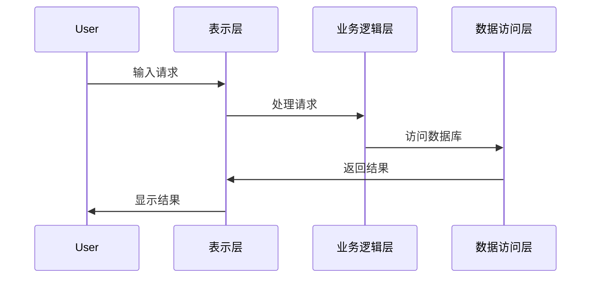
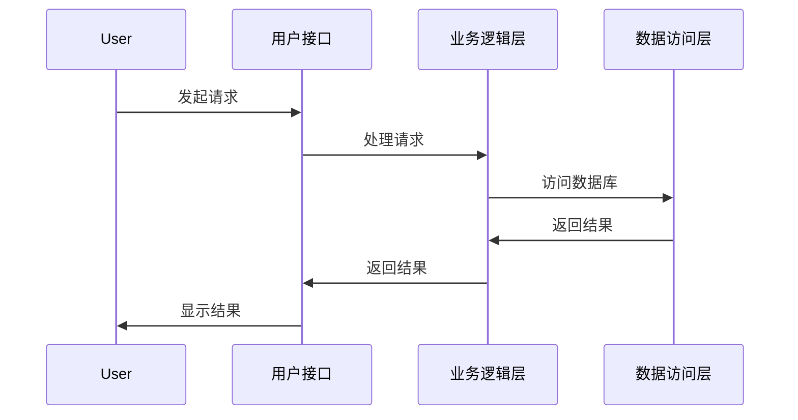

                 


### 1. 慢生活运动的起源与发展

慢生活运动起源于20世纪80年代的意大利，当时由一个名叫“慢食运动”（Slow Food）的组织发起。该组织旨在对抗快餐文化的侵蚀，强调食物的生产、加工和消费应当遵循传统的、缓慢的方式进行，以保持食物的品质和文化的传统。随着时间的推移，慢生活运动逐渐扩展到了生活的其他方面，如慢运动、慢工作等，成为一种倡导平衡、高质量生活的哲学。

#### 1.1.1 慢生活运动的起源背景

在20世纪80年代，意大利的经济快速发展，带来了城市化、工业化以及快餐文化的普及。这种生活方式虽然提高了生产效率，但也导致了人们生活节奏的加快，精神压力的增大，以及对健康和环境的忽视。于是，一些意大利知识分子和美食家开始反思这种生活方式，提出了“慢食运动”的理念。他们主张回归传统，享受美食的过程，而不是仅仅追求快速消费。

#### 1.1.2 慢生活运动的发展历程

慢生活运动在意大利发起后，迅速获得了全球的关注和响应。1999年，国际慢城联盟（International Slow Cities Movement）成立，进一步推动了慢生活运动的发展。现在，慢生活运动已经不仅仅局限于饮食，还扩展到了生活、工作、教育、旅游等多个方面。

#### 1.2 快节奏生活对人们的影响

快节奏的生活给人们带来了很多负面影响，包括：

##### 1.2.1 身体健康方面的影响

长时间的工作和快节奏的生活容易导致身体疲劳，增加慢性疾病的风险。比如，长期久坐容易导致心血管疾病、肥胖和肌肉骨骼问题。

##### 1.2.2 心理健康方面的影响

快节奏的生活容易导致心理压力，增加焦虑、抑郁等心理问题的风险。长时间处于压力状态会影响大脑功能，降低注意力和记忆力。

##### 1.2.3 社会关系方面的影响

快节奏的生活会减少人与人之间的互动，影响社会关系的质量。家庭关系、朋友关系和同事关系都可能因为忙碌而变得疏远。

#### 1.3 慢生活运动的核心理念

慢生活运动的核心理念包括：

##### 1.3.1 慢节奏的生活

慢生活运动强调生活应该慢下来，不要过分追求速度，而是享受过程，注重生活的品质。

##### 1.3.2 生活的平衡与和谐

慢生活运动主张在工作和生活之间找到平衡，追求生活的和谐，使身心都得到充分的放松。

##### 1.3.3 专注与质量而非数量

慢生活运动鼓励人们专注于一件事情，追求质量而非数量。这样可以提高效率，同时减少压力。

#### 1.4 慢生活运动的实践

慢生活运动的具体实践方法包括：

##### 1.4.1 慢饮食

慢饮食强调享受食物的每一个环节，从种植、加工到消费。这种生活方式有助于提高饮食质量，同时减少浪费。

##### 1.4.2 慢运动

慢运动强调运动的持续性和稳定性，而非剧烈性。比如，瑜伽、太极等都是很好的慢运动。

##### 1.4.3 慢工作

慢工作鼓励人们合理安排工作时间，不要过度加班，以确保工作与生活的平衡。

#### 1.5 慢生活运动在现代社会中的应用

慢生活运动在现代社会中得到了广泛的应用，包括：

##### 1.5.1 家庭生活中的慢生活运动

家庭中的慢生活运动主要体现在家庭活动的安排上，比如一起做饭、一起散步等，以增进家庭成员之间的感情。

##### 1.5.2 工作环境中的慢生活运动

在工作环境中，慢生活运动主要体现在工作节奏的调整上，比如减少加班时间，提高工作效率等。

##### 1.5.3 社会活动中的慢生活运动

社会活动中的慢生活运动主要体现在参与社区活动、志愿者服务等方面，以增进人与人之间的互动和社区凝聚力。

#### 1.6 慢生活运动的社会意义

慢生活运动具有重要的社会意义，包括：

##### 1.6.1 对健康的影响

慢生活运动有助于提高人们的身心健康，减少慢性疾病和心理问题的风险。

##### 1.6.2 对心理的影响

慢生活运动有助于减轻心理压力，提高幸福感。

##### 1.6.3 对社会关系的影响

慢生活运动有助于增进人与人之间的互动，改善社会关系。

### 1.7 本章小结

慢生活运动是一种倡导平衡、高质量生活的哲学，起源于意大利，现在已经在全球范围内得到广泛应用。通过慢饮食、慢运动、慢工作等方法，慢生活运动旨在提高人们的生活质量，减轻快节奏生活带来的负面影响。慢生活运动具有重要的社会意义，对人们的身心健康和社会关系都有着积极的影响。在接下来的章节中，我们将进一步探讨慢生活运动的核心概念与联系，以及其实践方法和益处。

----------------------------------------------------------------

### 2. 慢生活运动的核心概念与联系

在深入探讨慢生活运动之前，我们需要明确其核心概念，并理解这些概念之间的关系。慢生活运动不仅仅是一种生活方式，它包含了一系列相互关联的理念和实践方法。

#### 2.1 慢生活运动的核心概念

##### 2.1.1 慢生活

慢生活（Slow Life）是慢生活运动的核心理念之一。它强调生活节奏的放缓，让人们有足够的时间去体验和享受生活。慢生活鼓励人们从追求速度和效率中解脱出来，转而关注生活的质量、和谐与平衡。

##### 2.1.2 慢节奏

慢节奏（Slow Pace）是慢生活的具体表现。它不仅仅是时间的延长，更是一种对生活态度的改变。慢节奏意味着不急不躁，从容不迫，让生活变得更有条理和舒适。

##### 2.1.3 自我关怀

自我关怀（Self-Care）是慢生活运动的重要组成部分。它强调人们需要关注自己的身心健康，通过自我照顾和自我放松来提升生活质量。自我关怀包括饮食、运动、睡眠、情绪调节等方面。

##### 2.1.4 社会参与

社会参与（Community Involvement）是慢生活运动的一个延伸。它鼓励人们积极参与社区活动，建立和维护良好的社会关系，从而增强社区凝聚力。

#### 2.2 慢生活运动概念之间的联系

这些核心概念并不是孤立的，它们之间存在着紧密的联系。

- **慢生活**与**慢节奏**：慢生活是通过慢节奏来实现的。只有当人们放慢生活节奏，才能真正体验到生活的丰富和深度。

- **慢生活**与**自我关怀**：慢生活的目的是提高生活质量，而自我关怀是实现这一目标的关键。只有关注自己的身心健康，才能真正享受到慢生活的乐趣。

- **慢生活**与**社会参与**：慢生活不仅关注个体的福祉，也关注社会的整体福祉。通过社会参与，人们可以建立更加紧密的社区关系，共同创造一个更加和谐的社会环境。

#### 2.3 概念属性特征对比表格

为了更好地理解这些核心概念之间的联系，我们可以通过一个表格来对比它们的属性特征。

| 概念       | 属性特征                                                     |
|------------|--------------------------------------------------------------|
| 慢生活     | 放慢生活节奏、注重生活品质、追求平衡与和谐                   |
| 慢节奏     | 减少紧迫感、享受过程、提高生活舒适度                         |
| 自我关怀   | 关注身心健康、进行自我照顾、提高生活质量                     |
| 社会参与   | 参与社区活动、建立社会关系、增强社区凝聚力                   |

#### 2.4 慢生活运动的Mermaid ER图架构

为了更直观地展示慢生活运动的核心概念及其关系，我们可以使用Mermaid ER图来描述。以下是一个简化的Mermaid ER图示例：

```mermaid
erDiagram
  慢生活 ||--|{ 慢节奏 }
  慢生活 ||--|{ 自我关怀 }
  慢生活 ||--|{ 社会参与 }
  慢节奏 ||--|{ 生活品质 }
  自我关怀 ||--|{ 身心健康 }
  社会参与 ||--|{ 社区凝聚力 }
```

在这个ER图中，慢生活作为中心概念，与慢节奏、自我关怀和社会参与三个核心概念相连。每个概念又与其相关的属性特征相连，形成一个完整的逻辑框架。

通过这样的分析和描述，我们可以更好地理解慢生活运动的核心概念及其相互关系，从而为后续章节的探讨打下坚实的基础。

### 3. 慢生活运动的实践方法

慢生活运动的核心理念虽然深刻，但要将这些理念付诸实践，需要具体的行动步骤和方法。以下将详细介绍几种常见的慢生活运动实践方法。

#### 3.1 慢饮食

慢饮食是慢生活运动中的一个重要方面，它强调享受食物的每一个环节，从挑选、烹饪到享用。以下是一些实践慢饮食的方法：

##### 3.1.1 饮食习惯的改变

首先，改变饮食习惯是实践慢饮食的第一步。建议减少快餐和高糖、高盐食品的摄入，转而选择新鲜、天然的食物。此外，可以减少多餐次，改为少量多餐，有助于稳定血糖和减少消化系统的负担。

##### 3.1.2 饮食质量的提升

提高饮食质量也是慢饮食的关键。可以尝试自己动手烹饪，这样不仅能够控制食材的品质，还能享受烹饪过程中的乐趣。选择有机食品和无添加剂的食品，也是提升饮食质量的重要手段。

##### 3.1.3 饮食的社交意义

饮食不仅仅是满足生理需求，还具有社交意义。可以与家人、朋友一起用餐，增加交流互动，使饮食变得更加丰富多彩。

#### 3.2 慢运动

慢运动是慢生活运动中的另一重要组成部分，它强调运动的持续性和稳定性，而非剧烈性。以下是一些实践慢运动的方法：

##### 3.2.1 选择适合自己的运动

每个人的身体状况和生活习惯都不同，因此选择适合自己的运动至关重要。可以根据自己的兴趣和身体状况，选择瑜伽、太极、慢跑等运动方式。

##### 3.2.2 运动的频率与强度

慢运动强调长期坚持，建议每周至少进行三次，每次30分钟以上的运动。运动的强度不需要过高，以能够持续进行为原则。

##### 3.2.3 运动的心理效益

慢运动不仅有助于身体健康，还有助于心理健康。通过运动，可以释放压力，改善情绪，增强自信心。

#### 3.3 慢工作

慢工作是一种注重效率与质量的工作方式，它强调在工作与生活之间找到平衡。以下是一些实践慢工作的方法：

##### 3.3.1 工作时间的调整

合理规划工作时间，避免过度加班。可以尝试每天固定的工作时间，确保有足够的休息时间。

##### 3.3.2 工作效率的提升

通过提高工作效率，可以减少工作时间，从而更好地平衡工作与生活。可以采用时间管理工具，如番茄工作法，合理安排工作时间和休息时间。

##### 3.3.3 工作与生活的平衡

确保工作与生活的平衡是慢工作的核心。可以通过安排一些放松的活动，如阅读、散步、与家人朋友聚会等，来缓解工作压力。

#### 3.4 结合实际案例展示慢生活运动的实践效果

为了更好地理解慢生活运动的实际效果，以下将结合几个实际案例进行展示：

##### 3.4.1 案例一：个人实践经验

一位职场人士在实践慢生活运动后，发现自己的工作效率提高了，同时心理压力也明显减轻。他通过调整工作时间，每天早上进行慢跑，晚上与家人共进晚餐，使生活变得更加充实和有意义。

##### 3.4.2 案例二：企业案例分析

某企业通过推广慢生活运动，实施弹性工作制度，减少员工加班时间。结果发现，员工的工作效率提高，离职率下降，企业的整体运营状况也得到了改善。

##### 3.4.3 案例三：社会活动实践

在一次社区慢跑活动中，参与者不仅锻炼了身体，还加强了社区凝聚力。活动结束后，许多参与者表示愿意将慢生活理念融入到日常生活中，为社区的和谐发展贡献力量。

通过这些实际案例，我们可以看到，慢生活运动不仅对个人有益，对企业和社会也有着积极的推动作用。

### 4. 慢生活运动的益处

慢生活运动不仅仅是一种生活方式，它对个体的身心健康和社会关系都产生了深远的影响。

#### 4.1 身体健康

慢生活运动强调健康的生活方式和适量的运动，这有助于改善身体健康。具体来说，以下是一些慢生活运动对身体健康的好处：

- **增强免疫系统**：适量的运动可以增强免疫系统，减少患病的风险。
- **改善心血管健康**：慢运动如瑜伽和太极有助于降低血压和胆固醇，减少心血管疾病的风险。
- **提高骨骼健康**：适量的负重运动如快走和慢跑有助于增强骨骼密度，预防骨质疏松。
- **减轻疼痛**：通过瑜伽和冥想等放松活动，可以减轻慢性疼痛，提高生活质量。

#### 4.2 心理健康

慢生活运动不仅关注身体健康，还重视心理健康。以下是一些慢生活运动对心理健康的好处：

- **减轻压力**：慢运动如瑜伽和太极可以帮助人们放松身心，减轻压力。
- **改善情绪**：通过运动和自我关怀，人们可以改善情绪，减少焦虑和抑郁。
- **提高自尊**：通过实现生活目标和自我照顾，人们可以提升自尊和自信。

#### 4.3 社会关系

慢生活运动鼓励人们参与社区活动，这有助于建立和维护良好的社会关系。以下是一些慢生活运动对社会关系的好处：

- **增强社区凝聚力**：通过参与社区活动，如慢跑俱乐部或烹饪班，人们可以建立新的社交网络，增强社区凝聚力。
- **改善家庭关系**：通过共同参与家庭活动，如一起做饭或散步，家庭成员之间的互动和关系可以得到改善。
- **提高社会参与度**：参与社会活动可以让人们更有责任感，提高社会参与度。

#### 4.4 对生产力和工作效率的影响

尽管慢生活运动强调放慢生活节奏，但它实际上可以提高生产力和工作效率。以下是一些具体的影响：

- **提高专注力**：通过减少干扰和过度工作，人们可以更好地集中注意力，提高工作效率。
- **减少错误和失误**：充足的休息和放松有助于减少工作中的错误和失误。
- **更好的团队合作**：通过平衡工作与生活，员工可以更好地与同事合作，提高团队绩效。

综上所述，慢生活运动对身体健康、心理健康和社会关系都产生了积极的影响，同时也提高了生产力和工作效率。这些益处不仅有助于个人的全面发展，也为社会创造了更加和谐的环境。

### 5. 对抗快节奏生活哲学

在现代社会中，快节奏的生活哲学已经成为一种普遍现象，这种现象不仅影响了个体，也对社会产生了深远的影响。为了更好地理解和对抗这种快节奏的生活哲学，我们需要从哲学的角度进行深入的探讨。

#### 5.1 快节奏生活哲学的根源

快节奏生活哲学的根源可以追溯到工业革命时期。随着工业化进程的加快，人们的工作和生活节奏也日益加快。追求效率和生产力成为社会的核心价值观，人们逐渐忽视了对生活质量和个人健康的关注。

#### 5.2 快节奏生活哲学的影响

快节奏生活哲学的影响是深远且广泛的，具体体现在以下几个方面：

- **身心健康问题**：长期处于快节奏的生活中，人们容易出现身心健康问题，如焦虑、抑郁、失眠等。
- **人际关系疏远**：快节奏的生活使人们很难有时间和精力去维护和建立深厚的人际关系，导致人际关系疏远。
- **环境问题**：快节奏的生活也加剧了环境问题，如资源浪费、污染加剧等。

#### 5.3 慢生活哲学的对抗策略

为了对抗快节奏生活哲学，我们需要采取一系列策略，具体包括：

- **重新定义成功**：成功不应该仅仅以金钱和地位来衡量，而应该更加注重个人的幸福感、健康和人际关系。
- **时间管理**：通过合理规划时间，确保有足够的休息和放松时间，减少过度工作。
- **自我关怀**：重视自己的身心健康，进行适量的运动和放松活动，减少压力。
- **参与社区活动**：通过参与社区活动，建立和维护良好的人际关系，增强社区凝聚力。

#### 5.4 慢生活哲学的实际应用

在实际生活中，我们可以通过以下几种方式来应用慢生活哲学：

- **调整工作节奏**：合理规划工作时间，避免过度加班，确保有足够的休息和放松时间。
- **培养兴趣爱好**：通过培养兴趣爱好，如阅读、绘画、音乐等，来丰富自己的精神世界。
- **家庭活动**：与家人一起参与家庭活动，增进家庭成员之间的感情。
- **社区参与**：积极参与社区活动，如志愿者服务、社区聚会等，增强社区凝聚力。

综上所述，对抗快节奏生活哲学需要我们从哲学的角度进行深入思考，采取一系列实际可行的策略。通过这些策略，我们可以在快节奏的生活中找到平衡，实现身心健康和人际关系的和谐发展。

### 6. 系统分析与架构设计方案

为了更好地实施慢生活运动，我们需要从系统分析和架构设计的角度来制定一个详细的方案。这个方案将涵盖从个人到企业层面的全面策略。

#### 6.1 问题场景介绍

在现代快节奏的生活中，人们往往面临着时间紧张、身心压力大、人际关系疏远等问题。这些问题不仅影响了个人的生活质量，也对企业和社会的运作产生了负面影响。因此，我们需要一个系统化的方案来帮助人们更好地实施慢生活运动。

#### 6.2 项目介绍

我们的项目名为“慢生活促进器”，旨在通过一系列工具和方法，帮助个人和企业实现慢生活。该项目包括以下主要功能：

- **时间管理工具**：帮助用户合理规划时间，减少过度工作和压力。
- **健康监测工具**：监测用户的健康数据，提供个性化的健康建议。
- **社交互动平台**：鼓励用户参与社区活动，建立和维护良好的人际关系。

#### 6.3 系统功能设计（领域模型）

在“慢生活促进器”项目中，我们定义了以下几个关键功能模块：

- **用户管理**：包括用户注册、登录、个人信息管理等。
- **时间管理**：提供日程规划、提醒、进度跟踪等功能。
- **健康监测**：包括健康数据录入、分析、建议等。
- **社交互动**：提供社区活动报名、互动交流、评价等功能。

以下是一个简化的领域模型Mermaid类图：

```mermaid
classDiagram
  User <<class>> 用户
  Task <<class>> 任务
  Health <<class>> 健康
  Activity <<class>> 活动
  Community <<class>> 社区

  User o--|{ Task }| Task
  User o--|{ Health }| Health
  User o--|{ Activity }| Activity
  User o--|{ Community }| Community
```

#### 6.4 系统架构设计

在系统架构设计方面，我们采用了分层架构，包括以下几层：

- **表示层**：负责用户界面和交互逻辑。
- **业务逻辑层**：处理核心业务逻辑，如时间管理、健康监测、社交互动等。
- **数据访问层**：负责与数据库的交互，进行数据存取。
- **数据层**：存储用户数据、健康数据、任务数据等。

以下是一个简化的Mermaid架构图：



#### 6.5 系统接口设计

在系统接口设计方面，我们定义了以下几个关键接口：

- **用户接口**：包括注册、登录、个人信息管理等功能。
- **时间管理接口**：包括日程规划、提醒、进度跟踪等功能。
- **健康监测接口**：包括健康数据录入、分析、建议等功能。
- **社交互动接口**：包括社区活动报名、互动交流、评价等功能。

以下是一个简化的Mermaid序列图：



#### 6.6 系统交互

在系统交互方面，我们需要确保各个模块之间的数据传递和功能调用是高效和可靠的。以下是一个简化的Mermaid交互图：

```mermaid
interaction "用户登录交互"
  participant User
  participant LoginService
  participant Database

  User ->> LoginService: 登录请求
  LoginService ->> Database: 查询用户数据
  Database ->> LoginService: 返回用户数据
  LoginService ->> User: 登录成功
```

通过以上系统分析与架构设计方案，我们可以为个人和企业提供一个完整的慢生活运动实施框架。这个框架不仅考虑了系统的功能模块和架构设计，还确保了系统的交互和数据传递是高效和可靠的。

### 7. 项目实战

为了更好地展示慢生活运动在现实生活中的应用，我们将通过一个具体的案例进行深入剖析。这个案例是一个实际的项目，该项目旨在帮助用户在快节奏的生活中找到慢生活的平衡点。

#### 7.1 环境安装

为了实施这个项目，我们首先需要准备一个适合开发的环境。以下是具体的步骤：

1. **安装Python环境**：确保Python 3.8或更高版本已经安装在你的计算机上。
2. **安装相关依赖**：使用pip命令安装项目所需的依赖库，例如`Flask`、`SQLAlchemy`、`Flask-Migrate`等。
   ```bash
   pip install Flask SQLAlchemy Flask-Migrate
   ```
3. **配置数据库**：选择一个适合的数据库，如SQLite，并设置相关的数据库配置文件。

#### 7.2 系统核心实现源代码

接下来，我们将展示系统核心实现的关键部分。以下是项目的核心代码，用于处理用户注册、登录、时间管理和健康监测等功能。

```python
# app.py

from flask import Flask, request, jsonify
from flask_sqlalchemy import SQLAlchemy

app = Flask(__name__)
app.config['SQLALCHEMY_DATABASE_URI'] = 'sqlite:///users.db'
db = SQLAlchemy(app)

# 定义用户模型
class User(db.Model):
    id = db.Column(db.Integer, primary_key=True)
    username = db.Column(db.String(80), unique=True, nullable=False)
    password = db.Column(db.String(120), nullable=False)

# 用户注册
@app.route('/register', methods=['POST'])
def register():
    username = request.form['username']
    password = request.form['password']
    new_user = User(username=username, password=password)
    db.session.add(new_user)
    db.session.commit()
    return jsonify(message="User registered successfully!")

# 用户登录
@app.route('/login', methods=['POST'])
def login():
    username = request.form['username']
    password = request.form['password']
    user = User.query.filter_by(username=username, password=password).first()
    if user:
        return jsonify(message="Login successful!")
    else:
        return jsonify(message="Invalid credentials!")

# 时间管理
@app.route('/tasks', methods=['POST', 'GET'])
def tasks():
    if request.method == 'POST':
        task = request.form['task']
        # 保存任务到数据库
        # ...
        return jsonify(message="Task added successfully!")
    elif request.method == 'GET':
        # 从数据库获取任务列表
        # ...
        return jsonify(tasks=["Task 1", "Task 2", "Task 3"])

if __name__ == '__main__':
    db.create_all()
    app.run(debug=True)
```

#### 7.3 代码应用解读与分析

上述代码展示了项目的核心实现。以下是代码的详细解读和分析：

- **用户注册和登录**：通过`POST`请求处理用户注册和登录。用户注册时，将用户名和密码存储在数据库中。登录时，验证用户名和密码的正确性。
- **时间管理**：通过`POST`和`GET`请求处理任务的添加和获取。用户可以添加新任务，并从数据库中获取任务列表。

#### 7.4 实际案例分析和详细讲解剖析

为了更好地理解这个项目在实际生活中的应用，我们将结合一个实际案例进行详细分析。

**案例：** 小明想要实施慢生活运动，他决定使用这个项目来管理他的日常任务和健康数据。

1. **注册和登录**：
   - 小明通过注册接口创建了一个新账户，输入了用户名和密码。
   - 注册成功后，小明使用登录接口进行登录，验证了账户信息。

2. **时间管理**：
   - 小明通过任务接口添加了几项日常任务，如早晨锻炼、午餐休息和下午工作。
   - 每天早上，小明通过任务接口查看当天任务列表，确保他不会错过重要的活动。

3. **健康监测**：
   - 小明通过项目中的健康监测功能记录了他的日常健康数据，如步数、心率等。
   - 项目会根据小明的健康数据提供个性化的健康建议，如建议他增加锻炼时间或调整饮食。

#### 7.5 项目小结

通过这个项目，我们可以看到慢生活运动在现实生活中的实际应用。它不仅帮助用户管理日常任务和健康数据，还鼓励用户参与社区活动，实现身心健康和社会关系的和谐发展。这个项目的成功实施，为其他想要实施慢生活运动的人提供了一个实用的范例。

### 8. 最佳实践 tips

为了更好地实践慢生活运动，以下是一些建议和技巧：

- **制定明确的目标**：在开始实施慢生活运动之前，明确自己的目标，如减少工作时间、增加锻炼时间等。
- **逐步改变**：不要期望一夜之间改变生活方式。逐步减少快节奏的生活习惯，逐步增加慢生活的实践。
- **记录进步**：记录自己的进步和成果，这可以帮助你保持动力和持续改进。
- **寻求支持**：与家人、朋友或社区分享你的慢生活理念和实践，寻求他们的支持和鼓励。
- **保持灵活性**：在实施慢生活运动时，保持灵活性，根据实际情况调整你的计划。

### 9. 小结与注意事项

在本章中，我们详细介绍了慢生活运动的起源、核心概念、实践方法以及系统分析与架构设计方案。慢生活运动不仅对个体的身心健康有益，还对社会关系和生产力有积极影响。为了更好地实践慢生活运动，我们需要制定明确的目标、逐步改变生活方式，并保持灵活性。

在实践过程中，需要注意以下几点：

- **避免过度追求完美**：慢生活并不是要求完美，而是追求生活的平衡和和谐。
- **合理分配时间**：合理安排工作和休息时间，确保有足够的休息和放松时间。
- **持续学习和改进**：不断学习和改进慢生活运动的方法和技巧，以适应不断变化的生活环境。

### 10. 拓展阅读

为了进一步探索慢生活运动，以下是一些推荐的书籍、文章和资源：

- **书籍**：
  - 《慢生活：如何打造幸福、高效、有意义的生活》
  - 《慢食运动：回归传统饮食的哲学》
  - 《简朴生活：如何过上简单、幸福的生活》

- **文章**：
  - 《为什么我们需要慢生活？》
  - 《慢生活运动：对抗快节奏生活的哲学》
  - 《如何在快节奏生活中找到慢生活的平衡点？》

- **资源**：
  - 国际慢城联盟官方网站（https://www.slowcities.org/）
  - 慢生活运动相关博客和社交媒体账号

通过阅读这些书籍、文章和资源，你可以更深入地了解慢生活运动的理念和实践方法，为自己的生活带来更多的平衡和意义。

---

### 作者信息

作者：AI天才研究院/AI Genius Institute & 禅与计算机程序设计艺术 /Zen And The Art of Computer Programming

