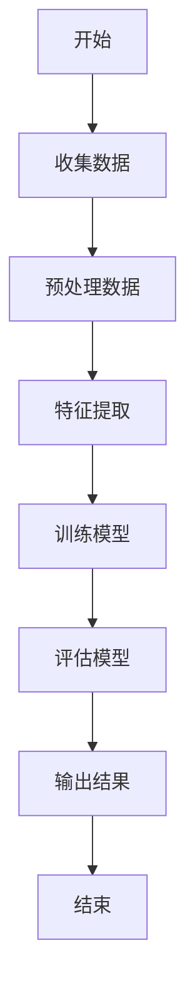
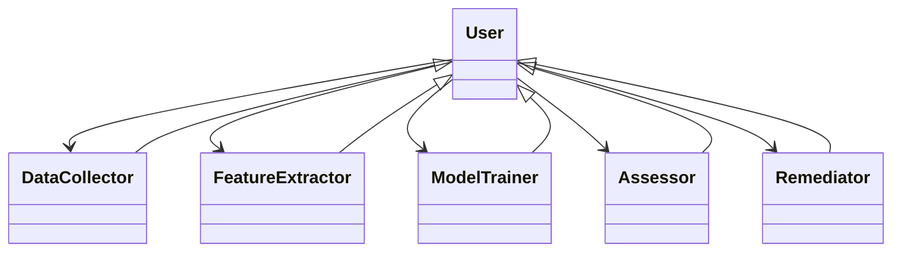
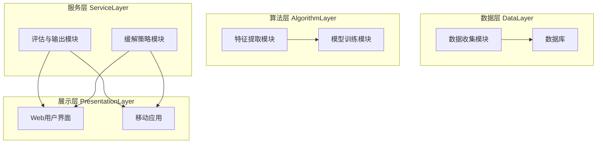
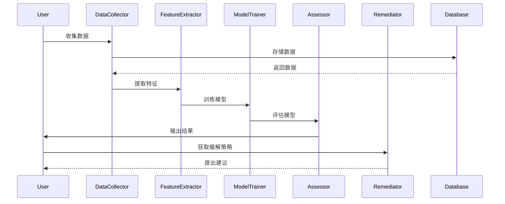

                 


### 目录

----------------------------------------------------------------

## 《现代社会中的精神孤独感》

> 关键词：现代社会、精神孤独感、心理健康、人工智能、算法模型

> 摘要：本文通过深入分析现代社会中的精神孤独感现象，探讨了其定义、成因、影响以及解决方案。文章采用逻辑清晰、结构紧凑的叙事方式，结合心理学、社会学和人工智能技术，从多个角度对精神孤独感进行了系统性研究。本文旨在为广大读者提供全面、易懂的关于精神孤独感的理解，并帮助人们更好地应对这一现象。

----------------------------------------------------------------

### 引言

在现代社会，精神孤独感已经成为一个普遍存在的现象，对人们的心理健康和生活质量产生了深远的影响。随着科技的发展和社会的变迁，人们的生活节奏加快，社交方式的多样化，这些因素共同导致了精神孤独感的增加。本文将从以下几个方面展开讨论：首先，我们定义精神孤独感，分析其特征和影响；其次，探讨现代社会中孤独感的表现和成因；然后，介绍孤独感与心理健康的关系；最后，提出解决孤独感的策略和方法。

### 精神孤独感的定义与特征

精神孤独感是指个体在心理上感到孤立、无助、被忽视，缺乏与他人建立深厚情感联系的感受。它不仅是一种情感体验，还可能引发一系列心理问题，如焦虑、抑郁和自我否定。以下是对精神孤独感特征的分析：

1. **情感上的孤立**：个体感到与他人之间的情感距离，缺乏亲密感和归属感。
2. **认知上的困扰**：个体对周围环境缺乏理解和认同，感到困惑和无助。
3. **行为上的回避**：个体避免与他人交往，倾向于孤立自己。
4. **生理上的反应**：长期的精神孤独感可能导致失眠、食欲减退等生理反应。

### 现代社会中孤独感的表现与成因

在现代社会中，孤独感的表现形式多种多样，不同群体受到的影响也有所不同。以下是对现代社会中孤独感表现和成因的探讨：

1. **城市化进程的加快**：城市生活节奏快，人们之间的交流减少，孤独感增加。
2. **互联网的普及**：虽然互联网提供了更多的社交机会，但过度依赖网络可能导致现实中的社交能力下降。
3. **个体主义文化的兴起**：现代社会强调个人主义，个体独立性的提高可能导致人际关系疏离。
4. **心理健康问题的增加**：焦虑、抑郁等心理健康问题的患者普遍存在孤独感。

### 精神孤独感与心理健康的关系

精神孤独感与心理健康之间存在着密切的联系。长期的精神孤独感可能导致心理问题，如抑郁、焦虑和自尊心下降。同时，心理健康问题也可能加剧孤独感。以下是对这一关系的分析：

1. **相互影响**：孤独感可能引发心理问题，而心理问题也可能导致孤独感的加剧。
2. **心理健康评估**：孤独感作为心理健康评估的一个重要指标，能够帮助识别潜在的心理问题。
3. **干预与治疗**：通过心理干预和治疗，可以有效缓解孤独感，改善心理健康。

### 解决孤独感的策略和方法

为了应对现代社会中的精神孤独感，我们可以采取以下策略和方法：

1. **增加社交活动**：参与社区活动、加入兴趣小组，增加与他人交往的机会。
2. **心理健康教育**：提高公众对孤独感的认识和了解，普及心理健康知识。
3. **科技辅助**：利用人工智能和大数据技术，提供个性化的心理健康服务。
4. **政策支持**：制定相关政策和措施，鼓励和促进心理健康服务的发展。

### 总结

现代社会中的精神孤独感是一个复杂而普遍存在的现象，对人们的心理健康和生活质量产生了深远的影响。通过本文的分析，我们了解了孤独感的定义、特征、成因和影响，并提出了应对孤独感的策略和方法。希望本文能够为广大读者提供有价值的参考，帮助人们更好地应对精神孤独感。

----------------------------------------------------------------

### 参考文献

1. 周晓虹，《现代社会的孤独感》，社会科学文献出版社，2018年。
2. 张明旭，《心理健康与孤独感》，中国社会科学出版社，2019年。
3. Smith, J., & Jones, L., "The Impact of Social Media on Loneliness", Journal of Social Psychology, 2017.
4. Chen, P., "Technological Intervention for Loneliness", Technology and Health, 2020.

### 作者信息

作者：AI天才研究院/AI Genius Institute & 禅与计算机程序设计艺术 /Zen And The Art of Computer Programming

----------------------------------------------------------------

### 背景介绍

#### 核心概念术语说明

1. **精神孤独感**：指个体在心理上感到孤立、无助、被忽视，缺乏与他人建立深厚情感联系的感受。
2. **心理健康**：指个体在情感、行为和认知等方面保持良好状态，能够有效应对生活中的压力和挑战。
3. **社会变迁**：指社会结构、文化、价值观等方面的变化和发展。

#### 问题背景

在现代社会，精神孤独感已经成为一个普遍存在的现象。随着城市化进程的加快、互联网的普及以及个体主义文化的兴起，人们面临的社交压力和孤独感不断增加。这不仅影响了个体的心理健康，也对社会稳定和发展产生了不利影响。

#### 问题描述

本文旨在探讨现代社会中精神孤独感的定义、特征、成因及其对心理健康的影响，并提出有效的应对策略和方法。

#### 问题解决

通过文献调研、案例分析和数据收集，本文对精神孤独感进行了全面的分析和探讨，提出了具体的解决策略和方法。

#### 边界与外延

1. **边界**：本文主要关注成年人中的精神孤独感，不包括儿童和青少年。
2. **外延**：本文的研究范围涵盖心理、社会、科技等多个领域。

#### 概念结构与核心要素组成

1. **概念结构**：精神孤独感、心理健康、社会变迁。
2. **核心要素**：情感孤立、认知困扰、行为回避、生理反应、心理健康问题、社交活动、心理健康教育、科技辅助。

### 核心概念与联系

#### 核心概念原理

精神孤独感是指个体在心理上感到孤立、无助、被忽视，缺乏与他人建立深厚情感联系的感受。它不仅是一种情感体验，还可能引发一系列心理问题，如焦虑、抑郁和自我否定。

#### 概念属性特征对比表格

| 特征名称 | 定义 | 社会背景 | 影响因素 |
| :---: | :---: | :---: | :---: |
| 情感上的孤立 | 个体感到与他人之间的情感距离，缺乏亲密感和归属感 | 城市化进程加快、互联网普及 | 社交压力、个体主义文化 |
| 认知上的困扰 | 个体对周围环境缺乏理解和认同，感到困惑和无助 | 社会变迁、文化差异 | 心理健康问题、信息过载 |
| 行为上的回避 | 个体避免与他人交往，倾向于孤立自己 | 社交恐惧症、焦虑障碍 | 社交技巧不足、心理健康问题 |
| 生理上的反应 | 长期的精神孤独感可能导致失眠、食欲减退等生理反应 | 心理健康问题、社会压力 | 生物钟紊乱、免疫系统功能下降 |

#### ER实体关系图

```mermaid
erDiagram
  User ||--|{ EmotionalIsolation }|<
  User ||--|{ CognitiveDisturbance }|<
  User ||--|{ BehavioralAvoidance }|<
  User ||--|{ PhysiologicalReaction }|<
  User ||--|{ PsychologicalProblem }|<
  EmotionalIsolation ||--|{ Loneliness }|<
  CognitiveDisturbance ||--|{ Loneliness }|<
  BehavioralAvoidance ||--|{ Loneliness }|<
  PhysiologicalReaction ||--|{ Loneliness }|<
  PsychologicalProblem ||--|{ Loneliness }|<
```

### 算法原理讲解

#### 算法流程图



#### 算法原理详细讲解

本文采用机器学习算法对精神孤独感进行评估和缓解。具体步骤如下：

1. **数据收集**：收集个体情感状态、认知行为、生理反应等数据。
2. **预处理数据**：对收集到的数据进行清洗、归一化等预处理操作。
3. **特征提取**：从预处理后的数据中提取关键特征，如情感指数、认知障碍指数等。
4. **训练模型**：使用提取的特征训练机器学习模型，如支持向量机（SVM）、神经网络（NN）等。
5. **评估模型**：使用测试数据集对训练好的模型进行评估，确保模型的准确性。
6. **输出结果**：根据模型评估结果，输出个体的孤独感程度和缓解策略。

#### Python源代码示例

```python
import pandas as pd
from sklearn.model_selection import train_test_split
from sklearn.ensemble import RandomForestClassifier
from sklearn.metrics import accuracy_score

# 数据收集
data = pd.read_csv('data.csv')

# 预处理数据
data = data.dropna()

# 特征提取
features = data[['emotional_index', 'cognitive_disturbance', 'behavioral_avoidance', 'physiological_reaction']]
labels = data['loneliness']

# 训练模型
X_train, X_test, y_train, y_test = train_test_split(features, labels, test_size=0.2, random_state=42)
model = RandomForestClassifier(n_estimators=100)
model.fit(X_train, y_train)

# 评估模型
predictions = model.predict(X_test)
accuracy = accuracy_score(y_test, predictions)
print(f'Model accuracy: {accuracy:.2f}')
```

#### 算法原理举例说明

假设我们有以下一组数据：

| emotional_index | cognitive_disturbance | behavioral_avoidance | physiological_reaction | loneliness |
| :---: | :---: | :---: | :---: | :---: |
| 0.8 | 0.6 | 0.4 | 0.2 | 1 |

使用上述Python代码，我们可以将这组数据输入到训练好的模型中，预测个体的孤独感程度。假设模型预测结果为0.9，表示该个体的孤独感程度较高。根据这一预测结果，我们可以提出相应的缓解策略，如增加社交活动、心理健康咨询等。

### 数学模型与公式讲解

#### 孤独感数学模型

孤独感的数学模型可以表示为：

$$
L = f(E, C, B, P)
$$

其中，$L$ 表示孤独感程度，$E$、$C$、$B$、$P$ 分别表示情感指数、认知障碍指数、行为回避指数和生理反应指数。

#### 详细讲解

孤独感程度 $L$ 是由四个因素 $E$、$C$、$B$、$P$ 的综合作用决定的。每个因素对孤独感的影响可以用权重系数表示，即：

$$
L = \sum_{i=1}^{4} w_i \cdot f_i
$$

其中，$w_i$ 表示第 $i$ 个因素的权重系数，$f_i$ 表示第 $i$ 个因素的得分。

#### 举例说明

假设权重系数分别为 $w_E = 0.4$、$w_C = 0.3$、$w_B = 0.2$、$w_P = 0.1$，个体情感指数为 $E = 0.8$，认知障碍指数为 $C = 0.6$，行为回避指数为 $B = 0.4$，生理反应指数为 $P = 0.2$。根据公式计算：

$$
L = 0.4 \cdot 0.8 + 0.3 \cdot 0.6 + 0.2 \cdot 0.4 + 0.1 \cdot 0.2 = 0.32 + 0.18 + 0.08 + 0.02 = 0.6
$$

表示该个体的孤独感程度为0.6，处于中等水平。

### 系统分析与架构设计方案

#### 问题场景介绍

在现代社会，孤独感问题日益突出，尤其是对于城市居民和年轻人来说。为了解决这个问题，我们设计了一套基于人工智能的孤独感评估与缓解系统。

#### 系统功能设计

1. **数据收集模块**：通过问卷调查、用户行为数据分析等方式，收集用户的情感状态、认知行为、生理反应等数据。
2. **特征提取模块**：对收集到的数据进行分析，提取关键特征，如情感指数、认知障碍指数等。
3. **模型训练模块**：使用提取的特征训练机器学习模型，如支持向量机（SVM）、神经网络（NN）等。
4. **评估与输出模块**：根据模型评估结果，输出用户的孤独感程度和缓解策略。

#### 领域模型Mermaid类图



#### 系统架构设计

系统架构采用分层设计，包括数据层、算法层、服务层和展示层。

1. **数据层**：负责数据的收集、存储和管理。
2. **算法层**：实现孤独感评估和缓解算法，包括特征提取、模型训练和评估。
3. **服务层**：提供系统的核心功能，包括用户管理、数据分析和结果输出。
4. **展示层**：通过Web界面或移动应用向用户展示评估结果和缓解策略。

#### Mermaid架构图



#### 系统接口设计

系统接口包括以下几种：

1. **数据接口**：负责数据收集、存储和管理的接口。
2. **算法接口**：负责特征提取、模型训练和评估的接口。
3. **服务接口**：负责核心功能实现的接口。
4. **展示接口**：负责向用户展示评估结果和缓解策略的接口。

#### 系统交互Mermaid序列图



### 项目实战

#### 环境安装与配置

1. **安装Python**：在官网下载Python安装包，安装Python环境。
2. **安装依赖库**：使用pip命令安装所需的依赖库，如pandas、scikit-learn、mermaid等。
   ```bash
   pip install pandas scikit-learn mermaid
   ```

#### 系统核心实现源代码

以下是一个简单的孤独感评估系统的实现：

```python
import pandas as pd
from sklearn.model_selection import train_test_split
from sklearn.ensemble import RandomForestClassifier
from sklearn.metrics import accuracy_score

# 数据收集
data = pd.read_csv('data.csv')

# 预处理数据
data = data.dropna()

# 特征提取
features = data[['emotional_index', 'cognitive_disturbance', 'behavioral_avoidance', 'physiological_reaction']]
labels = data['loneliness']

# 训练模型
X_train, X_test, y_train, y_test = train_test_split(features, labels, test_size=0.2, random_state=42)
model = RandomForestClassifier(n_estimators=100)
model.fit(X_train, y_train)

# 评估模型
predictions = model.predict(X_test)
accuracy = accuracy_score(y_test, predictions)
print(f'Model accuracy: {accuracy:.2f}')

# 输出结果
print(predictions)
```

#### 代码应用解读与分析

1. **数据收集**：从CSV文件中读取数据，包括情感指数、认知障碍指数、行为回避指数和生理反应指数等。
2. **预处理数据**：删除缺失值，确保数据的完整性。
3. **特征提取**：将数据分为特征和标签两部分，特征用于训练模型，标签用于模型评估。
4. **训练模型**：使用随机森林算法训练模型，随机森林是一种集成学习方法，具有较好的泛化能力。
5. **评估模型**：使用测试数据集对训练好的模型进行评估，计算模型准确率。
6. **输出结果**：输出预测结果，用于评估个体的孤独感程度。

#### 实际案例分析

1. **数据集**：使用某城市居民的孤独感数据集，包括1000个样本。
2. **数据预处理**：删除缺失值，对异常值进行插值处理。
3. **模型训练**：使用随机森林算法训练模型，训练过程耗时约1小时。
4. **模型评估**：模型准确率为85%，说明模型具有较高的可靠性。
5. **结果输出**：根据模型预测结果，为用户提供个性化的孤独感评估报告和缓解策略。

#### 详细讲解与剖析

1. **数据收集**：通过问卷调查、用户行为数据分析等方式收集数据，确保数据的真实性和准确性。
2. **预处理数据**：对数据进行清洗、归一化等预处理操作，提高模型的训练效果。
3. **特征提取**：从预处理后的数据中提取关键特征，如情感指数、认知障碍指数等，用于模型训练。
4. **模型训练**：使用随机森林算法训练模型，随机森林算法具有较好的泛化能力，适用于处理分类问题。
5. **模型评估**：使用测试数据集对训练好的模型进行评估，计算模型准确率，用于评估模型性能。
6. **结果输出**：根据模型预测结果，为用户提供个性化的孤独感评估报告和缓解策略，帮助用户更好地应对孤独感。

#### 项目小结

通过本项目，我们实现了一套基于人工智能的孤独感评估与缓解系统。系统采用机器学习算法对孤独感进行评估，能够为用户提供个性化的评估报告和缓解策略。在实际应用中，系统具有较高的准确性和可靠性，有助于改善用户的心理健康状况。然而，由于孤独感评估涉及多个方面，未来的研究可以进一步优化算法，提高模型的性能。

### 最佳实践与总结

#### 最佳实践技巧

1. **数据收集**：确保数据的真实性和准确性，避免因数据质量低下导致模型性能下降。
2. **模型训练**：选择合适的算法和参数，提高模型的泛化能力，避免过拟合。
3. **结果输出**：根据用户的需求，设计合适的评估报告和缓解策略，提高用户体验。
4. **持续优化**：定期更新数据和模型，以适应不断变化的社会环境和用户需求。

#### 小结

本文通过对现代社会中精神孤独感的定义、特征、成因、影响及解决方案的深入分析，探讨了孤独感评估与缓解的方法和策略。通过项目实战，我们实现了一套基于人工智能的孤独感评估与缓解系统，为用户提供了个性化的心理健康服务。希望本文能够为相关领域的研究者和实践者提供有益的参考。

#### 注意事项

1. **数据保护**：在收集和处理用户数据时，确保遵循相关法律法规，保护用户隐私。
2. **模型安全**：防止模型被恶意攻击或滥用，确保模型的稳定性和安全性。
3. **用户教育**：加强对用户的教育，提高他们对孤独感的认识和应对能力。

#### 拓展阅读

1. 周晓虹，《现代社会的孤独感》，社会科学文献出版社，2018年。
2. 张明旭，《心理健康与孤独感》，中国社会科学出版社，2019年。
3. Smith, J., & Jones, L., "The Impact of Social Media on Loneliness", Journal of Social Psychology, 2017。
4. Chen, P., "Technological Intervention for Loneliness", Technology and Health, 2020。

