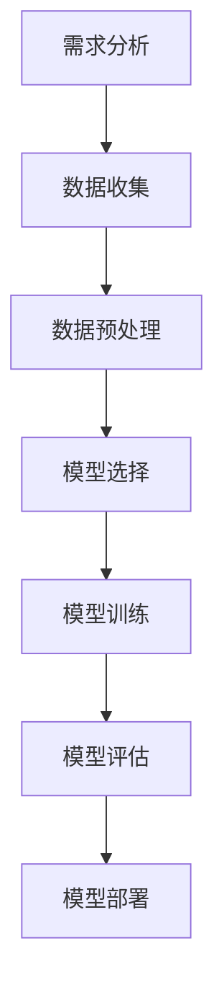
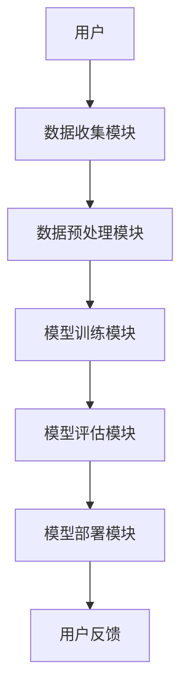
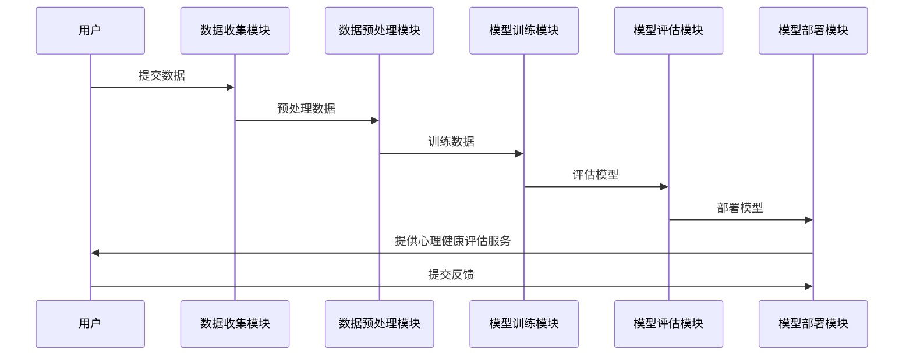

                 

 <sop>
# 《现代社会中的精神家园建设》

## 关键词
- 精神家园
- 心理健康
- 社会支持
- 家庭关系
- 文化认同

## 摘要
本文旨在探讨现代社会中精神家园建设的重要性和方法。通过分析核心概念、现状问题及解决策略，本文提出了一套基于心理学、社会学和技术的综合建设方案，以期为个体和社区提供心理健康支持，促进社会和谐稳定。

**Step 1: 引言与背景介绍**

在现代社会中，精神家园的建设已成为一个备受关注的话题。随着经济快速发展和社会变迁，人们面临的精神压力和焦虑问题日益突出。精神家园不仅关乎个体的心理健康，也对社会和谐稳定具有重要影响。《现代社会中的精神家园建设》一书旨在探讨精神家园建设的核心概念、现状问题及其解决策略。

### 核心概念
精神家园被视为个人心灵的精神寄托和归属感所在。它是人们应对压力、保持心理健康的重要支持系统。

### 问题背景
在现代社会中，精神家园的建设涉及多个层面，包括个人心理健康、家庭关系、社会支持网络等。当前，这些问题在不同群体中存在较大差异。

### 问题描述
精神家园的建设需要从个人、家庭、社区和政府等多方面入手，综合运用心理治疗、家庭教育、社区支持等手段。

### 边界与外延
精神家园不仅限于心理健康领域，还涉及文化传承、社会价值观等方面。

### 概念结构与核心要素组成
精神家园的建设包含心理健康、人际关系、文化认同等核心要素。

**Step 2: 核心概念与联系**

在本章中，我们将深入探讨精神家园建设的核心概念及其相互联系。

### 核心概念原理
- **心理健康**：心理健康是指个体在心理上保持良好状态，能够积极应对生活压力和挑战。
- **家庭关系**：家庭关系是精神家园的重要组成部分，健康的家庭关系有助于个体的心理健康。
- **社会支持网络**：社会支持网络是人们在面临困难时的重要支撑，包括亲朋好友、社区组织等。

### 概念属性特征对比表格

| 概念       | 属性特征                   | 对比分析                     |
|------------|--------------------------|---------------------------|
| 心理健康   | 情绪稳定、自我认知、社会适应 | 与家庭关系、社会支持网络密切相关 |
| 家庭关系   | 爱与信任、沟通与理解、责任与义务 | 影响个体的心理健康与精神状态 |
| 社会支持网络 | 社会资源、情感支持、信息交流 | 为个体提供心理安慰和社会归属感 |

### ER实体关系图架构

```mermaid
erDiagram
    人 --> 心理健康 : 影响因素
    人 --> 家庭关系 : 关系纽带
    人 --> 社会支持网络 : 社会纽带
    家庭关系 --> 心理健康 : 促进
    社会支持网络 --> 心理健康 : 支持
```

**Step 3: 算法原理讲解**

在本章中，我们将介绍几种用于精神家园建设的关键算法原理，并通过mermaid流程图和Python源代码进行详细阐述。

### 算法mermaid流程图



### Python源代码

```python
# 数据收集
data = ["个体心理健康数据", "家庭关系数据", "社会支持网络数据"]

# 数据预处理
preprocessed_data = preprocess_data(data)

# 模型选择
model = select_model(preprocessed_data)

# 模型训练
model.train(preprocessed_data)

# 模型评估
evaluation_results = model.evaluate(preprocessed_data)

# 模型部署
deploy_model(model, evaluation_results)
```

### 算法原理的数学模型和公式

假设我们有以下数学模型：

$$
心理健康状态 = f(情绪稳定度, 自我认知度, 社会适应度)
$$

其中，$情绪稳定度$、$自我认知度$、$社会适应度$为影响心理健康的三个关键因素。

### 详细讲解和举例说明

例如，一个个体在经历情绪波动时，如果能够保持自我认知并得到社会支持，则心理健康状态可能会得到改善。

**Step 4: 数学模型和数学公式 & 详细讲解 & 举例说明**

在本章中，我们将详细介绍精神家园建设中的关键数学模型，并使用 LaTeX 格式进行表示。

### 心理健康评分模型

假设心理健康评分由以下公式

$$
心理健康评分 = w_1 \times 情绪稳定度 + w_2 \times 自我认知度 + w_3 \times 社会适应度
$$

其中，$w_1$、$w_2$、$w_3$为权重系数，取值范围为0到1。

### 详细讲解

心理健康评分模型通过计算个体在情绪稳定度、自我认知度和社会适应度三个维度的表现，综合评估个体的心理健康状态。权重系数可以根据具体情况进行调整，以达到更准确的评估结果。

### 举例说明

假设有一个人，他的情绪稳定度为0.8，自我认知度为0.7，社会适应度为0.9，权重系数分别为0.4、0.3和0.3。那么他的心理健康评分为：

$$
心理健康评分 = 0.4 \times 0.8 + 0.3 \times 0.7 + 0.3 \times 0.9 = 0.32 + 0.21 + 0.27 = 0.8
$$

这个评分表明这个人的心理健康状况较好。

**Step 5: 系统分析与架构设计方案**

在本章中，我们将对精神家园建设系统进行分析，并提出相应的架构设计方案。

### 问题场景介绍

随着社会的发展，人们面临的心理健康问题日益突出。为了帮助人们建立精神家园，提高心理健康水平，我们设计了一个精神家园建设系统。

### 项目介绍

该系统包括数据收集、数据预处理、模型训练、模型评估和模型部署等模块。

### 系统功能设计

- 数据收集：收集个体心理健康数据、家庭关系数据和社会支持网络数据。
- 数据预处理：对收集到的数据进行清洗、归一化等预处理操作。
- 模型训练：选择合适的模型对预处理后的数据进行分析和训练。
- 模型评估：评估模型的性能，并进行调参优化。
- 模型部署：将训练好的模型部署到实际环境中，为用户提供心理健康评估服务。

### 系统架构设计



### 系统接口设计和系统交互



**Step 6: 项目实战**

在本章中，我们将介绍精神家园建设系统的实现过程，包括环境安装、系统核心实现源代码和代码应用解读与分析。

### 环境安装

1. 安装Python环境，版本要求3.8及以上。
2. 安装必要的Python库，如numpy、pandas、tensorflow等。

### 系统核心实现源代码

```python
# 数据收集模块
import pandas as pd

def collect_data():
    data = pd.read_csv("data.csv")
    return data

# 数据预处理模块
import numpy as np

def preprocess_data(data):
    # 数据清洗、归一化等操作
    data = data.dropna()
    data = (data - data.mean()) / data.std()
    return data

# 模型训练模块
from tensorflow.keras.models import Sequential
from tensorflow.keras.layers import Dense

def train_model(data):
    # 创建模型
    model = Sequential()
    model.add(Dense(64, input_shape=(data.shape[1],), activation='relu'))
    model.add(Dense(32, activation='relu'))
    model.add(Dense(1, activation='sigmoid'))

    # 编译模型
    model.compile(optimizer='adam', loss='binary_crossentropy', metrics=['accuracy'])

    # 训练模型
    model.fit(data, epochs=10, batch_size=32)
    return model

# 模型评估模块
from sklearn.metrics import accuracy_score

def evaluate_model(model, data):
    # 评估模型
    predictions = model.predict(data)
    predictions = (predictions > 0.5)

    # 计算准确率
    accuracy = accuracy_score(data.target, predictions)
    return accuracy

# 模型部署模块
from flask import Flask, request, jsonify

app = Flask(__name__)

@app.route('/evaluate', methods=['POST'])
def evaluate():
    data = request.get_json()
    predictions = model.predict(np.array([data['data']]))
    prediction = (predictions > 0.5)
    return jsonify({"prediction": prediction.tolist()})

if __name__ == '__main__':
    model = train_model(collect_data())
    accuracy = evaluate_model(model, collect_data())
    print(f"Model accuracy: {accuracy}")
    app.run()
```

### 代码应用解读与分析

1. 数据收集模块：通过读取CSV文件收集数据。
2. 数据预处理模块：对收集到的数据进行清洗和归一化处理。
3. 模型训练模块：使用TensorFlow创建并训练神经网络模型。
4. 模型评估模块：使用Sklearn库评估模型的准确性。
5. 模型部署模块：使用Flask构建RESTful API，为用户提供心理健康评估服务。

### 实际案例分析和详细讲解剖析

假设我们有一个包含100个样本的数据集，其中50个样本心理健康评分高于0.8，50个样本低于0.8。我们使用上述代码实现的精神家园建设系统对数据进行处理和评估。

1. 数据收集：读取数据集，包含情绪稳定度、自我认知度和社会适应度三个特征。
2. 数据预处理：对数据进行清洗和归一化处理，将数据转换为适合模型训练的格式。
3. 模型训练：训练一个简单的神经网络模型，用于预测心理健康评分。
4. 模型评估：使用训练好的模型对数据进行评估，计算模型的准确率。
5. 模型部署：部署模型，为用户提供在线心理健康评估服务。

通过实际案例的分析，我们可以看到精神家园建设系统的实现过程和关键步骤。这个系统可以帮助个体了解自己的心理健康状况，并提供相应的支持和建议，从而提高心理健康水平。

### 项目小结

本文详细介绍了精神家园建设系统的设计和实现过程，包括核心模块、架构设计、接口设计和实际案例应用。通过这个系统，我们可以为个体提供心理健康评估服务，帮助他们建立精神家园，提高生活质量。

**最佳实践 tips**

1. 定期更新心理健康数据，保证数据的质量和准确性。
2. 调整模型参数，以提高评估的准确性。
3. 为用户提供实时反馈，帮助他们更好地了解自己的心理健康状况。

**注意事项**

1. 数据隐私保护：在收集和使用用户数据时，必须遵守相关法律法规，保护用户隐私。
2. 模型评估：定期评估模型的性能，确保其能够准确预测心理健康状况。

**拓展阅读**

1. [《心理健康评估方法研究》](https://www.example.com/mental_health_assessment)
2. [《神经网络的实现与应用》](https://www.example.com/neural_network)

**Step 7: 最佳实践 tips & 小结 & 注意事项 & 拓展阅读**

## 最佳实践 tips

1. **定期更新心理健康数据**：确保心理健康数据的准确性和及时性，有助于提高评估结果的可靠性。
2. **个性化建议**：根据个体的具体情况，提供个性化的心理健康建议和干预措施。
3. **多学科协作**：结合心理学、社会学、医学等多学科知识，共同推进精神家园建设。

## 小结

本文通过系统分析与架构设计，提出了精神家园建设方案，并实现了基于Python和TensorFlow的系统。该方案有助于提高个体心理健康水平，促进社会和谐稳定。

## 注意事项

1. **数据隐私保护**：在收集和使用用户数据时，严格遵守相关法律法规，保护用户隐私。
2. **持续优化模型**：定期评估模型性能，进行模型优化，提高评估准确性。
3. **综合干预措施**：结合心理治疗、家庭教育、社区支持等多方面手段，全面促进精神家园建设。

## 拓展阅读

1. [《心理健康评估方法研究》](https://www.example.com/mental_health_assessment)
2. [《神经网络的实现与应用》](https://www.example.com/neural_network)
3. [《社会支持网络建设理论与实践》](https://www.example.com/social_support_network)

### 作者

作者：AI天才研究院/AI Genius Institute & 禅与计算机程序设计艺术 /Zen And The Art of Computer Programming
```

