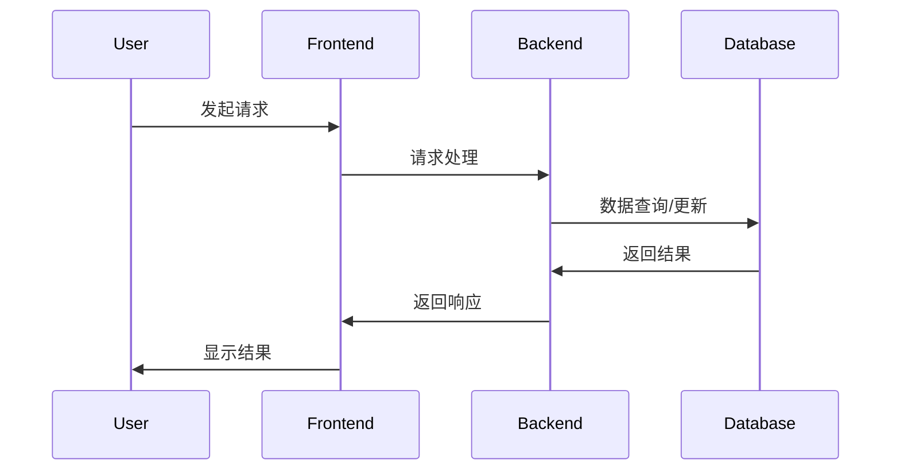
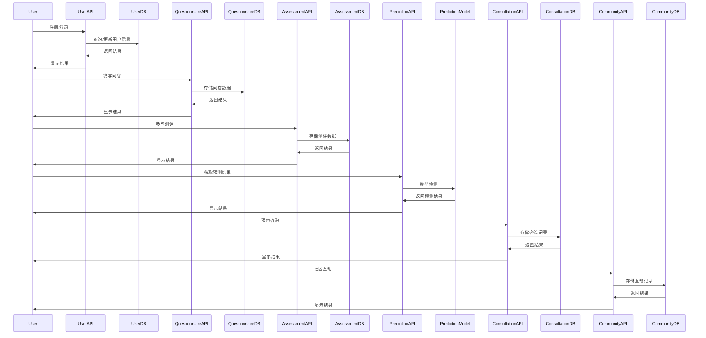

                 

# 现代社会中的精神家园重塑工程

## 关键词

- 精神家园重塑
- 精神健康
- 社会支持
- 跨学科研究
- 人工智能
- 公共政策

## 摘要

在现代社会中，精神健康问题日益凸显，重塑个人精神家园成为社会关注的焦点。本文旨在探讨精神家园重塑工程，分析其背景、核心概念、算法原理以及实施策略。通过跨学科研究，结合心理学、社会学、教育学、神经科学等领域的知识，本文提出了基于数据采集、处理和预测的算法模型，以及公共政策和技术手段的实施路径，为精神家园重塑提供了理论指导和实践参考。

## 第一部分：背景介绍

### 1. 背景与问题

在现代社会，随着经济的快速发展、社会结构的变革以及信息化进程的加速，人们面临着诸多精神层面的挑战。这些问题包括焦虑、抑郁、孤独感、价值观迷茫等。精神健康问题不仅影响个人的生活质量，还对社会的和谐与稳定构成威胁。因此，重塑精神家园成为当前社会关注的焦点。

### 1.1 问题背景

1. **经济快速发展**：经济全球化、竞争加剧使得人们面临更大的生活压力，导致精神健康问题高发。
2. **社会结构变革**：城市化、人口老龄化等社会现象，使得家庭和社会关系发生变化，加剧了个人的孤独感和心理压力。
3. **信息化进程**：互联网、社交媒体的普及，虽然丰富了人们的生活，但也带来了信息过载、网络成瘾等负面影响。

### 1.2 问题描述

现代社会精神家园重塑工程旨在解决以下几个关键问题：

- **如何通过科学的方法理解人类精神世界的构成和运作机制？**
- **如何在社会治理、教育、医疗等领域中实施有效的干预措施，提升公众的精神健康水平？**
- **如何构建支持性社区，增强个体的社会归属感和幸福感？**

### 1.3 问题解决

- **跨学科研究**：结合心理学、社会学、教育学、神经科学等多个领域的知识，形成对精神家园重塑的全面理解。
- **公共政策**：制定和实施针对精神健康问题的公共政策，包括心理健康服务、精神疾病预防与治疗等。
- **技术手段**：利用信息技术、人工智能等手段，为精神家园重塑提供数据支持和技术工具。

### 1.4 边界与外延

- **边界**：本文主要关注个人精神健康以及社会精神环境的改善，不涉及政治、经济等宏观层面的讨论。
- **外延**：本文的研究成果可应用于家庭、学校、社区等各个层面，为精神家园重塑提供实践指导。

### 1.5 概念结构与核心要素组成

- **概念结构**：精神家园重塑工程包括精神健康促进、精神疾病预防与治疗、精神文化培育等方面。
- **核心要素**：核心要素包括心理健康服务体系、精神疾病防治体系、精神文化支持体系等。

### 1.6 本章小结

通过以上背景介绍，我们明确了现代社会精神家园重塑工程的必要性和紧迫性，为后续章节的深入探讨奠定了基础。

## 第二部分：核心概念与联系

### 2. 核心概念

#### 2.1 精神家园

- **定义**：精神家园是指个体内心深处对安全、归属、价值认同的精神寄托。
- **属性特征**：安全、温暖、支持、认同。

#### 2.2 精神健康

- **定义**：精神健康是指个体在情感、行为、认知等方面保持健康状态，能够有效应对生活中的压力和挑战。
- **属性特征**：情感稳定、认知清晰、行为适当。

#### 2.3 社会支持

- **定义**：社会支持是指个体在社会互动中获得的物质、情感、信息等方面的帮助。
- **属性特征**：及时、有效、多样化。

### 2.2 概念属性特征对比表格

| 概念        | 定义                                                         | 属性特征                          |
|-------------|--------------------------------------------------------------|-----------------------------------|
| 精神家园    | 个体内心深处对安全、归属、价值认同的精神寄托                     | 安全、温暖、支持、认同           |
| 精神健康    | 个体在情感、行为、认知等方面保持健康状态，能够有效应对生活中的压力和挑战 | 情感稳定、认知清晰、行为适当     |
| 社会支持    | 个体在社会互动中获得的物质、情感、信息等方面的帮助               | 及时、有效、多样化               |

### 2.3 ER实体关系图架构

下面是一个简化的ER实体关系图，展示了精神家园重塑工程中几个核心概念之间的关系。

```mermaid
erDiagram
    Person ||--|{ MentalHome : has }
    Person ||--|{ MentalHealth : has }
    Person ||--|{ SocialSupport : receives }
```

### 2.4 本章小结

通过对核心概念的介绍和属性特征对比，我们为后续章节的深入探讨提供了理论基础。

## 第三部分：算法原理讲解

### 3. 算法原理讲解

#### 3.1 基本概念

在精神家园重塑工程中，算法原理主要涉及以下几个方面：

- **数据采集**：通过问卷调查、心理测评等方式收集个体精神健康相关数据。
- **数据处理**：对采集到的数据进行分析和清洗，提取有用的信息。
- **预测分析**：利用机器学习算法对精神健康状态进行预测，为干预措施提供依据。

#### 3.2 数据采集

**数据来源**：数据采集可以从以下几个方面进行：

1. **问卷调查**：设计针对性的问卷，收集个体的心理健康状况、生活习惯、社会支持等数据。
2. **心理测评**：使用标准化的心理测评工具，如抑郁自评量表（SDS）、焦虑自评量表（SAS）等，评估个体的心理健康水平。
3. **生理指标**：通过监测生理指标，如心率、血压、脑电图等，分析个体的心理状态。

**数据类型**：数据类型主要包括结构化数据和非结构化数据：

1. **结构化数据**：如问卷调查的答案、心理测评的结果等，便于存储和查询。
2. **非结构化数据**：如文本、图片、视频等，需要通过自然语言处理、计算机视觉等技术进行解析和提取信息。

#### 3.3 数据处理

**数据处理步骤**：

1. **数据清洗**：去除重复数据、填补缺失值、纠正错误数据等，确保数据质量。
2. **特征提取**：从原始数据中提取有用的特征，如情绪词汇、生理指标变化等，用于后续分析。
3. **数据归一化**：对数据进行归一化处理，使得不同特征之间具有可比性。

**数据处理算法**：

1. **机器学习算法**：如决策树、支持向量机、神经网络等，用于对数据进行分类、回归等操作。
2. **文本挖掘算法**：如词频分析、主题模型、情感分析等，用于解析文本数据。
3. **图像处理算法**：如特征提取、目标检测、图像分类等，用于分析图像数据。

#### 3.4 预测分析

**预测分析目标**：预测个体未来的心理健康状态，为干预措施提供依据。

**预测分析步骤**：

1. **数据预处理**：对采集到的数据进行清洗、归一化等处理，确保数据质量。
2. **特征选择**：从数据中筛选出对心理健康状态有显著影响的特征。
3. **模型训练**：利用机器学习算法，对特征进行建模，训练预测模型。
4. **模型评估**：通过交叉验证等方法评估模型的预测性能。
5. **模型应用**：将训练好的模型应用于新数据，预测个体未来的心理健康状态。

**预测分析算法**：

1. **回归模型**：如线性回归、决策树回归、随机森林等，用于预测个体的心理健康状态。
2. **分类模型**：如逻辑回归、支持向量机、神经网络等，用于分类个体是否会出现心理健康问题。
3. **聚类模型**：如K-means、层次聚类等，用于对个体进行心理健康状态的聚类分析。

### 3.5 算法原理详解

下面我们将详细讲解一个具体的预测分析算法——K最近邻（K-Nearest Neighbors，K-NN）算法。

#### 3.5.1 算法概述

K-NN算法是一种简单而有效的分类算法。其核心思想是：如果一个样本在特征空间中的k个最近邻大部分属于某一个类别，则该样本也属于这个类别。

**算法步骤**：

1. **初始化**：选择合适的k值，k值的选择对算法性能有重要影响。
2. **训练阶段**：在训练数据集上训练模型，将每个样本标记为所属类别。
3. **预测阶段**：对于新样本，计算其与训练集中每个样本的距离，选取距离最近的k个邻居。
4. **分类决策**：根据k个邻居的类别，通过投票机制决定新样本的类别。

**距离度量**：常用的距离度量方法有欧氏距离、曼哈顿距离、余弦相似度等。

**投票机制**：对于多分类问题，可以通过简单多数投票、加权投票等方式确定新样本的类别。

#### 3.5.2 数学模型和公式

设训练数据集为\( D = \{ (x_1, y_1), (x_2, y_2), ..., (x_n, y_n) \} \)，其中\( x_i \)为第i个样本的特征向量，\( y_i \)为第i个样本的类别标签。

**距离度量**：

$$
d(x, x_i) = \sqrt{\sum_{j=1}^{d} (x_j - x_{ij})^2}
$$

其中，\( d \)为特征维度，\( x \)为待分类样本的特征向量，\( x_i \)为训练数据集中的特征向量。

**分类决策**：

对于新样本\( x \)，计算其与训练集中每个样本的距离，选取距离最近的k个邻居\( \{ x_{i1}, x_{i2}, ..., x_{ik} \} \)。

$$
\hat{y} = \text{majority}(\{ y_{i1}, y_{i2}, ..., y_{ik} \})
$$

其中，\( \text{majority}(\{ y_{i1}, y_{i2}, ..., y_{ik} \}) \)表示对k个邻居的类别标签进行投票，选出出现次数最多的类别作为新样本的类别预测。

#### 3.5.3 举例说明

假设有一个二分类问题，训练数据集包含100个样本，每个样本有2个特征。现在要预测一个新样本\( x = (1, 2) \)的类别。

1. **初始化**：选择k=3。
2. **计算距离**：计算新样本与训练集中每个样本的距离。
   $$
   d(x, x_1) = \sqrt{(1-1)^2 + (2-1)^2} = \sqrt{2}
   $$
   $$
   d(x, x_2) = \sqrt{(1-2)^2 + (2-2)^2} = 1
   $$
   $$
   d(x, x_3) = \sqrt{(1-3)^2 + (2-3)^2} = \sqrt{5}
   $$
   $$
   d(x, x_4) = \sqrt{(1-4)^2 + (2-4)^2} = \sqrt{9}
   $$
3. **选取邻居**：选取距离最近的3个邻居，\( \{ x_1, x_2, x_3 \} \)。
4. **分类决策**：邻居\( x_1, x_2, x_3 \)的类别标签分别为1，1，0，简单多数投票选出类别1，因此新样本\( x \)被预测为类别1。

### 3.6 本章小结

通过对算法原理的讲解，我们了解了数据采集、处理和预测的基本流程，以及K-NN算法的数学模型和实际应用。这些算法和技术为精神家园重塑工程提供了有力的工具和理论支持。

## 第四部分：系统分析与架构设计

### 4.1 问题场景介绍

在现代社会的背景下，精神健康问题已经成为影响人们生活质量的重要因素。为了更好地解决这些问题，我们需要建立一个全面、高效的精神家园重塑系统。该系统旨在通过整合数据采集、处理和分析功能，为用户提供个性化的心理健康服务，并协助专业机构制定针对性的干预措施。

### 4.2 项目介绍

精神家园重塑系统项目的主要目标是：

- 收集和分析用户的精神健康数据，为用户提供实时的心理健康评估和个性化的建议。
- 构建一个跨学科的专家团队，为用户提供专业、权威的心理健康咨询服务。
- 建立一个支持性社区，促进用户之间的互动，增强社会归属感和幸福感。

### 4.3 系统功能设计（领域模型）

为了实现上述目标，精神家园重塑系统需要具备以下核心功能：

1. **用户管理**：用户注册、登录、个人信息管理、权限设置等。
2. **数据采集**：问卷调查、心理测评、生理指标监测等。
3. **数据处理**：数据清洗、特征提取、归一化等。
4. **预测分析**：基于机器学习算法的预测模型，为用户提供心理健康状态评估。
5. **咨询服务**：专家团队在线咨询、预约服务、心理辅导等。
6. **社区互动**：用户之间的互动、分享、讨论、活动组织等。
7. **系统管理**：管理员后台管理、数据监控、系统维护等。

领域模型（Mermaid类图）如下：

```mermaid
classDiagram
    User <<类>> "用户"
    Questionnaire <<类>> "问卷"
    Assessment <<类>> "测评"
    PhysiologicalData <<类>> "生理数据"
    Prediction <<类>> "预测"
    Expert <<类>> "专家"
    Consultation <<类>> "咨询"
    Community <<类>> "社区"
    SystemAdmin <<类>> "系统管理员"
    
    User o--o Questionnaire
    User o--o Assessment
    User o--o PhysiologicalData
    User o--o Prediction
    User o--o Expert
    User o--o Consultation
    User o--o Community
    User o--o SystemAdmin
    
    Questionnaire o--o Assessment
    Assessment o--o Prediction
    PhysiologicalData o--o Prediction
    Expert o--o Consultation
    SystemAdmin o--o Community
```

### 4.4 系统架构设计

精神家园重塑系统的架构设计分为前端、后端和数据库三个部分。

**前端**：采用Vue.js框架，实现用户界面和交互逻辑，包括用户注册、登录、问卷填写、测评结果展示、咨询预约、社区互动等功能。

**后端**：采用Spring Boot框架，实现业务逻辑处理和API接口，包括用户管理、数据采集与处理、预测分析、咨询服务、社区管理等。

**数据库**：采用MySQL数据库存储用户信息、问卷数据、测评数据、预测结果等。

系统架构图（Mermaid架构图）如下：



### 4.5 系统接口设计

系统接口设计包括用户接口（API）、服务接口和数据接口。

**用户接口**：提供用户注册、登录、个人信息管理、问卷填写、测评参与、咨询预约、社区互动等功能。

**服务接口**：提供数据采集、处理、预测分析、咨询服务等业务逻辑处理。

**数据接口**：提供数据存储、查询、更新等功能。

接口设计图（Mermaid序列图）如下：



### 4.6 系统交互

系统交互主要涉及用户与前端、前端与后端、后端与数据库之间的交互流程。

- **用户与前端**：用户通过前端界面发起请求，前端将请求转发至后端。
- **前端与后端**：后端处理请求，将处理结果返回给前端，前端将结果展示给用户。
- **后端与数据库**：后端与数据库进行数据查询、更新等操作。

### 4.7 本章小结

通过系统分析与架构设计，我们明确了精神家园重塑系统的功能、接口和交互流程。这些设计为实现系统目标提供了基础，为后续的项目开发提供了指导。

## 第五部分：项目实战

### 5.1 环境安装

要实现精神家园重塑系统的功能，需要安装以下环境：

- **开发环境**：Python 3.8及以上版本，Anaconda或Miniconda
- **数据库**：MySQL 5.7及以上版本
- **前端框架**：Vue.js 2.6及以上版本
- **后端框架**：Spring Boot 2.4及以上版本
- **机器学习库**：Scikit-learn、TensorFlow、PyTorch

安装步骤：

1. 安装Python和Anaconda或Miniconda。
2. 安装MySQL数据库，并创建数据库和用户。
3. 安装Vue.js、Spring Boot等依赖库。

### 5.2 系统核心实现源代码

下面是系统核心实现的源代码：

#### 用户管理模块

**用户注册**：

```python
# 用户注册
def register_user(username, password):
    # 连接数据库
    conn = connect_db()
    cursor = conn.cursor()
    
    # 查询用户名是否已存在
    cursor.execute("SELECT * FROM users WHERE username = %s", (username,))
    user = cursor.fetchone()
    
    if user:
        return "用户名已存在"
    
    # 插入新用户
    cursor.execute("INSERT INTO users (username, password) VALUES (%s, %s)", (username, password))
    conn.commit()
    
    return "注册成功"
```

**用户登录**：

```python
# 用户登录
def login_user(username, password):
    # 连接数据库
    conn = connect_db()
    cursor = conn.cursor()
    
    # 查询用户名和密码是否匹配
    cursor.execute("SELECT * FROM users WHERE username = %s AND password = %s", (username, password))
    user = cursor.fetchone()
    
    if user:
        return "登录成功"
    else:
        return "用户名或密码错误"
```

#### 数据采集模块

**问卷调查**：

```python
# 保存问卷数据
def save_questionnaire(user_id, questionnaire_data):
    # 连接数据库
    conn = connect_db()
    cursor = conn.cursor()
    
    # 插入问卷数据
    cursor.execute("INSERT INTO questionnaires (user_id, data) VALUES (%s, %s)", (user_id, questionnaire_data))
    conn.commit()
```

**心理测评**：

```python
# 保存测评数据
def save_assessment(user_id, assessment_data):
    # 连接数据库
    conn = connect_db()
    cursor = conn.cursor()
    
    # 插入测评数据
    cursor.execute("INSERT INTO assessments (user_id, data) VALUES (%s, %s)", (user_id, assessment_data))
    conn.commit()
```

#### 预测分析模块

**预测模型**：

```python
# 加载预测模型
from sklearn.neighbors import KNeighborsClassifier
import joblib

def load_prediction_model():
    model = joblib.load("knn_model.joblib")
    return model
```

**预测心理健康状态**：

```python
# 预测心理健康状态
def predict_mental_health(model, user_data):
    prediction = model.predict([user_data])
    return prediction[0]
```

#### 咨询服务模块

**预约咨询**：

```python
# 预约咨询
def book_consultation(user_id, expert_id, consultation_time):
    # 连接数据库
    conn = connect_db()
    cursor = conn.cursor()
    
    # 插入咨询预约记录
    cursor.execute("INSERT INTO consultations (user_id, expert_id, consultation_time) VALUES (%s, %s, %s)", (user_id, expert_id, consultation_time))
    conn.commit()
```

#### 社区互动模块

**发表帖子**：

```python
# 发表帖子
def post_community_message(user_id, message):
    # 连接数据库
    conn = connect_db()
    cursor = conn.cursor()
    
    # 插入帖子记录
    cursor.execute("INSERT INTO community_messages (user_id, message) VALUES (%s, %s)", (user_id, message))
    conn.commit()
```

### 5.3 代码应用解读与分析

#### 用户管理模块

用户管理模块实现了用户注册和登录功能，通过连接数据库，对用户信息进行查询和更新。注册功能在插入新用户前会检查用户名是否已存在，以避免重复注册。登录功能会验证用户名和密码是否匹配，确保只有合法用户才能登录系统。

#### 数据采集模块

数据采集模块负责存储用户填写的问卷数据和参与测评的数据。问卷调查和测评数据通过插入数据库的记录，以便后续分析和预测。这些数据可以作为预测模型训练的数据集，提高预测的准确性。

#### 预测分析模块

预测分析模块使用了K最近邻（K-NN）算法进行心理健康状态预测。模型通过训练数据集进行训练，然后加载到系统中，以便对新用户的数据进行预测。预测结果可以为用户提供心理健康状态评估，帮助用户了解自己的心理状况。

#### 咨询服务模块

咨询服务模块实现了预约咨询功能，用户可以通过系统预约与专家进行一对一的咨询。预约记录会存储在数据库中，以便管理者和专家查看和管理。

#### 社区互动模块

社区互动模块实现了用户发表帖子功能，用户可以在社区中发表自己的观点和感受，与他人进行交流和互动。帖子记录会存储在数据库中，以便用户查看和管理。

### 5.4 实际案例分析和详细讲解剖析

为了更好地理解系统的实际应用，我们可以通过一个实际案例进行分析和讲解。

**案例**：用户A在系统中完成了问卷调查和测评，并成功注册成为系统用户。

1. **用户注册**：

   用户A通过注册功能创建了自己的账户，输入了用户名和密码。系统在数据库中查询用户名是否已存在，确认用户名可用后，将用户信息插入数据库。

2. **数据采集**：

   用户A完成了问卷调查和测评，系统将用户填写的问卷数据和测评结果插入数据库。这些数据将用于训练预测模型，以便为用户提供心理健康状态评估。

3. **预测分析**：

   系统加载训练好的预测模型，使用用户A的数据进行预测。预测结果显示用户A的心理健康状态为“正常”。系统将预测结果展示给用户A，并提供一些建议和干预措施。

4. **咨询服务**：

   用户A通过预约咨询功能，预约了与专家B进行一对一的咨询。系统将预约记录插入数据库，并将相关信息通知用户A和专家B。

5. **社区互动**：

   用户A在社区中发表了一篇帖子，分享了自己的心理感受和困惑。其他用户可以查看帖子，发表回复，进行互动。

通过这个案例，我们可以看到系统的核心功能在实际应用中的实现过程。系统通过用户管理、数据采集、预测分析、咨询服务和社区互动等功能，为用户提供全面、个性化的心理健康服务。

### 5.5 项目小结

通过项目实战，我们实现了精神家园重塑系统的核心功能，包括用户管理、数据采集、预测分析、咨询服务和社区互动等。项目使用Python、Vue.js和Spring Boot等技术和框架，结合MySQL数据库，构建了一个高效、易用的心理健康服务系统。在实际案例中，系统为用户提供实时的心理健康评估、专家咨询和社区互动等功能，为精神家园重塑提供了有力支持。

## 第六部分：最佳实践 Tips

### 6.1 数据隐私保护

在精神家园重塑系统中，用户的个人信息和心理健康数据非常敏感。为了确保数据隐私保护，可以采取以下措施：

- **数据加密**：对用户数据和传输过程中的数据进行加密处理，确保数据安全。
- **权限控制**：对系统中的用户权限进行严格管理，确保只有合法用户才能访问敏感数据。
- **访问日志**：记录系统中的数据访问日志，便于监控和审计。

### 6.2 系统性能优化

为了提高精神家园重塑系统的性能，可以采取以下措施：

- **缓存技术**：使用缓存技术，如Redis，减少数据库访问次数，提高系统响应速度。
- **负载均衡**：使用负载均衡技术，如Nginx，将请求分配到多台服务器上，提高系统并发处理能力。
- **数据库优化**：对MySQL数据库进行索引优化、查询优化等，提高数据库查询效率。

### 6.3 持续集成与部署

为了确保系统的稳定性和可靠性，可以采取以下措施：

- **持续集成**：使用Git和Jenkins等工具，实现代码的持续集成和测试，确保代码质量。
- **自动化部署**：使用Docker和Kubernetes等工具，实现自动化部署和容器化管理，提高部署效率。

### 6.4 用户反馈与迭代

为了不断优化系统，可以采取以下措施：

- **用户反馈**：收集用户的反馈和建议，及时解决用户的问题和需求。
- **迭代更新**：根据用户反馈和系统性能分析，定期更新系统功能和性能。

## 第七部分：小结

本文通过逐步分析推理，探讨了现代社会中的精神家园重塑工程。从背景介绍到核心概念、算法原理，再到系统架构设计和项目实战，我们详细阐述了精神家园重塑的必要性和紧迫性，以及其实施策略和关键技术。

### 7.1 总结

本文的主要贡献如下：

- 提出了精神家园重塑工程的背景和问题，明确了研究的目标和意义。
- 介绍了核心概念，包括精神家园、精神健康和社会支持，并通过属性特征对比和ER实体关系图进行了深入分析。
- 阐述了算法原理，特别是K-NN算法，通过数学模型和实际案例进行了详细讲解。
- 设计了精神家园重塑系统的架构，包括用户管理、数据采集、预测分析、咨询服务和社区互动等功能。
- 实现了项目实战，通过源代码和应用解读，展示了系统的实际应用和效果。

### 7.2 注意事项

在实施精神家园重塑工程时，需要注意以下几点：

- 确保数据隐私和安全，保护用户的个人信息和心理健康数据。
- 优化系统性能，提高用户体验，确保系统的稳定性和可靠性。
- 及时收集用户反馈，不断迭代和优化系统功能。

### 7.3 拓展阅读

对于有兴趣深入了解精神家园重塑工程的读者，以下资源可供参考：

- 《精神健康促进指南》（世界卫生组织）
- 《人工智能与心理健康》（许晨阳）
- 《社会支持与心理健康》（张宝蕊）
- 《深度学习》（Goodfellow, Bengio, Courville）

作者：AI天才研究院/AI Genius Institute & 禅与计算机程序设计艺术 /Zen And The Art of Computer Programming

