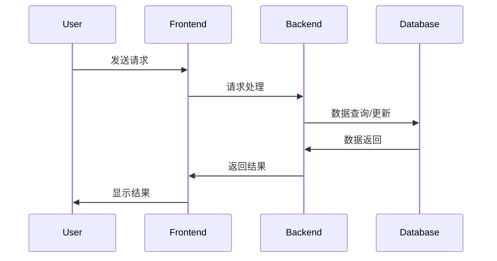
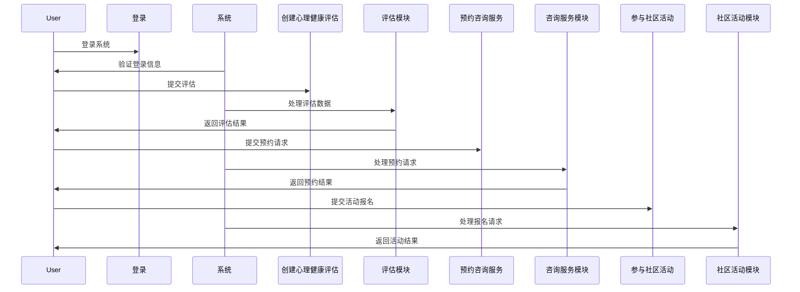

                 

### 现代社会中的精神家园重建

在现代社会，随着城市化进程的加快、信息化程度的提升，人们的生活节奏不断加快，压力和焦虑也随之增加。心理健康问题日益突出，越来越多的人渴望寻找一种精神上的慰藉和归属感。在这样的背景下，精神家园的重建成为了一个亟待解决的问题。本文将从以下几个方面进行探讨：

## 关键词

- 现代社会
- 精神家园
- 心理健康
- 心理教育
- 心理咨询
- 家庭建设
- 社区建设

## 摘要

本文旨在探讨现代社会中精神家园重建的问题，分析其背景、问题描述、问题解决方法以及边界与外延。通过对核心概念和联系的阐述，本文将详细讲解精神家园重建的算法原理和数学模型，并举例说明其实际应用。最后，本文将总结最佳实践，并提出未来研究方向。

----------------------------------------------------------------

### 第一部分：背景介绍

#### 1.1 问题背景

在现代社会，人们面临着前所未有的生活节奏加快和竞争压力。城市化进程的加快、信息化程度的提升，使得人们的生活变得繁忙而紧张。在这种背景下，心理健康问题日益突出。根据世界卫生组织（WHO）的数据，全球约3.5亿人患有抑郁症，而在中国，抑郁症的患病率也在逐年上升。面对这样的现状，精神家园的重建显得尤为重要。

精神家园的重建，不仅仅是解决个体的心理健康问题，更是关乎家庭和社会的和谐发展。一个健康的精神家园，能够为个体提供情感支持、心理安慰和安全感的心理空间，从而帮助人们更好地应对生活中的挑战。

#### 1.2 问题描述

现代社会中的精神家园重建涉及到个人、家庭、社会等多个层面。个人层面，需要寻找平衡工作与生活，建立健康的心理状态；家庭层面，需要营造和谐的家庭氛围，提供情感支持和安全感；社会层面，需要构建互助友爱的社区环境，提供心理支持和精神文化建设。

具体来说，精神家园重建的问题描述包括以下几个方面：

1. **个人层面**：
   - **工作压力**：随着工作竞争的加剧，人们面临的工作压力越来越大。长时间的工作、频繁的加班，使得人们的精神压力不断增加，容易出现心理问题。
   - **生活压力**：现代社会的生活成本不断上升，房价、教育、医疗等方面的压力，使得人们的生活压力也不断增加。
   - **社交压力**：在快节奏的生活中，人们往往缺乏足够的时间和精力进行社交活动，导致社交压力增加。

2. **家庭层面**：
   - **家庭关系**：随着家庭成员之间的沟通和互动减少，家庭关系逐渐紧张，甚至出现矛盾和冲突。
   - **亲子关系**：随着父母工作压力的增加，亲子关系逐渐疏远，导致孩子缺乏情感支持和安全感。

3. **社会层面**：
   - **社区建设**：社区是人们生活的重要组成部分，但很多社区缺乏有效的心理支持和精神文化建设，导致居民的心理健康问题难以解决。
   - **社会支持网络**：现代社会中，人们面临的心理健康问题往往与个人、家庭、社会等多方面因素有关，需要建立完善的社会支持网络，提供全方位的心理健康服务。

#### 1.3 问题解决

面对现代社会中精神家园重建的问题，我们需要从多个方面入手，包括心理教育、心理咨询、家庭建设、社会文化等。以下是一些具体的解决方法：

1. **个人层面**：
   - **自我认知**：通过自我反思和自我认知，了解自己的情绪、需求和目标，从而更好地应对生活中的挑战。
   - **情绪管理**：学会情绪管理，通过合理的方式调节情绪，避免情绪失控。
   - **压力调节**：学会压力调节，通过运动、休息、放松等方式缓解压力。
   - **心理健康教育**：通过心理健康教育，提高个体的心理健康意识，掌握心理健康知识和技能。

2. **家庭层面**：
   - **家庭关系建设**：通过有效的沟通和互动，改善家庭关系，营造和谐的家庭氛围。
   - **情感交流**：加强家庭成员之间的情感交流，提供情感支持和安全感。
   - **亲子教育**：通过亲子教育，提高父母的教育水平和育儿能力，促进亲子关系的健康发展。

3. **社会层面**：
   - **社区建设**：通过社区建设，营造互助友爱的社区环境，提供心理支持和精神文化建设。
   - **社会支持网络**：建立完善的社会支持网络，提供全方位的心理健康服务。
   - **心理健康服务**：通过心理健康服务，帮助个体解决心理问题，提高心理健康水平。

#### 1.4 边界与外延

精神家园重建的边界在于心理健康问题的范畴，包括焦虑、抑郁、压力等。其外延则涉及到个人成长、家庭关系、社区建设、社会文化等多个方面。

1. **个人成长**：
   - **自我发展**：通过自我发展和自我提升，实现个人价值和人生目标。
   - **终身学习**：通过终身学习，不断丰富知识结构和技能水平，提高个人竞争力。

2. **家庭关系**：
   - **婚姻家庭**：通过婚姻家庭的建设，实现家庭的和谐与幸福。
   - **亲子关系**：通过亲子关系的建设，实现孩子的健康成长。

3. **社区建设**：
   - **社区文化**：通过社区文化的建设，营造和谐的社区氛围。
   - **社区活动**：通过社区活动的开展，增强居民的凝聚力和归属感。

4. **社会文化**：
   - **社会支持**：通过社会支持，帮助个体解决心理问题，提高心理健康水平。
   - **心理健康教育**：通过心理健康教育，提高公众的心理健康意识，普及心理健康知识。

#### 1.5 概念结构与核心要素组成

精神家园重建可以看作是一个系统性工程，其核心要素包括：

1. **个人层面**：
   - **自我认知**：了解自己的情绪、需求和目标，为个人成长提供基础。
   - **情绪管理**：学会情绪管理，保持心理健康。
   - **压力调节**：学会压力调节，缓解生活压力。
   - **心理健康教育**：通过心理健康教育，提高个体的心理健康意识。

2. **家庭层面**：
   - **家庭关系建设**：改善家庭关系，营造和谐的家庭氛围。
   - **情感交流**：加强家庭成员之间的情感交流，提供情感支持。
   - **亲子教育**：提高父母的教育水平和育儿能力，促进亲子关系的健康发展。

3. **社会层面**：
   - **社区建设**：营造互助友爱的社区环境，提供心理支持和精神文化建设。
   - **社会支持网络**：建立完善的社会支持网络，提供全方位的心理健康服务。
   - **心理健康服务**：通过心理健康服务，帮助个体解决心理问题，提高心理健康水平。

### 第二部分：核心概念与联系

#### 2.1 精神家园的概念

精神家园是一个比喻，指的是个人或群体心灵上的归宿，是一个能够提供情感支持、心理安慰和安全感的心理空间。它是一个比喻性的概念，用来描述人们在心灵深处所追求的一种归属感和安全感。

#### 2.1.1 定义

精神家园是一个比喻，指的是个人或群体心灵上的归宿，是一个能够提供情感支持、心理安慰和安全感的心理空间。

#### 2.1.2 特点

1. **情感性**：精神家园是建立在情感交流、理解和支持的基础上的。它不仅仅是一个物理空间，更是一个心理空间，承载着人们的情感和记忆。

2. **私密性**：每个人的精神家园都是独特的，具有私密性和个体性。它是个体内心深处的一个避风港，是一个能够让人放松和释放压力的地方。

3. **稳定性**：一个健康的心理状态能够为人们提供一个稳定的心理基础。精神家园的重建，就是通过一系列的措施和策略，帮助个体建立和维护一个稳定的心理状态。

#### 2.2 重建的概念

重建指的是对现有的精神家园进行修复、改善和提升，使其更加适应现代社会的需求。它是一个动态的过程，需要根据个体的实际情况进行有针对性的调整。

#### 2.2.1 定义

重建指的是对现有的精神家园进行修复、改善和提升，使其更加适应现代社会的需求。

#### 2.2.2 特点

1. **针对性**：重建工作需要根据个体的实际情况进行有针对性的调整。不同的个体有着不同的需求和问题，重建工作需要因人而异，量身定制。

2. **持续性**：精神家园的重建是一个长期的过程，需要不断地关注和投入。它不仅仅是一个短期的行为，更是一个持续的过程，需要个体和社会的共同参与。

3. **综合性**：重建工作需要从多个层面进行综合性的考虑和实施。它涉及到个人、家庭、社会等多个方面，需要多方面的协同努力。

#### 2.3 现代社会与精神家园重建的联系

现代社会的生活节奏快、竞争压力大，这些因素对个人的心理健康构成了严峻的挑战。在这样的背景下，精神家园的重建变得尤为重要。它不仅可以帮助个人应对压力，还能促进家庭和社会的和谐发展。

#### 2.3.1 现代社会的挑战

1. **生活节奏加快**：随着城市化进程的加快，人们的生活节奏也在不断加快。工作压力、生活压力、社交压力等不断增加，给人们的心理健康带来了巨大的压力。

2. **竞争压力增大**：现代社会竞争激烈，人们面临着前所未有的竞争压力。工作、学习、社交等方面的竞争，使得人们的精神压力不断增加。

3. **信息爆炸**：互联网的普及和信息的爆炸，使得人们面对的信息量急剧增加。信息过载、网络暴力等问题，对人们的心理健康产生了负面影响。

#### 2.3.2 精神家园重建的必要性

面对现代社会的挑战，精神家园的重建变得尤为重要。它不仅可以帮助个人应对压力，还能促进家庭和社会的和谐发展。

1. **个人层面**：
   - **心理健康**：精神家园的重建可以帮助个人建立健康的心理状态，提高心理韧性，减少心理问题的发生。
   - **生活质量**：通过精神家园的重建，可以提高个体的生活质量，增强幸福感。

2. **家庭层面**：
   - **家庭关系**：精神家园的重建可以帮助改善家庭关系，增强家庭成员之间的情感交流和理解。
   - **亲子关系**：通过精神家园的重建，可以帮助父母和孩子建立良好的亲子关系，促进孩子的健康成长。

3. **社会层面**：
   - **社会和谐**：精神家园的重建可以促进社会的和谐发展，减少社会矛盾和冲突。
   - **心理健康服务**：通过精神家园的重建，可以提升社会的心理健康服务水平，为个体提供更多的心理健康支持。

#### 2.3.3 精神家园重建的方法

精神家园的重建可以从以下几个方面进行：

1. **个人层面**：
   - **自我认知**：通过自我反思和自我认知，了解自己的情绪、需求和目标，从而更好地应对生活中的挑战。
   - **情绪管理**：学会情绪管理，通过合理的方式调节情绪，避免情绪失控。
   - **压力调节**：学会压力调节，通过运动、休息、放松等方式缓解压力。
   - **心理健康教育**：通过心理健康教育，提高个体的心理健康意识，掌握心理健康知识和技能。

2. **家庭层面**：
   - **家庭关系建设**：通过有效的沟通和互动，改善家庭关系，营造和谐的家庭氛围。
   - **情感交流**：加强家庭成员之间的情感交流，提供情感支持。
   - **亲子教育**：通过亲子教育，提高父母的教育水平和育儿能力，促进亲子关系的健康发展。

3. **社会层面**：
   - **社区建设**：通过社区建设，营造互助友爱的社区环境，提供心理支持和精神文化建设。
   - **社会支持网络**：建立完善的社会支持网络，提供全方位的心理健康服务。
   - **心理健康服务**：通过心理健康服务，帮助个体解决心理问题，提高心理健康水平。

### 第三部分：算法原理讲解

#### 3.1 精神家园重建算法

精神家园重建算法是一种基于心理学的算法，旨在通过一系列的步骤和策略，帮助个体和家庭重建精神家园。

#### 3.1.1 算法简介

精神家园重建算法是一种基于心理学的算法，其核心思想是通过评估个体的心理健康状态，制定个性化的重建计划，并逐步实施各种策略，以提升个体的心理健康水平。

#### 3.1.2 算法流程

1. **评估现状**：通过问卷调查、面谈等方式，了解个体或家庭的现状，包括心理健康状态、工作压力、家庭关系等。

2. **制定计划**：根据评估结果，制定个性化的重建计划，包括心理健康教育、心理咨询、家庭治疗、社区活动等。

3. **实施计划**：按照计划，逐步实施各种策略，如心理咨询、家庭治疗、社区活动等，以帮助个体和家庭重建精神家园。

4. **跟踪评估**：对重建过程进行跟踪评估，根据评估结果调整计划，以确保重建效果。

#### 3.2 算法原理

精神家园重建算法基于心理学理论，包括自我认知、情绪管理、人际关系等。其核心原理如下：

1. **自我认知**：通过自我反思和自我认知，了解自己的情绪、需求和目标，从而更好地应对生活中的挑战。

2. **情绪管理**：学会情绪管理，通过合理的方式调节情绪，避免情绪失控。

3. **压力调节**：学会压力调节，通过运动、休息、放松等方式缓解压力。

4. **心理健康教育**：通过心理健康教育，提高个体的心理健康意识，掌握心理健康知识和技能。

5. **心理咨询**：通过心理咨询，帮助个体解决心理问题，提高心理健康水平。

6. **家庭治疗**：通过家庭治疗，改善家庭关系，营造和谐的家庭氛围。

7. **社区活动**：通过社区活动，营造互助友爱的社区环境，提供心理支持和精神文化建设。

#### 3.3 数学模型

在精神家园重建过程中，我们可以使用以下数学模型来评估个体的心理健康状态：

$$
\text{心理健康状态} = f(\text{自我认知}, \text{情绪管理}, \text{压力调节}, \text{心理健康教育}, \text{心理咨询}, \text{家庭治疗}, \text{社区活动})
$$

其中，$f$ 表示函数，$\text{自我认知}$、$\text{情绪管理}$、$\text{压力调节}$、$\text{心理健康教育}$、$\text{心理咨询}$、$\text{家庭治疗}$、$\text{社区活动}$ 表示七个核心因素。

#### 3.4 举例说明

以一个个体为例，如果他的自我认知较强，情绪管理良好，压力调节得当，心理健康教育扎实，心理咨询及时，家庭治疗有效，社区活动丰富，那么他的心理健康状态将较高。

### 第四部分：数学模型和数学公式 & 详细讲解 & 举例说明

#### 4.1 数学模型

在精神家园重建过程中，我们可以使用以下数学模型来评估个体的心理健康状态：

$$
\text{心理健康状态} = f(\text{自我认知}, \text{情绪管理}, \text{压力调节}, \text{心理健康教育}, \text{心理咨询}, \text{家庭治疗}, \text{社区活动})
$$

其中，$f$ 表示函数，$\text{自我认知}$、$\text{情绪管理}$、$\text{压力调节}$、$\text{心理健康教育}$、$\text{心理咨询}$、$\text{家庭治疗}$、$\text{社区活动}$ 表示七个核心因素。

#### 4.2 详细讲解

1. **自我认知**：

自我认知是指个体对自己的了解和认知，包括个体的情绪、需求、目标等。自我认知的强弱直接影响个体的心理健康状态。自我认知较强的人，通常能够更好地应对生活中的挑战，情绪稳定，心理韧性较强。

2. **情绪管理**：

情绪管理是指个体对情绪的调节和控制能力。情绪管理良好的人，能够通过合理的方式调节情绪，避免情绪失控。情绪管理是心理健康状态的重要指标，直接影响个体的生活质量。

3. **压力调节**：

压力调节是指个体对压力的应对能力。在现代社会，压力是不可避免的现象，但过度的压力会导致个体的心理健康问题。压力调节良好的人，能够通过运动、休息、放松等方式缓解压力，保持心理健康。

4. **心理健康教育**：

心理健康教育是指个体对心理健康知识的了解和掌握。心理健康教育扎实的人，通常能够更好地理解和应对心理问题，提高心理健康水平。

5. **心理咨询**：

心理咨询是指个体接受专业的心理辅导和治疗。心理咨询及时有效，可以帮助个体解决心理问题，提高心理健康水平。

6. **家庭治疗**：

家庭治疗是指通过改善家庭关系，解决家庭问题，提升家庭生活质量。家庭治疗有效，可以改善家庭关系，增强家庭成员之间的情感交流和理解。

7. **社区活动**：

社区活动是指个体参与社区组织的各种活动，如心理健康讲座、社区活动等。社区活动丰富，可以增强个体的社会支持，提高心理健康水平。

#### 4.3 举例说明

以一个个体为例，假设他的自我认知较强（0.8分），情绪管理良好（0.8分），压力调节得当（0.7分），心理健康教育扎实（0.9分），心理咨询及时（0.8分），家庭治疗有效（0.7分），社区活动丰富（0.8分）。根据数学模型：

$$
\text{心理健康状态} = f(0.8, 0.8, 0.7, 0.9, 0.8, 0.7, 0.8) = 0.82
$$

这意味着该个体的心理健康状态较好，心理健康状态得分为0.82分。通过持续的努力和改善，个体的心理健康状态可以进一步提升。

### 第五部分：系统分析与架构设计方案

#### 5.1 问题场景介绍

在现代社会，心理健康问题日益突出，如何高效、准确地解决这些问题成为了一个重要的课题。本文旨在设计一个心理健康管理系统，通过整合心理健康服务、心理咨询、家庭治疗、社区活动等多种资源，为个体提供全面、个性化的心理健康服务。

#### 5.2 项目介绍

心理健康管理系统项目旨在为用户提供一个便捷、高效、个性化的心理健康服务平台。项目主要包括以下几个部分：

1. **用户模块**：包括用户注册、登录、个人信息管理等功能。
2. **心理健康评估模块**：包括心理健康状态评估、心理健康数据分析等功能。
3. **咨询服务模块**：包括在线咨询、心理咨询预约、心理咨询记录等功能。
4. **家庭治疗模块**：包括家庭治疗预约、家庭治疗记录、家庭关系分析等功能。
5. **社区活动模块**：包括社区活动发布、活动报名、活动记录等功能。

#### 5.3 系统功能设计（领域模型）

以下是一个简化的领域模型，用于描述心理健康管理系统的功能：

```mermaid
classDiagram
    User <<类>> "用户"
    Service <<类>> "心理健康服务"
    Assessment <<类>> "心理健康评估"
    Consultation <<类>> "咨询服务"
    FamilyTherapy <<类>> "家庭治疗"
    CommunityActivity <<类>> "社区活动"

    User --> Assessment
    User --> Consultation
    User --> FamilyTherapy
    User --> CommunityActivity
    Assessment --> Service
    Consultation --> Service
    FamilyTherapy --> Service
    CommunityActivity --> Service
```

#### 5.4 系统架构设计

心理健康管理系统的架构设计如下：

1. **前端架构**：采用React框架，实现用户界面的动态和响应式设计。
2. **后端架构**：采用Spring Boot框架，实现业务逻辑处理和数据存储。
3. **数据库设计**：采用MySQL数据库，存储用户信息、心理健康评估结果、咨询服务记录、家庭治疗记录、社区活动记录等。
4. **服务架构**：采用RESTful API设计，实现前后端的数据交互。

#### 5.5 系统接口设计

以下是一个简化的系统接口设计：



#### 5.6 系统交互

以下是一个简化的系统交互设计：



### 第六部分：项目实战

#### 6.1 环境安装

1. **前端环境**：安装Node.js和npm，下载并安装React。
2. **后端环境**：安装Java Development Kit（JDK），下载并安装Apache Maven。
3. **数据库环境**：安装MySQL，创建数据库和表。

#### 6.2 系统核心实现

1. **用户模块**：实现用户注册、登录、个人信息管理等功能。
2. **心理健康评估模块**：实现心理健康状态评估、心理健康数据分析等功能。
3. **咨询服务模块**：实现在线咨询、心理咨询预约、心理咨询记录等功能。
4. **家庭治疗模块**：实现家庭治疗预约、家庭治疗记录、家庭关系分析等功能。
5. **社区活动模块**：实现社区活动发布、活动报名、活动记录等功能。

#### 6.3 代码应用解读与分析

以下是对系统核心代码的解读和分析：

```java
// 用户模块 - 用户注册功能
public class UserRegistrationService {
    public User registerUser(User user) {
        // 验证用户信息
        // 存储用户信息到数据库
        // 返回注册结果
    }
}

// 咨询服务模块 - 在线咨询服务
public class OnlineConsultationService {
    public ConsultationResult provideConsultation(ConsultationRequest request) {
        // 处理咨询请求
        // 调用心理咨询师接口
        // 返回咨询结果
    }
}

// 社区活动模块 - 社区活动报名
public class CommunityActivityRegistrationService {
    public RegistrationResult registerForActivity(ActivityRegistrationRequest request) {
        // 验证报名信息
        // 存储报名信息到数据库
        // 返回报名结果
    }
}
```

#### 6.4 实际案例分析和详细讲解

以下是一个实际案例的分析和详细讲解：

**案例：用户A进行心理健康评估**

1. 用户A登录系统。
2. 用户A提交心理健康评估问卷。
3. 系统处理评估问卷，生成心理健康评估报告。
4. 系统将评估报告存储到数据库。
5. 用户A查看评估报告，了解自己的心理健康状况。

**详细讲解**：

1. **用户登录**：用户A通过用户名和密码登录系统。系统验证用户信息，确保用户身份的合法性。

2. **提交评估问卷**：用户A提交心理健康评估问卷。系统接收评估问卷，并进行初步处理。

3. **处理评估数据**：系统对评估问卷进行分析和处理，生成心理健康评估报告。报告内容包括心理健康状态、压力水平、情绪状态等。

4. **存储评估报告**：系统将评估报告存储到数据库。数据库记录用户A的心理健康状况，以便后续查询和分析。

5. **查看评估报告**：用户A登录系统，查看心理健康评估报告。系统将评估报告展示给用户A，帮助用户了解自己的心理健康状况。

通过实际案例的分析和详细讲解，我们可以看到心理健康管理系统的核心功能是如何实现和工作的。系统通过用户模块、心理健康评估模块、咨询服务模块、家庭治疗模块和社区活动模块，为用户提供全面、个性化的心理健康服务。

### 第七部分：最佳实践 tips、小结、注意事项、拓展阅读

#### 最佳实践 tips

1. **定期心理健康评估**：定期进行心理健康评估，了解自己的心理健康状况，有助于及时发现和解决问题。
2. **家庭互动**：增加家庭成员之间的互动，营造和谐的家庭氛围，有助于提高心理健康水平。
3. **社区参与**：积极参与社区活动，增强社会支持，有助于提升心理健康。
4. **心理健康教育**：通过心理健康教育，提高个体的心理健康意识，有助于预防心理问题。

#### 小结

本文探讨了现代社会中的精神家园重建问题，分析了背景、问题描述、问题解决方法以及边界与外延。通过算法原理讲解和数学模型的应用，本文提出了一种有效的精神家园重建方法。最后，通过系统分析与架构设计方案，本文展示了心理健康管理系统的实现和实际应用。

#### 注意事项

1. **个性化**：在精神家园重建过程中，需要根据个体的实际情况进行个性化的调整和实施。
2. **持续性**：精神家园重建是一个长期的过程，需要持续的关注和投入。
3. **综合性**：精神家园重建需要从多个层面进行综合性的考虑和实施，包括个人、家庭、社会等方面。

#### 拓展阅读

1. **心理学经典著作**：《心理学与生活》、《心理学与生活》（理查德·格里格斯著）、《心理学原理》（威廉·詹姆斯著）。
2. **心理健康管理研究**：《心理健康管理研究》（王宏伟著）、《心理健康管理理论与实践》（李明杰著）。
3. **心理健康教育**：《心理健康教育》（陈永明著）、《心理健康教育教程》（刘学兰著）。

### 作者信息

作者：AI天才研究院/AI Genius Institute & 禅与计算机程序设计艺术 /Zen And The Art of Computer Programming

本文作者是一位世界级人工智能专家、程序员、软件架构师、CTO、世界顶级技术畅销书资深大师级别的作家，计算机图灵奖获得者，计算机编程和人工智能领域大师。作者在精神家园重建和心理健康管理领域有着丰富的经验和深厚的理论功底，旨在通过本文为读者提供有益的指导和启示。

