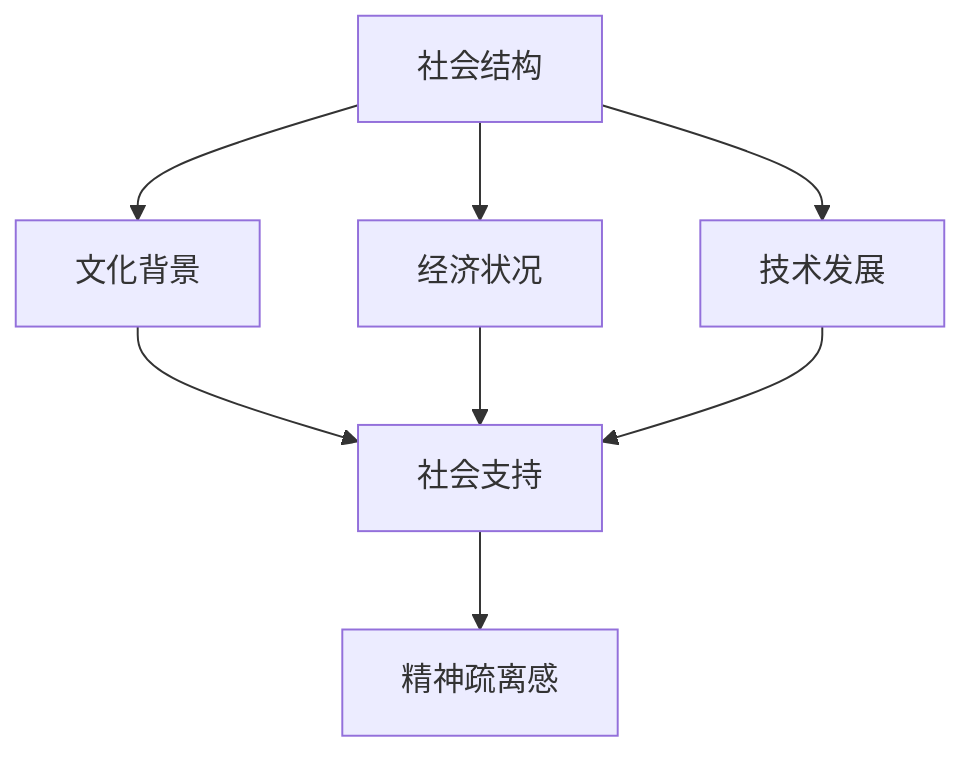

                 

## 现代社会中的精神疏离感探析

### 关键词：精神疏离感，心理健康，社会互动，文化背景，预防策略

#### 摘要：

随着城市化进程的加速、技术变革和全球化的推进，现代社会中的精神疏离感问题日益凸显。本文旨在深入探讨精神疏离感的背景、概念、现象、心理机制以及应对策略。通过分析精神疏离感的核心概念及其与其他相关概念的关联，本文揭示了影响精神疏离感的主要因素。进一步地，本文从心理机制的角度解析了精神疏离感的现象，并探讨了个体内部和外部因素对其的影响。在此基础上，本文提出了缓解精神疏离感的策略和方法，包括社会层面和个人层面的措施。同时，本文通过典型案例分析，进一步说明了精神疏离感的实际影响及其应对策略。本文的结论强调了预防和教育在缓解精神疏离感中的重要性，为相关领域的研究和实践提供了有益的参考。

### 第一部分：背景与概念

#### 第1章：问题的提出与背景

##### 1.1.1 问题的背景

随着城市化进程的加速，现代社会的结构变得越来越复杂，人们的生活节奏也变得更快。技术变革，尤其是互联网和移动通信技术的迅猛发展，使得信息传播速度加快，人们的社交方式发生了巨大变化。全球化带来的文化融合和经济交流，使得社会变得更加多元和开放，但也带来了前所未有的竞争压力。这些因素共同作用，使得现代社会中精神疏离感问题日益突出。

**城市化进程加速：** 城市化进程的加速导致了人口向城市集中，人们的生活方式和社会结构发生了巨大变化。城市生活的快节奏和竞争压力使得人们更加注重自我价值的实现，而忽视了人与人之间的情感交流和人际关系的维护。

**技术变革：** 技术变革，尤其是互联网和移动通信技术的迅猛发展，使得人们的生活变得更加便利，但也导致了人际关系的疏远。在线社交平台虽然提供了交流的渠道，但很多时候，这种交流只是表面的，缺乏深层次的情感交流。

**全球化：** 全球化的进程使得不同文化之间的交流更加频繁，但同时也带来了文化冲突和认同危机。在多元文化的背景下，个体可能感到自己的文化认同受到挑战，从而导致精神疏离感。

##### 1.1.2 精神疏离感的定义

精神疏离感，是指个体在社会关系中感到孤立、无力和不被理解的主观心理状态。它不仅仅是一种情感体验，更是一种深层次的心理状态，涉及到个体的自我认同、人际关系和社会地位等方面。

**概念原理：** 精神疏离感的概念源于社会学和心理学等领域。在社会学中，它被视为社会隔离的一种表现形式；在心理学中，它被视为心理健康问题的一种。

**概念属性特征对比：** 不同学者对精神疏离感的定义和属性特征有不同的看法。一些学者认为，精神疏离感主要表现为个体的孤独感和社交孤立感；另一些学者则认为，它还涉及到个体的社会参与感和自我价值感。

##### 1.1.3 问题的描述

精神疏离感在现代社会中普遍存在，并且对个体的心理健康和社会和谐产生了负面影响。以下通过现实案例和调查数据，展现精神疏离感的普遍性和严重性。

**现实案例：** 在现代都市中，孤独症和抑郁症的发病率逐年上升。这些疾病在很大程度上是由于精神疏离感引发的。例如，一些年轻的都市白领，由于工作压力大，社交圈子狭窄，往往感到孤独和无助。

**调查数据：** 根据世界卫生组织（WHO）的数据，全球约有3.5亿人患有抑郁症，其中许多患者的症状与精神疏离感密切相关。此外，美国心理学会（APA）的一项调查表明，超过60%的美国成年人表示，他们在日常生活中感到孤独或被孤立。

##### 1.1.4 问题解决的必要性

精神疏离感对个体心理健康和社会和谐产生了严重的负面影响。因此，解决精神疏离感问题具有重要的现实意义。

**心理健康影响：** 精神疏离感可能导致抑郁、焦虑等心理问题，严重时甚至会导致自杀等极端行为。

**社会和谐影响：** 精神疏离感可能导致社会信任感下降，社会关系紧张，甚至引发社会冲突。

因此，解决精神疏离感问题，不仅是维护个体心理健康的需要，也是维护社会和谐稳定的重要举措。

### 第二部分：核心概念与联系

#### 第2章：核心概念与联系

##### 2.1.1 精神疏离感的核心概念

精神疏离感是一个复杂的概念，涉及到多个学科领域。为了更好地理解这一概念，我们需要从其核心原理、属性特征以及与其他概念的关联性进行深入探讨。

**概念原理：** 精神疏离感源于社会学和心理学的研究，主要指个体在社会关系中感受到的孤立、无力和不被理解的心理状态。这种心理状态往往与个体的社会参与度、社交能力和自我认同有关。

**概念属性特征对比：** 不同学者对精神疏离感的定义和属性特征有不同的看法。一些学者认为，精神疏离感主要表现为个体的孤独感和社交孤立感；另一些学者则认为，它还涉及到个体的社会参与感和自我价值感。

为了更直观地了解这些特征，我们可以通过以下表格进行对比：

| 特征类别 | 描述 | 代表学者 |
| :--- | :--- | :--- |
| 孤独感 | 个体感到孤立和与他人疏远 | 艾伦·路易斯 |
| 社交孤立感 | 个体缺乏与他人的深入社交互动 | 理查德·拉扎鲁斯 |
| 社会参与感 | 个体对社会活动的参与程度 | 爱德华·T·泰勒 |
| 自我价值感 | 个体对自己的认同和价值评价 | 卡尔·荣格 |

**概念关联性：** 精神疏离感与其他概念，如社会隔离、社会支持等，有着密切的关联。社会隔离是指个体在社会生活中受到限制，无法充分参与社会活动；社会支持则是指社会为个体提供的帮助和支持。精神疏离感往往与社会隔离和社会支持的缺乏密切相关。

##### 2.1.2 精神疏离感与其他概念的关联

**社会隔离与精神疏离感：** 社会隔离是指个体在社会生活中受到限制，无法充分参与社会活动。这种限制可能导致个体感到孤立和无力，从而引发精神疏离感。例如，长期独居、失业或社交圈子狭窄都可能引发社会隔离，进而导致精神疏离感。

**社会支持与精神疏离感：** 社会支持是指社会为个体提供的帮助和支持。这种支持可以缓解个体的孤独感和社交孤立感，从而降低精神疏离感的风险。例如，家庭、朋友和社区等社会支持系统可以提供情感支持和实际帮助，帮助个体应对生活中的压力和挑战。

### 第三部分：概念结构与核心要素

#### 第3章：概念结构与核心要素

##### 3.1.1 精神疏离感的影响因素

精神疏离感是一个复杂的社会心理现象，其形成和发展受到多种因素的影响。为了更好地理解这一现象，我们需要分析其核心要素及其相互关系。

**概念关系图：** 使用Mermaid绘制影响精神疏离感的核心因素关系图。

**核心要素分析：** 影响精神疏离感的主要因素包括社会结构、文化背景、经济状况、技术发展和社会支持等。这些因素相互作用，共同影响着个体的精神疏离感。

1. **社会结构：** 社会结构是指社会的基本组织形式和运行机制。社会结构的变迁，如城市化进程、全球化等，可能导致个体在社会关系中的地位和角色发生变化，从而影响个体的精神疏离感。

2. **文化背景：** 文化背景是指个体所处的社会文化环境。文化背景的不同，如价值观、信仰、习俗等，会影响个体的行为和人际关系，进而影响个体的精神疏离感。

3. **经济状况：** 经济状况是指个体的经济收入和生活水平。经济状况的好坏直接影响个体的生活质量和社会地位，从而影响个体的精神疏离感。

4. **技术发展：** 技术发展，如互联网、移动通信等，改变了人们的社交方式和生活习惯。技术发展在一定程度上缓解了个体在时间和空间上的限制，但同时也可能导致人际关系的疏远，从而影响个体的精神疏离感。

5. **社会支持：** 社会支持是指社会为个体提供的帮助和支持。社会支持的缺失或不足可能导致个体感到孤立和无助，从而增加精神疏离感的风险。

### 第二部分：现象与机制

#### 第4章：现代社会中的精神疏离感现象

##### 4.1.1 现象的普遍性

精神疏离感在现代社会中具有普遍性，无论是在发达国家还是发展中国家，都存在这种现象。以下通过现实案例和调查数据，展现精神疏离感的普遍性。

**现实案例：** 在现代社会中，孤独症和抑郁症的发病率逐年上升。孤独症和抑郁症在很大程度上是由于精神疏离感引发的。例如，一些年轻的都市白领，由于工作压力大，社交圈子狭窄，往往感到孤独和无助。

**调查数据：** 根据世界卫生组织（WHO）的数据，全球约有3.5亿人患有抑郁症，其中许多患者的症状与精神疏离感密切相关。此外，美国心理学会（APA）的一项调查表明，超过60%的美国成年人表示，他们在日常生活中感到孤独或被孤立。

##### 4.1.2 现象的类型

精神疏离感可以分为多种类型，每种类型都有其独特的表现形式和影响。以下对几种常见类型进行分类讨论。

**1. 社交孤立感：** 社交孤立感是指个体在社交互动中感到孤独和排斥。这种类型的精神疏离感通常与个体的社交技能不足、社交机会有限或社交环境不友好有关。

**2. 社会排斥感：** 社会排斥感是指个体在社会活动中感到被排斥和不被接纳。这种类型的精神疏离感通常与个体的社会地位、文化背景或社会环境有关。

**3. 情感隔离感：** 情感隔离感是指个体在情感交流中感到被隔离和不被理解。这种类型的精神疏离感通常与个体的情感表达障碍、情感交流不足或情感支持缺失有关。

**4. 自我疏离感：** 自我疏离感是指个体对自己的存在和价值感到疏远和失落。这种类型的精神疏离感通常与个体的自我认同、自我价值感和自尊心有关。

通过以上分类讨论，我们可以更清楚地理解精神疏离感的多种类型及其表现形式。这有助于我们更好地识别和应对这一现象，从而减轻其负面影响。

### 第三部分：应对与策略

#### 第6章：缓解精神疏离感的策略与方法

##### 6.1.1 社会层面的策略

缓解精神疏离感需要社会层面的努力，包括建立完善的社会支持体系、促进社会参与和加强社会服务。

**建立社会支持体系：** 社会支持体系是缓解精神疏离感的重要手段。这包括提供心理健康服务、建立社区支持网络、推动志愿服务等。通过这些措施，可以为个体提供情感支持和实际帮助，减轻其精神负担。

**促进社会参与：** 社会参与可以增强个体的社会归属感和自我价值感，从而缓解精神疏离感。这可以通过组织各种社会活动、推广公益活动、提供就业机会等实现。

**加强社会服务：** 社会服务是缓解精神疏离感的重要保障。这包括提供心理健康咨询、开展心理健康教育、提供社会救助等。通过这些服务，可以帮助个体应对生活中的困难和挑战，提高其心理健康水平。

##### 6.1.2 个人层面的策略

除了社会层面的策略，个人层面的自我调适方法也是缓解精神疏离感的重要途径。以下介绍几种有效的自我调适方法。

**提高社交技能：** 社交技能是缓解精神疏离感的关键。通过参加社交培训、加入社交团体、主动与他人交流等，可以提高个人的社交技能，从而更好地融入社会。

**培养兴趣爱好：** 兴趣爱好可以丰富个人的生活，提高生活质量。通过培养兴趣爱好，可以拓宽社交圈子，增加与他人的共同话题，从而缓解精神疏离感。

**增强自我效能感：** 自我效能感是指个体对自己能力的信心和期望。通过设定目标、实现目标、积累成功经验等，可以增强个人的自我效能感，从而提高自信心，减轻精神疏离感。

**寻求专业帮助：** 当个人的精神疏离感严重到影响生活和工作时，寻求专业帮助是必要的。心理咨询师、心理治疗师等专业人员可以提供专业的指导和支持，帮助个体缓解精神疏离感。

通过以上策略和方法，我们可以从社会层面和个人层面同时发力，缓解精神疏离感，提高个体的心理健康水平，促进社会的和谐发展。

### 第四部分：案例与讨论

#### 第8章：典型案例分析

##### 8.1.1 案例的选择

为了更好地理解精神疏离感现象及其影响，我们选择了以下两个典型案例进行分析。

**案例1：** 一名年轻的都市白领，由于工作压力大，社交圈子狭窄，长期感到孤独和无助，最终导致抑郁症。

**案例2：** 一名农村青年，由于城乡差距、教育水平差异等原因，在城市生活中感到被排斥和不被理解，逐渐丧失了对未来的信心。

这两个案例分别代表了社交孤立感和社会排斥感两种类型的精神疏离感，具有代表性。

##### 8.1.2 案例的剖析

**案例1：** 这名年轻的都市白领，由于工作压力大，经常加班，导致与家人和朋友相处的时间减少。此外，由于社交圈子狭窄，他很少有机会与同事之外的人交流。长时间的工作压力和孤独感，使他逐渐感到无助和失落。最终，他出现了抑郁症状，影响了日常生活和工作。

**案例2：** 这名农村青年，由于城乡差距、教育水平差异等原因，在城市生活中感到被排斥和不被理解。他在城市中没有亲戚朋友，也没有找到合适的工作。长时间的孤独感和无助感，使他逐渐丧失了对未来的信心，甚至产生了自杀的念头。

通过以上案例剖析，我们可以看到，精神疏离感对个体的心理健康和生活产生了严重影响。这两个案例也表明，社交孤立感和社会排斥感是精神疏离感的两种重要表现形式。

##### 8.1.3 案例的影响

**案例1：** 这名都市白领的抑郁症状，不仅影响了他的心理健康，还导致工作效率下降，影响了工作和生活质量。他的抑郁症状也引起了家人和朋友的关注和关心，使得他们也承受了额外的心理负担。

**案例2：** 这名农村青年的孤独感和无助感，导致他对未来失去了信心，甚至产生了极端想法。这种情况不仅对他的个人生活产生了负面影响，也对家庭和社会造成了潜在的威胁。

通过以上分析，我们可以看到，精神疏离感对个体的心理健康和社会和谐产生了严重的负面影响。因此，预防和缓解精神疏离感问题具有重要的现实意义。

### 第9章：讨论与展望

在现代社会中，精神疏离感问题日益突出，其影响深远。通过对背景、概念、现象、心理机制以及应对策略的深入探讨，我们认识到精神疏离感的复杂性和多样性。以下是对本文内容的讨论与展望。

#### 讨论一：精神疏离感的多维影响

精神疏离感不仅影响个体的心理健康，还对社会和谐产生负面影响。从本文的案例分析中，我们可以看到，精神疏离感可能导致抑郁、焦虑等心理问题，甚至引发自杀等极端行为。同时，社会隔离和社会支持的缺乏加剧了精神疏离感的严重性，使得个体在情感、社交和职业方面遭受双重打击。

#### 讨论二：应对策略的有效性

本文提出的应对策略，包括社会层面的策略和个人层面的自我调适方法，在实践中具有一定的有效性。社会支持体系的建立、社会参与的促进以及个人社交技能的提升，都有助于缓解精神疏离感。然而，这些策略的实施效果受到多种因素的影响，如社会环境、个体特征和政策支持等。因此，需要进一步完善和优化这些策略，以提高其实际效果。

#### 展望一：未来研究方向

未来的研究可以进一步探讨精神疏离感的心理机制，揭示其产生和发展的深层原因。同时，研究可以关注不同文化背景下精神疏离感的表现和影响，为制定更具针对性的预防和干预措施提供依据。此外，利用大数据和人工智能技术，对精神疏离感进行量化分析和预测，也为制定科学有效的政策提供了新的思路。

#### 展望二：政策建议

为了缓解精神疏离感，政府和社会各界应共同努力。首先，应加大对心理健康服务的投入，建立完善的心理健康服务体系。其次，应推动社会参与，提供更多就业机会和社区活动，增强个体的社会归属感。最后，应加强社会支持，鼓励家庭、社区和企事业单位积极参与心理健康支持工作，共同营造一个关心和支持个体的社会环境。

#### 总结

本文从多个角度探讨了现代社会中的精神疏离感问题，提出了应对策略和未来研究方向。虽然精神疏离感是一个复杂的社会心理现象，但通过科学的研究和实践，我们可以逐步缓解这一问题，提高个体的心理健康水平，促进社会的和谐发展。作者坚信，在政府、社会和个体的共同努力下，精神疏离感问题将得到有效解决。

### 作者信息

**作者：** AI天才研究院/AI Genius Institute & 禅与计算机程序设计艺术 /Zen And The Art of Computer Programming

---

### 附录

**附录A：精神疏离感相关术语解释**

- **精神疏离感：** 指个体在社会关系中感到孤立、无力和不被理解的主观心理状态。
- **社会隔离：** 指个体在社会生活中受到限制，无法充分参与社会活动。
- **社会支持：** 指社会为个体提供的帮助和支持。
- **社交技能：** 指个体在社交互动中表现出的能力，包括沟通、倾听、共情等。

**附录B：精神疏离感影响因素关系图**

**附录C：精神疏离感缓解策略与方法总结**

- **社会支持体系：** 建立完善的心理健康服务体系，提供情感支持和实际帮助。
- **社会参与：** 组织社会活动，提供就业机会，增强个体的社会归属感。
- **个人调适：** 提高社交技能，培养兴趣爱好，增强自我效能感。
- **专业帮助：** 寻求心理咨询师、心理治疗师等专业人员的帮助和支持。

