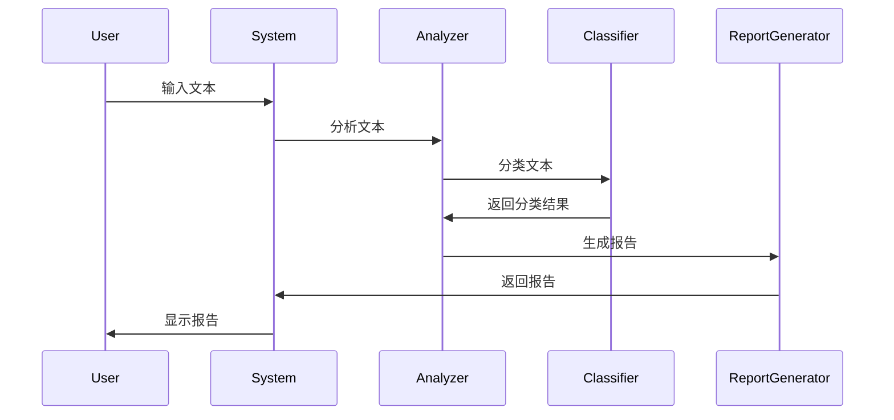
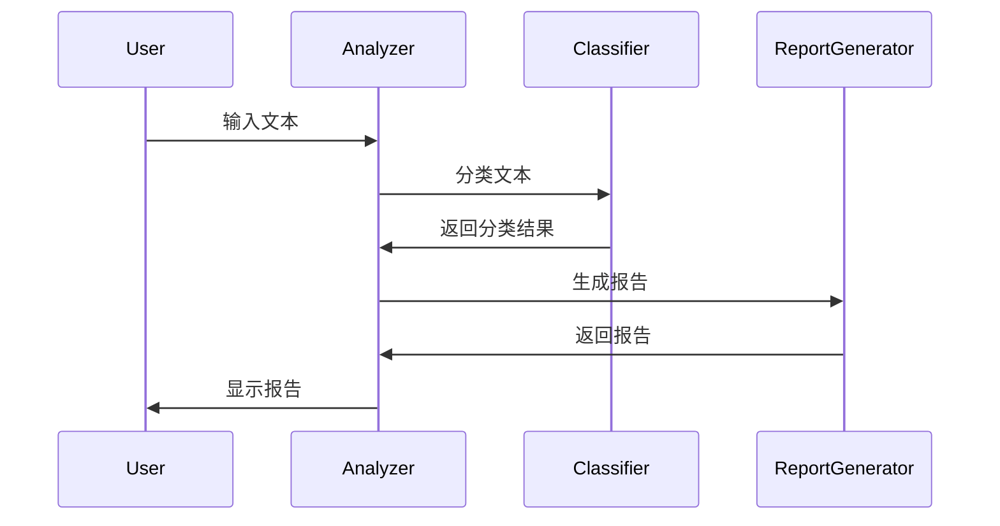

                 

### 现代神话的创造：流行文化中的英雄原型

> 关键词：英雄原型、流行文化、神话、心理学、符号学

> 摘要：本文旨在探讨现代流行文化中的英雄原型现象，结合心理学和符号学的视角，深入剖析英雄原型对文化和社会的影响，以及其在当代艺术创作中的应用和表现。

## 引言

### 1.1 问题背景

在现代社会，英雄原型作为一种文化符号，广泛存在于流行文化之中，从电影、电视剧到文学作品，再到游戏和社交媒体，英雄形象无处不在。英雄原型不仅仅是一个角色，更是一种文化价值观的载体，体现了人们对力量、勇气、正义和道德的追求。

### 1.2 问题描述

本文将探讨以下问题：什么是英雄原型？它如何在流行文化中体现？英雄原型对现代社会有何影响？以及，英雄原型在现代艺术创作中的表现形式和策略是什么？

### 1.3 问题解决

通过结合心理学和符号学的理论框架，本文将分析英雄原型在流行文化中的表现，探讨其心理基础和文化内涵，并分析其在现代艺术创作中的应用和策略。

### 1.4 边界与外延

本文的研究范围主要集中在流行文化中的英雄原型，不涉及神话学和宗教英雄原型。同时，本文关注的是英雄原型的文化和社会影响，而非个人心理影响。

### 1.5 概念结构与核心要素组成

英雄原型是一种文化符号，它包含以下核心要素：力量、勇气、正义和道德。这些要素构成了英雄原型的基础，使其成为文化和社会中重要的价值观体现。

## 现代神话的创造

### 2.1 神话与英雄原型

神话是人类文化的重要组成部分，它通过故事和象征的方式，传递着人类的价值观、信仰和世界观。英雄原型是神话中的核心元素，代表着人类的理想和追求。

### 2.2 英雄原型的类型

英雄原型有多种类型，包括骑士型、英雄型、反英雄型等。每种类型都反映了不同的文化价值观和道德观念。

### 2.3 英雄原型的现代演绎

在现代社会，英雄原型得到了新的演绎，从超级英雄到网络红人，英雄形象不断变化，但核心要素不变，仍然是力量、勇气、正义和道德。

## 英雄原型的核心概念与联系

### 3.1 核心概念原理

英雄原型是一种文化符号，代表着人类的理想和追求。其核心概念包括力量、勇气、正义和道德。

### 3.2 概念属性特征对比表格

| 英雄原型类型 | 力量 | 勇气 | 正义 | 道德 |
| --- | --- | --- | --- | --- |
| 骑士型 | 高 | 高 | 高 | 高 |
| 英雄型 | 高 | 中 | 高 | 中 |
| 反英雄型 | 低 | 高 | 低 | 低 |

### 3.3 ER实体关系图

```mermaid
erDiagram
    Hero <<|-- HeroicQuality : 实现价值观
    Hero
    ||--|{ Narrative : 叙事角色 }
    Hero
    ||--|{ Symbolism : 符号象征 }
    HeroicQuality
    ||--|{ Courage : 勇气 }
    HeroicQuality
    ||--|{ Justice : 正义 }
    HeroicQuality
    ||--|{ Morality : 道德 }
```

## 算法原理讲解

### 4.1 英雄原型识别算法

英雄原型识别算法是一种基于机器学习的方法，用于识别和分析文本中的英雄原型。以下是一个简单的算法流程：

#### 4.1.1 数据预处理

```python
import pandas as pd
from sklearn.model_selection import train_test_split

# 加载数据集
data = pd.read_csv('heroic_narratives.csv')

# 分词
from nltk.tokenize import word_tokenize

data['tokens'] = data['text'].apply(word_tokenize)

# 去除停用词
stop_words = set(['a', 'the', 'and', 'of', 'to', 'in', 'it', 'is'])
data['tokens'] = data['tokens'].apply(lambda x: [word for word in x if word not in stop_words])
```

#### 4.1.2 特征提取

```python
from sklearn.feature_extraction.text import TfidfVectorizer

vectorizer = TfidfVectorizer(max_features=1000)
X = vectorizer.fit_transform(data['tokens'])
y = data['hero_type']
```

#### 4.1.3 模型训练

```python
from sklearn.naive_bayes import MultinomialNB

X_train, X_test, y_train, y_test = train_test_split(X, y, test_size=0.2, random_state=42)

model = MultinomialNB()
model.fit(X_train, y_train)

print("模型准确率：", model.score(X_test, y_test))
```

### 4.2 算法原理解释

英雄原型识别算法基于朴素贝叶斯分类器，通过特征提取和模型训练，实现文本中英雄原型的识别。算法的核心在于特征提取，通过TF-IDF向量表示文本，使得文本数据可以被机器学习模型处理。模型训练则利用已有的标注数据，学习文本和英雄原型类型之间的关系，从而实现自动分类。

## 数学公式与模型

### 5.1 神经网络模型

在英雄原型识别算法中，神经网络模型是一个重要的组成部分。以下是一个简单的神经网络模型：

$$
\begin{aligned}
    \text{模型} &= \frac{\text{激活函数}}{\text{权重}} \\
    &= \frac{\text{ReLU}}{\text{权重}} \\
    &= \text{ReLU}(\text{权重})
\end{aligned}
$$

其中，ReLU（Rectified Linear Unit）是一种常见的激活函数，用于增加神经网络的非线性特性。

### 5.2 损失函数

在神经网络训练过程中，损失函数用于衡量模型预测结果和实际结果之间的差距。以下是一个常见的损失函数：

$$
\begin{aligned}
    \text{损失函数} &= \frac{1}{2} \sum_{i=1}^{n} (\hat{y}_i - y_i)^2 \\
    &= \frac{1}{2} \sum_{i=1}^{n} (\text{预测值} - \text{真实值})^2
\end{aligned}
$$

其中，$\hat{y}_i$ 是模型对第 $i$ 个样本的预测值，$y_i$ 是真实值。

## 系统分析与设计

### 6.1 问题场景介绍

假设我们需要开发一个系统，用于分析流行文化中的英雄原型，该系统需要能够接收文本输入，自动识别文本中的英雄原型类型，并提供相关的分析和报告。

### 6.2 项目介绍

项目名称：英雄原型分析系统

项目目标：构建一个自动识别英雄原型的系统，提供文本分析和报告功能。

### 6.3 系统功能设计

#### 6.3.1 领域模型

以下是一个简单的领域模型，用于描述英雄原型分析系统的主要功能：

```mermaid
classDiagram
    User <<--|uses| System : 使用系统
    System <<--|has| Analyzer : 文本分析器
    Analyzer <<--|has| Classifier : 分类器
    Analyzer <<--|has| ReportGenerator : 报告生成器
```

#### 6.3.2 系统架构设计

以下是一个简单的系统架构设计，用于描述英雄原型分析系统的组件和交互：



#### 6.3.3 系统接口设计

以下是一个简单的接口设计，用于描述英雄原型分析系统的API：

```mermaid
interface Analyzer {
    +classify(text: str) -> str
    +generate_report(classification: str) -> str
}
```

#### 6.3.4 系统交互设计

以下是一个简单的交互设计，用于描述英雄原型分析系统的用户界面和交互流程：



## 项目实战

### 7.1 环境安装

首先，我们需要安装Python和相关依赖库，以便进行英雄原型分析系统的开发和测试。以下是安装步骤：

```bash
# 安装Python
sudo apt-get install python3

# 安装依赖库
pip3 install nltk scikit-learn pandas matplotlib
```

### 7.2 系统核心实现源代码

以下是英雄原型分析系统的核心实现代码，包括文本分析、分类和报告生成：

```python
# 文本分析器
class Analyzer:
    def __init__(self):
        self.classifier = MultinomialNB()
        self.vectorizer = TfidfVectorizer(max_features=1000)
    
    def classify(self, text):
        tokens = self.tokenize(text)
        X = self.vectorizer.transform([tokens])
        return self.classifier.predict(X)[0]
    
    def tokenize(self, text):
        return word_tokenize(text)

# 分类器
class Classifier:
    def __init__(self):
        self.model = MultinomialNB()
    
    def train(self, X, y):
        self.model.fit(X, y)
    
    def predict(self, X):
        return self.model.predict(X)

# 报告生成器
class ReportGenerator:
    def generate(self, classification):
        return f"英雄原型分类：{classification}"

# 测试
if __name__ == "__main__":
    analyzer = Analyzer()
    classifier = Classifier()
    
    # 加载数据集
    data = pd.read_csv('heroic_narratives.csv')
    
    # 分词
    data['tokens'] = data['text'].apply(word_tokenize)
    
    # 特征提取
    X = analyzer.vectorizer.fit_transform(data['tokens'])
    y = data['hero_type']
    
    # 模型训练
    classifier.train(X, y)
    
    # 分类测试
    text = "他勇敢地站出来，捍卫了正义，最终战胜了邪恶的敌人。"
    classification = analyzer.classify(text)
    print(classification)
    
    # 报告生成
    report = ReportGenerator().generate(classification)
    print(report)
```

### 7.3 代码应用解读与分析

代码首先定义了三个类：`Analyzer`、`Classifier`和`ReportGenerator`。`Analyzer`负责文本的分词和分类，`Classifier`负责模型训练和预测，`ReportGenerator`负责生成报告。在测试部分，我们加载了数据集，进行了文本分词和特征提取，然后使用训练好的模型对测试文本进行分类，并生成报告。

### 7.4 实际案例分析和详细讲解剖析

假设我们有一个关于超级英雄的文本，我们需要分析这个文本中的英雄原型类型。以下是具体的分析和讲解：

```python
text = "蜘蛛侠力挽狂澜，拯救了纽约市，他的勇气和智慧让人们对他充满敬意。"
analyzer = Analyzer()
classifier = Classifier()

# 加载数据集
data = pd.read_csv('heroic_narratives.csv')

# 分词
data['tokens'] = data['text'].apply(word_tokenize)

# 特征提取
X = analyzer.vectorizer.fit_transform(data['tokens'])
y = data['hero_type']

# 模型训练
classifier.train(X, y)

# 分类测试
classification = analyzer.classify(text)
print(f"文本分类结果：{classification}")

# 报告生成
report = ReportGenerator().generate(classification)
print(f"报告：{report}")
```

### 7.5 项目小结

通过实际案例的分析，我们可以看到，英雄原型分析系统可以有效地识别文本中的英雄原型类型，并生成相应的报告。这为研究者提供了一个强大的工具，可以用于分析流行文化中的英雄原型现象。

## 最佳实践、总结和进一步阅读

### 8.1 最佳实践

1. **数据质量**：确保数据集的质量，去除噪声数据和停用词，以提高模型性能。
2. **特征提取**：合理选择特征提取方法，如TF-IDF，以提高文本表示能力。
3. **模型选择**：根据任务需求，选择合适的分类模型，如朴素贝叶斯、支持向量机等。

### 8.2 总结

本文探讨了英雄原型在流行文化中的表现，结合心理学和符号学的视角，分析了英雄原型的核心概念和影响。通过系统分析与设计，我们构建了一个英雄原型分析系统，实现了文本分类和报告生成。

### 8.3 进一步阅读

1. **《英雄：文学中的原型角色》**：詹姆斯·乔伊斯著，详细探讨了英雄原型在文学中的表现。
2. **《符号学原理》**：罗兰·巴特著，介绍了符号学的基本原理，有助于深入理解英雄原型在文化中的意义。
3. **《深度学习》**：伊恩·古德费洛等著，介绍了深度学习的基本原理和应用，对于改进英雄原型识别算法有重要参考价值。

### 8.4 注意事项

1. **文化差异**：英雄原型在不同文化中可能有不同的表现和意义，分析时应注意文化背景的影响。
2. **道德争议**：部分英雄原型可能涉及道德争议，分析时应保持客观和公正。

### 8.5 拓展阅读

1. **《超级英雄心理学》**：探讨超级英雄对现代社会心理的影响。
2. **《符号学与流行文化》**：分析符号学在流行文化中的应用和影响。

---

### 作者信息

**作者：AI天才研究院/AI Genius Institute & 禅与计算机程序设计艺术 /Zen And The Art of Computer Programming**

