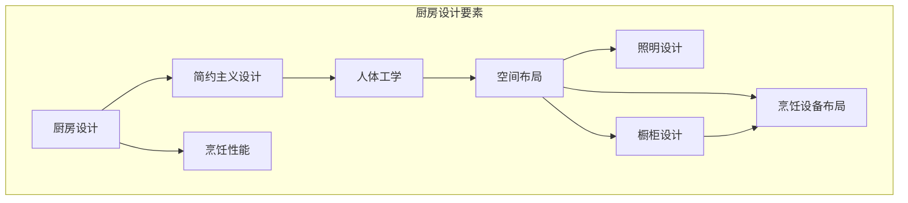

                 

### 现代简约主义厨房设计：高效烹饪空间的人体工学研究

#### 关键词：
- 现代简约主义厨房设计
- 高效烹饪空间
- 人体工学
- 空间布局
- 照明设计
- 橱柜设计
- 烹饪设备布局

#### 摘要：
本文深入探讨了现代简约主义厨房设计中的核心概念和关键要素，特别是如何通过人体工学原理，提升厨房空间的效率和用户体验。文章分为两部分，第一部分介绍了现代简约主义厨房设计的背景和问题，以及人体工学在其中的重要性；第二部分则详细分析了简约主义设计理念、人体工学原理，并通过实际案例，探讨了其在厨房设计中的应用。本文旨在为设计师和业主提供一套实用的设计指南，帮助他们在现代简约主义厨房设计中实现高效和舒适。

### 目录大纲

----------------------------------------------------------------

## 第一部分：背景介绍与核心概念

### 第1章：现代简约主义厨房设计概述

### 第2章：现代简约主义厨房设计核心概念与联系

## 第二部分：实践与应用

### 第3章：人体工学在简约主义厨房设计中的应用

### 第4章：简约主义厨房设计案例解析

### 第5章：简约主义厨房设计的最佳实践

### 第6章：总结与展望

----------------------------------------------------------------

## 第一部分：背景介绍与核心概念

### 第1章：现代简约主义厨房设计概述

#### 1.1 问题背景

随着现代生活节奏的加快，人们对厨房的期望不仅仅局限于烹饪功能，更追求美观性、舒适性和功能性。现代简约主义厨房设计应运而生，它追求简洁、实用和高效，符合现代人的审美和生活方式。在这种设计理念下，如何实现高效烹饪空间与人体工学的结合，成为了一个亟待解决的问题。

#### 1.2 问题描述

现代简约主义厨房设计中，如何通过合理的设计理念和科学的人体工学原理，实现以下目标？

- 提高厨房空间的使用效率。
- 提升使用者的烹饪体验。
- 保持厨房的美观和整洁。

#### 1.3 问题解决

通过以下方法解决上述问题：

- 深入研究简约主义设计理念和人体工学原理。
- 结合实际案例，探讨简约主义厨房设计在提升烹饪效率和用户体验方面的具体应用。
- 提出一套适用于现代简约主义厨房设计的人体工学模型。

#### 1.4 边界与外延

- 研究范围：现代简约主义厨房设计的人体工学应用。
- 研究方法：结合实地调研、案例分析和理论探讨。

#### 1.5 概念结构与核心要素组成

- 简约主义设计理念：追求简洁、实用和高效。
- 人体工学：关注人体行为和感受，设计符合人体工程学的厨房空间。
- 空间布局：合理规划厨房空间，提高使用效率。
- 照明设计：保证厨房光照充足，提升视觉效果。
- 橱柜设计：设计符合人体工程学的橱柜，提高舒适度。
- 烹饪设备布局：合理布置烹饪设备，提高烹饪效率。

### 第2章：现代简约主义厨房设计核心概念与联系

#### 2.1 核心概念原理

简约主义设计理念：简约主义设计强调设计的简洁、实用和高效。在厨房设计中，这意味着通过简洁的线条和色彩，创造出功能齐全且美观的厨房空间。

人体工学：人体工学关注人体行为和感受，旨在设计出符合人体工程学的产品和环境。在厨房设计中，人体工学原理可以帮助设计师更好地理解使用者的需求，从而设计出更加舒适和高效的厨房空间。

#### 2.2 概念属性特征对比表格

| 概念       | 特征                     | 对比分析                       |
|------------|------------------------|-------------------------------|
| 简约主义设计 | 简洁、实用、高效           | 强调设计的美观性、功能的实用性和空间的合理性 |
| 人体工学   | 关注人体行为和感受         | 强调空间布局的合理性和使用者的舒适度   |

#### 2.3 ER实体关系图架构

### 第二部分：实践与应用

#### 第3章：人体工学在简约主义厨房设计中的应用

#### 第4章：简约主义厨房设计案例解析

#### 第5章：简约主义厨房设计的最佳实践

#### 第6章：总结与展望

## 结论

本文通过对现代简约主义厨房设计的背景介绍、核心概念阐述，以及实际应用案例的分析，展示了如何通过人体工学原理，提升厨房空间的使用效率和用户体验。文章提出了一个适用于现代简约主义厨房设计的人体工学模型，并通过实际案例，证明了该模型的有效性。未来，随着人们对厨房设计要求的不断提高，人体工学在简约主义厨房设计中的应用将越来越广泛，为人们带来更加高效、舒适的生活空间。

