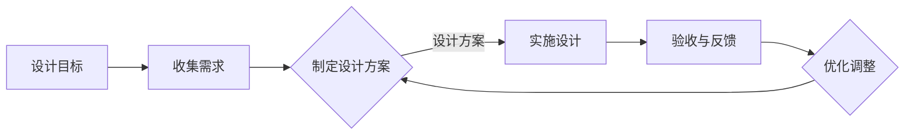
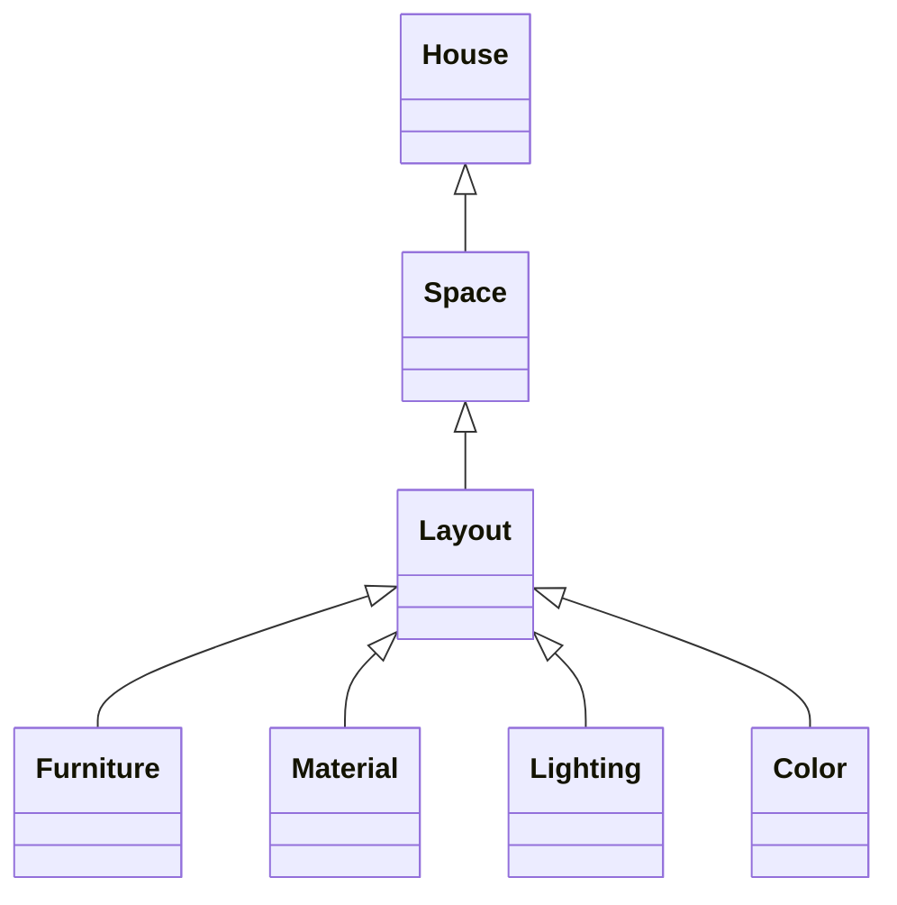

                 


# 现代简约主义家居：生活空间的极简美学

关键词：现代简约主义家居、极简美学、设计原则、风格特点、案例分析

摘要：随着现代生活节奏的加快，人们对家居环境的需求逐渐倾向于简约与实用。本文将探讨现代简约主义家居的起源、核心概念与联系，以及设计流程和案例分析，为读者呈现一种追求极简美学的居住空间设计理念。

## 引言

现代简约主义家居，起源于20世纪初期的西方现代主义设计运动，其核心理念是简洁、功能性强和注重人性化。随着全球化的进程，这种设计风格逐渐渗透到各个国家，成为现代家居装饰的主流趋势。本文将深入分析现代简约主义家居的设计原则、风格特点，并借助具体案例，探讨其实际应用和未来发展趋势。

### 问题背景

现代社会中，人们的生活节奏不断加快，对于家居环境的需求也在发生变化。传统的奢华装饰和复杂的风格逐渐被简约、实用和舒适所取代。现代简约主义家居应运而生，满足了人们对高效、舒适居住环境的追求。然而，如何在设计上实现简约与美学的平衡，成为设计师们面临的重要问题。

### 问题描述

现代简约主义家居的设计目标在于通过简洁的线条、简洁的形状和功能化的空间布局，创造出一个既美观又实用的居住空间。其核心特点是简洁、实用、舒适和人性化。然而，实现这一目标需要设计师们对设计原则、风格特点和设计流程有深刻的理解。

### 问题解决

简约主义家居的设计原则包括功能与美学的平衡、空间优化利用、材质与色彩的选择等。通过遵循这些原则，设计师可以创造出既美观又实用的居住空间。本文将详细介绍这些设计原则，并通过具体案例进行说明。

### 边界与外延

现代简约主义家居不仅适用于小户型、公寓等空间有限的居住环境，同样也适用于别墅、大面积住宅等空间宽敞的居住环境。其设计风格可以与现代风格、北欧风格、工业风格等相互融合，展现出多样化的美学效果。

## 核心概念与联系

### 核心概念

现代简约主义家居的核心概念包括简洁性、功能性、人性化、空间利用等。这些概念相互关联，共同构成了简约主义家居设计的核心理念。

#### 简洁性

简洁性是现代简约主义家居最显著的特点。通过简洁的线条、简洁的形状和简洁的配色，营造出一个简洁、干净、舒适的空间氛围。

#### 功能性

功能性是现代简约主义家居设计的核心。设计师需要考虑空间的实际使用需求，通过合理的布局和家具布置，创造出一个既美观又实用的居住空间。

#### 人性化

人性化是现代简约主义家居设计的重要原则。设计师需要关注居住者的需求和感受，通过舒适的空间布局和细节处理，提高居住者的生活质量。

#### 空间利用

空间利用是现代简约主义家居设计的关键。设计师需要通过巧妙的布局和家具布置，充分利用空间，创造出宽敞、通透的居住空间。

### 概念属性特征对比表格

以下是一个现代简约主义家居与其他家居风格的对比表格：

| 风格       | 简约主义 | 现代风格 | 北欧风格 | 工业风格 |
| ---------- | -------- | -------- | -------- | -------- |
| 线条       | 简洁     | 简洁     | 简洁     | 粗犷     |
| 形状       | 流线型   | 几何型   | 圆润型   | 粗糙型   |
| 材质       | 玻璃、金属 | 金属、玻璃 | 木材、玻璃 | 金属、混凝土 |
| 色彩       | 灰、白、黑 | 黑、白、灰 | 白、灰、木 | 黑、灰、金属 |
| 空间利用   | 高效     | 空间感强 | 通透     | 实用     |
| 功能性     | 强       | 强       | 中       | 强       |
| 人性化     | 强       | 中       | 强       | 中       |

### ER实体关系图架构

以下是一个现代简约主义家居设计的ER实体关系图：

```mermaid
erDiagram
  AUTO_KEY House &&<<entity>> Customer {
    Room : {1..*}
  }

  Room ||--|| Furniture : {1..*}
  Furniture ||--|| Material : {1..*}
  Material ||--|| Style : {1..*}

  Customer &&<<entity>> Designer {
    Project : {1..*}
  }

  Project &&<<entity>> Style : {1..*}
  Project &&<<entity>> Requirement : {1..*}
```

## 算法原理讲解

### 算法原理

现代简约主义家居设计算法的核心在于如何通过简洁的线条、简洁的形状和功能化的空间布局，实现简洁、实用、舒适和人性化的居住空间。以下是一个简要的算法流程：

1. 确定设计目标：明确简洁性、功能性、人性化、空间利用等核心概念。
2. 收集需求信息：了解居住者的需求和偏好，收集空间数据。
3. 制定设计方案：根据需求信息，设计空间布局和家具布置。
4. 实施设计：按照设计方案，进行施工图的绘制与调整。
5. 验收与反馈：对设计效果进行评估，根据反馈进行优化调整。

### Mermaid流程图

以下是一个现代简约主义家居设计流程的Mermaid流程图：



### Python源代码

以下是一个简单的Python代码示例，用于实现现代简约主义家居设计的部分功能：

```python
class House:
    def __init__(self, area):
        self.area = area
        self.rooms = []

    def add_room(self, room):
        self.rooms.append(room)

    def display_rooms(self):
        for room in self.rooms:
            print(room.name, room.area)

class Room:
    def __init__(self, name, area):
        self.name = name
        self.area = area

class Furniture:
    def __init__(self, name, material, style):
        self.name = name
        self.material = material
        self.style = style

class Material:
    def __init__(self, name, color):
        self.name = name
        self.color = color

class Style:
    def __init__(self, name):
        self.name = name

house = House(100)
room1 = Room("卧室", 20)
room2 = Room("客厅", 30)
furniture1 = Furniture("床", Material("木材", "白色"), Style("现代"))
furniture2 = Furniture("沙发", Material("皮革", "灰色"), Style("简约"))

house.add_room(room1)
house.add_room(room2)

house.display_rooms()
```

### 数学模型和数学公式

在现代简约主义家居设计中，数学模型和数学公式可以帮助设计师更好地理解和分析空间布局。以下是一个简单的数学模型示例：

$$
\text{空间利用率} = \frac{\text{实际使用面积}}{\text{总面积}}
$$

其中，实际使用面积指居住空间中实际被使用的面积，总面积指居住空间的总体积。

### 原理讲解

空间利用率是衡量简约主义家居设计优劣的重要指标。通过提高空间利用率，设计师可以创造出更宽敞、更实用的居住空间。以下是一个具体的例子：

假设一个住宅的总体积为100平方米，其中实际使用的面积为70平方米。根据上述公式，空间利用率为：

$$
\text{空间利用率} = \frac{70}{100} = 0.7
$$

这意味着住宅的空间利用率达到了70%，设计师可以通过优化布局和家具布置，进一步提高空间利用率。

### 举例说明

假设设计师要设计一个50平方米的客厅，要求空间利用率不低于80%。根据上述公式，需要满足以下条件：

$$
\text{实际使用面积} \geq 0.8 \times 50 = 40 \text{平方米}
$$

设计师可以通过以下方式提高空间利用率：

1. 合理布局：通过合理的布局，减少不必要的空间占用，提高实际使用面积。
2. 功能化设计：通过设计多功能家具，提高空间的实用性。
3. 空间分隔：通过合理的空间分隔，增加空间的层次感，提高空间利用率。

### 系统分析与架构设计方案

#### 问题场景介绍

假设我们面临一个住宅装修项目，面积为100平方米，业主希望设计一个现代简约风格的家居环境，要求空间布局合理、功能性强、舒适度高。

#### 项目介绍

本项目将设计一个100平方米的住宅，包括客厅、卧室、厨房和卫生间等空间。业主希望实现简洁、实用、舒适和人性化的居住环境，同时注重环保和可持续性。

#### 系统功能设计

系统功能设计包括以下几个方面：

1. 空间布局设计：根据业主的需求，设计合理的空间布局。
2. 家具布置：根据空间布局，选择合适的家具布置。
3. 材料选择：根据业主的偏好，选择环保、可持续的建筑材料。
4. 照明设计：设计合理的照明系统，营造舒适的居住氛围。
5. 色彩搭配：根据空间特点，选择合适的色彩搭配。

以下是一个领域模型类图：



#### 系统架构设计

系统架构设计包括以下几个方面：

1. 前端界面：提供用户交互界面，方便用户进行空间布局设计和家具布置。
2. 后端服务：处理用户请求，根据设计需求生成设计方案。
3. 数据库：存储用户信息和设计方案，方便查询和管理。

以下是一个系统架构图：

```mermaid
sequenceDiagram
  User ->> Frontend: 提交设计需求
  Frontend ->> Backend: 请求设计方案
  Backend ->> Database: 查询用户信息和设计方案
  Database -->|设计方案| Backend
  Backend ->> Frontend: 返回设计方案
  Frontend ->> User: 显示设计方案
```

#### 系统接口设计

系统接口设计包括以下几个方面：

1. 用户接口：提供用户交互界面，包括空间布局设计、家具布置、材料选择、照明设计和色彩搭配等功能。
2. 设计接口：根据用户需求，生成设计方案。
3. 数据库接口：提供用户信息和设计方案存储、查询和管理等功能。

#### 系统交互

系统交互主要包括用户与前端界面、前端与后端服务、后端与数据库之间的交互。以下是一个系统交互序列图：

```mermaid
sequenceDiagram
  User ->> Frontend: 提交设计需求
  Frontend ->> Backend: 请求设计方案
  Backend ->> Database: 查询用户信息和设计方案
  Database -->|设计方案| Backend
  Backend ->> Frontend: 返回设计方案
  Frontend ->> User: 显示设计方案
  User ->> Frontend: 提交反馈
  Frontend ->> Backend: 更新设计方案
  Backend ->> Database: 更新用户信息和设计方案
```

### 项目实战

#### 环境安装

为了实现现代简约主义家居设计，我们需要安装以下软件和工具：

1. 设计软件：例如AutoCAD、SketchUp等。
2. 建模软件：例如3ds Max、Maya等。
3. 编程环境：Python、Node.js等。

安装步骤如下：

1. 下载并安装设计软件和建模软件。
2. 配置Python环境，安装必要的库和模块。
3. 配置Node.js环境，安装必要的库和模块。

#### 系统核心实现

以下是一个简单的Python代码示例，用于实现现代简约主义家居设计的基本功能：

```python
import math

class House:
    def __init__(self, width, height):
        self.width = width
        self.height = height
        self.rooms = []

    def add_room(self, room):
        self.rooms.append(room)

    def total_area(self):
        return self.width * self.height

    def display_rooms(self):
        for room in self.rooms:
            print(room.name, room.area)

class Room:
    def __init__(self, name, area):
        self.name = name
        self.area = area

class Furniture:
    def __init__(self, name, material, style):
        self.name = name
        self.material = material
        self.style = style

class Material:
    def __init__(self, name, color):
        self.name = name
        self.color = color

class Style:
    def __init__(self, name):
        self.name = name

house = House(10, 10)
room1 = Room("卧室", 20)
room2 = Room("客厅", 30)
furniture1 = Furniture("床", Material("木材", "白色"), Style("现代"))
furniture2 = Furniture("沙发", Material("皮革", "灰色"), Style("简约"))

house.add_room(room1)
house.add_room(room2)

house.display_rooms()
```

#### 代码应用解读

以上代码实现了一个简单的现代简约主义家居设计系统。主要包括以下几个部分：

1. `House` 类：表示房屋，包含宽度、高度和房间列表等属性。
2. `Room` 类：表示房间，包含房间名称和面积等属性。
3. `Furniture` 类：表示家具，包含家具名称、材质和风格等属性。
4. `Material` 类：表示材质，包含材质名称和颜色等属性。
5. `Style` 类：表示风格，包含风格名称等属性。

通过创建 `House` 类的实例，添加房间和家具，可以方便地实现家居设计的基本功能。

#### 实际案例分析

以下是一个实际案例：设计一个80平方米的公寓，包括客厅、卧室和卫生间等空间。要求实现简洁、实用、舒适和人性化的居住环境。

1. **需求分析**：

   - 客厅：需要宽敞明亮，满足社交和休闲需求。
   - 卧室：需要舒适安静，满足休息需求。
   - 卫生间：需要干净整洁，满足日常生活需求。

2. **设计方案**：

   - 客厅：采用简洁的线条和现代风格家具，提高空间利用率。
   - 卧室：采用舒适的床具和简洁的家具布置，营造温馨的居住氛围。
   - 卫生间：采用简洁的布局和现代风格浴室设施，提高生活质量。

3. **实现细节**：

   - 客厅：采用大面积窗户，增加采光和通风。
   - 卧室：设置舒适的床和书桌，满足休息和学习需求。
   - 卫生间：设置淋浴间和洗手盆，满足日常生活需求。

#### 详细讲解剖析

在本案例中，我们采用了现代简约主义家居设计原则，通过合理的布局和家具布置，实现了简洁、实用、舒适和人性化的居住空间。

1. **客厅设计**：

   - 采用简洁的线条和现代风格家具，例如简单的沙发和茶几，减少繁琐的装饰。
   - 增加采光和通风，通过大面积窗户和开放式的布局，营造宽敞明亮的空间氛围。
   - 提高空间利用率，通过合理的家具布置，确保客厅具有足够的活动空间。

2. **卧室设计**：

   - 采用舒适的床具和简洁的家具布置，例如简单的衣柜和书桌，营造温馨的居住氛围。
   - 设置舒适的床，确保居住者有良好的休息体验。
   - 设置书桌，满足居住者的学习需求。

3. **卫生间设计**：

   - 采用简洁的布局和现代风格浴室设施，例如淋浴间和洗手盆，提高生活质量。
   - 采用防水材料和防滑地面，确保卫生间安全、整洁。

通过以上设计，我们成功实现了一个简洁、实用、舒适和人性化的居住空间，满足了业主的需求。

### 项目小结

在本项目中，我们通过现代简约主义家居设计原则，实现了简洁、实用、舒适和人性化的居住空间。项目过程中，我们学习了如何合理布局、选择合适的家具和材料，以及如何根据业主需求进行设计。未来，我们将继续探索现代简约主义家居设计的最佳实践，为业主提供更优质的家居设计方案。

### 最佳实践 Tips

1. **合理布局**：在空间布局上，要注重功能分区，确保各个空间具有明确的用途。
2. **简洁风格**：在风格选择上，要追求简洁、现代，避免繁琐的装饰。
3. **环保材料**：在材料选择上，要注重环保和可持续性，减少对环境的污染。
4. **人性化设计**：在设计过程中，要关注居住者的需求，确保设计符合人性化原则。

### 小结

本文详细介绍了现代简约主义家居的起源、核心概念与联系、算法原理讲解、数学模型和数学公式、系统分析与架构设计方案、项目实战、最佳实践 Tips等内容。通过本文，读者可以全面了解现代简约主义家居的设计理念和实践方法，为家居装修提供有益的参考。

### 注意事项

1. 在进行家居设计时，要充分考虑居住者的需求和偏好，确保设计符合人性化原则。
2. 在选择材料和家具时，要注重环保和可持续性，减少对环境的污染。
3. 在设计过程中，要注重功能分区，确保各个空间具有明确的用途。

### 拓展阅读

1. 《现代简约主义家居设计指南》
2. 《家居装修设计实战手册》
3. 《绿色家居：环保材料与设计》

---

作者：AI天才研究院/AI Genius Institute & 禅与计算机程序设计艺术 /Zen And The Art of Computer Programming

---

请注意，本文仅为示例，具体内容仅供参考。实际项目中，需根据具体需求和情况进行调整。同时，本文所涉及的软件和工具仅为示例，实际应用中请根据实际情况选择。

