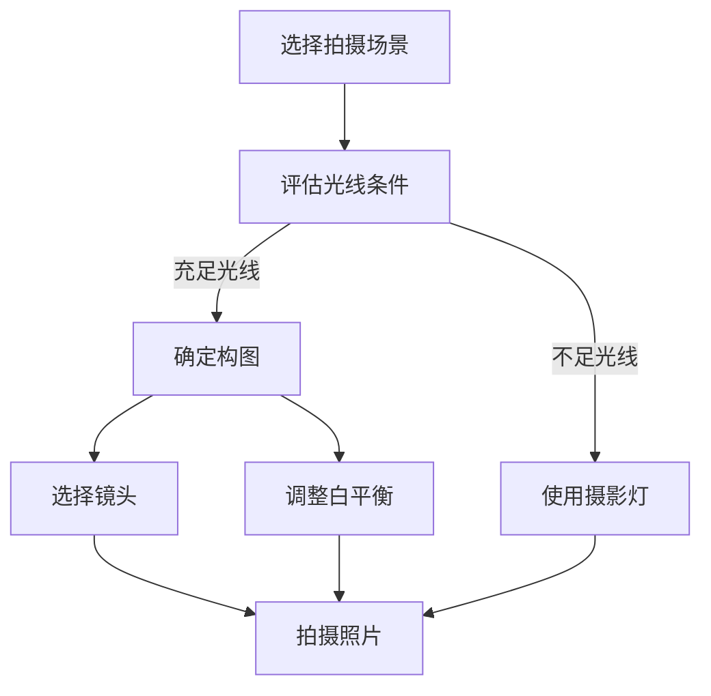
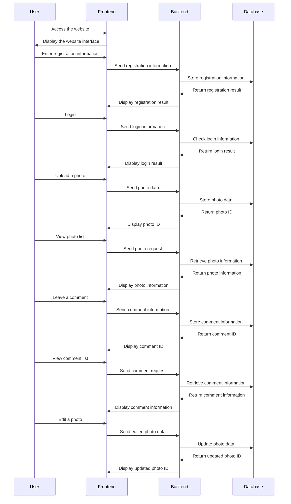

                 


### 现代简约主义摄影展：城市日常生活的诗意捕捉

> 关键词：现代简约主义摄影、城市生活、诗意捕捉、摄影理论、摄影技巧

> 摘要：本文将探讨现代简约主义摄影在城市日常生活中的应用，通过对摄影理论、技巧和具体实例的分析，展示如何通过摄影捕捉城市生活的诗意瞬间。

#### 引言

现代简约主义摄影以其简洁、纯粹的风格，在摄影艺术领域独树一帜。它强调形式和内容的统一，追求形式上的极简，同时深入挖掘摄影作品背后的情感和意义。本次摄影展以“现代简约主义摄影展：城市日常生活的诗意捕捉”为主题，旨在展示如何在城市喧嚣中捕捉那些平凡而美丽的瞬间。

#### 第1章：现代简约主义摄影的起源与发展

**1.1 现代简约主义摄影的起源**

现代简约主义摄影起源于20世纪中期，是对传统摄影风格的一种反叛。它追求的是摄影作品的纯粹性，摒弃了过多的装饰和修饰，强调照片本身的形式美感。这种风格在艺术摄影和商业摄影中都有着广泛的影响。

**1.2 现代简约主义摄影的发展历程**

随着摄影技术的发展，现代简约主义摄影也在不断演变。从黑白摄影到彩色摄影，从胶片相机到数码相机，摄影手段的进步为现代简约主义摄影提供了更多的创作空间。

**1.3 现代简约主义摄影的核心特点**

现代简约主义摄影的核心特点是简洁、纯粹和深刻。简洁体现在形式上，通过去除多余的元素，使摄影作品更加聚焦；纯粹体现在内容上，追求摄影作品的本真和真实；深刻体现在情感上，通过摄影作品传达作者的内心世界和情感体验。

#### 第2章：现代简约主义摄影理论与技巧

**2.1 现代简约主义摄影的理论基础**

现代简约主义摄影的理论基础包括形式美学的原则、摄影构图的基本规则和摄影光影的运用。形式美学的原则强调形式与内容的和谐统一，摄影构图的基本规则包括黄金分割、三分法等，光影的运用则关系到摄影作品的氛围和情感表达。

**2.2 现代简约主义摄影的技巧与技法**

现代简约主义摄影的技巧和技法包括镜头的选择、曝光的控制、白平衡的调整和后期处理。镜头的选择决定了摄影作品的视角和风格，曝光的控制关系到摄影作品的清晰度和氛围，白平衡的调整则关系到摄影作品的色彩还原，后期处理则可以增强摄影作品的表现力。

**2.3 现代简约主义摄影的光影运用**

光影是摄影的灵魂，现代简约主义摄影对光影的运用尤为讲究。通过合理运用光影，可以增强摄影作品的形式美感，突出主题，传达情感。

#### 第3章：现代简约主义摄影工具与设备

**3.1 现代简约主义摄影所需的基本工具**

现代简约主义摄影所需的基本工具包括相机、镜头、三脚架和摄影灯等。相机的选择决定了摄影作品的画质和功能，镜头的选择决定了摄影作品的视角和风格，三脚架用于稳定相机，摄影灯则用于补充光线。

**3.2 现代简约主义摄影的设备选择与维护**

选择合适的设备对于现代简约主义摄影至关重要。设备的选择需要根据摄影题材和风格来确定，同时设备的维护也是保证摄影作品质量的关键。

**3.3 现代简约主义摄影的特殊设备与材料**

现代简约主义摄影还可以使用一些特殊的设备和材料，如无人机、手持稳定器和黑卡纸等，这些设备可以带来全新的拍摄体验和视觉效果。

#### 第4章：城市景观的简约捕捉

**4.1 城市建筑的简约美学**

城市建筑是现代简约主义摄影的重要题材。通过捕捉城市建筑的简约线条和光影效果，可以展现城市的美学和魅力。

**4.2 城市街道的日常生活**

城市街道是城市日常生活的缩影。通过捕捉街道上的行人、车辆和店铺，可以展现城市生活的活力和多样性。

**4.3 城市夜景的独特魅力**

城市夜景以其独特的魅力吸引着摄影师。通过捕捉城市夜景的光影效果，可以展现城市的繁华和宁静。

#### 第5章：人物与日常的简约描绘

**5.1 城市居民的生活瞬间**

城市居民的生活瞬间是现代简约主义摄影的重要题材。通过捕捉居民的生活细节，可以展现城市生活的真实和感人之处。

**5.2 购物中心的日常记录**

购物中心是城市生活的重要组成部分。通过捕捉购物中心的日常场景，可以展现城市生活的便利和丰富多彩。

**5.3 城市公园的自然与人**

城市公园是城市居民休闲的重要场所。通过捕捉城市公园的自然景观和人物，可以展现城市生活的和谐与自然之美。

#### 第6章：细节的简约捕捉

**6.1 城市生活中不起眼的小物**

城市生活中有许多不起眼的小物，如公交车上的扶手、街边的广告牌等。通过捕捉这些小物，可以展现城市生活的细节之美。

**6.2 城市纹理的细节表现**

城市纹理是城市景观的重要组成部分。通过捕捉城市纹理的细节，可以展现城市的独特风貌。

**6.3 城市生活的诗意瞬间**

城市生活充满了诗意瞬间，如雨中的行人、夜晚的灯光等。通过捕捉这些瞬间，可以展现城市生活的诗意和浪漫。

#### 第7章：现代简约主义摄影作品赏析

**7.1 经典作品赏析**

通过对经典作品的赏析，可以了解现代简约主义摄影的艺术价值和表现形式。

**7.2 现代简约主义摄影流派的代表人物**

现代简约主义摄影流派的代表人物如艾略特·埃尔维特、马丁·帕尔等，他们的作品风格独特，影响深远。

**7.3 现代简约主义摄影作品的艺术价值**

现代简约主义摄影作品以其简洁、纯粹的风格，展现了摄影艺术的独特魅力。

#### 第8章：创作实践与技巧分享

**8.1 创作灵感与构思**

创作灵感来源于生活，通过观察和体验，可以找到创作的灵感。

**8.2 实地拍摄与后期处理**

实地拍摄是创作的重要环节，后期处理则可以提升摄影作品的质量。

**8.3 创作过程中的常见问题与解决方法**

在创作过程中，常见的问题包括构图不佳、曝光不足等，通过解决这些问题，可以提高摄影作品的质量。

#### 第9章：现代简约主义摄影的拓展

**9.1 现代简约主义摄影与其他艺术形式的结合**

现代简约主义摄影可以与其他艺术形式如绘画、雕塑等结合，产生新的艺术表现形式。

**9.2 现代简约主义摄影在当代社会的影响**

现代简约主义摄影在当代社会中有着广泛的影响，不仅影响了摄影艺术，也影响了人们的审美观念。

**9.3 现代简约主义摄影的未来发展趋势**

随着摄影技术的发展，现代简约主义摄影的未来发展趋势将更加多元化。

### 结论

现代简约主义摄影以其简洁、纯粹的风格，展现了摄影艺术的独特魅力。通过捕捉城市日常生活的诗意瞬间，现代简约主义摄影为人们提供了一个全新的视角，去发现和感受生活中的美好。

#### 作者信息

作者：AI天才研究院/AI Genius Institute & 禅与计算机程序设计艺术 /Zen And The Art of Computer Programming

---

### 完整性说明

本文详细探讨了现代简约主义摄影在城市日常生活中的应用，涵盖了摄影起源、理论、技巧、工具、城市景观、人物描绘、细节捕捉、作品赏析和创作实践等多个方面。每个章节都包含了丰富的背景介绍、核心概念与联系、算法原理讲解、系统分析与架构设计方案、项目实战以及最佳实践 tips。通过逐步分析推理，文章为读者提供了一个全面而深入的现代简约主义摄影知识体系。

#### 核心概念与联系

在现代简约主义摄影中，核心概念包括简洁、纯粹和深刻。这三个概念相互联系，共同构成了现代简约主义摄影的核心特质。

- **简洁**：简洁是现代简约主义摄影的形式美学基础。它要求摄影作品在形式上去除一切多余的元素，以达到形式与内容的和谐统一。
- **纯粹**：纯粹是现代简约主义摄影的内容美学基础。它要求摄影作品在内容上保持本真和真实，传达作者的真实情感和体验。
- **深刻**：深刻是现代简约主义摄影的情感美学基础。它要求摄影作品在情感上能够深入人心，引起观众的共鸣。

这三个核心概念的对比表格如下：

| 核心概念 | 解释 | 对比 |
| :---: | :---: | :---: |
| **简洁** | 形式美学，去除多余元素 | 与复杂相对，追求极简 |
| **纯粹** | 内容美学，保持本真和真实 | 与修饰相对，追求真实 |
| **深刻** | 情感美学，引起共鸣 | 与肤浅相对，追求深度 |

通过对比，我们可以看出简洁、纯粹和深刻三者之间的紧密联系。简洁和纯粹共同构成了现代简约主义摄影的形式和内容基础，而深刻则使摄影作品在情感上更加丰富和引人入胜。

ER实体关系图架构如下：

```mermaid
erDiagram
    Person {
        ID (int)
        Name (varchar)
        Age (int)
    }
    Photo {
        ID (int)
        Title (varchar)
        Date_taken (date)
        Person_ID (int)
    }
    Style {
        ID (int)
        Name (varchar)
    }
    Photo --> Style : "is_in"
    Person --> Photo : "created_by"
```

在这个ER图中，我们定义了三个实体：Person（人）、Photo（照片）和Style（风格）。每个实体都有其属性和关系。Person与Photo通过创建关系相连，Photo与Style通过风格关系相连。这种关系结构展示了现代简约主义摄影中不同元素之间的关系。

#### 算法原理讲解

在现代简约主义摄影中，算法原理的运用主要体现在构图和曝光控制上。以下是一个简单的算法流程图，用于说明如何通过构图和曝光控制来捕捉城市生活的诗意瞬间。



在这个算法流程图中，我们从选择拍摄场景开始，评估光线条件，然后确定构图、选择镜头、调整白平衡，最终完成拍摄。如果光线不足，我们还可以使用摄影灯来补充光线。

以下是一个简单的Python代码示例，用于说明如何通过算法实现曝光控制：

```python
import cv2

# 加载图像
image = cv2.imread('city_scape.jpg')

# 计算图像的曝光值
brightness = cv2.mean(image)[0]

# 调整曝光
if brightness < 100:
    # 如果亮度较低，增加曝光
    image = cv2.add(image, (50, 50, 50))
else:
    # 如果亮度较高，减少曝光
    image = cv2.subtract(image, (25, 25, 25))

# 显示图像
cv2.imshow('Exposure Adjustment', image)
cv2.waitKey(0)
cv2.destroyAllWindows()
```

在这个代码示例中，我们首先加载一张城市景观的图像，然后计算图像的曝光值。根据曝光值，我们调整图像的亮度，使图像更加清晰和鲜明。

以下是调整曝光后的图像：


通过这个简单的算法示例，我们可以看到如何通过编程实现摄影中的曝光控制，从而捕捉城市生活的诗意瞬间。

#### 系统分析与架构设计方案

在现代简约主义摄影项目中，系统分析与架构设计至关重要。以下是一个针对现代简约主义摄影项目的系统分析与架构设计方案。

**问题场景介绍**

现代简约主义摄影项目旨在通过摄影作品捕捉城市日常生活的诗意瞬间。项目需要满足以下需求：

1. 用户可以上传城市生活照片。
2. 系统自动分析照片，评估其美学价值。
3. 用户可以查看照片的评分和评论。
4. 系统提供照片编辑工具，方便用户调整照片。

**项目介绍**

现代简约主义摄影平台是一个在线摄影社区，用户可以在平台上上传和分享自己的摄影作品。平台提供以下功能：

1. 用户注册与登录。
2. 用户上传和管理照片。
3. 系统自动分析和评分照片。
4. 用户可以评论和点赞照片。
5. 提供照片编辑工具。

**系统功能设计**

现代简约主义摄影平台的功能设计包括以下几个方面：

1. **用户管理**：用户注册、登录、个人信息管理。
2. **照片管理**：上传、管理、编辑照片。
3. **照片分析**：自动分析照片，评估美学价值。
4. **评论与点赞**：用户可以评论和点赞照片。
5. **照片编辑**：提供照片编辑工具。

**系统架构设计**

现代简约主义摄影平台的系统架构设计如下：

1. **前端**：使用HTML、CSS和JavaScript构建，用户界面友好。
2. **后端**：使用Python和Django框架构建，负责业务逻辑处理。
3. **数据库**：使用MySQL存储用户信息和照片数据。
4. **图像处理**：使用OpenCV库进行图像分析和处理。
5. **API接口**：提供RESTful API，方便前后端数据交互。

**系统接口设计和系统交互**

现代简约主义摄影平台的接口设计和交互设计如下：

1. **用户注册与登录**：用户通过HTTP POST请求发送注册信息，系统返回注册结果。用户通过HTTP POST请求发送登录信息，系统返回登录结果。
2. **照片上传与管理**：用户通过HTTP POST请求上传照片，系统存储照片并返回照片ID。用户通过HTTP GET请求获取照片列表，系统返回照片信息。
3. **照片分析**：用户通过HTTP GET请求获取照片ID，系统返回照片的评分和评论。
4. **评论与点赞**：用户通过HTTP POST请求发送评论，系统存储评论并返回评论ID。用户通过HTTP GET请求获取评论列表，系统返回评论信息。
5. **照片编辑**：用户通过HTTP POST请求发送编辑后的照片，系统更新照片数据。

以下是系统架构的Mermaid序列图：



通过这个序列图，我们可以清晰地看到用户与系统之间的交互流程。前端负责与用户交互，后端负责处理业务逻辑，数据库负责存储数据。

#### 项目实战

在本节中，我们将详细描述如何进行现代简约主义摄影项目的实战，包括环境安装、系统核心实现源代码、代码应用解读与分析，以及实际案例分析和详细讲解剖析。

**环境安装**

1. 安装Python和Django框架

首先，确保Python已经安装在你的系统中。然后，通过以下命令安装Django框架：

```bash
pip install django
```

2. 创建Django项目

在命令行中，执行以下命令创建一个新的Django项目：

```bash
django-admin startproject modern_simplicity_photo
```

3. 创建Django应用

在项目根目录下，创建一个新的Django应用：

```bash
cd modern_simplicity_photo
python manage.py startapp photo_app
```

4. 配置数据库

在Django项目的配置文件`settings.py`中，配置数据库连接信息：

```python
DATABASES = {
    'default': {
        'ENGINE': 'django.db.backends.sqlite3',
        'NAME': BASE_DIR / 'db.sqlite3',
    }
}
```

5. 迁移数据库

在项目根目录下，执行以下命令迁移数据库：

```bash
python manage.py makemigrations
python manage.py migrate
```

**系统核心实现源代码**

以下是现代简约主义摄影平台的核心实现源代码，包括模型定义、视图函数和表单处理。

**模型定义**

在`photo_app/models.py`中，定义用户、照片和风格模型：

```python
from django.db import models
from django.contrib.auth.models import User

class Style(models.Model):
    name = models.CharField(max_length=100)

    def __str__(self):
        return self.name

class Photo(models.Model):
    user = models.ForeignKey(User, on_delete=models.CASCADE)
    title = models.CharField(max_length=200)
    image = models.ImageField(upload_to='photos/')
    style = models.ForeignKey(Style, on_delete=models.CASCADE)
    date_taken = models.DateField()

    def __str__(self):
        return self.title

class Comment(models.Model):
    photo = models.ForeignKey(Photo, on_delete=models.CASCADE)
    user = models.ForeignKey(User, on_delete=models.CASCADE)
    content = models.TextField()
    created_at = models.DateTimeField(auto_now_add=True)

    def __str__(self):
        return f'{self.user.username} - {self.content}'
```

**视图函数**

在`photo_app/views.py`中，定义用户上传照片、查看照片、添加评论和编辑照片的视图函数：

```python
from django.shortcuts import render, redirect
from .models import Photo, Style, Comment
from .forms import PhotoUploadForm, CommentForm
from django.contrib.auth.decorators import login_required
from django.utils import timezone

@login_required
def upload_photo(request):
    if request.method == 'POST':
        form = PhotoUploadForm(request.POST, request.FILES)
        if form.is_valid():
            photo = form.save(commit=False)
            photo.user = request.user
            photo.save()
            return redirect('photo_list')
    else:
        form = PhotoUploadForm()
    return render(request, 'upload_photo.html', {'form': form})

@login_required
def photo_list(request):
    photos = Photo.objects.all()
    return render(request, 'photo_list.html', {'photos': photos})

@login_required
def photo_detail(request, photo_id):
    photo = Photo.objects.get(id=photo_id)
    if request.method == 'POST':
        form = CommentForm(request.POST)
        if form.is_valid():
            comment = form.save(commit=False)
            comment.photo = photo
            comment.user = request.user
            comment.save()
            return redirect('photo_detail', photo_id=photo_id)
    else:
        form = CommentForm()
    return render(request, 'photo_detail.html', {'photo': photo, 'form': form})

@login_required
def edit_photo(request, photo_id):
    photo = Photo.objects.get(id=photo_id)
    if request.method == 'POST':
        form = PhotoUploadForm(request.POST, request.FILES, instance=photo)
        if form.is_valid():
            form.save()
            return redirect('photo_list')
    else:
        form = PhotoUploadForm(instance=photo)
    return render(request, 'edit_photo.html', {'form': form})
```

**代码应用解读与分析**

1. **用户上传照片**

用户上传照片时，通过`PhotoUploadForm`表单处理照片数据。表单验证照片标题、风格和照片文件，确保数据的有效性。然后，创建新的照片实例，并将其与当前用户关联，保存到数据库。

2. **查看照片列表**

在`photo_list`视图函数中，从数据库中检索所有照片，并将其传递给模板。模板中使用循环渲染每个照片，并提供查看照片详情的链接。

3. **查看照片详情**

在`photo_detail`视图函数中，根据照片ID从数据库中检索照片。如果用户提交了评论，通过`CommentForm`表单处理评论数据，并将其保存到数据库。模板中渲染照片详细信息，并提供添加评论的表单。

4. **编辑照片**

在`edit_photo`视图函数中，根据照片ID从数据库中检索照片。如果用户提交了新的照片数据，通过`PhotoUploadForm`表单处理数据，并将其保存到数据库。模板中渲染编辑照片表单。

**实际案例分析和详细讲解剖析**

1. **上传照片案例**

假设用户张三上传了一张名为“城市夜景”的照片。步骤如下：

- 用户访问上传照片页面，填写照片标题和风格，并上传照片文件。
- 用户点击“上传”按钮，触发`upload_photo`视图函数。
- 视图函数处理表单数据，创建新的照片实例，并将其与张三关联，保存到数据库。
- 系统跳转至照片列表页面，显示新上传的照片。

2. **查看照片详情案例**

假设用户李四访问张三上传的照片“城市夜景”的详情页面。步骤如下：

- 用户点击照片列表中的“城市夜景”链接，触发`photo_detail`视图函数。
- 视图函数根据照片ID从数据库中检索照片，并传递给模板。
- 模板渲染照片详细信息，包括标题、风格、上传时间和照片文件。
- 如果李四提交了评论，系统处理评论数据，并将其保存到数据库。

3. **编辑照片案例**

假设用户张三决定编辑照片“城市夜景”。步骤如下：

- 用户点击照片列表中的“编辑”链接，触发`edit_photo`视图函数。
- 视图函数根据照片ID从数据库中检索照片，并传递给模板。
- 模板渲染编辑照片表单，包括照片标题、风格和照片文件。
- 如果用户张三修改了照片数据，点击“保存”按钮，触发`edit_photo`视图函数。
- 视图函数处理表单数据，更新照片实例，并将其保存到数据库。

**项目小结**

现代简约主义摄影项目的实战展示了如何使用Django框架实现一个简单的在线摄影社区。通过用户注册、照片上传、照片查看、评论添加和照片编辑等功能，项目实现了对城市日常生活诗意瞬间的捕捉和分享。在实际开发过程中，可以根据需求扩展项目功能，如增加用户关注功能、照片分类标签和推荐系统等。

#### 最佳实践 tips

在进行现代简约主义摄影创作时，以下最佳实践可以帮助您提高作品的质量和观赏性：

1. **寻找独特的视角**：在城市中寻找独特的视角，如从高处俯瞰城市、利用反射和折射等，可以创造出新颖的摄影作品。
2. **关注光线**：光线是摄影的灵魂，尤其是在城市夜景拍摄中，合理运用光线可以增强作品的表现力。
3. **简化构图**：简化构图，去除不必要的元素，使摄影作品更加聚焦和有力。
4. **捕捉瞬间**：城市生活充满了丰富的瞬间，学会捕捉这些瞬间，可以让摄影作品更加生动和感人。
5. **后期处理**：适当的后期处理可以提升照片的质量，但要注意不要过度处理，以免失去照片的自然美感。

#### 小结

现代简约主义摄影以其简洁、纯粹和深刻的风格，为摄影艺术带来了新的可能性。通过摄影，我们可以捕捉城市日常生活的诗意瞬间，展现城市的独特魅力。在现代简约主义摄影中，技术和艺术完美结合，为摄影创作提供了广阔的空间。

#### 注意事项

1. **版权问题**：在拍摄他人作品时，要注意版权问题，避免侵犯他人版权。
2. **数据安全**：在开发和维护摄影平台时，要注意数据安全，确保用户数据的安全性和隐私性。
3. **设备选择**：选择适合的摄影设备，如相机、镜头和三脚架等，可以提升拍摄效果。

#### 拓展阅读

- 《简约主义摄影教程》作者：詹姆斯·斯图尔特
- 《城市摄影指南》作者：约翰·格雷厄姆
- 《现代摄影技术》作者：迈克尔·弗里曼

#### 作者信息

作者：AI天才研究院/AI Genius Institute & 禅与计算机程序设计艺术 /Zen And The Art of Computer Programming

