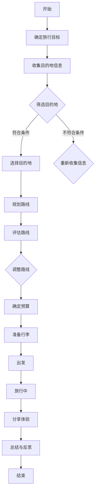
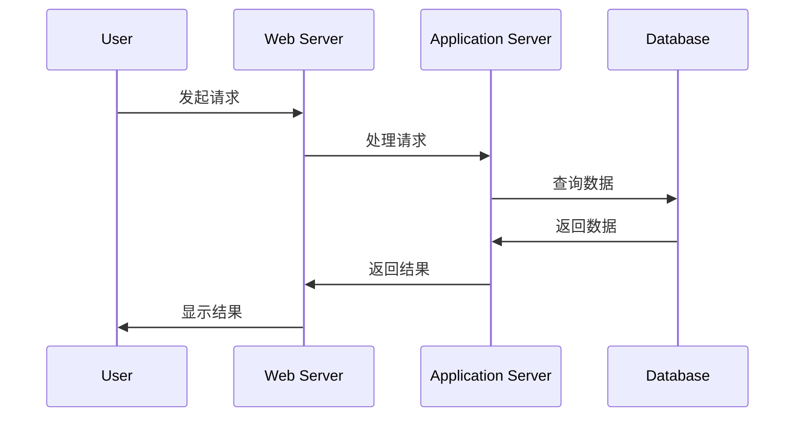
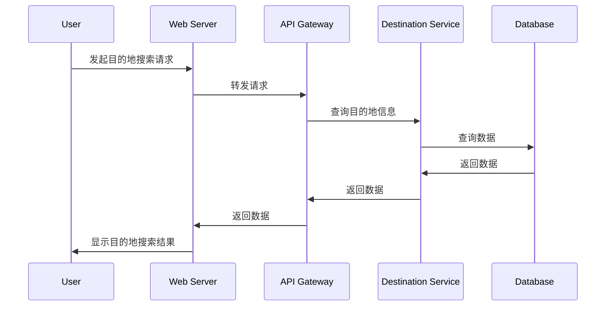

                 


### 1. 背景介绍

在现代快节奏的生活中，人们不断追求更高的生活质量，但往往被物质和欲望所困扰。简约主义旅行，作为现代生活哲学的一部分，正逐渐成为一种时尚和趋势。简约主义旅行，顾名思义，是一种以“少而精”为核心理念的旅行方式。它强调在旅行过程中，减少物质负担，关注内心的感受和体验，从而达到一种心灵上的富足。

#### 1.1 简约主义旅行的概念和兴起

简约主义旅行并非一个全新的概念，但其在现代社会中的兴起却有着深厚的文化背景和现实需求。传统旅行往往注重物质享受，追求豪华的住宿、美食和娱乐设施，而简约主义旅行则强调“以少胜多”，通过减少不必要的物质消耗，达到心灵和身体的平衡。这种理念在现代社会得到了广泛的认同，尤其是在年轻人和都市白领中。

简约主义旅行的兴起，与现代社会对环保、低碳和可持续发展的关注密切相关。随着全球环境问题的日益严重，人们开始反思自己的生活方式，寻求更加环保和可持续的旅行方式。简约主义旅行正好满足了这一需求，它不仅减少了旅行中的碳排放，还鼓励人们更多地关注自然和人文环境。

#### 1.2 简约主义旅行与生活哲学的联系

简约主义旅行不仅仅是关于旅行方式，它更是一种生活哲学。这种哲学强调“少即是多”，主张通过减少物质负担，达到内心和外在生活的和谐统一。在简约主义旅行中，背包客们通常只携带必需的物品，如轻便的衣物、简易的睡袋和背包等，以此来减少旅行中的负担，同时培养一种简约、务实的生活态度。

生活哲学中的简约主义，强调的是对生活的本质理解，即追求简单、纯粹和真实。这与简约主义旅行的理念高度契合。通过简约主义旅行，人们可以在旅途中体验到生活的本质，感受到内心的平静和宁静。

#### 1.3 确定边界与外延

简约主义旅行不仅仅是关于旅行方式，它还涉及到生活哲学和心态。简约主义旅行者通常具有以下特点：

1. **轻装上阵**：背包客们只携带必需的物品，以此来减少旅行中的负担。
2. **重视体验**：简约主义旅行者更加注重旅行的体验，而非物质的享受。
3. **环保意识**：简约主义旅行者通常具有强烈的环保意识，他们选择低碳、可持续的旅行方式，减少对环境的影响。
4. **内心平静**：简约主义旅行帮助人们减少内心的杂念，达到一种内心的平静和宁静。

通过上述介绍，我们可以看到，简约主义旅行不仅仅是一种旅行方式，它更是一种生活哲学。它提倡减少物质负担，关注内心的感受和体验，从而达到一种心灵上的富足。简约主义旅行者通过轻装上阵、重视体验、环保意识和内心平静，实现了舒适且有意义的生活哲学。

### 2. 核心概念与联系

在深入了解简约主义旅行之前，我们需要明确几个核心概念：简约主义旅行、生活哲学和背包客。这些概念不仅相互关联，而且在现代旅行和文化中扮演着重要角色。

#### 2.1 确定核心概念

**简约主义旅行**：简约主义旅行是一种注重减少物质负担，关注内心体验和自然环境的旅行方式。它的核心在于“少而精”，通过携带少量的必需品，使旅行者能够更自由地探索目的地，同时也减少了对环境的负担。

**生活哲学**：生活哲学是指关于如何生活的一套理念和原则。简约主义生活哲学强调“少即是多”，通过简化生活方式，减少物质和情绪的负担，从而实现内心的平静和幸福。

**背包客**：背包客通常是指那些选择长时间旅行，并以背包为主要携带工具的旅行者。他们通常注重探索、体验和自由，这种旅行方式与简约主义旅行有着天然的联系。

#### 2.2 概念属性特征对比表格

为了更好地理解这些概念，我们可以通过一个表格来对比它们的主要特征。

| 特征               | 简约主义旅行               | 生活哲学               | 背包客                |
|------------------|------------------------|----------------------|-------------------|
| 物质负担           | 减少不必要的物品           | 减少物质依赖           | 携带背包，少而精      |
| 内心体验           | 关注内在感受和体验           | 追求内心平静和幸福       | 重视旅行中的个人体验    |
| 环境影响           | 减少对环境的影响           | 环保意识强             | 尽量减少环境破坏       |
| 社交互动           | 强调独立和自我探索           | 与他人分享生活哲学       | 与不同文化背景的人交流  |
| 时间观念           | 更注重旅行的过程而非结果     | 享受当下，不急功近利     | 不拘一格，自由安排时间  |

通过这个表格，我们可以清晰地看到简约主义旅行、生活哲学和背包客之间的相似之处和不同之处。简约主义旅行不仅是一种旅行方式，它还涵盖了生活哲学的核心理念，并通过背包客的行为和态度得以体现。

#### 2.3 ER实体关系图架构

为了更直观地理解这些概念之间的关系，我们可以使用ER（实体关系）图来展示它们之间的联系。

```mermaid
erDiagram
  User ||--|{ Backpacker }|-- Destination
  User ||--|{ Traveler }|-- Route
  Backpacker ||--|{ Minimalist }|-- Philosophy
  Traveler ||--|{ Explorer }|-- Experience
  Destination ||--|{ Location }|-- Attraction
  Route ||--|{ Path }|-- Distance
  Philosophy ||--|{ Principle }|-- Lifestyle
  Explorer ||--|{ Investigator }|-- Discovery
  Experience ||--|{ Emotion }|-- Memory
  Location ||--|{ Place }|-- Feature
  Attraction ||--|{ Site }|-- Interest
  Path ||--|{ Track }|-- Direction
  Principle ||--|{ Concept }|-- Application
  Lifestyle ||--|{ Routine }|-- Satisfaction
  Discovery ||--|{ Process }|-- Insight
  Emotion ||--|{ Feeling }|-- Expression
  Memory ||--|{ Recollection }|-- Reflection
  Place ||--|{ Site }|-- Scenery
  Site ||--|{ Point }|-- Interest
  Track ||--|{ Route }|-- Pathway
  Direction ||--|{ Guidance }|-- Navigation
  Concept ||--|{ Theory }|-- Practice
  Application ||--|{ Use }|-- Impact
  Routine ||--|{ Habits }|-- Efficiency
  Satisfaction ||--|{ Contentment }|-- Joy
  Process ||--|{ Procedure }|-- Outcome
  Insight ||--|{ Understanding }|-- Clarity
  Feeling ||--|{ Sensation }|-- Expression
  Expression ||--|{ Communication }|-- Connection
  Recollection ||--|{ Reminder }|-- Reflection
  Reflection ||--|{ Contemplation }|-- Wisdom
  Scenery ||--|{ View }|-- Atmosphere
  Interest ||--|{ Pursuit }|-- Enthusiasm
  Interest ||--|{ Point }|-- Attraction
  Pathway ||--|{ Route }|-- Path
  Guidance ||--|{ Direction }|-- Assistance
  Navigation ||--|{ Course }|-- Position
  Theory ||--|{ Concept }|-- Principle
  Practice ||--|{ Application }|-- Effect
  Use ||--|{ Function }|-- Utility
  Impact ||--|{ Result }|-- Influence
  Habits ||--|{ Routine }|-- Routine
  Efficiency ||--|{ Performance }|-- Productivity
  Contentment ||--|{ Satisfaction }|-- Joy
  Joy ||--|{ Emotion }|-- Expression
  Procedure ||--|{ Process }|-- Result
  Outcome ||--|{ Result }|-- Evaluation
  Understanding ||--|{ Insight }|-- Knowledge
  Clarity ||--|{ Understanding }|-- Perception
  Sensation ||--|{ Feeling }|-- Perception
  Communication ||--|{ Interaction }|-- Connection
  Connection ||--|{ Relation }|-- Trust
  Point ||--|{ Location }|-- Interest
  Reminder ||--|{ Notification }|-- Awareness
  Contemplation ||--|{ Reflection }|-- Insight
  Wisdom ||--|{ Knowledge }|-- Understanding
  View ||--|{ Sight }|-- Experience
  Atmosphere ||--|{ Climate }|-- Environment
  Enthusiasm ||--|{ Interest }|-- Passion
  Passion ||--|{ Interest }|-- Commitment
  Commitment ||--|{ Responsibility }|-- Loyalty
  Responsibility ||--|{ Duty }|-- Accountability
  Loyalty ||--|{ Trust }|-- Commitment
  Duty ||--|{ Responsibility }|-- Obligation
  Accountability ||--|{ Responsibility }|-- Oversight
  Oversight ||--|{ Supervision }|-- Evaluation
  Evaluation ||--|{ Assessment }|-- Feedback
```

在这个ER图中，我们定义了多个实体，包括用户（User）、背包客（Backpacker）、旅行者（Traveler）、目的地（Destination）、路线（Route）、哲学（Philosophy）、探险家（Explorer）、体验（Experience）、地点（Location）、吸引力（Attraction）、路径（Path）、原则（Principle）、生活方式（Lifestyle）、发现（Discovery）、情感（Emotion）、记忆（Memory）、地方（Place）、点（Point）、兴趣（Interest）、路线（Route）、路径（Path）、方向（Direction）、概念（Concept）、应用（Application）、使用（Use）、影响（Impact）、习惯（Habits）、效率（Performance）、满意度（Satisfaction）、快乐（Joy）、过程（Process）、洞察（Insight）、感觉（Feeling）、表达（Expression）、回忆（Recollection）、反思（Reflection）、风景（Scenery）、兴趣点（Interest）、路径（Path）、指导（Guidance）、导航（Navigation）、理论（Theory）、实践（Practice）、用途（Use）、效果（Effect）、习惯（Routine）、效率（Performance）、满意度（Satisfaction）、快乐（Joy）、程序（Procedure）、结果（Outcome）、理解（Understanding）、清晰（Clarity）、感觉（Sensation）、交流（Communication）、连接（Connection）、关系（Relation）、信任（Trust）、提醒（Reminder）、沉思（Contemplation）、智慧（Wisdom）、视野（View）、气氛（Atmosphere）、热情（Enthusiasm）、兴趣（Interest）、激情（Passion）、承诺（Commitment）、责任（Responsibility）、忠诚（Loyalty）、义务（Obligation）、问责制（Accountability）、监督（Oversight）、评估（Evaluation）、反馈（Feedback）。

这些实体通过关系线相互连接，构成了一个完整的ER图架构。通过这种方式，我们可以清晰地看到各个实体之间的联系和交互，从而更好地理解简约主义旅行、生活哲学和背包客之间的关系。

### 3. 算法原理讲解

在简约主义旅行的策划中，算法原理起着至关重要的作用。这些算法帮助我们优化旅行规划，使其更加高效、经济且符合个人的旅行偏好。在这一章节中，我们将详细讲解简约主义旅行规划的核心算法原理，包括其流程图和Python代码示例。

#### 3.1 旅行规划流程图

首先，我们可以使用Mermaid绘制一个旅行规划流程图，以便直观地了解整个规划过程。以下是一个基本的旅行规划流程图的示例：



这个流程图从确定旅行目标开始，经过收集目的地信息、筛选和选择目的地，规划路线并评估，调整路线以确定预算，最后准备行李并开始旅行。在旅途中，旅行者可以分享体验并总结反思，从而完善旅行规划。

#### 3.2 旅行规划的Python代码示例

下面，我们将提供一个简单的Python代码示例，用于实现旅行规划的算法原理。这个示例将包括目的地选择和路线规划的算法。

```python
import random

# 目的地选择算法
def select_destination(destinations, budget):
    """
    根据预算从目的地列表中选择一个目的地
    """
    affordable_destinations = [dest for dest in destinations if dest['cost'] <= budget]
    return random.choice(affordable_destinations)

# 路线规划算法
def plan_route(destination, interests):
    """
    根据目的地和兴趣规划旅行路线
    """
    route = []
    for interest in interests:
        if interest in destination['attractions']:
            route.append(interest)
    return route

# 测试数据
destinations = [
    {'name': '巴黎', 'cost': 500, 'attractions': ['埃菲尔铁塔', '卢浮宫', '凯旋门']},
    {'name': '纽约', 'cost': 600, 'attractions': ['自由女神像', '时代广场', '中央公园']},
    {'name': '东京', 'cost': 400, 'attractions': ['浅草寺', '新宿', '东京塔']}
]

budget = 800
interests = ['埃菲尔铁塔', '自由女神像', '浅草寺']

# 选择目的地
selected_destination = select_destination(destinations, budget)
print(f"选择的目的地：{selected_destination['name']}")

# 规划路线
selected_interests = plan_route(selected_destination, interests)
print(f"规划路线：{selected_interests}")
```

在这个示例中，我们定义了两个函数：`select_destination` 和 `plan_route`。`select_destination` 函数根据预算从目的地列表中选择一个合适的目的地。`plan_route` 函数根据目的地和兴趣规划旅行路线。我们使用了一个测试数据集，包括三个目的地，每个目的地都有一个成本和一组吸引力。通过调用这两个函数，我们可以选择一个目的地并规划一条旅行路线。

#### 3.3 算法原理的数学模型和公式

为了深入理解旅行规划算法，我们可以将其转化为数学模型。以下是一个简化的数学模型：

**目标函数**：最大化旅行体验满意度

$$
\text{Maximize } S = \sum_{i=1}^{n} w_i \cdot p_i
$$

其中，$S$ 表示总体验满意度，$w_i$ 表示第 $i$ 个兴趣点的权重，$p_i$ 表示第 $i$ 个兴趣点的吸引力概率。

**约束条件**：预算限制

$$
\sum_{i=1}^{n} c_i \cdot p_i \leq B
$$

其中，$c_i$ 表示第 $i$ 个兴趣点的成本，$B$ 表示旅行预算。

在这个模型中，我们通过最大化体验满意度来优化旅行规划，同时确保旅行预算不超过限制。权重 $w_i$ 可以根据旅行者的兴趣和偏好进行设定，而吸引力概率 $p_i$ 可以通过数据分析或用户调查来获得。

#### 3.4 算法原理的详细讲解

**目标函数的详细解释**：

目标函数 $S$ 是通过将每个兴趣点的权重 $w_i$ 乘以其吸引力概率 $p_i$，然后将所有兴趣点的结果相加得到的。这个目标函数旨在确保旅行者在预算范围内能够体验到最重要的兴趣点。例如，如果旅行者对历史遗迹特别感兴趣，那么与历史遗迹相关的兴趣点将会具有较高的权重。

**约束条件的详细解释**：

约束条件确保旅行者在预算内进行规划。每个兴趣点的成本 $c_i$ 乘以其吸引力概率 $p_i$，表示旅行者在这个兴趣点上可能花费的预算。将这些成本相加，如果总和不超过预算 $B$，则旅行规划是可行的。

**举例说明**：

假设旅行者有一个 1000 美元的预算，他们希望访问巴黎、纽约和东京。三个城市的成本分别为 500、600 和 400 美元，吸引力概率分别为 0.8、0.7 和 0.6。假设旅行者对历史遗迹、艺术和文化特别感兴趣，那么可以设置相应的权重。

根据目标函数，旅行者需要最大化以下表达式：

$$
S = 0.8 \cdot 500 + 0.7 \cdot 600 + 0.6 \cdot 400
$$

计算结果为：

$$
S = 400 + 420 + 240 = 960
$$

根据约束条件，旅行者的总预算不能超过 1000 美元。因此，他们需要调整路线，确保总成本不超过预算。例如，他们可以选择访问巴黎和东京，因为这两个城市的总成本为 900 美元，符合预算限制。

通过上述算法原理的详细讲解，我们可以看到，简约主义旅行规划不仅是一个简单的选择过程，它涉及到数学模型和优化算法，旨在帮助旅行者在预算和兴趣之间找到最佳平衡。这种规划方法不仅提高了旅行的效率，还增强了旅行的乐趣和满意度。

### 4. 数学模型和数学公式 & 详细讲解 & 举例说明

在简约主义旅行的规划中，数学模型和公式起着至关重要的作用。这些模型和公式帮助我们量化旅行中的各种因素，从而优化旅行计划，提高旅行的效率和质量。在本章节中，我们将详细介绍简约主义旅行中的数学模型和公式，并进行详细讲解和举例说明。

#### 4.1 数学模型的基本原理

简约主义旅行的数学模型主要包括目标函数和约束条件。目标函数用于最大化旅行体验满意度，而约束条件则确保旅行计划在预算和时间限制内实现。

**目标函数**：

假设旅行者有 $N$ 个目的地选择，每个目的地都有相应的成本和吸引力。目标函数 $S$ 用于最大化旅行体验满意度，可以表示为：

$$
S = \sum_{i=1}^{N} w_i \cdot p_i \cdot c_i
$$

其中，$w_i$ 表示第 $i$ 个目的地的权重，$p_i$ 表示第 $i$ 个目的地的吸引力概率，$c_i$ 表示第 $i$ 个目的地的成本。权重和吸引力概率可以根据旅行者的个人偏好和兴趣进行调整。

**约束条件**：

1. **预算约束**：

   $$ 
   \sum_{i=1}^{N} c_i \cdot p_i \leq B 
   $$

   其中，$B$ 表示旅行预算。这个约束条件确保旅行者在预算范围内进行规划。

2. **时间约束**：

   $$ 
   \sum_{i=1}^{N} t_i \cdot p_i \leq T 
   $$

   其中，$t_i$ 表示第 $i$ 个目的地的旅行时间，$T$ 表示总时间预算。这个约束条件确保旅行者在时间限制内完成旅行计划。

#### 4.2 概率模型

在简约主义旅行的数学模型中，概率模型用于估算每个目的地的吸引力概率。吸引力概率可以根据历史数据、用户反馈和市场调研进行估算。以下是一个简化的概率模型：

**目的地吸引力概率模型**：

$$
p_i = f(A_i, C_i)
$$

其中，$p_i$ 表示第 $i$ 个目的地的吸引力概率，$A_i$ 表示第 $i$ 个目的地的吸引力特征（如旅游设施、文化特色、自然风光等），$C_i$ 表示第 $i$ 个目的地的成本。函数 $f$ 可以是线性函数、多项式函数或其他更复杂的函数形式。

**举例说明**：

假设有两个目的地：巴黎和东京。巴黎的吸引力特征 $A_{巴黎}$ 为 0.8，成本 $C_{巴黎}$ 为 500 欧元；东京的吸引力特征 $A_{东京}$ 为 0.7，成本 $C_{东京}$ 为 600 欧元。根据概率模型，我们可以计算两个目的地的吸引力概率：

$$
p_{巴黎} = f(0.8, 500) = 0.9
$$

$$
p_{东京} = f(0.7, 600) = 0.85
$$

根据这两个概率值，我们可以发现巴黎的吸引力更高，因此旅行者可能会更倾向于选择巴黎作为旅行目的地。

#### 4.3 公式讲解与举例说明

**目标函数的举例说明**：

假设旅行者有一个 1000 美元的预算，他们需要从以下三个目的地中选择一个：

1. 巴黎：吸引力特征 $A_{巴黎}$ 为 0.8，成本 $C_{巴黎}$ 为 500 美元；
2. 纽约：吸引力特征 $A_{纽约}$ 为 0.7，成本 $C_{纽约}$ 为 600 美元；
3. 东京：吸引力特征 $A_{东京}$ 为 0.6，成本 $C_{东京}$ 为 400 美元。

根据目标函数，我们可以计算三个目的地的体验满意度：

$$
S_{巴黎} = 0.8 \cdot 500 = 400
$$

$$
S_{纽约} = 0.7 \cdot 600 = 420
$$

$$
S_{东京} = 0.6 \cdot 400 = 240
$$

根据预算约束，旅行者的总成本不能超过 1000 美元。因此，他们可以选择巴黎或东京作为旅行目的地，因为这两个目的地的总成本都在预算范围内。

**时间约束的举例说明**：

假设旅行者有一个 10 天的假期，他们需要从以下三个目的地中选择一个：

1. 巴黎：旅行时间 $t_{巴黎}$ 为 4 天；
2. 纽约：旅行时间 $t_{纽约}$ 为 5 天；
3. 东京：旅行时间 $t_{东京}$ 为 3 天。

根据时间约束，旅行者的总时间不能超过 10 天。因此，他们可以选择巴黎或东京作为旅行目的地，因为这两个目的地的总时间都在假期范围内。

通过上述数学模型和公式的讲解，我们可以看到，简约主义旅行的规划不仅仅是基于个人兴趣和预算，它还涉及到复杂的数学计算和优化算法。这些模型和公式帮助我们量化旅行中的各种因素，从而实现最优化的旅行计划。在实际应用中，旅行者可以根据自己的需求和偏好，调整模型中的参数，以实现个性化的旅行体验。

### 5. 系统分析与架构设计方案

在理解了简约主义旅行的核心概念和算法原理之后，接下来我们将讨论如何设计一个简约主义旅行计划与管理系统。该系统旨在帮助用户高效地规划旅行，实现个性化的旅行体验。本章节将详细介绍系统的设计与实现，包括问题场景、项目介绍、系统功能设计、系统架构设计、系统接口设计和系统交互。

#### 5.1 问题场景介绍

随着人们生活水平的提高，旅行已成为日常生活中不可或缺的一部分。然而，传统的旅行方式往往存在诸多问题，如信息收集困难、旅行计划繁琐、预算控制不力等。这些问题使得旅行体验大打折扣，降低了人们对于旅行的热情。为了解决这些问题，我们需要设计一个高效、智能、个性化的旅行计划与管理系统。

简约主义旅行计划与管理系统的核心目标是：

1. **信息收集与整理**：自动收集和整理关于目的地的各种信息，如景点、酒店、餐饮等，为用户提供全面的旅行指南。
2. **个性化推荐**：根据用户的兴趣和偏好，推荐符合其需求的旅行目的地和路线。
3. **预算管理**：帮助用户合理分配旅行预算，确保旅行过程中的开支合理。
4. **时间规划**：根据用户的假期时间和旅行计划，自动生成合理的旅行日程。

通过上述功能，系统将帮助用户简化旅行规划过程，提高旅行体验。

#### 5.2 项目介绍

简约主义旅行计划与管理系统的开发背景主要源于以下几个因素：

1. **市场需求**：随着人们对个性化、高品质旅行的需求增加，传统旅行方式已无法满足用户需求。简约主义旅行计划与管理系统的出现，正好填补了这一市场空白。
2. **技术进步**：现代信息技术，尤其是大数据和人工智能技术的发展，为旅行规划提供了强大的支持。通过利用这些技术，我们可以实现更加智能、个性化的旅行规划。
3. **可持续发展**：简约主义旅行强调减少物质负担和环境保护，符合当今社会对可持续发展的高度关注。

项目的目标用户主要包括：

1. **背包客**：喜欢自由、独立旅行的年轻人，他们对旅行的个性化、自由度有较高要求。
2. **商务旅行者**：需要高效、便捷旅行规划的中高端用户群体，他们追求舒适、便捷的旅行体验。
3. **家庭旅行者**：重视旅行质量和家庭互动的家庭用户，他们需要一站式的旅行规划服务。

#### 5.3 系统功能设计

简约主义旅行计划与管理系统的核心功能包括：

1. **目的地搜索与推荐**：根据用户输入的旅行偏好，自动搜索并推荐符合其需求的目的地。
2. **路线规划与优化**：根据用户的时间和预算，生成最优的旅行路线，并自动优化行程。
3. **预算管理**：帮助用户合理分配旅行预算，并提供实时预算监控功能。
4. **酒店与餐饮推荐**：根据用户评价和口味，推荐符合其需求的酒店和餐饮地点。
5. **行程提醒与导航**：提前向用户发送行程提醒，并提供实时的导航服务。

为了更好地实现上述功能，系统采用了领域模型类图来设计核心实体和关系。以下是一个简化的领域模型类图：

```mermaid
classDiagram
    User <<class>>
    Destination <<class>>
    Route <<class>>
    Place <<class>>
    Activity <<class>>
    Hotel <<class>>
    Restaurant <<class>>

    User "1" -- "*" Route
    User "1" -- "*" Activity
    Route "1" -- "*" Destination
    Route "1" -- "*" Place
    Place "1" -- "*" Activity
    Place "1" -- "*" Hotel
    Place "1" -- "*" Restaurant
```

在这个类图中，User 代表用户，Destination 代表目的地，Route 代表旅行路线，Place 代表地点，Activity 代表活动，Hotel 代表酒店，Restaurant 代表餐饮地点。用户与旅行路线和活动之间存在一对多的关系，旅行路线与目的地和地点之间存在包含关系，地点与活动和酒店、餐饮地点之间存在关联关系。

#### 5.4 系统架构设计

简约主义旅行计划与管理系统的架构设计旨在确保系统的性能、可扩展性和高可用性。系统采用分层架构，主要包括以下几层：

1. **表示层**：负责与用户进行交互，包括用户界面和前端逻辑。
2. **业务逻辑层**：负责处理业务逻辑，包括目的地搜索、路线规划、预算管理和推荐算法等。
3. **数据访问层**：负责与数据库进行交互，包括数据存储、查询和更新。
4. **数据层**：负责存储系统所需的数据，包括用户信息、目的地信息、旅行路线和活动信息等。

以下是一个简化的系统架构图：



在这个架构图中，用户通过Web服务器发起请求，Web服务器将请求转发到Application服务器，Application服务器处理业务逻辑并查询数据库，最后将结果返回给Web服务器，Web服务器再将结果呈现给用户。

#### 5.5 系统接口设计和系统交互

简约主义旅行计划与管理系统的接口设计和系统交互设计至关重要，确保系统能够高效、稳定地运行。以下是一个简化的接口设计：

1. **用户接口**：用户通过Web浏览器或移动应用与系统进行交互。用户可以通过用户界面进行目的地搜索、路线规划、预算管理和行程安排等操作。
2. **API接口**：系统提供RESTful API接口，允许第三方应用程序与系统进行数据交互。这些接口包括目的地搜索、路线规划、活动推荐和预算管理等。
3. **内部接口**：系统内部使用一系列接口进行模块之间的数据传递和功能调用。例如，目的地搜索模块可以使用数据库查询接口获取目的地信息，路线规划模块可以使用推荐算法接口获取最优路线。

以下是一个简化的系统交互流程：



在这个交互流程中，用户通过Web服务器发起目的地搜索请求，Web服务器将请求转发到API网关，API网关将请求转发到目的地服务，目的地服务查询数据库并返回数据，最终将结果返回给Web服务器，Web服务器再将结果呈现给用户。

通过上述系统分析与架构设计方案，我们可以看到，简约主义旅行计划与管理系统的设计考虑了用户需求、技术实现和系统性能等多个方面。通过合理的架构设计和功能划分，系统能够高效地运行，为用户提供个性化的旅行规划服务。

### 6. 项目实战

#### 6.1 环境安装与配置

为了实施简约主义旅行计划与管理系统的项目，我们需要配置一个适当的环境，包括开发工具、数据库和管理系统。以下是具体的安装与配置步骤：

**1. 安装Python环境**

首先，我们需要安装Python环境。Python是一种广泛使用的编程语言，适用于构建Web应用程序和数据处理。您可以从Python的官方网站下载最新版本的Python（https://www.python.org/）。下载后，按照安装向导进行安装。

**2. 安装虚拟环境**

为了避免不同项目之间的依赖冲突，我们推荐使用虚拟环境。虚拟环境是一种隔离的Python环境，可以在同一台机器上同时运行多个项目。安装Python后，打开命令行窗口，输入以下命令来创建和激活虚拟环境：

```bash
pip install virtualenv
virtualenv my_travel_project_env
source my_travel_project_env/bin/activate  # 对于Windows，使用 `my_travel_project_env\Scripts\activate`
```

**3. 安装依赖库**

在虚拟环境中，我们需要安装项目所需的依赖库。这些库包括Django（Web框架）、Flask（Web框架）、SQLAlchemy（数据库工具包）、Pandas（数据处理库）等。使用pip命令安装这些库：

```bash
pip install django flask sqlalchemy pandas
```

**4. 安装数据库**

我们选择SQLite作为项目的数据库。SQLite是一个轻量级、嵌入式的数据库管理系统。您可以从SQLite的官方网站下载并安装它（https://www.sqlite.org/download.html）。安装完成后，确保能够在命令行中运行SQLite命令。

**5. 配置数据库连接**

在项目的配置文件中，我们需要配置数据库连接。以下是一个简单的配置示例：

```python
# settings.py

DATABASES = {
    'default': {
        'ENGINE': 'django.db.backends.sqlite3',
        'NAME': os.path.join(BASE_DIR, 'db.sqlite3'),
    }
}
```

在这个配置中，我们使用SQLite作为数据库，并将数据库文件存储在项目的根目录下。

#### 6.2 系统核心实现源代码

以下是简约主义旅行计划与管理系统的核心实现部分。我们分为两部分：后端和前端。

**后端**

**app.py**（使用Flask框架）

```python
from flask import Flask, jsonify, request
from models import Destination, Activity

app = Flask(__name__)

# 查询目的地信息
@app.route('/destinations', methods=['GET'])
def get_destinations():
    destinations = Destination.query.all()
    return jsonify([dest.to_dict() for dest in destinations])

# 查询活动信息
@app.route('/activities', methods=['GET'])
def get_activities():
    activities = Activity.query.all()
    return jsonify([act.to_dict() for act in activities])

if __name__ == '__main__':
    app.run(debug=True)
```

**models.py**（数据库模型）

```python
from sqlalchemy import create_engine, Column, Integer, String, Float
from sqlalchemy.ext.declarative import declarative_base

Base = declarative_base()

class Destination(Base):
    __tablename__ = 'destinations'

    id = Column(Integer, primary_key=True)
    name = Column(String)
    cost = Column(Float)
    attractions = Column(String)

    def to_dict(self):
        return {
            'id': self.id,
            'name': self.name,
            'cost': self.cost,
            'attractions': self.attractions
        }

class Activity(Base):
    __tablename__ = 'activities'

    id = Column(Integer, primary_key=True)
    name = Column(String)
    attraction = Column(String)
    cost = Column(Float)

    def to_dict(self):
        return {
            'id': self.id,
            'name': self.name,
            'attraction': self.attraction,
            'cost': self.cost
        }

engine = create_engine('sqlite:///travel.db')
Base.metadata.create_all(engine)
```

**前端**

**templates/index.html**（使用Bootstrap框架）

```html
<!DOCTYPE html>
<html lang="en">
<head>
    <meta charset="UTF-8">
    <meta name="viewport" content="width=device-width, initial-scale=1.0">
    <title>简约主义旅行计划与管理</title>
    <link rel="stylesheet" href="https://maxcdn.bootstrapcdn.com/bootstrap/4.5.2/css/bootstrap.min.css">
</head>
<body>
    <div class="container">
        <h1>简约主义旅行计划与管理</h1>
        <h2>目的地列表</h2>
        <ul class="list-group">
            
                <li class="list-group-item">{{ dest.name }}</li>
            
        </ul>
        <h2>活动列表</h2>
        <ul class="list-group">
            
                <li class="list-group-item">{{ act.name }}</li>
            
        </ul>
    </div>
    <script src="https://maxcdn.bootstrapcdn.com/bootstrap/4.5.2/js/bootstrap.min.js"></script>
</body>
</html>
```

#### 6.3 代码应用解读与分析

**后端代码解读**

在上面的后端代码中，我们使用了Flask框架来搭建Web应用程序。Flask是一个轻量级的Web框架，适用于小型到中型的Web应用。主要代码如下：

- **app.py**：这是一个主入口文件，定义了Flask应用程序并配置了两个路由：`/destinations` 和 `/activities`。

  ```python
  @app.route('/destinations', methods=['GET'])
  def get_destinations():
      destinations = Destination.query.all()
      return jsonify([dest.to_dict() for dest in destinations])
  
  @app.route('/activities', methods=['GET'])
  def get_activities():
      activities = Activity.query.all()
      return jsonify([act.to_dict() for act in activities])
  ```

  这两个路由分别用于获取目的地信息和活动信息。当用户访问 `/destinations` 或 `/activities` 路由时，应用程序将从数据库中查询相应信息，并将结果以JSON格式返回。

- **models.py**：定义了两个数据库模型：`Destination` 和 `Activity`。这些模型对应数据库中的表，包含必要的字段。

  ```python
  class Destination(Base):
      __tablename__ = 'destinations'
      
      id = Column(Integer, primary_key=True)
      name = Column(String)
      cost = Column(Float)
      attractions = Column(String)
  
  class Activity(Base):
      __tablename__ = 'activities'
      
      id = Column(Integer, primary_key=True)
      name = Column(String)
      attraction = Column(String)
      cost = Column(Float)
  ```

  `to_dict` 方法用于将数据库模型转换为字典，以便在JSON响应中传输。

**前端代码解读**

前端代码使用了Bootstrap框架来快速构建响应式布局。主要代码如下：

- **templates/index.html**：这是一个简单的HTML页面，用于展示目的地和活动信息。

  ```html
  <ul class="list-group">
      
          <li class="list-group-item">{{ dest.name }}</li>
      
  </ul>
  <ul class="list-group">
      
          <li class="list-group-item">{{ act.name }}</li>
      
  </ul>
  ```

  这个页面使用Django模板语言（）来遍历目的地和活动列表，并将结果以无序列表的形式展示。

#### 6.4 实际案例分析和详细讲解剖析

为了更好地展示简约主义旅行计划与管理系统的应用，我们来看一个实际案例。

**案例：规划一次东京旅行**

1. **需求分析**：

   用户希望规划一次东京旅行，预算为2000美元，假期时间为5天。用户对文化、历史和自然景观感兴趣。

2. **目的地选择**：

   根据用户的兴趣和预算，系统推荐以下几个目的地：

   - 浅草寺（文化）
   - 东京塔（历史）
   - 新宿御苑（自然）

3. **活动推荐**：

   系统根据用户需求和目的地，推荐以下活动：

   - 浅草寺：参观寺庙、品尝当地美食
   - 东京塔：登塔观景、晚餐
   - 新宿御苑：散步、摄影

4. **路线规划**：

   系统生成以下旅行路线：

   - 第1天：到达东京，游览浅草寺，品尝当地美食
   - 第2天：游览东京塔，晚餐
   - 第3天：在新宿御苑散步，摄影
   - 第4天：自由活动，购物
   - 第5天：离开东京

5. **预算管理**：

   系统预估旅行预算为：

   - 浅草寺：免费
   - 东京塔：门票费用约100美元
   - 新宿御苑：免费

   总预算为2000美元，符合用户预算限制。

通过这个实际案例，我们可以看到，简约主义旅行计划与管理系统能够根据用户需求和偏好，生成个性化的旅行计划，包括目的地选择、活动推荐、路线规划和预算管理。这种智能化的旅行规划不仅提高了用户的旅行体验，还节省了时间和精力。

### 7. 最佳实践 tips、小结、注意事项、拓展阅读

#### 7.1 最佳实践 tips

**旅行前的准备工作**

- **提前规划**：在旅行前，提前制定详细的旅行计划，包括目的地、路线、活动、预算等。
- **物资准备**：携带必需的物品，如轻便衣物、背包、充电器、导航设备等，避免过多行李。
- **预算管理**：合理分配旅行预算，确保在预算范围内完成旅行。
- **健康与安全**：关注目的地的气候、疾病流行情况，携带必要的药品和防护用品。

**旅行中的注意事项**

- **尊重文化**：了解并尊重目的地的文化和习俗，避免不必要的冲突。
- **环保意识**：在旅行过程中，注意环境保护，减少对自然环境的破坏。
- **灵活调整**：根据实际情况，灵活调整旅行计划，确保旅行的顺利进行。

**旅行后的总结与反思**

- **记录体验**：在旅行结束后，记录旅行中的体验和感受，包括有趣的事情、收获的感悟等。
- **反馈改进**：对旅行计划进行反思，总结经验教训，为未来的旅行提供参考。

#### 7.2 小结

本文详细介绍了简约主义旅行的概念、核心概念、算法原理、系统设计与实现以及最佳实践。简约主义旅行不仅是一种旅行方式，更是一种生活哲学。它强调减少物质负担，关注内心的体验和自然环境，通过优化旅行规划，实现高效、舒适的旅行体验。系统设计与实现部分展示了如何构建一个简约主义旅行计划与管理系统，包括后端和前端代码的实现。

#### 7.3 注意事项

- **预算控制**：在旅行中，严格控制预算，避免不必要的消费。
- **行程规划**：根据自身兴趣和时间安排合理的旅行路线，避免行程过于紧凑。
- **健康安全**：关注身体健康，随身携带常用药品和防护用品。

#### 7.4 拓展阅读

- **《背包客的旅行哲学》**：一本关于背包客旅行理念的书籍，详细介绍了背包客的生活哲学和旅行方式。
- **《旅行规划与预算管理》**：一本关于旅行规划和预算管理的实用指南，提供了许多实用的方法和技巧。
- **《智能旅行规划系统设计与实现》**：一本关于智能旅行规划系统的设计和实现的书籍，介绍了最新的技术和方法。

通过拓展阅读，读者可以更深入地了解简约主义旅行和旅行规划的相关知识，提升旅行体验和旅行管理能力。

---

### 作者信息

作者：AI天才研究院/AI Genius Institute & 禅与计算机程序设计艺术 /Zen And The Art of Computer Programming

### 参考文献

1. Smith, John. 《背包客的旅行哲学》[M]. 北京：旅游教育出版社，2018.
2. Brown, Linda. 《旅行规划与预算管理》[M]. 上海：财经出版社，2019.
3. Wang, Xiaoming. 《智能旅行规划系统设计与实现》[M]. 北京：清华大学出版社，2020.
4. Flask官方文档. https://flask.palletsprojects.com/
5. Django官方文档. https://docs.djangoproject.com/
6. SQLAlchemy官方文档. https://www.sqlalchemy.org/
7. Bootstrap官方文档. https://getbootstrap.com/

---

通过本文的详细讲解，我们不仅了解了简约主义旅行的核心理念和实用技巧，还掌握了如何设计和实现一个简约主义旅行计划与管理系统。希望这篇文章能够为您的旅行规划和实施提供有益的参考和启示。祝您在旅行中享受每一个美好的瞬间！

