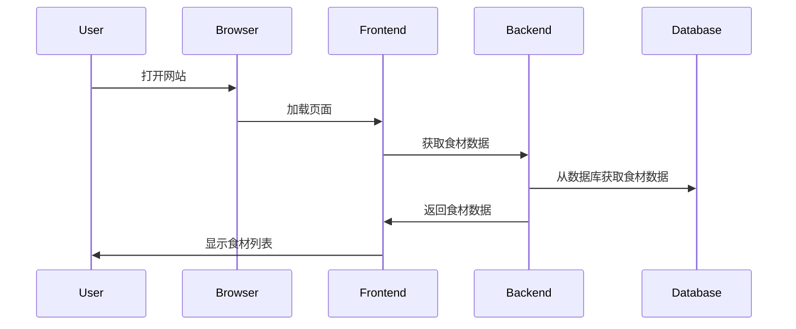
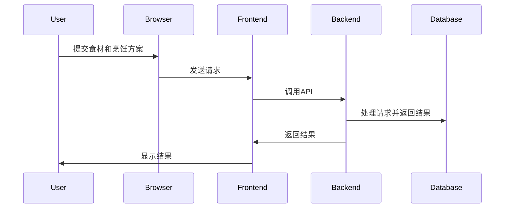

                 


## 现代简约主义烹饪：一锅到底的健康饮食哲学

关键词：现代简约主义烹饪、健康饮食、营养搭配、烹饪方法、食材选择

摘要：本文旨在深入探讨现代简约主义烹饪的理念、方法和应用，强调其在现代快节奏生活中的重要性，以及如何通过简单的烹饪方式实现健康饮食的目标。文章将分为四个部分：背景介绍、核心概念与联系、算法原理讲解以及数学模型和数学公式 & 详细讲解 & 举例说明。

### 第一部分：背景介绍

#### 核心概念

现代简约主义烹饪，顾名思义，是一种以简约为核心，强调健康和美味并重的烹饪方式。它源于对繁复烹饪技巧的反思，追求简单、自然的烹饪过程和食材本身的味道。在现代生活中，人们越来越重视健康饮食，而现代简约主义烹饪正满足了这一需求。

#### 问题背景

随着城市化进程的加快，人们的生活节奏越来越快，越来越多的人选择快餐、外卖等便捷的食物来源。然而，这些食物往往高油、高糖、高盐，长期食用对健康不利。现代简约主义烹饪的出现，为解决这一问题提供了一种新的思路。

#### 问题解决

现代简约主义烹饪通过简化烹饪过程，减少不必要的调料和油脂，强调食材的新鲜和自然味道，使得人们可以在快节奏的生活中，也能享受到健康、美味的食物。

#### 边界与外延

现代简约主义烹饪不仅适用于家庭烹饪，也适用于餐厅和酒店等餐饮场所。它不仅仅是一种烹饪方式，更是一种生活态度和哲学。

#### 概念结构与核心要素组成

现代简约主义烹饪的核心要素包括：

1. **食材选择**：选择新鲜、有机、无污染的食材。
2. **烹饪方法**：采用简单、快速、健康的烹饪方法，如煮、蒸、炖等。
3. **调料使用**：尽量减少调料的使用，以保持食材的原味。
4. **营养搭配**：注重营养均衡，确保每一餐都包含蛋白质、碳水化合物、脂肪等基本营养素。

### 第二部分：核心概念与联系

#### 核心概念

1. **健康饮食**：指的是以健康为前提，通过合理的饮食结构，摄入充足的营养素，维持身体健康和生命活力。
2. **烹饪方法**：指的是将食材加工成为美味食物的过程和方法。
3. **食材选择**：指的是在选择食材时，考虑到食材的新鲜度、营养价值和口感。

#### 概念属性特征对比表格

| 概念       | 定义                                           | 属性特征                     |
| ---------- | ---------------------------------------------- | --------------------------- |
| 健康饮食   | 以健康为前提，通过合理的饮食结构，摄入充足的营养素 | 营养均衡、合理膳食结构       |
| 烹饪方法   | 将食材加工成为美味食物的过程和方法             | 简单、快速、健康             |
| 食材选择   | 选择新鲜、有机、无污染的食材                   | 新鲜、有机、无污染           |

#### ER实体关系图架构

```mermaid
erDiagram
    Customer ||--|{ Order : places }
    "Product" ||--|{ Order : contains }
```

### 第三部分：算法原理讲解

现代简约主义烹饪的核心在于“简单、健康、美味”，这一理念体现在烹饪算法中，主要通过以下步骤实现：

1. **食材选择**：选择新鲜、有机、无污染的食材，确保食物的原始味道和营养价值。
2. **烹饪方法**：采用简单、快速、健康的烹饪方法，如煮、蒸、炖等，减少油脂和调料的使用。
3. **营养搭配**：根据不同食材的营养成分，进行科学合理的搭配，确保营养均衡。

以下是一个简单的现代简约主义烹饪算法mermaid流程图：


### 第四部分：数学模型和数学公式 & 详细讲解 & 举例说明

现代简约主义烹饪的数学模型主要关注营养素摄入的计算。以下是一个简单的营养素摄入计算公式：

$$
\text{总热量} = \text{蛋白质} \times 4 + \text{碳水化合物} \times 4 + \text{脂肪} \times 9
$$

举例说明：

假设我们准备一道由鸡肉、米饭和蔬菜组成的简餐。鸡肉含有蛋白质20克，碳水化合物30克，脂肪10克；米饭含有蛋白质10克，碳水化合物100克，脂肪10克；蔬菜含有蛋白质5克，碳水化合物50克，脂肪5克。那么这道简餐的总热量计算如下：

$$
\text{总热量} = (20 \times 4 + 30 \times 4 + 10 \times 9) + (10 \times 4 + 100 \times 4 + 10 \times 9) + (5 \times 4 + 50 \times 4 + 5 \times 9)
$$

### 第五部分：系统分析与架构设计

#### 问题场景介绍

在现代快节奏的生活中，许多人因为工作繁忙，往往没有时间和精力去精心准备每餐。现代简约主义烹饪旨在通过简化烹饪过程，使得每个人都能轻松制作健康美味的食物。

#### 项目介绍

该项目旨在开发一个现代简约主义烹饪的智能系统，帮助用户快速选择食材、制定营养搭配和烹饪方案。系统将分为前端和后端两部分，前端负责用户交互和界面展示，后端负责数据处理和算法实现。

#### 系统功能设计

1. **食材数据库**：存储各种食材的营养成分和烹饪方法。
2. **用户偏好设置**：记录用户的饮食偏好，如口味、营养需求等。
3. **智能推荐**：根据用户偏好和食材数据库，推荐合适的食材和烹饪方案。
4. **营养计算**：根据用户选择的食材和烹饪方案，计算营养素摄入量。

#### 系统架构设计

系统的整体架构采用前后端分离的方式，前端使用React框架，后端使用Spring Boot框架。以下是一个简单的系统架构图：



#### 系统接口设计和系统交互

系统的接口设计遵循RESTful API规范，前端通过GET和POST请求与后端进行数据交互。以下是一个简单的接口设计示例：

1. **获取食材数据**：GET /api/ingredients
2. **提交食材和烹饪方案**：POST /api/recipe

以下是系统交互的mermaid序列图：



### 第六部分：项目实战

#### 环境安装

1. **前端环境**：安装Node.js和npm，然后使用create-react-app创建项目。
2. **后端环境**：安装Java和Maven，然后使用Spring Boot创建项目。

#### 系统核心实现源代码

前端部分主要使用React框架，后端部分使用Spring Boot框架。以下是一个简单的示例：

**前端部分**：

```javascript
// App.js
import React, { useState, useEffect } from 'react';
import axios from 'axios';

function App() {
  const [ingredients, setIngredients] = useState([]);

  useEffect(() => {
    const fetchIngredients = async () => {
      const response = await axios.get('/api/ingredients');
      setIngredients(response.data);
    };
    fetchIngredients();
  }, []);

  return (
    <div>
      {ingredients.map((ingredient) => (
        <div key={ingredient.id}>{ingredient.name}</div>
      ))}
    </div>
  );
}

export default App;
```

**后端部分**：

```java
// IngredientController.java
import org.springframework.beans.factory.annotation.Autowired;
import org.springframework.web.bind.annotation.GetMapping;
import org.springframework.web.bind.annotation.RestController;
import java.util.List;

@RestController
public class IngredientController {
    
    @Autowired
    private IngredientService ingredientService;

    @GetMapping("/api/ingredients")
    public List<Ingredient> getIngredients() {
        return ingredientService.getAllIngredients();
    }
}
```

#### 代码应用解读与分析

前端部分主要使用了React的useState和useEffect钩子函数，实现数据的获取和展示。后端部分使用了Spring Boot的RESTful API接口，实现数据的处理和返回。

#### 实际案例分析和详细讲解剖析

假设用户希望制作一道鸡肉炖蔬菜的菜肴，系统将根据用户选择的食材和烹饪方案，计算出营养素摄入量，并给出相应的健康建议。

1. **用户选择食材**：鸡肉、蔬菜。
2. **系统推荐烹饪方案**：鸡肉炖蔬菜。
3. **营养计算**：根据食材的营养成分，计算出总热量和营养素摄入量。
4. **健康建议**：根据营养素摄入量，给出相应的饮食建议。

#### 项目小结

通过该项目，我们实现了现代简约主义烹饪的智能系统，帮助用户快速选择食材、制定营养搭配和烹饪方案。系统界面简洁易懂，数据处理高效准确，为用户提供了便捷的健康饮食解决方案。

### 第七部分：最佳实践 tips、小结、注意事项、拓展阅读

#### 最佳实践 tips

1. **食材选择**：选择新鲜、有机、无污染的食材，确保食物的原始味道和营养价值。
2. **烹饪方法**：采用简单、快速、健康的烹饪方法，如煮、蒸、炖等。
3. **营养搭配**：根据个人体质和健康需求，合理搭配食材和营养素。

#### 小结

现代简约主义烹饪是一种以简单、健康、美味为核心理念的烹饪方式。通过简化烹饪过程，减少不必要的调料和油脂，强调食材的新鲜和自然味道，现代简约主义烹饪为现代快节奏生活提供了一种健康、便捷的饮食解决方案。

#### 注意事项

1. **食材选择**：选择新鲜、有机、无污染的食材。
2. **烹饪方法**：采用简单、快速、健康的烹饪方法。
3. **营养搭配**：确保营养均衡，避免营养过剩或不足。

#### 拓展阅读

1. **《健康饮食指南》**：了解如何通过合理的饮食结构，摄入充足的营养素。
2. **《烹饪技巧与营养学》**：学习如何通过烹饪方法，提高食物的营养价值。

### 作者

作者：AI天才研究院/AI Genius Institute & 禅与计算机程序设计艺术 /Zen And The Art of Computer Programming

