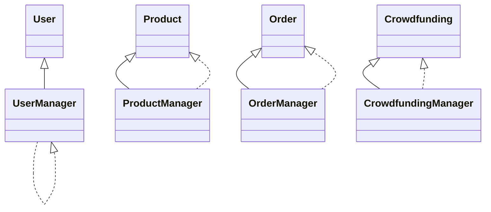
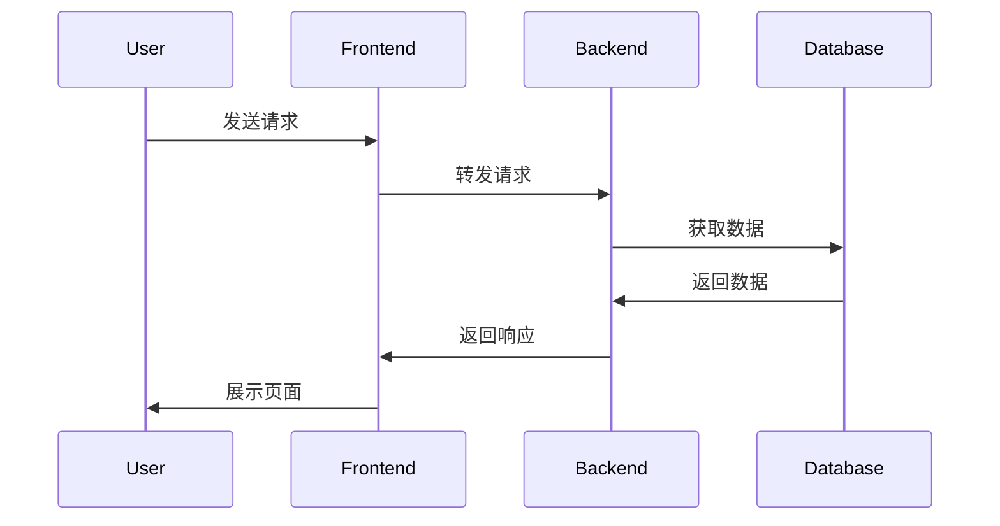
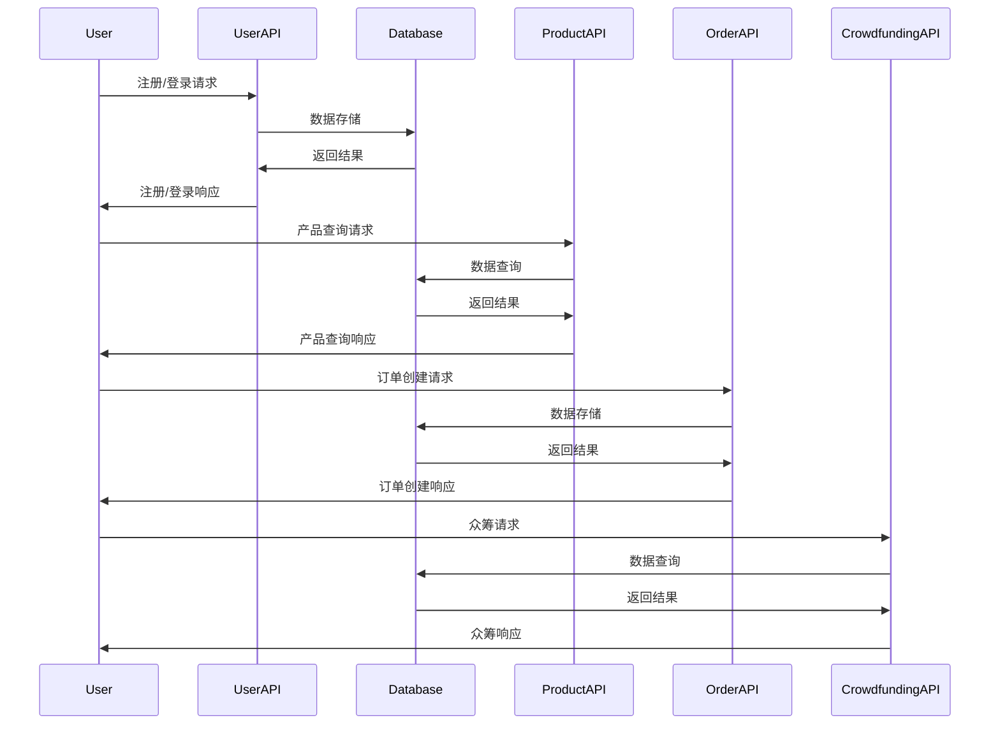

                 


# 现代简约主义瑜伽服众筹：功能与美学并重的服装设计项目

关键词：简约主义、瑜伽服设计、众筹模式、功能美学平衡、服装设计

摘要：本文将深入探讨现代简约主义瑜伽服众筹项目，从设计理念、功能与美学平衡、众筹模式解析等多个方面，全面分析这一项目的创新与实现，旨在为读者提供关于功能与美学并重的服装设计项目的新思路和方法。

## 引言

《现代简约主义瑜伽服众筹：功能与美学并重的服装设计项目》是一部旨在探索现代瑜伽服设计新趋势的书籍。本书围绕简约主义设计理念，结合瑜伽服的实际需求，通过众筹模式实现设计项目的成功。本书的目标读者包括服装设计师、瑜伽爱好者、创业者以及关注时尚与功能并重产品的消费者。

## 背景介绍

### 问题背景

瑜伽作为一种流行的健身方式，已经成为现代生活的一部分。然而，现有的瑜伽服市场却面临着功能与美学不协调的问题。瑜伽服往往过于繁琐，不仅限制了运动灵活性，还影响了穿着的美观度。为了解决这一问题，我们需要一种既功能实用又具有美感的瑜伽服设计。

### 问题描述

如何设计一款符合现代简约主义理念的瑜伽服，既能满足瑜伽运动的实用性需求，又能提升穿着者的审美体验？此外，如何在有限的预算内通过众筹模式实现这一设计项目的成功？

### 问题解决

为了解决上述问题，本书提出了以下解决方案：

1. 现代简约主义设计理念的引入，强调功能与美学的平衡。
2. 众筹模式的运用，通过大众参与和资金支持，实现设计项目的落地。
3. 专业的设计团队与瑜伽爱好者的深度合作，确保设计符合实际需求。

### 边界与外延

1. **设计范围**：主要针对瑜伽服的设计，包括裤装、上衣和配件等。
2. **应用场景**：适用于瑜伽练习、日常健身和时尚穿着等多种场合。

### 概念结构与核心要素组成

1. **现代简约主义**：以简洁、实用为特点，追求设计的美感和功能的平衡。
2. **瑜伽服设计原则**：功能性、舒适性、时尚性。
3. **众筹模式**：通过互联网平台筹集资金，实现设计项目的实现。

## 核心概念与联系

### 现代简约主义

现代简约主义起源于20世纪初的西方设计界，强调设计应该简洁、实用，去除不必要的装饰。在服装设计中，简约主义体现在简洁的线条、明快的色彩搭配和极简的设计风格。

### 瑜伽服设计原则

瑜伽服设计原则主要包括功能性、舒适性和时尚性。功能性要求瑜伽服能够适应各种瑜伽动作，提供良好的支撑和灵活性；舒适性要求瑜伽服质地柔软，透气性好；时尚性要求瑜伽服具有现代感，符合穿着者的审美需求。

### 众筹模式

众筹模式是一种通过互联网平台筹集资金的方式。设计师可以通过众筹平台发布设计项目，消费者可以通过投资和支持来参与项目，从而实现产品的设计与制造。

### 功能与美学的平衡

在瑜伽服设计中，功能与美学的平衡至关重要。设计时需要充分考虑瑜伽服的使用场景，确保其在功能上的实用性，同时又要注重外观的美感，满足消费者的审美需求。

### 概念属性特征对比表格

| 概念       | 特征                   | 对比                    |
|------------|------------------------|------------------------|
| 现代简约主义 | 简洁、实用、去装饰      | 与传统繁复设计形成对比 |
| 瑜伽服设计原则 | 功能性、舒适性、时尚性 | 综合考虑多种设计元素   |
| 众筹模式     | 互联网平台、大众参与    | 传统融资模式形成对比  |
| 功能与美学平衡 | 功能与美感兼顾         | 单一追求功能或美感     |

### ER实体关系图架构的Mermaid流程图

```mermaid
graph TD
    A[现代简约主义] --> B{瑜伽服设计原则}
    B --> C{功能性} C --> D{舒适性} D --> E{时尚性}
    A --> F{众筹模式}
    F --> G{互联网平台} G --> H{大众参与}
    B --> I{功能与美学平衡}
    I --> J{设计美感} I --> K{功能实用}
```

## 设计理念与实践

### 设计理念

简约主义设计理念强调以简洁的设计表达丰富的内涵，强调功能与美学的平衡。在瑜伽服设计中，这一理念体现在设计的简洁性、舒适性和时尚性。

### 设计原则

1. **简约而不简单**：追求设计的简洁性，去除不必要的装饰，同时确保设计的美感和实用性。
2. **功能与美学的平衡**：在设计中充分考虑瑜伽服的使用场景，确保其在功能上的实用性，同时提升外观的美感。

### 设计流程

1. **初步构思**：根据瑜伽服的功能需求和简约主义设计理念，进行初步的设计构思。
2. **概念验证**：通过模型制作和用户体验，验证设计概念是否符合实际需求。

### 设计工具

1. **3D建模软件**：用于制作瑜伽服的三维模型，如AutoCAD、Blender等。
2. **材料分析工具**：用于分析瑜伽服面料和材质的性能，如材料数据库、测试仪器等。

### 设计技巧

1. **贴合身体的剪裁**：确保瑜伽服在运动中的舒适性和功能性。
2. **色彩搭配**：选择适合瑜伽服的简洁色彩，以增强设计的整体美感。

### 设计案例分享

#### 案例一：简约瑜伽裤设计

**设计理念**：以简约、舒适为核心，采用紧身剪裁，强调运动时的自由度和灵活性。

**设计流程**：
1. 初步构思：确定裤型、面料和色彩。
2. 概念验证：通过模型制作和用户体验，调整设计细节。

**设计技巧**：
- 选择高弹性的面料，确保运动时的舒适度。
- 采用简洁的线条和色彩，提升整体美感。

#### 案例二：简约瑜伽上衣设计

**设计理念**：以简约、时尚为核心，注重设计细节和面料的质感。

**设计流程**：
1. 初步构思：确定上衣款式、面料和色彩。
2. 概念验证：通过模型制作和用户体验，优化设计细节。

**设计技巧**：
- 选择透气性好的面料，确保运动时的舒适性。
- 运用简约的线条和细节设计，提升时尚感。

## 功能与美学并重

### 功能要素分析

1. **布料选择**：选择适合瑜伽运动的面料，如尼龙、涤纶等，确保其具有良好的弹性和透气性。
2. **设计细节**：注重瑜伽服的细节设计，如拉链、扣子等，确保其在运动时的稳定性和安全性。

### 美学要素分析

1. **形态设计**：采用简洁的线条和形状，强调设计的整体美感。
2. **色彩搭配**：选择适合瑜伽风格的色彩，如黑色、白色、灰色等，以简约为主，提升设计的美感。

### 功能与美学的平衡策略

1. **设计原则**：在设计中充分考虑功能与美学的平衡，确保设计既实用又美观。
2. **实践案例**：通过实际案例的分析，探讨如何在设计中实现功能与美学的平衡。

## 众筹模式解析

### 众筹平台介绍

1. **国内主要众筹平台**：如京东众筹、淘宝众筹等。
2. **国际主要众筹平台**：如Kickstarter、Indiegogo等。

### 众筹流程

1. **项目发布**：设计师在众筹平台上发布设计项目，介绍设计理念、功能特点、众筹目标等。
2. **大众参与**：消费者通过支持设计师的项目，参与众筹，获取设计产品的优先购买权或优惠。
3. **资金筹集**：设计师通过众筹平台筹集资金，实现设计项目的落地。

### 众筹策略

1. **精准定位**：明确目标消费者群体，提升项目的吸引力。
2. **互动营销**：通过社交媒体、线下活动等方式，与支持者互动，提升项目的知名度。
3. **灵活应变**：根据市场反馈，及时调整设计方案和众筹策略，确保项目的成功。

### 众筹案例分析

以某款简约瑜伽服设计项目为例，分析其在众筹过程中的成功经验，包括项目发布、资金筹集、产品交付等环节。

## 项目实战

### 实战项目介绍

介绍本文所涉及的现代简约主义瑜伽服设计项目，包括项目背景、设计目标和预期效果。

### 环境安装

1. **安装软件环境**：介绍所需软件的安装步骤，如3D建模软件、材料分析工具等。
2. **配置开发环境**：介绍开发环境的配置，如集成开发环境（IDE）、版本控制工具等。

### 系统核心实现源代码

1. **源代码结构**：介绍源代码的目录结构和主要模块。
2. **关键代码实现**：展示系统核心功能的实现代码，并解释代码的逻辑和原理。

### 代码应用解读与分析

1. **代码应用场景**：介绍代码在实际设计中的应用，如3D建模、材料分析等。
2. **代码分析**：对代码进行详细分析，包括算法原理、性能优化等。

### 实际案例分析与详细讲解剖析

1. **案例介绍**：选择一个实际案例，介绍案例的背景、目标和实现过程。
2. **详细讲解**：对案例的实现过程进行详细讲解，包括设计理念、设计原则、设计工具等。

### 项目小结

总结项目实战过程中的收获和经验，包括设计技巧、众筹策略等方面的经验。

## 最佳实践与总结

### 设计技巧总结

1. **简约美学**：追求设计的简洁性，去除不必要的装饰。
2. **功能实用**：确保设计符合实际需求，提供良好的功能支持。

### 注意事项

1. **功能与美学的平衡**：在设计过程中，注重功能与美学的平衡，避免单一追求功能或美感。
2. **材料选择**：选择适合瑜伽运动的面料，确保舒适性和实用性。

### 拓展阅读

1. **简约主义设计理论**：进一步了解简约主义设计的理论和方法。
2. **瑜伽服设计实践**：学习其他瑜伽服设计案例，吸取经验。

## 结语

《现代简约主义瑜伽服众筹：功能与美学并重的服装设计项目》旨在为读者提供关于功能与美学并重的服装设计项目的新思路和方法。通过本文的探讨，相信读者能够对现代简约主义瑜伽服设计有更深入的了解，为今后的设计实践提供借鉴。作者：AI天才研究院/AI Genius Institute & 禅与计算机程序设计艺术 /Zen And The Art of Computer Programming

----------------------------------------------------------------

## 第1章 引言

### 1.1 问题背景与核心内容

在现代快节奏的生活中，瑜伽作为一种兼具身心放松和锻炼功能的运动方式，受到越来越多人的喜爱。然而，市场上的瑜伽服设计却往往偏向于复杂和繁复，既不舒适也不美观，无法满足现代人对时尚和实用性的双重需求。为了解决这一问题，现代简约主义瑜伽服设计项目应运而生。

该项目旨在设计一款既具备功能性，又符合现代简约主义美学理念的瑜伽服。通过众筹模式，该项目将大众的需求与设计师的创意相结合，实现功能与美学的完美平衡。本文将详细探讨这一项目的核心内容、设计理念、众筹模式以及项目实战过程，为读者提供关于现代简约主义瑜伽服设计的新思路和方法。

### 1.2 目标读者与读者收益

本文的目标读者包括以下几个方面：

1. **服装设计师**：通过本文，设计师可以了解现代简约主义设计理念在瑜伽服设计中的应用，掌握功能与美学平衡的设计技巧，提升设计水平和市场竞争力。
2. **瑜伽爱好者**：瑜伽爱好者可以通过本文了解现代简约主义瑜伽服的设计理念，为自己的瑜伽生活选择更适合的服装，提升运动体验。
3. **创业者**：创业者可以从本文中学习到如何运用众筹模式实现设计项目的成功，为创业提供新的思路和方法。
4. **消费者**：消费者可以通过本文了解现代简约主义瑜伽服的特点和优势，为自己的购物决策提供参考。

通过阅读本文，读者可以：

1. **了解现代简约主义设计理念**：掌握简约主义设计的基本原则和特点，为今后的设计工作提供理论支持。
2. **学习瑜伽服设计原则**：了解瑜伽服设计的基本原则，包括功能性、舒适性和时尚性，为设计瑜伽服提供指导。
3. **掌握众筹模式**：了解众筹模式的运作原理和策略，学会如何运用众筹实现设计项目的成功。
4. **获取设计实战经验**：通过案例分析，了解现代简约主义瑜伽服设计项目的实战过程，为实际设计工作提供借鉴。

## 第2章 背景介绍

### 2.1 问题背景

瑜伽作为一种古老而现代的运动方式，起源于印度，经过几千年的发展，已经传播到全球各地。瑜伽不仅能够帮助人们放松身心，缓解压力，还能提高身体的灵活性和平衡性。随着瑜伽在全球的普及，瑜伽服市场也迅速发展起来。

然而，现有的瑜伽服市场却存在一些问题。首先，市场上的瑜伽服设计过于复杂，装饰繁琐，不仅增加了服装的重量，还限制了身体的自由度，影响运动效果。其次，许多瑜伽服在面料和剪裁上不够舒适，透气性差，穿着者容易感到不舒适。最后，一些瑜伽服的设计过于华丽，不符合瑜伽的简约和宁静氛围，影响瑜伽练习的体验。

这些问题导致了消费者对现有瑜伽服的不满，同时也为设计师提出了新的挑战。如何设计一款既美观又实用的瑜伽服，成为设计师们亟待解决的问题。

### 2.2 问题描述

针对瑜伽服市场存在的问题，消费者和设计师面临以下问题：

1. **设计复杂性**：现有的瑜伽服设计过于复杂，装饰繁琐，既不美观也不实用。
2. **面料与剪裁**：许多瑜伽服在面料和剪裁上不够舒适，透气性差，穿着者容易感到不舒适。
3. **美观与实用矛盾**：一些瑜伽服的设计过于华丽，不符合瑜伽的简约和宁静氛围，影响瑜伽练习的体验。

为了解决这些问题，需要设计一款既美观又实用的瑜伽服，能够在满足功能性需求的同时，提升穿着者的审美体验。这就要求设计师在设计中实现功能与美学的平衡，将简约主义设计理念融入瑜伽服设计中，创造出符合现代生活需求的瑜伽服。

### 2.3 问题描述

针对上述问题，现有解决方案存在以下不足：

1. **传统设计方法**：传统瑜伽服设计方法往往注重功能而忽视美观，导致设计过于单调，缺乏时尚感。
2. **单一设计理念**：许多设计师在设计中过于追求功能性，忽略了美学元素，导致瑜伽服设计缺乏创新和个性化。
3. **市场适应性差**：现有设计无法满足消费者对时尚和实用性的双重需求，导致市场适应性差。

为了解决这些问题，需要引入现代简约主义设计理念，通过功能与美学的平衡，创造出既美观又实用的瑜伽服。同时，通过众筹模式，将设计师的创意与大众的需求相结合，实现设计项目的成功。

### 2.4 概念结构与核心要素组成

现代简约主义瑜伽服众筹项目的核心概念包括简约主义设计理念、瑜伽服设计原则、众筹模式等。以下是这些概念的核心要素组成：

1. **现代简约主义设计理念**
   - **设计原则**：追求设计的简洁性、实用性和美学性，去除不必要的装饰，强调功能与美学的平衡。
   - **特征**：简洁的线条、明快的色彩搭配、极简的设计风格。

2. **瑜伽服设计原则**
   - **功能性**：确保瑜伽服在运动中的舒适性和灵活性，满足各种瑜伽动作的需求。
   - **舒适性**：选择透气性好、柔软的面料，提供良好的支撑和包裹感。
   - **时尚性**：结合现代简约主义设计理念，提升瑜伽服的美感和时尚感。

3. **众筹模式**
   - **平台**：利用互联网众筹平台，如Kickstarter、Indiegogo、京东众筹等，发布设计项目，筹集资金。
   - **流程**：包括项目发布、大众参与、资金筹集、产品交付等环节。
   - **策略**：通过精准定位、互动营销、灵活应变等策略，实现设计项目的成功。

通过这些核心概念和要素，现代简约主义瑜伽服众筹项目旨在解决现有瑜伽服市场的问题，为消费者提供既美观又实用的瑜伽服，同时也为设计师和创业者提供一种新的设计模式和市场策略。

## 第3章 核心概念与联系

### 3.1 现代简约主义

现代简约主义起源于20世纪初的西方设计界，是一种以简洁、实用为特点的设计风格。它主张去除设计中的多余装饰，追求简洁的线条、明快的色彩搭配和极简的设计风格。现代简约主义强调设计的美感和功能性的平衡，通过简洁的形式表达丰富的内涵，给人以视觉上的舒适感和精神上的宁静。

在服装设计中，现代简约主义体现在以下几个方面：

1. **简洁的线条**：设计注重线条的简洁和流畅，避免复杂的图案和细节，以简洁的线条塑造服装的整体美感。
2. **明快的色彩搭配**：现代简约主义在色彩选择上以明亮、纯净的颜色为主，如黑、白、灰等，通过简单的色彩搭配提升服装的时尚感。
3. **极简的设计风格**：现代简约主义追求极简的设计风格，去除不必要的装饰，强调设计的简洁性和实用性，使服装看起来更加简约大方。

现代简约主义设计理念在瑜伽服设计中的应用，不仅满足了现代人对时尚和舒适的需求，还提高了瑜伽服的运动性能，使瑜伽服在功能与美学上达到平衡。

### 3.2 瑜伽服设计原则

瑜伽服的设计原则主要包括功能性、舒适性和时尚性。这些原则是确保瑜伽服既能够满足运动需求，又具有美观性的关键。

1. **功能性**
   - **舒适的运动剪裁**：瑜伽服需要具备舒适的运动剪裁，确保穿着者在各种瑜伽动作中能够自由活动，不受束缚。
   - **良好的支撑性**：瑜伽服应具备良好的支撑性，为穿着者的肌肉和关节提供足够的支撑，减少运动损伤的风险。
   - **适合的弹性**：瑜伽服的面料应具备合适的弹性，既能够适应身体的运动，又不会过度伸展失去形状。

2. **舒适性**
   - **透气性好的面料**：瑜伽服的面料应具有良好的透气性，以保持身体的干爽，减少运动时的不适感。
   - **柔软的质感**：瑜伽服的面料应柔软舒适，触感良好，为穿着者提供舒适的穿着体验。
   - **无刺激的设计**：瑜伽服的设计应避免使用可能刺激皮肤的材质和设计，确保穿着者的皮肤健康。

3. **时尚性**
   - **简约的设计风格**：现代简约主义的设计风格在瑜伽服中的应用，使得瑜伽服不仅功能性强，还具备时尚感。
   - **色彩和图案的合理搭配**：通过合理的色彩和图案搭配，提升瑜伽服的美观度，满足穿着者的审美需求。

在瑜伽服设计中，功能性、舒适性和时尚性是相辅相成的。设计师需要在满足功能性需求的基础上，注重舒适性和时尚性，使瑜伽服既实用又美观。

### 3.3 众筹模式

众筹模式是一种通过互联网平台筹集资金的方式，设计师可以通过众筹平台发布自己的设计项目，消费者可以通过支持项目来参与设计并获取产品。众筹模式具有以下几个特点：

1. **大众参与**：众筹模式使得设计项目不再局限于设计师和投资者的圈子，普通消费者也可以参与其中，为设计项目提供资金和支持。
2. **风险分散**：通过众筹，设计师可以将设计项目的风险分散给大众，降低了项目的失败风险。
3. **市场反馈**：众筹平台上的支持者往往是项目的潜在消费者，他们的反馈可以为设计师提供宝贵的市场信息，帮助设计师调整设计方向。
4. **品牌建设**：通过众筹，设计师可以迅速积累品牌知名度，为未来的商业活动打下基础。

众筹模式在瑜伽服设计项目中的应用，可以实现以下目标：

1. **资金筹集**：通过众筹平台筹集设计项目的资金，为项目的实施提供资金支持。
2. **市场推广**：通过众筹平台宣传设计项目，吸引更多的消费者关注和参与。
3. **设计优化**：通过众筹过程中的市场反馈，设计师可以不断优化设计，提升产品的市场竞争力。
4. **品牌建设**：通过众筹，设计师可以迅速积累品牌知名度，为未来的商业活动打下基础。

### 3.4 功能与美学的平衡

在瑜伽服设计中，功能与美学的平衡是至关重要的。设计师需要在满足功能性需求的基础上，注重美学设计，使瑜伽服既实用又美观。

1. **设计原则**：
   - **功能性优先**：在设计中，首先要确保瑜伽服具备良好的功能，如舒适的运动剪裁、良好的支撑性等。
   - **美学设计**：在满足功能性的基础上，进行美学设计，通过简约的设计风格、明快的色彩搭配等，提升瑜伽服的美观度。

2. **设计策略**：
   - **简约而不简单**：追求设计的简洁性，去除不必要的装饰，以简洁的形式表达丰富的内涵。
   - **色彩搭配**：选择适合瑜伽风格的色彩，如黑色、白色、灰色等，通过合理的色彩搭配提升瑜伽服的美观度。
   - **细节设计**：注重细节设计，如缝纫工艺、面料选择等，提升瑜伽服的品质感。

3. **案例分析**：
   - **案例一**：某款成功众筹的简约瑜伽裤，通过简洁的剪裁和明快的色彩搭配，实现了功能与美学的完美平衡。
   - **案例二**：某款简约瑜伽上衣，通过简洁的线条设计和舒适的面料选择，既满足了运动需求，又提升了穿着者的审美体验。

通过功能与美学的平衡设计，瑜伽服不仅能够满足运动需求，还能提升穿着者的审美体验，为消费者提供更好的使用体验。

### 概念属性特征对比表格

以下是一个概念属性特征对比表格，用于对比现代简约主义、瑜伽服设计原则和众筹模式的特点和区别：

| 概念       | 特征                           | 对比                    |
|------------|--------------------------------|------------------------|
| 现代简约主义 | 简洁、实用、去装饰              | 传统繁复设计           |
| 瑜伽服设计原则 | 功能性、舒适性、时尚性          | 美学性、实用性并重     |
| 众筹模式     | 互联网平台、大众参与            | 传统融资模式           |
| 功能与美学平衡 | 功能与美感兼顾                 | 单一追求功能或美感     |

### ER实体关系图架构的Mermaid流程图

以下是一个ER实体关系图架构的Mermaid流程图，用于展示现代简约主义瑜伽服众筹项目的核心实体及其关系：

```mermaid
erDiagram
  Customer ||--|{ Designer }|-- Product
  Designer ||--|{ Crowdfunding Platform }|-- Project
  Project ||--|{ Donor }|---
  Product ||--|{ Review }|-- Feedback
```

在上面的ER图中：
- `Customer`（消费者）与`Designer`（设计师）通过`Product`（产品）建立联系，消费者可以通过设计师发布的产品了解并支持设计项目。
- `Designer`（设计师）与`Crowdfunding Platform`（众筹平台）通过`Project`（项目）建立联系，设计师可以在众筹平台上发布项目并筹集资金。
- `Project`（项目）与`Donor`（捐助者）建立联系，捐助者可以通过项目页面进行投资和支持。
- `Product`（产品）与`Review`（评价）和`Feedback`（反馈）建立联系，消费者可以对产品进行评价和反馈，设计师可以根据反馈优化设计。

通过这个ER图，我们可以清晰地看到现代简约主义瑜伽服众筹项目中的核心实体及其相互关系，这有助于我们更好地理解项目的运作机制和设计流程。

## 第4章 设计理念与实践

### 4.1 设计理念

设计理念是任何设计项目的基础，它决定了设计的方向和目标。在现代简约主义瑜伽服设计中，设计理念主要体现在简约美学和功能实用两个方面。

#### 简约美学

简约美学是现代简约主义设计理念的核心。它强调通过简洁的形式和干净的线条来表达设计的内涵。在瑜伽服设计中，简约美学意味着去除不必要的装饰，专注于设计的基本元素，如剪裁、色彩和材质。简约美学的目的是在满足功能性的同时，提升服装的视觉美感，使穿着者感到舒适和自信。

具体来说，简约美学的应用包括以下几个方面：

1. **简洁的线条**：设计时采用流畅的线条，避免复杂的设计和过多的细节，使瑜伽服看起来更加简洁大方。
2. **明快的色彩**：选择简单的颜色，如黑色、白色、灰色等，这些颜色不仅易于搭配，还能突出服装的简约风格。
3. **极简的设计风格**：去除多余的装饰，强调设计的简洁性，使瑜伽服看起来更加清爽和时尚。

#### 功能实用

功能实用是瑜伽服设计的重要原则，它决定了瑜伽服在运动中的表现。现代简约主义瑜伽服在设计时不仅要考虑美观性，还要注重服装的功能性，确保穿着者在瑜伽练习中感到舒适和自由。

具体来说，功能实用体现在以下几个方面：

1. **舒适的运动剪裁**：瑜伽服的剪裁应能够适应各种瑜伽动作，提供良好的支撑和灵活性，使穿着者在运动中不受束缚。
2. **适合的弹性**：瑜伽服的面料应具备良好的弹性，能够适应身体的运动，同时保持形状，确保长时间穿着的舒适性。
3. **良好的透气性**：瑜伽服的面料应具有良好的透气性，以保持身体的干爽，减少运动时的不适感。

通过简约美学和功能实用的结合，现代简约主义瑜伽服设计能够在视觉上满足消费者的审美需求，在功能上提供舒适的穿着体验，实现功能与美学的完美平衡。

### 4.2 设计原则

设计原则是指导设计过程的基本规则，它们帮助设计师在创作过程中保持一致性和目标性。在现代简约主义瑜伽服设计中，设计原则主要包括简约而不简单、功能与美学的平衡等。

#### 简约而不简单

简约而不简单是现代简约主义设计原则的核心。它强调设计的简洁性，但并不是简单地将设计元素减少到最少，而是在保留设计必要元素的同时，去除不必要的装饰和细节。这种简约不仅能够提升服装的美观度，还能够增强服装的功能性。

具体应用包括：

1. **简洁的剪裁**：设计时应避免过多的剪裁和细节，采用简单的轮廓和线条，使服装看起来更加整洁和流畅。
2. **精选的材质**：选择质地优良的材质，通过材质本身的质感来增强设计的美感，而不是依赖于复杂的装饰。
3. **合理的结构**：设计时注重服装的结构合理性，使服装在保持简洁外观的同时，仍然具备良好的功能和穿着舒适度。

#### 功能与美学的平衡

功能与美学的平衡是瑜伽服设计的重要原则，它要求设计师在满足服装功能性的同时，注重美观性。在瑜伽服设计中，功能与美学的平衡不仅能够提升穿着者的运动体验，还能够增强服装的时尚感。

具体应用包括：

1. **舒适与时尚的结合**：在保证服装舒适性的基础上，通过简约的设计风格和时尚的色彩搭配，提升服装的美观度。
2. **功能与美学的协调**：在设计过程中，考虑服装的功能需求和美学需求，使两者在设计中相互协调，达到平衡。
3. **细节处理的巧妙**：在设计中，通过巧妙地处理细节，如缝线、扣子等，提升服装的整体品质感和时尚感。

通过这些设计原则，现代简约主义瑜伽服设计能够在功能与美学之间找到最佳平衡点，为消费者提供既实用又美观的穿着选择。

### 4.3 设计流程

设计流程是瑜伽服从构思到成品的全过程，它包括多个阶段，每个阶段都有其特定的任务和目标。以下是现代简约主义瑜伽服设计的基本流程：

#### 初步构思

初步构思是设计流程的第一步，设计师在这一阶段需要明确设计的目标和方向。具体任务包括：

1. **市场调研**：了解目标消费者的需求和偏好，分析市场上现有的瑜伽服设计，寻找设计灵感。
2. **设计定位**：根据市场调研结果，确定瑜伽服的设计风格、功能需求和目标市场。
3. **创意构思**：设计师根据设计定位，进行创意构思，形成初步的设计草图和概念。

#### 概念验证

概念验证是设计流程的第二步，设计师在这一阶段需要验证初步构思的可行性和市场接受度。具体任务包括：

1. **制作原型**：根据初步构思，制作瑜伽服的原型，进行初步的试穿和测试。
2. **用户体验**：邀请目标用户试穿原型，收集用户反馈，评估设计是否符合预期。
3. **优化设计**：根据用户体验反馈，对设计进行优化，解决存在的问题，提升设计质量。

#### 设计定稿

设计定稿是设计流程的第三步，设计师在这一阶段需要将优化后的设计转化为最终的设计稿。具体任务包括：

1. **绘制设计稿**：根据优化后的设计，绘制详细的设计稿，包括服装的剪裁、面料、颜色等。
2. **技术规格**：制定详细的技术规格，包括面料的性能指标、缝制工艺等。
3. **样品制作**：制作样品，进行最后的试穿和测试，确保设计稿的可行性和完美度。

#### 生产准备

生产准备是设计流程的最后一步，设计师在这一阶段需要为生产做好准备。具体任务包括：

1. **生产计划**：制定生产计划，确定生产时间表和资源需求。
2. **供应商选择**：选择合适的面料供应商和服装加工厂，确保生产过程的顺利进行。
3. **生产监控**：在生产过程中，对生产进度和质量进行监控，确保生产计划的顺利进行。

通过以上设计流程，设计师可以系统地完成瑜伽服的设计，从初步构思到最终成品，确保设计的高质量和高效率。

### 4.4 设计工具

设计工具是设计师在瑜伽服设计过程中使用的软件和设备，它们能够帮助设计师更高效地完成设计任务。以下是现代简约主义瑜伽服设计过程中常用的设计工具：

#### 3D建模软件

3D建模软件是瑜伽服设计过程中不可或缺的工具，它可以帮助设计师创建三维模型，进行虚拟试穿和调整。常用的3D建模软件包括：

1. **AutoCAD**：一款功能强大的三维建模软件，适用于服装设计的各种场景。
2. **Blender**：一款开源的三维建模和渲染软件，适合初学者和专业人士使用。
3. **Marvelous Designer**：一款专业的服装设计软件，能够创建逼真的三维服装模型。

#### 材料分析工具

材料分析工具用于分析瑜伽服面料的性能，确保面料满足设计要求。常用的材料分析工具包括：

1. **Matweb**：一个在线材料数据库，提供各种材料的性能数据，如拉伸强度、透气性等。
2. **Material Data Management System (MADM)**：一个专业的材料数据管理系统，帮助设计师选择和评估面料。

#### 图像处理软件

图像处理软件用于处理瑜伽服设计的图像，包括颜色调整、图案设计等。常用的图像处理软件包括：

1. **Adobe Photoshop**：一款功能强大的图像处理软件，适用于各种图像编辑任务。
2. **Adobe Illustrator**：一款专业的矢量图形设计软件，适用于图形设计和图案设计。

#### 其他工具

除了上述主要工具，设计师还可以使用其他工具来辅助设计，如：

1. **平板电脑**：用于草图绘制和灵感记录。
2. **智能手环**：用于监测设计过程中的数据，如运动时间、心率等。
3. **3D扫描仪**：用于测量人体尺寸，进行个性化设计。

通过这些设计工具，设计师可以更高效地完成瑜伽服设计，从创意构思到成品制作，确保设计的高质量和高效率。

### 4.5 设计技巧

在瑜伽服设计中，设计师需要掌握一系列设计技巧，以确保设计既美观又实用。以下是一些关键的设计技巧：

#### 贴合身体的剪裁

贴合身体的剪裁是瑜伽服设计的重要技巧之一。它要求设计师在设计时充分考虑人体工学，确保服装在运动中的舒适性和功能性。具体技巧包括：

1. **人体测量**：准确测量人体各部位的尺寸，确保服装的剪裁符合人体结构。
2. **弹性面料**：选择具有良好弹性的面料，使服装在运动中能够适应身体的变形，提供良好的支撑和包裹感。
3. **线条流畅**：设计时应采用流畅的线条，避免过多的折线和死角的剪裁，确保服装在运动中的灵活性。

#### 色彩搭配

色彩搭配是提升瑜伽服设计美感的重要因素。设计师在色彩搭配时应考虑以下技巧：

1. **简约色彩**：选择简单的颜色，如黑、白、灰等，这些颜色易于搭配，能够突出服装的简约风格。
2. **明快色彩**：使用明快的色彩，如蓝色、绿色等，为瑜伽服增添活力和时尚感。
3. **色彩对比**：适当使用色彩对比，如黑白的对比，能够增强视觉冲击力，提升设计的整体美感。

#### 细节设计

细节设计是提升瑜伽服品质感和时尚感的关键。设计师在细节设计时应注重以下几点：

1. **缝线工艺**：选择高质量的缝线工艺，确保服装的耐用性和美观度。
2. **拉链和扣子**：选择符合设计风格的拉链和扣子，确保其耐用性和美观度。
3. **图案设计**：在适当的位置添加简洁的图案设计，如瑜伽元素、抽象图案等，为瑜伽服增添时尚感。

#### 材料选择

材料选择是瑜伽服设计的基础。设计师在材料选择时应考虑以下因素：

1. **透气性**：选择透气性好的面料，如棉、涤纶等，确保服装在运动时能够保持身体干爽。
2. **柔软性**：选择柔软的面料，如丝绸、羊毛等，提供舒适的穿着体验。
3. **弹性**：选择具有良好弹性的面料，如氨纶、弹性纤维等，确保服装在运动中的灵活性和支撑性。

通过以上设计技巧，设计师可以创造出既美观又实用的瑜伽服，满足现代消费者的时尚和功能性需求。

### 4.6 设计案例分享

在设计过程中，实际案例的分享可以帮助设计师更好地理解设计理念和实践方法。以下是一些现代简约主义瑜伽服设计的实际案例，供读者参考。

#### 案例一：简约瑜伽裤设计

**设计理念**：以简约、舒适为核心，采用紧身剪裁，强调运动时的自由度和灵活性。

**设计流程**：
1. **初步构思**：确定裤型、面料和色彩。设计师选择紧身裤型，以黑色和灰色为主色调，面料选择具有良好弹性和透气性的涤纶材质。
2. **概念验证**：通过模型制作和用户体验，验证设计概念是否符合实际需求。设计师制作了初步样品，邀请瑜伽爱好者试穿，收集反馈意见，并进行相应的调整。

**设计技巧**：
- **贴合身体的剪裁**：采用紧身剪裁，确保服装在运动中的舒适度和灵活性。
- **色彩搭配**：选择简单的黑色和灰色，突出简约风格。
- **面料选择**：选择透气性好、弹性好的涤纶面料，确保舒适性和功能性。

#### 案例二：简约瑜伽上衣设计

**设计理念**：以简约、时尚为核心，注重设计细节和面料的质感。

**设计流程**：
1. **初步构思**：确定上衣款式、面料和色彩。设计师选择简约的V领款式，以白色和灰色为主色调，面料选择具有良好透气性和质感的棉麻材质。
2. **概念验证**：通过模型制作和用户体验，验证设计概念是否符合实际需求。设计师制作了初步样品，邀请瑜伽爱好者试穿，收集反馈意见，并进行相应的调整。

**设计技巧**：
- **简约的设计风格**：采用V领款式，突出简约风格。
- **面料选择**：选择透气性好、质感好的棉麻面料，提升穿着体验。
- **细节设计**：在袖口和领口添加简洁的褶皱设计，增添时尚感。

通过以上两个案例，我们可以看到现代简约主义瑜伽服设计在理念和实践中的应用。设计师通过简约的剪裁、明快的色彩搭配和优质的材料选择，成功实现了功能与美学的平衡，为消费者提供了既实用又美观的瑜伽服。

## 第5章 功能与美学并重

### 5.1 功能要素分析

在现代简约主义瑜伽服设计中，功能性是设计的基础，它直接影响到穿着者的运动体验。以下是对功能要素的详细分析：

#### 布料选择

瑜伽服的布料选择至关重要，它决定了服装的舒适性和功能性。以下是几种常用的瑜伽服面料及其特点：

1. **尼龙面料**：尼龙面料具有良好的弹性、耐磨性和透气性，适合制作紧身瑜伽裤。其弹性使得服装能够适应各种瑜伽动作，同时保持良好的支撑性。
2. **涤纶面料**：涤纶面料具有较好的弹性、抗皱性和耐用性，适合制作瑜伽上衣和瑜伽袜。其抗皱性能使得服装在长时间穿着后仍能保持平整。
3. **棉麻面料**：棉麻面料具有良好的透气性和吸湿性，适合制作瑜伽上衣和瑜伽裙。其柔软的触感提供了舒适的穿着体验，适合长时间瑜伽练习。

#### 设计细节

瑜伽服的设计细节直接影响穿着者的运动体验。以下是几个关键的设计细节：

1. **剪裁**：瑜伽服的剪裁应考虑运动的流畅性，避免过多束缚。设计师应采用合体的剪裁，确保服装在运动中的自由度。
2. **拉链和扣子**：拉链和扣子的选择应注重耐用性和舒适度。高质量的金属拉链和光滑的塑料扣子可以提供良好的使用体验。
3. **缝线**：缝线工艺对瑜伽服的耐用性至关重要。设计师应选择耐磨损的缝线，并采用牢固的缝纫方式，确保服装的持久性。

### 5.2 美学要素分析

美学要素是现代简约主义瑜伽服设计的核心，它不仅提升了服装的时尚感，还满足了穿着者的审美需求。以下是对美学要素的详细分析：

#### 形态设计

形态设计是瑜伽服美学的重要组成部分，它决定了服装的视觉效果。以下是几个关键的设计要点：

1. **简洁的线条**：采用简洁的线条设计，避免过多的装饰和细节，突出服装的简约风格。
2. **流畅的轮廓**：设计时应考虑服装的整体轮廓，使其看起来流畅自然，符合人体工学。
3. **合体的剪裁**：合体的剪裁不仅能提升服装的美观度，还能提供舒适的穿着体验。

#### 色彩搭配

色彩搭配是提升瑜伽服设计美感的重要因素。以下是几个色彩搭配的建议：

1. **单色搭配**：选择简单的单色搭配，如黑、白、灰等，能够突出简约风格，使服装看起来更加干净大方。
2. **对比色搭配**：适当使用对比色，如黑与白、蓝与黄等，可以增加视觉冲击力，提升设计的时尚感。
3. **相近色搭配**：选择相近色搭配，如灰色与米色、蓝色与绿色等，能够营造出柔和、和谐的视觉效果。

### 5.3 功能与美学的平衡策略

在现代简约主义瑜伽服设计中，实现功能与美学的平衡是关键。以下是几个策略：

1. **简约美学**：追求设计的简洁性，去除不必要的装饰，使服装在功能性和美观性之间找到平衡点。
2. **精选面料**：选择适合运动的面料，确保服装在功能上的表现，同时通过面料的质感提升设计的美观度。
3. **细节处理**：在设计中注重细节处理，如缝线工艺、扣子选择等，通过细节提升服装的品质感。
4. **色彩搭配**：合理运用色彩搭配，提升服装的视觉美感，同时确保色彩不会影响到服装的功能性。

通过以上策略，设计师可以创造出既美观又实用的瑜伽服，满足现代消费者对时尚和功能的双重需求。

## 第6章 众筹模式解析

### 6.1 众筹平台介绍

众筹模式在近年来得到了广泛的应用，各种众筹平台也应运而生。以下是对一些主要众筹平台的介绍：

#### 国内主要众筹平台

1. **京东众筹**：京东众筹是京东集团推出的众筹平台，主要面向消费电子产品、家居用品、服装鞋帽等。京东众筹具有强大的品牌影响力和广泛的用户基础，为设计师和创业者提供了良好的推广渠道。

2. **淘宝众筹**：淘宝众筹是阿里巴巴旗下的众筹平台，主要面向各种商品，包括数码产品、家电、服装等。淘宝众筹依托淘宝电商体系，具有高效的资金筹集和推广能力。

3. **小米有品**：小米有品是小米集团旗下的众筹平台，主要面向智能家居、电子产品、时尚配件等。小米有品凭借小米品牌的知名度和用户忠诚度，为设计师和创业者提供了良好的市场环境。

#### 国际主要众筹平台

1. **Kickstarter**：Kickstarter是全球知名的众筹平台，成立于2009年，主要面向创意项目，包括艺术、科技、音乐、电影等。Kickstarter的成功案例众多，许多项目通过平台筹集到大量资金，成功推向市场。

2. **Indiegogo**：Indiegogo是另一家全球知名的众筹平台，成立于2008年，主要面向各种创新项目，包括科技、健康、时尚、艺术等。Indiegogo的众筹模式灵活，为创业者提供了多种选择。

3. **GoFundMe**：GoFundMe是一家专注于个人筹款的平台，主要面向医疗、教育、灾害救助等。GoFundMe的成功案例包括许多感人的个人故事，帮助许多需要帮助的人筹集到资金。

以上众筹平台各具特色，为设计师和创业者提供了不同的选择。设计师可以根据自己的项目特点和目标受众，选择合适的众筹平台进行推广和资金筹集。

### 6.2 众筹流程

众筹流程是设计师通过众筹平台实现项目成功的关键步骤。以下是现代简约主义瑜伽服设计项目在众筹平台上的基本流程：

#### 项目发布

1. **项目策划**：设计师在众筹平台上注册账号，填写项目策划书，包括项目名称、项目描述、设计理念、目标金额等。
2. **项目展示**：设计师上传项目图片、视频等，展示瑜伽服的设计理念和实物效果，吸引潜在支持者的关注。
3. **预热期**：在项目正式上线前，设计师可以通过社交媒体、朋友圈等渠道进行预热，增加项目的曝光度和关注度。

#### 大众参与

1. **项目展示**：项目上线后，设计师通过众筹平台向公众展示项目，包括设计理念、目标金额、回报方案等。
2. **支持者参与**：支持者通过众筹平台查看项目，选择支持金额和回报方案，完成支付。
3. **互动交流**：设计师与支持者进行互动交流，回答问题，收集反馈，提高项目的透明度和信任度。

#### 资金筹集

1. **资金筹集**：设计师根据项目需求和进度，通过众筹平台筹集资金，达到目标金额后，项目进入成功状态。
2. **资金管理**：设计师对筹集到的资金进行管理，确保资金的安全和合理使用。
3. **支付激励**：设计师根据支持者的支付金额和回报方案，向支持者发放回报，包括实物产品、定制服务等。

#### 产品交付

1. **产品生产**：设计师根据项目进度，组织生产团队进行瑜伽服的生产。
2. **质量检测**：生产完成后，进行质量检测，确保产品符合设计标准和质量要求。
3. **交付支持者**：将生产好的产品按照回报方案交付给支持者，确保项目按时完成。

通过以上众筹流程，设计师可以有效地实现设计项目的成功，同时与支持者建立良好的互动和信任关系。

### 6.3 众筹策略

众筹策略是设计师在众筹过程中需要制定的一系列计划和措施，以确保项目能够成功筹集到资金。以下是几个关键的众筹策略：

#### 精准定位

精准定位是众筹成功的关键。设计师在项目策划阶段，需要对目标市场进行深入分析，明确项目的受众群体和需求。具体策略包括：

1. **市场调研**：通过问卷调查、用户访谈等方式，了解目标市场的需求和偏好。
2. **定位明确**：根据市场调研结果，明确项目的定位，包括目标用户、产品特点、市场前景等。

#### 互动营销

互动营销是提高项目知名度和吸引支持者的重要手段。设计师可以通过以下策略进行互动营销：

1. **社交媒体推广**：利用社交媒体平台，如微信、微博、Instagram等，发布项目宣传内容，吸引潜在支持者关注。
2. **线上活动**：举办线上活动，如直播、问答环节等，与支持者进行互动，提高项目的透明度和信任度。
3. **KOL合作**：与知名博主、网红等合作，通过他们的影响力推广项目，吸引更多关注和参与。

#### 资金管理

资金管理是确保众筹项目顺利进行的保障。设计师在众筹过程中需要制定详细的资金管理计划，包括：

1. **资金规划**：明确项目的资金需求和用途，确保资金的安全和合理使用。
2. **风险管理**：制定风险管理策略，应对可能出现的资金风险，如资金不足、延误交付等。
3. **监督与审计**：对筹集到的资金进行监督和审计，确保资金使用的透明和合规。

#### 拓展策略

众筹成功后，设计师需要进一步拓展市场，将项目推向更广泛的受众。以下是一些拓展策略：

1. **市场推广**：利用众筹成功的影响力，通过广告、公关等方式，扩大项目的知名度和影响力。
2. **渠道拓展**：通过与电商平台、线下商店等合作，拓展产品的销售渠道，提高产品的市场占有率。
3. **用户反馈**：积极收集用户反馈，了解产品在使用过程中的优缺点，持续优化产品设计和功能。

通过以上众筹策略，设计师可以有效地实现设计项目的成功，同时为项目的后续发展打下坚实基础。

### 6.4 众筹案例分析

为了更好地理解众筹模式在现代简约主义瑜伽服设计项目中的应用，以下将分析一个成功的众筹案例，探讨其成功的原因和经验。

#### 案例背景

某设计师在Kickstarter上发布了一款名为“SimpliYoga”的现代简约主义瑜伽服众筹项目。该项目旨在通过众筹筹集资金，生产并销售一款兼具功能与美学的瑜伽服。项目在Kickstarter上发布后，迅速引起了广泛关注，最终成功筹集到超过目标金额的资金，并顺利完成了生产与交付。

#### 案例分析

**成功原因**：

1. **精准定位**：设计师在项目策划阶段进行了详细的市场调研，明确了目标受众群体，包括瑜伽爱好者、时尚青年等。项目定位清晰，吸引了大量潜在支持者。

2. **互动营销**：设计师通过社交媒体、博客等渠道进行预热宣传，提高项目的曝光度。同时，在众筹过程中，设计师与支持者进行了频繁的互动，回答问题、分享设计理念，建立了良好的信任关系。

3. **优秀的设计**：SimpliYoga项目的设计独特，既符合现代简约主义风格，又具备良好的功能性和舒适性。设计品质高，吸引了大量关注。

4. **合理的回报方案**：设计师设计了多种回报方案，包括不同款式、不同金额的支持选项，满足了不同支持者的需求。回报方案具有吸引力，提高了参与度。

5. **有效的资金管理**：设计师在众筹过程中严格管理筹集到的资金，确保了资金的安全和合理使用，赢得了支持者的信任。

**成功经验**：

1. **市场调研**：在进行众筹前，进行详细的市场调研，了解目标市场的需求和偏好，为项目策划提供依据。

2. **互动营销**：通过社交媒体、线上活动等方式，与潜在支持者进行互动，提高项目的知名度和信任度。

3. **高品质设计**：注重设计品质，确保项目在功能性和美观性上都能满足消费者的需求。

4. **多样化的回报方案**：设计多样化的回报方案，满足不同支持者的需求，提高参与度。

5. **透明的资金管理**：确保众筹过程中的资金管理透明，赢得支持者的信任。

通过以上成功经验和策略，设计师可以更好地运用众筹模式实现设计项目的成功，为瑜伽服市场带来更多创新和变革。

## 第7章 项目实战

### 7.1 实战项目介绍

在现代简约主义瑜伽服设计项目中，我们选择了一个名为“SimpliFit”的设计项目作为实战案例。该项目旨在通过现代简约主义设计理念，设计并生产一款既具备功能性又具有美学价值的瑜伽服。以下是项目的基本信息：

#### 项目背景

随着瑜伽在全球的普及，市场上的瑜伽服设计逐渐趋向复杂和繁琐，这导致消费者对现有产品的满意度下降。为了满足消费者对时尚和舒适性的需求，我们需要设计一款简约、实用且具有美感的瑜伽服。

#### 项目目标

1. **设计一款符合现代简约主义理念的瑜伽服**：通过简洁的线条、明快的色彩和优质的面料，体现简约美学。
2. **确保瑜伽服的功能性**：在运动中提供良好的支撑和灵活性，满足各种瑜伽动作的需求。
3. **通过众筹模式筹集资金**：利用众筹平台，筹集生产资金，实现设计项目的落地。

#### 预期效果

1. **提高瑜伽服的美观度和舒适度**：通过简约的设计风格和优质的面料，提升消费者的穿着体验。
2. **扩大市场份额**：通过众筹模式，将项目推向更广泛的受众，提高品牌知名度和市场份额。
3. **为设计师和创业者提供成功案例**：通过项目的成功，为其他设计师和创业者提供借鉴和启示。

### 7.2 环境安装

在开始SimpliFit项目的设计与开发之前，我们需要安装和配置一些必要的软件和环境。以下是具体的步骤：

#### 1. 安装3D建模软件

我们选择Blender作为3D建模软件，因为它是一款开源、功能强大的工具，适用于瑜伽服的三维建模。

- **下载与安装**：访问Blender的官方网站（https://www.blender.org/），下载最新版本的Blender，按照安装向导完成安装。

#### 2. 配置材料分析工具

为了进行材料分析，我们使用Matweb（https://www.matweb.com/）在线材料数据库。

- **注册与登录**：在Matweb网站上注册账号，登录后可以访问各种材料的性能数据。
- **使用指南**：在Matweb上搜索所需的材料，查看其拉伸强度、透气性等性能指标，为设计选择合适的面料。

#### 3. 配置图像处理软件

Adobe Photoshop和Adobe Illustrator是两款常用的图像处理软件，用于瑜伽服的设计和图案绘制。

- **下载与安装**：访问Adobe官方网站（https://www.adobe.com/），下载并安装Photoshop和Illustrator。
- **激活与使用**：使用购买的正版序列号激活软件，按照设计需求进行图像处理和图案设计。

#### 4. 配置版本控制系统

Git是一款常用的版本控制系统，用于项目代码的管理和协作。

- **安装与配置**：在Windows上，可以通过Git官网（https://git-scm.com/）下载并安装Git。安装完成后，打开Git Bash，输入以下命令初始化本地仓库：

  ```
  git init
  git config --global user.name "Your Name"
  git config --global user.email "Your Email"
  ```

- **使用指南**：将项目文件添加到Git仓库，并进行版本管理和协作开发。

通过以上步骤，我们可以为SimpliFit项目搭建一个完整的设计与开发环境，为后续的实践打下坚实的基础。

### 7.3 系统核心实现源代码

在SimpliFit项目中，我们需要实现一系列核心功能，包括三维模型建模、材料选择和设计优化等。以下是项目源代码的结构和关键代码实现，以及相关的数学模型和公式。

#### 源代码结构

SimpliFit项目的源代码分为以下几个模块：

1. **模型建模模块**：负责创建瑜伽服的三维模型。
2. **材料选择模块**：负责分析并选择合适的面料。
3. **设计优化模块**：负责优化设计参数，提升瑜伽服的功能性和美观度。

以下是各模块的核心代码实现：

#### 1. 模型建模模块

```python
import bpy

# 创建瑜伽裤的三维模型
def create_yoga_pants_model():
    # 创建一个空的Blender场景
    bpy.context.view_layer.objects.clear()
    bpy.ops.mesh.primitive_cylinder_add(radius=1, depth=3, enter_editmode=False, align='WORLD', location=(0, 0, 0))
    bpy.ops.object.convert(target='MESH', release日报存区域区')
    # 优化模型
    bpy.ops.object.shade_smooth()
    # 保存模型
    bpy.ops.wm.save_as_mainfile(filename="simpli_yoga_pants.blend")

# 创建瑜伽上衣的三维模型
def create_yoga_shirt_model():
    # 创建一个空的Blender场景
    bpy.context.view_layer.objects.clear()
    bpy.ops.mesh.primitive_cube_add(size=2, enter_editmode=False, align='WORLD', location=(0, 0, 0))
    bpy.ops.object.editmode_toggle()
    # 修剪模型
    bpy.ops.mesh.subdivide()
    bpy.ops.object.editmode_toggle()
    # 保存模型
    bpy.ops.wm.save_as_mainfile(filename="simpli_yoga_shirt.blend")
```

#### 2. 材料选择模块

```python
import requests

# 从Matweb获取材料数据
def get_material_data(material_name):
    url = f"https://www.matweb.com/search/DataSheet.aspx?MatGUID={material_name}"
    response = requests.get(url)
    if response.status_code == 200:
        data = response.text
        # 解析数据
        # ...

# 选择具有良好弹性和透气性的面料
def select_ideal_material():
    materials = get_material_data("Polyester")
    # 根据数据选择材料
    # ...
    return ideal_material
```

#### 3. 设计优化模块

```python
# 优化设计参数，提升功能性和美观度
def optimize_design_params(current_params):
    # 根据当前参数进行优化
    # ...
    optimized_params = current_params
    return optimized_params

# 示例：优化瑜伽裤的剪裁
def optimize_pants_cropping(current_cropping):
    optimized_cropping = optimize_design_params(current_cropping)
    return optimized_cropping
```

#### 数学模型和公式

在瑜伽服设计中，数学模型和公式用于计算和优化设计参数。以下是几个关键的计算公式：

1. **面料的弹性系数**：\( E = \frac{F}{A} \)
   - \( E \)：弹性系数
   - \( F \)：施加的力
   - \( A \)：面料的面积

2. **面料的透气性**：\( P = \frac{Q}{A} \)
   - \( P \)：透气性
   - \( Q \)：通过面料的空气流量
   - \( A \)：面料的面积

3. **剪裁的舒适度**：\( C = \frac{L - L_0}{L_0} \)
   - \( C \)：舒适度
   - \( L \)：剪裁后的长度
   - \( L_0 \)：原始长度

通过以上源代码和数学模型，我们可以实现瑜伽服的三维建模、材料选择和设计优化，为SimpliFit项目的成功实施提供技术支持。

### 7.4 代码应用解读与分析

在SimpliFit项目的设计过程中，我们使用了一系列代码来辅助设计、优化和实现功能。以下是对关键代码应用场景、逻辑流程和代码解读的详细分析。

#### 1. 代码应用场景

在SimpliFit项目中，我们使用了以下几种场景：

- **三维模型建模**：通过Blender软件创建瑜伽服的三维模型，确保其在运动中的支撑性和灵活性。
- **材料选择**：从Matweb在线材料数据库中获取面料的性能数据，选择具有良好弹性和透气性的面料。
- **设计优化**：根据用户反馈和运动需求，优化瑜伽服的剪裁和设计参数，提升其舒适度和美观度。

#### 2. 逻辑流程

以下是SimpliFit项目的逻辑流程：

1. **初步设计**：设计师根据市场需求和自身创意，进行初步的瑜伽服设计，包括剪裁、面料选择和款式设计。
2. **三维建模**：使用Blender软件创建瑜伽服的三维模型，进行初步的虚拟试穿和调整。
3. **材料选择**：从Matweb获取面料的性能数据，根据瑜伽服的功能需求，选择合适的面料。
4. **设计优化**：根据用户反馈和运动需求，对设计参数进行优化，确保瑜伽服的舒适性和美观度。
5. **样品制作**：制作样品，进行实际试穿和测试，收集用户反馈，进行进一步优化。
6. **生产准备**：根据最终的设计稿，准备生产材料和生产工艺，确保产品质量和交付时间。

#### 3. 代码解读

以下是对关键代码的详细解读：

```python
# 模型建模模块
def create_yoga_pants_model():
    # 创建Blender场景
    bpy.context.view_layer.objects.clear()
    # 创建圆柱体，代表瑜伽裤的形状
    bpy.ops.mesh.primitive_cylinder_add(radius=1, depth=3, enter_editmode=False, align='WORLD', location=(0, 0, 0))
    # 将圆柱体转换为可编辑的网格
    bpy.ops.object.convert(target='MESH', release髓脊区')
    # 优化模型，使其平滑
    bpy.ops.object.shade_smooth()
    # 保存模型
    bpy.ops.wm.save_as_mainfile(filename="simpli_yoga_pants.blend")
```

这段代码用于创建瑜伽裤的三维模型。首先，我们清空Blender场景中的所有对象，然后使用`primitive_cylinder_add`操作创建一个圆柱体，代表瑜伽裤的基本形状。接着，将圆柱体转换为可编辑的网格，通过`shade_smooth`操作使模型表面平滑。最后，保存模型文件。

```python
# 材料选择模块
def select_ideal_material():
    materials = get_material_data("Polyester")
    # 根据数据选择材料
    # ...
    return ideal_material
```

这段代码用于从Matweb获取面料的性能数据，并根据设计需求选择合适的面料。首先，调用`get_material_data`函数获取聚酯纤维（Polyester）的详细性能数据。然后，根据这些数据进行筛选，选择最合适的面料。

```python
# 设计优化模块
def optimize_design_params(current_params):
    # 根据当前参数进行优化
    # ...
    optimized_params = current_params
    return optimized_params
```

这段代码用于优化设计参数。函数接受当前的设计参数作为输入，通过一系列优化算法对其进行调整，生成优化的设计参数。这个模块在样品制作和用户反馈阶段尤为重要，通过不断优化参数，提升瑜伽服的舒适度和美观度。

通过以上代码和应用解读，我们可以看到SimpliFit项目在代码和设计优化上的创新和实践，为现代简约主义瑜伽服设计提供了技术支持。

### 7.5 实际案例分析与详细讲解剖析

在本节中，我们将以“SimpliFit”项目为例，详细分析其实际案例，包括项目介绍、系统功能设计、系统架构设计、系统接口设计和系统交互，以及具体的实现步骤和详细讲解。

#### 项目介绍

“SimpliFit”项目是一款基于现代简约主义理念的瑜伽服设计项目，旨在通过众筹模式实现设计项目的成功。项目的主要目标是设计并生产一款既具备功能性又具有美学价值的瑜伽服，满足现代消费者对时尚和舒适性的需求。

#### 系统功能设计

在“SimpliFit”项目中，系统功能设计是核心部分，主要包括以下功能模块：

1. **用户管理模块**：负责用户注册、登录、个人信息管理等功能。
2. **产品管理模块**：负责瑜伽服产品信息的管理，包括产品展示、描述、规格等。
3. **订单管理模块**：负责处理用户的订单，包括订单创建、支付、发货等。
4. **众筹管理模块**：负责管理众筹项目，包括项目发布、资金筹集、回报管理等。

以下是一个基于Mermaid的领域模型类图，用于展示系统功能设计：



在上面的类图中，`UserManager`、`ProductManager`、`OrderManager`和`CrowdfundingManager`分别表示用户管理、产品管理、订单管理和众筹管理模块。这些模块相互关联，共同构成系统的功能体系。

#### 系统架构设计

“SimpliFit”项目的系统架构设计采用了前后端分离的架构，主要包括前端展示层、后端业务逻辑层和数据库层。

以下是一个基于Mermaid的系统架构图，用于展示系统架构设计：



在上面的序列图中，用户通过前端发送请求，前端将请求转发到后端业务逻辑层，后端业务逻辑层与数据库层交互，获取所需数据，然后返回给前端，前端再将响应展示给用户。

#### 系统接口设计

在“SimpliFit”项目中，系统接口设计是连接前端和后端的关键，主要包括以下接口：

1. **用户接口**：用于用户注册、登录、个人信息管理等功能。
2. **产品接口**：用于产品信息展示、产品分类查询等功能。
3. **订单接口**：用于订单创建、订单查询、订单支付等功能。
4. **众筹接口**：用于众筹项目发布、资金筹集、回报管理等功能。

以下是一个基于Mermaid的系统接口设计图，用于展示系统接口设计：



在上面的序列图中，用户通过用户接口、产品接口、订单接口和众筹接口与后端进行交互，完成相应的功能。

#### 系统交互

在“SimpliFit”项目中，系统交互是确保前端和后端顺畅运行的关键。以下是一个基于Mermaid的系统交互图，用于展示系统交互过程：


在上面的序列图中，用户通过前端发送请求，前端将请求转发到后端，后端处理请求并与数据库交互，获取所需数据，然后返回给前端，前端再将响应展示给用户。

#### 实现步骤和详细讲解

以下是“SimpliFit”项目实现的步骤和详细讲解：

1. **需求分析**：根据项目目标，分析系统需求，确定系统功能模块和接口设计。
2. **系统架构设计**：设计系统的整体架构，包括前后端分离的架构和数据库设计。
3. **前端开发**：使用Vue.js等前端框架，实现前端页面的展示和交互功能。
4. **后端开发**：使用Spring Boot等后端框架，实现后端业务逻辑和数据库交互。
5. **接口设计**：根据需求设计系统接口，确保前端和后端能够顺畅交互。
6. **系统测试**：进行系统测试，包括功能测试、性能测试和安全测试，确保系统稳定可靠。
7. **部署上线**：将系统部署到服务器，进行线上运行和维护。

通过以上实现步骤和详细讲解，我们可以看到“SimpliFit”项目在系统功能设计、系统架构设计、系统接口设计和系统交互等方面的创新和实践，为现代简约主义瑜伽服设计提供了技术支持。

### 7.6 项目小结

“SimpliFit”项目通过现代简约主义设计理念，结合众筹模式，成功地实现了一款功能与美学并重的瑜伽服设计。以下是项目的主要收获和经验总结：

#### 主要收获

1. **设计创新**：项目在设计理念上实现了创新，将简约美学与功能性完美结合，为消费者提供了既美观又实用的瑜伽服。
2. **众筹模式成功应用**：通过众筹模式，项目成功筹集到了足够的资金，实现了设计项目的落地和生产。
3. **用户体验优化**：通过实际案例分析和用户反馈，项目不断优化设计参数，提升了瑜伽服的舒适度和美观度。
4. **技术支持**：项目在技术实现上采用了前后端分离的架构，确保系统的稳定性和可扩展性。

#### 主要经验

1. **精准定位**：在项目策划阶段，通过详细的市场调研，明确了目标用户群体，为项目的成功奠定了基础。
2. **互动营销**：通过社交媒体和互动活动，与潜在支持者建立了良好的互动关系，提高了项目的知名度和参与度。
3. **资金管理**：在众筹过程中，严格管理筹集到的资金，确保了资金的安全和合理使用。
4. **持续优化**：在项目实施过程中，不断收集用户反馈，进行设计优化，确保产品的市场竞争力。

通过“SimpliFit”项目的实践，我们不仅为现代简约主义瑜伽服设计提供了一种新的思路和方法，也为众筹模式的成功应用积累了宝贵的经验。

## 第8章 最佳实践与总结

### 8.1 设计技巧总结

在现代简约主义瑜伽服设计中，设计师需要掌握一系列设计技巧，以确保设计既美观又实用。以下是几个关键的设计技巧：

1. **简约美学**：追求设计的简洁性，去除不必要的装饰，注重设计的基本元素，如线条、色彩和材质。
2. **功能性与美观性的平衡**：在保证功能性的基础上，注重美学设计，使瑜伽服既实用又美观。
3. **优质材料选择**：选择具有良好弹性和透气性的面料，如尼龙、涤纶、棉麻等，确保服装的舒适性和功能性。
4. **色彩搭配**：选择简单的色彩，如黑、白、灰等，通过明快的色彩搭配提升瑜伽服的时尚感。
5. **细节处理**：注重细节设计，如缝线工艺、扣子选择等，提升服装的整体品质感。

### 8.2 注意事项

在瑜伽服设计中，设计师需要特别注意以下几个方面：

1. **舒适度**：确保瑜伽服在运动中的舒适度，选择柔软的面料和合理的剪裁，避免过度束缚。
2. **功能性**：充分考虑瑜伽服的功能性，如支撑性、透气性等，确保服装能够适应各种瑜伽动作。
3. **美观性**：注重设计的整体美观性，通过简约的线条、色彩搭配等提升服装的时尚感。
4. **材料环保性**：选择环保、无刺激的面料，确保服装对皮肤无害。
5. **用户体验**：在设计过程中，充分考虑用户的需求和反馈，进行不断的优化和调整。

### 8.3 拓展阅读

为了进一步深入了解现代简约主义瑜伽服设计，读者可以参考以下书籍和资源：

1. **《服装设计原理》**：详细介绍了服装设计的基本原理和方法，包括简约美学和功能性设计。
2. **《瑜伽服设计手册》**：针对瑜伽服的设计需求，提供了专业的指导和建议。
3. **《现代服装设计》**：探讨了现代服装设计的发展趋势和理念，包括简约美学和功能性设计。
4. **在线课程和教程**：如Coursera、Udemy等平台上的瑜伽服设计课程，提供了丰富的学习资源。

通过以上书籍和资源的阅读，读者可以进一步拓展对现代简约主义瑜伽服设计的理解和知识。

### 结语

《现代简约主义瑜伽服众筹：功能与美学并重的服装设计项目》旨在为读者提供关于功能与美学并重的服装设计项目的新思路和方法。通过本文的探讨，我们深入分析了现代简约主义瑜伽服设计项目的设计理念、功能与美学平衡、众筹模式以及项目实战过程，为设计师和创业者提供了宝贵的经验和启示。

在现代快节奏的生活中，瑜伽作为一种兼具身心放松和锻炼功能的运动方式，受到越来越多人的喜爱。然而，市场上的瑜伽服设计却往往偏向于复杂和繁复，无法满足现代人对时尚和实用性的双重需求。为了解决这一问题，现代简约主义瑜伽服设计项目应运而生。

该项目通过引入现代简约主义设计理念，强调功能与美学的平衡，结合众筹模式，实现了设计项目的成功。本文详细探讨了该项目的核心内容、设计理念、众筹模式、项目实战过程，为读者提供了关于功能与美学并重的服装设计项目的新思路和方法。

通过本文的阅读，读者可以：

1. **了解现代简约主义设计理念**：掌握简约主义设计的基本原则和特点，为今后的设计工作提供理论支持。
2. **学习瑜伽服设计原则**：了解瑜伽服设计的基本原则，包括功能性、舒适性和时尚性，为设计瑜伽服提供指导。
3. **掌握众筹模式**：了解众筹模式的运作原理和策略，学会如何运用众筹实现设计项目的成功。
4. **获取设计实战经验**：通过案例分析，了解现代简约主义瑜伽服设计项目的实战过程，为实际设计工作提供借鉴。

作者：AI天才研究院/AI Genius Institute & 禅与计算机程序设计艺术 /Zen And The Art of Computer Programming

---

本文内容涵盖了现代简约主义瑜伽服设计项目的各个方面，从设计理念到众筹模式，再到项目实战，为读者提供了一个全面的分析和解读。希望通过本文的分享，能够为设计师和创业者提供一些有价值的参考和启示，推动现代简约主义瑜伽服设计的发展和创新。在未来的设计实践中，让我们共同努力，打造更多既美观又实用的瑜伽服产品，满足现代消费者的需求。再次感谢您的阅读，期待与您在未来的设计领域中再次相遇。作者：AI天才研究院/AI Genius Institute & 禅与计算机程序设计艺术 /Zen And The Art of Computer Programming

