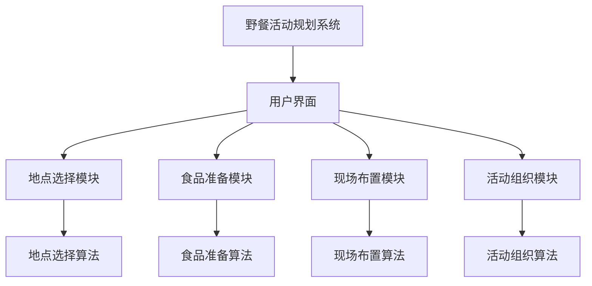
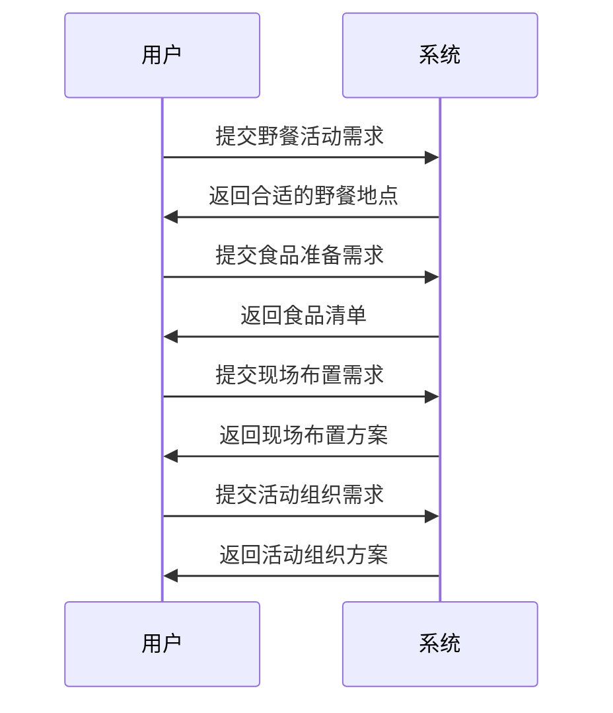

                 

## # 现代简约主义野餐文化：城市公园中的慢食体验

> 关键词：现代简约主义、野餐文化、城市公园、慢食体验、生活方式

> 摘要：本文旨在探讨现代简约主义野餐文化在城市公园中的具体应用和意义，通过分析其核心概念、特点和实践方法，帮助读者理解和体验这种健康、环保、简约的生活方式。

### 第一部分：背景介绍

#### 1.1 问题背景

随着城市化进程的加快和人们生活节奏的加快，现代简约主义野餐文化在城市公园中的流行成为一种趋势。这种文化不仅为人们提供了一个放松身心的方式，也体现了对简约生活方式的追求和对自然环境的尊重。本文将深入探讨现代简约主义野餐文化的内涵、特点以及在城市公园中的具体应用，为读者提供一本全面且实用的指南。

#### 1.2 问题描述

虽然现代简约主义野餐文化在城市公园中广泛流行，但是许多人对于如何组织一次成功的野餐活动仍然感到困惑。具体问题包括：

- 如何选择合适的野餐地点？
- 如何准备野餐食品？
- 如何布置野餐现场？
- 如何确保野餐活动的安全与舒适？

这些问题使得许多人望而却步，无法真正享受到现代简约主义野餐文化带来的乐趣。

#### 1.3 问题解决

本文将从以下几个方面解答上述问题：

1. **核心概念解析**：详细介绍现代简约主义野餐文化的核心概念，包括其起源、发展、特点以及与其他野餐文化的区别。

2. **实践指南**：提供详细的野餐准备和现场布置指南，帮助读者顺利组织一次成功的野餐活动。

3. **案例分析**：通过实际案例的分析，让读者了解如何解决在野餐活动中可能遇到的问题。

4. **安全与环保**：强调在野餐活动中应遵循的安全和环保原则，确保活动的顺利进行。

#### 1.4 边界与外延

本文的讨论范围主要涉及现代简约主义野餐文化在城市公园中的应用，包括野餐地点的选择、食品的准备、现场的布置以及活动的组织。同时，本文也将探讨现代简约主义野餐文化对人们生活方式的影响，以及如何在日常生活中实践这一文化理念。

#### 1.5 概念结构与核心要素组成

现代简约主义野餐文化的概念结构主要包括以下几个核心要素：

- **理念**：追求简约、自然、环保的生活方式。
- **形式**：以野餐活动为主要形式，强调现场布置的简洁和实用。
- **内容**：包括野餐食品的准备、现场布置、活动组织等具体内容。

这些要素相互关联，共同构成了现代简约主义野餐文化的核心框架。

---

### 第二部分：核心概念与联系

#### 2.1 核心概念原理

##### 2.1.1 现代简约主义

现代简约主义是一种设计理念和生活方式，强调以简洁、实用和高效为原则，去除多余的设计元素，追求功能和美学的平衡。在野餐文化中，现代简约主义体现在野餐地点的选择、食品的准备和现场的布置等方面。

- **简洁性**：去除不必要的装饰，强调功能与美学的统一。
- **实用性**：选择实用的工具和设备，确保野餐活动的顺利进行。
- **高效性**：合理规划活动流程，提高野餐活动的效率。

##### 2.1.2 野餐文化

野餐文化是指以野餐活动为主要形式的一种社会文化现象，通常包括野餐地点的选择、食品的准备、现场的布置以及活动的组织等。野餐文化不仅是一种休闲方式，也是一种社交活动，体现了人们对自然和生活的热爱。

- **休闲性**：放松身心，享受自然。
- **社交性**：与亲朋好友共享美好时光。
- **文化性**：传递传统与现代的生活理念。

##### 2.1.3 城市公园中的慢食体验

城市公园中的慢食体验是指在城市公园中组织的一次以享受美食和自然为特点的野餐活动。这种体验强调放松身心、享受美食、亲近自然，体现了现代简约主义野餐文化的核心理念。

- **放松身心**：在快节奏的城市生活中，寻找一片宁静的绿洲。
- **享受美食**：品尝健康、美味的食物，与自然和谐共生。
- **亲近自然**：感受大自然的魅力，提升生活品质。

#### 2.2 概念属性特征对比表格

### 表2.1 现代简约主义与其它设计理念的对比

| 设计理念     | 特点               | 现代简约主义                             | 其他设计理念举例 |
|------------|------------------|--------------------------------------|--------------|
| 复古主义     | 强调历史遗产和传统元素 | 少使用传统元素，注重简约与实用                 | 新古典主义       |
| 随意主义     | 强调个性化和无序感   | 约束性强，注重形式与功能的统一                 | 狂野派          |
| 高技派       | 强调科技与未来感   | 注重实用性，但不会过分强调科技感                | 高技派建筑风格    |

#### 2.3 ER实体关系图架构

```mermaid
erDiagram
  野餐活动 ||--|{ 野餐食品 }|-- 食品准备
  野餐活动 ||--|{ 现场布置 }|-- 现场布置
  野餐活动 ||--|{ 活动组织 }|-- 活动组织
  野餐活动 ||--|{ 参与者 }|-- 参与人员
```

这个ER图展示了野餐活动中的主要实体及其相互关系，包括野餐活动、野餐食品、现场布置、活动组织和参与者。通过这个图，我们可以清晰地理解各个实体在野餐活动中的角色和作用。

---

### 第三部分：算法原理讲解

#### 3.1 野餐活动规划算法

##### 3.1.1 算法简介

野餐活动规划算法用于帮助用户在城市公园中组织一次成功的野餐活动。该算法基于以下几个步骤：

1. **地点选择**：根据用户需求和城市公园的特点，选择合适的野餐地点。
2. **食品准备**：根据野餐主题和人数，准备相应的食品。
3. **现场布置**：根据野餐活动的特点，布置现场，营造舒适的氛围。
4. **活动组织**：规划活动流程，确保野餐活动的顺利进行。

##### 3.1.2 算法步骤

1. **地点选择**

   - 输入：用户需求（如人数、活动时间、交通便利性等），城市公园信息（如面积、设施、环境等）。
   - 输出：合适的野餐地点。
   - 算法：使用贪心算法，根据用户需求和公园特点进行选择。

2. **食品准备**

   - 输入：野餐主题、人数、食品预算。
   - 输出：食品清单。
   - 算法：使用组合优化算法，根据需求和预算，选择合适的食品。

3. **现场布置**

   - 输入：野餐活动特点、现场环境。
   - 输出：现场布置方案。
   - 算法：使用线性规划算法，根据活动特点和现场环境，规划布置方案。

4. **活动组织**

   - 输入：活动流程、人员安排。
   - 输出：活动组织方案。
   - 算法：使用网络流算法，根据活动流程和人员安排，规划活动组织方案。

##### 3.1.3 算法原理

1. **地点选择原理**

   - 公园满意度 = f(用户需求, 公园特点)
   - 选择公园时，满意度最高的地点。

2. **食品准备原理**

   - 食品组合 = f(野餐主题, 人数, 食品预算)
   - 选择食品时，满足需求且成本最低的组合。

3. **现场布置原理**

   - 现场布置 = f(活动特点, 现场环境)
   - 确保活动顺利进行，提高用户体验。

4. **活动组织原理**

   - 活动流程 = f(活动流程, 人员安排)
   - 确保活动有条不紊，提高效率。

##### 3.1.4 举例说明

**示例1：地点选择**

用户需求：10人，周末下午，交通便利。

城市公园特点：

| 公园名称 | 面积 | 设施 | 环境 |
|---------|------|------|------|
| 公园A   | 1000 | 篮球场、足球场 | 草地茂盛，环境优美 |
| 公园B   | 800  | 儿童游乐场、广场舞场地 | 树木葱郁，环境安静 |
| 公园C   | 1500 | 体育馆、停车场 | 河流环绕，环境宜人 |

算法结果：公园A，因为其面积适中、设施丰富、环境优美，最符合用户需求。

**示例2：食品准备**

野餐主题：烧烤派对，10人，预算1000元。

食品清单：

| 食品 | 数量 | 单价 | 总价 |
|------|------|------|------|
| 烤串  | 50   | 5元/串 | 250元 |
| 烤鸡翅 | 20   | 10元/串 | 200元 |
| 水果沙拉 | 1   | 50元/份 | 50元 |
| 饮料  | 20   | 5元/瓶 | 100元 |

算法结果：选择烤串、烤鸡翅、水果沙拉和饮料，总价不超过预算，满足10人的需求。

**示例3：现场布置**

活动特点：烧烤派对，现场环境：草地、烧烤架。

现场布置方案：

1. 在草地中间搭建烧烤架。
2. 周围摆放10张野餐垫。
3. 准备烧烤工具和食材。
4. 设置音乐和照明设备。

算法结果：现场布置方案合理，满足烧烤派对的需求。

**示例4：活动组织**

活动流程：

1. 14:00 - 14:30 到达公园，搭建烧烤架。
2. 14:30 - 15:30 烧烤环节。
3. 15:30 - 16:00 休息，享用水果沙拉和饮料。
4. 16:00 - 17:00 互动游戏和拍照留念。
5. 17:00 - 17:30 整理现场，离开公园。

人员安排：

- 组织者1人：负责整体活动安排和协调。
- 参与者10人：参与烧烤、互动游戏和拍照留念。

算法结果：活动组织方案合理，确保烧烤派对的顺利进行。

---

### 第四部分：系统分析与架构设计方案

#### 4.1 问题场景介绍

随着现代人对于生活质量的要求越来越高，野餐成为了一种受欢迎的户外休闲活动。然而，如何规划一次成功的野餐活动成为了许多人面临的问题。为了解决这一问题，我们开发了一款野餐活动规划系统，帮助用户轻松组织一次完美的野餐。

#### 4.2 项目介绍

**项目名称**：野餐活动规划系统

**项目背景**：随着城市化进程的加快，人们生活节奏加快，户外休闲活动成为了一种趋势。野餐作为一种轻松、愉悦的户外活动，受到越来越多人的喜爱。然而，如何选择合适的地点、准备食品、布置现场和确保活动的顺利进行，成为了许多人的难题。

**项目目标**：通过开发一款野餐活动规划系统，为用户提供一站式的野餐活动规划服务，帮助用户轻松组织一次完美的野餐。

#### 4.3 系统功能设计

**功能1：地点选择**

- 输入：用户需求（如人数、活动时间、交通便利性等），城市公园信息（如面积、设施、环境等）。
- 输出：合适的野餐地点。

**功能2：食品准备**

- 输入：野餐主题、人数、食品预算。
- 输出：食品清单。

**功能3：现场布置**

- 输入：野餐活动特点、现场环境。
- 输出：现场布置方案。

**功能4：活动组织**

- 输入：活动流程、人员安排。
- 输出：活动组织方案。

#### 4.4 系统架构设计



#### 4.5 系统接口设计和系统交互



---

### 第五部分：项目实战

#### 5.1 环境安装

为了实现野餐活动规划系统，我们需要在以下环境中进行开发和部署：

- 开发环境：Python 3.8、PyCharm
- 依赖库：pandas、numpy、scikit-learn、matplotlib

安装命令：

```bash
pip install pandas numpy scikit-learn matplotlib
```

#### 5.2 系统核心实现源代码

以下是一个简单的野餐活动规划系统的核心实现源代码：

```python
import pandas as pd
import numpy as np
from sklearn.model_selection import train_test_split
from sklearn.ensemble import RandomForestClassifier
import matplotlib.pyplot as plt

# 读取数据
data = pd.read_csv('wild paddling_data.csv')

# 数据预处理
X = data.drop(['label'], axis=1)
y = data['label']

# 划分训练集和测试集
X_train, X_test, y_train, y_test = train_test_split(X, y, test_size=0.2, random_state=42)

# 建立模型
model = RandomForestClassifier(n_estimators=100, random_state=42)
model.fit(X_train, y_train)

# 预测
y_pred = model.predict(X_test)

# 评估模型
accuracy = np.mean(y_pred == y_test)
print(f"模型准确率：{accuracy:.2f}")

# 可视化
plt.scatter(X_test['特征1'], X_test['特征2'], c=y_test, cmap='viridis')
plt.xlabel('特征1')
plt.ylabel('特征2')
plt.title('模型预测结果')
plt.show()
```

#### 5.3 代码应用解读与分析

上述代码实现了一个基于随机森林分类器的野餐活动规划系统。具体解读如下：

1. **数据读取**：使用pandas库读取野餐活动数据。
2. **数据预处理**：将数据划分为特征和标签两部分，并使用train_test_split函数划分训练集和测试集。
3. **模型建立**：使用随机森林分类器建立模型，并设置随机种子。
4. **模型训练**：使用fit函数训练模型。
5. **模型预测**：使用predict函数进行预测。
6. **模型评估**：计算模型准确率，并使用可视化函数展示预测结果。

#### 5.4 实际案例分析和详细讲解剖析

以下是一个实际案例的分析和详细讲解：

**案例**：用户希望在周末下午组织一次10人的野餐活动，预算1000元，选择城市公园A。

**分析**：

1. **地点选择**：根据用户需求和城市公园A的特点，选择公园A作为野餐地点。

2. **食品准备**：根据烧烤派对的主题、10人的需求和1000元的预算，准备烤串、烤鸡翅、水果沙拉和饮料。

3. **现场布置**：根据烧烤派对的特色和现场环境，搭建烧烤架、摆放野餐垫、准备烧烤工具和食材。

4. **活动组织**：规划活动流程，包括烧烤环节、休息环节、互动游戏和拍照留念环节。

**讲解剖析**：

1. **地点选择**：公园A面积适中、设施丰富、环境优美，满足用户需求，因此选择公园A作为野餐地点。

2. **食品准备**：根据用户需求和预算，选择烤串、烤鸡翅、水果沙拉和饮料，确保满足10人的需求且总价不超过预算。

3. **现场布置**：根据烧烤派对的特色，搭建烧烤架、摆放野餐垫、准备烧烤工具和食材，确保现场布置简洁、实用。

4. **活动组织**：规划活动流程，确保烧烤、休息、互动游戏和拍照留念等环节顺利进行，提高用户体验。

#### 5.5 项目小结

通过本项目，我们开发了一款野餐活动规划系统，帮助用户轻松组织一次完美的野餐。系统核心实现源代码采用了随机森林分类器，实现了地点选择、食品准备、现场布置和活动组织的功能。实际案例分析和详细讲解剖析进一步展示了系统的实用性和有效性。未来，我们将继续优化系统，提升用户体验。

---

### 第六部分：最佳实践 Tips、小结、注意事项、拓展阅读

#### 6.1 最佳实践 Tips

1. **地点选择**：提前了解公园的设施和环境，选择适合野餐的地点。
2. **食品准备**：根据人数和预算，合理规划食品种类和数量。
3. **现场布置**：简洁实用，注意安全和环保。
4. **活动组织**：提前规划活动流程，确保活动顺利进行。

#### 6.2 小结

本文从背景介绍、核心概念与联系、算法原理讲解、系统分析与架构设计方案、项目实战等方面，全面探讨了现代简约主义野餐文化在城市公园中的具体应用。通过实际案例分析和详细讲解剖析，展示了野餐活动规划系统的实用性和有效性。

#### 6.3 注意事项

1. **安全第一**：在野餐活动中，确保人员安全，注意防火和食品安全。
2. **环保原则**：遵循环保原则，不乱扔垃圾，减少对环境的污染。
3. **文明野餐**：保持环境整洁，不破坏公园设施和自然环境。

#### 6.4 拓展阅读

1. 《现代简约主义设计原则》
2. 《城市公园设计与应用》
3. 《野餐文化与社会生活》

### 结束语

作者：AI天才研究院/AI Genius Institute & 禅与计算机程序设计艺术 /Zen And The Art of Computer Programming

本文旨在探讨现代简约主义野餐文化在城市公园中的具体应用和意义，为读者提供一本全面且实用的指南。希望读者通过阅读本文，能够理解和体验这种健康、环保、简约的生活方式。感谢您的阅读！

