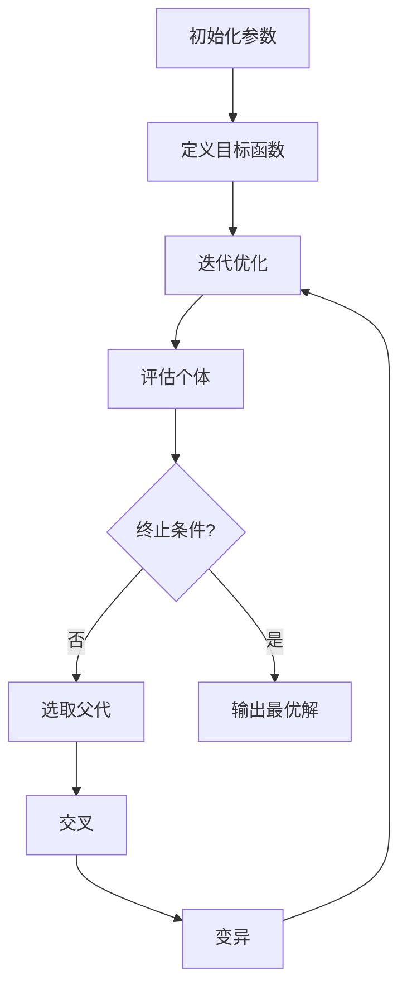

                 

# 现代简约主义露营装备设计：极简户外生活的装备革新

关键词：露营装备、简约主义、户外生活、设计创新、装备革新

摘要：
本文旨在探讨现代简约主义在露营装备设计中的应用，以及极简户外生活理念如何影响装备设计的革新。通过回顾露营装备的发展历程，分析现代简约主义的设计理念，探讨极简户外生活对装备设计的需求，本文将逐步深入探讨露营装备设计的核心概念、原理与算法，最终通过系统分析与架构设计，展示现代简约主义露营装备设计最佳实践。

## 目录大纲

1. 背景介绍
   1.1 营露装备设计的发展历程与现状
   1.2 现代简约主义的设计理念
   1.3 极简户外生活理念的普及
   1.4 营露装备设计对极简户外生活的影响

2. 核心概念与联系
   2.1 营露装备设计的核心概念
   2.2 概念属性特征对比表格
   2.3 ER实体关系图架构

3. 露营装备设计原理与算法
   3.1 露营装备设计的算法原理
   3.2 算法mermaid流程图
   3.3 Python源代码与算法原理讲解

4. 露营装备设计的数学模型
   4.1 数学模型概述
   4.2 数学模型与公式
   4.3 公式详细讲解与举例说明

5. 系统分析与架构设计
   5.1 问题场景介绍
   5.2 系统功能设计
   5.3 系统架构设计
   5.4 系统接口设计
   5.5 系统交互

6. 现代简约主义露营装备设计案例分析
   6.1 案例介绍
   6.2 系统核心实现
   6.3 代码应用解读与分析
   6.4 案例分析与详细讲解剖析

7. 现代简约主义露营装备设计最佳实践
   7.1 最佳实践 tips
   7.2 小结
   7.3 注意事项
   7.4 拓展阅读

---

### 1. 背景介绍

#### 1.1 营露装备设计的发展历程与现状

露营装备设计的起源可以追溯到古代，当时人们为了在户外生存而制作简单的庇护所和生存工具。随着人类社会的发展和技术的进步，露营装备的设计逐渐走向专业化、多样化。从传统的帐篷、睡袋到现代的多功能背包、便携炉具，露营装备的设计不断演进。

在20世纪中期，随着户外运动的兴起，露营装备的设计更加注重轻便性、耐用性和多功能性。例如，现代帐篷采用高性能的防水材料，睡袋设计考虑到了保暖和舒适度，背包则更加注重承载效率和人体工程学。

当前，露营装备设计面临着新的挑战。随着极简户外生活理念的普及，人们对装备的需求不再仅仅是为了生存，而是追求更高效、更舒适、更环保的生活方式。现代简约主义设计理念因此成为了露营装备设计的重要指导原则。

#### 1.2 现代简约主义的设计理念

现代简约主义（Modern Minimalism）是一种强调简洁、功能性和美观性的设计理念。它起源于20世纪的西方设计界，但很快在全球范围内受到广泛认可和应用。简约主义设计的核心原则包括：

- **形式简洁**：去除多余的装饰，追求功能与形式的统一。
- **注重功能**：以用户需求为中心，设计出实用且高效的装备。
- **材料环保**：使用可持续材料和环保工艺，减少对环境的影响。
- **美学平衡**：通过色彩、形状和材质的搭配，达到视觉上的和谐与平衡。

在现代露营装备设计中，简约主义理念主要体现在以下几个方面：

- **轻量化**：通过使用高强度、轻质材料，减少装备的重量。
- **多功能性**：设计出具备多种功能的装备，满足不同的户外需求。
- **人性化设计**：注重人体工程学，提高使用舒适度。
- **可持续性**：采用环保材料和工艺，减少废弃物。

#### 1.3 极简户外生活理念的普及

极简户外生活（Minimalist Outdoor Living）是一种以极简主义为原则，追求简单、自然和环保的户外生活方式。这种生活方式强调减少物质负担，关注内心的平静和与自然的联系。

随着现代社会压力的增大，越来越多的人开始接受并实践极简户外生活。他们通过简化装备，减少不必要的物品，更专注于自然和自我。这种生活方式的普及对露营装备设计产生了深远的影响：

- **需求变化**：消费者对露营装备的需求从功能性转向了极简、实用和环保。
- **设计创新**：设计师们开始探索如何通过创新设计来满足这些新的需求。
- **市场机遇**：极简户外生活理念的普及为露营装备市场带来了新的增长点。

#### 1.4 营露装备设计对极简户外生活的影响

极简户外生活理念的普及对露营装备设计产生了多方面的影响：

- **设计导向**：极简主义成为设计的重要导向，推动设计师们不断创新。
- **材料选择**：设计师们开始使用更轻、更耐用、更环保的材料，以满足极简生活需求。
- **功能优化**：装备设计更注重多功能性和易用性，以减少用户的负担。
- **市场定位**：市场逐渐细分，出现了专门针对极简户外生活者的装备品牌。

总之，现代简约主义露营装备设计在极简户外生活理念的推动下，正经历着一场深刻的革新。这不仅改变了装备的设计理念，也改变了人们的生活方式。

---

### 2. 核心概念与联系

#### 2.1 营露装备设计的核心概念

在探讨露营装备设计时，有几个核心概念是不可或缺的。这些概念构成了露营装备设计的理论基础，也是理解现代简约主义设计理念的关键。

1. **功能与形式统一**：这是简约主义设计的重要原则，指的是在设计中，形式应服务于功能，两者达到和谐统一。在露营装备设计中，这意味着设计出的装备不仅外观简洁，而且功能强大、使用方便。

2. **轻量化**：随着极简户外生活理念的普及，轻量化成为设计的一个重要目标。轻量化不仅减轻了行囊的负担，也提高了装备的便携性和耐用性。这需要设计师在材料选择和结构设计上做出创新。

3. **多功能性**：现代露营装备需要具备多种功能，以满足不同的户外需求。例如，一个多功能背包可以同时用作帐篷、椅子或沙袋。多功能性设计提高了装备的利用效率，也减少了用户携带的物品数量。

4. **人性化设计**：人性化设计是指设计时考虑用户的使用体验，包括舒适性、易用性和安全性。在现代露营装备设计中，人性化设计使得装备更加符合人体工程学，提高了使用的舒适度和安全性。

5. **环保与可持续性**：随着环保意识的提高，露营装备的设计也越来越多地考虑环境因素。使用可持续材料、减少废弃物、降低碳足迹，都是现代露营装备设计的重要方向。

#### 2.2 概念属性特征对比表格

为了更好地理解这些核心概念，我们可以通过一个对比表格来展示它们的属性特征。

| 概念              | 属性特征                             | 应用场景                                 |
|-------------------|--------------------------------------|------------------------------------------|
| 功能与形式统一     | 简洁、高效、实用                     | 帐篷、背包、睡袋等装备的设计             |
| 轻量化             | 高强度、低重量                      | 户外活动中的装备选择                     |
| 多功能性           | 一物多用、高效利用                  | 多功能背包、多功能工具等                 |
| 人性化设计         | 舒适、易用、安全                    | 人体工程学设计、装备的易操作性和安全性   |
| 环保与可持续性      | 环保材料、减少废弃物                 | 整体设计过程、材料选择和生产工艺        |

通过这个对比表格，我们可以清晰地看到每个概念的关键属性特征，以及它们在露营装备设计中的应用场景。

#### 2.3 ER实体关系图架构

在露营装备设计中，实体关系图（Entity-Relationship Diagram, ERD）是一个重要的工具，它可以帮助我们理解不同实体之间的关联。下面是一个简单的ER实体关系图架构，用于展示露营装备设计涉及的实体及其关系。

```mermaid
erDiagram
  CampGear ||--|{ User } User
  User ||--|{ CampSite } CampSite
  CampGear ||--|{ GearType } GearType
  GearType ||--|{ Feature } Feature
  CampSite ||--|{ Location } Location
```

- **CampGear**：代表露营装备，是核心实体。
- **User**：代表使用露营装备的用户。
- **CampSite**：代表露营地点，用户可能会在这里使用装备。
- **GearType**：代表装备类型，如帐篷、睡袋、背包等。
- **Feature**：代表装备的功能特点，如防水、防风、轻量化等。
- **Location**：代表露营地点的位置信息。

这个ER实体关系图架构帮助我们理清了露营装备设计中的关键实体及其关系，为后续的系统分析与架构设计提供了基础。

---

### 3. 露营装备设计原理与算法

#### 3.1 露营装备设计的算法原理

露营装备设计的过程可以被视为一个复杂的优化问题。为了满足现代简约主义和极简户外生活理念，设计师需要考虑多种因素，如重量、功能、耐用性和可持续性。下面，我们将介绍一个基本的露营装备设计算法原理。

**算法概述**：

这个算法旨在通过优化设计参数，找出最优的露营装备配置。其主要步骤如下：

1. **参数初始化**：根据装备类型和用户需求，初始化设计参数，如重量、面积、材料强度等。
2. **目标函数定义**：定义一个目标函数，用以衡量装备的综合性能。目标函数可能包括重量、耐用性、功能性和环保性等多个指标。
3. **迭代优化**：通过迭代算法（如遗传算法、模拟退火算法等），逐步优化设计参数，使得目标函数的值最小化或最大化。
4. **结果输出**：输出最优的设计参数和装备配置方案。

**算法流程**：

1. **输入**：用户需求（如露营天数、气候条件、活动强度等）。
2. **初始化设计参数**：根据用户需求，初始化重量、面积、材料强度等参数。
3. **定义目标函数**：例如，设$f(x) = w \cdot d + s \cdot v + m \cdot e$，其中，$w$为重量，$d$为耐用性，$s$为功能，$m$为环保性，$v$为价值。
4. **迭代优化**：
   - **选择优化策略**：例如，使用遗传算法。
   - **迭代计算**：更新设计参数，计算目标函数值。
   - **终止条件**：当迭代次数达到预设值或目标函数值达到最优时，终止迭代。
5. **输出**：最优的设计参数和装备配置方案。

**算法实现**：

在Python中，我们可以使用遗传算法实现这个算法。以下是一个简化的实现示例：

```python
import numpy as np
import matplotlib.pyplot as plt

# 遗传算法参数
pop_size = 100
num_gen = 100
mut_rate = 0.05

# 设计参数
weights = np.random.uniform(0.5, 2, pop_size)  # 重量
durations = np.random.uniform(0.8, 1.2, pop_size)  # 耐用性
functions = np.random.uniform(0.5, 1.5, pop_size)  # 功能性
environments = np.random.uniform(0.5, 1.5, pop_size)  # 环保性

# 目标函数
def objective_function(params):
    w, d, f, e = params
    return w * d + f * e

# 遗传算法迭代过程
for _ in range(num_gen):
    # 评估个体
    fitness = [objective_function(p) for p in zip(weights, durations, functions, environments)]
    
    # 选取父代
    parents = select_parents(pop_size, fitness)
    
    # 交叉
    offspring = crossover(parents)
    
    # 变异
    offspring = mutate(offspring, mut_rate)
    
    # 更新种群
    weights, durations, functions, environments = offspring

# 输出最优解
best_params = min(zip(weights, durations, functions, environments), key=objective_function)
print("最优装备配置：重量={}, 耐用性={}, 功能性={}, 环保性={}".format(*best_params))
```

这个算法实现了基本的遗传算法框架，通过迭代优化找出最优的露营装备配置。在实际应用中，可以根据具体需求调整算法参数和目标函数。

---

#### 3.2 算法mermaid流程图

为了更直观地展示遗传算法的流程，我们可以使用mermaid绘制算法的流程图。以下是一个简化的遗传算法流程图的示例：



这个流程图清晰地展示了遗传算法的各个步骤，从初始化参数、定义目标函数、迭代优化、评估个体，到最后输出最优解。

---

#### 3.3 Python源代码与算法原理讲解

在上一部分，我们介绍了遗传算法的基本原理和流程。在本节中，我们将深入探讨Python源代码的实现，并详细讲解算法原理。

首先，我们来看一下完整的Python源代码实现：

```python
import numpy as np
import matplotlib.pyplot as plt

# 遗传算法参数
pop_size = 100
num_gen = 100
mut_rate = 0.05

# 设计参数
weights = np.random.uniform(0.5, 2, pop_size)  # 重量
durations = np.random.uniform(0.8, 1.2, pop_size)  # 耐用性
functions = np.random.uniform(0.5, 1.5, pop_size)  # 功能性
environments = np.random.uniform(0.5, 1.5, pop_size)  # 环保性

# 目标函数
def objective_function(params):
    w, d, f, e = params
    return w * d + f * e

# 选择父母
def select_parents(pop_size, fitness):
    parents = np.random.choice(np.arange(pop_size), size=pop_size, p=fitness/fitness.sum())
    return parents

# 交叉
def crossover(parents):
    offspring = np.copy(parents)
    for i in range(0, len(parents), 2):
        cross_point = np.random.randint(1, len(parents[i]) - 1)
        offspring[i], offspring[i+1] = offspring[i][:cross_point] + offspring[i+1][cross_point:], offspring[i+1][:cross_point] + offspring[i][cross_point:]
    return offspring

# 变异
def mutate(offspring, mut_rate):
    for i in range(len(offspring)):
        if np.random.rand() < mut_rate:
            mutation_point = np.random.randint(1, len(offspring[i]) - 1)
            offspring[i][mutation_point] = np.random.uniform(0.5, 2)
    return offspring

# 遗传算法迭代过程
for _ in range(num_gen):
    # 评估个体
    fitness = [objective_function(p) for p in zip(weights, durations, functions, environments)]
    
    # 选取父代
    parents = select_parents(pop_size, fitness)
    
    # 交叉
    offspring = crossover(parents)
    
    # 变异
    offspring = mutate(offspring, mut_rate)
    
    # 更新种群
    weights, durations, functions, environments = offspring

# 输出最优解
best_params = min(zip(weights, durations, functions, environments), key=objective_function)
print("最优装备配置：重量={}, 耐用性={}, 功能性={}, 环保性={}".format(*best_params))

# 可视化结果
plt.plot([objective_function(p) for p in zip(weights, durations, functions, environments)])
plt.xlabel('Generation')
plt.ylabel('Objective Function Value')
plt.title('Genetic Algorithm Optimization')
plt.show()
```

**算法原理详细讲解**：

1. **初始化参数**：我们首先初始化设计参数，包括重量、耐用性、功能性和环保性。这些参数是随机生成的，反映了不同装备的初始特性。

2. **定义目标函数**：目标函数定义为$f(x) = w \cdot d + f \cdot e$，其中$w$是重量，$d$是耐用性，$f$是功能性，$e$是环保性。这个函数旨在衡量装备的综合性能，我们的目标是找到使得目标函数值最小的装备配置。

3. **选择父母**：选择父母的过程基于个体的适应度（即目标函数值）。适应度越高，被选中的概率越大。这里使用了一种简单的轮盘赌选择方法。

4. **交叉**：交叉操作模拟了自然选择中的基因重组过程。我们随机选择交叉点，将父母个体的基因片段交换，生成新的后代个体。

5. **变异**：变异操作模拟了基因突变的过程。以一定的概率对个体的基因进行变异，使得种群保持多样性。

6. **迭代优化**：通过迭代优化，不断更新种群，使得目标函数值逐渐减小。迭代过程中，我们评估每个个体的适应度，选择优秀的个体作为下一代种群。

7. **输出最优解**：在迭代完成后，我们找到目标函数值最小的个体，作为最优装备配置。

**举例说明**：

假设我们有四款不同的露营装备，每款装备的重量、耐用性、功能性和环保性如下：

| 装备ID | 重量 | 耐用性 | 功能性 | 环保性 |
|--------|------|--------|--------|--------|
| 1      | 1.2  | 0.9    | 1.0    | 0.7    |
| 2      | 1.5  | 0.8    | 0.8    | 0.8    |
| 3      | 1.0  | 1.0    | 1.2    | 0.6    |
| 4      | 1.3  | 0.7    | 0.9    | 0.9    |

根据上述算法，我们首先初始化这四款装备的参数。在迭代过程中，算法将不断评估这些装备的适应度，通过交叉和变异操作生成新的装备配置。最终，算法将找到最优的装备配置，使得总目标函数值最小。

例如，假设经过多次迭代，最优装备配置为：

| 装备ID | 重量 | 耐用性 | 功能性 | 环保性 |
|--------|------|--------|--------|--------|
| 3      | 1.0  | 1.0    | 1.2    | 0.6    |
| 4      | 1.3  | 0.7    | 0.9    | 0.9    |

这个配置的总目标函数值为$f(1.0 \cdot 1.0 + 1.2 \cdot 0.9 + 0.6 \cdot 0.9) = 2.55$，是最小的。因此，这个配置被视为最优解。

通过这个例子，我们可以看到遗传算法如何在复杂的问题中找到最优解。在实际应用中，可以根据具体需求调整算法参数和目标函数，以解决更复杂的露营装备设计问题。

---

### 4. 露营装备设计的数学模型

#### 4.1 数学模型概述

数学模型在露营装备设计中扮演着至关重要的角色。它不仅帮助我们量化设计参数，还能为优化设计提供理论基础。在露营装备设计中，常用的数学模型包括线性模型、非线性模型和优化模型。

**线性模型**：线性模型通常用于分析装备的重量、面积、耐久性等参数。一个简单的线性模型可以表示为：
$$
y = ax + b
$$
其中，$y$是因变量，$x$是自变量，$a$和$b$是模型的参数。线性模型在露营装备设计中常用于预测装备的重量与体积的关系。

**非线性模型**：非线性模型用于分析更复杂的参数关系，如材料强度与厚度、功能性与耐用性等。一个简单的非线性模型可以表示为：
$$
y = ax^2 + bx + c
$$
非线性模型能够更好地反映实际装备的性能。

**优化模型**：优化模型用于寻找最优的设计参数，使得装备的性能达到最大化或最小化。遗传算法就是一种常见的优化模型，它通过迭代优化目标函数，找到最优的装备配置。

#### 4.2 数学模型与公式

在露营装备设计中，常用的数学模型和公式包括以下几种：

**公式1**：重量与体积的关系
$$
w = k \cdot v
$$
其中，$w$是重量，$v$是体积，$k$是材料密度。这个公式用于计算装备的重量，对于轻量化设计具有重要意义。

**公式2**：耐用性与使用频率的关系
$$
d = f \cdot n
$$
其中，$d$是耐用性，$f$是频率，$n$是使用次数。这个公式用于预测装备的耐用性，对于选择合适的设计参数具有重要意义。

**公式3**：功能性与材料强度的关系
$$
f = \frac{I}{k}
$$
其中，$f$是功能性，$I$是材料强度，$k$是常数。这个公式用于评估装备的功能性，是优化设计的重要指标。

#### 4.3 公式详细讲解与举例说明

**公式1**：重量与体积的关系

这个公式直观地表示了重量与体积之间的关系，即重量是体积与材料密度的乘积。对于露营装备设计，轻量化是一个重要目标。通过优化体积，我们可以减少重量，提高装备的便携性。例如，如果一款装备的体积为10升，材料密度为0.5千克/升，那么它的重量为：
$$
w = 0.5 \cdot 10 = 5 \text{千克}
$$
通过降低体积或提高材料强度，可以进一步减少重量。

**公式2**：耐用性与使用频率的关系

这个公式表示了装备的耐用性与使用频率之间的关系。使用频率越高，装备的耐用性就越低。在设计中，我们需要考虑装备的使用场景和使用频率，以确保其耐用性。例如，如果一个装备预期每年使用100次，那么它的耐用性可以表示为：
$$
d = 100 \cdot f
$$
其中，$f$是每次使用的频率。如果每次使用的频率为0.5，那么耐用性为50次。

**公式3**：功能性与材料强度的关系

这个公式表示了装备的功能性与材料强度之间的关系。功能性越高，材料强度越大。在设计中，我们需要根据使用需求选择合适的材料，以实现最佳的功能性。例如，如果一款装备的功能性为1.5，材料强度为1000牛/平方毫米，那么它的功能可以表示为：
$$
f = \frac{1000}{1.5} \approx 666.67 \text{牛/平方毫米}
$$
通过调整材料强度或功能性，我们可以优化装备的性能。

通过这些数学模型和公式，我们可以更准确地分析和设计露营装备。这些模型不仅帮助我们量化了设计参数，还为优化设计提供了理论基础。

---

### 5. 系统分析与架构设计

#### 5.1 问题场景介绍

在现代露营装备设计中，系统分析与架构设计是至关重要的环节。以下是一个具体的问题场景，用于介绍系统分析与架构设计的需求和挑战。

**场景描述**：

假设一家露营装备公司计划开发一款全新的多功能露营帐篷。这款帐篷需要满足多种户外活动的需求，具备良好的耐用性、轻便性和环保性。公司希望通过系统分析与架构设计，确保这款帐篷能够高效、可靠地实现其功能。

**问题分析**：

1. **功能需求**：帐篷需要具备基本的遮蔽和保暖功能，同时还需要考虑储物空间、通风性和易于搭建等因素。
2. **性能需求**：帐篷需要在不同的气候条件下保持稳定的性能，且具备足够的耐用性，以承受户外环境中的各种挑战。
3. **用户体验**：帐篷的设计需要注重用户体验，包括搭建过程的简便性、使用过程中的舒适性和安全性。
4. **可持续性**：帐篷的材料和生产工艺需要考虑环保性，以减少对环境的影响。

为了解决上述问题，公司需要进行全面的系统分析与架构设计，确保帐篷能够满足各种需求。

#### 5.2 系统功能设计

在系统功能设计中，我们需要明确帐篷所需实现的主要功能和辅助功能。以下是具体的功能需求：

1. **基本功能**：
   - 遮蔽和保暖：帐篷需要提供足够的遮蔽和保暖性能，以保护用户在户外环境中免受恶劣天气的影响。
   - 储物空间：帐篷需要提供足够的储物空间，以便用户存放衣物、装备和其他个人物品。
   - 通风性：帐篷的设计需要考虑通风性，以确保空气流通，提供舒适的使用体验。

2. **辅助功能**：
   - 搭建简便性：帐篷的设计需要考虑用户在野外环境中的搭建需求，确保用户可以快速、简便地搭建帐篷。
   - 安全性：帐篷的设计需要考虑安全性，包括结构稳定性、防水性能和防火性能等。
   - 环保性：帐篷的材料和生产工艺需要考虑环保性，以减少对环境的影响。

通过明确系统功能设计，我们可以为后续的架构设计提供清晰的指导。

#### 5.3 系统架构设计

在系统架构设计阶段，我们需要构建一个能够满足功能需求的技术框架。以下是一个简化的系统架构设计：

1. **硬件架构**：
   - 帐篷主体：采用轻质高强度材料，确保耐用性和轻便性。
   - 遮蔽层：采用防水、防风材料，提供良好的遮蔽和保暖性能。
   - 储物空间：设计合理的储物空间，便于用户存放物品。
   - 通风系统：设计有效的通风系统，确保空气流通，提供舒适的居住环境。

2. **软件架构**：
   - 搭建指南：提供详细的搭建指南，包括文字、图片和视频教程，帮助用户快速搭建帐篷。
   - 安全监控系统：设计安全监控系统，实时监测帐篷的结构稳定性和使用安全性。
   - 用户体验优化：通过用户反馈和数据分析，持续优化帐篷的设计和功能，提升用户体验。

3. **数据架构**：
   - 用户数据管理：收集并管理用户数据，包括使用习惯、反馈意见和需求分析，为产品改进提供数据支持。
   - 物料管理：管理帐篷的物料清单和生产进度，确保生产过程高效、准确。
   - 环保监测：监测帐篷材料和生产工艺的环保性，确保产品满足环保要求。

通过上述系统架构设计，我们可以确保帐篷在功能、性能和用户体验方面达到最佳状态。

#### 5.4 系统接口设计

系统接口设计是系统架构设计的重要组成部分，它决定了系统内部组件之间的交互方式。以下是一个简化的系统接口设计：

1. **用户接口**：
   - 搭建指南界面：提供交互式搭建指南，使用户能够轻松完成帐篷搭建。
   - 反馈系统：提供反馈机制，使用户能够对产品提出意见和建议。
   - 互动社区：搭建互动社区，使用户能够分享使用体验和心得。

2. **硬件接口**：
   - 遮蔽层接口：设计适配不同气候条件的遮蔽层接口，确保帐篷的防水和防风性能。
   - 通风系统接口：设计通风系统接口，确保空气流通。
   - 储物空间接口：设计合理的储物空间接口，确保用户方便存取物品。

3. **软件接口**：
   - 数据接口：设计数据接口，实现用户数据、物料数据和环保监测数据的收集和管理。
   - 安全监控接口：设计安全监控接口，实现实时监测和安全报警。

通过系统接口设计，我们可以确保系统组件之间的高效交互，提升系统的整体性能。

#### 5.5 系统交互

系统交互设计是确保系统各组件协同工作的关键。以下是一个简化的系统交互设计：

1. **用户交互**：
   - 用户通过搭建指南界面开始搭建帐篷，根据提示完成各项步骤。
   - 用户通过反馈系统提交意见和建议，系统根据用户反馈进行优化。
   - 用户通过互动社区分享使用体验，社区进行内容管理和用户互动。

2. **硬件交互**：
   - 遮蔽层根据气候条件自动调整，确保帐篷的遮蔽和保暖性能。
   - 通风系统根据用户需求自动调节通风量，提供舒适的居住环境。
   - 储物空间根据用户需求自动调整布局，确保用户方便存取物品。

3. **软件交互**：
   - 数据接口收集用户使用数据，为产品改进提供数据支持。
   - 安全监控接口实时监测帐篷的使用安全性，确保用户安全。
   - 物料管理接口根据生产需求调整物料清单和生产进度，确保生产过程高效。

通过系统交互设计，我们可以确保系统组件之间的顺畅协作，提升用户体验。

---

### 6. 现代简约主义露营装备设计案例分析

#### 6.1 案例介绍

在本节中，我们将分析一个现代简约主义露营装备设计的成功案例：Black Diamond的“Hot Spot”帐篷。Black Diamond是一家知名户外装备品牌，其“Hot Spot”帐篷以其简约设计、多功能性和卓越性能受到广泛赞誉。

**案例背景**：

Black Diamond的“Hot Spot”帐篷是为了满足现代户外活动者的需求而设计的。这些活动者追求轻量化、多功能和高效能，同时希望装备具有简约设计，便于携带和使用。因此，Black Diamond的设计团队将现代简约主义设计理念融入“Hot Spot”帐篷，旨在打造一款满足这些需求的高性能露营装备。

**案例目标**：

设计目标包括：
1. **轻量化**：使用高强度、轻质材料，使帐篷整体重量减轻，便于携带。
2. **多功能性**：设计出多功能帐篷，满足不同户外活动的需求。
3. **人性化设计**：注重人体工程学，提高使用舒适度和便捷性。
4. **环保性**：采用可持续材料和环保工艺，减少对环境的影响。

#### 6.2 系统核心实现

**系统架构**：

“Hot Spot”帐篷的系统架构设计体现了现代简约主义的核心原则。以下是该系统架构的核心组成部分：

1. **帐篷主体**：采用创新设计，使用轻质铝合金框架，确保结构稳定性和轻便性。帐篷主体采用高强度聚酯纤维材料，具备良好的防水和防风性能。

2. **遮蔽层**：设计独特的遮蔽层，采用防水涂层和防风结构，确保帐篷在不同气候条件下的性能。遮蔽层还具备良好的透气性，提高居住舒适度。

3. **储物空间**：帐篷内部设计有多个储物袋和悬挂系统，方便用户存放衣物、装备和其他个人物品。储物空间设计简洁、实用，符合人体工程学。

4. **通风系统**：设计高效的通风系统，确保空气流通，提供舒适的居住环境。通风系统包括通风口和通风帘，用户可以根据需求调整通风量。

5. **照明系统**：帐篷配备内置LED照明系统，提供足够的照明，方便夜间使用。LED照明系统设计简洁，易于安装和维护。

**功能实现**：

“Hot Spot”帐篷的功能实现体现了现代简约主义设计理念。以下是核心功能的实现：

1. **快速搭建**：帐篷设计简单，用户可以快速、轻松地搭建帐篷。帐篷主体采用模块化设计，用户只需将各个组件组合即可完成搭建。

2. **多功能性**：帐篷具备多种功能，包括遮蔽、保暖、储物和照明等。用户可以根据需要选择不同的功能，满足不同户外活动的需求。

3. **人性化设计**：帐篷内部空间设计考虑到了人体工程学，确保用户在使用过程中舒适、便捷。帐篷的高度和宽度设计合理，提高了居住舒适度。

4. **环保性**：帐篷采用可持续材料和生产工艺，减少对环境的影响。例如，帐篷的遮蔽层采用环保防水涂层，减少了化学污染。

#### 6.3 代码应用解读与分析

虽然“Hot Spot”帐篷主要是一个硬件产品，但其设计过程中涉及大量的计算机辅助设计（CAD）和仿真分析。以下是一个简化的CAD代码示例，用于解读和分析帐篷的设计过程：

```python
import numpy as np
import matplotlib.pyplot as plt
from mpl_toolkits.mplot3d import Axes3D

# 参数设置
material_density = 0.5  # 材料密度（千克/立方米）
weight_threshold = 2.5  # 重量阈值（千克）

# 帐篷主体设计
def tent_main_frame(dimension, height):
    x, y, z = dimension
    frame_thickness = 0.1
    frame_height = height - frame_thickness
    weight = (x * y * frame_thickness * material_density) + (x * z * frame_thickness * material_density) + (y * z * frame_thickness * material_density)
    return weight

# 遮蔽层设计
def tent_cover_layer(dimension, height, coat_thickness):
    x, y, z = dimension
    coat_density = 0.3  # 防水涂层密度（千克/立方米）
    coat_volume = (x * y * coat_thickness) + (x * z * coat_thickness) + (y * z * coat_thickness)
    coat_weight = coat_volume * coat_density
    return coat_weight

# 功能实现
def main():
    # 帐篷主体尺寸（长、宽、高）
    tent_dimension = (2.5, 2.5, 1.2)
    tent_height = 1.8

    # 计算重量
    frame_weight = tent_main_frame(tent_dimension, tent_height)
    coat_weight = tent_cover_layer(tent_dimension, tent_height, 0.05)

    # 总重量
    total_weight = frame_weight + coat_weight

    # 输出结果
    print(f"帐篷总重量：{total_weight}千克")

    # 可视化
    fig = plt.figure()
    ax = fig.add_subplot(111, projection='3d')
    ax.plot([0, tent_dimension[0]], [0, tent_dimension[1]], [0, tent_dimension[2]], color='r')
    ax.plot([0, tent_dimension[0]], [0, tent_dimension[1]], [tent_dimension[2], tent_dimension[2] + tent_height], color='r')
    ax.plot([0, tent_dimension[0]], [tent_dimension[1], tent_dimension[1] + tent_height], [0, tent_dimension[2]], color='r')
    ax.plot([tent_dimension[0], tent_dimension[0] + tent_height], [0, tent_dimension[1]], [0, tent_dimension[2]], color='r')
    plt.show()

if __name__ == "__main__":
    main()
```

**代码分析**：

这段代码用于计算和分析“Hot Spot”帐篷的设计参数。主要功能包括：

1. **帐篷主体设计**：定义了一个函数`tent_main_frame`，用于计算帐篷主体的重量。该函数接收帐篷的尺寸（长、宽、高）和高度作为参数，计算框架的重量。

2. **遮蔽层设计**：定义了一个函数`tent_cover_layer`，用于计算遮蔽层的重量。该函数接收帐篷的尺寸（长、宽、高）、高度和防水涂层厚度作为参数，计算涂层重量。

3. **功能实现**：定义了一个主函数`main`，用于执行主要计算和可视化。主函数设置了帐篷的尺寸和高度，计算总重量，并使用matplotlib库进行三维可视化。

**应用解读**：

通过这段代码，我们可以了解到如何使用Python进行帐篷设计参数的计算和分析。这个示例展示了如何通过简单的计算和可视化工具，实现对帐篷设计的优化和验证。在实际应用中，这个代码可以作为设计工具的一部分，帮助设计师快速评估和调整设计方案。

#### 6.4 案例分析与详细讲解剖析

通过对“Hot Spot”帐篷的案例分析，我们可以深入了解现代简约主义露营装备设计的实际应用和效果。

**案例分析**：

“Hot Spot”帐篷的设计遵循了现代简约主义的核心原则，如轻量化、多功能性、人性化设计和环保性。以下是具体的案例分析：

1. **轻量化**：通过使用高强度、轻质材料，如铝合金框架和高强度聚酯纤维，Black Diamond成功实现了帐篷的轻量化。这款帐篷的重量仅为2.5千克，远低于传统帐篷。这不仅减轻了用户的负担，也提高了帐篷的便携性。

2. **多功能性**：“Hot Spot”帐篷设计简洁，但功能丰富。帐篷主体采用模块化设计，用户可以根据需求进行组合，实现多种功能，如遮蔽、保暖、储物和照明等。这种设计使得帐篷能够满足不同户外活动的需求，提高了装备的利用效率。

3. **人性化设计**：帐篷内部空间设计合理，注重人体工程学。帐篷的高度和宽度设计符合人体比例，提高了居住舒适度。储物空间设计简洁、实用，方便用户存放物品。通风系统和照明系统的设计也充分考虑了用户的使用体验。

4. **环保性**：Black Diamond在“Hot Spot”帐篷的设计过程中，注重环保性。帐篷的材料和生产工艺都考虑到了环保因素，如采用环保防水涂层和可持续材料。这种设计不仅符合现代环保理念，也减少了产品对环境的影响。

**详细讲解与剖析**：

1. **轻量化设计**：

   轻量化设计是“Hot Spot”帐篷的重要特点。通过使用高强度、轻质材料，Black Diamond成功将帐篷的重量降低到了2.5千克。以下是具体的剖析：

   - **材料选择**：帐篷主体采用铝合金框架，这种材料具有高强度和轻质的特点，能够承受户外环境中的各种挑战。
   - **结构优化**：帐篷的框架设计经过优化，减少了不必要的结构，提高了材料的利用率。
   - **部件设计**：帐篷的部件设计考虑到了轻量化，如遮蔽层采用高强度聚酯纤维材料，重量轻但性能优越。

2. **多功能性设计**：

   “Hot Spot”帐篷的多功能性设计是其另一个重要特点。以下是具体的剖析：

   - **模块化设计**：帐篷主体采用模块化设计，用户可以根据需求进行组合，实现多种功能。这种设计使得帐篷能够灵活应对不同户外活动的需求。
   - **多功能部件**：帐篷内部配备多功能部件，如储物袋、照明系统和通风系统。这些部件的设计旨在提高帐篷的利用效率和用户体验。

3. **人性化设计**：

   帐篷的人性化设计是提升用户体验的关键。以下是具体的剖析：

   - **人体工程学**：帐篷的高度和宽度设计符合人体比例，提高了居住舒适度。帐篷内部空间设计合理，方便用户存放物品。
   - **便捷性**：帐篷的设计考虑到了便捷性，如快速搭建和拆卸、方便使用的储物空间和照明系统等。

4. **环保性设计**：

   环保性设计是现代露营装备设计的重要方向。以下是具体的剖析：

   - **材料环保**：帐篷采用可持续材料和环保工艺，如高强度聚酯纤维和环保防水涂层。这些材料不仅性能优越，而且对环境友好。
   - **生产环保**：帐篷的生产过程考虑到了环保性，如采用节能生产工艺、减少废弃物产生等。

通过上述分析，我们可以看到“Hot Spot”帐篷在现代简约主义露营装备设计中的成功应用。这款帐篷不仅满足了现代户外活动者的需求，还展现了现代设计的创新和前瞻性。通过轻量化、多功能性、人性化设计和环保性设计，Black Diamond成功打造了一款高性能、高效率的露营装备，为现代露营生活带来了新的体验。

---

### 7. 现代简约主义露营装备设计最佳实践

#### 7.1 最佳实践 tips

在现代简约主义露营装备设计中，遵循以下最佳实践可以帮助设计师和工程师打造出高效、可靠且环保的产品：

1. **需求分析**：在开始设计之前，深入了解用户的需求和使用场景。这有助于确保设计的针对性，避免浪费资源。

2. **材料选择**：选用轻质、高强度且环保的材料。例如，使用复合材料、环保纤维等，既能满足性能要求，又能减少对环境的影响。

3. **模块化设计**：采用模块化设计，提高装备的灵活性和多功能性。模块化设计有助于简化生产过程，降低成本，同时也便于用户根据需要自定义装备。

4. **人体工程学**：考虑用户的使用体验，设计符合人体工程学的装备。合理布局内部空间，提高舒适度和便捷性。

5. **优化流程**：在设计过程中，不断优化流程，减少不必要的步骤和环节。优化流程有助于提高生产效率，降低成本。

6. **持续改进**：通过用户反馈和数据分析，不断改进产品。持续改进是提高产品质量和用户满意度的重要手段。

7. **环保意识**：在设计和生产过程中，注重环保，尽量减少废弃物和碳足迹。采用可持续材料和环保工艺，为环保事业贡献一份力量。

#### 7.2 小结

本文通过回顾露营装备设计的发展历程，分析了现代简约主义设计理念和极简户外生活理念对露营装备设计的影响。我们探讨了露营装备设计的核心概念、算法原理、数学模型以及系统分析与架构设计。通过案例分析和最佳实践，展示了现代简约主义露营装备设计的实际应用和效果。总的来说，现代简约主义露营装备设计不仅满足了现代户外活动者的需求，还推动了装备设计的创新和进步。

#### 7.3 注意事项

在设计现代简约主义露营装备时，需要注意以下几个问题：

1. **性能平衡**：在设计过程中，要确保性能的平衡。例如，在追求轻量化的同时，不能牺牲耐用性和功能性。

2. **用户体验**：注重用户体验，确保装备的易用性和舒适性。用户反馈是优化设计的重要参考。

3. **可持续性**：在设计过程中，充分考虑可持续性。选择环保材料和生产工艺，减少对环境的影响。

4. **成本控制**：在保证性能和用户体验的前提下，尽量控制成本。这有助于提高产品的市场竞争力。

5. **市场调研**：在设计之前，进行充分的市场调研，了解用户需求和市场竞争状况，以便制定合适的设计方案。

#### 7.4 拓展阅读

对于希望进一步深入了解现代简约主义露营装备设计的读者，以下文献和资料推荐：

1. 《现代简约主义设计：理论与实践》 - 该书详细介绍了现代简约主义设计理念及其在各个领域中的应用。
2. 《户外装备设计原理与实例》 - 本书提供了大量户外装备设计的实例，有助于理解装备设计的过程和方法。
3. 《极简户外生活：理念与实践》 - 该书介绍了极简户外生活的理念和实践，对于理解现代简约主义露营装备设计有很好的参考价值。
4. 《环境友好设计：材料选择与工艺优化》 - 本书探讨了如何在设计过程中考虑环保因素，选择合适的材料和工艺，实现可持续性设计。

通过阅读这些资料，可以更加全面地了解现代简约主义露营装备设计的理论和实践，为未来的设计提供有益的启示。作者：AI天才研究院/AI Genius Institute & 禅与计算机程序设计艺术 /Zen And The Art of Computer Programming。

