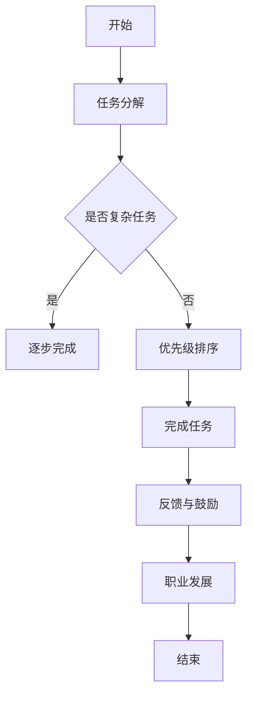

                 

# 现代职场中的心理健康：压力管理与工作幸福感

> 关键词：心理健康、压力管理、工作幸福感、时间管理、情绪调节、社交支持

> 摘要：本文将深入探讨现代职场中心理健康的重要性，分析压力管理的策略和提升工作幸福感的途径。通过逻辑清晰的分析和实例说明，为职场人士提供实用的心理健康维护和压力应对方法，以实现工作与生活的平衡。

## 第一部分：引言

### 1.1 背景介绍

在当今快节奏的职场环境中，工作压力已成为影响员工心理健康的主要因素。长时间的工作、不断上升的工作量和激烈的职场竞争，使得许多职场人士面临巨大的心理压力。这种压力不仅影响个人的工作效率，还可能导致焦虑、抑郁等心理问题的发生。因此，如何有效管理职场压力，提升工作幸福感，已经成为现代职场人士关注的重要课题。

### 1.2 核心概念

- **心理健康**：心理健康是指个体在情感、认知和行为上的整体健康状态。它包括情感管理、认知功能和人际关系等方面。
- **压力管理**：压力管理是指通过各种方法和技巧来减轻压力的影响，保持心理平衡。包括时间管理技巧、情绪调节技巧和社交支持等。
- **工作幸福感**：工作幸福感是指个体在工作中获得的满足感和快乐感。它包括成就感、工作与生活的平衡和组织支持等方面。

### 1.3 边界与外延

心理健康、压力管理和工作幸福感之间存在密切的联系。心理健康的状态会影响个体对压力的感知和应对能力，进而影响工作幸福感。同时，工作幸福感也会对心理健康产生积极或消极的影响。例如，一个心理健康状态良好的人更有可能采取有效的压力管理策略，从而提升工作幸福感。而工作幸福感高的人通常更能感受到成就感，有助于保持心理健康。

### 1.4 概念结构与核心要素组成

心理健康的核心要素包括：

1. **情感管理**：学会调节和控制自己的情绪，保持积极心态。
2. **认知功能**：保持清晰的思维，正确评估和处理工作问题。
3. **人际关系**：建立和谐的人际关系，提高社会支持。

压力管理的核心要素包括：

1. **时间管理**：合理安排工作时间和休息时间，避免过度劳累。
2. **情绪调节**：学会放松和缓解压力，保持心理平衡。
3. **目标设定**：设定合理的工作目标，避免因追求完美而造成的心理负担。

工作幸福感的核心要素包括：

1. **成就感**：通过工作获得满足感和成就感。
2. **工作与生活平衡**：合理安排工作与生活，保持身心健康。
3. **组织支持**：获得来自组织和社会的支持，提高工作积极性。

## 第二部分：心理健康与压力管理

### 2.1 压力来源与类型

职场压力主要来源于以下几个方面：

- **工作量**：工作负担过重，任务繁重。
- **工作环境**：工作场所的竞争和冲突。
- **工作性质**：需要高度集中注意力或高压力的工作。

根据压力的持续时间，压力可以分为以下两种类型：

- **急性压力**：短期内的压力，可能导致焦虑和紧张。
- **慢性压力**：长期存在的压力，可能导致身体和心理问题。

### 2.2 压力管理的方法

#### 2.2.1 时间管理技巧

- **任务分解**：将大任务分解成小任务，逐步完成。
- **优先级排序**：根据任务的紧急程度和重要性进行排序。

#### 2.2.2 情绪调节技巧

- **深呼吸**：通过深呼吸来放松身心。
- **正念冥想**：通过冥想来提高情绪稳定性和注意力。

#### 2.2.3 社交支持

- **建立社交网络**：与家人、朋友和同事保持良好的关系。
- **寻求专业帮助**：在必要时寻求心理咨询师的帮助。

### 2.3 心理健康的重要性

#### 2.3.1 心理健康对工作效率的影响

- **情绪稳定性**：有助于保持专注和高效工作。
- **积极心态**：有助于面对挑战和解决问题。

#### 2.3.2 心理健康对工作满意度的影响

- **工作幸福感**：提高工作满意度和生活质量。
- **职业发展**：有助于在职场中取得更好的发展机会。

## 第三部分：提升工作幸福感

### 3.1 工作与生活的平衡

#### 3.1.1 合理安排工作时间

- **制定日程表**：合理安排工作和休息时间。
- **设定工作优先级**：优先处理重要和紧急的任务。

#### 3.1.2 活动多样化

- **参加兴趣小组**：在工作之余，参加兴趣小组，丰富社交生活。
- **运动锻炼**：定期参加运动，提高身体素质和心理健康。

### 3.2 组织支持与反馈

#### 3.2.1 良好的沟通环境

- **积极反馈**：鼓励员工提出意见和建议，并及时给予反馈。
- **支持与鼓励**：为员工提供心理支持，鼓励他们在工作中发挥潜力。

#### 3.2.2 职业发展机会

- **培训与晋升**：提供培训机会，帮助员工提升专业技能。
- **公平竞争**：确保员工有机会在职场中展现自己的能力。

### 3.3 个人成长与自我管理

#### 3.3.1 自我认知

- **了解自己的优势和不足**：通过自我反思，明确自己的职业发展方向。

### 总结

在现代社会，心理健康、压力管理和工作幸福感已经成为职场人士关注的焦点。通过有效的压力管理和提升工作幸福感，职场人士可以更好地应对职场压力，保持心理健康，提高工作效率和工作满意度。同时，组织和社会也应该为员工提供良好的支持，帮助他们在职场中实现个人成长和发展。让我们共同努力，打造一个健康、积极、充满幸福感的职场环境。

## 附录

### 1. 压力管理技巧表格

| 技巧 | 描述 | 适用场景 |
| :--: | :--: | :--: |
| 任务分解 | 将大任务分解成小任务，逐步完成 | 复杂任务、时间紧迫 |
| 优先级排序 | 根据任务的紧急程度和重要性进行排序 | 高压工作、任务繁多 |
| 深呼吸 | 通过深呼吸来放松身心 | 焦虑、紧张 |
| 正念冥想 | 通过冥想来提高情绪稳定性和注意力 | 焦虑、压力大 |
| 建立社交网络 | 与家人、朋友和同事保持良好的关系 | 社交压力、孤独感 |
| 寻求专业帮助 | 在必要时寻求心理咨询师的帮助 | 情绪问题、心理困扰 |

### 2. 工作幸福感要素对比表

| 要素 | 描述 | 重要性 |
| :--: | :--: | :--: |
| 成就感 | 通过工作获得满足感和成就感 | 提高工作积极性 |
| 工作与生活平衡 | 合理安排工作与生活，保持身心健康 | 预防心理问题 |
| 组织支持 | 获得来自组织和社会的支持，提高工作积极性 | 提高工作满意度 |

### 3. Mermaid 流程图示例

### 4. 拓展阅读

- [《职场压力管理：技巧与策略》](https://www.example.com/book1)
- [《幸福工作法：职场人士的心理健康指南》](https://www.example.com/book2)
- [《时间管理法则：如何高效利用时间》](https://www.example.com/book3)

作者：AI天才研究院/AI Genius Institute & 禅与计算机程序设计艺术 /Zen And The Art of Computer Programming

