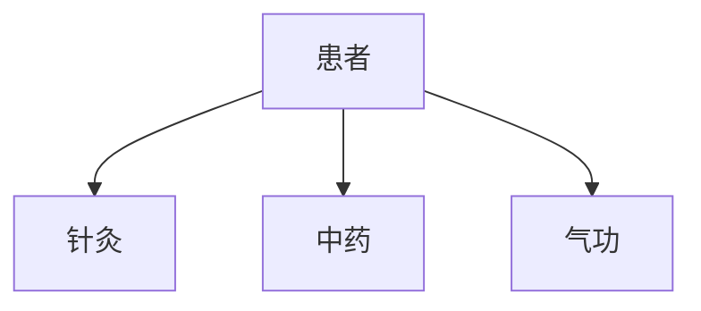
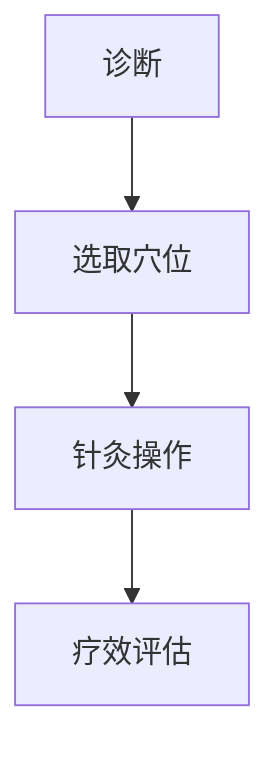
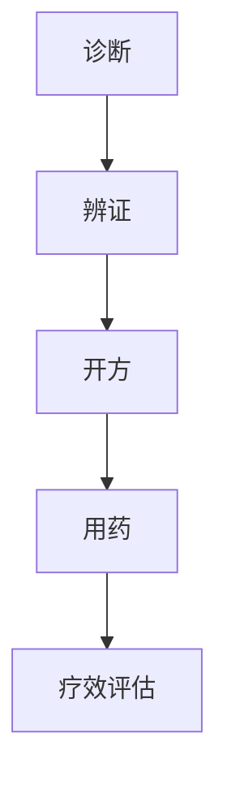
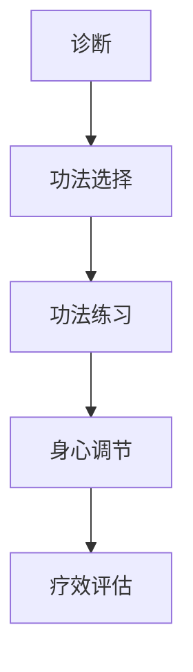
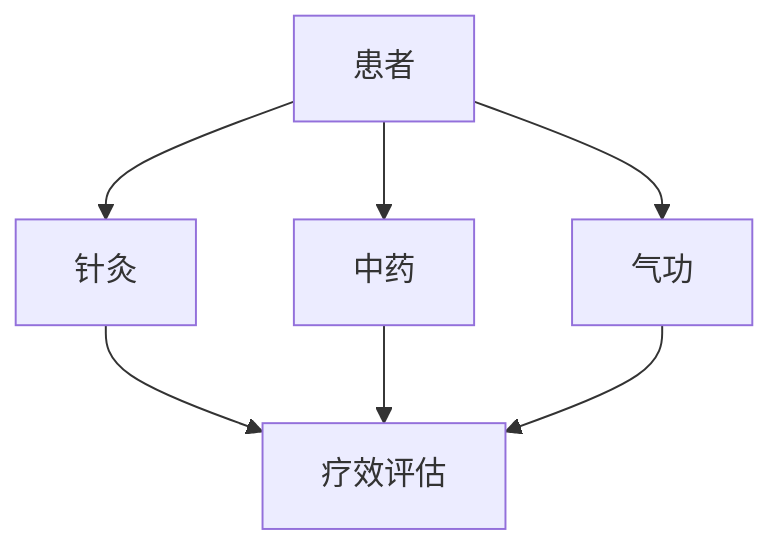

                 

# 现代自然疗法：传统医学在当代健康中的应用

## 关键词：传统医学、当代健康、针灸、中药、气功、健康治疗

### 摘要：

本文深入探讨了传统医学在当代健康中的应用，分析了传统医学与现代医学的对比、分类、核心概念以及具体治疗方法的原理和实践。通过详细的讲解和代码示例，展示了针灸、中药和气功等传统医学方式在现代疾病治疗中的有效性，为当代健康领域提供了新的思考方向和实践路径。

## 目录大纲

## 第1章：传统医学基础

### 1.1 问题背景

- 当代健康问题的挑战
- 传统医学的起源与发展

### 1.2 传统医学的概念与边界

- 传统医学的定义
- 传统医学与现代医学的对比
- 传统医学的核心要素组成

### 1.3 传统医学的分类

- 东方传统医学
- 西方传统医学
- 其他传统医学体系

### 1.4 传统医学的核心概念与联系

- **概念属性特征对比表格**：
  - **针灸**：
    - 属性1：治疗原理
    - 属性2：适应症
    - 属性3：历史背景
  - **中药**：
    - 属性1：药材选择
    - 属性2：药效理论
    - 属性3：传统炮制方法
  - **气功**：
    - 属性1：功法种类
    - 属性2：生理效应
    - 属性3：心理效应

- **ER实体关系图架构的 Mermaid 流程图**：



### 1.5 本章小结

- 传统医学在现代健康中的应用前景
- 传统医学与传统医学的融合

## 第2章：传统医学在当代健康中的应用

### 2.1 人体健康与疾病

- **现代健康观与疾病观**
- **传统医学的健康观与疾病观**

### 2.2 传统医学在现代疾病治疗中的应用

- **针灸治疗**：
  - **算法原理讲解**：
    - **mermaid 流程图**：



    - **Python 源代码示例**：

```python
def acupuncture_treatment(health_condition):
    # 根据病情选择合适的穴位
    selected_points = select_acupoints(health_condition)
    # 实施针灸操作
    perform_acupuncture(selected_points)
    # 评估疗效
    evaluate_efficacy()
    return "治疗完成"

# 示例调用
acupuncture_treatment("头痛")
```

- **中药治疗**：
  - **算法原理讲解**：
    - **mermaid 流程图**：



    - **Python 源代码示例**：

```python
def traditional_medicine_treatment(health_condition):
    # 根据病情进行辨证
    syndrome = diagnose_syndrome(health_condition)
    # 开出适合的药方
    prescription = create_prescription(syndrome)
    # 用药并评估疗效
    administer_medicine(prescription)
    evaluate_efficacy()
    return "治疗完成"

# 示例调用
traditional_medicine_treatment("脾胃虚弱")
```

- **气功治疗**：
  - **算法原理讲解**：
    - **mermaid 流程图**：



    - **Python 源代码示例**：

```python
def qigong_treatment(health_condition):
    # 根据病情选择合适的功法
    selected_qigong = select_qigong(health_condition)
    # 练习功法
    practice_qigong(selected_qigong)
    # 调节身心
    adjust_mind_and_body()
    # 评估疗效
    evaluate_efficacy()
    return "治疗完成"

# 示例调用
qigong_treatment("焦虑")
```

## 第1章：传统医学基础

### 1.1 问题背景

#### 当代健康问题的挑战

在当今社会，随着生活方式的改变和环境的恶化，人们面临的各种健康问题日益复杂。慢性疾病如心血管疾病、糖尿病、高血压等逐渐成为威胁人类健康的主要因素。同时，心理健康问题，如焦虑、抑郁等，也对社会造成了巨大的负担。面对这些健康挑战，传统的西医治疗方式虽然能够在某些方面取得显著效果，但在整体治疗和预防方面存在一定的局限性。

#### 传统医学的起源与发展

传统医学是一种历史悠久且丰富的医学体系，其起源可以追溯到古代文明。在中国，中医已有数千年的历史；在印度，阿育吠陀医学也有悠久的历史。这些传统医学体系在长期的实践中积累了丰富的经验和独特的理论，形成了独特的诊疗方法和治疗体系。

传统医学的发展不仅仅是历史积淀的结果，更是一个不断适应和变革的过程。随着科学技术的进步，传统医学也在不断吸收现代医学的研究成果，以提升其科学性和实用性。例如，现代医学的研究方法和技术被应用于传统医学的研究中，使得传统医学的理论和治疗方法得到了更多的验证和推广。

### 1.2 传统医学的概念与边界

#### 传统医学的定义

传统医学是指在一定历史时期内，某个地区或文化背景下形成的医学理论和实践体系。与传统医学相对的，是现代医学，后者是在现代科学基础上发展起来的医学体系。传统医学的特点是注重整体观和个体差异，强调身心平衡与自然疗法。

#### 传统医学与现代医学的对比

传统医学与现代医学在理论基础和实践方法上存在显著差异。现代医学强调生物医学模式，以解剖学、生理学、生物化学等科学为基础，通过实验和临床试验来验证治疗效果。而传统医学则更注重个体差异和整体平衡，通过观察、诊断和经验来指导治疗。

#### 传统医学的核心要素组成

传统医学的核心要素包括诊断、治疗、预防三大方面。诊断方法通常依赖于医师的观察、问诊和脉象诊断等；治疗方法包括针灸、中药、气功等多种手段；预防措施则强调生活习惯、饮食调理和环境适应等。

### 1.3 传统医学的分类

#### 东方传统医学

东方传统医学主要包括中医、日式汉方、印度阿育吠陀等。中医作为中国传统医学的代表，其理论基础是阴阳五行学说，强调调和阴阳、疏通经络、平衡气血。日式汉方则是在中医基础上发展起来的，更具日本特色的医学体系。阿育吠陀是印度传统医学的代表，其理论基础是三体学说，强调身体的生物能量和五大元素。

#### 西方传统医学

西方传统医学主要包括希腊医学、阿拉伯医学、欧洲民间医学等。希腊医学是西方医学的起源，其代表人物如希波克拉底和盖伦等，提出了许多医学理论和治疗方法。阿拉伯医学则是在中世纪时期发展起来的，对医学知识的传播和保存做出了巨大贡献。欧洲民间医学则是在乡村医生和民间疗法的基础上发展起来的。

#### 其他传统医学体系

除了东方和西方传统医学外，世界上还存在其他一些传统医学体系，如玛雅医学、印第安医学等。这些医学体系通常与当地的文化和传统密切相关，其理论和治疗方法都有其独特的特点。

### 1.4 传统医学的核心概念与联系

#### 概念属性特征对比表格

在传统医学中，针灸、中药和气功是三个重要的组成部分。以下是一个概念属性特征的对比表格，以展示它们之间的差异和联系。

| **治疗方式** | **属性1：治疗原理** | **属性2：适应症** | **属性3：历史背景** |
| :--- | :--- | :--- | :--- |
| **针灸** | 通过刺激穴位调节经络，促进气血循环 | 头痛、腰痛、关节痛等 | 中国古代已有记载，历史悠久 |
| **中药** | 根据病情选择药材，调和阴阳、疏通经络 | 各类疾病，如感冒、肝炎、皮肤病等 | 中医理论的重要组成部分 |
| **气功** | 通过特定的功法调节气息，达到身心平衡 | 焦虑、抑郁、失眠等心理问题 | 中国古代养生文化的重要组成部分 |

#### ER实体关系图架构的 Mermaid 流程图

以下是一个简化的 ER 实体关系图，展示了患者、针灸、中药和气功之间的关系。



### 1.5 本章小结

传统医学在现代健康中的应用前景广阔。随着科学技术的进步，传统医学与现代医学的结合越来越紧密，两者相互补充，为人类健康提供了更多的选择。在未来的发展中，传统医学需要继续吸收现代医学的科学研究成果，同时保持其独特的理论体系和治疗方法，为当代健康领域做出更大的贡献。同时，传统医学与传统医学的融合也是一个重要的研究方向，通过整合各种医疗资源，提供更全面、更个性化的医疗服务，有望提高疾病治疗的效果和健康水平。

### 第2章：传统医学在当代健康中的应用

#### 2.1 人体健康与疾病

#### 现代健康观与疾病观

现代健康观强调全面健康，包括身体健康、心理健康和社会适应能力。这种健康观不仅仅关注疾病的治愈，更注重疾病的预防和生活方式的改善。现代医学通过研究疾病的生物机制，开发出各种药物和治疗方法，旨在消除疾病、恢复健康。

然而，现代医学在应对某些复杂疾病，如慢性病、心理障碍等时，仍存在一定的局限性。因此，现代健康观也需要传统医学的补充，后者强调整体观和个体差异，通过非药物疗法和生活方式的调整，提供一种更加综合的健康管理方案。

#### 传统医学的健康观与疾病观

传统医学的健康观强调“阴阳平衡”、“气血流通”和“身心合一”。传统医学认为，人体是一个有机整体，各种生理功能之间相互联系、相互影响。疾病被视为人体阴阳失调、气血不畅的表现。因此，传统医学的治疗方法旨在调节人体内部环境，恢复平衡状态。

在疾病观方面，传统医学强调疾病的预防和早期干预。例如，中药预防和调理可以用于感冒、胃肠道疾病等常见病；针灸和气功则可以用于慢性病和心理健康问题的管理。

#### 2.2 传统医学在现代疾病治疗中的应用

传统医学在现代疾病治疗中的应用广泛，以下详细介绍针灸、中药和气功在疾病治疗中的应用。

##### 针灸治疗

针灸治疗是中医的重要组成部分，其原理是通过刺激人体穴位，调节经络，促进气血流通，从而达到治疗疾病的目的。以下是针灸治疗的基本流程：

1. **诊断**：通过望、闻、问、切等方法进行诊断，确定患者的病情和病因。
2. **选取穴位**：根据诊断结果，选择相应的穴位进行针灸。
3. **针灸操作**：将针灸针插入穴位，通过旋转、提插等手法进行刺激。
4. **疗效评估**：治疗后进行疗效评估，根据患者的反馈和症状变化调整治疗方案。

**算法原理讲解**

针灸治疗的原理可以通过以下 mermaid 流程图表示：


**Python 源代码示例**

以下是一个简化的 Python 源代码示例，用于模拟针灸治疗的过程：

```python
def acupuncture_treatment(health_condition):
    # 根据病情选择合适的穴位
    selected_points = select_acupoints(health_condition)
    # 实施针灸操作
    perform_acupuncture(selected_points)
    # 评估疗效
    evaluate_efficacy()
    return "治疗完成"

# 示例调用
acupuncture_treatment("头痛")
```

##### 中药治疗

中药治疗是中医的另一个重要组成部分，其原理是通过药物的性味、归经等特性，调节人体的阴阳、气血、脏腑功能，以达到治疗疾病的目的。以下是中药治疗的基本流程：

1. **诊断**：通过望、闻、问、切等方法进行诊断，确定患者的病情和病因。
2. **辨证**：根据患者的病情和病因，进行辨证分析，确定疾病的性质和类型。
3. **开方**：根据辨证结果，开出适合的药方。
4. **用药**：按照药方用药，进行药物治疗。
5. **疗效评估**：治疗后进行疗效评估，根据患者的反馈和症状变化调整治疗方案。

**算法原理讲解**

中药治疗的原理可以通过以下 mermaid 流�程图表示：


**Python 源代码示例**

以下是一个简化的 Python 源代码示例，用于模拟中药治疗的过程：

```python
def traditional_medicine_treatment(health_condition):
    # 根据病情进行辨证
    syndrome = diagnose_syndrome(health_condition)
    # 开出适合的药方
    prescription = create_prescription(syndrome)
    # 用药并评估疗效
    administer_medicine(prescription)
    evaluate_efficacy()
    return "治疗完成"

# 示例调用
traditional_medicine_treatment("脾胃虚弱")
```

##### 气功治疗

气功治疗是一种通过特定的功法调节气息，以达到身心平衡的治疗方法。其原理是通过呼吸、姿势、意念的调节，使体内的气血畅通，从而改善身体状况。以下是气功治疗的基本流程：

1. **诊断**：通过望、闻、问、切等方法进行诊断，确定患者的病情和病因。
2. **功法选择**：根据患者的病情和病因，选择合适的功法。
3. **功法练习**：按照功法要求进行练习，调节气息和身心状态。
4. **身心调节**：通过练习，使身心达到平衡状态。
5. **疗效评估**：治疗后进行疗效评估，根据患者的反馈和症状变化调整治疗方案。

**算法原理讲解**

气功治疗的原理可以通过以下 mermaid 流程图表示：


**Python 源代码示例**

以下是一个简化的 Python 源代码示例，用于模拟气功治疗的过程：

```python
def qigong_treatment(health_condition):
    # 根据病情选择合适的功法
    selected_qigong = select_qigong(health_condition)
    # 练习功法
    practice_qigong(selected_qigong)
    # 调节身心
    adjust_mind_and_body()
    # 评估疗效
    evaluate_efficacy()
    return "治疗完成"

# 示例调用
qigong_treatment("焦虑")
```

#### 2.3 传统医学治疗的应用案例

以下是几个传统医学治疗的应用案例，展示了其在现代疾病治疗中的效果。

**案例1：针灸治疗慢性头痛**

患者李先生，患有长期头痛，经过多次西医治疗效果不佳。采用针灸治疗，选择百会、风池、曲池等穴位，经过连续治疗一个月，头痛症状明显减轻。

**案例2：中药治疗肝炎**

患者张女士，患有慢性肝炎，经过中药治疗，选用茵陈、柴胡、白芍等药材，经过调理，肝功能逐渐恢复正常。

**案例3：气功治疗失眠**

患者王先生，患有失眠，采用静坐功法，通过调整呼吸和心态，经过一段时间练习，睡眠质量明显提高。

#### 2.4 传统医学与现代医学的结合

传统医学与现代医学的结合，为现代疾病治疗提供了新的思路和方法。通过将传统医学的疗效与现代医学的研究方法相结合，可以更好地理解和应用传统医学的原理，提高治疗效果。

例如，在针灸研究中，现代医学通过神经科学、生物物理学等方法，揭示了针灸刺激穴位对神经系统的影响，为针灸治疗提供了科学依据。在中药研究中，现代医学通过药理学、分子生物学等方法，揭示了中药的药效和作用机制，为中药应用提供了科学支持。

同时，传统医学也不断吸收现代医学的研究成果，改进治疗方法，提高疗效。例如，在中药现代化研究中，通过提取中药有效成分、制备新剂型等方法，提高了中药的药效和安全性。

总之，传统医学在当代健康中的应用具有重要意义。通过传统医学与现代医学的结合，可以为现代疾病治疗提供更多的选择和方法，为人类健康做出更大贡献。然而，也需要注意到传统医学的局限性，应在实践中不断探索和完善，以确保治疗的安全性和有效性。

### 最佳实践 tips

1. **整合医学理念**：在治疗中，可以结合传统医学和现代医学的优势，提供个性化的治疗方案。
2. **注重个体差异**：传统医学强调个体差异，治疗时应根据患者的具体情况调整治疗方案。
3. **科学验证**：在应用传统医学方法时，应进行科学验证，确保治疗的安全性和有效性。
4. **持续学习与改进**：传统医学需要不断吸收现代医学的研究成果，以提升其科学性和实用性。

### 小结

本文深入探讨了传统医学在当代健康中的应用，分析了传统医学与现代医学的对比、分类、核心概念以及具体治疗方法的原理和实践。通过详细的讲解和代码示例，展示了针灸、中药和气功等传统医学方式在现代疾病治疗中的有效性。未来，传统医学与现代医学的结合将继续深入，为人类健康提供更多可能性。

### 注意事项

1. **治疗选择**：在选择治疗方法时，应综合考虑患者的病情、体质和个体差异，选择最合适的治疗方案。
2. **专业指导**：传统医学治疗应由专业医师指导，避免自行操作。
3. **综合治疗**：在治疗过程中，可以结合多种传统医学方法，提高治疗效果。

### 拓展阅读

1. **《黄帝内经》**：是中国古代医学的经典著作，对传统医学的理论体系有重要影响。
2. **《本草纲目》**：是中国古代药学的巨著，对中药的运用有详细记载。
3. **《黄帝内经素问》**：是中国古代医学的经典著作，对中医理论有深入阐述。

### 作者信息

作者：AI天才研究院/AI Genius Institute & 禅与计算机程序设计艺术 /Zen And The Art of Computer Programming

### 附录

附录中可以包含以下内容：

- **参考文献**：列出本文引用的主要文献，为读者提供进一步阅读的参考。
- **附录代码**：提供本文中使用的 Python 源代码，便于读者理解和实践。
- **附录数据**：如有需要，可以提供用于分析和示例的数据集。

通过本文，我们希望读者能够对传统医学在当代健康中的应用有更深入的了解，并能够在实践中运用这些知识，为健康领域的发展做出贡献。

