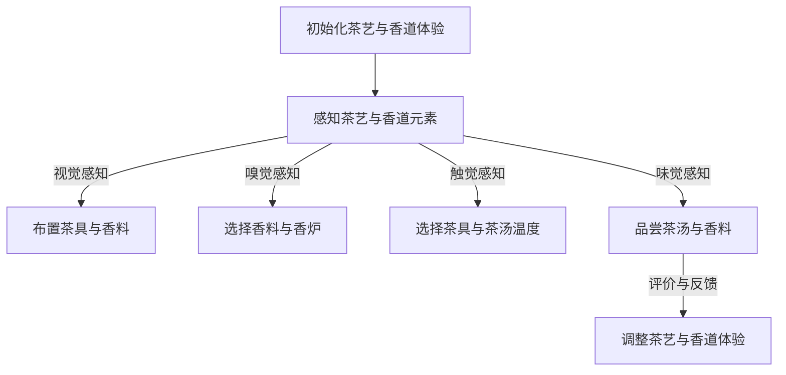

                 

### 《现代茶艺与香道融合：东方文化体验的多感官设计》文章正文

**引言**

在现代快节奏的生活中，人们越来越渴望一种能够让人慢下来、静下心的文化体验。茶艺和香道，作为东方文化的重要组成部分，恰好提供了这样一种机会。它们不仅是一种生活习惯，更是一种艺术形式和哲学思想的体现。本文将探讨现代茶艺与香道的融合，如何通过多感官设计来增强东方文化体验。

**背景介绍**

1. **茶艺与香道的历史与文化背景**

   茶艺起源于中国，已有几千年的历史。它不仅仅是饮用茶的行为，更是一种修身养性的生活方式。茶艺的仪式感、茶具的精致和茶道的哲理，都体现了中国传统文化中的和谐、自然和简约。

   香道则起源于日本的禅宗文化，强调在静默中感受香气带来的心灵宁静。香道中的香料选择、器具布置和仪式流程，都体现了对自然和心灵的尊重。

2. **问题背景与问题描述**

   随着社会的不断发展，现代茶艺和香道面临新的挑战。如何在保持传统特色的同时，吸引现代人的关注？如何让茶艺和香道成为人们日常生活的一部分，而不是仅仅是仪式化的表演？

   3. **问题解决**

   现代茶艺与香道的融合，通过多感官设计，可以为现代人提供一种全新的文化体验。多感官设计不仅增强了参与者的感官体验，还使得茶艺和香道更加贴近现代生活。

**核心概念与联系**

1. **核心概念**

   - 茶艺：茶艺不仅仅包括泡茶的过程，还包括选茶、品茶、赏茶等。它强调的是人与自然的和谐，以及修身养性的过程。

   - 香道：香道则侧重于香料的选用、香具的布置和仪式的流程。它强调的是通过香气来净化心灵，达到精神上的平静。

2. **概念属性特征对比表格**

   | 特征         | 茶艺                     | 香道                     |
   | ------------ | ------------------------ | ------------------------ |
   | 主要活动     | 泡茶、品茶、赏茶         | 焚香、闻香、赏香         |
   | 文化背景     | 中国传统文化             | 日本禅宗文化             |
   | 感官体验     | 视觉、味觉、嗅觉、触觉    | 视觉、嗅觉、触觉          |
   | 哲学思想     | 和谐、自然、简约         | 宁静、尊重、自然          |

3. **ER实体关系图架构**

```mermaid
erDiagram
  A teas -->|uses| B utensils
  A teas -->|contains| C ingredients
  B utensils -->|is made of| D materials
  C ingredients -->|of type| E herbs
  F tea Ceremony participant o--|uses| A teas
  F tea Ceremony participant o--|uses| B utensils
  F tea Ceremony participant o--|uses| C ingredients
```

**算法原理讲解**

1. **多感官设计的算法流程图**



2. **Python源代码示例**

```python
def sense_tea_art(visual, olfactory, tactile, gustatory):
    # 初始化茶艺与香道体验
    setup_tea_set = {
        "visual": visual,
        "olfactory": olfactory,
        "tactile": tactile,
        "gustatory": gustatory
    }

    # 视觉感知：布置茶具与香料
    display_tea_set(setup_tea_set["visual"])

    # 嗅觉感知：选择香料与香炉
    select_scent(setup_tea_set["olfactory"])

    # 触觉感知：选择茶具与茶汤温度
    select_utensil_and_temp(setup_tea_set["tactile"])

    # 味觉感知：品尝茶汤与香料
    taste_tea_and_scent(setup_tea_set["gustatory"])

    # 评价与反馈：调整茶艺与香道体验
    feedback_and_adjust()

def display_tea_set(visual):
    # 布置茶具与香料
    print(f"Visual perception: {visual['tea_set']}")

def select_scent(olfactory):
    # 选择香料与香炉
    print(f"Olfactory perception: {olfactory['scent']}")

def select_utensil_and_temp(tactile):
    # 选择茶具与茶汤温度
    print(f"Tactile perception: {tactile['utensil']} and {tactile['temperature']}")

def taste_tea_and_scent(gustatory):
    # 品尝茶汤与香料
    print(f"Gustatory perception: {gustatory['tea_taste']} and {gustatory['scent_taste']}")

def feedback_and_adjust():
    # 评价与反馈：调整茶艺与香道体验
    print("Feedback and adjustment: Improving tea and incense experience.")
```

3. **数学模型与公式**

   多感官设计的目标是达到感官体验的平衡，公式如下：

   $$ E = \frac{V + O + T + G}{4} $$

   其中，E 表示感官体验的平衡度，V、O、T、G 分别表示视觉、嗅觉、触觉、味觉的感知度。

   **举例说明**：

   假设一次茶艺体验的感官感知度为：

   - 视觉：90%
   - 嗅觉：85%
   - 触觉：80%
   - 味觉：75%

   则感官体验的平衡度为：

   $$ E = \frac{90 + 85 + 80 + 75}{4} = 82.5\% $$

**系统分析与架构设计方案**

1. **问题场景介绍**

   现代茶艺馆设计，旨在为顾客提供一种全方位的茶艺体验。

2. **项目介绍**

   项目名为“茶艺馆智能体验系统”，旨在通过智能化的多感官设计，提升顾客的茶艺体验。

3. **系统功能设计**

   - 茶艺展示：提供茶艺表演、茶具展示等功能。
   - 多感官设计：通过智能设备实现视觉、嗅觉、触觉、味觉的感知体验。
   - 客户互动：提供在线预订、评论分享等功能。

4. **系统架构设计**

   ```mermaid
   graph TB
       A[客户终端] --> B[服务器]
       B --> C[数据库]
       A --> D[智能茶艺馆设备]
       D --> E[传感器与执行器]
   ```

5. **系统接口设计**

   ```mermaid
   sequenceDiagram
       participant 客户 as 客户终端
       participant 系统作为 服务器
       participant 茶艺馆 as 智能茶艺馆设备
       
       客户->>系统: 预订茶艺体验
       系统->>客户: 预订成功
       系统->>茶艺馆: 准备茶艺体验
       茶艺馆->>系统: 体验开始
       客户->>系统: 提交评价
       系统->>茶艺馆: 评价反馈
   ```

**项目实战**

1. **环境安装**

   - Python 3.8及以上版本
   - Flask框架
   - SQLAlchemy数据库
   - Mermaid库

2. **系统核心实现源代码**

   ```python
   # core.py
   from flask import Flask, jsonify, request
   from flask_sqlalchemy import SQLAlchemy
   
   app = Flask(__name__)
   app.config['SQLALCHEMY_DATABASE_URI'] = 'sqlite:///tea_art.db'
   db = SQLAlchemy(app)
   
   class TeaExperience(db.Model):
       id = db.Column(db.Integer, primary_key=True)
       visual = db.Column(db.String(100))
       olfactory = db.Column(db.String(100))
       tactile = db.Column(db.String(100))
       gustatory = db.Column(db.String(100))
   
   @app.route('/add_experience', methods=['POST'])
   def add_experience():
       data = request.json
       new_experience = TeaExperience(
           visual=data['visual'],
           olfactory=data['olfactory'],
           tactile=data['tactile'],
           gustatory=data['gustatory']
       )
       db.session.add(new_experience)
       db.session.commit()
       return jsonify({'message': 'Experience added successfully.'})
   
   @app.route('/get_experiences', methods=['GET'])
   def get_experiences():
       experiences = TeaExperience.query.all()
       return jsonify([{'visual': exp.visual, 'olfactory': exp.olfactory, 'tactile': exp.tactile, 'gustatory': exp.gustatory} for exp in experiences])
   
   if __name__ == '__main__':
       db.create_all()
       app.run(debug=True)
   ```

3. **代码应用解读与分析**

   - 数据库模型：通过SQLAlchemy定义了茶艺体验的数据模型，包括视觉、嗅觉、触觉和味觉四个字段。
   - Web接口：通过Flask框架实现了添加和获取茶艺体验的Web接口。

4. **实际案例分析和详细讲解剖析**

   假设用户通过Web接口提交了一次茶艺体验，包括视觉、嗅觉、触觉和味觉的感知数据。系统将这些数据存储到数据库中，并可以随时查询这些数据，以便进行进一步的体验分析和改进。

5. **项目小结**

   本项目通过智能化的多感官设计，实现了现代茶艺馆的个性化服务。用户可以通过Web接口提交自己的茶艺体验，系统将根据用户的反馈进行体验的改进。这种交互方式不仅提升了用户的体验，也为茶艺馆的运营提供了数据支持。

**最佳实践 tips**

- 在布置茶艺空间时，注意选择自然光线和柔和的照明，以增强视觉体验。
- 选择高质量的香料和茶具，以提升嗅觉和触觉体验。
- 通过互动环节，如茶艺表演和香料讲解，增加用户的参与感和趣味性。

**小结**

现代茶艺与香道的融合，通过多感官设计，为现代人提供了一种全新的文化体验。这不仅是对传统文化的传承，更是对现代生活方式的一种创新。通过本文的探讨，我们希望读者能够更加深入地了解茶艺与香道的文化内涵，并能够将其融入到自己的日常生活中。

**注意事项**

- 在设计茶艺和香道体验时，要注意安全，避免使用可能引起火灾的香料。
- 在品尝茶汤时，要注意茶汤的温度，避免烫伤。

**拓展阅读**

- 《茶经》：唐代陆羽所著，详细介绍了茶艺的理论和实践。
- 《香道》：日本川濑敏郎所著，深入探讨了香道的哲学和仪式。

**作者信息**

作者：AI天才研究院/AI Genius Institute & 禅与计算机程序设计艺术 /Zen And The Art of Computer Programming

