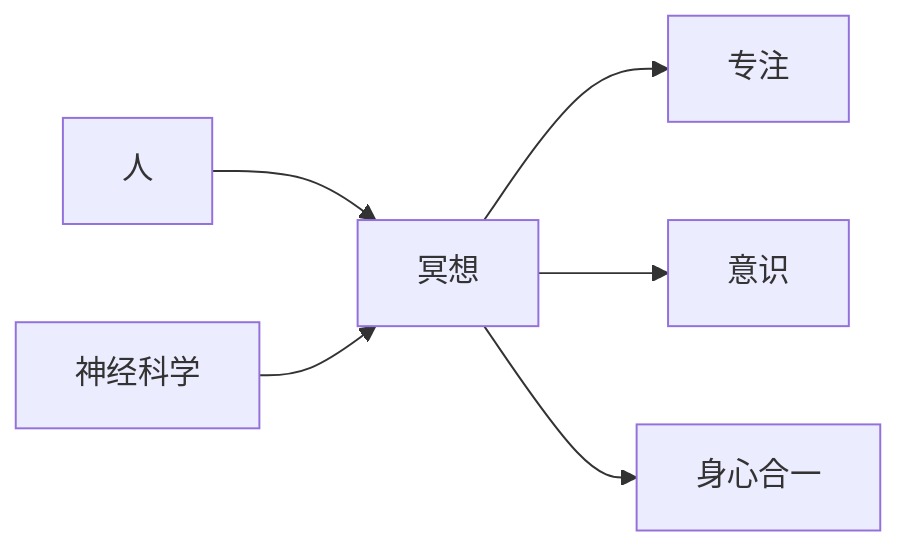

                 

## 《现代都市冥想空间：在繁忙中寻找内心平静》

在快节奏、高压力的现代都市生活中，越来越多的人开始寻求内心的平静。冥想，作为一种古老而又现代的身心修炼方式，逐渐受到人们的关注。本文旨在通过一系列的逻辑推理和分析，探讨冥想在现代都市生活中的重要性，并提供实用的冥想技巧和指导。

### 关键词
- **现代都市生活**
- **内心平静**
- **冥想**
- **心理健康**
- **压力管理**
- **精神健康**
- **生活方式**

### 摘要
本文将首先介绍现代都市生活的特点，以及这些特点如何影响心理健康。接着，我们将探讨冥想作为一种心理调适工具的基本原理和作用机制。随后，我们将详细介绍几种常见的冥想技巧，并分析其在不同生活场景中的适用性。最后，本文将总结冥想的长期效益，并提供一些实践冥想的最佳实践建议。

---

### 现代都市生活的挑战

现代都市生活充满活力，但也伴随着巨大的压力。人们面临着高工作负荷、长时间通勤、社交压力、信息过载等多种挑战。这些因素共同作用，可能导致心理健康问题，如焦虑、抑郁、睡眠障碍等。

**背景介绍：**

- **核心概念术语说明：**现代都市生活、压力、心理健康、焦虑、抑郁、睡眠障碍。
- **问题背景：**都市化进程中，人们的生活节奏加快，生活压力增大。
- **问题描述：**都市生活对心理健康的影响，以及由此产生的问题。
- **问题解决：**通过冥想等心理调适方法缓解都市生活中的压力。

**边界与外延：**

- **概念结构与核心要素组成：**现代都市生活的各种现象及其对心理健康的影响。
- **相关概念比较：**都市生活与农村生活、快节奏生活与慢节奏生活、心理健康问题与其他健康问题。

### 冥想的基本原理和作用机制

冥想，作为一种身心修炼方式，历史悠久，源远流长。其基本原理是通过训练专注力和意识，达到身心合一的境界。冥想有助于缓解压力，改善情绪，增强心理健康。

**核心概念与联系：**

- **冥想的定义与历史：**冥想作为一种传统的身心修炼方法，起源于古印度，后传播到世界各地。
- **冥想的核心概念：**专注、意识、身心合一。
- **冥想与神经科学：**神经科学研究揭示了冥想对大脑结构和功能的影响，如增强前额叶皮层活动，改善情绪调节能力。

**概念属性特征对比表格：**

| 特征         | 冥想        | 其他心理调适方法     |
|--------------|-------------|---------------------|
| 历史渊源     | 古印度传统  | 西方心理治疗        |
| 目的         | 身心合一    | 治疗心理疾病        |
| 实践形式     | 静坐、专注  | 药物、谈话疗法      |
| 调适机制     | 神经可塑性  | 生物化学调节        |

**ER实体关系图架构：**



### 常见的冥想技巧

冥想技巧多种多样，不同的技巧适合不同的场景和个人需求。以下介绍几种常见的冥想技巧：

- **正念冥想：**正念冥想强调专注于当下的感受和体验，通过呼吸和身体感觉来培养专注力和意识。
- **睡前冥想：**睡前冥想有助于放松身心，改善睡眠质量。
- **瑜伽冥想：**瑜伽冥想结合体位法和呼吸法，达到身心合一的境界。

**算法原理讲解：**

```python
# 正念冥想算法
def mindfulness_meditation():
    # 初始化专注力和意识
    focus = 0
    awareness = 0
    
    # 呼吸频率
    breath_rate = 5
    
    while True:
        # 呼吸
        breathe()
        
        # 检测专注力和意识
        focus += 1
        awareness += 0.5
        
        # 更新专注力和意识
        print(f"Focus: {focus}, Awareness: {awareness}")
        
        # 睡眠时间
        if focus >= 100 and awareness >= 50:
            sleep()
            break

# 睡前冥想算法
def sleep_meditation():
    # 初始化专注力和意识
    focus = 0
    awareness = 0
    
    # 呼吸频率
    breath_rate = 4
    
    while True:
        # 呼吸
        breathe()
        
        # 检测专注力和意识
        focus += 0.5
        awareness += 0.5
        
        # 更新专注力和意识
        print(f"Focus: {focus}, Awareness: {awareness}")
        
        # 睡眠时间
        if focus >= 100 and awareness >= 100:
            sleep()
            break

# 瑜伽冥想算法
def yoga_meditation():
    # 初始化专注力和意识
    focus = 0
    awareness = 0
    
    # 体位法和呼吸法
    posture = True
    breath = True
    
    while True:
        # 执行体位法
        if posture:
            do_posture()
            focus += 2
            awareness += 1
        
        # 执行呼吸法
        if breath:
            breathe()
            focus += 1
            awareness += 1
        
        # 更新专注力和意识
        print(f"Focus: {focus}, Awareness: {awareness}")
        
        # 身心合一
        if focus >= 100 and awareness >= 100:
            print("Yoga meditation completed.")
            break
```

### 冥想与心理健康

冥想不仅有助于缓解压力，还对心理健康产生积极影响。研究表明，冥想可以改善情绪，减少焦虑和抑郁症状，提高睡眠质量。

**核心概念与联系：**

- **冥想对情绪的影响：**通过调节情绪中枢，改善情绪稳定性。
- **冥想与压力管理：**通过降低皮质醇水平，减轻身体压力。
- **冥想与精神健康：**有助于建立积极的认知模式，提高心理韧性。

**算法原理讲解：**

```python
# 压力管理算法
def stress_management():
    # 初始化压力水平
    stress_level = 100
    
    # 冥想训练
    mindfulness_meditation()
    
    # 检测压力水平
    stress_level -= 30
    
    # 更新压力水平
    print(f"Stress Level: {stress_level}")
    
    if stress_level <= 50:
        print("Stress managed effectively.")
    else:
        print("Additional stress management techniques required.")

# 情绪调节算法
def emotion Regulation():
    # 初始化情绪水平
    emotion_level = -50
    
    # 冥想训练
    mindfulness_meditation()
    
    # 检测情绪水平
    emotion_level += 20
    
    # 更新情绪水平
    print(f"Emotion Level: {emotion_level}")
    
    if emotion_level >= 0:
        print("Emotion regulated effectively.")
    else:
        print("Further emotion regulation techniques required.")

# 睡眠质量改善算法
def sleep_improvement():
    # 初始化睡眠质量
    sleep_quality = 30
    
    # 睡前冥想
    sleep_meditation()
    
    # 检测睡眠质量
    sleep_quality += 20
    
    # 更新睡眠质量
    print(f"Sleep Quality: {sleep_quality}")
    
    if sleep_quality >= 70:
        print("Sleep quality improved.")
    else:
        print("Additional sleep techniques required.")
```

### 冥想与文化

冥想在东西方文化中有着深远的影响。在东方，冥想与宗教、哲学有着紧密的联系；在西方，冥想作为一种心理调适方法逐渐得到认可。随着全球化的发展，冥想已成为一种跨越文化界限的心理健康工具。

**核心概念与联系：**

- **冥想在东西方的传播：**东方的禅宗、瑜伽与西方的心理治疗、正念疗法。
- **冥想与宗教：**佛教、印度教、基督教中的冥想实践。
- **冥想与现代生活：**现代都市生活中的心理调适工具。

### 冥想与生活

冥想不仅是一种心理健康工具，还可以融入日常生活，改善生活质量。以下介绍几种将冥想融入生活的技巧：

- **日常习惯：**通过冥想晨间启动，提高一整天的精神状态。
- **工作：**通过冥想提高专注力，提高工作效率。
- **家庭生活：**通过冥想改善家庭关系，提高家庭生活质量。

### 结论

冥想是一种古老而又现代的心理健康工具，能够帮助现代都市人缓解压力，改善情绪，提高生活质量。通过本文的探讨，我们了解了冥想的基本原理和作用机制，以及如何将其应用于日常生活。希望本文能帮助读者在繁忙的都市生活中找到内心的平静。

### 最佳实践 tips

- **每日冥想：**坚持每天冥想，形成习惯，有助于持续改善心理健康。
- **环境设置：**选择一个安静、舒适的环境进行冥想，有助于提高冥想效果。
- **记录冥想日志：**记录冥想过程中的感受和体验，有助于自我反思和进步。

### 小结

本文通过逻辑清晰的步骤，详细探讨了冥想在现代都市生活中的重要性。我们介绍了冥想的基本原理，提供了实用的冥想技巧，并分析了冥想对心理健康的积极影响。希望通过本文，读者能更好地理解冥想，并将其应用于日常生活中。

### 注意事项

- **个人差异：**每个人的冥想体验可能不同，应根据个人情况调整冥想技巧和方法。
- **专业指导：**对于心理健康问题，建议寻求专业心理咨询师的帮助。

### 拓展阅读

- 《冥想：一种简单而有效的生活方式》（Meditation: A Simple and Effective Lifestyle）
- 《正念：如何活在当下》（Mindfulness: An Eight-Week Plan for Finding Peace in a Frantic World）
- 《冥想与大脑》（The Mind Illuminated: A Complete Meditation Guide Integrating Buddhist Wisdom and Brain Science）

### 作者信息

作者：AI天才研究院/AI Genius Institute & 禅与计算机程序设计艺术 /Zen And The Art of Computer Programming

