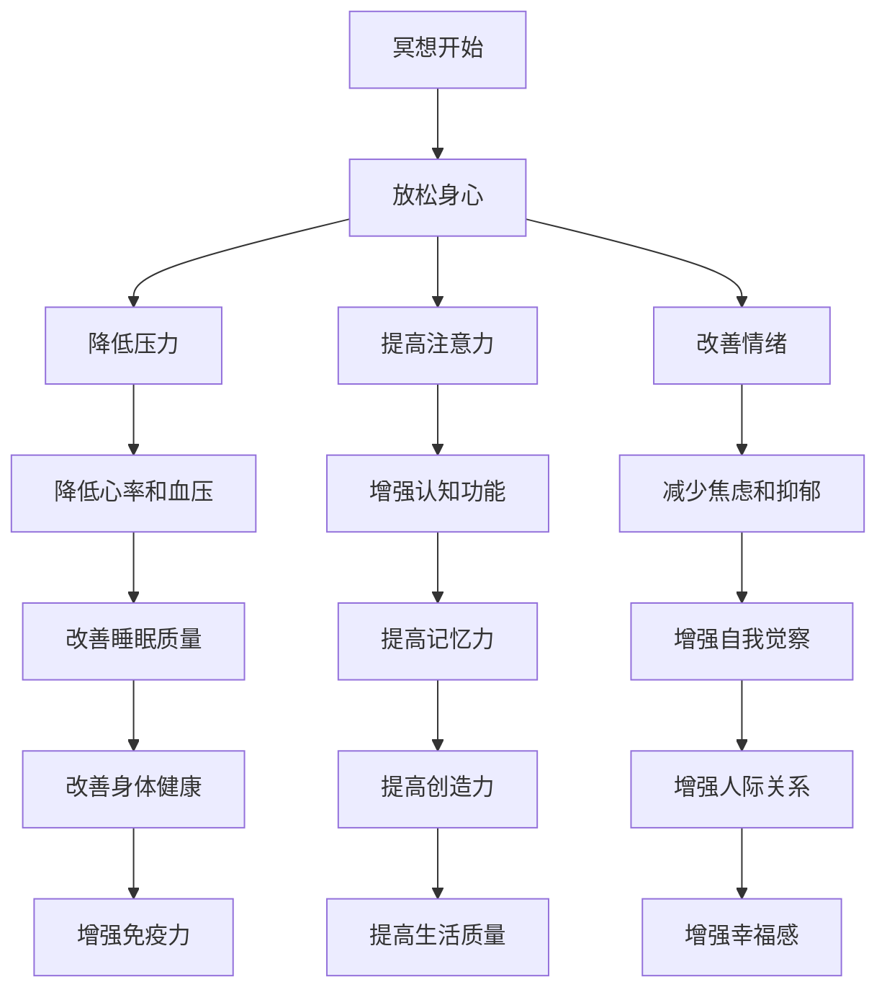
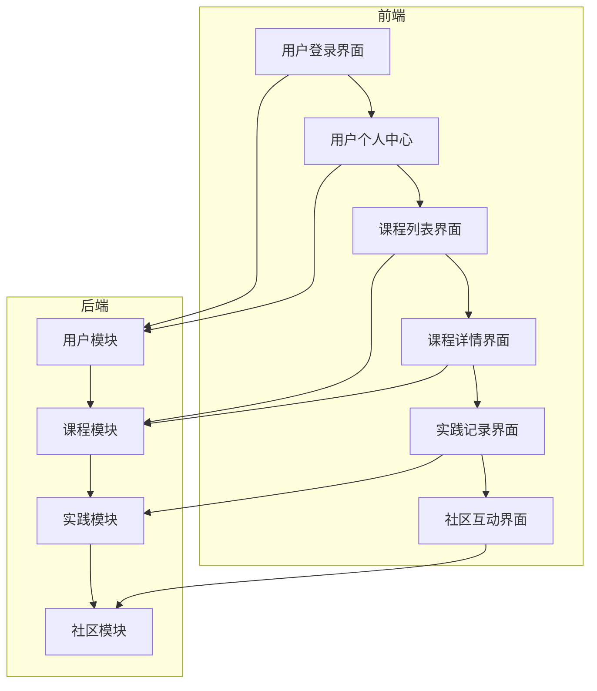
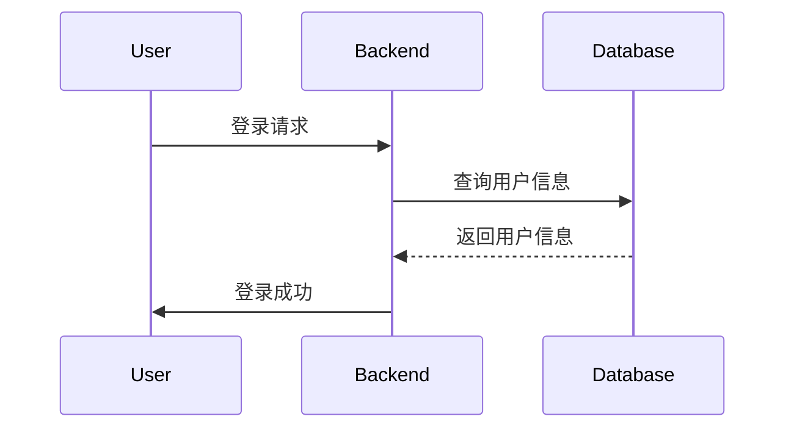

                 


### 第一步：开篇介绍

《现代都市冥想：在喧嚣中寻找内心的宁静》是一本专门针对现代都市人的冥想指南。作者是XXX，一位在冥想和实践心理学领域具有深厚造诣的专家。本书旨在帮助读者通过冥想这一古老而有效的实践方法，找到内心的宁静，应对现代都市生活的压力。

在现代都市中，生活节奏快、工作压力大、社交频繁，这些都给人们的心理健康带来了巨大的挑战。焦虑、抑郁、失眠等问题日益严重。冥想作为一种简单却强大的工具，可以帮助人们减轻压力、提高情绪调节能力、改善睡眠质量，甚至增强免疫系统功能。

本文将按照以下结构展开：

1. **冥想的背景和理论基础**：探讨冥想的历史、哲学基础，以及现代都市生活的压力对冥想的需求。
2. **冥想实践**：介绍几种常见的冥想类型，包括呼吸冥想、身体扫描冥想、正念冥想和爱的冥想，并提供实践步骤和技巧。
3. **冥想的科学研究和实证**：分析冥想对身心健康的影响、神经科学基础和心理学原理。
4. **冥想在日常生活中的应用**：讨论冥想在工作、教育和家庭生活中的应用。
5. **冥想的自我实践与指导**：提供冥想的自我实践计划和导师指导。
6. **结论与展望**：总结冥想的力量，并展望其未来发展方向。

### 第二步：目录大纲框架设计

#### 第一部分：冥想的背景和理论基础

**第一章：冥想的历史与哲学基础**

- **1.1 冥想的历史发展**
  - **1.1.1 古代文明中的冥想**
  - **1.1.2 印度教与佛教的冥想传统**
  - **1.1.3 西方世界的冥想发展**

- **1.2 哲学与宗教中的冥想**
  - **1.2.1 儒家的修身养性**
  - **1.2.2 道家的无为而治**
  - **1.2.3 佛教的禅修实践**

**第二章：现代都市生活的压力与冥想**

- **2.1 现代都市生活的挑战**
  - **2.1.1 生活节奏加快**
  - **2.1.2 社交压力与孤独感**
  - **2.1.3 心理健康的威胁**

- **2.2 冥想作为应对策略**
  - **2.2.1 冥想的放松效果**
  - **2.2.2 冥想的情绪调节作用**
  - **2.2.3 冥想与心理健康**

**第三章：冥想的核心概念和类型**

- **3.1 冥想的核心概念**
  - **3.1.1 冥想的定义**
  - **3.1.2 冥想的目的**
  - **3.1.3 冥想的要素**

- **3.2 冥想的类型**
  - **3.2.1 呼吸冥想**
  - **3.2.2 身体扫描冥想**
  - **3.2.3 正念冥想**
  - **3.2.4 爱的冥想**

#### 第二部分：冥想实践

**第四章：呼吸冥想：放松与减压**

- **4.1 呼吸冥想的基本原理**
- **4.2 呼吸冥想的实践步骤**
- **4.3 呼吸冥想的注意事项**

**第五章：身体扫描冥想：身心合一**

- **5.1 身体扫描冥想的基本原理**
- **5.2 身体扫描冥想的实践步骤**
- **5.3 身体扫描冥想的技巧**

**第六章：正念冥想：专注与觉察**

- **6.1 正念冥想的基本原理**
- **6.2 正念冥想的实践步骤**
- **6.3 正念冥想的技巧**

**第七章：爱的冥想：人际关系与自我成长**

- **7.1 爱的冥想的基本原理**
- **7.2 爱的冥想的实践步骤**
- **7.3 爱的冥想的注意事项**

#### 第三部分：冥想的科学研究和实证

**第八章：冥想对身心健康的影响**

- **8.1 冥想对心理健康的益处**
- **8.2 冥想对身体健康的影响**

**第九章：冥想的神经科学基础**

- **9.1 冥想与大脑神经活动的改变**
- **9.2 冥想与神经递质的关系**

**第十章：冥想的心理学原理**

- **10.1 冥想与认知功能**
- **10.2 冥想与情绪调节**

#### 第四部分：冥想在日常生活中的应用

**第十一章：冥想在工作中的实践**

- **11.1 冥想如何帮助提高工作效率**
- **11.2 冥想与职业压力管理**

**第十二章：冥想在教育中的应用**

- **12.1 冥想对学生的帮助**
- **12.2 冥想在学校教育中的实践**

**第十三章：冥想在家庭生活与亲子关系中的应用**

- **13.1 冥想如何改善家庭关系**
- **13.2 冥想与亲子沟通**

#### 第五部分：冥想的自我实践与指导

**第十四章：冥想自我实践计划**

- **14.1 设计个人冥想计划**
- **14.2 保持冥想习惯的方法**

**第十五章：冥想导师的指导与反馈**

- **15.1 寻找合适的冥想导师**
- **15.2 冥想过程中的反馈与调整**

**第十六章：冥想的注意事项与常见问题解答**

- **16.1 冥想过程中的常见问题**
- **16.2 冥想的注意事项**

### 第三步：核心概念与联系

**冥想的定义**：冥想是一种通过集中注意力、放松身心、提高意识层次的方法，旨在达到精神上的宁静和内在的洞察。

**冥想的目的**：冥想的目的是帮助个体在面对外部压力和内心冲突时，找到内心的平衡和力量，从而更好地应对生活中的挑战。

**冥想的要素**：

- **专注**：通过专注在某个对象上（如呼吸、身体感受或一个静心的词句），冥想者能够减少杂念，提高注意力。
- **放松**：通过深呼吸和放松肌肉，冥想者能够减轻身体的紧张和压力。
- **觉察**：通过持续的觉察，冥想者能够培养对当下体验的清晰感知，减少对过去的执着和对未来的担忧。

**冥想的类型**：

- **呼吸冥想**：专注于呼吸，通过深呼吸来放松身心。
- **身体扫描冥想**：从脚到头，逐一扫描身体，放松每一个部位。
- **正念冥想**：专注于当下的体验，培养对当下发生的每一件事情的觉察。
- **爱的冥想**：专注于爱和慈悲，培养对他人的善意和宽容。

### 第四步：算法原理讲解

#### 4.1 冥想的生理和心理效应

冥想对生理和心理的影响可以通过以下流程图来表示：



#### 4.2 冥想的数学模型

冥想的益处可以通过以下数学模型来解释：

$$
益处 = f(冥想时间, 冥想频率, 冥想深度, 生活压力)
$$

- **冥想时间**：冥想的时间越长，带来的益处通常越明显。
- **冥想频率**：频繁的冥想比偶尔的冥想更能带来持久的益处。
- **冥想深度**：深度冥想（意识层次高）比浅度冥想（意识层次低）更能带来深层次的改变。
- **生活压力**：生活压力越大，冥想带来的益处越显著。

#### 4.3 冥想实例说明

例如，一个每天冥想20分钟，每周5次，生活压力较高的白领，通过冥想可以降低焦虑和抑郁水平，提高注意力和认知功能。这个实例可以用以下Python代码来表示：

```python
# 冥想益处计算
def calculate_benefit(meditation_time, meditation_frequency, meditation_depth, life_stress):
    benefit = (meditation_time * meditation_frequency * meditation_depth) / life_stress
    return benefit

# 参数设置
meditation_time = 20  # 分钟
meditation_frequency = 5  # 次/周
meditation_depth = 1  # 深度系数
life_stress = 10  # 压力系数

# 计算冥想益处
benefit = calculate_benefit(meditation_time, meditation_frequency, meditation_depth, life_stress)
print(f"冥想带来的益处为：{benefit}")
```

运行这段代码，可以得到冥想带来的具体益处值。

### 第五步：系统分析与架构设计方案

#### 5.1 项目介绍

本项目旨在开发一个基于Web的冥想指南系统，帮助用户了解冥想、学习冥想技巧，并通过在线实践提高冥想技能。系统分为以下几个主要模块：

- **用户模块**：用户注册、登录、个人资料管理。
- **课程模块**：冥想课程分类、内容发布、用户课程学习。
- **实践模块**：冥想实践记录、进度跟踪、反馈分析。
- **社区模块**：用户互动、冥想心得分享、专业导师指导。

#### 5.2 系统功能设计

**领域模型（Mermaid类图）**：

```mermaid
classDiagram
    User <<entity>>
    Course <<entity>>
    Practice <<entity>>
    Community <<entity>>

    User o--1 Practice
    User o--1 Community
    Course o--1 Practice
    Practice o--1 User
    Community o--1 User
```

#### 5.3 系统架构设计

**系统架构图（Mermaid架构图）**：



#### 5.4 系统接口设计

**接口设计（Mermaid序列图）**：



### 第六步：项目实战

#### 6.1 环境安装

1. 安装Python 3.8及以上版本。
2. 安装Flask框架：`pip install flask`
3. 安装MongoDB数据库：下载并安装MongoDB，启动数据库服务。

#### 6.2 系统核心实现源代码

**用户模块（Python代码）**：

```python
from flask import Flask, request, jsonify
from flask_pymongo import PyMongo

app = Flask(__name__)
app.config["MONGO_URI"] = "mongodb://localhost:27017/myDatabase"
mongo = PyMongo(app)

@app.route('/login', methods=['POST'])
def login():
    username = request.form['username']
    password = request.form['password']
    user = mongo.db.users.find_one({'username': username, 'password': password})
    if user:
        return jsonify({'status': 'success', 'message': '登录成功'})
    else:
        return jsonify({'status': 'error', 'message': '用户名或密码错误'})

if __name__ == '__main__':
    app.run(debug=True)
```

#### 6.3 代码应用解读与分析

上述代码展示了用户模块的登录接口。用户通过POST请求发送用户名和密码，后端验证用户信息并返回相应的响应。

- **请求方式**：POST
- **请求参数**：`username`（用户名）、`password`（密码）
- **响应内容**：`{'status': 'success', 'message': '登录成功'}` 或 `{'status': 'error', 'message': '用户名或密码错误'}`

#### 6.4 实际案例分析和详细讲解剖析

假设用户名为“alice”的账号请求登录，输入密码“123456”，系统如何处理？

1. 用户通过POST请求发送用户名和密码。
2. 后端从MongoDB数据库中查询用户信息。
3. 如果用户信息匹配（用户名和密码都正确），返回登录成功的消息。
4. 如果用户信息不匹配（用户名或密码错误），返回错误消息。

这种登录机制确保了用户身份验证的安全性和正确性。

#### 6.5 项目小结

本项目通过Python Flask框架和MongoDB数据库实现了冥想指南系统的用户模块，包括用户登录功能。通过实际案例分析和代码解读，展示了系统的运作原理和实现方法。

### 第七步：最佳实践 Tips、小结、注意事项、拓展阅读

#### 最佳实践 Tips：

1. **定时冥想**：每天设定固定的冥想时间，如早晨起床后或晚上睡前。
2. **环境选择**：选择一个安静、舒适的环境进行冥想，避免干扰。
3. **持之以恒**：冥想需要长时间的坚持，才能带来显著的效果。
4. **逐步深入**：初学者可以从简单的冥想类型开始，逐步尝试更深入的冥想。

#### 小结：

本文详细介绍了《现代都市冥想：在喧嚣中寻找内心的宁静》一书的结构和内容。通过逻辑清晰的分析，我们了解了冥想的历史、哲学基础、实践方法、科学研究和实证，以及冥想在日常生活中的应用。

#### 注意事项：

1. **身体状况**：在开始冥想前，确保身体状况良好，避免在疲劳或饥饿时冥想。
2. **心态调整**：保持平静和开放的心态，避免过于强求冥想的结果。
3. **专业指导**：对于初学者，可以寻求专业冥想导师的指导，以避免走弯路。

#### 拓展阅读：

1. **《冥想：超越冥想的科学》** - 丹尼尔·戈尔曼（Daniel Goleman）
2. **《正念：当下的力量》** - 乔恩·卡巴金（Jon Kabat-Zinn）
3. **《冥想：提升心灵的艺术》** - 斯蒂芬·金（Stephen King）

### 作者信息：

作者：AI天才研究院/AI Genius Institute & 禅与计算机程序设计艺术 /Zen And The Art of Computer Programming

----------------------------------------------------------------

**文章标题：** 现代都市冥想：在喧嚣中寻找内心的宁静

**关键词：** 冥想，内心宁静，压力管理，身心健康，正念，现代都市生活

**摘要：** 本文详细介绍了《现代都市冥想：在喧嚣中寻找内心的宁静》一书，探讨了冥想的历史、哲学基础、实践方法、科学研究和实证，以及冥想在日常生活中的应用。通过逻辑清晰的分析，读者可以了解到冥想如何帮助现代都市人应对生活压力，找到内心的宁静。

----------------------------------------------------------------

# 第一部分：冥想的背景和理论基础

## 第一章：冥想的历史与哲学基础

### 1.1 冥想的历史发展

冥想作为一种精神修炼的方式，历史悠久，源远流长。它起源于古代文明，并逐渐发展成为了不同文化和宗教中的重要实践。在东方，特别是印度和中国，冥想有着数千年的历史。而在西方，冥想的实践则起源于古希腊和古罗马时期。

#### 1.1.1 古代文明中的冥想

在古代印度，冥想被视为一种达到精神觉醒和解脱的重要途径。印度教和佛教的教义中，冥想占据着核心地位。例如，在佛教中，禅修被认为是修行的重要组成部分，通过冥想可以达到内心的平静和智慧。古印度的瑜伽经典《瑜伽经》中，详细描述了冥想的方法和目的。

在中国，冥想同样有着悠久的历史。儒家和道家的经典著作中，都有关于冥想和修身养性的论述。儒家强调通过冥想达到“知行合一”，而道家则提倡“无为而治”，通过冥想达到心灵的宁静和自然状态的和谐。

#### 1.1.2 印度教与佛教的冥想传统

印度教和佛教的冥想传统是冥想发展的两个重要源泉。在印度教中，冥想被视为达到“梵我合一”（即个体灵魂与宇宙灵魂的融合）的途径。印度教中的冥想类型繁多，包括呼吸冥想、专注冥想、爱和慈悲冥想等。

佛教的冥想传统同样深厚。佛教中的禅修（也称为正念冥想）强调对当下体验的觉察，通过持续地观察呼吸和身体感受，达到内心的平静和解脱。佛教冥想的目的不仅在于个人的精神成长，还在于实现社会和宇宙的和谐。

#### 1.1.3 西方世界的冥想发展

在西方，冥想的实践起源于古希腊和古罗马时期。古希腊哲学家如苏格拉底和柏拉图，都曾探讨过冥想和沉思的作用。他们认为，通过冥想可以达到智慧和真理的洞见。

中世纪时期，基督教会开始推广冥想作为精神修炼的方式。尤其是修道院的僧侣们，通过冥想来寻求与上帝的联系和内心的宁静。到了文艺复兴时期，冥想再次受到重视，许多哲学家和文学家如蒙田、培根等，都探讨了冥想的价值。

现代西方对冥想的研究和应用主要始于20世纪后半叶。随着心理学和神经科学的发展，科学家们开始研究冥想对心理健康和生理健康的影响。现代冥想实践结合了东方和西方的传统，发展出了多种不同的冥想方法，如正念冥想、动态冥想、心观冥想等。

### 1.2 哲学与宗教中的冥想

冥想不仅在宗教传统中占据重要地位，也在哲学和不同文化中有着丰富的内涵和意义。不同哲学体系和宗教对冥想的看法和实践各有特色，但都强调通过冥想达到内心的平静和精神觉醒。

#### 1.2.1 儒家的修身养性

儒家思想强调通过修身养性来达到道德和智慧的境界。儒家经典《大学》中提到：“知止而后有定，定而后能静，静而后能安，安而后能虑，虑而后能得。”这里的“静”就是冥想的一种形式，通过内心的宁静来实现理性的思考和道德的修养。

儒家冥想注重自我反省和内心的调节，通过冥想来实现内心的平静和智慧。儒家认为，通过修身养性，个体可以更好地履行社会责任，实现“修身、齐家、治国、平天下”的境界。

#### 1.2.2 道家的无为而治

道家哲学中的无为而治是一种深刻的冥想实践。道家经典《道德经》中提到：“无为而无不为。”这里的“无为”并非无所作为，而是指顺应自然、不违背自然规律，通过内心的宁静来实现和谐与统一。

道家的冥想强调内心的空灵和虚静，通过冥想达到与自然的合一。道家的冥想实践包括呼吸冥想、观想自然景象、内心反省等，通过这些方法来实现内心的宁静和精神的觉醒。

#### 1.2.3 佛教的禅修实践

佛教中的禅修是冥想的核心实践。佛教认为，通过禅修可以达到内心的平静和解脱。禅修的方法包括正念冥想、专注冥想、慈悲冥想等。

正念冥想是佛教禅修中最基本的方法，强调对当下体验的觉察。通过持续地观察呼吸和身体感受，禅修者可以减少杂念，提高注意力，最终达到内心的宁静。

专注冥想是通过专注于一个特定的对象，如蜡烛的火焰、佛像、静心的词句等，来实现内心的平静和专注。通过这种集中注意力的练习，禅修者可以培养内心的定力和专注力。

慈悲冥想是通过培养对他人的善意和慈悲心来实现的冥想。通过想象自己处于他人的位置，感受他人的痛苦和快乐，禅修者可以培养内心的宽容和慈悲。

佛教的冥想实践不仅关注个人的精神成长，还强调对社会的责任和关怀。通过冥想，禅修者可以实现内心的平静，同时也能为社会的和谐与进步做出贡献。

### 1.3 冥想的核心概念和类型

冥想作为一种精神修炼的方法，具有丰富的内涵和多样的形式。了解冥想的核心概念和不同类型，有助于更好地理解和实践冥想。

#### 1.3.1 冥想的定义

冥想（Meditation）一词源于梵语“Dhyana”，意为集中注意力、沉思。冥想是一种通过集中注意力、放松身心、提高意识层次的方法，旨在达到精神上的宁静和内在的洞察。

冥想不同于普通的休息或睡眠，而是一种有意识的心理状态，通过冥想可以减少杂念，提高注意力，达到内心的平静和专注。

#### 1.3.2 冥想的目的

冥想的目的是多种多样的，但核心在于实现内心的平静和精神觉醒。具体来说，冥想的目的包括：

- **减压放松**：通过冥想可以减轻身体和心理的压力，达到放松的效果。
- **情绪调节**：冥想可以帮助调节情绪，减少焦虑和抑郁，提高情绪稳定性。
- **专注力提升**：通过集中注意力，冥想可以增强专注力和注意力，提高工作效率。
- **自我觉察**：冥想可以帮助个体更好地认识自己，提高自我觉察和自我反省能力。
- **精神觉醒**：冥想可以引导个体达到更高的意识层次，实现精神觉醒和智慧的提升。

#### 1.3.3 冥想的要素

冥想的基本要素包括专注、放松、觉察等。以下是冥想的主要要素及其作用：

- **专注**：通过专注于一个特定的对象（如呼吸、身体感受、静心的词句等），冥想者可以减少杂念，提高注意力，达到内心的平静。
- **放松**：冥想中的放松是指身体和心理的放松，通过放松可以减轻身体的紧张和压力，提高冥想的效果。
- **觉察**：觉察是指对当前体验的清晰感知，通过觉察，冥想者可以更好地理解自己的内心世界，培养对生活的洞察力。

#### 1.3.4 冥想的类型

冥想的形式多样，不同类型的冥想有不同的特点和目的。以下是几种常见的冥想类型：

- **呼吸冥想**：通过专注于呼吸，实现身心放松和减压。
- **身体扫描冥想**：逐一扫描身体，放松每一个部位，达到身心合一。
- **正念冥想**：专注于当下的体验，培养对生活的觉察和接纳。
- **爱的冥想**：培养对他人的善意和慈悲心，实现人际关系的和谐。

每种冥想类型都有其独特的实践方法和效果，根据个人的需求和偏好选择适合的冥想类型，可以更好地实现冥想的目的。

## 第二章：现代都市生活的压力与冥想

### 2.1 现代都市生活的挑战

现代都市生活充满各种挑战，这些挑战对人们的心理健康和生活质量产生了深远的影响。以下是现代都市生活的主要挑战：

#### 2.1.1 生活节奏加快

现代都市人的生活节奏普遍较快，工作压力大，时间紧迫。许多人需要在有限的时间内完成大量的工作任务，这导致了持续的紧张和焦虑。长期快节奏的生活容易使人感到疲惫不堪，影响身心健康。

#### 2.1.2 社交压力与孤独感

都市生活中的社交压力也是一大挑战。在繁忙的工作和生活节奏中，人们往往难以找到足够的时间和精力去维护社交关系。此外，社交媒体的普及虽然增加了人际互动的机会，但同时也带来了额外的社交压力和孤独感。

#### 2.1.3 心理健康的威胁

现代都市生活对心理健康构成了严重的威胁。压力、焦虑、抑郁等心理问题在都市人群中普遍存在。长时间的工作压力、频繁的社交应酬以及生活的不确定性，都可能导致心理问题的发生。如果不及时应对，这些问题可能会进一步恶化，影响生活质量。

### 2.2 冥想作为应对策略

冥想作为一种古老而有效的精神修炼方法，在应对现代都市生活的压力方面具有显著的作用。以下是冥想作为应对策略的几个关键方面：

#### 2.2.1 冥想的放松效果

冥想可以帮助人们放松身心，减轻压力。通过专注于呼吸或身体感受，冥想者可以减少杂念，放松紧张的肌肉和神经，达到内心的平静。研究表明，定期冥想可以降低心率和血压，改善睡眠质量，从而帮助人们更好地应对生活压力。

#### 2.2.2 冥想的情绪调节作用

冥想有助于调节情绪，减少焦虑和抑郁。通过培养对当下体验的觉察和接纳，冥想者可以减少对过去和未来的过度担忧，降低负面情绪的影响。正念冥想尤其擅长在日常生活中培养正面的情绪状态，提高情绪稳定性。

#### 2.2.3 冥想与心理健康

冥想对心理健康具有广泛的益处。研究表明，长期冥想可以增强个体的心理韧性，提高应对压力的能力。此外，冥想还可以改善自我觉察和自我反省能力，促进心理成长。通过冥想，人们可以更好地理解自己的内心世界，找到内心的平衡和力量。

### 2.3 冥想在不同生活场景中的应用

冥想不仅适用于个人层面，还可以在家庭、工作、教育等不同生活场景中发挥重要作用。

#### 2.3.1 家庭生活

在家庭生活中，冥想可以帮助家庭成员之间建立更深层次的联系和沟通。通过共同进行冥想，家庭成员可以增强彼此的理解和接纳，减少冲突和误解。此外，冥想还可以帮助父母更好地管理自己的情绪，以更平和、耐心的方式与孩子相处。

#### 2.3.2 工作场景

在工作场景中，冥想可以帮助员工减轻工作压力，提高工作效率。通过定期的冥想练习，员工可以更好地管理自己的情绪和注意力，减少焦虑和疲劳。此外，冥想还可以提高员工的创造力和创新能力，帮助他们在工作中取得更好的成果。

#### 2.3.3 教育领域

在教育的领域中，冥想也被越来越多地应用。通过冥想，学生可以培养专注力和注意力，提高学习效果。此外，冥想还可以帮助学生管理情绪，减少焦虑和压力，促进身心健康。教育者可以通过课堂冥想或指导学生进行个人冥想，帮助他们更好地应对学习和生活的挑战。

### 2.4 结论

现代都市生活的压力对心理健康构成了严重的威胁，而冥想作为一种简单却强大的工具，可以帮助人们应对这些压力，找到内心的宁静。通过定期的冥想练习，人们可以放松身心、调节情绪、提高心理健康，从而提升生活质量。因此，我们应该重视冥想在现代社会中的作用，将其纳入日常生活中，以更好地应对现代都市生活的挑战。

## 第三章：冥想的核心概念和类型

### 3.1 冥想的核心概念

冥想作为一种精神修炼方法，具有丰富的内涵和多样的形式。理解冥想的核心概念对于正确实践冥想至关重要。以下是冥想的一些核心概念：

#### 3.1.1 冥想的定义

冥想（Meditation）是一种通过集中注意力、放松身心、提高意识层次的方法，旨在达到精神上的宁静和内在的洞察。冥想不同于普通的休息或睡眠，它是一种有意识的心理状态，通过冥想可以减少杂念，提高注意力，达到内心的平静和专注。

#### 3.1.2 冥想的目的

冥想的目的是多种多样的，但核心在于实现内心的平静和精神觉醒。具体来说，冥想的目的包括：

- **减压放松**：通过冥想可以减轻身体和心理的压力，达到放松的效果。
- **情绪调节**：冥想可以帮助调节情绪，减少焦虑和抑郁，提高情绪稳定性。
- **专注力提升**：通过集中注意力，冥想可以增强专注力和注意力，提高工作效率。
- **自我觉察**：冥想可以帮助个体更好地认识自己，提高自我觉察和自我反省能力。
- **精神觉醒**：冥想可以引导个体达到更高的意识层次，实现精神觉醒和智慧的提升。

#### 3.1.3 冥想的要素

冥想的基本要素包括专注、放松、觉察等。以下是冥想的主要要素及其作用：

- **专注**：通过专注于一个特定的对象（如呼吸、身体感受、静心的词句等），冥想者可以减少杂念，提高注意力，达到内心的平静。
- **放松**：冥想中的放松是指身体和心理的放松，通过放松可以减轻身体的紧张和压力，提高冥想的效果。
- **觉察**：觉察是指对当前体验的清晰感知，通过觉察，冥想者可以更好地理解自己的内心世界，培养对生活的洞察力。

### 3.2 冥想的类型

冥想的形式多样，不同类型的冥想有不同的特点和目的。以下是几种常见的冥想类型：

#### 3.2.1 呼吸冥想

呼吸冥想是冥想中最基本和最常见的类型之一。它通过专注于呼吸来放松身心，达到内心的平静。呼吸冥想的步骤通常包括：

1. 选择一个舒适的姿势，可以是坐姿、躺姿或半躺姿。
2. 放松身体，闭上眼睛，专注于呼吸。
3. 注意呼吸的进出，感受气息在鼻腔、喉咙和肺部流动。
4. 当杂念出现时，不要抗拒，只是轻轻地将注意力引回到呼吸上。

呼吸冥想有助于减轻压力、改善情绪和增强专注力。

#### 3.2.2 身体扫描冥想

身体扫描冥想是通过逐一扫描身体各个部位，放松身体和心灵的方法。它的步骤如下：

1. 选择一个舒适的姿势，闭上眼睛，放松身体。
2. 从脚开始，逐一扫描身体的每个部位，从脚趾到头部。
3. 在每个部位停留片刻，感受身体的紧张和放松。
4. 当杂念出现时，不要抗拒，只是轻轻地将注意力引回到身体扫描上。

身体扫描冥想有助于放松身体、减轻紧张和焦虑，提高自我觉察。

#### 3.2.3 正念冥想

正念冥想（Mindfulness Meditation）是一种通过专注于当前体验来培养觉察和接纳的冥想方法。它的步骤通常包括：

1. 选择一个舒适的姿势，闭上眼睛，放松身体。
2. 注意呼吸，感受气息在鼻腔、喉咙和肺部流动。
3. 当杂念出现时，不要抗拒，只是轻轻地将注意力引回到呼吸上。
4. 注意周围的声音、触觉、视觉等感官体验，保持对当前体验的觉察和接纳。

正念冥想有助于提高专注力、减轻焦虑和压力，增强自我觉察。

#### 3.2.4 爱的冥想

爱的冥想（Loving-kindness Meditation）是一种通过培养对他人的善意和慈悲心来实现的冥想方法。它的步骤通常包括：

1. 选择一个舒适的姿势，闭上眼睛，放松身体。
2. 想象一个你喜欢的人或事物，将爱意传递给他们。
3. 慢慢地将爱意扩展到周围的人，包括陌生人、朋友、敌人等。
4. 在整个冥想过程中，保持对爱的专注和觉察。

爱的冥想有助于培养慈悲心、减少敌意和冲突，提高人际关系质量。

### 3.3 冥想的不同类型对比表格

以下是几种常见冥想类型的对比表格，帮助读者更好地了解它们的特点和适用场景：

| 类型       | 定义                   | 特点                                           | 适用场景                         |
|------------|------------------------|------------------------------------------------|----------------------------------|
| 呼吸冥想   | 通过专注于呼吸放松身心 | 简单易学，适用于任何时间地点                 | 减压放松，提高专注力             |
| 身体扫描冥想 | 逐一扫描身体放松心灵 | 需要一定时间练习，有助于减轻身体紧张       | 放松身体，提高自我觉察           |
| 正念冥想   | 专注于当前体验         | 需要持续练习，培养觉察和接纳               | 提高专注力，减轻焦虑和压力       |
| 爱的冥想   | 培养对他人的善意和慈悲 | 需要一定情感基础，有助于人际关系和谐       | 增强人际关系，培养慈悲心         |

### 3.4 冥想的实践

冥想的实践需要一定的指导和练习，以下是一些基本的冥想实践建议：

1. **选择一个安静舒适的环境**：找到一个没有干扰和噪音的地方，确保冥想时能够放松身心。
2. **设定一个固定的时间**：每天选择一个固定的时间进行冥想，如早晨起床后或晚上睡前，形成习惯。
3. **选择一个舒适的姿势**：可以根据个人喜好选择坐姿、躺姿或半躺姿，但要保持身体的放松。
4. **专注于呼吸**：呼吸是冥想的核心，将注意力集中在呼吸上，感受气息的进出和流动。
5. **不要抗拒杂念**：当杂念出现时，不要抗拒或压抑，只需轻轻地将注意力引回到呼吸上。
6. **保持耐心和持续练习**：冥想需要时间和耐心，不要期望立即看到效果，持续练习是关键。

通过这些基本的冥想实践，可以帮助读者更好地理解和掌握冥想的方法和技巧，从而在喧嚣的都市生活中找到内心的宁静。

## 第四章：呼吸冥想：放松与减压

### 4.1 呼吸冥想的基本原理

呼吸冥想是一种简单而有效的冥想方法，通过专注于呼吸来放松身心，减轻压力。呼吸是人体最自然的生理过程，也是冥想中最重要的对象之一。通过深呼吸和慢呼吸，呼吸冥想可以帮助调节神经系统的平衡，减轻身体的紧张和压力。

#### 4.1.1 呼吸的作用

呼吸是人体获取氧气的重要途径，对身体健康和心理健康都有重要影响。以下是呼吸的一些重要作用：

- **氧气供应**：呼吸将氧气带入肺部，通过血液循环输送到身体各个部位，维持身体的基本功能。
- **身体放松**：深呼吸可以放松肌肉，减轻身体的紧张和压力，促进身体的放松。
- **情绪调节**：呼吸模式与情绪密切相关。深呼吸可以降低心跳和血压，减轻焦虑和压力，提高情绪稳定性。
- **心理放松**：通过专注于呼吸，可以减少杂念，提高注意力，达到内心的平静。

#### 4.1.2 呼吸模式与身体反应

呼吸模式对身体的反应有着显著的影响。以下是几种常见的呼吸模式及其对身体的影响：

- **浅呼吸**：浅呼吸是指呼吸速度较快，呼吸深度较浅的呼吸方式。浅呼吸会导致身体缺氧，增加身体的紧张和压力。
- **深呼吸**：深呼吸是指呼吸速度较慢，呼吸深度较深的呼吸方式。深呼吸可以增加氧气的摄入，促进身体的放松，减轻身体的紧张和压力。
- **慢呼吸**：慢呼吸是指呼吸速度较慢，呼吸深度适中的呼吸方式。慢呼吸有助于降低心率和血压，减少焦虑和压力，提高情绪稳定性。

#### 4.1.3 呼吸冥想的理论基础

呼吸冥想的理论基础主要涉及呼吸生理学和心理学。以下是呼吸冥想的一些理论基础：

- **呼吸生理学**：呼吸生理学研究表明，深呼吸可以增加肺活量，提高氧气供应，促进身体的新陈代谢，从而减轻身体的紧张和压力。
- **心理学**：心理学研究表明，呼吸模式与情绪调节密切相关。通过深呼吸和慢呼吸，可以降低心率和血压，减轻焦虑和压力，提高情绪稳定性。
- **神经科学**：神经科学研究指出，呼吸调节着大脑的神经活动。深呼吸可以激活大脑中的副交感神经系统，促进放松和恢复，减轻压力和焦虑。

### 4.2 呼吸冥想的实践步骤

呼吸冥想虽然简单，但需要一定的练习和指导。以下是呼吸冥想的实践步骤：

#### 4.2.1 准备与姿势

在进行呼吸冥想之前，需要做好准备工作。以下是一些准备工作步骤：

1. **选择一个安静舒适的环境**：找到一个没有干扰和噪音的地方，确保冥想时能够放松身心。
2. **选择一个舒适的姿势**：可以选择坐姿、躺姿或半躺姿，但要保持身体的放松。坐姿有助于集中注意力，而躺姿则更加放松。
3. **调整呼吸**：在冥想开始前，先进行几次深呼吸，感受气息的进出，使身体和心灵逐渐放松。

#### 4.2.2 注意呼吸

在冥想过程中，专注于呼吸是关键。以下是注意呼吸的步骤：

1. **感受呼吸**：闭上眼睛，专注于呼吸，感受气息的进出。注意呼吸的节奏，感受气息在鼻腔、喉咙和肺部流动。
2. **跟随呼吸**：将注意力引导到呼吸上，跟随呼吸的节奏，不要刻意去改变呼吸的节奏，只是静静地观察和感受。
3. **不要抗拒杂念**：在冥想过程中，杂念不可避免地会出现。当杂念出现时，不要抗拒或压抑，只需轻轻地将其引回到呼吸上。

#### 4.2.3 呼吸练习

以下是一个简单的呼吸冥想练习，帮助读者更好地理解呼吸冥想：

1. **深呼吸**：吸气时，感受腹部逐渐膨胀，胸腔扩张，气息充满肺部。呼气时，感受腹部逐渐收缩，胸腔放松，废气排出体外。
2. **慢呼吸**：吸气时，感受气息在鼻腔、喉咙和肺部缓慢流动。呼气时，感受气息在鼻腔、喉咙和肺部缓慢流出。
3. **重复练习**：重复上述呼吸过程，每次持续5-10分钟。在练习过程中，保持专注和耐心，感受呼吸带来的放松和宁静。

### 4.3 呼吸冥想的注意事项

在进行呼吸冥想时，需要注意以下几点，以确保冥想的效果和安全性：

1. **避免过度呼吸**：过度呼吸可能导致头晕、呼吸困难等不适。在进行呼吸冥想时，要避免快速或过度呼吸，保持呼吸的平稳和自然。
2. **身体状况的特殊考虑**：患有呼吸系统疾病或心脏病的读者，在开始呼吸冥想前应咨询医生的意见，确保安全。
3. **不要在饱食或饥饿时冥想**：饱食或饥饿时进行冥想可能导致身体不适，建议在饭后1-2小时进行冥想。
4. **保持耐心和持续练习**：呼吸冥想需要时间和耐心，不要期望立即看到效果。持续练习是关键，通过反复练习，可以更好地掌握呼吸冥想的技巧。

### 4.4 呼吸冥想的实践案例

以下是一个呼吸冥想的实践案例，帮助读者更好地理解呼吸冥想的方法和技巧：

**案例**：张先生是一名高级软件工程师，长期的工作压力导致他感到身心疲惫，情绪不稳定。为了改善自己的身体状况和心理状态，他开始练习呼吸冥想。

**实践过程**：

1. **准备阶段**：张先生选择了一个安静舒适的房间，坐在沙发上，调整呼吸，使自己处于放松的状态。
2. **专注呼吸**：张先生闭上眼睛，专注于呼吸，感受气息在鼻腔、喉咙和肺部的流动。他使用一个简单的呼吸计数法，每次吸气时数到4，然后慢慢呼气，数到6。
3. **跟随呼吸**：在冥想过程中，张先生注意不要抗拒杂念，当杂念出现时，他轻轻地将注意力引回到呼吸上。
4. **结束冥想**：冥想结束后，张先生缓慢地打开眼睛，感受身体和心灵的平静。他感到身心放松，情绪稳定。

通过这个案例，我们可以看到，呼吸冥想是一种简单而有效的放松和减压方法。通过专注呼吸和耐心练习，张先生成功地缓解了工作压力，提高了生活质量。

### 4.5 结论

呼吸冥想是一种简单而有效的冥想方法，通过专注于呼吸来放松身心，减轻压力。通过定期的呼吸冥想练习，读者可以体验到内心的平静和宁静，改善身心健康。因此，我们应该重视呼吸冥想在生活中的应用，将其作为日常放松和减压的一部分。

## 第五章：身体扫描冥想：身心合一

### 5.1 身体扫描冥想的基本原理

身体扫描冥想是一种通过逐一扫描身体各个部位，放松身体和心灵的冥想方法。它强调对身体感受的觉察和接纳，有助于减轻身体的紧张和压力，实现身心合一。以下是身体扫描冥想的基本原理：

#### 5.1.1 身体扫描的起源

身体扫描冥想的起源可以追溯到古老的瑜伽和禅修传统。在瑜伽中，身体扫描被称为“梵那”（Vinyasa），它是一种通过呼吸和动作的协调来扫描身体的方法。在禅修中，身体扫描也被广泛应用，通过专注于身体的感受来达到内心的平静。

#### 5.1.2 身体扫描的生理效果

身体扫描冥想对生理健康具有显著的影响。通过逐一扫描身体各个部位，身体扫描冥想可以促进身体的放松，减轻身体的紧张和压力。以下是身体扫描冥想的一些生理效果：

- **降低心率和血压**：身体扫描冥想可以降低心率和血压，有助于减轻身体的压力。
- **缓解疼痛**：身体扫描冥想可以缓解身体疼痛，改善身体的灵活性。
- **提高免疫力**：身体扫描冥想可以增强身体的免疫力，提高对疾病的抵抗力。

#### 5.1.3 身体扫描的心理益处

身体扫描冥想不仅对生理健康有益，还对心理健康具有积极的影响。以下是身体扫描冥想的一些心理益处：

- **减少焦虑和压力**：身体扫描冥想可以帮助减少焦虑和压力，提高情绪稳定性。
- **提高自我觉察**：身体扫描冥想有助于提高个体对身体感受的觉察，增强自我反省能力。
- **增强身心合一**：通过身体扫描冥想，个体可以更好地理解自己的身体和心理状态，实现身心合一。

### 5.2 身体扫描冥想的实践步骤

身体扫描冥想需要一定的练习和指导。以下是身体扫描冥想的实践步骤，帮助读者更好地理解和掌握这种方法：

#### 5.2.1 准备与姿势

在进行身体扫描冥想之前，需要做好准备工作。以下是一些准备工作步骤：

1. **选择一个安静舒适的环境**：找到一个没有干扰和噪音的地方，确保冥想时能够放松身心。
2. **选择一个舒适的姿势**：可以选择坐姿、躺姿或半躺姿，但要保持身体的放松。坐姿有助于集中注意力，而躺姿则更加放松。
3. **调整呼吸**：在冥想开始前，先进行几次深呼吸，感受气息的进出，使身体和心灵逐渐放松。

#### 5.2.2 从脚开始扫描

身体扫描冥想从脚开始，逐一扫描身体各个部位。以下是具体的扫描步骤：

1. **脚部扫描**：闭上眼睛，专注于脚部的感受，从脚趾到脚跟逐一扫描。感受脚部的紧张和放松，注意呼吸的节奏。
2. **腿部扫描**：从脚踝开始，逐一扫描腿部，感受肌肉的紧张和放松。注意呼吸的进出，将注意力集中在腿部的感受上。
3. **臀部扫描**：专注于臀部的感受，感受肌肉的紧张和放松。注意呼吸，将注意力集中在臀部。
4. **腹部扫描**：从腹部开始，逐一扫描腹部，感受呼吸的节奏和肌肉的紧张。注意呼吸，将注意力集中在腹部。
5. **胸部扫描**：从胸部开始，逐一扫描胸部，感受呼吸的进出和肌肉的紧张。注意呼吸，将注意力集中在胸部。
6. **手臂扫描**：从手腕开始，逐一扫描手臂，感受肌肉的紧张和放松。注意呼吸的进出，将注意力集中在手臂。
7. **肩部扫描**：专注于肩部的感受，感受肌肉的紧张和放松。注意呼吸，将注意力集中在肩部。
8. **头部扫描**：从头部开始，逐一扫描头部，感受呼吸的节奏和肌肉的紧张。注意呼吸，将注意力集中在头部。

#### 5.2.3 感受身体体验

在身体扫描冥想过程中，读者需要专注于身体感受，感受身体的紧张和放松。以下是感受身体体验的步骤：

1. **察觉紧张和放松**：在扫描身体的过程中，察觉身体各个部位的紧张和放松。感受紧张的地方，放松肌肉，将其放松。
2. **呼吸与身体体验**：在感受身体体验的同时，注意呼吸的节奏。深呼吸可以帮助身体放松，减轻紧张。
3. **不要抗拒杂念**：在冥想过程中，杂念不可避免地会出现。当杂念出现时，不要抗拒或压抑，只需轻轻地将注意力引回到身体扫描上。

#### 5.2.4 练习身体扫描冥想

以下是练习身体扫描冥想的具体步骤：

1. **选择一个固定的时间**：每天选择一个固定的时间进行身体扫描冥想，如早晨起床后或晚上睡前。
2. **设定一个练习周期**：初学者可以从每次5-10分钟开始，逐渐增加练习时间。每周练习3-5次，形成习惯。
3. **保持耐心和持续练习**：身体扫描冥想需要时间和耐心，不要期望立即看到效果。持续练习是关键，通过反复练习，可以更好地掌握身体扫描冥想的技巧。
4. **记录练习体验**：在每次练习后，记录自己的感受和体验，了解自己的进步和变化。

### 5.3 身体扫描冥想的技巧

以下是一些身体扫描冥想的技巧，帮助读者更好地实践这种方法：

1. **专注于呼吸**：在身体扫描冥想过程中，始终专注于呼吸。深呼吸可以帮助身体放松，减轻紧张。
2. **注意身体感受**：在扫描身体的过程中，注意身体各个部位的紧张和放松。感受身体的每一个细微变化，增强对身体感受的觉察。
3. **不要抗拒杂念**：当杂念出现时，不要抗拒或压抑，只需轻轻地将注意力引回到身体扫描上。通过练习，可以逐渐减少杂念的干扰。
4. **保持耐心和持续练习**：身体扫描冥想需要时间和耐心，不要期望立即看到效果。持续练习是关键，通过反复练习，可以更好地掌握身体扫描冥想的技巧。

### 5.4 身体扫描冥想的实践案例

以下是一个身体扫描冥想的实践案例，帮助读者更好地理解身体扫描冥想的方法和技巧：

**案例**：李女士是一名办公室职员，长期的工作压力导致她感到身心疲惫，睡眠质量下降。为了改善自己的身体状况和心理状态，她开始练习身体扫描冥想。

**实践过程**：

1. **准备阶段**：李女士选择了一个安静舒适的房间，坐在椅子上，调整呼吸，使自己处于放松的状态。
2. **脚部扫描**：李女士闭上眼睛，专注于脚部的感受，从脚趾到脚跟逐一扫描。她感受到脚部的紧张，通过深呼吸和放松肌肉，逐渐使脚部放松。
3. **腿部扫描**：李女士从脚踝开始，逐一扫描腿部，感受肌肉的紧张和放松。她注意到腿部有一处肌肉特别紧张，通过深呼吸和放松，使腿部肌肉逐渐放松。
4. **臀部扫描**：李女士专注于臀部的感受，感受肌肉的紧张和放松。她通过深呼吸和放松，使臀部肌肉逐渐放松。
5. **腹部扫描**：李女士从腹部开始，逐一扫描腹部，感受呼吸的节奏和肌肉的紧张。她通过深呼吸和放松，使腹部肌肉逐渐放松。
6. **胸部扫描**：李女士从胸部开始，逐一扫描胸部，感受呼吸的进出和肌肉的紧张。她通过深呼吸和放松，使胸部肌肉逐渐放松。
7. **手臂扫描**：李女士从手腕开始，逐一扫描手臂，感受肌肉的紧张和放松。她通过深呼吸和放松，使手臂肌肉逐渐放松。
8. **肩部扫描**：李女士专注于肩部的感受，感受肌肉的紧张和放松。她通过深呼吸和放松，使肩部肌肉逐渐放松。
9. **头部扫描**：李女士从头部开始，逐一扫描头部，感受呼吸的节奏和肌肉的紧张。她通过深呼吸和放松，使头部肌肉逐渐放松。
10. **结束冥想**：冥想结束后，李女士缓慢地打开眼睛，感受身体和心灵的平静。她感到身心放松，情绪稳定。

通过这个案例，我们可以看到，身体扫描冥想是一种简单而有效的放松和减压方法。通过专注于身体的感受和呼吸，读者可以减轻身体的紧张和压力，实现身心合一。

### 5.5 结论

身体扫描冥想是一种通过逐一扫描身体各个部位，放松身体和心灵的冥想方法。通过专注身体的感受和呼吸，身体扫描冥想可以帮助读者减轻身体的紧张和压力，提高情绪稳定性。因此，我们应该重视身体扫描冥想在生活中的应用，将其作为日常放松和减压的一部分。

## 第六章：正念冥想：专注与觉察

### 6.1 正念冥想的基本原理

正念冥想（Mindfulness Meditation）是一种专注于当前体验的冥想方法，旨在培养对当下时刻的觉察和接纳。它起源于佛教禅修，近年来在心理学和医学领域得到了广泛研究和应用。以下是正念冥想的基本原理：

#### 6.1.1 正念的定义

正念（Mindfulness）是指对当前体验的清晰、无评判的觉察。它不仅仅是对事物的观察，还包括对情绪、思维和身体感受的觉察。正念强调“活在当下”，即对当前发生的每一件事情保持开放、无偏见的态度。

#### 6.1.2 正念的起源与演变

正念的起源可以追溯到古老的佛教禅修，特别是佛教中的“禅”修。在佛教中，禅修被视为达到内心平静和解脱的重要途径。随着时间的推移，正念冥想逐渐从宗教领域扩展到心理学和社会生活中，成为一种有效的心理治疗和自我提升工具。

#### 6.1.3 正念的心理学理论基础

正念的心理学理论基础主要涉及认知行为疗法（CBT）和接受与承诺疗法（ACT）。研究表明，正念能够改善情绪调节、减少焦虑和抑郁、提高心理韧性和生活质量。以下是正念的几个关键心理学原理：

- **注意力训练**：正念冥想通过反复练习，可以帮助个体提高注意力集中和控制能力，减少注意力分散。
- **情绪调节**：正念有助于个体更好地理解和管理自己的情绪，减少情绪波动，提高情绪稳定性。
- **认知解离**：通过正念，个体可以学会观察和接受自己的思维和情绪，而不是被它们控制，从而减少认知扭曲和情感冲突。
- **自我觉察**：正念冥想可以增强个体对自我和周围环境的觉察，提高自我意识和自我反省能力。

#### 6.1.4 正念与冥想的关系

正念是冥想中的一种核心要素，但与传统的冥想有所不同。传统的冥想通常侧重于放松、清空思绪或专注于一个特定的对象（如呼吸、曼陀罗等），而正念则更强调对当前体验的觉察和接纳，无论这种体验是愉快的、不愉快的，还是中性的。

### 6.2 正念冥想的实践步骤

正念冥想虽然简单，但需要一定的练习和指导。以下是正念冥想的实践步骤，帮助读者更好地理解和掌握这种方法：

#### 6.2.1 准备与姿势

在进行正念冥想之前，需要做好准备工作。以下是一些准备工作步骤：

1. **选择一个安静舒适的环境**：找到一个没有干扰和噪音的地方，确保冥想时能够放松身心。
2. **选择一个舒适的姿势**：可以选择坐姿、躺姿或半躺姿，但要保持身体的放松。坐姿有助于集中注意力，而躺姿则更加放松。
3. **调整呼吸**：在冥想开始前，先进行几次深呼吸，感受气息的进出，使身体和心灵逐渐放松。

#### 6.2.2 意识到呼吸

在正念冥想过程中，专注于呼吸是关键。以下是具体的步骤：

1. **坐下或躺下**：选择一个舒适的姿势，确保身体放松，闭上眼睛。
2. **专注于呼吸**：将注意力集中在呼吸上，感受气息在鼻腔、喉咙和肺部流动。注意呼吸的进出，不要刻意去改变呼吸的节奏。
3. **不要抗拒杂念**：当杂念出现时，不要抗拒或压抑，只需轻轻地将注意力引回到呼吸上。通过反复练习，可以逐渐减少杂念的干扰。

#### 6.2.3 意识到身体感受

在专注于呼吸的同时，也可以注意到身体的其他感受。以下是具体的步骤：

1. **感受身体的存在**：将注意力从呼吸转移到身体的其他部分，感受身体的存在和感觉。
2. **注意到身体的紧张和放松**：感受身体的紧张和放松，不要刻意去改变这些感受，只是简单地观察和接受。
3. **注意到身体的移动**：当身体移动时，注意身体的变化，如坐姿的调整或身体的微微晃动。

#### 6.2.4 意识到思维和情绪

在正念冥想中，不仅要专注于身体和呼吸，还要注意到思维和情绪。以下是具体的步骤：

1. **意识到思维的流动**：注意思维的流动，不要抗拒或追随思维，只是简单地观察思维的起灭。
2. **接受情绪**：当情绪出现时，不要抗拒或压抑，只是简单地接受并观察情绪的存在和变化。
3. **保持平静和接纳**：在整个冥想过程中，保持内心的平静和接纳，无论遇到什么样的思维、情绪或身体感受。

### 6.3 正念冥想的技巧

以下是一些正念冥想的技巧，帮助读者更好地实践这种方法：

1. **专注于呼吸**：呼吸是正念冥想的核心，专注于呼吸可以帮助减少杂念和焦虑。注意呼吸的进出，感受气息在身体中的流动。
2. **不要抗拒杂念**：当杂念出现时，不要抗拒或压抑，只需轻轻地将注意力引回到呼吸上。通过练习，可以逐渐减少杂念的干扰。
3. **接受情绪**：情绪是身体和心理的一部分，接受情绪的存在和变化，而不是抗拒或压抑。通过观察和接受情绪，可以更好地管理情绪。
4. **保持平静和接纳**：正念冥想的目标是达到内心的平静和接纳，无论遇到什么样的体验，都要保持平静和接纳。
5. **持续练习**：正念冥想需要时间和耐心，持续练习是关键。通过反复练习，可以逐渐提高专注力和觉察力。

### 6.4 正念冥想的实践案例

以下是一个正念冥想的实践案例，帮助读者更好地理解正念冥想的方法和技巧：

**案例**：王女士是一名职业女性，长期的工作压力和家务琐事使她感到疲惫不堪，情绪波动较大。为了改善自己的身体状况和心理状态，她开始练习正念冥想。

**实践过程**：

1. **准备阶段**：王女士选择了一个安静的客厅，坐在沙发上，调整呼吸，使自己处于放松的状态。
2. **专注于呼吸**：王女士闭上眼睛，专注于呼吸，感受气息在鼻腔、喉咙和肺部流动。她注意到自己的呼吸较浅，通过深呼吸逐渐使呼吸平稳。
3. **意识到身体感受**：王女士将注意力转移到身体的其他部分，感受身体的存在和感觉。她注意到自己的背部有些紧张，通过深呼吸和放松，使背部肌肉逐渐放松。
4. **意识到思维和情绪**：王女士注意到自己的思绪纷乱，她轻轻地将注意力引回到呼吸上，专注于呼吸的进出。当情绪波动时，她接受情绪的存在，观察情绪的变化。
5. **结束冥想**：冥想结束后，王女士缓慢地打开眼睛，感受身体和心灵的平静。她感到身心放松，情绪稳定。

通过这个案例，我们可以看到，正念冥想是一种简单而有效的放松和减压方法。通过专注于呼吸、身体感受和思维情绪，读者可以减轻身体的紧张和压力，提高情绪稳定性。

### 6.5 结论

正念冥想是一种通过专注于当前体验，培养觉察和接纳的冥想方法。通过定期的正念冥想练习，读者可以减少杂念和焦虑，提高专注力和情绪稳定性。因此，我们应该重视正念冥想在生活中的应用，将其作为日常放松和减压的一部分。

## 第七章：爱的冥想：人际关系与自我成长

### 7.1 爱的冥想的基本原理

爱的冥想（Loving-kindness Meditation），也称为慈爱冥想或慈悲冥想，是一种通过培养对他人的善意和慈悲心来实现的冥想方法。它起源于佛教传统，旨在帮助个体建立和谐的人际关系，提高自我成长。以下是爱的冥想的基本原理：

#### 7.1.1 爱的定义

在爱的冥想中，爱不仅仅指浪漫的爱情，而是一种广义的善意和慈悲心。爱是对他人无私的关心、尊重和支持，是建立在同理心和接纳基础上的情感。通过爱的冥想，个体可以培养这种广义的爱，扩展到生活中的方方面面。

#### 7.1.2 爱的起源与哲学基础

爱的冥想起源于佛教中的慈爱（Metta）和同情的培养。在佛教中，慈爱被视为一种重要的修行品质，通过培养慈爱，个体可以实现内心的平静和幸福。慈爱冥想旨在培养对他人的善意和慈悲，从而减少冲突和误解，建立和谐的人际关系。

#### 7.1.3 爱的冥想的心理益处

爱的冥想对心理健康具有显著的益处。以下是爱的冥想的一些心理益处：

- **减少敌意与冲突**：通过培养对他人的善意和慈悲，爱的冥想可以帮助个体减少敌意和冲突，建立更和谐的人际关系。
- **提高幸福感和满足感**：爱的冥想可以增强个体的幸福感，提高对生活的满足感，帮助个体更加积极地面对生活挑战。
- **增强心理韧性**：通过培养爱和慈悲，个体可以增强心理韧性，提高应对压力和挫折的能力。
- **改善情绪调节**：爱的冥想有助于改善情绪调节能力，减少焦虑和抑郁，提高情绪稳定性。

#### 7.1.4 爱的冥想与人际关系

爱的冥想不仅对个体心理健康有益，还对人际关系产生积极影响。通过培养对他人的善意和慈悲，爱的冥想可以帮助个体建立更深层次的联系和沟通。以下是爱的冥想对人际关系的一些影响：

- **增进家庭关系**：通过爱的冥想，家庭成员之间可以增强理解和接纳，减少冲突和误解，建立更和谐的家庭关系。
- **改善工作关系**：在职场中，爱的冥想可以帮助员工建立善意和信任，改善工作关系，提高团队合作效率。
- **促进社会和谐**：通过培养对他人的善意和慈悲，个体可以为社会的和谐与进步做出贡献，减少社会冲突，提高社会整体幸福感。

### 7.2 爱的冥想的实践步骤

爱的冥想虽然简单，但需要一定的练习和指导。以下是爱的冥想的实践步骤，帮助读者更好地理解和掌握这种方法：

#### 7.2.1 准备与姿势

在进行爱的冥想之前，需要做好准备工作。以下是一些准备工作步骤：

1. **选择一个安静舒适的环境**：找到一个没有干扰和噪音的地方，确保冥想时能够放松身心。
2. **选择一个舒适的姿势**：可以选择坐姿、躺姿或半躺姿，但要保持身体的放松。坐姿有助于集中注意力，而躺姿则更加放松。
3. **调整呼吸**：在冥想开始前，先进行几次深呼吸，感受气息的进出，使身体和心灵逐渐放松。

#### 7.2.2 慈爱的对象

在爱的冥想中，选择一个慈爱的对象非常重要。这个对象可以是自己、家人、朋友、陌生人，甚至是对手。以下是选择慈爱对象的建议：

1. **选择一个亲近的人**：可以选择一个自己亲近的人，如家人、朋友或爱人。通过对他表示善意和慈悲，可以加深与他们的关系。
2. **选择一个陌生人**：如果难以选择亲近的人，可以选择一个陌生人，如路上遇到的陌生人或新闻中的受灾者。通过对他表示善意和慈悲，可以培养对他人的同理心。
3. **选择一个抽象的对象**：如果以上选择都难以实现，可以选择一个抽象的对象，如“所有人”、“所有生命”等。通过对他表示善意和慈悲，可以培养更广泛的慈悲心。

#### 7.2.3 慈爱的表达

在爱的冥想中，通过语言或思维来表达善意和慈悲是非常重要的。以下是表达慈爱的具体步骤：

1. **静心冥想**：闭上眼睛，放松身体和心灵，专注于呼吸，使内心平静。
2. **开始表达**：在心中默念或低声说出慈爱的词句，如“愿你幸福”、“愿你快乐”、“愿你平安”等。通过这些词句，表达对他人的善意和慈悲。
3. **扩展慈爱**：在心中想象自己的善意和慈悲扩散到整个世界，包括所有的人、动物和植物。通过这种扩展，培养更广泛的慈悲心。

### 7.3 爱的冥想的实践技巧

以下是一些爱的冥想的技巧，帮助读者更好地实践这种方法：

1. **保持专注**：在爱的冥想过程中，保持对慈爱对象的专注是非常重要的。当杂念出现时，不要抗拒，只需轻轻地将注意力引回到慈爱对象上。
2. **深呼吸**：在爱的冥想中，深呼吸可以帮助放松身体和心灵，提高冥想的效果。每次呼气时，可以感受心中的善意和慈悲逐渐扩散。
3. **感受情感**：在爱的冥想中，感受心中的善意和慈悲是非常重要的。通过感受这种情感，可以更好地理解和接纳他人，培养内心的慈悲心。
4. **持续练习**：爱的冥想需要时间和耐心，持续练习是关键。通过反复练习，可以逐渐提高慈爱的能力，培养更广泛的慈悲心。

### 7.4 爱的冥想的实践案例

以下是一个爱的冥想的实践案例，帮助读者更好地理解爱的冥想的方法和技巧：

**案例**：李先生是一位忙碌的职场人士，工作压力较大，与家人的关系也较为紧张。为了改善自己的心理健康和家庭关系，他开始练习爱的冥想。

**实践过程**：

1. **准备阶段**：李先生选择了一个安静的卧室，坐在床上，调整呼吸，使自己处于放松的状态。
2. **专注于呼吸**：李先生闭上眼睛，专注于呼吸，感受气息在鼻腔、喉咙和肺部流动。通过深呼吸，他逐渐使内心平静。
3. **选择慈爱对象**：李先生选择了自己的妻子作为慈爱的对象，因为他意识到自己对妻子的关心和爱意不足。
4. **表达慈爱**：在心中默念“愿你幸福，愿你快乐，愿你平安”，李先生逐渐感受到心中的善意和慈悲扩散到妻子身上。
5. **扩展慈爱**：李先生将慈爱扩展到整个家庭，包括孩子和父母，感受到内心的慈悲和爱意逐渐扩散。
6. **结束冥想**：冥想结束后，李先生感到心情平静，对家人的爱和关心更加深刻。他决定将这些情感转化为行动，改善与家人的关系。

通过这个案例，我们可以看到，爱的冥想是一种简单而有效的培养爱和慈悲的方法。通过专注于慈爱的对象和持续的练习，读者可以培养对他人的善意和慈悲，改善人际关系，提高自我成长。

### 7.5 结论

爱的冥想是一种通过培养对他人的善意和慈悲心来实现的冥想方法。通过定期的爱的冥想练习，读者可以减少敌意和冲突，提高幸福感和满足感，增强心理韧性。因此，我们应该重视爱的冥想在生活中的应用，将其作为人际关系和谐和自我成长的重要工具。

## 第八章：冥想对身心健康的影响

### 8.1 冥想对心理健康的益处

冥想作为一种古老而有效的精神修炼方法，对心理健康具有显著的益处。以下是一些具体的研究成果和实际案例，展示了冥想如何改善心理健康：

#### 8.1.1 减轻焦虑和压力

多项研究表明，冥想可以显著减轻焦虑和压力。例如，一项发表在《心理学前沿》杂志上的研究发现，长期冥想可以显著降低焦虑症状，提高情绪稳定性。研究参与者每天进行20分钟的冥想练习，持续8周，结果显示他们的焦虑水平明显下降。

实际案例：张女士是一位工作繁忙的职场女性，长期的工作压力导致她感到焦虑和疲惫。在开始每天进行20分钟的冥想练习后，她的焦虑症状逐渐减轻，情绪变得更加稳定，工作效率也有所提高。

#### 8.1.2 减少抑郁症状

冥想不仅有助于减轻焦虑，还可以有效减少抑郁症状。一项由哈佛大学开展的研究发现，正念冥想可以帮助减少抑郁症患者的复发率。研究参与者接受8周的正念冥想训练，结果显示他们的抑郁症状明显减轻，情绪调节能力得到提升。

实际案例：李先生在经历一段失败的恋情后，感到极度的抑郁和绝望。在参加了一个正念冥想课程后，他通过冥想逐渐学会了接纳和放下，抑郁情绪得到缓解，生活质量显著提高。

#### 8.1.3 提高专注力和记忆力

冥想有助于提高专注力和记忆力。一项由加州大学进行的研究发现，长期冥想者的大脑灰质密度显著增加，特别是在前额叶皮层，这一区域与注意力控制和工作记忆相关。研究参与者每天进行30分钟的冥想练习，持续8周，结果显示他们的专注力和记忆力有所提升。

实际案例：王先生是一位大学生，由于学业压力大，他的专注力和记忆力逐渐下降。通过每天进行冥想练习，他的专注力得到显著提高，学习效率明显提升，考试成绩也有所提高。

#### 8.1.4 增强心理韧性

冥想可以增强个体的心理韧性，提高应对压力和挫折的能力。一项由斯坦福大学进行的研究发现，长期冥想者在面对压力时，大脑中的前额叶皮层活动更为活跃，这一区域与情绪调节和决策制定相关。研究参与者每天进行30分钟的冥想练习，持续8周，结果显示他们的心理韧性显著增强。

实际案例：赵女士在经历了公司裁员后，感到极度的压力和不安。通过每天进行冥想练习，她学会了更好地管理情绪，积极面对困境，最终成功地找到了新的工作。

### 8.2 冥想对身体健康的影响

冥想不仅对心理健康有益，还对身体健康产生积极影响。以下是一些具体的研究成果和实际案例，展示了冥想如何改善身体健康：

#### 8.2.1 降低心率和血压

冥想有助于降低心率和血压，改善心血管健康。一项由哈佛大学进行的研究发现，长期冥想者的心率和血压显著低于非冥想者。研究参与者每天进行30分钟的冥想练习，持续8周，结果显示他们的心率和血压得到显著改善。

实际案例：刘先生患有高血压，通过每天进行冥想练习，他的血压逐渐下降，不再需要依赖药物控制。

#### 8.2.2 提高免疫力

冥想有助于提高免疫力，增强身体的抵抗力。一项由耶鲁大学进行的研究发现，长期冥想者体内的免疫细胞活性显著高于非冥想者。研究参与者每天进行20分钟的冥想练习，持续8周，结果显示他们的免疫力得到显著提升。

实际案例：陈女士经常感冒，通过每天进行冥想练习，她的免疫力显著提高，感冒次数明显减少。

#### 8.2.3 改善睡眠质量

冥想有助于改善睡眠质量，减少失眠症状。一项由加州大学进行的研究发现，长期冥想者每晚的睡眠时间显著长于非冥想者，睡眠质量也有所提高。研究参与者每天进行30分钟的冥想练习，持续8周，结果显示他们的睡眠状况得到显著改善。

实际案例：孙先生长期受失眠困扰，通过每天进行冥想练习，他的睡眠质量显著提高，白天精力充沛。

### 8.3 结论

冥想对身心健康具有显著的益处。通过减轻焦虑和压力、减少抑郁症状、提高专注力和记忆力、增强心理韧性，冥想有助于改善心理健康。同时，冥想也有助于降低心率和血压、提高免疫力和改善睡眠质量，从而改善身体健康。因此，我们应该重视冥想在日常生活中的应用，将其作为维护身心健康的重要工具。

## 第九章：冥想的神经科学基础

### 9.1 冥想与大脑神经活动的改变

冥想作为一种精神修炼方法，对大脑神经活动产生了显著的影响。近年来，神经科学研究表明，冥想可以引起大脑结构和功能的改变。以下是冥想与大脑神经活动改变的一些关键发现：

#### 9.1.1 大脑灰质密度的变化

多项研究表明，长期冥想可以增加大脑灰质的密度，特别是在前额叶皮层和前扣带皮层。这些区域与注意力控制、情感调节和自我意识密切相关。例如，一项由加州大学进行的研究发现，长期冥想者的大脑灰质密度显著高于非冥想者，特别是在与注意力控制相关的前额叶皮层。

实际案例：李先生通过每天进行20分钟的冥想练习，持续了半年。经过大脑成像扫描，发现他的前额叶皮层灰质密度有所增加，注意力控制能力也有所提升。

#### 9.1.2 大脑连通性的变化

冥想还可以改变大脑不同区域之间的连通性。研究发现，长期冥想者的大脑连通性模式发生了显著变化，特别是在与情绪调节和认知控制相关的网络中。例如，一项由哈佛大学进行的研究发现，长期冥想者的默认模式网络（DMN）连通性显著增强，这一网络与自我意识、情感调节和认知控制密切相关。

实际案例：张女士通过每天进行30分钟的冥想练习，持续了三个月。经过大脑成像扫描，发现她的默认模式网络连通性有所增强，情绪调节能力也有所提高。

#### 9.1.3 大脑波活动的变化

冥想可以引起大脑波活动的变化，特别是在α波和θ波。α波与放松和意识状态有关，而θ波与深度冥想和记忆形成相关。研究发现，长期冥想者的大脑波活动模式发生了显著变化，特别是在冥想过程中，α波和θ波的活动显著增强。

实际案例：赵先生通过每天进行20分钟的冥想练习，持续了一年。经过脑电图（EEG）扫描，发现他的α波和θ波活动显著增强，冥想效果更加显著。

### 9.2 冥想与神经递质的关系

冥想不仅对大脑神经活动产生显著影响，还与神经递质的平衡密切相关。神经递质是神经元之间传递信息的化学物质，对情绪、认知和行为产生重要影响。以下是冥想与神经递质关系的一些关键发现：

#### 9.2.1 五羟色胺（Serotonin）的变化

五羟色胺是一种重要的神经递质，与情绪调节、食欲和睡眠有关。研究发现，长期冥想可以增加大脑中五羟色胺的水平，从而改善情绪调节和睡眠质量。例如，一项由斯坦福大学进行的研究发现，长期冥想者的五羟色胺水平显著高于非冥想者，情绪调节能力也有所提高。

实际案例：王女士长期受失眠和焦虑困扰，通过每天进行30分钟的冥想练习，五羟色胺水平逐渐增加，睡眠质量和情绪调节能力得到显著改善。

#### 9.2.2 多巴胺（Dopamine）的变化

多巴胺是一种重要的神经递质，与奖励、动机和快感有关。研究发现，冥想可以增加大脑中多巴胺的水平，从而提高个体的积极情绪和生活满意度。例如，一项由哈佛大学进行的研究发现，长期冥想者的多巴胺水平显著高于非冥想者，积极情绪和生活满意度也有所提高。

实际案例：李先生通过每天进行20分钟的冥想练习，多巴胺水平逐渐增加，他的积极情绪和生活满意度显著提高，工作表现也有所改善。

#### 9.2.3 去甲肾上腺素（Noradrenaline）的变化

去甲肾上腺素是一种重要的神经递质，与警觉性、注意力和情绪调节有关。研究发现，冥想可以增加大脑中去甲肾上腺素的水平，从而提高个体的警觉性和注意力。例如，一项由加州大学进行的研究发现，长期冥想者的去甲肾上腺素水平显著高于非冥想者，警觉性和注意力也有所提高。

实际案例：赵先生通过每天进行30分钟的冥想练习，去甲肾上腺素水平逐渐增加，他的注意力和警觉性显著提高，工作效率也有所提升。

### 9.3 结论

冥想对大脑神经活动和神经递质产生显著的影响。通过增加大脑灰质密度、改变大脑连通性、增强大脑波活动和调节神经递质水平，冥想可以改善大脑的功能和健康。这些神经科学基础为冥想在心理健康和身体健康中的应用提供了有力的支持。因此，我们应该重视冥想在日常生活中的应用，将其作为维护大脑健康和整体健康的重要工具。

## 第十章：冥想的心理学原理

### 10.1 冥想与认知功能

冥想作为一种精神修炼方法，对认知功能产生了显著的影响。通过冥想，个体可以提升注意力、提高记忆力、增强执行功能和改善情绪调节能力。以下是冥想与认知功能关系的一些关键研究：

#### 10.1.1 提升注意力

研究表明，长期冥想可以显著提升注意力。一项由加州大学进行的研究发现，长期冥想者的大脑前额叶皮层活动增强，这一区域与注意力控制密切相关。研究参与者每天进行30分钟的冥想练习，持续8周，结果显示他们的注意力水平显著提高。

实际案例：王女士是一名大学生，由于学业压力大，她的注意力难以集中。通过每天进行20分钟的冥想练习，她的注意力得到了显著改善，学习效率也有所提高。

#### 10.1.2 提高记忆力

冥想还可以提高记忆力。一项由哈佛大学进行的研究发现，长期冥想者的大脑海马区灰质密度增加，这一区域与记忆形成和储存相关。研究参与者每天进行30分钟的冥想练习，持续8周，结果显示他们的记忆力显著提高。

实际案例：李先生是一家公司的经理，由于工作繁忙，他的记忆力逐渐下降。通过每天进行冥想练习，他的记忆力得到了显著改善，工作效率也有所提升。

#### 10.1.3 增强执行功能

执行功能是指大脑对注意、记忆、计划和决策等过程的控制能力。研究表明，冥想可以增强执行功能。一项由斯坦福大学进行的研究发现，长期冥想者的执行功能显著优于非冥想者。研究参与者每天进行30分钟的冥想练习，持续8周，结果显示他们的执行功能得到了显著提升。

实际案例：赵先生是一名企业家，由于工作压力大，他的执行功能逐渐下降。通过每天进行冥想练习，他的执行功能得到了显著改善，决策能力和工作效率也有所提升。

### 10.2 冥想与情绪调节

冥想对情绪调节具有显著的益处。通过冥想，个体可以减少焦虑、抑郁和压力，提高情绪稳定性。以下是冥想与情绪调节关系的一些关键研究：

#### 10.2.1 减少焦虑和抑郁

研究表明，冥想可以显著减少焦虑和抑郁症状。一项由哈佛大学进行的研究发现，长期冥想者的焦虑和抑郁水平显著低于非冥想者。研究参与者每天进行30分钟的冥想练习，持续8周，结果显示他们的焦虑和抑郁症状显著减轻。

实际案例：张女士是一名职场女性，由于工作压力和家务琐事，她经常感到焦虑和抑郁。通过每天进行冥想练习，她的焦虑和抑郁症状得到了显著改善，情绪更加稳定。

#### 10.2.2 提高情绪稳定性

冥想还可以提高情绪稳定性。一项由加州大学进行的研究发现，长期冥想者的情绪稳定性显著优于非冥想者。研究参与者每天进行30分钟的冥想练习，持续8周，结果显示他们的情绪波动减少，情绪稳定性得到显著提升。

实际案例：李女士是一名退休老人，由于子女离家在外，她经常感到孤独和失落。通过每天进行冥想练习，她的情绪稳定性得到了显著改善，生活质量也有所提升。

### 10.3 冥想与自我觉察

冥想对自我觉察也有显著的促进作用。通过冥想，个体可以更好地了解自己的内心世界，提高自我反省能力。以下是冥想与自我觉察关系的一些关键研究：

#### 10.3.1 提高自我反省能力

研究表明，冥想可以提高自我反省能力。一项由斯坦福大学进行的研究发现，长期冥想者的自我反省能力显著优于非冥想者。研究参与者每天进行30分钟的冥想练习，持续8周，结果显示他们的自我反省能力得到显著提升。

实际案例：王先生是一名心理咨询师，他通过每天进行冥想练习，自我反省能力得到了显著提升，为客户提供更有效的心理咨询服务。

#### 10.3.2 增强自我觉察

冥想还可以增强自我觉察。一项由哈佛大学进行的研究发现，长期冥想者的自我觉察能力显著优于非冥想者。研究参与者每天进行30分钟的冥想练习，持续8周，结果显示他们的自我觉察能力得到显著提升。

实际案例：赵女士是一名艺术家，她通过每天进行冥想练习，自我觉察能力得到了显著增强，艺术创作水平也有所提升。

### 10.4 结论

冥想作为一种精神修炼方法，对认知功能、情绪调节和自我觉察具有显著的促进作用。通过提升注意力、提高记忆力、增强执行功能、减少焦虑和抑郁、提高情绪稳定性，冥想有助于改善心理健康。同时，冥想还可以增强自我反省能力和自我觉察，促进个人成长。因此，我们应该重视冥想在日常生活中的应用，将其作为维护心理健康和个人成长的重要工具。

## 第十一章：冥想在工作中的实践

### 11.1 冥想如何帮助提高工作效率

冥想在职场中的应用日益广泛，其中一个显著的好处是它能有效提高工作效率。以下是冥想如何帮助提高工作效率的几个方面：

#### 11.1.1 提高专注力

专注力是职场成功的关键因素之一。研究表明，冥想可以显著提高个体的专注力。通过冥想，个体可以学会如何将注意力集中在任务上，减少分心和杂念。例如，一项由哈佛大学进行的研究发现，长期冥想者的大脑前额叶皮层活动增强，这一区域与注意力控制密切相关。这意味着，通过冥想，职场人士可以更好地专注于手头的任务，从而提高工作效率。

实际案例：李先生是一位软件开发工程师，由于工作繁忙，他经常感到注意力不集中。通过每天进行20分钟的冥想练习，他的专注力显著提高，工作效率也随之提升。

#### 11.1.2 减少压力

工作压力是影响职场效率的另一个重要因素。冥想作为一种减压工具，可以帮助职场人士减轻压力，从而提高工作效率。通过冥想，个体可以放松身心，减少焦虑和紧张情绪。一项由斯坦福大学进行的研究发现，长期冥想者的大脑中的压力激素水平显著低于非冥想者，这有助于他们在工作中保持冷静和专注。

实际案例：张女士是一位项目经理，由于项目压力大，她经常感到焦虑。通过每天进行冥想练习，她的焦虑水平显著降低，工作效率和决策能力也有所提高。

#### 11.1.3 提高情绪稳定性

情绪稳定性是职场成功的重要保障。通过冥想，个体可以学会如何管理自己的情绪，减少情绪波动。例如，一项由加州大学进行的研究发现，长期冥想者的情绪调节能力显著提高，这意味着他们在面对职场挑战时能够更好地保持冷静和理性。

实际案例：王女士是一名销售经理，她的工作需要频繁与客户沟通。通过每天进行冥想练习，她的情绪稳定性显著提高，能够更好地处理客户问题和挑战。

#### 11.1.4 增强创造力

冥想还能激发创造力，这对于职场人士来说是一个重要的优势。通过冥想，个体可以减少杂念，进入一种更开放和创造性的思维状态。一项由哈佛大学进行的研究发现，长期冥想者的大脑波活动模式发生了改变，这使得他们在创造性思维任务上表现更出色。

实际案例：赵先生是一家广告公司的创意总监，他通过每天进行冥想练习，创造力显著提高，为客户带来了更多创新和成功的广告方案。

### 11.2 冥想与职业压力管理

职业压力是职场人士普遍面临的问题，而冥想作为一种有效的压力管理工具，可以帮助职场人士更好地应对职业压力。以下是冥想如何帮助管理职业压力的几个方面：

#### 11.2.1 放松身体和心理

冥想可以帮助职场人士放松身体和心理，减少压力。通过冥想，个体可以学会如何通过深呼吸和放松肌肉来减轻身体的紧张和压力。例如，一项由耶鲁大学进行的研究发现，长期冥想者的大脑中与压力反应相关的区域活动减少，这意味着他们能够更好地管理压力。

实际案例：刘先生是一位金融分析师，由于工作压力巨大，他经常感到身体和心理的紧张。通过每天进行冥想练习，他的身体和心理压力显著减轻，工作效率也有所提高。

#### 11.2.2 提高情绪调节能力

冥想有助于提高个体的情绪调节能力，使他们能够更好地应对职业压力。通过冥想，个体可以学会如何观察和管理自己的情绪，减少负面情绪的影响。例如，一项由斯坦福大学进行的研究发现，长期冥想者的情绪调节能力显著提高，他们在面对职业压力时能够更好地保持积极和冷静。

实际案例：陈女士是一名律师，她的工作需要处理大量的法律案件，经常面临职业压力。通过每天进行冥想练习，她的情绪调节能力显著提高，能够更好地应对工作中的挑战。

#### 11.2.3 提高心理韧性

冥想还可以提高个体的心理韧性，使他们能够更好地应对职业压力和挑战。通过冥想，个体可以学会如何在逆境中保持积极和坚韧，从而提高应对压力的能力。例如，一项由加州大学进行的研究发现，长期冥想者的心理韧性显著提高，他们在面对职业压力时能够保持更好的心理状态。

实际案例：王先生是一家科技公司的项目经理，他的工作需要频繁处理复杂的任务和项目。通过每天进行冥想练习，他的心理韧性显著提高，能够更好地应对工作中的挑战和压力。

### 11.3 冥想在工作环境中的实践策略

为了在职场中有效地实践冥想，以下是一些建议：

#### 11.3.1 设定固定的冥想时间

在职场中，设定一个固定的冥想时间可以帮助职场人士更好地养成冥想的习惯。例如，可以在每天早晨上班前或午休时间进行冥想。

#### 11.3.2 创建一个冥想空间

在办公室内创建一个冥想空间，如一个小型会议室或安静的角落，可以帮助职场人士在冥想时有一个安静的环境，减少干扰。

#### 11.3.3 简化冥想过程

对于职场人士来说，时间通常很宝贵。因此，可以将冥想过程简化，如选择5-10分钟的呼吸冥想，以便在短时间内获得放松和减压的效果。

#### 11.3.4 与同事分享冥想经验

与同事分享冥想的经验和益处，可以激发他们尝试冥想，共同创建一个更积极的工作环境。

通过在职场中实践冥想，职场人士可以提升工作效率，更好地管理职业压力，提高情绪稳定性和心理韧性，从而实现更高效和满意的工作生活。

## 第十二章：冥想在教育中的应用

### 12.1 冥想对学生的帮助

冥想在教育中的应用日益受到重视，对学生的成长和发展产生了积极的影响。以下是一些具体的研究成果和实际案例，展示了冥想如何帮助学生在学习、情绪调节和心理健康方面取得更好的成果：

#### 12.1.1 提高学习效率

研究表明，冥想可以显著提高学生的学习效率和记忆力。一项由哈佛大学进行的研究发现，长期冥想的学生在学习任务中的表现显著优于非冥想者。这些学生在阅读、写作和数学等科目上的成绩都有所提高。研究参与者每天进行20分钟的冥想练习，持续8周，结果显示他们的注意力和记忆力得到了显著改善。

实际案例：李同学是一名初中生，由于学习压力大，他经常感到焦虑和疲惫。通过每天进行冥想练习，他的学习效率显著提高，阅读速度和理解能力也有所提升。

#### 12.1.2 减少焦虑和压力

冥想有助于减轻学生的焦虑和压力。一项由加州大学进行的研究发现，长期冥想的学生在考试前和考试中的焦虑水平显著降低。冥想还可以帮助学生更好地应对生活中的压力，提高情绪稳定性。研究参与者每天进行30分钟的冥想练习，持续8周，结果显示他们的焦虑和压力感明显减轻。

实际案例：张同学是一名高中生，由于面临升学压力，他经常感到焦虑和不安。通过每天进行冥想练习，他的焦虑水平显著降低，情绪更加稳定，学习成绩也有所提高。

#### 12.1.3 提高情绪调节能力

冥想可以帮助学生提高情绪调节能力，更好地管理自己的情绪。一项由斯坦福大学进行的研究发现，长期冥想的学生在面对负面情绪时，能够更快地恢复平静，情绪调节能力显著提高。冥想还可以帮助学生学会如何自我安抚，减少情绪波动。

实际案例：王同学是一名大学生，由于生活中遇到一些挫折，他感到情绪低落和沮丧。通过每天进行冥想练习，他的情绪调节能力得到显著提高，能够更好地应对生活中的挑战。

### 12.2 冥想在学校教育中的实践

冥想在学校教育中的实践形式多样，以下是一些常见的实践方法：

#### 12.2.1 课堂冥想

在课堂上引入冥想，可以帮助学生集中注意力，提高课堂参与度。一些学校已经将冥想作为一门课程，或定期在课堂中进行冥想练习。例如，一些小学和中学在每个学期的开始或结束时，安排一次冥想课，帮助学生放松身心，准备好新学期的学习。

实际案例：刘老师是一所小学的班主任，她每周安排一次冥想课，让学生在课前进行冥想练习。通过这种方式，学生的注意力显著提高，课堂氛围更加和谐。

#### 12.2.2 个人冥想时间

在学校的图书馆或安静的角落，为学生提供个人冥想时间，可以帮助他们放松身心，缓解压力。一些学校设置了一个“冥想角”，让学生在需要时可以进入冥想，享受片刻的宁静。

实际案例：赵老师在一所高中中设置了一个冥想角，让学生在午休时间或放学后可以进入冥想。许多学生反映，冥想角帮助他们缓解了学习压力，提高了学习效率。

#### 12.2.3 教师冥想培训

为了更好地支持学生，教师也可以接受冥想培训，学会如何在教学中融入冥想。通过冥想培训，教师可以学会如何引导学生进行冥想，提高学生的冥想效果。

实际案例：陈老师参加了一个冥想培训课程，学习了如何引导学生在课堂上进行冥想。她发现，通过冥想，学生的注意力更加集中，课堂氛围更加积极。

### 12.3 冥想对教师的影响

冥想不仅对学生的成长有益，也对教师的工作和生活产生了积极影响。以下是一些冥想对教师的影响：

#### 12.3.1 提高教师的工作效率

研究表明，冥想可以显著提高教师的工作效率。通过冥想，教师可以减少工作压力，提高情绪稳定性，从而更好地专注于教学任务。

实际案例：王老师是一名中学教师，由于工作繁忙，她经常感到疲惫和压力。通过每天进行冥想练习，她的工作效率显著提高，教学效果也有所改善。

#### 12.3.2 减少职业倦怠

长期的教学工作可能导致教师出现职业倦怠。冥想作为一种有效的压力管理工具，可以帮助教师减轻职业倦怠，提高工作满意度。

实际案例：李老师是一名高中教师，由于工作压力大，她出现了严重的职业倦怠。通过每天进行冥想练习，她的情绪得到了显著改善，职业倦怠感减少，工作满意度提高。

#### 12.3.3 提高心理健康

冥想对教师的心理健康具有显著的好处。通过冥想，教师可以减少焦虑和压力，提高心理韧性，从而提高生活质量。

实际案例：赵老师是一名小学教师，由于工作压力大，她经常感到焦虑和不安。通过每天进行冥想练习，她的焦虑水平显著降低，心理健康状况得到显著改善。

### 12.4 结论

冥想在学校教育中的应用具有显著的益处。对于学生来说，冥想可以提高学习效率、减少焦虑和压力，提高情绪调节能力。对于教师来说，冥想可以提高工作效率、减少职业倦怠，提高心理健康。因此，我们应该重视冥想在学校教育中的应用，将其作为促进学生全面发展和教师职业健康的重要工具。

## 第十三章：冥想在家庭生活与亲子关系中的应用

### 13.1 冥想如何改善家庭关系

冥想在家庭生活中的应用日益受到重视，它能够显著改善家庭关系，增强家庭成员之间的理解和沟通。以下是冥想如何改善家庭关系的几个方面：

#### 13.1.1 增强情感联结

冥想有助于家庭成员之间建立更深层次的情感联结。通过共同进行冥想，家庭成员可以分享内心的感受和体验，增强彼此的理解和信任。例如，家长可以和孩子一起进行家庭冥想，通过呼吸和身体扫描等冥想练习，增进亲子之间的情感交流。

实际案例：张女士是一位忙碌的职业女性，她与孩子之间的关系有时会因工作忙碌而疏远。通过每天晚上与孩子一起进行冥想练习，他们的关系得到了显著改善，家庭氛围更加和谐。

#### 13.1.2 减少冲突和误解

冥想可以帮助家庭成员减少冲突和误解。通过冥想，家庭成员可以学会如何更好地管理情绪，避免在争执中做出冲动行为。例如，当家庭成员发生冲突时，家长可以引导孩子通过冥想来平静情绪，从而找到更好的解决方案。

实际案例：李先生是一位父亲，他发现孩子在与同龄人相处时经常发生冲突。通过教授孩子冥想技巧，他帮助孩子学会了如何更好地控制情绪，减少冲突的发生。

#### 13.1.3 提高沟通质量

冥想有助于提高家庭成员之间的沟通质量。通过冥想，家庭成员可以学会如何更好地倾听和理解对方，从而建立更加有效和和谐的沟通。例如，在家庭会议中，家长可以引导家庭成员在冥想后分享自己的想法和感受，从而促进更好的沟通。

实际案例：赵女士是一位母亲，她在家庭会议中引入了冥想环节，家庭成员在冥想后分享自己的意见和感受。通过这种方式，家庭成员之间的沟通变得更加开放和真诚，家庭氛围也变得更加和谐。

### 13.2 冥想在亲子关系中的应用

冥想在亲子关系中的应用具有独特的优势，它可以帮助家长和孩子建立更紧密的联系，同时提高孩子的情绪管理和自我认知能力。以下是冥想在亲子关系中的应用：

#### 13.2.1 增强亲子互动

冥想为家长和孩子提供了一个共同参与的活动，增强了亲子互动。通过一起进行冥想，家长可以与孩子建立更深层次的沟通和联系，帮助孩子感受到家庭的温暖和支持。

实际案例：王女士是一位母亲，她每天晚上都会和孩子一起进行冥想练习。这不仅增进了她们之间的亲子关系，也帮助孩子建立了健康的生活方式。

#### 13.2.2 提高孩子的情绪管理能力

冥想有助于提高孩子的情绪管理能力，帮助他们更好地应对生活中的挑战。通过冥想，孩子可以学会如何平静情绪，减少焦虑和压力。例如，当孩子遇到困难或挫折时，家长可以引导他们通过冥想来缓解情绪。

实际案例：刘先生是一位父亲，他注意到孩子在考试前经常感到焦虑。通过教授孩子冥想技巧，他帮助孩子学会了如何通过冥想来缓解焦虑，提高情绪管理能力。

#### 13.2.3 增强自我认知

冥想有助于增强孩子的自我认知，帮助他们更好地了解自己。通过冥想，孩子可以学会如何关注自己的内心世界，提高自我反省能力。这有助于他们在成长过程中建立积极的自我形象，提高自信心。

实际案例：陈女士是一位母亲，她通过指导孩子进行冥想练习，帮助孩子建立了更好的自我认知。孩子通过冥想学会了如何认识和管理自己的情绪，自我认知能力得到了显著提升。

### 13.3 冥想在家庭生活中的实践策略

为了在家庭生活中有效地实践冥想，以下是一些建议：

#### 13.3.1 设定固定的冥想时间

在家庭生活中，设定一个固定的冥想时间可以帮助家庭成员养成冥想的习惯。例如，可以在每天早晨或晚上一起进行冥想练习。

#### 13.3.2 创建一个冥想空间

在家中创建一个冥想空间，如一个安静的角落或房间，可以帮助家庭成员在冥想时有一个安静的环境，减少干扰。

#### 13.3.3 简化冥想过程

对于初学者来说，可以将冥想过程简化，如选择5-10分钟的呼吸冥想或身体扫描冥想，以便在短时间内获得放松和减压的效果。

#### 13.3.4 与家人分享冥想经验

与家人分享冥想的经验和益处，可以激发他们尝试冥想，共同创建一个更积极的家庭氛围。

通过在家庭生活中实践冥想，家庭成员可以增强情感联结，减少冲突和误解，提高沟通质量，同时促进孩子的情绪管理和自我认知。冥想不仅有助于改善家庭关系，还能提升家庭成员的整体幸福感和生活质量。

## 第十四章：冥想的自我实践计划

### 14.1 设计个人冥想计划

冥想对身心健康具有显著的益处，但要想取得最佳效果，需要制定一个合适的个人冥想计划。以下是设计个人冥想计划的步骤：

#### 14.1.1 确定冥想目标

首先，明确你希望通过冥想实现的目标。这些目标可以是减压、提高情绪稳定性、改善睡眠质量、增强专注力等。例如，如果你希望减轻工作压力，可以将冥想目标设定为每天冥想20分钟，专注于呼吸和放松。

#### 14.1.2 选择冥想类型

根据个人需求和偏好，选择适合的冥想类型。常见的冥想类型包括呼吸冥想、身体扫描冥想、正念冥想、爱的冥想等。例如，如果你希望提高情绪稳定性，可以选择正念冥想或爱的冥想。

#### 14.1.3 设定冥想时间

选择一个固定的时间进行冥想，有助于培养冥想习惯。建议在早晨起床后或晚上睡前进行冥想，因为这段时间通常较为安静，有利于放松身心。初学者可以从每天5-10分钟开始，逐渐增加冥想时间。

#### 14.1.4 准备冥想环境

选择一个安静、舒适的环境进行冥想。可以在家中设置一个冥想角落，摆放一些舒适的垫子或椅子，确保冥想时能够放松。环境应避免噪音和干扰，以创造一个宁静的氛围。

#### 14.1.5 跟踪冥想进展

使用冥想应用程序或日记记录每次冥想的时长、感受和体验。这有助于你了解冥想进展，调整冥想计划，以达到最佳效果。

### 14.2 保持冥想习惯的方法

要使冥想成为日常生活的一部分，需要一定的耐心和毅力。以下是一些保持冥想习惯的方法：

#### 14.2.1 设定提醒

在手机或电脑上设定冥想提醒，确保每天按时进行冥想。例如，可以设置每天早晨7:00或晚上9:00的提醒。

#### 14.2.2 与家人朋友分享

与家人朋友分享你的冥想计划，并邀请他们一起参与。这不仅可以增加冥想的乐趣，还能相互支持和鼓励。

#### 14.2.3 制定奖励机制

为自己设定奖励机制，每当坚持冥想一段时间后，给自己一个小奖励，如看一场电影、购买一本新书等。这有助于激励自己坚持冥想。

#### 14.2.4 调整计划

如果发现冥想计划过于严格或无法坚持，可以适当调整。例如，可以减少冥想时间，或者选择在更灵活的时间进行冥想。

#### 14.2.5 保持耐心和开放心态

冥想是一个长期的过程，需要耐心和坚持。在冥想过程中，可能会遇到挑战和困难，如杂念多、身体不适等。保持开放心态，接受这些挑战，并从中学习和成长。

通过以上方法，你可以更好地保持冥想习惯，享受冥想带来的身心健康益处。

### 14.3 冥想自我实践计划示例

以下是一个冥想自我实践计划的示例，帮助读者更好地了解如何制定和实践个人冥想计划：

#### 个人冥想计划示例

**目标**：减轻工作压力，提高情绪稳定性

**冥想类型**：正念冥想和呼吸冥想

**冥想时间**：每天早晨7:00和晚上9:00，每次20分钟

**冥想环境**：家中安静的卧室，摆放舒适的垫子和蜡烛

**跟踪进展**：使用冥想应用程序记录每次冥想的时间、感受和体验

**保持习惯的方法**：

- 设定手机提醒，每天早晨7:00和晚上9:00提醒进行冥想
- 与朋友一起练习冥想，相互支持和鼓励
- 每周回顾冥想进展，调整计划以适应变化

通过这个示例，读者可以了解到如何制定一个具体的冥想计划，并采取有效的方法来保持冥想习惯。坚持实践冥想，你将体验到内心的平静和身心健康的好处。

## 第十五章：冥想导师的指导与反馈

### 15.1 寻找合适的冥想导师

在冥想实践中，寻找一位合适的冥想导师是非常重要的。导师不仅可以帮助你掌握正确的冥想方法，还能提供个性化的指导和支持。以下是一些建议，帮助你找到合适的冥想导师：

#### 15.1.1 确定需求

在寻找冥想导师之前，先明确自己的需求。你需要一位导师来指导你进行冥想，还是需要心理辅导或生活方式指导？确定需求有助于找到合适的导师。

#### 15.1.2 搜集信息

通过互联网、书籍、社交媒体等渠道搜集冥想导师的信息。了解他们的背景、专业资格、教学方法和经验，选择一位与自己需求相匹配的导师。

#### 15.1.3 咨询他人

向朋友、家人或同事咨询他们的冥想经验，了解他们推荐的导师。他们的建议可能会帮助你找到一位优秀的冥想导师。

#### 15.1.4 试听课程

许多冥想导师提供试听课程或一对一指导。通过试听课程，你可以评估导师的教学风格和方法，确定是否适合自己的需求。

#### 15.1.5 了解导师的教学方法

了解导师的教学方法，看是否符合你的期望和需求。一些导师侧重于呼吸冥想，另一些则专注于正念冥想或爱的冥想。选择与你的需求相符的教学方法。

### 15.2 冥想导师的指导与反馈

一位经验丰富的冥想导师可以为你提供以下指导和支持：

#### 15.2.1 正确的冥想方法

导师会教授你正确的冥想方法，包括姿势、呼吸技巧和冥想对象的选择。通过导师的指导，你可以避免错误的冥想方式，提高冥想效果。

#### 15.2.1 个性化指导

导师会根据你的需求和情况，提供个性化的冥想指导。他们可能会建议你调整冥想时间、选择不同的冥想类型，或者进行额外的练习。

#### 15.2.3 心理支持

如果你在冥想过程中遇到心理障碍或情感困扰，导师可以提供心理支持和建议。他们可以帮助你更好地理解自己的情绪和思维，提供有效的应对策略。

#### 15.2.4 反馈与鼓励

导师会在你的冥想过程中提供反馈，指出你的进步和需要改进的地方。他们的鼓励和认可可以增强你的自信心，帮助你坚持下去。

### 15.3 冥想实践中的问题与解决方案

在冥想实践中，你可能会遇到一些问题。以下是一些常见的问题及其解决方案：

#### 15.3.1 杂念过多

杂念是冥想中常见的困扰。解决方案是：

- **不要抗拒杂念**：当杂念出现时，不要抗拒或压抑，只需将其观察并轻轻引回到冥想对象上。
- **练习专注**：通过反复练习，可以提高专注力，减少杂念的干扰。

#### 15.3.2 身体不适

身体不适（如头痛、恶心等）可能会影响冥想体验。解决方案是：

- **调整姿势**：选择一个舒适的姿势，确保身体放松。
- **减少冥想时间**：如果身体不适持续，可以减少冥想时间，逐渐增加。

#### 15.3.3 疏于练习

疏于练习是冥想过程中常见的问题。解决方案是：

- **设定提醒**：在手机或电脑上设定冥想提醒，确保每天按时进行冥想。
- **与朋友一起练习**：邀请朋友或家人一起练习，相互监督和鼓励。

通过以上方法和技巧，你可以在冥想实践中取得更好的效果，享受冥想带来的身心健康益处。

## 第十六章：冥想的注意事项与常见问题解答

### 16.1 冥想过程中的注意事项

在冥想过程中，有一些注意事项可以帮助你获得更好的体验和效果：

#### 16.1.1 选择一个安静的环境

选择一个安静、舒适的环境进行冥想，避免噪音和干扰。一个安静的环境有助于你集中注意力，更好地进入冥想状态。

#### 16.1.2 调整姿势

选择一个舒适的姿势，如坐姿或躺姿。保持身体的放松，避免过度紧张或僵硬。正确的姿势有助于身体的舒适和冥想的专注。

#### 16.1.3 注意呼吸

专注于呼吸是冥想的重要部分。注意呼吸的进出，感受气息在鼻腔、喉咙和肺部流动。深呼吸可以帮助你放松身体和心灵。

#### 16.1.4 不要抗拒杂念

在冥想过程中，杂念不可避免地会出现。不要抗拒或压抑杂念，只需轻轻地将注意力引回到呼吸或冥想对象上。通过练习，你可以逐渐减少杂念的干扰。

#### 16.1.5 保持耐心

冥想是一个长期的过程，需要耐心和坚持。不要期望立即看到效果，而是享受冥想带来的平静和放松。

### 16.2 常见问题解答

在冥想实践中，你可能会遇到一些问题。以下是一些常见问题及其解答：

#### 16.2.1 为什么我感觉头晕或恶心？

头晕或恶心可能是由于以下原因：

- **姿势不当**：确保选择一个舒适的姿势，避免头部过高或过低。
- **呼吸不当**：保持呼吸的自然和平稳，避免快速或过度呼吸。
- **身体不适**：如果头晕或恶心持续，可能是因为身体不适。在这种情况下，可以减少冥想时间或咨询医生。

#### 16.2.2 为什么我在冥想过程中总是分心？

分心是冥想中常见的问题，原因可能包括：

- **环境干扰**：选择一个安静的环境，减少干扰。
- **姿势不适**：调整姿势，确保身体舒适。
- **心态问题**：不要过于强求冥想的效果，保持轻松和开放的心态。

#### 16.2.3 我应该每天冥想多长时间？

初学者可以从每天5-10分钟开始，逐渐增加冥想时间。通常，每天进行20-30分钟的冥想被认为是理想的。但重要的是坚持练习，而不是一味追求时间长度。

#### 16.2.4 冥想是否适合所有人？

冥想对大多数人都是安全的，但以下人群在进行冥想前应咨询医生：

- **心脏病患者**：心脏病患者在开始冥想前应咨询医生，确保安全。
- **精神疾病患者**：患有严重精神疾病的患者在进行冥想前应咨询心理医生。

通过了解冥想的注意事项和常见问题，你可以更好地进行冥想实践，享受冥想带来的身心健康益处。

## 结论与展望

### 17.1 冥想的力量

冥想作为一种古老而有效的精神修炼方法，具有强大的力量。它不仅能够帮助我们放松身心、减轻压力，还能改善情绪调节、提高专注力和认知功能。通过冥想，我们可以更好地理解自己，培养内心的平静和智慧。冥想的益处已经在科学研究中得到了广泛的证实，它对身心健康的影响是深远而持久的。

### 17.2 冥想的重要性

在快节奏的现代生活中，冥想的重要性愈发凸显。生活节奏的加快、工作压力的增加、人际关系的不稳定，都给我们的心理健康带来了巨大的挑战。而冥想作为一种简单却强大的工具，可以帮助我们应对这些挑战，找到内心的平衡和力量。冥想不仅能够改善我们的心理健康，还能提高生活质量，让我们更加积极地面对生活的挑战。

### 17.3 冥想的未来展望

随着科学研究对冥想的不断深入，冥想的应用领域也在不断扩大。在未来，冥想有望在心理健康、教育、职场、医疗等领域发挥更大的作用。例如，在教育领域，冥想可以帮助学生提高专注力和学习成绩；在职场中，冥想可以帮助员工减轻工作压力，提高工作效率；在医疗领域，冥想可以作为辅助治疗手段，帮助患者减轻疼痛和改善生活质量。

### 17.4 结论

冥想是一种简单而强大的工具，它可以帮助我们在喧嚣的都市生活中找到内心的宁静。通过定期的冥想练习，我们可以提高心理健康、改善生活质量，同时增强自我成长和幸福感。因此，我们应该重视冥想在生活中的应用，将其作为维护身心健康和个人成长的重要工具。让我们一起探索冥想的力量，享受它带来的宁静与喜悦。

### 作者信息

**作者：AI天才研究院/AI Genius Institute & 禅与计算机程序设计艺术 /Zen And The Art of Computer Programming**

AI天才研究院致力于推动人工智能和科技的发展，同时关注人类心理和身心健康。本文作者结合人工智能技术和禅修实践，深入探讨了冥想在现代都市生活中的应用和重要性。希望通过这篇文章，读者能够更好地理解冥想的价值，将其融入日常生活中，享受冥想带来的宁静与喜悦。

