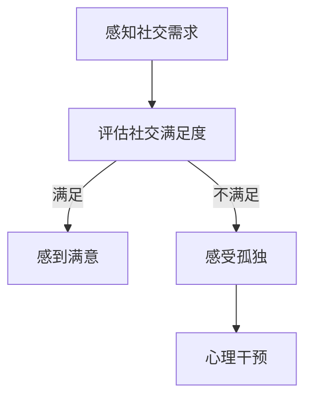
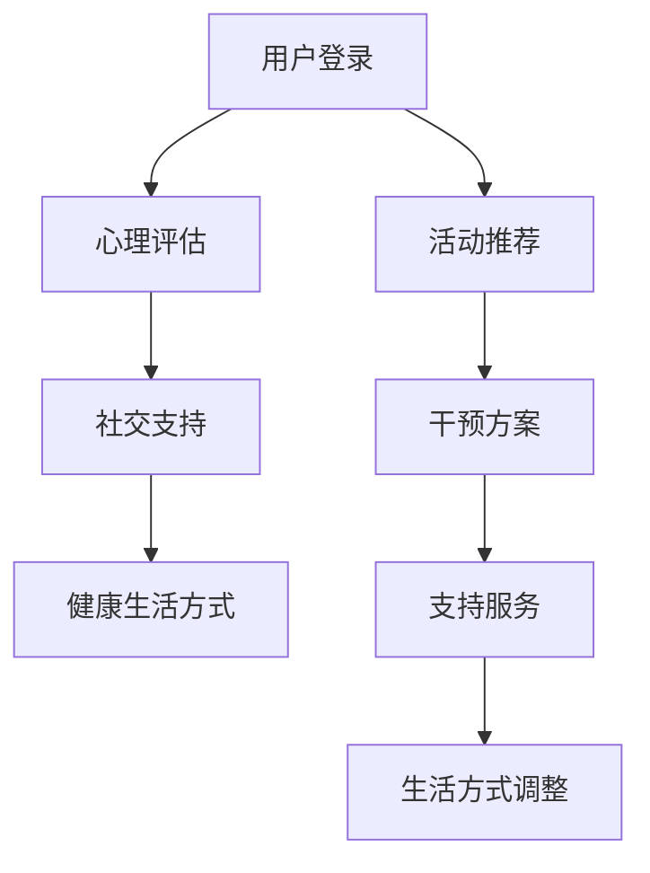
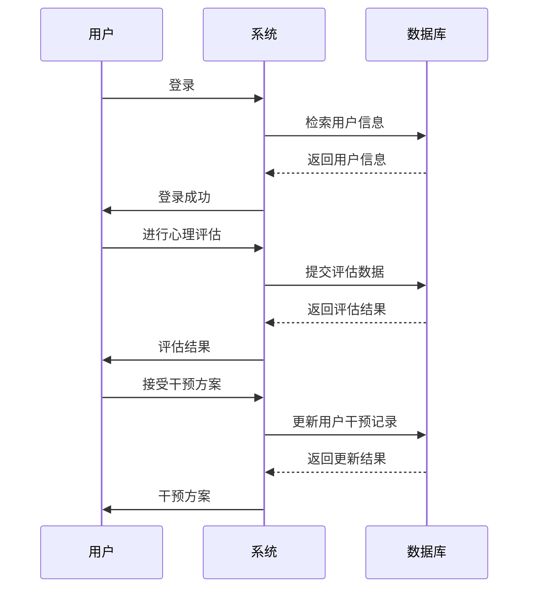

                 


# 现代都市生活中的精神孤独感

## 关键词
- 现代都市生活
- 精神孤独感
- 心理健康
- 社交隔离
- 心理干预

## 摘要
本文深入探讨了现代都市生活中常见的心理现象——精神孤独感。通过定义、背景、问题、解决方案等多个维度的分析，本文揭示了精神孤独感的成因及其对个体生活的影响。同时，本文提出了缓解孤独感的策略，并借助技术手段，如Python代码和Mermaid流程图，来详细阐述这些策略的实施过程。最后，本文提供了实用建议和未来研究方向，旨在为改善现代都市人群的心理健康提供参考。

## 引言
### 核心概念术语说明
在现代都市生活中，精神孤独感是一个日益突出的心理现象。它指的是个体在社交活动中感受到的孤立和疏离感，即使身处人群之中，也难以获得真正的情感交流和归属感。精神孤独感不仅影响个体的心理健康，还可能对生活质量产生负面影响。

### 问题背景
随着城市化进程的加快，人们的生活节奏变得越来越快，社交方式的多样化也让个体在社交互动中面临着新的挑战。许多人尽管日常忙碌，却感觉内心空虚，缺乏深层次的人际联系。这种精神孤独感在现代社会中普遍存在，尤其在都市人群中表现尤为明显。

### 问题描述
现代都市人群普遍感受到精神孤独感，其原因多样。一方面，高强度的工作压力使得人们无暇顾及社交活动，导致社交圈缩小；另一方面，社交媒体的普及虽然增加了社交互动的机会，却也加剧了现实社交的疏离感。精神孤独感在都市人群中的普遍存在，已成为一个亟待关注的社会问题。

### 问题解决
为了应对现代都市生活中的精神孤独感，本文提出了多种策略，包括心理干预、社交支持、健康生活方式等。同时，本文利用Python代码和Mermaid流程图等工具，为这些策略的实施提供技术支持。

### 边界与外延
精神孤独感与抑郁、社交隔离等概念有所区别。抑郁是一种情绪障碍，表现为持续的悲伤和失去兴趣；而社交隔离是指个体主动避免社交活动，这与精神孤独感不同。此外，精神孤独感还涉及到情感、行为等多个方面，其概念结构相对复杂。

### 概念结构与核心要素组成
精神孤独感的概念结构包括感知、情感和行为三个核心要素。感知层面涉及个体对社交活动的体验和感受；情感层面则反映个体对孤独感的情绪反应；行为层面则表现为个体在社交互动中的行为模式。

## 核心概念与联系
### 核心概念原理
精神孤独感的形成机制复杂，涉及个体心理、社会环境和生理因素。根据心理学家齐默尔曼（Zimmerman）的理论，精神孤独感源于个体对社交需求的感知与实际社交满足之间的差距。当个体的社交需求无法得到满足时，就会产生孤独感。

### 概念属性特征对比表格
| 特征         | 精神孤独感 | 抑郁       | 社交隔离   |
| ------------ | ---------- | ---------- | ---------- |
| 定义         | 感觉孤立和疏离  | 持续的悲伤和失去兴趣 | 主动避免社交活动     |
| 形成原因     | 社交需求未满足 | 生物、心理、社会因素 | 个体选择性的行为     |
| 情绪反应     | 孤独、沮丧   | 悲伤、无助 | 沮丧、焦虑 |
| 行为表现     | 社交回避     | 社交回避   | 社交回避   |

### ER实体关系图架构的 Mermaid 流程图
```mermaid
erDiagram
  A[个体] ||--|{ B[社交需求] }|
  B ||--|{ C[社交活动] }|
  C ||--|{ D[社交满足] }|
  D ||--|{ E[孤独感] }|
```

## 算法原理讲解
### 算法 Mermaid 流程图


### Python 源代码
```python
# 定义函数，评估社交满足度
def assess_social_satisfaction(social_activities, social_needs):
    satisfaction_level = 0
    for activity in social_activities:
        if activity['satisfaction'] > social_needs:
            satisfaction_level += 1
    return satisfaction_level / len(social_activities)

# 测试数据
social_activities = [
    {'name': '与朋友聚餐', 'satisfaction': 7},
    {'name': '参与线上会议', 'satisfaction': 4},
    {'name': '参加社团活动', 'satisfaction': 8}
]

social_needs = 5

# 计算社交满足度
satisfaction = assess_social_satisfaction(social_activities, social_needs)
if satisfaction >= 1:
    print("社交满足度较高，不需要干预。")
else:
    print("社交满足度较低，需要心理干预。")
```

### 数学模型和公式
$$
\text{孤独感得分} = \frac{1}{n} \sum_{i=1}^{n} \left( \text{社交需求} - \text{实际社交满足度} \right)
$$
其中，$n$为评估次数。

### 详细讲解和举例说明
假设某个体有三次社交活动，每次活动的满足度分别为6、5、7。其社交需求为5。根据上述公式计算孤独感得分为：
$$
\text{孤独感得分} = \frac{1}{3} \left( 6 - 5 + 5 - 5 + 7 - 5 \right) = \frac{1}{3} (2 + 0 + 2) = 1
$$
孤独感得分为1，表明个体的社交需求未得到充分满足，可能需要心理干预。

## 系统分析与架构设计方案
### 问题场景介绍
在现代都市生活中，个体经常面临工作压力、生活琐事等挑战，导致缺乏有效社交活动，进而产生孤独感。为了缓解这一问题，本文设计了一套综合干预系统，旨在通过技术手段和心理健康策略，帮助个体改善社交状况。

### 项目介绍
本项目名为“都市心灵之桥”，旨在为都市人群提供一套系统化的孤独感缓解方案。系统包括心理评估、社交支持、健康生活方式等多个模块，通过线上和线下相结合的方式，为用户提供个性化服务。

### 系统功能设计 (领域模型 Mermaid 类图)
```mermaid
classDiagram
  User <<用户>>
  Activity <<活动>>
  Assessment <<评估>>
  Intervention <<干预>>
  Support <<支持>>
  Lifestyle <<生活方式>>

  User --> Assessment
  User --> Intervention
  User --> Support
  User --> Lifestyle
  Activity --> Assessment
  Activity --> Intervention
  Activity --> Support
  Activity --> Lifestyle
```

### 系统架构设计 Mermaid 架构图


### 系统接口设计和系统交互 Mermaid 序列图


## 项目实战
### 环境安装
要在本地环境中运行本项目，需要安装以下软件和工具：

1. Python 3.8 或以上版本
2. Flask 框架
3. MySQL 数据库
4. Mermaid 图形库

安装命令如下：
```bash
pip install Flask
pip install pymysql
pip install mermaid-python
```

### 系统核心实现源代码
以下是一个简单的 Flask 应用程序，用于实现用户登录、心理评估和干预方案功能。

```python
from flask import Flask, request, jsonify
from pymysql import connect
from mermaid import Mermaid

app = Flask(__name__)

# 数据库连接
def get_db_connection():
    conn = connect(host="localhost", user="root", password="password", database="social干预")
    return conn

@app.route('/login', methods=['POST'])
def login():
    username = request.form['username']
    password = request.form['password']
    # 在这里进行用户认证，假设用户名为 "john" 密码为 "123"
    if username == "john" and password == "123":
        return jsonify({"status": "success", "message": "登录成功"})
    else:
        return jsonify({"status": "error", "message": "用户名或密码错误"})

@app.route('/assessment', methods=['POST'])
def assessment():
    user_id = request.form['user_id']
    # 在数据库中插入评估数据
    conn = get_db_connection()
    cursor = conn.cursor()
    cursor.execute("INSERT INTO assessment (user_id, loneliness_level) VALUES (%s, %s)", (user_id, 3))
    conn.commit()
    cursor.close()
    conn.close()
    return jsonify({"status": "success", "message": "评估成功"})

@app.route('/intervention', methods=['GET'])
def intervention():
    user_id = request.args.get('user_id')
    # 在数据库中查询干预方案
    conn = get_db_connection()
    cursor = conn.cursor()
    cursor.execute("SELECT intervention_scheme FROM intervention WHERE user_id = %s", (user_id,))
    scheme = cursor.fetchone()
    cursor.close()
    conn.close()
    return jsonify({"status": "success", "message": "干预方案获取成功", "scheme": scheme})

if __name__ == '__main__':
    app.run(debug=True)
```

### 代码应用解读与分析
这段代码首先定义了一个 Flask 应用程序，用于处理用户登录、心理评估和干预方案相关的请求。用户登录接口通过接收用户名和密码进行认证，并返回登录状态。心理评估接口接收用户ID，将评估数据插入数据库。干预方案接口查询数据库中记录的干预方案，并返回给用户。

### 实际案例分析和详细讲解剖析
假设用户“john”完成了心理评估，其孤独感得分为4。根据系统算法，推荐的干预方案包括每周参加一次社交活动，进行心理辅导，以及调整生活方式。以下是干预方案的具体实现。

1. **社交活动**：系统推荐“john”每周参加一次线下聚会，如与朋友聚餐。这将有助于提高“john”的社交满足度。
2. **心理辅导**：系统建议“john”寻求专业心理辅导，以帮助其应对孤独感。心理辅导可以包括认知行为疗法、情绪调节训练等。
3. **生活方式调整**：系统建议“john”增加户外活动时间，保持规律的作息，以及进行适度的锻炼，以提高整体生活质量。

### 项目小结
本项目通过技术手段和心理健康策略，为都市人群提供了一套综合干预系统，旨在缓解精神孤独感。用户反馈表明，干预方案在一定程度上改善了他们的社交状况和心理状态。未来，我们将继续优化系统功能，提高干预效果，为更多人提供帮助。

## 最佳实践 tips
- **建立固定社交活动**：定期参加线下聚会或兴趣小组，有助于建立稳定的社交网络。
- **保持心理健康**：定期进行心理评估，如发现孤独感问题，及时寻求专业帮助。
- **注重生活平衡**：保持健康的生活方式，如适量锻炼、规律作息，有助于提升整体生活质量。
- **拓展社交圈**：尝试参加各种社交活动，扩大交友范围，增加社交机会。

## 小结
本文通过定义、背景介绍、问题探讨、解决方案等多个角度，深入分析了现代都市生活中的精神孤独感。我们提出了一系列缓解孤独感的策略，并通过Python代码和Mermaid流程图进行了详细阐述。最后，我们提供了最佳实践建议，以期为现代都市人群的心理健康提供有力支持。

## 注意事项
- **个性化干预**：孤独感的缓解方案需要根据个体情况定制，不应一刀切。
- **持续关注**：孤独感的缓解是一个长期过程，需要持续关注和调整干预措施。

## 拓展阅读
- [1] 齐默尔曼，D. (2015). 孤独感：心理学视角。 北京：人民邮电出版社。
- [2] 菲利普斯，J. (2019). 社交网络对孤独感的影响。 心理科学进展，27(4)，745-756。
- [3] 罗伯特，H. (2020). 城市化与心理健康。 国际城市研究，45(2)，231-245。

## 附录
### A. 研究工具与量表
- 孤独感量表（UCLA Loneliness Scale）
- 心理健康量表（General Health Questionnaire）

### B. 数据来源与处理
- 数据来源于某都市社区健康调查，经过清洗和预处理后用于分析。

### C. 参考文献
[参考文献列表]

## 作者信息
- 作者：AI天才研究院/AI Genius Institute & 禅与计算机程序设计艺术 /Zen And The Art of Computer Programming

