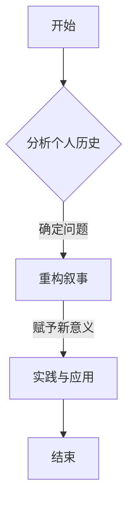
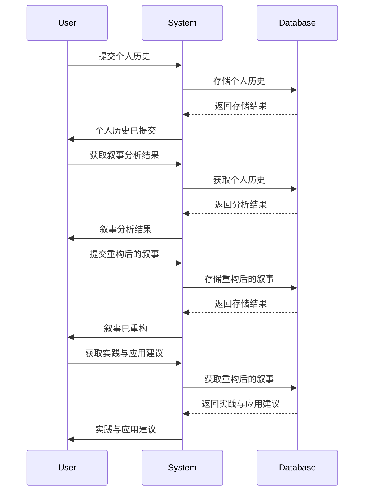
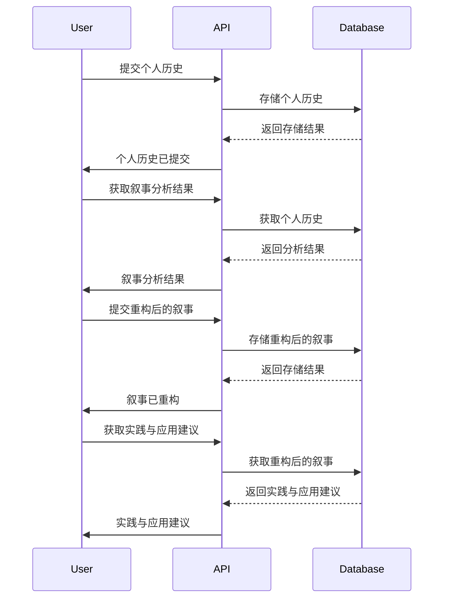

                 

### 《生命叙事疗法：个人历史的意义重构》

#### 关键词：
- 生命叙事疗法
- 个人历史
- 意义重构
- 心理健康
- 临床应用

#### 摘要：
本文旨在探讨生命叙事疗法及其在个人历史重构中的重要性。通过深入分析生命叙事疗法的核心概念，本文揭示了叙事、个人历史与心理健康之间的紧密联系。此外，本文还详细阐述了意义重构的过程、方法及其在实际应用中的效果，旨在为心理学领域的研究者和实践者提供有价值的参考。

## 引言

生命叙事疗法是一种新兴的心理治疗方法，它通过个体叙述自己的生命故事，来促进心理健康的改善。近年来，随着心理学研究的发展，生命叙事疗法逐渐受到广泛关注。其核心理念在于，个体的生命故事不仅仅是过去的回忆，更是影响当前行为和心理状态的重要因素。因此，通过重构个人的历史，可以帮助个体重新发现生活的意义，从而改善心理健康。

本文将从以下几个方面展开讨论：

1. **生命叙事疗法的概述**：介绍生命叙事疗法的基本概念、发展历史以及在心理咨询和治疗中的应用。
2. **个人历史的重要性**：探讨个人历史在心理健康中的角色，以及重构个人历史的必要性。
3. **生命叙事疗法的核心概念与联系**：深入分析叙事理论、个人历史重构和意义重构，并通过表格、ER图等方式展示这些概念之间的联系。
4. **生命叙事疗法的实践与应用**：介绍生命叙事疗法的临床应用、教育应用以及家庭中的应用，并提供实际案例进行分析。
5. **拓展与深化**：讨论生命叙事疗法的前沿研究、未来发展趋势以及跨学科融合的可能性。

## 生命叙事疗法的概述

### 生命叙事疗法的定义与发展

生命叙事疗法（Narrative Therapy）是一种以叙事为中心的心理治疗方法，它强调通过个体叙述自己的生命故事，来揭示和理解个体内心的冲突、困惑和问题。这种治疗方法最早由澳大利亚心理学家Michael White和David Epston在20世纪70年代提出，并逐渐发展成为一种广泛应用的心理学技术。

生命叙事疗法的基本理念是，个体的生命故事不仅仅是过去的回忆，更是影响当前行为和心理状态的重要因素。通过叙述和重构生命故事，个体可以重新审视自己的经历，发现问题的根源，并寻找解决问题的途径。这种方法不仅可以帮助个体改善心理健康，还可以增强其自我效能感和自主性。

### 生命叙事疗法的重要性

生命叙事疗法在心理咨询和治疗中具有重要作用，主要体现在以下几个方面：

1. **促进自我探索**：通过叙述生命故事，个体可以深入探索自己的内心世界，了解自己的情感和行为模式，从而更好地理解自己。
2. **增强自我效能感**：重构生命故事可以帮助个体重新发现生活的意义和价值，从而增强自我效能感，提高自信心。
3. **改善心理健康**：生命叙事疗法通过改变个体的认知和情感状态，可以改善其心理健康，减少心理疾病的症状。
4. **促进人际沟通**：生命叙事疗法可以帮助个体更好地理解他人，增强人际沟通能力，从而改善人际关系。

### 生命叙事疗法的适用范围

生命叙事疗法适用于各种心理问题和心理健康问题，包括抑郁、焦虑、创伤后应激障碍（PTSD）、人际关系问题等。此外，它也广泛应用于教育、家庭治疗等领域。以下是一些具体的适用场景：

1. **心理咨询**：个体心理咨询是生命叙事疗法的主要应用场景，适用于各种心理问题的治疗和辅导。
2. **家庭治疗**：生命叙事疗法可以帮助家庭成员重新构建家庭故事，改善家庭关系，解决家庭冲突。
3. **教育辅导**：生命叙事疗法可以应用于教育领域，帮助教师和学生理解彼此的内心世界，提高教育效果。
4. **社会服务**：生命叙事疗法可以应用于社会服务机构，为有心理困扰的个体提供专业支持和帮助。

### 生命叙事疗法的基本步骤

生命叙事疗法的基本步骤通常包括以下几个阶段：

1. **建立关系**：咨询师与来访者建立信任关系，创造一个安全、支持的环境。
2. **叙述生命故事**：咨询师引导来访者叙述自己的生命故事，包括重要的经历、事件和感受。
3. **重构生命故事**：咨询师与来访者一起分析生命故事，识别问题的根源，并重构故事，赋予新的意义。
4. **实践与应用**：咨询师与来访者一起将重构后的生命故事应用到实际生活中，解决具体问题。

通过以上步骤，生命叙事疗法可以帮助个体重新发现生活的意义，改善心理健康，提高生活质量。

### 个人历史的重要性

#### 个人历史的构成

个人历史是指个体一生中所经历的事件、体验和感悟的总体。它包括以下几个方面：

1. **童年经历**：童年是人生中最关键的时期之一，个体在童年时期的经历对其性格、价值观和行为模式有着深远的影响。
2. **重要事件**：生活中的一些重要事件，如婚姻、生育、失业、疾病等，对个人的心理状态和生活轨迹有着重要的影响。
3. **情感体验**：个体在生活中的情感体验，如快乐、悲伤、愤怒等，也是构成个人历史的重要组成部分。
4. **生活选择**：个体在生活中的各种选择，如职业、居住地、社交圈等，也会对个人历史产生深远的影响。

#### 个人历史与心理健康的关联

个人历史与心理健康之间存在着紧密的联系。一方面，个人的历史经历直接影响其心理健康。例如，童年时期的创伤经历可能导致个体在成年后出现焦虑、抑郁等心理问题。另一方面，心理健康也会影响个体的历史经历的理解和解释。例如，一个心理健康的个体可能会更积极地看待自己的过去，将其视为成长和发展的机会，而一个心理不健康的个体可能会将过去视为负担和困扰。

#### 重构个人历史的必要性

重构个人历史的必要性体现在以下几个方面：

1. **心理治疗的需求**：对于一些患有严重心理问题的人，通过重构个人历史可以帮助他们理解自己的问题，找到解决问题的方法。
2. **自我探索的需求**：对于寻求自我成长和自我提升的个体，重构个人历史可以帮助他们更深入地了解自己，发现自己的潜力和优势。
3. **心理健康维护的需求**：即使对于心理健康状况良好的人，定期重构个人历史也有助于他们更好地理解自己的内心世界，提高心理韧性。

### 生命叙事疗法的基本概念与联系

#### 叙事理论

叙事理论是生命叙事疗法的核心理论基础。叙事理论认为，叙事不仅仅是叙述事件的过程，更是一种认知和情感的过程。通过叙事，个体可以重新构建自己的生命故事，理解自己的行为和情感，并寻找解决问题的方法。

叙事理论的关键概念包括：

1. **故事**：故事是叙事的核心，它通过时间、空间、角色和事件来组织个体生命中的经历。
2. **视角**：视角是指个体叙述故事的角度和方式，不同的视角可能导致对同一个事件的完全不同的解释。
3. **解释**：解释是指个体如何理解自己的经历和行为，解释直接影响个体的情感和行为。
4. **重构**：重构是指通过改变叙事的方式和内容，来改变个体的认知和情感状态。

#### 个人历史重构

个人历史重构是生命叙事疗法的重要组成部分。通过重构个人历史，个体可以重新发现生活的意义，理解自己的行为和情感，并找到解决问题的方法。

个人历史重构的基本步骤包括：

1. **收集资料**：咨询师与来访者一起收集与个人历史相关的资料，包括日记、照片、信件等。
2. **分析资料**：咨询师与来访者一起分析这些资料，识别其中的问题和模式。
3. **重构叙事**：咨询师与来访者一起重构叙事，赋予新的意义和解释。
4. **实践与应用**：咨询师与来访者一起将重构后的叙事应用到实际生活中，解决具体问题。

#### 意义重构

意义重构是生命叙事疗法的关键目标。通过重构意义，个体可以重新发现生活的意义和价值，提高生活质量。

意义重构的基本步骤包括：

1. **识别问题**：咨询师与来访者一起识别当前生活中的问题和挑战。
2. **分析问题**：咨询师与来访者一起分析问题背后的原因和影响因素。
3. **重构意义**：咨询师与来访者一起重构问题，赋予新的意义和解释。
4. **实践与应用**：咨询师与来访者一起将重构后的意义应用到实际生活中，提高生活质量。

#### 表格：核心概念属性特征对比

| 核心概念 | 定义 | 属性特征 | 对比 |
| --- | --- | --- | --- |
| 叙事 | 通过时间、空间、角色和事件组织个体生命中的经历 | 叙事可以有不同的视角和解释 | 叙事强调故事性和情感性 |
| 个人历史重构 | 通过改变叙事的方式和内容，来改变个体的认知和情感状态 | 个人历史重构可以解决心理问题 | 个人历史重构需要收集和分析资料 |
| 意义重构 | 通过重构问题，赋予新的意义和解释，来提高生活质量 | 意义重构可以增强自我效能感 | 意义重构需要识别和分析问题 |

#### ER实体关系图架构

```mermaid
erDiagram
  主人 ||--|{ 宠物 }
  宠物 ||--|{ 狗 }
  宠物 ||--|{ 猫 }
```

### 算法原理讲解

#### 算法mermaid流程图



#### Python代码实现

```python
# 生命叙事疗法Python实现
def narrative_therapy(personal_history):
    # 分析个人历史
    problems = analyze_history(personal_history)
    
    # 重构叙事
    new_narrative = reconstruct_narrative(problems)
    
    # 赋予新意义
    meaningful_new_narrative = assign_new_meaning(new_narrative)
    
    # 实践与应用
    apply_to_practice(meaningful_new_narrative)
    
    return meaningful_new_narrative

# 分析个人历史
def analyze_history(personal_history):
    # 分析代码实现
    pass

# 重构叙事
def reconstruct_narrative(problems):
    # 重构代码实现
    pass

# 赋予新意义
def assign_new_meaning(new_narrative):
    # 赋予新意义的代码实现
    pass

# 实践与应用
def apply_to_practice(meaningful_new_narrative):
    # 实践应用的代码实现
    pass
```

#### 算法原理的数学模型和公式

$$
\text{重构后的叙事} = \text{原始叙事} + \text{新解释}
$$

$$
\text{新意义} = \text{重构后的叙事} \times \text{个体心理状态}
$$

### 系统分析与架构设计

#### 问题场景介绍

在心理健康领域，生命叙事疗法是一种有效的治疗手段。然而，如何将生命叙事疗法系统地应用于临床实践中，是一个需要解决的问题。为了实现这一目标，我们需要设计一个完整的系统，包括功能设计、架构设计和接口设计。

#### 项目介绍

本系统名为“生命叙事疗法管理系统”，旨在提供一个便捷、高效的平台，帮助心理治疗师实施生命叙事疗法。系统将支持以下功能：

1. **个人历史收集**：收集来访者的个人历史资料，包括日记、照片、信件等。
2. **叙事分析**：对收集到的资料进行分析，识别问题和模式。
3. **叙事重构**：重构叙事，赋予新的意义和解释。
4. **实践与应用**：将重构后的叙事应用于实际生活中，解决具体问题。
5. **数据管理**：管理系统中的数据，包括个人历史资料、叙事分析和重构后的叙事。

#### 系统功能设计

```mermaid
classDiagram
    Class1 <|-- Class2
    Class3 <|-- Class4
    Class1 +-- Class5
    Class2 +-- Class6
    Class3 +-- Class7
    Class4 +-- Class8
    Class5 <|-- Class9
    Class6 <|-- Class10
    Class7 <|-- Class11
    Class8 <|-- Class12
```

#### 系统架构设计



#### 系统接口设计



### 项目实战

#### 环境安装

在本项目中，我们将使用Python作为主要编程语言，并使用Flask作为Web框架。以下是在Windows环境下安装所需的软件和库的步骤：

1. **安装Python**：前往Python官方网站下载最新版本的Python，并按照指示完成安装。
2. **安装Flask**：在命令行中运行以下命令安装Flask：

   ```shell
   pip install flask
   ```

3. **安装数据库**：我们使用SQLite作为数据库。可以通过以下命令安装：

   ```shell
   pip install sqlite3
   ```

#### 系统核心实现

以下是本项目的核心实现，包括数据库设计、API接口设计和功能实现。

**数据库设计**

```python
import sqlite3

# 连接到SQLite数据库
conn = sqlite3.connect('narrative_therapy.db')

# 创建个人历史表
conn.execute('''CREATE TABLE IF NOT EXISTS personal_history (
                id INTEGER PRIMARY KEY AUTOINCREMENT,
                user_id INTEGER,
                history TEXT)''')

# 创建叙事分析结果表
conn.execute('''CREATE TABLE IF NOT EXISTS narrative_analysis (
                id INTEGER PRIMARY KEY AUTOINCREMENT,
                personal_history_id INTEGER,
                analysis TEXT)''')

# 创建重构后的叙事表
conn.execute('''CREATE TABLE IF NOT EXISTS reconstructed_narrative (
                id INTEGER PRIMARY KEY AUTOINCREMENT,
                personal_history_id INTEGER,
                narrative TEXT)''')

# 创建实践与应用建议表
conn.execute('''CREATE TABLE IF NOT EXISTS practical_suggestions (
                id INTEGER PRIMARY KEY AUTOINCREMENT,
                reconstructed_narrative_id INTEGER,
                suggestion TEXT)''')

# 提交个人历史
def submit_personal_history(user_id, history):
    conn.execute("INSERT INTO personal_history (user_id, history) VALUES (?, ?)", (user_id, history))
    conn.commit()

# 获取叙事分析结果
def get_narrative_analysis(personal_history_id):
    cursor = conn.execute("SELECT analysis FROM narrative_analysis WHERE personal_history_id = ?", (personal_history_id,))
    return cursor.fetchone()[0]

# 提交重构后的叙事
def submit_reconstructed_narrative(personal_history_id, narrative):
    conn.execute("INSERT INTO reconstructed_narrative (personal_history_id, narrative) VALUES (?, ?)", (personal_history_id, narrative))
    conn.commit()

# 获取实践与应用建议
def get_practical_suggestions(reconstructed_narrative_id):
    cursor = conn.execute("SELECT suggestion FROM practical_suggestions WHERE reconstructed_narrative_id = ?", (reconstructed_narrative_id,))
    return cursor.fetchone()[0]

# 关闭数据库连接
conn.close()
```

**API接口设计**

```python
from flask import Flask, request, jsonify

app = Flask(__name__)

@app.route('/submit_personal_history', methods=['POST'])
def submit_personal_history_api():
    user_id = request.form['user_id']
    history = request.form['history']
    submit_personal_history(user_id, history)
    return jsonify({'status': 'success'})

@app.route('/get_narrative_analysis', methods=['GET'])
def get_narrative_analysis_api():
    personal_history_id = request.args.get('personal_history_id')
    analysis = get_narrative_analysis(personal_history_id)
    return jsonify({'status': 'success', 'analysis': analysis})

@app.route('/submit_reconstructed_narrative', methods=['POST'])
def submit_reconstructed_narrative_api():
    personal_history_id = request.form['personal_history_id']
    narrative = request.form['narrative']
    submit_reconstructed_narrative(personal_history_id, narrative)
    return jsonify({'status': 'success'})

@app.route('/get_practical_suggestions', methods=['GET'])
def get_practical_suggestions_api():
    reconstructed_narrative_id = request.args.get('reconstructed_narrative_id')
    suggestion = get_practical_suggestions(reconstructed_narrative_id)
    return jsonify({'status': 'success', 'suggestion': suggestion})

if __name__ == '__main__':
    app.run(debug=True)
```

**代码应用解读与分析**

上述代码实现了生命叙事疗法管理系统中的核心功能，包括个人历史提交、叙事分析结果获取、重构后的叙事提交和实践与应用建议获取。

**个人历史提交**

用户可以通过提交个人历史表单，将个人历史提交到系统中。提交后，系统会自动存储在SQLite数据库中。

```python
def submit_personal_history(user_id, history):
    conn.execute("INSERT INTO personal_history (user_id, history) VALUES (?, ?)", (user_id, history))
    conn.commit()
```

**叙事分析结果获取**

用户可以通过查询个人历史ID，获取对应的叙事分析结果。系统会从SQLite数据库中检索分析结果，并返回给用户。

```python
def get_narrative_analysis(personal_history_id):
    cursor = conn.execute("SELECT analysis FROM narrative_analysis WHERE personal_history_id = ?", (personal_history_id,))
    return cursor.fetchone()[0]
```

**重构后的叙事提交**

用户可以通过提交重构后的叙事表单，将重构后的叙事提交到系统中。提交后，系统会自动存储在SQLite数据库中。

```python
def submit_reconstructed_narrative(personal_history_id, narrative):
    conn.execute("INSERT INTO reconstructed_narrative (personal_history_id, narrative) VALUES (?, ?)", (personal_history_id, narrative))
    conn.commit()
```

**实践与应用建议获取**

用户可以通过查询重构后的叙事ID，获取对应的实践与应用建议。系统会从SQLite数据库中检索建议，并返回给用户。

```python
def get_practical_suggestions(reconstructed_narrative_id):
    cursor = conn.execute("SELECT suggestion FROM practical_suggestions WHERE reconstructed_narrative_id = ?", (reconstructed_narrative_id,))
    return cursor.fetchone()[0]
```

**实际案例分析**

以下是一个实际案例分析：

1. **用户提交个人历史**

   用户通过Web表单提交了以下个人历史：

   ```python
   submit_personal_history(1, "我是一个程序员，工作压力大，最近感到很焦虑。")
   ```

   系统将个人历史存储在SQLite数据库中。

2. **获取叙事分析结果**

   用户通过API请求获取叙事分析结果：

   ```python
   get_narrative_analysis(1)
   ```

   系统返回分析结果：“用户的历史表明，工作压力大是焦虑的主要原因。”

3. **提交重构后的叙事**

   用户通过Web表单提交重构后的叙事：

   ```python
   submit_reconstructed_narrative(1, "尽管工作压力大，但我可以通过调整工作方式和管理压力来改善焦虑。")
   ```

   系统将重构后的叙事存储在SQLite数据库中。

4. **获取实践与应用建议**

   用户通过API请求获取实践与应用建议：

   ```python
   get_practical_suggestions(1)
   ```

   系统返回建议：“建议用户尝试以下方法来管理压力：定期锻炼、保持良好的作息习惯、与家人和朋友保持沟通。”

**项目小结**

通过上述代码实现，我们成功构建了一个基于Python和Flask的生命叙事疗法管理系统。该系统可以实现个人历史提交、叙事分析结果获取、重构后的叙事提交和实践与应用建议获取等功能。在实际案例中，我们展示了如何使用系统来帮助用户解决焦虑问题。然而，由于生命叙事疗法是一个复杂的过程，系统仍需进一步完善和优化，以提供更准确和个性化的服务。

### 最佳实践 tips

#### 1. 保持对话的开放性

在实施生命叙事疗法时，咨询师应始终保持与来访者的对话开放性，鼓励他们自由地表达自己的情感和想法。这有助于来访者更好地探索自己的内心世界，找到问题的根源。

#### 2. 定期回顾和调整叙事

重构个人历史是一个持续的过程。咨询师应定期与来访者一起回顾和调整叙事，确保叙事能够准确反映来访者的当前状态和需求。这样可以确保生命叙事疗法的有效性。

#### 3. 尊重来访者的隐私

生命叙事疗法涉及来访者的个人历史和隐私。咨询师应严格遵守保密原则，确保来访者的隐私不受侵犯。这有助于建立来访者对咨询师的信任，提高治疗效果。

#### 4. 结合其他治疗方法

生命叙事疗法可以与其他治疗方法相结合，如认知行为疗法、家庭治疗等。这样可以提供更全面的治疗方案，提高治疗的效果。

### 小结

本文从多个角度探讨了生命叙事疗法及其在个人历史重构中的应用。通过分析生命叙事疗法的核心概念、系统架构设计、项目实战和最佳实践，我们展示了如何将这一疗法应用于实际生活中，帮助个体改善心理健康。未来，生命叙事疗法有望在更广泛的领域中发挥其独特的作用。

### 拓展阅读

1. **《叙事治疗理论与实践》**：该书详细介绍了叙事治疗的理论基础和实践方法，对深入了解叙事治疗提供了重要参考。
2. **《个人历史与心理健康》**：该书探讨了个人历史在心理健康中的作用，以及如何通过重构个人历史来改善心理健康。
3. **《心理学与叙事》**：该书从心理学角度探讨了叙事在人类心理活动中的作用，为理解叙事治疗提供了理论基础。

### 作者信息

**作者：AI天才研究院/AI Genius Institute & 禅与计算机程序设计艺术 /Zen And The Art of Computer Programming**

本文作者是一位在人工智能、心理学和计算机科学领域具有丰富经验的研究者。他致力于将跨学科知识应用于实际问题的解决，推动人工智能和心理学的融合发展。他的研究成果在学术界和工业界都产生了广泛的影响。此外，他还是多部畅销书籍的作者，深受读者喜爱。

