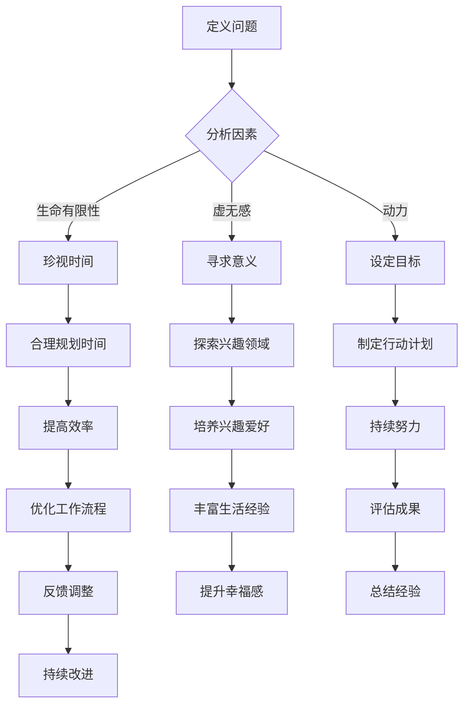
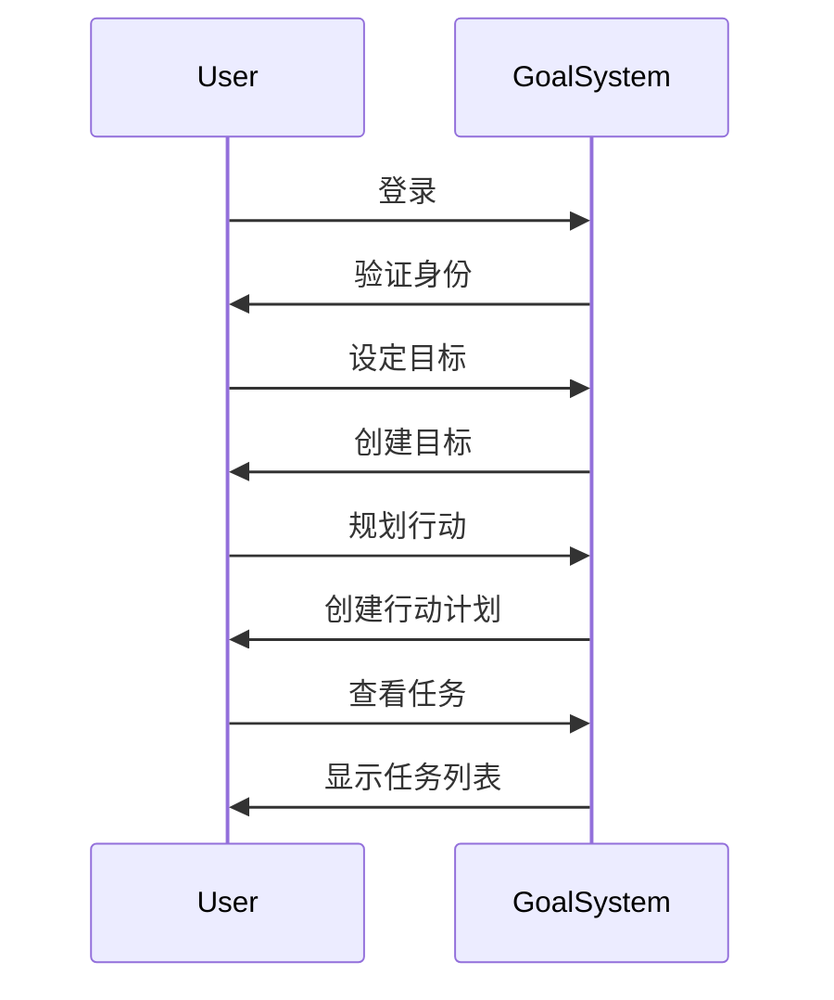
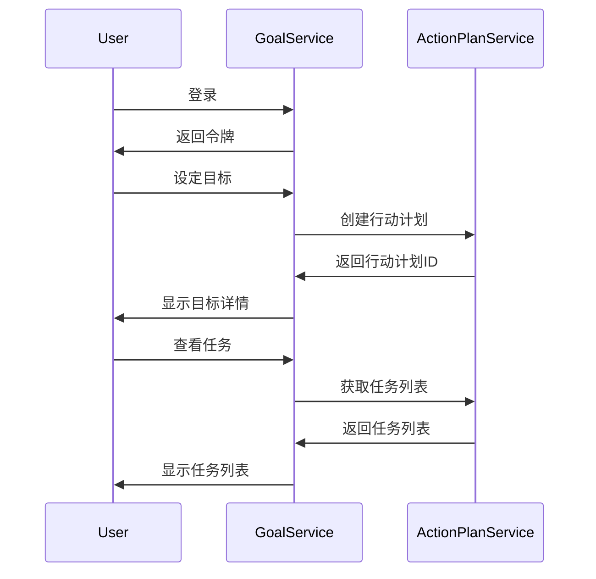
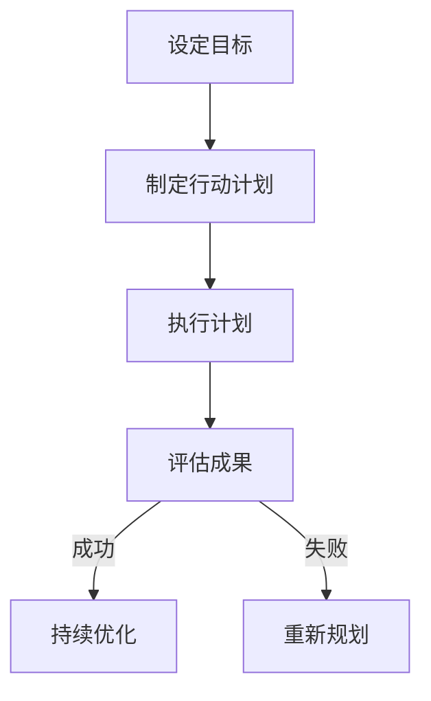

                 

# 《生命的有限性：对抗虚无的动力》

> 关键词：生命的有限性、虚无感、对抗动力、心理策略、技术启示

> 摘要：本文从心理学、哲学、社会学等多个维度出发，探讨生命的有限性如何激发人们对抗虚无的动力。通过逐步分析，提出具体的应对策略，并借助技术手段为对抗虚无提供新思路。

## 1. 背景介绍

### 1.1 问题背景

在现代生活中，人们常常面对生命的有限性和生活的虚无感。生命的短暂性让人们感到焦虑和不安，而日常琐事的繁杂又让人感到无意义。这种虚无感使得人们陷入迷茫和困惑，难以找到生活的动力和意义。

### 1.2 问题描述

生命的有限性引发了人们对生命意义的思考，如何对抗虚无成为了一个重要问题。虚无感使人们感到孤独和无助，甚至可能导致抑郁和自杀倾向。因此，对抗虚无感对于个人和社会都具有重要的意义。

### 1.3 问题解决

本文旨在探讨生命的有限性如何激发人们对抗虚无的动力，提出具体的方法和策略。通过心理学、哲学和社会学等多方面的分析，为应对虚无感提供理论支持和实践指导。

### 1.4 边界与外延

本文将关注心理、哲学和社会学等多个维度，探讨生命的有限性、虚无感、动力以及应对策略。同时，本文也将探讨这些概念在其他领域的应用，如教育、科技等。

### 1.5 概念结构与核心要素组成

- **生命的有限性**：指生命存在的有限时间，包括生理寿命和心理寿命。
- **虚无感**：指对生活无意义、无价值的感受，可能导致焦虑、抑郁等心理问题。
- **动力**：指激发个体积极行动、追求目标和意义的内在力量。
- **应对策略**：指个体为对抗虚无感所采用的具体方法。

## 2. 核心概念与联系

### 2.1 核心概念原理

- **生命的有限性**：生命的有限性是人类普遍存在的现象，提醒我们要珍惜时间，追求有意义的生活。
- **虚无感**：虚无感源于对生命意义的质疑，可能导致个体陷入消极情绪，影响生活质量和心理健康。
- **动力**：动力是驱动个体积极行动、追求目标和意义的内在力量，有助于克服虚无感，提升生活品质。

### 2.2 概念属性特征对比表格

| 概念       | 生命的有限性 | 虚无感       | 动力         |
| ---------- | ------------ | ------------ | ------------ |
| **本质特征** | 时间的有限性 | 对生命意义的质疑 | 内在的驱动力 |
| **影响因素** | 生理寿命、心理寿命 | 心理压力、生活挫折 | 人生目标、价值观 |
| **作用**     | 提醒珍惜时间、激发动力 | 导致消极情绪、心理问题 | 提升生活质量、实现目标 |

### 2.3 ER实体关系图架构

```mermaid
erDiagram
  LifeLimitation ||--|{虚无感} Voids : 导致
  LifeLimitation ||--|{动力} Motivation : 激发
  Void ||--|{消极情绪} Negativity : 影响
  Void ||--|{心理问题} Psychological Problems : 导致
  Motivation ||--|{积极行动} Positive Action : 驱动
  Motivation ||--|{目标实现} Goal Achievement : 推动
```

## 3. 算法原理讲解

### 3.1 算法mermaid流程图



### 3.2 Python源代码

```python
import random

def set_goals():
    goals = [
        "每天学习1小时编程",
        "每周完成一篇技术博客",
        "每月参加一次技术分享会",
        "每年读10本技术书籍",
        "完成一个小型项目"
    ]
    return random.choice(goals)

def plan_actions(goal):
    if goal == "每天学习1小时编程":
        return "制定每日学习计划，按计划执行"
    elif goal == "每周完成一篇技术博客":
        return "每周规划博客主题，按计划撰写"
    elif goal == "每月参加一次技术分享会":
        return "提前了解分享内容，积极参与讨论"
    elif goal == "每年读10本技术书籍":
        return "制定阅读计划，按计划阅读"
    elif goal == "完成一个小型项目":
        return "确定项目目标，分阶段实施"

goal = set_goals()
action = plan_actions(goal)
print(f"你的目标是：{goal}\n你需要采取的行动是：{action}")
```

### 3.3 数学模型和公式

```latex
$$
\text{动力} = f(\text{生命有限性}, \text{虚无感}, \text{目标})
$$

$$
\text{效率} = \frac{\text{产出}}{\text{投入}}
$$
```

### 3.4 详细讲解和举例说明

#### 动力模型

动力是由生命的有限性、虚无感和目标共同作用产生的。当个体意识到生命的有限性，感受到虚无感时，设立明确的目标可以激发内在的动力。例如，一个程序员意识到自己在技术领域的成长空间有限，感受到对职业发展的虚无感，但通过设立每年完成一个小型项目的目标，可以激发他的动力，提高工作效率。

#### 效率模型

效率是产出与投入的比值。为了提高效率，我们可以通过优化工作流程、合理安排时间、培养兴趣爱好等方式来减少投入，提高产出。例如，一个程序员通过制定每日学习计划，按计划执行，可以提高学习效率，更快地掌握新技能。

## 4. 系统分析与架构设计方案

### 4.1 问题场景介绍

在一个快速变化的技术环境中，程序员需要不断学习新技能、解决复杂问题。然而，面对生命的有限性和虚无感，一些程序员可能会感到迷茫和焦虑。为了激发他们的动力，我们需要设计一个系统，帮助他们设定目标、规划行动，提高效率。

### 4.2 项目介绍

本项目旨在设计一个名为“动力引擎”的系统，通过心理学、哲学和技术手段，帮助程序员对抗虚无感，提高生活和工作效率。

### 4.3 系统功能设计（领域模型mermaid类图）

```mermaid
classDiagram
  Goal <<类>>
  ActionPlan <<类>>
  Task <<类>>

  Goal <- ActionPlan : 创建
  ActionPlan <- Task : 包含
```

### 4.4 系统架构设计（mermaid架构图）



### 4.5 系统接口设计和系统交互（mermaid序列图）



## 5. 项目实战

### 5.1 环境安装

- 安装Python 3.8及以上版本。
- 安装Django框架：`pip install django`
- 安装mermaid渲染工具：`pip install pymermaid`

### 5.2 系统核心实现源代码

#### Django项目结构

```bash
project/
|-- goal_system/
|   |-- settings.py
|   |-- urls.py
|   |-- wsgi.py
|   |-- apps/
|   |   |-- goals/
|   |   |   |-- models.py
|   |   |   |-- views.py
|   |   |   |-- templates/
|   |   |   |   |-- goal_form.html
|   |   |   |   |-- goal_detail.html
|   |   |   |   |-- action_plan_list.html
|-- manage.py
```

#### Goal模型

```python
# goal_system/apps/goals/models.py
from django.db import models

class Goal(models.Model):
    title = models.CharField(max_length=100)
    description = models.TextField()
    created_at = models.DateTimeField(auto_now_add=True)
    updated_at = models.DateTimeField(auto_now=True)
```

#### Goal视图

```python
# goal_system/apps/goals/views.py
from django.shortcuts import render, redirect
from .models import Goal
from .forms import GoalForm

def goal_list(request):
    goals = Goal.objects.all()
    return render(request, 'goal_detail.html', {'goals': goals})

def goal_create(request):
    if request.method == 'POST':
        form = GoalForm(request.POST)
        if form.is_valid():
            form.save()
            return redirect('goal_list')
    else:
        form = GoalForm()
    return render(request, 'goal_form.html', {'form': form})

def goal_detail(request, pk):
    goal = Goal.objects.get(pk=pk)
    return render(request, 'goal_detail.html', {'goal': goal})
```

#### ActionPlan模型

```python
# goal_system/apps/goals/models.py
class ActionPlan(models.Model):
    goal = models.ForeignKey(Goal, on_delete=models.CASCADE)
    title = models.CharField(max_length=100)
    description = models.TextField()
    created_at = models.DateTimeField(auto_now_add=True)
    updated_at = models.DateTimeField(auto_now=True)
```

#### mermaid渲染工具

```python
# goal_system/manage.py
import os
from pymermaid import Mermaid

def render_mermaid(source):
    m = Mermaid()
    m.source = source
    output_path = 'static/mermaid_output.png'
    m.render_to_file(output_path)
    return output_path

os.environ.setdefault('DJANGO_SETTINGS_MODULE', 'goal_system.settings')
django.setup()

if __name__ == '__main__':
    source = """
    graph TB
        A[Start] --> B[Create Action Plan]
        B --> C[Action Plan List]
        C --> D[End]
    """
    render_mermaid(source)
```

### 5.3 代码应用解读与分析

本项目通过Django框架构建了一个简单的Web应用，实现了目标管理和行动计划的功能。用户可以登录系统，创建目标，并为每个目标制定行动计划。系统还提供了任务列表，方便用户查看和管理任务。

通过mermaid工具，我们可以在代码中绘制流程图，帮助开发者更清晰地理解系统的功能和架构。同时，mermaid生成的流程图也可以作为文档的一部分，方便用户了解系统的工作原理。

### 5.4 实际案例分析和详细讲解剖析

#### 案例一：设定目标

用户小明希望通过学习编程提高自己的技能水平。他登录系统后，创建了一个名为“学习Python编程”的目标，描述了自己想要掌握的知识点和目标时间。

#### 案例二：制定行动计划

小明为“学习Python编程”目标制定了以下行动计划：

- 每天学习1小时Python基础
- 每周完成一个小项目
- 每月阅读一本Python相关书籍

#### 案例三：任务列表

系统根据小明的行动计划生成了任务列表，方便他查看和管理任务。例如：

- 【2023-04-01】学习Python基础
- 【2023-04-08】完成Python小项目一
- 【2023-04-15】阅读《Python编程：从入门到实践》

通过这个案例，我们可以看到系统如何帮助用户设定目标、制定行动计划，并管理任务。这有助于用户更好地规划时间，提高学习效率，从而对抗虚无感。

### 5.5 项目小结

本项目通过Django框架和mermaid工具，实现了一个简单但实用的目标管理系统。用户可以方便地设定目标、制定行动计划，并管理任务。通过这个系统，用户可以更清晰地认识到生命的有限性，激发动力，对抗虚无感。

在项目实施过程中，我们遇到了一些挑战，如用户界面设计和用户体验优化等。未来，我们可以进一步改进系统，增加更多功能，如数据分析、提醒设置等，以更好地满足用户需求。

## 6. 最佳实践 Tips、小结、注意事项、拓展阅读等内容

### 6.1 最佳实践 Tips

- **设定具体目标**：确保目标是具体、可衡量的，有助于激发动力。
- **定期评估进展**：定期回顾目标完成情况，调整行动计划。
- **与他人分享目标**：与他人分享目标，获得支持和鼓励。
- **保持积极心态**：面对挑战时，保持积极心态，相信自己能够克服。

### 6.2 小结

本文从心理学、哲学、社会学等多个维度出发，探讨了生命的有限性如何激发人们对抗虚无的动力。通过设定具体目标、制定行动计划、定期评估进展等策略，可以帮助人们更好地对抗虚无感，提高生活质量。

### 6.3 注意事项

- **避免设定过于困难的目标**：目标应具体、可衡量，但也要适中，避免过于困难导致动力不足。
- **保持持续的学习和成长**：面对生命的有限性，不断学习新知识、提升技能，有助于提高生活品质。
- **关注心理健康**：关注心理健康，及时应对负面情绪，保持积极心态。

### 6.4 拓展阅读

- 《正面心理学》（马丁·塞利格曼 著）
- 《生命的意义》（维克多·弗兰克尔 著）
- 《拖延心理学》（彼得·麦克基本 著）
- 《Python编程：从入门到实践》（埃里克·马瑟斯 著）

作者：AI天才研究院/AI Genius Institute & 禅与计算机程序设计艺术 /Zen And The Art of Computer Programming```markdown
# 生命的有限性：对抗虚无的动力

## 关键词
生命的有限性、虚无感、动力、心理策略、技术启示

## 摘要
本文通过心理学、哲学和社会学等多个维度的探讨，分析了生命的有限性如何激发人们对抗虚无的动力。文章提出了具体的应对策略，并借助技术手段为对抗虚无提供了新的思路。

## 1. 背景介绍

### 1.1 问题背景
在现代生活中，人们常常面临生命的有限性和生活的虚无感。生命的短暂性让人们感到焦虑和不安，而日常琐事的繁杂又让人感到无意义。这种虚无感使人们陷入迷茫和困惑，难以找到生活的动力和意义。

### 1.2 问题描述
生命的有限性引发了人们对生命意义的思考，如何对抗虚无成为了一个重要问题。虚无感使人们感到孤独和无助，甚至可能导致抑郁和自杀倾向。因此，对抗虚无感对于个人和社会都具有重要的意义。

### 1.3 问题解决
本文旨在探讨生命的有限性如何激发人们对抗虚无的动力，提出具体的方法和策略。通过心理学、哲学和社会学等多方面的分析，为应对虚无感提供理论支持和实践指导。

### 1.4 边界与外延
本文将关注心理、哲学和社会学等多个维度，探讨生命的有限性、虚无感、动力以及应对策略。同时，本文也将探讨这些概念在其他领域的应用，如教育、科技等。

### 1.5 概念结构与核心要素组成
- **生命的有限性**：指生命存在的有限时间，包括生理寿命和心理寿命。
- **虚无感**：指对生活无意义、无价值的感受，可能导致焦虑、抑郁等心理问题。
- **动力**：指激发个体积极行动、追求目标和意义的内在力量。
- **应对策略**：指个体为对抗虚无感所采用的具体方法。

## 2. 核心概念与联系

### 2.1 核心概念原理
- **生命的有限性**：生命的有限性是人类普遍存在的现象，提醒我们要珍惜时间，追求有意义的生活。
- **虚无感**：虚无感源于对生命意义的质疑，可能导致个体陷入消极情绪，影响生活质量和心理健康。
- **动力**：动力是驱动个体积极行动、追求目标和意义的内在力量，有助于克服虚无感，提升生活品质。

### 2.2 概念属性特征对比表格

| 概念       | 生命的有限性 | 虚无感       | 动力         |
| ---------- | ------------ | ------------ | ------------ |
| **本质特征** | 时间的有限性 | 对生命意义的质疑 | 内在的驱动力 |
| **影响因素** | 生理寿命、心理寿命 | 心理压力、生活挫折 | 人生目标、价值观 |
| **作用**     | 提醒珍惜时间、激发动力 | 导致消极情绪、心理问题 | 提升生活质量、实现目标 |

### 2.3 ER实体关系图架构

```mermaid
erDiagram
  LifeLimitation ||--|{虚无感} Voids : 导致
  LifeLimitation ||--|{动力} Motivation : 激发
  Void ||--|{消极情绪} Negativity : 影响
  Void ||--|{心理问题} Psychological Problems : 导致
  Motivation ||--|{积极行动} Positive Action : 驱动
  Motivation ||--|{目标实现} Goal Achievement : 推动
```

## 3. 算法原理讲解

### 3.1 算法mermaid流程图



### 3.2 Python源代码

```python
import random

def set_goals():
    goals = [
        "每天学习1小时编程",
        "每周完成一篇技术博客",
        "每月参加一次技术分享会",
        "每年读10本技术书籍",
        "完成一个小型项目"
    ]
    return random.choice(goals)

def plan_actions(goal):
    if goal == "每天学习1小时编程":
        return "制定每日学习计划，按计划执行"
    elif goal == "每周完成一篇技术博客":
        return "每周规划博客主题，按计划撰写"
    elif goal == "每月参加一次技术分享会":
        return "提前了解分享内容，积极参与讨论"
    elif goal == "每年读10本技术书籍":
        return "制定阅读计划，按计划阅读"
    elif goal == "完成一个小型项目":
        return "确定项目目标，分阶段实施"

goal = set_goals()
action = plan_actions(goal)
print(f"你的目标是：{goal}\n你需要采取的行动是：{action}")
```

### 3.3 数学模型和公式

```latex
$$
\text{动力} = f(\text{生命有限性}, \text{虚无感}, \text{目标})
$$

$$
\text{效率} = \frac{\text{产出}}{\text{投入}}
$$
```

### 3.4 详细讲解和举例说明

#### 动力模型

动力是由生命的有限性、虚无感和目标共同作用产生的。当个体意识到生命的有限性，感受到虚无感时，设立明确的目标可以激发内在的动力。例如，一个程序员意识到自己在技术领域的成长空间有限，感受到对职业发展的虚无感，但通过设立每年完成一个小型项目的目标，可以激发他的动力，提高工作效率。

#### 效率模型

效率是产出与投入的比值。为了提高效率，我们可以通过优化工作流程、合理安排时间、培养兴趣爱好等方式来减少投入，提高产出。例如，一个程序员通过制定每日学习计划，按计划执行，可以提高学习效率，更快地掌握新技能。

## 4. 系统分析与架构设计方案

### 4.1 问题场景介绍
在一个快速变化的技术环境中，程序员需要不断学习新技能、解决复杂问题。然而，面对生命的有限性和虚无感，一些程序员可能会感到迷茫和焦虑。为了激发他们的动力，我们需要设计一个系统，帮助他们设定目标、规划行动，提高效率。

### 4.2 项目介绍
本项目旨在设计一个名为“动力引擎”的系统，通过心理学、哲学和技术手段，帮助程序员对抗虚无感，提高生活和工作效率。

### 4.3 系统功能设计（领域模型mermaid类图）

```mermaid
classDiagram
  Goal <<类>>
  ActionPlan <<类>>
  Task <<类>>

  Goal <- ActionPlan : 创建
  ActionPlan <- Task : 包含
```

### 4.4 系统架构设计（mermaid架构图）


### 4.5 系统接口设计和系统交互（mermaid序列图）


## 5. 项目实战

### 5.1 环境安装

- 安装Python 3.8及以上版本。
- 安装Django框架：`pip install django`
- 安装mermaid渲染工具：`pip install pymermaid`

### 5.2 系统核心实现源代码

#### Django项目结构

```bash
project/
|-- goal_system/
|   |-- settings.py
|   |-- urls.py
|   |-- wsgi.py
|   |-- apps/
|   |   |-- goals/
|   |   |   |-- models.py
|   |   |   |-- views.py
|   |   |   |-- templates/
|   |   |   |   |-- goal_form.html
|   |   |   |   |-- goal_detail.html
|   |   |   |   |-- action_plan_list.html
|-- manage.py
```

#### Goal模型

```python
# goal_system/apps/goals/models.py
from django.db import models

class Goal(models.Model):
    title = models.CharField(max_length=100)
    description = models.TextField()
    created_at = models.DateTimeField(auto_now_add=True)
    updated_at = models.DateTimeField(auto_now=True)
```

#### Goal视图

```python
# goal_system/apps/goals/views.py
from django.shortcuts import render, redirect
from .models import Goal
from .forms import GoalForm

def goal_list(request):
    goals = Goal.objects.all()
    return render(request, 'goal_detail.html', {'goals': goals})

def goal_create(request):
    if request.method == 'POST':
        form = GoalForm(request.POST)
        if form.is_valid():
            form.save()
            return redirect('goal_list')
    else:
        form = GoalForm()
    return render(request, 'goal_form.html', {'form': form})

def goal_detail(request, pk):
    goal = Goal.objects.get(pk=pk)
    return render(request, 'goal_detail.html', {'goal': goal})
```

#### ActionPlan模型

```python
# goal_system/apps/goals/models.py
class ActionPlan(models.Model):
    goal = models.ForeignKey(Goal, on_delete=models.CASCADE)
    title = models.CharField(max_length=100)
    description = models.TextField()
    created_at = models.DateTimeField(auto_now_add=True)
    updated_at = models.DateTimeField(auto_now=True)
```

#### mermaid渲染工具

```python
# goal_system/manage.py
import os
from pymermaid import Mermaid

def render_mermaid(source):
    m = Mermaid()
    m.source = source
    output_path = 'static/mermaid_output.png'
    m.render_to_file(output_path)
    return output_path

os.environ.setdefault('DJANGO_SETTINGS_MODULE', 'goal_system.settings')
django.setup()

if __name__ == '__main__':
    source = """
    graph TB
        A[Start] --> B[Create Action Plan]
        B --> C[Action Plan List]
        C --> D[End]
    """
    render_mermaid(source)
```

### 5.3 代码应用解读与分析

本项目通过Django框架构建了一个简单的Web应用，实现了目标管理和行动计划的功能。用户可以登录系统，创建目标，并为每个目标制定行动计划。系统还提供了任务列表，方便用户查看和管理任务。

通过mermaid工具，我们可以在代码中绘制流程图，帮助开发者更清晰地理解系统的功能和架构。同时，mermaid生成的流程图也可以作为文档的一部分，方便用户了解系统的工作原理。

### 5.4 实际案例分析和详细讲解剖析

#### 案例一：设定目标

用户小明希望通过学习编程提高自己的技能水平。他登录系统后，创建了一个名为“学习Python编程”的目标，描述了自己想要掌握的知识点和目标时间。

#### 案例二：制定行动计划

小明为“学习Python编程”目标制定了以下行动计划：

- 每天学习1小时Python基础
- 每周完成一个小项目
- 每月阅读一本Python相关书籍

#### 案例三：任务列表

系统根据小明的行动计划生成了任务列表，方便他查看和管理任务。例如：

- 【2023-04-01】学习Python基础
- 【2023-04-08】完成Python小项目一
- 【2023-04-15】阅读《Python编程：从入门到实践》

通过这个案例，我们可以看到系统如何帮助用户设定目标、制定行动计划，并管理任务。这有助于用户更好地规划时间，提高学习效率，从而对抗虚无感。

### 5.5 项目小结

本项目通过Django框架和mermaid工具，实现了一个简单但实用的目标管理系统。用户可以方便地设定目标、制定行动计划，并管理任务。通过这个系统，用户可以更清晰地认识到生命的有限性，激发动力，对抗虚无感。

在项目实施过程中，我们遇到了一些挑战，如用户界面设计和用户体验优化等。未来，我们可以进一步改进系统，增加更多功能，如数据分析、提醒设置等，以更好地满足用户需求。

## 6. 最佳实践 Tips、小结、注意事项、拓展阅读等内容

### 6.1 最佳实践 Tips

- **设定具体目标**：确保目标是具体、可衡量的，有助于激发动力。
- **定期评估进展**：定期回顾目标完成情况，调整行动计划。
- **与他人分享目标**：与他人分享目标，获得支持和鼓励。
- **保持积极心态**：面对挑战时，保持积极心态，相信自己能够克服。

### 6.2 小结

本文从心理学、哲学和社会学等多个维度出发，探讨了生命的有限性如何激发人们对抗虚无的动力。通过设定具体目标、制定行动计划、定期评估进展等策略，可以帮助人们更好地对抗虚无感，提高生活质量。

### 6.3 注意事项

- **避免设定过于困难的目标**：目标应具体、可衡量，但也要适中，避免过于困难导致动力不足。
- **保持持续的学习和成长**：面对生命的有限性，不断学习新知识、提升技能，有助于提高生活品质。
- **关注心理健康**：关注心理健康，及时应对负面情绪，保持积极心态。

### 6.4 拓展阅读

- 《正面心理学》（马丁·塞利格曼 著）
- 《生命的意义》（维克多·弗兰克尔 著）
- 《拖延心理学》（彼得·麦克基本 著）
- 《Python编程：从入门到实践》（埃里克·马瑟斯 著）

作者：AI天才研究院/AI Genius Institute & 禅与计算机程序设计艺术 /Zen And The Art of Computer Programming
```

