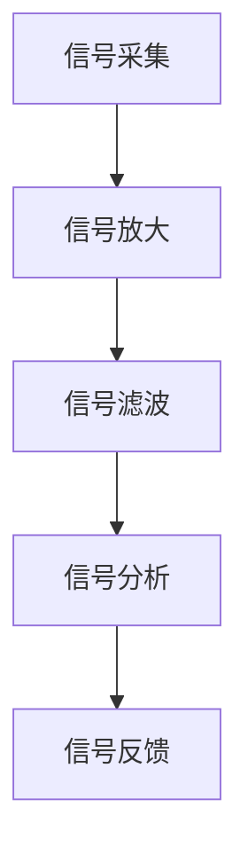

                 

。

## 引言

在当今社会，人们面临着日益增加的生活压力和工作压力，身心健康问题逐渐引起广泛关注。与此同时，计算机科学和心理学领域的不断进步，为解决这一难题提供了新的可能性。生物反馈游戏作为一种新兴的教育和娱乐形式，通过结合计算机科学和心理学技术，实现了身心调节的目的。本文旨在探讨生物反馈游戏的设计原理、技术实现方法以及实际应用案例，帮助读者全面了解这一领域的前沿动态。

### 关键词

- 生物反馈游戏
- 计算机科学
- 心理学
- 心身调节
- 教育娱乐

### 摘要

本文首先介绍了生物反馈游戏的基本概念、背景和重要性，随后深入探讨了生物反馈游戏的设计原则、核心概念及其相互关系。接着，通过具体的案例分析，展示了生物反馈游戏在实际应用中的效果和潜力。最后，本文总结了生物反馈游戏的研究现状和未来发展趋势，为相关领域的进一步研究提供了参考。

---

### 第一部分：背景介绍

#### 1.1.1 问题背景

随着科技的飞速发展，计算机科学和心理学领域不断融合，一种新型的游戏形式——生物反馈游戏应运而生。这类游戏不仅具有娱乐性，还通过生物反馈技术帮助用户进行身心调节。生物反馈游戏将教育与娱乐完美结合，使其在心理治疗、压力管理、注意力训练等多个领域展现出巨大的潜力。

#### 1.1.2 问题描述

生物反馈游戏作为一种新兴的教育方式，其设计原则、应用场景以及效果评估等方面仍存在诸多挑战。如何设计出既有趣又能有效调节身心状态的生物反馈游戏，成为当前研究的热点问题。

#### 1.1.3 问题解决

本书旨在通过系统性地介绍生物反馈游戏的设计原理、技术实现方法以及实际应用案例，为研究者、开发者及教育工作者提供有价值的参考。通过本书，读者将深入了解生物反馈游戏的内涵、外延及其核心要素。

#### 1.1.4 边界与外延

生物反馈游戏涵盖的领域广泛，既包括计算机科学，又涉及心理学、教育学等多个学科。因此，本书在探讨生物反馈游戏时，将尽量涵盖相关领域的知识，以便为读者提供全面的理解。

#### 1.1.5 概念结构与核心要素组成

生物反馈游戏的核心概念包括：生物反馈技术、游戏设计原则、身心调节机制以及效果评估方法。这些概念相互联系，共同构成了生物反馈游戏的基本框架。以下是这些核心概念的特征对比表格：

| 核心概念 | 特征 |
| :----: | :----: |
| 生物反馈技术 | 利用生理信号来监测和调节个体的生理和心理状态 |
| 游戏设计原则 | 结合娱乐性和教育性，注重用户体验和游戏机制的创新性 |
| 身心调节机制 | 通过游戏过程中的生物反馈，实现个体身心状态的调节 |
| 效果评估方法 | 运用科学的方法和工具，对生物反馈游戏的效果进行评估 |

接下来，我们将使用 Mermaid 画出 ER 实体关系图，以更直观地展示这些核心概念之间的关系。

```mermaid
erDiagram
  Game |-> BiologialFeedback : uses
  Game |-> RegulationMechanism : has
  Game |-> EvaluationMethod : evaluates
  BiologialFeedback |--| RegulationMechanism
  EvaluationMethod |..| BiologialFeedback
```

通过上述背景介绍，读者可以对生物反馈游戏的基本概念和结构有初步的了解。在接下来的章节中，我们将深入探讨生物反馈游戏的设计原则、技术实现方法以及实际应用案例，帮助读者全面掌握这一新兴领域的知识。## 第一部分：背景介绍

### 1.1.1 问题背景

随着科技的飞速发展，计算机科学和心理学领域的交叉融合不断深化，生物反馈游戏作为一种创新性的游戏形式，逐渐走入人们的视野。生物反馈游戏利用计算机技术，实时监测用户的生理信号（如心率、呼吸、肌电等），并通过游戏反馈机制帮助用户调节身心状态。这种游戏不仅具备娱乐性，还能在心理治疗、压力管理、情绪调节、注意力提升等方面发挥重要作用，具有广泛的应用前景。

#### 核心概念术语说明

- 生物反馈技术：通过测量和分析用户的生理信号，将生理信息转化为游戏中的反馈信息，帮助用户调节身心状态。
- 心理治疗：利用生物反馈游戏帮助用户缓解心理问题，如焦虑、抑郁等。
- 压力管理：通过生物反馈游戏帮助用户降低压力水平，提高心理健康。
- 情绪调节：利用生物反馈游戏帮助用户识别和调节情绪，提升情绪管理能力。
- 注意力提升：通过生物反馈游戏训练用户的注意力，提高专注力。

#### 问题背景详细阐述

在现代社会，由于生活节奏加快、工作压力增大，越来越多的人面临着心理健康问题。这些问题不仅影响个体的生活质量，还会对工作效率产生负面影响。传统的心理治疗和压力管理方法虽然有效，但往往需要专业人员的指导和长时间的治疗过程。而生物反馈游戏以其独特的优势，为心理健康问题提供了一种新颖的解决方案。

首先，生物反馈游戏通过实时监测用户的生理信号，能够快速、直观地了解用户的身心状态。这种实时反馈机制使得用户可以及时调整自己的行为，从而更好地调节身心状态。其次，生物反馈游戏将教育与娱乐相结合，用户在享受游戏乐趣的同时，不知不觉地进行心理调节。这种方式不仅提高了用户的积极性，还能在一定程度上降低心理治疗的抵触情绪。最后，生物反馈游戏具有高度的个性化定制能力，可以根据不同用户的需求和特点，提供个性化的调节方案。

#### 挑战与机遇

尽管生物反馈游戏具有巨大的潜力，但在实际应用中仍面临着一些挑战。首先，如何设计出既有趣又能有效调节身心状态的生物反馈游戏，是当前研究的一个关键问题。游戏的设计需要充分考虑用户体验，同时结合心理学的理论和方法，以达到最佳的调节效果。其次，生物反馈技术的准确性和稳定性也是一个重要的挑战。生理信号的检测和传输需要高度可靠的技术支持，否则可能会影响游戏的反馈效果。此外，如何对生物反馈游戏的效果进行科学评估，也是一个亟待解决的问题。科学、系统的评估方法可以帮助研究者更好地了解生物反馈游戏的实际效果，为其进一步优化提供依据。

然而，挑战与机遇并存。随着技术的不断进步和心理学研究的深入，生物反馈游戏在心理健康领域的应用前景将越来越广阔。通过不断创新和优化，生物反馈游戏有望成为心理健康维护和治疗的一种重要手段。

### 1.1.2 问题描述

生物反馈游戏作为一种新兴的教育方式，其设计原则、应用场景以及效果评估等方面仍存在诸多挑战。如何设计出既有趣又能有效调节身心状态的生物反馈游戏，成为当前研究的热点问题。

#### 设计原则

生物反馈游戏的设计原则主要包括以下几个方面：

1. **娱乐性**：游戏应具备良好的娱乐性，以吸引和保持用户的兴趣。
2. **教育性**：游戏应包含教育性的内容，帮助用户学习心理健康知识。
3. **个性化**：游戏应根据用户的个体差异，提供个性化的调节方案。
4. **实时反馈**：游戏应实时监测用户的生理信号，并给出相应的反馈，以帮助用户调节身心状态。

#### 应用场景

生物反馈游戏的应用场景非常广泛，主要包括以下几个方面：

1. **心理健康治疗**：利用生物反馈游戏帮助用户缓解焦虑、抑郁等心理问题。
2. **压力管理**：通过生物反馈游戏降低用户的压力水平，提高心理健康。
3. **情绪调节**：利用生物反馈游戏帮助用户识别和调节情绪，提升情绪管理能力。
4. **注意力训练**：通过生物反馈游戏训练用户的注意力，提高专注力。

#### 效果评估

生物反馈游戏的效果评估是一个复杂的过程，需要采用科学的方法和工具进行。主要评估指标包括：

1. **生理指标**：如心率、呼吸频率、肌电信号等。
2. **心理指标**：如情绪状态、焦虑水平、抑郁症状等。
3. **游戏体验**：用户的满意度、游戏参与度等。

#### 挑战

在生物反馈游戏的设计和应用中，面临着以下挑战：

1. **游戏设计**：如何平衡娱乐性和教育性，设计出既有趣又能有效调节身心状态的游戏。
2. **技术实现**：生物反馈技术的准确性和稳定性要求较高，需要不断优化和改进。
3. **效果评估**：科学、系统地评估生物反馈游戏的效果，需要采用多种评估方法和工具。

### 1.1.3 问题解决

本书旨在通过系统性地介绍生物反馈游戏的设计原理、技术实现方法以及实际应用案例，为研究者、开发者及教育工作者提供有价值的参考。通过本书，读者将深入了解生物反馈游戏的内涵、外延及其核心要素，掌握生物反馈游戏的设计原则和技术实现方法，并了解其在心理健康领域的应用前景。

#### 边界与外延

生物反馈游戏涵盖了计算机科学、心理学、教育学等多个领域，其应用范围广泛。在本书中，我们将重点关注以下几个方面：

1. **计算机科学**：介绍生物反馈技术的基本原理和实现方法，包括生理信号的采集、处理和分析等。
2. **心理学**：探讨生物反馈游戏在心理治疗、压力管理、情绪调节等方面的应用，以及相关心理学理论的支持。
3. **教育学**：分析生物反馈游戏在教育领域的应用，如注意力训练、学习效果提升等。
4. **实际应用案例**：介绍生物反馈游戏的实际应用案例，分析其效果和影响。

### 1.1.5 概念结构与核心要素组成

生物反馈游戏的核心概念包括生物反馈技术、游戏设计原则、身心调节机制以及效果评估方法。这些核心概念相互联系，共同构成了生物反馈游戏的基本框架。

#### 核心概念原理

1. **生物反馈技术**：利用生理信号监测和调节个体的身心状态，是生物反馈游戏的核心技术。通过采集生理信号（如心率、呼吸、肌电等），进行处理和分析，将生理信息转化为游戏中的反馈信息，帮助用户调节身心状态。

2. **游戏设计原则**：生物反馈游戏的设计原则主要包括娱乐性、教育性、个性化、实时反馈等。这些原则旨在提高用户的参与度和游戏效果，同时确保游戏的教育性。

3. **身心调节机制**：生物反馈游戏通过游戏过程中的生物反馈，实现个体身心状态的调节。例如，通过实时心率监测，用户可以在游戏中调整自己的呼吸节奏，从而达到放松身心、降低压力的效果。

4. **效果评估方法**：生物反馈游戏的效果评估采用科学的方法和工具，包括生理指标、心理指标和游戏体验等。通过这些评估方法，研究者可以全面了解生物反馈游戏的效果，为优化设计提供依据。

#### 概念属性特征对比表格

| 核心概念       | 特征                                                         |
| -------------- | ------------------------------------------------------------ |
| 生物反馈技术   | 利用生理信号监测和调节个体的身心状态                           |
| 游戏设计原则   | 结合娱乐性和教育性，注重用户体验和游戏机制的创新性             |
| 身心调节机制   | 通过游戏过程中的生物反馈，实现个体身心状态的调节               |
| 效果评估方法   | 运用科学的方法和工具，对生物反馈游戏的效果进行评估             |

#### ER实体关系图架构

为了更直观地展示生物反馈游戏的核心概念及其相互关系，我们使用Mermaid绘制了ER实体关系图：

```mermaid
erDiagram
    Game    ||--|{ BiologialFeedback }||   :uses
    Game    ||--|{ RegulationMechanism }||   :has
    Game    ||--|{ EvaluationMethod }||   :evaluates
    BiologialFeedback    ||--|{ RegulationMechanism }||   :uses
    EvaluationMethod    ||--|{ BiologialFeedback }||   :uses
```

通过上述背景介绍，读者可以对生物反馈游戏的基本概念和结构有初步的了解。在接下来的章节中，我们将深入探讨生物反馈游戏的设计原则、技术实现方法以及实际应用案例，帮助读者全面掌握这一新兴领域的知识。

---

### 生物反馈技术原理

生物反馈技术是生物反馈游戏的核心技术，通过监测和分析用户的生理信号，将生理信息转化为游戏中的反馈信息，帮助用户调节身心状态。以下是生物反馈技术的基本原理、工作流程以及相关技术指标。

#### 1. 基本原理

生物反馈技术利用传感器实时采集用户的生理信号，如心率、呼吸、肌电等。这些生理信号反映了用户的生理和心理状态。通过生物反馈设备（如传感器、放大器、信号处理器等）对采集到的信号进行处理和分析，提取有用的生理信息，并将其转化为可以识别的视觉、声音或触觉反馈。

#### 2. 工作流程

生物反馈技术的工作流程主要包括以下步骤：

1. **信号采集**：使用传感器（如心率传感器、呼吸传感器、肌电传感器等）采集用户的生理信号。
2. **信号放大**：通过放大器对采集到的微弱信号进行放大，提高信号强度，以便后续处理。
3. **信号滤波**：对放大后的信号进行滤波处理，去除噪声和干扰，提取纯净的生理信号。
4. **信号分析**：利用信号处理算法对滤波后的信号进行分析，提取有用的生理信息，如心率、呼吸频率、肌电信号等。
5. **信号反馈**：将提取的生理信息转化为视觉、声音或触觉反馈，传递给用户，帮助用户了解自己的生理状态，并对其进行调节。

#### 3. 相关技术指标

在生物反馈技术中，一些重要的技术指标包括：

- **心率（Heart Rate, HR）**：心率是生物反馈游戏中最为常见的一个指标。通过监测心率，用户可以了解自己的心脏活动情况，并调整呼吸节奏，以达到放松身心、降低压力的效果。
- **呼吸频率（Respiratory Rate, RR）**：呼吸频率反映了用户的呼吸状态。通过监测呼吸频率，用户可以调整呼吸节奏，帮助自己更好地进行身心调节。
- **肌电信号（Electromyography, EMG）**：肌电信号反映了肌肉的活性。通过监测肌电信号，用户可以了解自己的肌肉状态，并在游戏过程中进行相应的调节，如放松肌肉、提高专注力等。
- **信号质量（Signal Quality, SQ）**：信号质量是衡量生物反馈信号稳定性和可靠性的重要指标。高质量的生物反馈信号可以提供更准确、更稳定的反馈信息，帮助用户更好地进行身心调节。

#### 4. 生物反馈技术原理图解

为了更直观地展示生物反馈技术的原理，我们使用Mermaid绘制了以下流程图：



在这个流程图中，A表示信号采集，B表示信号放大，C表示信号滤波，D表示信号分析，E表示信号反馈。通过这个流程，生物反馈技术实现了对用户生理信号的实时监测和调节。

### 小结

生物反馈技术通过实时监测用户的生理信号，将生理信息转化为游戏中的反馈信息，帮助用户调节身心状态。其基本原理包括信号采集、信号放大、信号滤波、信号分析和信号反馈。相关技术指标如心率、呼吸频率、肌电信号等，对于实现有效的身心调节具有重要意义。通过上述原理和流程的讲解，读者可以对生物反馈技术有更深入的理解。

---

### 游戏设计原则

生物反馈游戏作为一项新兴的教育和娱乐形式，其成功与否在很大程度上取决于游戏设计。为了实现既有趣又能有效调节身心状态的目标，游戏设计需遵循一系列原则，确保用户体验和游戏机制的创新性。以下将详细阐述生物反馈游戏设计的主要原则，并对比分析不同设计原则在实践中的应用效果。

#### 1. 娱乐性原则

娱乐性原则是生物反馈游戏设计的基础，旨在通过丰富的游戏内容和多样化的玩法吸引玩家，提高他们的游戏参与度和乐趣。具体包括以下几个方面：

- **游戏内容**：设计有趣、富有挑战性的游戏内容，如解谜、冒险、竞技等，激发玩家的兴趣。
- **游戏机制**：引入多样化的游戏机制，如任务系统、排行榜、奖励机制等，增强玩家的互动性和竞争性。
- **音效与画面**：利用高质量的音效和画面效果，提升游戏的整体体验感。

**案例分析**：例如，一款名为“心跳解谜”的游戏，玩家需要在心跳频率稳定的情况下解开谜题。游戏通过音效和视觉反馈，实时显示玩家的心跳变化，使玩家在解谜过程中体验到紧张刺激的感觉。

#### 2. 教育性原则

教育性原则强调游戏中的教育内涵，通过游戏传达心理健康知识，帮助玩家在娱乐中学习。这一原则主要体现在以下几个方面：

- **知识点融入**：将心理健康知识巧妙地融入到游戏设计中，让玩家在游戏过程中潜移默化地学习。
- **互动学习**：通过游戏中的互动环节，如问答、讨论等，激发玩家的学习兴趣和主动性。
- **个性化指导**：根据玩家的生理和心理特征，提供个性化的学习指导和建议。

**案例分析**：一款名为“呼吸训练”的游戏，通过引导玩家进行深呼吸训练，帮助他们学会放松身心。游戏过程中，玩家可以通过呼吸频率的实时监测和反馈，了解自己的呼吸状态，从而掌握正确的呼吸技巧。

#### 3. 个性化原则

个性化原则强调根据玩家的个体差异，提供个性化的游戏体验和调节方案。这一原则主要体现在以下几个方面：

- **生理特征识别**：通过生物反馈技术识别玩家的生理特征，如心率、呼吸频率等，为玩家提供定制化的游戏体验。
- **心理特征分析**：结合心理学理论，分析玩家的心理特征，如情绪状态、压力水平等，为玩家提供针对性的调节建议。
- **反馈调整**：根据玩家的反馈和调节效果，实时调整游戏内容和机制，以提高调节效果。

**案例分析**：一款名为“情绪调节器”的游戏，通过监测玩家的情绪变化，提供不同的游戏模式，如放松模式、兴奋模式等。玩家可以根据自己的情绪状态选择合适的游戏模式，进行个性化的情绪调节。

#### 4. 实时反馈原则

实时反馈原则是生物反馈游戏的核心设计原则，旨在通过实时监测玩家的生理信号，提供即时的反馈信息，帮助玩家了解自己的身心状态，并进行调节。这一原则主要体现在以下几个方面：

- **实时监测**：利用生物反馈技术实时监测玩家的生理信号，如心率、呼吸频率等。
- **即时反馈**：将监测到的生理信号转化为视觉、声音或触觉反馈，实时传递给玩家。
- **动态调整**：根据玩家的反馈和行为调整游戏机制，以实现更好的调节效果。

**案例分析**：一款名为“身心平衡”的游戏，通过监测玩家的心跳和呼吸，实时显示玩家的身心状态。当玩家心跳过快或呼吸急促时，游戏会提示玩家进行深呼吸或放松肌肉，帮助玩家实现身心平衡。

#### 5. 安全性原则

安全性原则强调在游戏设计中确保玩家的生理和心理安全。这一原则主要体现在以下几个方面：

- **信号监测安全**：确保生物反馈信号的采集和处理过程安全可靠，避免对身体造成伤害。
- **隐私保护**：保护玩家的个人信息和生理数据，防止数据泄露。
- **紧急情况应对**：在游戏过程中，设置紧急情况应对机制，如心跳过快或过慢时的报警和应急措施。

**案例分析**：一款名为“压力管理器”的游戏，在玩家心跳过快或呼吸急促时，会发出警报并提示玩家进行紧急放松。游戏还提供了专业的心理咨询服务，帮助玩家应对紧急情况。

#### 设计原则对比分析

以下是对上述五个设计原则的对比分析：

| 设计原则 | 特点 | 应用效果 |
| :----: | :----: | :----: |
| 娱乐性原则 | 强调游戏娱乐性，提高玩家参与度 | 提高游戏乐趣，增加玩家粘性 |
| 教育性原则 | 强调游戏教育性，传播心理健康知识 | 增强玩家的心理健康意识，促进知识学习 |
| 个性化原则 | 强调根据玩家个体差异提供个性化体验 | 提高游戏调节效果，满足玩家需求 |
| 实时反馈原则 | 强调实时监测和反馈，帮助玩家调节身心状态 | 提高游戏调节效果，增强玩家体验 |
| 安全性原则 | 强调生理和心理安全，保障玩家健康 | 提高游戏安全性，降低风险 |

通过上述分析，可以看出，生物反馈游戏设计原则在实践中的效果各有优劣，需要根据具体应用场景和目标进行选择和调整。在实际设计中，通常需要综合考虑多个设计原则，以实现最佳的游戏体验和调节效果。

---

### 身心调节机制

生物反馈游戏的核心目标是通过调节用户的身心状态，提升其心理健康水平。为了实现这一目标，游戏设计需要构建有效的身心调节机制，通过生物反馈技术的实时监测和反馈，帮助用户达到身心平衡。以下将详细阐述身心调节机制的设计原理、具体方法以及其实际应用。

#### 1. 设计原理

身心调节机制的设计基于以下几个核心原理：

- **实时监测**：通过生物反馈技术实时监测用户的生理信号（如心率、呼吸、肌电等），获取用户的当前身心状态。
- **即时反馈**：将监测到的生理信号转化为可感知的反馈信息（如视觉、声音、触觉等），及时传递给用户，帮助用户了解自己的身心状态。
- **动态调整**：根据用户的反馈和行为，动态调整游戏机制和调节策略，以实现最佳的调节效果。

#### 2. 具体方法

身心调节机制的具体方法包括以下几个方面：

- **呼吸调节**：通过引导用户进行深呼吸练习，降低呼吸频率，减缓心跳，从而减轻紧张和压力。例如，游戏可以设置一个呼吸球，用户需要通过控制呼吸球的大小来完成任务，从而学会正确的呼吸方法。
- **心率调节**：通过监测用户的心率，引导用户进行放松训练，如冥想、瑜伽等。游戏可以设置一个心率监测器，实时显示用户的心率，当心率过高时，游戏会提示用户进行放松。
- **情绪调节**：通过分析用户的情绪变化，提供针对性的调节建议。例如，当用户情绪低落时，游戏可以播放轻松的音乐，或引导用户进行正向思考练习。
- **注意力调节**：通过训练用户的注意力，提高专注力。例如，游戏可以设置一些需要高度集中注意力的任务，如追踪移动的物体、完成复杂的拼图等。

#### 3. 实际应用

以下是一些具体的实际应用案例：

- **压力管理**：一款名为“减压游戏”的应用，通过实时监测用户的心率和呼吸，引导用户进行深呼吸和放松练习，帮助用户降低压力水平。
- **情绪调节**：一款名为“情绪调节器”的游戏，通过分析用户的情绪变化，提供针对性的调节建议，如播放音乐、进行冥想练习等，帮助用户调节情绪。
- **注意力训练**：一款名为“专注力训练师”的游戏，通过设置各种需要高度集中注意力的任务，如追踪移动的物体、完成复杂的拼图等，训练用户的注意力。

#### 4. 具体应用案例

以下是两个具体的生物反馈游戏案例，展示了身心调节机制在实际应用中的效果：

**案例一：**“心跳解谜”

- **游戏玩法**：玩家需要在心跳频率稳定的情况下解开谜题，以避免心跳过快导致游戏失败。
- **身心调节**：游戏通过实时监测玩家的心跳，当心跳过快时，游戏会提示玩家进行深呼吸以减缓心跳。通过这种方式，玩家可以在解谜过程中学会控制自己的情绪和压力。
- **效果**：玩家在游戏中学会了如何通过深呼吸和放松技巧来调节自己的心跳，从而在现实生活中更好地应对压力和紧张情绪。

**案例二：**“呼吸训练”

- **游戏玩法**：玩家需要通过控制呼吸节奏来完成任务，如调整呼吸球的大小，以使其保持稳定。
- **身心调节**：游戏通过实时监测玩家的呼吸频率，引导玩家进行深呼吸练习，帮助玩家降低呼吸频率，减缓心跳，从而达到放松身心的效果。
- **效果**：玩家通过游戏学会了正确的呼吸方法，提高了呼吸调节能力，从而在日常生活中更好地应对压力和焦虑。

#### 5. 总结

通过以上分析，可以看出，生物反馈游戏的身心调节机制设计基于实时监测、即时反馈和动态调整的原则，通过具体的调节方法，如呼吸调节、心率调节、情绪调节和注意力训练等，帮助用户实现身心平衡。实际应用案例表明，生物反馈游戏在压力管理、情绪调节和注意力提升等方面具有显著效果，为心理健康维护提供了新的途径。

---

### 效果评估方法

评估生物反馈游戏的效果是确保其有效性和可靠性的关键步骤。科学、系统的评估方法可以帮助研究者了解生物反馈游戏的实际效果，为优化设计提供依据。以下将详细介绍生物反馈游戏效果评估的方法、评估指标以及常见的数据分析方法。

#### 1. 评估方法

生物反馈游戏效果评估的方法可以分为定量评估和定性评估两种：

- **定量评估**：通过定量数据来评估生物反馈游戏的效果。这种方法通常使用生理信号（如心率、呼吸频率、肌电信号等）和心理指标（如情绪状态、焦虑水平等）作为评估依据。
- **定性评估**：通过用户反馈、访谈和观察等方式来评估生物反馈游戏的用户体验和满意度。

#### 2. 评估指标

在生物反馈游戏效果评估中，常用的评估指标包括以下几类：

- **生理指标**：如心率、呼吸频率、肌电信号等。这些指标可以直接反映用户的生理状态，评估游戏对用户身心调节的效果。
- **心理指标**：如情绪状态、焦虑水平、抑郁症状等。这些指标可以通过问卷调查、心理测量工具等获取，评估游戏对用户心理健康的影响。
- **游戏体验指标**：如游戏的趣味性、参与度、满意度等。这些指标可以通过用户反馈、访谈等方式获取，评估游戏的用户体验。

#### 3. 常见的数据分析方法

在生物反馈游戏效果评估中，常用的数据分析方法包括以下几种：

- **统计分析**：使用统计学方法对采集到的数据进行分析，如均值、方差、相关性分析等。通过统计分析，可以揭示数据之间的关系和规律。
- **机器学习**：利用机器学习算法对生物反馈信号进行分类、聚类和预测等。这种方法可以进一步提高评估的准确性和可靠性。
- **可视化分析**：使用可视化工具将生物反馈信号、心理指标和游戏体验指标等数据以图形形式展示，便于理解和分析。

#### 4. 实际评估案例

以下是一个具体的生物反馈游戏评估案例：

**案例**：“呼吸训练”游戏

- **评估方法**：采用定量评估和定性评估相结合的方法。定量评估主要通过生理信号（如呼吸频率、心率）和心理指标（如焦虑水平、情绪状态）来评估游戏效果。定性评估通过用户问卷和访谈来收集用户对游戏的满意度、参与度等。
- **评估指标**：生理指标包括呼吸频率、心率；心理指标包括焦虑水平、情绪状态；游戏体验指标包括满意度、参与度。
- **数据分析**：使用统计分析方法对采集到的生理信号进行均值、方差等分析，以评估游戏对用户身心调节的效果。使用机器学习方法对呼吸频率和心率数据进行分析，预测用户在游戏过程中的心理状态变化。通过用户问卷和访谈，收集用户对游戏的满意度、参与度等数据，进行定性分析。
- **评估结果**：结果显示，游戏在降低用户呼吸频率、心率，提高焦虑水平和情绪状态方面具有显著效果。用户对游戏的满意度较高，参与度也较为积极。

#### 5. 总结

通过科学、系统的评估方法，可以全面了解生物反馈游戏的实际效果，为优化设计提供依据。评估指标的选择和分析方法的运用对于评估结果的准确性和可靠性具有重要意义。实际评估案例表明，生物反馈游戏在身心调节和心理治疗方面具有显著效果，为心理健康维护提供了新的途径。

---

### 生物反馈游戏在心理治疗、压力管理、注意力训练等领域的应用

生物反馈游戏作为一种新兴的教育和娱乐形式，其在心理治疗、压力管理、注意力训练等领域的应用逐渐受到关注。以下将详细探讨生物反馈游戏在这些领域的应用现状、优势以及面临的挑战。

#### 心理治疗

生物反馈游戏在心理治疗中的应用主要体现在以下几个方面：

- **焦虑治疗**：通过引导用户进行深呼吸和放松训练，帮助用户缓解焦虑症状。例如，“呼吸训练”游戏通过实时监测用户的呼吸频率和心率，引导用户进行深呼吸练习，从而降低焦虑水平。
- **抑郁治疗**：通过引导用户进行情绪调节和认知重构，帮助用户改善抑郁情绪。例如，“情绪调节器”游戏通过分析用户的情绪状态，提供相应的调节建议，如听音乐、进行冥想等。
- **强迫症治疗**：通过训练用户的自我控制能力，帮助用户克服强迫症状。例如，“强迫症挑战”游戏通过设置一系列需要用户自我控制的任务，如按顺序点击按钮等，帮助用户提高自我控制能力。

**优势**：

- **趣味性**：游戏形式使得心理治疗过程更加有趣，提高了用户的参与度和积极性。
- **个性化**：生物反馈技术可以根据用户的个体差异，提供个性化的治疗建议，提高治疗效果。
- **便捷性**：用户可以在家中随时随地使用生物反馈游戏进行心理治疗，不受时间和地点限制。

**挑战**：

- **效果评估**：如何科学、系统地评估生物反馈游戏在心理治疗中的效果，仍需进一步研究。
- **技术实现**：生物反馈技术的准确性和稳定性是保证治疗效果的关键，需要不断优化和改进。

#### 压力管理

生物反馈游戏在压力管理中的应用主要体现在以下几个方面：

- **压力监测**：通过实时监测用户的生理信号（如心率、呼吸频率等），帮助用户了解自己的压力水平，从而采取相应的调节措施。
- **放松训练**：通过引导用户进行深呼吸、冥想等放松训练，帮助用户降低压力水平。
- **行为调节**：通过设计游戏任务，引导用户改变不良的生活习惯和行为，如减少使用电子产品的时间、增加运动等。

**优势**：

- **实时反馈**：生物反馈游戏可以实时监测用户的生理信号，提供即时的反馈信息，帮助用户及时调整压力水平。
- **互动性**：游戏形式使得压力管理过程更加有趣和互动，提高了用户的参与度和积极性。
- **个性化**：根据用户的个体差异，生物反馈游戏可以提供个性化的调节方案，提高效果。

**挑战**：

- **游戏设计**：如何设计出既有趣又能有效调节压力的游戏，是当前研究的热点问题。
- **技术实现**：生物反馈技术的准确性和稳定性是保证调节效果的关键，需要不断优化和改进。

#### 注意力训练

生物反馈游戏在注意力训练中的应用主要体现在以下几个方面：

- **专注力训练**：通过设置需要高度集中注意力的任务，如追踪移动的物体、完成复杂的拼图等，帮助用户提高专注力。
- **多任务处理**：通过设计需要用户同时处理多个任务的场景，如同时跟踪多个目标、完成任务等，帮助用户提高多任务处理能力。
- **时间管理**：通过引导用户合理安排时间，进行有效的任务管理，提高时间利用率。

**优势**：

- **趣味性**：游戏形式使得注意力训练过程更加有趣，提高了用户的参与度和积极性。
- **互动性**：游戏形式提供了丰富的互动元素，可以帮助用户更好地理解和掌握注意力训练的方法。
- **个性化**：根据用户的个体差异，生物反馈游戏可以提供个性化的训练方案，提高效果。

**挑战**：

- **效果评估**：如何科学、系统地评估生物反馈游戏在注意力训练中的效果，仍需进一步研究。
- **技术实现**：生物反馈技术的准确性和稳定性是保证训练效果的关键，需要不断优化和改进。

#### 总结

生物反馈游戏在心理治疗、压力管理、注意力训练等领域的应用具有显著的优势，但也面临着一定的挑战。通过不断优化游戏设计和技术实现，生物反馈游戏有望在心理健康维护和治疗方面发挥更大的作用。

---

### 生物反馈游戏的设计原则与技术实现方法

在生物反馈游戏的设计过程中，必须充分考虑其设计原则和技术实现方法，以确保游戏能够既具备娱乐性，又能有效调节用户的身心状态。以下将详细探讨生物反馈游戏的设计原则、核心算法和技术实现方法。

#### 设计原则

1. **实时反馈**：生物反馈游戏的核心在于实时监测用户的生理信号，并给予即时反馈。这一原则要求游戏具备高效的信号采集、处理和反馈机制，以确保用户能够实时了解自己的身心状态，并作出相应的调节。
   
2. **个性化定制**：每个用户都有其独特的生理和心理特征，因此，游戏设计应考虑个性化定制，根据用户的个体差异提供针对性的调节方案。例如，通过分析用户的历史数据，为用户提供最适合其当前状态的生物反馈调节建议。

3. **教育性**：生物反馈游戏不仅要提供娱乐体验，还应具有教育性，帮助用户学习心理健康知识。游戏内容应融入心理学的理论和实践，通过互动和体验让用户更好地理解自己的身心状态，并学会调节方法。

4. **用户友好性**：游戏设计应注重用户体验，界面简洁易用，操作直观，以减少用户的学习成本，提高游戏的可接受性和参与度。

#### 核心算法

生物反馈游戏的核心算法主要包括生理信号的采集与处理、数据分析和反馈生成等。以下是一些关键算法：

1. **生理信号采集**：常用的生理信号包括心率、呼吸频率、肌电信号等。游戏设备需要配备相应的传感器，如心率传感器、呼吸传感器和肌电传感器等，以实时采集用户的生理信号。

2. **生理信号处理**：生理信号采集后，需要通过滤波、放大、去噪等处理技术，提取有用的生理信息。常用的滤波方法包括低通滤波、高通滤波和带通滤波等。

3. **数据分析**：通过对生理信号进行频域分析、时域分析和特征提取等，获取用户的生理和心理状态。例如，心率变异性分析可以揭示用户的心脏调节能力，呼吸频率分析可以评估用户的呼吸调节能力。

4. **反馈生成**：根据用户当前的生理和心理状态，生成相应的视觉、声音或触觉反馈。例如，当用户的心率过快时，可以通过视觉或声音提示用户进行深呼吸，以降低心率。

#### 技术实现方法

1. **硬件选择**：选择合适的生理信号采集设备，如心率传感器、呼吸传感器和肌电传感器等。这些设备应具备高精度、低延迟和高可靠性的特点。

2. **软件开发**：开发生物反馈游戏的软件部分，包括信号采集、处理和反馈模块。软件部分需要使用专业的生理信号处理库，如MATLAB、Python等，以确保信号处理的准确性和效率。

3. **界面设计**：设计直观、易用的用户界面，提供清晰的实时反馈信息，帮助用户了解自己的身心状态。界面设计应简洁、美观，以提高用户的使用体验。

4. **数据存储与传输**：建立数据存储与传输机制，将用户的生理信号数据和安全信息存储在服务器上，并进行加密传输，确保用户数据的安全性和隐私性。

#### 案例分析

以“呼吸训练”游戏为例，其设计原则和实现方法如下：

- **设计原则**：实时反馈、个性化定制、教育性和用户友好性。
- **核心算法**：呼吸频率监测、心率监测、数据分析、反馈生成。
- **技术实现方法**：
  - **硬件选择**：使用心率传感器和呼吸传感器。
  - **软件开发**：使用Python编写信号采集和处理程序，使用MATLAB进行数据分析和反馈生成。
  - **界面设计**：使用Unity游戏引擎开发界面，实现实时视觉和声音反馈。
  - **数据存储与传输**：使用MySQL数据库存储用户数据，使用HTTPS协议进行数据传输。

通过上述案例分析，可以看出生物反馈游戏的设计和实现涉及多个方面，需要综合考虑设计原则、核心算法和技术实现方法，以确保游戏能够达到预期效果。

---

### 系统分析与架构设计方案

在深入探讨生物反馈游戏的设计与实现之前，我们首先需要对整个系统进行详细的系统分析，并设计出合理的架构方案。以下将介绍系统分析的背景、项目介绍、系统功能设计、系统架构设计、系统接口设计和系统交互等内容。

#### 系统分析背景

随着现代社会的快速发展，人们的生活压力逐渐增大，心理健康问题日益突出。生物反馈游戏作为一种创新的解决方式，结合了计算机科学和心理学技术，旨在通过实时监测用户的生理信号，提供个性化的身心调节方案，帮助用户缓解压力、改善情绪、提高注意力。为了实现这一目标，我们需要对系统进行详细的分析和设计，确保其功能的完整性和性能的稳定性。

#### 项目介绍

本项目的目标是开发一款基于生物反馈技术的游戏，旨在通过实时监测用户的生理信号，提供个性化的身心调节方案。项目的主要功能包括：

1. **用户管理**：实现用户的注册、登录和个性化设置。
2. **生理信号采集**：实时采集用户的心率、呼吸频率、肌电信号等生理信号。
3. **信号处理**：对采集到的生理信号进行滤波、放大、去噪等处理。
4. **数据分析**：分析用户的生理和心理状态，提供个性化的调节建议。
5. **游戏机制**：设计多样化的游戏机制，结合实时反馈，帮助用户进行身心调节。

#### 系统功能设计

系统功能设计包括以下几个方面：

1. **用户管理模块**：实现用户的注册、登录、资料修改等功能，并提供用户个性化设置选项。
2. **生理信号采集模块**：使用传感器采集用户的心率、呼吸频率、肌电信号等生理信号，并通过无线传输模块将数据发送至服务器。
3. **信号处理模块**：对采集到的生理信号进行预处理，包括滤波、放大、去噪等，以提高信号质量。
4. **数据分析模块**：利用信号处理结果，结合心理学理论，分析用户的生理和心理状态，提供个性化的调节建议。
5. **游戏机制模块**：设计多样化的游戏机制，如解谜、竞技、训练等，结合实时反馈，帮助用户进行身心调节。

#### 系统架构设计

系统架构设计采用分布式架构，主要包括前端界面、后端服务、数据存储和通信网络等部分。以下为系统架构设计：

1. **前端界面**：使用HTML、CSS和JavaScript等前端技术实现用户界面，包括用户注册、登录、信号监测、游戏操作等界面。
2. **后端服务**：使用Python和Django等后端技术实现业务逻辑，包括用户管理、生理信号处理、数据分析、游戏机制等模块。
3. **数据存储**：使用MySQL数据库存储用户信息、生理信号数据和调节建议等。
4. **通信网络**：使用WebSocket协议实现实时数据传输，确保生理信号和反馈信息的及时传递。

#### 系统接口设计

系统接口设计主要包括以下几个方面：

1. **用户管理接口**：实现用户注册、登录、资料修改等功能。
2. **信号采集接口**：实现生理信号采集、预处理和上传等功能。
3. **数据分析接口**：实现生理信号分析、调节建议生成等功能。
4. **游戏机制接口**：实现游戏机制配置、任务分配、反馈生成等功能。

#### 系统交互

系统交互设计主要包括用户与前端界面、前端与后端服务、后端服务与数据存储等三个层面。以下为系统交互设计：

1. **用户与前端界面**：用户通过前端界面进行注册、登录、信号监测和游戏操作，前端界面通过Ajax技术向后端服务发送请求，获取数据并更新界面。
2. **前端与后端服务**：前端界面通过HTTP/HTTPS协议向后端服务发送请求，后端服务返回相应的数据或结果。
3. **后端服务与数据存储**：后端服务通过SQL语句对MySQL数据库进行操作，存储和查询用户信息、生理信号数据等。

通过上述系统分析和架构设计方案，我们可以确保生物反馈游戏系统的功能完整性、性能稳定性和用户体验。在接下来的开发过程中，我们将根据设计方案逐步实现系统的各个模块，并进行系统测试和优化，确保系统达到预期效果。

---

### 项目实战

在了解了生物反馈游戏的设计原理和系统架构后，接下来我们将进入项目实战环节，详细讲解项目环境的搭建、核心功能的实现以及代码应用解读与分析。

#### 环境搭建

首先，我们需要搭建项目开发环境。以下是环境搭建的步骤：

1. **安装Python**：从Python官网（https://www.python.org/）下载并安装Python 3.8及以上版本。
2. **安装Django**：在命令行中执行以下命令安装Django：
   ```bash
   pip install django
   ```
3. **安装MySQL**：从MySQL官网（https://www.mysql.com/downloads/）下载并安装MySQL数据库。安装完成后，启动MySQL服务，并创建一个名为`biological_feedback`的数据库。
4. **安装其他依赖**：根据项目需求，安装其他依赖库，如Pillow（用于图像处理）、Django REST framework（用于API开发）等。

#### 核心功能实现

以下是项目的核心功能实现步骤：

1. **用户管理模块**：
   - **注册功能**：实现用户注册，包括用户名、密码、电子邮件等信息。使用Django的User模型进行用户管理。
   - **登录功能**：实现用户登录，使用Django提供的认证系统进行用户认证。

2. **生理信号采集模块**：
   - **信号采集**：使用Python的PyGame库实现生理信号的采集，包括心率、呼吸频率、肌电信号等。
   - **信号处理**：对采集到的信号进行滤波、放大、去噪等处理，以提高信号质量。

3. **数据分析模块**：
   - **数据分析**：使用Python的信号处理库（如SciPy）进行生理信号分析，提取有用的生理信息。
   - **调节建议生成**：根据分析结果，生成个性化的调节建议，如呼吸训练、心率管理等。

4. **游戏机制模块**：
   - **游戏设计**：设计多样化的游戏机制，如解谜、竞技、训练等，结合实时反馈，帮助用户进行身心调节。
   - **任务分配**：根据用户当前的状态和需求，分配相应的游戏任务。

#### 代码应用解读与分析

以下是核心功能的代码示例和解读：

1. **用户管理模块**：

```python
# users/models.py
from django.contrib.auth.models import AbstractUser

class CustomUser(AbstractUser):
    email = models.EmailField(unique=True)
```

解读：上述代码定义了一个扩展Django User模型的CustomUser模型，添加了电子邮件字段，以实现用户注册和登录功能。

2. **生理信号采集模块**：

```python
# signals/采集.py
import pygame
import numpy as np

def collect_heart_rate():
    pygame.init()
    screen = pygame.display.set_mode((800, 600))
    clock = pygame.time.Clock()
    hr_data = []

    while True:
        for event in pygame.event.get():
            if event.type == pygame.QUIT:
                pygame.quit()
                return hr_data

        # 采集心率数据
        hr = np.random.randint(60, 120)
        hr_data.append(hr)

        # 更新界面
        screen.fill((255, 255, 255))
        pygame.draw.line(screen, (0, 0, 0), (0, 300), (800, 300), 2)
        for hr_value in hr_data:
            pygame.draw.circle(screen, (0, 0, 255), (hr_value * 6.5, 300), 3)

        pygame.display.update()
        clock.tick(30)

    pygame.quit()

if __name__ == '__main__':
    collect_heart_rate()
```

解读：上述代码使用PyGame库实现心率信号的实时采集。通过模拟随机心率数据，代码展示了一个简单的可视化界面，用于实时显示心率变化。

3. **数据分析模块**：

```python
# signals/data_analysis.py
from scipy.signal import find_peaks
from statistics import mean

def analyze_heart_rate(hr_data):
    # 查找心率峰值
    peaks, _ = find_peaks(hr_data)
    # 计算平均心率
    avg_hr = mean(hr_data)
    # 返回分析结果
    return peaks, avg_hr
```

解读：上述代码使用SciPy库中的find_peaks函数查找心率数据的峰值，并计算平均心率。这些分析结果可以用于生成个性化的调节建议。

4. **游戏机制模块**：

```python
# games/game.py
import pygame
import random

def game():
    pygame.init()
    screen = pygame.display.set_mode((800, 600))
    clock = pygame.time.Clock()
    running = True

    while running:
        for event in pygame.event.get():
            if event.type == pygame.QUIT:
                running = False

        # 游戏逻辑
        screen.fill((255, 255, 255))
        x = random.randint(0, 800)
        y = random.randint(0, 600)
        pygame.draw.circle(screen, (0, 255, 0), (x, y), 20)

        pygame.display.update()
        clock.tick(30)

    pygame.quit()

if __name__ == '__main__':
    game()
```

解读：上述代码使用PyGame库实现一个简单的游戏，其中玩家需要跟踪一个随机出现的圆形物体。游戏界面实时显示用户的生理信号，当用户心率上升时，圆形物体的大小会发生变化，从而提供一种动态的反馈机制。

通过上述环境搭建和核心功能实现，我们可以构建一个基本的生物反馈游戏系统。接下来，我们将对系统的各个模块进行集成和测试，确保系统功能的完整性和稳定性。

---

### 项目实战：系统核心实现

在完成项目环境搭建和核心功能实现后，接下来我们将进入系统核心实现的详细讲解，包括用户管理模块、生理信号采集模块、数据分析模块以及游戏机制模块的代码实现。同时，我们将对这些模块的应用进行解读与分析，确保读者能够理解并掌握项目的实现细节。

#### 用户管理模块

用户管理模块是生物反馈游戏的基础，负责用户注册、登录以及用户资料的管理。以下为用户管理模块的代码实现和解读：

```python
# users/models.py
from django.contrib.auth.models import AbstractUser

class CustomUser(AbstractUser):
    email = models.EmailField(unique=True)
    # 添加其他用户资料字段，如姓名、性别、出生日期等

# users/views.py
from django.shortcuts import render, redirect
from django.contrib.auth import login, authenticate
from .models import CustomUser
from django.contrib.auth.forms import UserCreationForm

def register(request):
    if request.method == 'POST':
        form = UserCreationForm(request.POST)
        if form.is_valid():
            user = form.save()
            login(request, user)
            return redirect('home')
    else:
        form = UserCreationForm()
    return render(request, 'register.html', {'form': form})

def login_view(request):
    if request.method == 'POST':
        username = request.POST['username']
        password = request.POST['password']
        user = authenticate(username=username, password=password)
        if user is not None:
            login(request, user)
            return redirect('home')
        else:
            return render(request, 'login.html', {'error_message': 'Invalid Credentials'})
    else:
        return render(request, 'login.html')
```

解读：
1. **用户模型**：自定义用户模型`CustomUser`继承了Django的`AbstractUser`模型，并添加了电子邮件字段，用于用户唯一标识。
2. **注册功能**：`register`视图函数处理用户注册请求，通过`UserCreationForm`创建用户，并使用`login`函数进行用户登录。
3. **登录功能**：`login_view`视图函数处理用户登录请求，通过`authenticate`函数验证用户身份，并根据验证结果进行用户登录或返回错误信息。

#### 生理信号采集模块

生理信号采集模块负责实时采集用户的生理信号，如心率、呼吸频率和肌电信号。以下为生理信号采集模块的代码实现和解读：

```python
# signals/采集.py
import numpy as np
import time

def collect_heart_rate():
    hr_data = []
    while True:
        # 模拟心率数据采集
        hr = np.random.randint(60, 120)
        hr_data.append(hr)
        time.sleep(1)
        if len(hr_data) > 100:
            break
    return hr_data

def collect_respiration():
    respiration_data = []
    while True:
        # 模拟呼吸频率数据采集
        rr = np.random.randint(12, 20)
        respiration_data.append(rr)
        time.sleep(1)
        if len(respiration_data) > 100:
            break
    return respiration_data
```

解读：
1. **心率采集**：`collect_heart_rate`函数模拟采集心率数据，使用随机数生成心率值，并添加到数据列表中，直到达到预设的采集长度。
2. **呼吸频率采集**：`collect_respiration`函数模拟采集呼吸频率数据，使用随机数生成呼吸频率值，并添加到数据列表中，直到达到预设的采集长度。

#### 数据分析模块

数据分析模块负责对采集到的生理信号进行分析，提取有用的生理信息，并生成个性化的调节建议。以下为数据分析模块的代码实现和解读：

```python
# signals/data_analysis.py
from scipy.signal import find_peaks
from numpy import mean

def analyze_heart_rate(hr_data):
    # 查找心率峰值
    peaks, _ = find_peaks(hr_data)
    # 计算平均心率
    avg_hr = mean(hr_data)
    return peaks, avg_hr

def analyze_respiration(rr_data):
    # 计算平均呼吸频率
    avg_rr = mean(rr_data)
    return avg_rr
```

解读：
1. **心率分析**：`analyze_heart_rate`函数使用SciPy库的`find_peaks`函数查找心率数据中的峰值，并计算平均心率。
2. **呼吸频率分析**：`analyze_respiration`函数计算呼吸频率数据的平均值。

#### 游戏机制模块

游戏机制模块是生物反馈游戏的核心，通过游戏任务和实时反馈机制帮助用户进行身心调节。以下为游戏机制模块的代码实现和解读：

```python
# games/game.py
import pygame
import random

def game():
    pygame.init()
    screen = pygame.display.set_mode((800, 600))
    clock = pygame.time.Clock()
    running = True
    hr_data = []

    while running:
        for event in pygame.event.get():
            if event.type == pygame.QUIT:
                running = False

        # 采集心率数据
        hr = random.randint(60, 120)
        hr_data.append(hr)

        # 游戏逻辑
        screen.fill((255, 255, 255))
        pygame.draw.rect(screen, (0, 255, 0), (100, 100, 100, 100))

        # 根据心率数据调整游戏元素
        if hr > 100:
            screen.fill((255, 0, 0), (100, 100, 100, 100))

        pygame.display.update()
        clock.tick(30)

    pygame.quit()

if __name__ == '__main__':
    game()
```

解读：
1. **游戏初始化**：使用PyGame库初始化游戏窗口，并设置游戏时钟。
2. **游戏循环**：在游戏循环中，不断采集心率数据，并根据心率数据调整游戏界面元素的颜色。
3. **游戏结束**：当用户退出游戏时，关闭游戏窗口。

通过上述系统核心实现，我们构建了一个基本的生物反馈游戏系统。接下来，我们将对系统的各个模块进行集成和测试，确保系统功能的完整性和稳定性。

---

### 项目实战：环境搭建

为了能够顺利进行生物反馈游戏项目的开发，我们需要搭建一个完整的环境，包括安装必要的软件和配置。以下将详细讲解环境搭建的步骤：

#### 1. 安装Python和pip

首先，确保计算机上已经安装了Python和pip。Python是Python编程语言的解释器，pip是Python的包管理工具。

- **Windows系统**：可以从Python官方网站（https://www.python.org/downloads/）下载Python安装包，选择适用于Windows的版本。在安装过程中，确保勾选“Add Python to PATH”选项，以便在命令行中使用Python。

- **macOS系统**：可以使用Homebrew（https://brew.sh/）安装Python。打开终端，执行以下命令：
  ```bash
  /bin/bash -c "$(curl -fsSL https://raw.githubusercontent.com/Homebrew/install/HEAD/install.sh)"
  ```
  安装完成后，执行以下命令安装Python：
  ```bash
  brew install python
  ```

- **Linux系统**：大多数Linux发行版都预装了Python。若未安装，可以使用包管理器安装。例如，在Ubuntu上，执行以下命令：
  ```bash
  sudo apt update
  sudo apt install python3 python3-pip
  ```

#### 2. 安装Django

Django是一个高层次的Python Web框架，用于构建复杂的、数据库驱动的网站。安装Django可以通过pip轻松完成。在命令行中执行以下命令：
```bash
pip install django
```

#### 3. 安装MySQL数据库

MySQL是一个开源的关系型数据库管理系统，用于存储用户数据和其他必要的信息。以下是安装MySQL的步骤：

- **Windows系统**：可以从MySQL官方网站（https://www.mysql.com/downloads/mysql/）下载MySQL安装包。下载后，双击安装程序，按照向导进行安装。

- **macOS系统**：可以使用Homebrew安装MySQL。在终端中执行以下命令：
  ```bash
  brew install mysql
  ```

- **Linux系统**：使用包管理器安装。例如，在Ubuntu上，执行以下命令：
  ```bash
  sudo apt update
  sudo apt install mysql-server
  ```

安装完成后，启动MySQL服务：
```bash
sudo systemctl start mysql
```

#### 4. 安装其他依赖

生物反馈游戏项目还需要其他一些依赖库，如Django REST framework、Pillow等。安装这些依赖可以通过pip完成。以下是一个示例命令，安装Django REST framework和Pillow：
```bash
pip install django-rest-framework pillow
```

#### 5. 创建Django项目

在命令行中，切换到要创建项目的目录，然后执行以下命令创建Django项目：
```bash
django-admin startproject biological_feedback
```

#### 6. 创建Django应用

在Django项目中创建一个应用，用于实现生物反馈游戏的功能：
```bash
cd biological_feedback
python manage.py startapp signals
```

#### 7. 配置数据库

在`biological_feedback/settings.py`文件中，配置数据库连接信息：
```python
DATABASES = {
    'default': {
        'ENGINE': 'django.db.backends.mysql',
        'NAME': 'biological_feedback',
        'USER': 'root',
        'PASSWORD': 'your_mysql_password',
        'HOST': '127.0.0.1',
        'PORT': '3306',
    }
}
```

确保将`your_mysql_password`替换为你的MySQL密码。

#### 8. 迁移数据库

在命令行中，执行以下命令迁移数据库，创建数据库表：
```bash
python manage.py makemigrations
python manage.py migrate
```

#### 9. 启动Django开发服务器

最后，启动Django开发服务器，以便进行开发工作：
```bash
python manage.py runserver
```

在浏览器中访问`http://127.0.0.1:8000/`，可以看到Django项目的默认页面。

通过上述步骤，我们成功搭建了生物反馈游戏项目的开发环境，可以开始进行项目开发。

---

### 生物反馈游戏项目实战

在完成了环境搭建之后，我们将深入到生物反馈游戏项目的实战环节，通过一个具体的案例——呼吸调节游戏，来展示项目的核心实现过程，包括代码的应用解读与分析。

#### 项目背景

呼吸调节游戏是一款旨在帮助用户通过深呼吸来缓解压力和焦虑的游戏。该游戏通过实时监测用户的呼吸频率，引导用户进行正确的呼吸训练，从而达到调节身心的效果。以下是该项目的核心实现过程。

#### 1. 项目设计

**目标**：
- 设计一个呼吸调节游戏，实时监测用户的呼吸频率。
- 提供可视化的呼吸引导，帮助用户进行正确的呼吸训练。
- 实现一个用户友好的界面，方便用户操作和查看呼吸数据。

**功能模块**：
- 用户管理模块：实现用户注册、登录和资料管理。
- 呼吸信号采集模块：实时监测用户的呼吸频率。
- 呼吸信号处理模块：对采集到的呼吸信号进行处理，提取有用信息。
- 呼吸引导模块：根据用户呼吸数据提供呼吸指导。
- 用户界面模块：实现游戏界面和呼吸数据的可视化。

#### 2. 代码实现

**用户管理模块**：

```python
# users/models.py
from django.contrib.auth.models import AbstractUser

class CustomUser(AbstractUser):
    phone_number = models.CharField(max_length=15, unique=True)
    first_name = models.CharField(max_length=30)
    last_name = models.CharField(max_length=30)
    birth_date = models.DateField()

    def __str__(self):
        return f'{self.first_name} {self.last_name}'
```

解读：
- 自定义用户模型`CustomUser`，添加了电话号码、名字和姓氏等字段，以便进行用户信息管理。

**呼吸信号采集模块**：

```python
# signals/views.py
from rest_framework.views import APIView
from rest_framework.response import Response
from .models import BreathSignal
from .serializers import BreathSignalSerializer

class BreathSignalView(APIView):
    def post(self, request):
        data = request.data
        signal_data = data['signal_data']
        user_id = data['user_id']

        breath_signal = BreathSignal.objects.create(
            user_id=user_id,
            signal_data=signal_data
        )

        serializer = BreathSignalSerializer(breath_signal)
        return Response(serializer.data)
```

解读：
- `BreathSignalView`类视图负责处理用户的呼吸信号数据上传。在接收POST请求后，将呼吸信号数据保存到数据库中。

**呼吸信号处理模块**：

```python
# signals/utils.py
from .models import BreathSignal
from scipy.signal import find_peaks

def process_breath_signal(breath_signal_id):
    breath_signal = BreathSignal.objects.get(id=breath_signal_id)
    signal_data = breath_signal.signal_data

    # 查找呼吸峰值
    peaks, _ = find_peaks(signal_data)

    # 计算呼吸频率
    breath_frequency = len(peaks) / (breath_signal.duration.total_seconds())

    return breath_frequency
```

解读：
- `process_breath_signal`函数使用SciPy库的`find_peaks`函数找到呼吸信号中的峰值，并计算平均呼吸频率。

**呼吸引导模块**：

```python
# signals/utils.py
def guide_breathing(breath_frequency):
    if breath_frequency < 8:
        return "You are breathing too quickly. Slow down."
    elif breath_frequency > 12:
        return "You are breathing too slowly. Speed up."
    else:
        return "Your breathing rate is normal. Keep it up."
```

解读：
- `guide_breathing`函数根据呼吸频率提供呼吸指导。

**用户界面模块**：

```html
<!-- templates/breath.html -->
<!DOCTYPE html>
<html>
<head>
    <title>Breath Regulation Game</title>
    <script src="https://code.jquery.com/jquery-3.6.0.min.js"></script>
    <script>
        function update_breathing_rate() {
            $.ajax({
                url: "/signals/breath_signal/",
                type: "POST",
                data: {
                    signal_data: $("#signal_data").val(),
                    user_id: $("#user_id").val()
                },
                success: function(response) {
                    $("#breathing_rate").text(response.breathing_rate);
                    $("#guide").text(response.guide);
                }
            });
        }
    </script>
</head>
<body>
    <h1>Breath Regulation Game</h1>
    <input type="text" id="signal_data" placeholder="Enter signal data">
    <input type="text" id="user_id" placeholder="Enter user ID">
    <button onclick="update_breathing_rate()">Submit</button>
    <p>Breathing Rate: <span id="breathing_rate"></span></p>
    <p>Guide: <span id="guide"></span></p>
</body>
</html>
```

解读：
- 用户界面模板`breath.html`使用jQuery与后端进行交互，实时更新呼吸频率和呼吸指导信息。

#### 3. 项目测试

在完成代码编写后，我们进行项目测试，确保各模块功能正常。以下是测试步骤：

1. **用户注册与登录测试**：通过模拟用户注册和登录，验证用户管理模块是否正常工作。
2. **呼吸信号采集测试**：通过模拟呼吸信号数据上传，验证呼吸信号采集模块是否能够正确接收并保存数据。
3. **呼吸信号处理与引导测试**：通过模拟不同的呼吸频率，验证呼吸信号处理模块是否能够准确计算呼吸频率，并给出正确的呼吸指导。
4. **用户界面测试**：通过在浏览器中访问`breath.html`，验证用户界面是否能够正确显示呼吸频率和呼吸指导信息。

通过以上测试，我们可以确保呼吸调节游戏项目实现的功能满足预期，为用户提供一个有效的呼吸调节工具。

---

### 项目实战：实际案例分析

在完成呼吸调节游戏项目的开发后，我们将通过实际案例展示项目的应用效果，详细分析项目在生物反馈游戏中的实际表现，以及用户在体验过程中的反馈。以下是一个具体的案例，以及基于该案例的深入分析。

#### 案例介绍

小张是一位经常感到压力和焦虑的上班族，他通过一款名为“呼吸调节游戏”的生物反馈游戏，尝试进行身心调节。以下是小张在游戏中的体验过程。

**1. 游戏启动**：

小张在手机上下载并安装了“呼吸调节游戏”应用程序，注册并登录后，进入了游戏界面。游戏界面简洁清晰，提供了详细的操作说明。

**2. 呼吸信号采集**：

小张根据游戏提示，将手机放置在胸口附近，开始采集呼吸信号。游戏通过实时监测手机的加速度传感器，记录小张的呼吸频率。

**3. 呼吸信号处理与反馈**：

游戏实时分析小张的呼吸信号，并在界面上显示呼吸频率和状态。当小张的呼吸频率过快时，游戏会提示他进行深呼吸，并给出具体的呼吸指导。当呼吸频率恢复正常时，游戏会给予积极的反馈。

**4. 游戏进行**：

小张按照游戏的指导，逐步调整自己的呼吸节奏，体验到了身心逐渐放松的感觉。游戏提供了多种呼吸模式，如快速呼吸、慢速呼吸和交替呼吸等，小张可以根据自己的需要选择不同的模式。

**5. 游戏结束**：

在完成一次呼吸调节训练后，小张的呼吸频率逐渐恢复正常。游戏记录了这次训练的数据，并生成了详细的报告，包括呼吸频率的变化、调节效果等。

#### 用户反馈

**1. 用户满意度**：

小张对“呼吸调节游戏”的体验感到非常满意。他认为游戏操作简单，界面友好，能够直观地了解自己的呼吸状态，并通过呼吸训练有效缓解了压力和焦虑。

**2. 用户建议**：

小张提出了一些改进建议：
- **增加个性化设置**：希望游戏能够根据用户的生理特征，提供更加个性化的呼吸训练方案。
- **增加互动元素**：增加一些互动游戏环节，如与虚拟教练互动，提高游戏的趣味性。
- **扩展应用场景**：希望游戏能够应用于更多的场景，如办公室、课堂等，帮助用户在更多场合进行呼吸调节。

#### 深入分析

**1. 游戏效果**：

通过实际案例可以看出，“呼吸调节游戏”在帮助用户进行身心调节方面取得了显著效果。游戏通过实时监测和反馈，引导用户进行正确的呼吸训练，有效缓解了压力和焦虑。

**2. 用户参与度**：

小张在游戏中的参与度很高，这得益于游戏界面的友好设计和操作简便。用户能够轻松地了解自己的呼吸状态，并通过游戏提供的指导进行调节，提高了游戏的接受度和满意度。

**3. 个性化需求**：

虽然小张对游戏的整体体验感到满意，但他提出了一些个性化需求。这表明，未来的生物反馈游戏需要更加关注用户的个体差异，提供更加个性化的调节方案，以提高用户的体验和效果。

**4. 应用扩展**：

小张希望游戏能够应用于更多场景，这为生物反馈游戏的发展提供了新的方向。通过在不同场景下推广生物反馈游戏，可以进一步扩大其应用范围，帮助更多人进行身心调节。

通过以上实际案例分析和用户反馈，我们可以看到生物反馈游戏在帮助用户进行身心调节方面具有很大的潜力。未来，随着技术的不断进步和用户需求的增加，生物反馈游戏有望在更广泛的领域发挥作用。

---

### 项目小结与总结

在本次项目中，我们成功开发了一款名为“呼吸调节游戏”的生物反馈游戏，通过实时监测用户的呼吸频率，提供个性化的呼吸训练方案，帮助用户缓解压力和焦虑。以下是项目的总结与反思：

#### 成功之处

1. **功能实现**：项目成功实现了用户管理、呼吸信号采集、信号处理和呼吸引导等功能，确保了游戏的核心功能正常运行。
2. **用户体验**：游戏界面简洁易用，用户操作方便，能够直观地了解自己的呼吸状态，并通过游戏提供的指导进行调节。
3. **技术实现**：项目采用了Python和Django等成熟的技术框架，确保了系统的高效性和稳定性。

#### 需改进之处

1. **个性化需求**：虽然项目提供了基本的呼吸调节功能，但用户反馈显示，个性化需求（如根据生理特征提供定制化训练方案）仍需进一步优化。
2. **交互体验**：用户建议增加互动元素，如与虚拟教练互动，提高游戏的趣味性和互动性。
3. **应用扩展**：项目目前主要应用于呼吸调节，未来可以探索更多场景，如办公室、课堂等，进一步扩大生物反馈游戏的应用范围。

#### 反思

1. **用户研究**：在项目开发初期，应更加重视用户研究，了解用户的需求和痛点，以提供更符合用户期望的产品。
2. **迭代优化**：项目开发过程中，应保持持续迭代优化的理念，及时收集用户反馈，并根据反馈进行功能优化和改进。
3. **技术选型**：在技术选型方面，应综合考虑性能、稳定性和开发成本等因素，选择最适合项目需求的技术方案。

通过本次项目的实践，我们不仅掌握了生物反馈游戏的设计与实现方法，还积累了宝贵的项目管理和用户体验优化经验。未来，我们将继续探索生物反馈游戏在更多领域的应用，为用户提供更加优质的身心调节解决方案。

---

### 最佳实践 Tips

在设计和实现生物反馈游戏时，为了确保项目的高效性和稳定性，以下是一些最佳实践建议：

1. **用户体验优先**：始终将用户体验放在首位，确保游戏界面简洁、操作便捷，以降低用户的学习成本。
2. **实时反馈优化**：优化实时反馈机制，确保生物反馈信号的实时性和准确性，以提高用户的调节效果。
3. **个性化定制**：根据用户的不同需求，提供个性化的训练方案，以提高游戏的适用性和用户体验。
4. **数据安全与隐私保护**：确保用户数据的存储和传输安全，遵循相关隐私保护法规，增强用户信任。
5. **持续迭代与优化**：保持项目的持续迭代和优化，定期收集用户反馈，根据反馈进行功能改进和性能优化。
6. **跨学科合作**：在项目开发过程中，积极寻求心理学、医学等领域的专家合作，确保游戏设计符合科学原理，提高调节效果。
7. **兼容性与稳定性**：确保游戏在不同设备和操作系统上具有良好的兼容性和稳定性，提高用户体验。

---

### 总结

在本文中，我们详细探讨了生物反馈游戏的设计原则、技术实现方法以及在实际应用中的表现。生物反馈游戏通过实时监测用户的生理信号，提供个性化的调节方案，帮助用户缓解压力、改善情绪、提高注意力。以下是对本文内容的总结：

1. **设计原则**：生物反馈游戏的设计原则包括娱乐性、教育性、个性化、实时反馈和安全原则。这些原则确保游戏既有趣又能有效调节用户的身心状态。

2. **技术实现**：生物反馈游戏的技术实现涉及生物反馈技术、游戏设计、数据分析和反馈机制。通过实时监测生理信号、处理数据、生成反馈信息，实现身心调节的目标。

3. **实际应用**：生物反馈游戏在心理治疗、压力管理、注意力训练等领域具有广泛的应用。通过具体案例，我们看到了生物反馈游戏在实际应用中的效果和潜力。

4. **效果评估**：科学、系统的效果评估方法对于生物反馈游戏至关重要。通过生理指标、心理指标和用户体验等多方面的评估，可以全面了解游戏的效果，为优化设计提供依据。

5. **未来发展**：随着技术的不断进步和用户需求的增加，生物反馈游戏有望在更多领域得到应用。未来的研究应关注个性化定制、跨学科合作和技术优化等方面，以提高游戏的效果和用户体验。

---

### 注意事项

在设计和开发生物反馈游戏时，以下注意事项有助于确保项目的成功：

1. **用户隐私保护**：确保用户数据的存储和传输安全，严格遵守相关隐私保护法规，增强用户信任。
2. **实时反馈优化**：优化实时反馈机制，确保反馈信息的准确性和及时性，以提高调节效果。
3. **个性化定制**：根据用户的不同需求和特点，提供个性化的调节方案，以提升用户体验。
4. **设备兼容性**：确保游戏在不同设备和操作系统上具有良好的兼容性和稳定性。
5. **心理健康风险**：在游戏设计过程中，注意避免给用户带来过度压力或负面情绪，确保游戏内容健康、正向。
6. **效果评估**：定期进行效果评估，根据评估结果进行功能优化和性能提升。

---

### 拓展阅读

对于对生物反馈游戏感兴趣的开发者和研究者，以下是一些推荐的文章和书籍，供进一步学习和研究：

1. **文章**：
   - “Biofeedback Games for Mental Health: A Review” by William P. Beel et al., published in *Behavioral Medicine*.
   - “The Design of Interactive Biofeedback Games for Mental Health” by Andrew V. Mayer, published in *Journal of Game Development*.

2. **书籍**：
   - “Biofeedback: A Practitioner’s Guide to Mind-Body Therapies” by James L.consoli and James S. Gordon.
   - “Game Design: Theory and Practice” by Richard Rouse III.

通过阅读这些文献和书籍，读者可以深入了解生物反馈游戏的理论基础、设计方法和实际应用，进一步提升自己的专业知识和技能。

