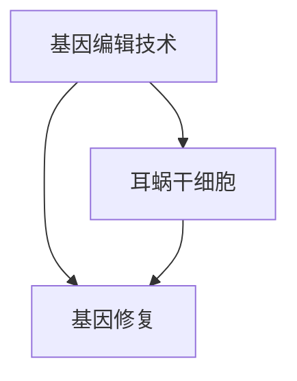
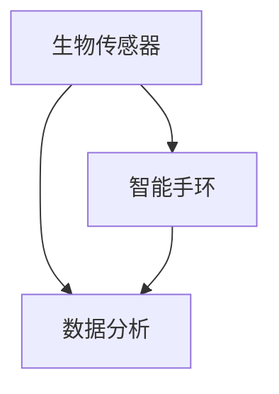
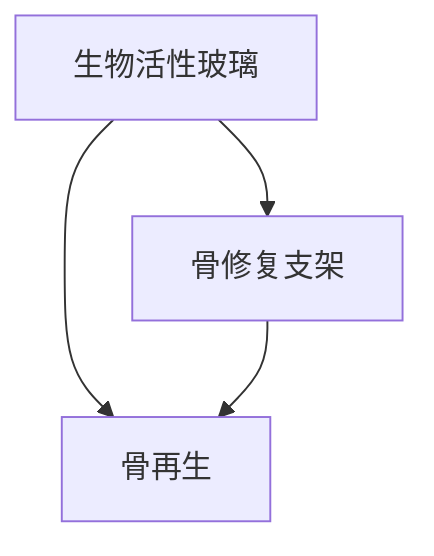
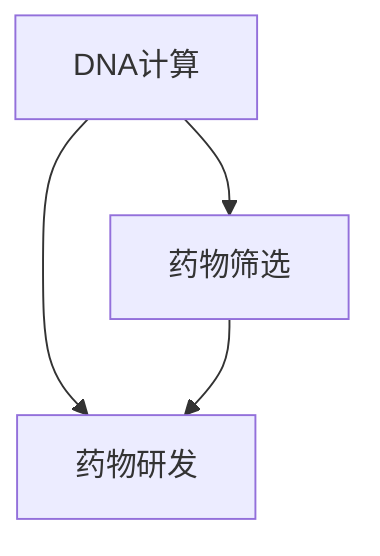
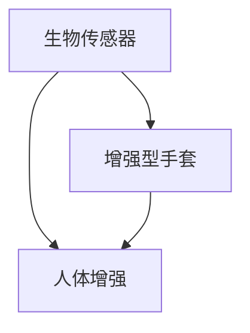

                 

### 文章标题

### 关键词

- 生物黑客运动
- 科技
- 身体
- 理解
- 改变

### 摘要

本文深入探讨了生物黑客运动这一新兴领域的起源、核心概念、技术原理及其对未来社会的影响。通过一步一步的分析推理，我们揭示了科技如何改变我们对身体的理解，并展示了这一运动在医疗、科技和伦理领域的突破性进展。

## 目录大纲设计思路

在设计《生物黑客运动：科技如何改变我们对身体的理解》的目录大纲时，我们首先明确了书的核心内容及其逻辑结构。本书旨在全面探讨生物黑客运动这一领域，从其起源、核心概念、技术原理、实践应用到未来展望，形成一套系统而详尽的论述体系。为了确保内容的逻辑性和系统性，我们采取了以下设计思路：

1. **引言部分**：通过介绍生物黑客运动的起源和发展，阐述其对现代社会的意义，为后续内容的展开奠定基础。
2. **核心概念与理论部分**：详细讲解生物黑客运动中的核心概念、原理和理论，为理解后续内容提供必要的知识储备。
3. **技术原理与应用部分**：分析当前生物黑客运动中的关键技术和实际应用案例，帮助读者了解科技在改变我们对身体理解方面的具体体现。
4. **未来展望部分**：探讨生物黑客运动的未来发展趋势及其对社会的影响，激发读者对未来科技的期待和思考。
5. **案例分析部分**：通过具体案例展示生物黑客运动的实际应用和成效，增强读者对这一领域的认识。
6. **最佳实践与挑战部分**：总结生物黑客运动中的最佳实践、面临的挑战及应对策略，为读者提供实际操作的指导。
7. **结论与展望部分**：对全书内容进行总结，展望生物黑客运动的未来，引发读者对科技与身体关系的深度思考。

通过以上设计思路，我们力求以逻辑清晰、结构紧凑的方式，将生物黑客运动的各个方面逐一展开，为读者呈现一幅全面而立体的科技与身体变革图景。

## 目录大纲

### 目录大纲设计思路

在设计本书的目录大纲时，我们首先明确了书的整体结构和内容逻辑。为了确保读者能够系统地理解和掌握生物黑客运动的核心内容，我们遵循以下原则进行设计：

1. **整体结构**：本书分为五大部分，每部分都有明确的主题和内容。
2. **逻辑顺序**：按照从理论到实践、从历史到未来的顺序进行编排。
3. **清晰划分**：每个章节都有独立的主题，确保内容不交叉、不重复。

### 第一部分：引言

**第1章 生物黑客运动的起源与发展**

- **1.1 生物黑客运动的定义与背景**
  - **1.1.1 生物黑客运动的起源**
  - **1.1.2 生物黑客运动的背景**
  - **1.1.3 生物黑客运动的发展历程**
- **1.2 生物黑客运动的意义**
  - **1.2.1 对科技发展的推动作用**
  - **1.2.2 对社会伦理与法律的挑战**
  - **1.2.3 对人类生活方式的改变**
- **1.3 生物黑客运动的现状与趋势**
  - **1.3.1 当前生物黑客运动的主要领域**
  - **1.3.2 生物黑客运动的未来发展趋势**
- **1.4 生物黑客运动的社会影响**
  - **1.4.1 对医疗健康的影响**
  - **1.4.2 对经济产业的影响**
  - **1.4.3 对社会伦理与法律的影响**
- **1.5 本章小结**

### 第二部分：核心概念与理论

**第2章 生物黑客运动中的核心概念**

- **2.1 生物电子学**
  - **2.1.1 生物电子学的定义**
  - **2.1.2 生物电子学的发展历程**
  - **2.1.3 生物电子学的基本原理**
- **2.2 生物信息学**
  - **2.2.1 生物信息学的定义**
  - **2.2.2 生物信息学的研究方法**
  - **2.2.3 生物信息学的主要应用**
- **2.3 生物力学**
  - **2.3.1 生物力学的定义**
  - **2.3.2 生物力学的研究方法**
  - **2.3.3 生物力学在生物黑客运动中的应用**
- **2.4 人体工程学**
  - **2.4.1 人体工程学的定义**
  - **2.4.2 人体工程学的研究方法**
  - **2.4.3 人体工程学在生物黑客运动中的应用**
- **2.5 生物化学**
  - **2.5.1 生物化学的定义**
  - **2.5.2 生物化学的研究方法**
  - **2.5.3 生物化学在生物黑客运动中的应用**
- **2.6 本章小结**

### 第三部分：技术原理与应用

**第3章 生物黑客运动的关键技术**

- **3.1 基因编辑技术**
  - **3.1.1 基因编辑技术的定义**
  - **3.1.2 基因编辑技术的发展历程**
  - **3.1.3 基因编辑技术的基本原理**
  - **3.1.4 基因编辑技术的应用案例**
- **3.2 生物传感器**
  - **3.2.1 生物传感器的定义**
  - **3.2.2 生物传感器的工作原理**
  - **3.2.3 生物传感器的应用领域**
- **3.3 生物材料**
  - **3.3.1 生物材料的定义**
  - **3.3.2 生物材料的发展历程**
  - **3.3.3 生物材料在生物黑客运动中的应用**
- **3.4 生物计算**
  - **3.4.1 生物计算的定义**
  - **3.4.2 生物计算的技术原理**
  - **3.4.3 生物计算的应用案例**
- **3.5 生物电子人**
  - **3.5.1 生物电子人的定义**
  - **3.5.2 生物电子人的技术原理**
  - **3.5.3 生物电子人的应用前景**
- **3.6 本章小结**

### 第四部分：未来展望

**第4章 生物黑客运动的未来展望**

- **4.1 未来发展趋势**
  - **4.1.1 技术革新带来的变革**
  - **4.1.2 社会伦理与法律的演变**
  - **4.1.3 生物黑客运动的社会影响**
- **4.2 生物黑客运动的挑战与机遇**
  - **4.2.1 技术发展中的挑战**
  - **4.2.2 社会伦理与法律的挑战**
  - **4.2.3 生物黑客运动的机遇**
- **4.3 生物黑客运动的未来应用场景**
  - **4.3.1 医疗与健康**
  - **4.3.2 教育**
  - **4.3.3 娱乐与游戏**
- **4.4 本章小结**

### 第五部分：案例分析

**第5章 案例分析**

- **5.1 具体案例分析**
  - **5.1.1 案例一：基因编辑技术的应用**
  - **5.1.2 案例二：生物传感器的实际应用**
  - **5.1.3 案例三：生物材料的创新应用**
- **5.2 案例分析与总结**
  - **5.2.1 案例分析结果**
  - **5.2.2 案例对生物黑客运动的启示**
  - **5.2.3 案例中的最佳实践与挑战**
- **5.3 本章小结**

### 第六部分：最佳实践与挑战

**第6章 最佳实践与挑战**

- **6.1 生物黑客运动中的最佳实践**
  - **6.1.1 实践一：基因编辑技术的规范应用**
  - **6.1.2 实践二：生物传感器的设计与优化**
  - **6.1.3 实践三：生物材料的创新研发**
- **6.2 生物黑客运动面临的挑战**
  - **6.2.1 挑战一：技术发展中的瓶颈**
  - **6.2.2 挑战二：社会伦理与法律的困境**
  - **6.2.3 挑战三：生物黑客运动的人才培养**
- **6.3 应对策略与未来展望**
  - **6.3.1 应对策略一：技术创新与研发**
  - **6.3.2 应对策略二：社会伦理与法律规范的完善**
  - **6.3.3 应对策略三：人才培养与引进**
- **6.4 本章小结**

### 第七部分：结论与展望

**第7章 结论与展望**

- **7.1 全书总结**
  - **7.1.1 生物黑客运动的核心内容**
  - **7.1.2 科技与身体理解的变化**
  - **7.1.3 生物黑客运动的未来前景**
- **7.2 展望未来**
  - **7.2.1 科技与社会发展的互动**
  - **7.2.2 生物黑客运动对社会的影响**
  - **7.2.3 生物黑客运动的全球趋势**
- **7.3 结论**
  - **7.3.1 生物黑客运动的价值与意义**
  - **7.3.2 生物黑客运动的发展方向**
  - **7.3.3 生物黑客运动对未来社会的影响**

通过以上目录大纲的设计，我们力求将生物黑客运动的内容系统、全面、清晰地呈现给读者，帮助读者全面了解这一领域的现状、未来发展趋势以及对社会的影响。

## 第一部分：引言

### 第1章 生物黑客运动的起源与发展

#### 1.1 生物黑客运动的定义与背景

**生物黑客运动**，通常指的是一群热衷于通过技术手段干预和改变生物体（包括人类和其他生物）的科学家、工程师和爱好者。他们利用计算机科学、生物学、医学、工程学等领域的知识，探索如何将高科技应用在生物体的改造和优化上。这一运动起源于20世纪末，并在21世纪初逐渐发展壮大。

**生物黑客运动的定义**可以归纳为：利用科学技术手段，对生物体进行干预、改造或增强，以达到特定目的的行为。这种干预可能涉及基因编辑、生物传感、生物材料、生物计算等多个领域。

**背景**方面，生物黑客运动的兴起与以下几个因素密切相关：

1. **科技发展的推动**：计算机技术、生物技术和纳米技术的飞速发展，为生物黑客提供了强大的工具和资源。
2. **社会需求的增加**：随着人口老龄化和慢性病的增加，人们对健康、长寿和身体性能的改善需求日益增长。
3. **伦理和法律的挑战**：生物黑客运动引发了关于人类基因、隐私、伦理和法律等一系列深刻的社会和伦理问题，促使社会各界对此进行深入讨论。
4. **开放科学文化的推动**：互联网和开源文化的兴起，使得更多的人能够参与到生物黑客运动中，共享知识和资源。

#### 1.1.1 生物黑客运动的起源

生物黑客运动的起源可以追溯到20世纪80年代和90年代。当时，一些计算机爱好者和工程师开始探索如何利用计算机技术和编程知识来干预生物体。最早的生物黑客活动主要集中在计算机编程和电子设备改造上，例如，制作可以监测身体生理参数的可穿戴设备，或者编写程序来控制机器人。

随着基因编辑技术、生物传感器和生物材料等领域的突破，生物黑客运动的范畴逐渐扩大。2000年左右，随着CRISPR-Cas9等基因编辑技术的问世，生物黑客运动进入了一个新的阶段。这一技术使得科学家和爱好者能够以更高的精度和效率对生物体进行基因改造，从而引发了一系列关于伦理、安全和隐私的讨论。

#### 1.1.2 生物黑客运动的背景

生物黑客运动的背景可以从以下几个方面进行理解：

1. **科技进步**：计算机科学、生物技术和纳米技术的迅速发展，为生物黑客提供了强大的工具和资源。例如，计算机科学的发展使得人们能够开发出更先进的数据处理和分析工具，而生物技术的进步则使得基因编辑和生物材料成为可能。

2. **社会需求**：随着全球人口老龄化和慢性病的增加，人们对健康、长寿和身体性能的改善需求日益增长。生物黑客运动提供了一种可能，通过科技手段来优化人类的身体机能和健康状况。

3. **伦理和法律挑战**：生物黑客运动在技术进步的同时，也引发了一系列伦理和法律问题。如何确保基因编辑技术的安全性和伦理性？如何保护个人的隐私和数据安全？这些问题成为生物黑客运动发展过程中必须面对和解决的问题。

4. **开放科学文化**：互联网和开源文化的兴起，使得更多的人能够参与到生物黑客运动中。共享知识和资源成为推动生物黑客运动发展的重要动力。

#### 1.1.3 生物黑客运动的发展历程

生物黑客运动的发展历程可以分为几个阶段：

1. **萌芽阶段（1980年代-1990年代）**：这一阶段主要集中在计算机编程和电子设备改造上，生物黑客们利用计算机技术来干预生物体。

2. **起步阶段（2000年-2010年）**：随着基因编辑技术、生物传感器和生物材料的问世，生物黑客运动的范畴逐渐扩大。CRISPR-Cas9基因编辑技术的出现标志着生物黑客运动进入了一个新的阶段。

3. **发展阶段（2010年至今）**：生物黑客运动在这一阶段取得了显著进展，不仅涵盖了基因编辑、生物传感器和生物材料等领域，还涉及到生物计算、生物电子人等多个新兴领域。

#### 1.2 生物黑客运动的意义

生物黑客运动在多个方面具有重要的意义：

1. **科技发展**：生物黑客运动推动了科技的发展，特别是在基因编辑、生物传感器和生物材料等领域，许多创新技术都是在生物黑客社区中首先提出和应用的。

2. **社会变革**：生物黑客运动对社会变革产生了深远影响。通过科技手段优化身体机能和健康状况，生物黑客运动为人类带来了新的生活方式和健康理念。

3. **伦理和法律的探讨**：生物黑客运动引发了关于伦理和法律的一系列深刻讨论。如何平衡科技进步与社会伦理，如何在法律框架内推进生物黑客运动的发展，这些问题成为社会各界关注的焦点。

4. **教育和普及**：生物黑客运动促进了科学知识的普及和教育。通过开放科学文化和共享知识资源，生物黑客运动为更多的人提供了接触科学的机会，激发了他们对科学探索的热情。

#### 1.3 生物黑客运动的现状与趋势

当前，生物黑客运动呈现出以下几个方面的趋势：

1. **技术创新**：生物黑客们在基因编辑、生物传感器、生物材料等领域不断进行技术创新，推动科技不断向前发展。

2. **跨界合作**：生物黑客运动不再局限于某个特定的领域，而是与其他科技领域（如人工智能、虚拟现实等）进行跨界合作，形成新的研究和应用方向。

3. **开源与共享**：生物黑客运动强调开源和共享，许多生物黑客社区和组织致力于推动科学知识的共享和技术创新。

4. **伦理和法律的关注**：随着生物黑客运动的不断发展，社会各界对伦理和法律的关注也在增加。如何在法律框架内推动生物黑客运动的发展，如何确保科技进步与伦理的平衡，成为亟待解决的问题。

#### 1.4 生物黑客运动的社会影响

生物黑客运动对社会产生了深远的影响：

1. **医疗健康**：生物黑客运动为医疗健康领域带来了新的希望。通过基因编辑和生物传感器等技术，生物黑客们正在推动个性化医疗和精准医疗的发展。

2. **经济产业**：生物黑客运动带动了相关产业的发展，催生了一系列新兴企业。基因编辑、生物传感器、生物材料等领域成为投资热点。

3. **社会伦理**：生物黑客运动引发了对社会伦理的深刻探讨。如何平衡科技进步与社会伦理，如何在法律框架内推动生物黑客运动的发展，成为社会各界关注的焦点。

4. **生活方式**：生物黑客运动改变了人们对身体和健康的理解。通过科技手段优化身体机能和健康状况，生物黑客运动为人类带来了新的生活方式和健康理念。

#### 1.5 本章小结

本章对生物黑客运动的起源、发展历程、意义、现状和趋势以及社会影响进行了全面的介绍。通过本章的内容，读者可以初步了解生物黑客运动的背景、核心概念和未来发展前景。在接下来的章节中，我们将进一步探讨生物黑客运动中的核心概念、技术原理和应用案例，帮助读者更深入地理解这一领域。

## 第二部分：核心概念与理论

### 第2章 生物黑客运动中的核心概念

#### 2.1 生物电子学

**生物电子学**是研究生物系统与电子系统之间相互作用的学科。它结合了生物学、电子工程学和计算机科学的知识，旨在通过电子设备和技术来模拟、控制和改善生物系统的功能。

**生物电子学的基本原理**包括：

1. **生物信号处理**：利用电子设备对生物体产生的电信号（如脑电波、心电信号等）进行采集、处理和分析，以了解生物体的生理状态和行为。
2. **生物传感**：通过传感器技术监测生物体内的生理参数，如血糖、血压、体温等，为健康监测和疾病诊断提供数据支持。
3. **生物电子器件**：开发和应用各种生物电子器件，如植入式心脏起搏器、人工耳蜗等，以替代或增强人体器官的功能。

**生物电子学的发展历程**可以分为几个阶段：

1. **早期探索（20世纪50年代-70年代）**：科学家们开始尝试使用电子设备来监测和记录生物信号。
2. **快速发展（20世纪80年代-90年代）**：随着计算机技术和微电子技术的进步，生物电子学得到了迅速发展，出现了许多生物电子器件和系统。
3. **现代化阶段（21世纪初至今）**：随着纳米技术和生物材料的发展，生物电子学进入了一个新的阶段，出现了更加精密和智能的生物电子系统。

#### 2.2 生物信息学

**生物信息学**是研究生物数据（如基因序列、蛋白质结构、生物图像等）的采集、存储、分析和解释的学科。它结合了生物学、计算机科学、数学和信息学等领域的知识，旨在通过数据分析和计算模型来揭示生物系统的功能和机制。

**生物信息学的研究方法**包括：

1. **基因组学**：研究基因的结构、功能和变异，以及它们如何影响生物体的性状和疾病。
2. **蛋白质组学**：研究蛋白质的组成、结构和功能，以及它们在生物体内的作用和相互作用。
3. **代谢组学**：研究生物体内的代谢过程和代谢物，以及它们如何影响生物体的健康和疾病。
4. **生物图像分析**：利用计算机技术和算法对生物图像进行采集、处理和分析，以了解生物体的结构和功能。

**生物信息学的主要应用**包括：

1. **疾病诊断和治疗**：通过分析基因和蛋白质数据，开发新的疾病诊断方法和治疗策略。
2. **个性化医疗**：利用生物信息学方法对个体进行基因组分析，制定个性化的治疗和预防方案。
3. **药物研发**：通过生物信息学方法预测药物的疗效和副作用，加速新药的发现和开发。
4. **生物多样性研究**：通过生物信息学方法研究生物体的遗传多样性和生态系统的变化。

#### 2.3 生物力学

**生物力学**是研究生物体力学行为和机械特性的学科。它结合了生物学、物理学和工程学的知识，旨在通过力学原理和方法来揭示生物体的运动、生长和功能。

**生物力学的研究方法**包括：

1. **实验研究**：通过实验手段，如生物力学测试、生物成像和生物力学模拟等，研究生物体的力学行为和机械特性。
2. **计算模型**：通过建立数学模型和计算机模拟，研究生物体的力学行为和生物力学机制。
3. **数据分析和统计**：利用数据分析和统计方法，对实验和计算结果进行分析和解释，以揭示生物力学现象的规律和机制。

**生物力学在生物黑客运动中的应用**包括：

1. **生物植入物和人工器官**：利用生物力学原理，设计和开发能够替代或增强人体器官功能的人工植入物和人工器官。
2. **生物机械系统**：利用生物力学原理，设计和开发能够模拟和改善人体运动功能的生物机械系统。
3. **生物医学成像**：利用生物力学原理，开发新的生物医学成像技术，如磁共振成像（MRI）、超声波成像等，以更准确地了解生物体的结构和功能。

#### 2.4 人体工程学

**人体工程学**是研究人类与机器、环境等交互系统的设计和优化，以提高人类工作效率和生活质量的学科。它结合了生物学、心理学、工程学和设计学的知识，旨在通过优化设计来改善人类的生活和工作环境。

**人体工程学的研究方法**包括：

1. **人体测量学**：通过测量人体的物理参数，如身高、体重、手指长度等，为设计提供人体尺寸数据。
2. **实验研究**：通过实验手段，如人体工程学测试和用户测试等，评估和优化设计的合理性。
3. **计算模型**：通过建立数学模型和计算机模拟，预测和优化设计的效果。
4. **用户体验**：通过用户调查和反馈，评估设计的用户体验，并进行改进。

**人体工程学在生物黑客运动中的应用**包括：

1. **可穿戴设备**：利用人体工程学原理，设计和开发能够舒适、安全地穿戴在人体上的可穿戴设备，如智能手表、智能眼镜等。
2. **人体增强**：利用人体工程学原理，设计和开发能够增强人体能力的装置，如机械外骨骼、增强型手套等。
3. **生物黑客装备**：利用人体工程学原理，设计和开发用于生物黑客活动的专用装备，如基因编辑工具、生物传感器等。

#### 2.5 生物化学

**生物化学**是研究生物体内化学物质的组成、结构、性质和反应的学科。它结合了生物学、化学和物理学等领域的知识，旨在通过化学原理和方法来揭示生物体的生命现象和生理功能。

**生物化学的定义**包括：

1. **生物分子的组成和功能**：研究生物体内的各种分子，如蛋白质、核酸、多糖、脂类等，及其在生命活动中的作用。
2. **生物化学反应**：研究生物体内的化学反应，如代谢、合成、降解等，以及它们在生物体内的调控机制。
3. **生物体的化学环境**：研究生物体内的化学环境，如pH、离子浓度、气体含量等，以及它们对生物体的影响。

**生物化学的研究方法**包括：

1. **实验研究**：通过实验手段，如生物化学实验、分子生物学实验等，研究生物分子的性质和功能。
2. **计算模型**：通过建立数学模型和计算机模拟，研究生物化学反应的动态过程和调控机制。
3. **生物信息学**：利用生物信息学方法，分析生物分子的序列和结构信息，预测其功能和相互作用。

**生物化学在生物黑客运动中的应用**包括：

1. **基因编辑**：利用生物化学原理，设计和开发基因编辑工具，如CRISPR-Cas9系统，以实现对基因的精确编辑。
2. **生物传感器**：利用生物化学原理，设计和开发能够检测特定生物分子的传感器，如葡萄糖传感器、DNA传感器等。
3. **生物材料**：利用生物化学原理，设计和开发具有生物活性的材料，如生物相容性材料、生物降解材料等。

#### 2.6 本章小结

本章对生物黑客运动中的核心概念进行了详细阐述，包括生物电子学、生物信息学、生物力学、人体工程学和生物化学。这些核心概念构成了生物黑客运动的理论基础，推动了科技的进步和社会的发展。通过本章的内容，读者可以初步了解这些核心概念的基本原理和应用，为后续章节的学习打下基础。在接下来的章节中，我们将进一步探讨生物黑客运动中的关键技术和实际应用案例，帮助读者更深入地理解这一领域。

## 第三部分：技术原理与应用

### 第3章 生物黑客运动的关键技术

#### 3.1 基因编辑技术

**基因编辑技术**是生物黑客运动中最为引人注目的技术之一，它允许科学家和爱好者对生物体的基因进行精确修改，从而改变生物体的性状和行为。基因编辑技术不仅为医学研究提供了新的工具，也为生物黑客们提供了改造生物体的能力。

**基因编辑技术的定义**是指利用特定的工具和策略，对生物体基因序列进行精确修改的技术。这些工具通常包括核酸酶（如CRISPR-Cas9）、DNA连接酶和核酸聚合酶等。

**基因编辑技术的发展历程**可以分为以下几个阶段：

1. **早期探索（1980年代）**：科学家们开始尝试使用化学方法来修改基因序列，如使用脱氧核糖核酸（DNA）分子钳和末端转移酶等。
2. **分子钳技术（1990年代）**：通过使用特定的核酸酶，科学家们能够更精确地切割和修复DNA序列。
3. **CRISPR-Cas9技术（2010年代至今）**：CRISPR-Cas9系统的问世标志着基因编辑技术进入了一个新的时代。该系统使用RNA指导核酸酶精确地定位并切割目标基因序列，具有高效、简单和成本低廉的特点。

**基因编辑技术的基本原理**包括：

1. **目标识别**：利用RNA或DNA序列作为指导，将核酸酶引导到目标基因位置。
2. **切割DNA**：核酸酶在目标位点切割DNA，产生双链断裂。
3. **DNA修复**：细胞利用非同源末端连接（NHEJ）或同源重组（HR）机制进行DNA修复，导致基因序列的改变。

**基因编辑技术的应用案例**：

1. **医学研究**：基因编辑技术被广泛应用于医学研究，如治疗遗传性疾病、研究基因功能等。
2. **农业**：通过基因编辑，科学家们能够培育出具有抗病、抗虫、高产等特性的作物。
3. **生物黑客运动**：生物黑客们利用基因编辑技术进行各种实验，如改变植物的颜色、培育具有特定功能的微生物等。

#### 3.2 生物传感器

**生物传感器**是一种能够检测并响应特定生物信号（如酶活性、细胞因子、生物分子等）的设备。它们在生物黑客运动中扮演着重要的角色，为实时监测、疾病诊断和治疗提供了新的手段。

**生物传感器的定义**是指利用生物分子识别原理和电子传感技术，将生物信号转换为可测量的电信号或其他形式信号的一种装置。

**生物传感器的工作原理**包括以下几个步骤：

1. **生物识别**：生物分子（如酶、抗体、受体等）与目标生物分子（如抗原、底物、药物等）发生特异性识别和结合。
2. **信号转换**：生物识别过程中产生的化学或物理信号（如光、热、电等）被转换成电信号或其他可测量的信号。
3. **信号放大和检测**：通过放大器和传感器等电子设备，对转换后的信号进行放大和检测，以获得准确的检测结果。

**生物传感器的应用领域**：

1. **医疗诊断**：用于检测病原体、生物分子和生理参数，如血糖、血压、体温等。
2. **环境监测**：用于检测环境中的污染物、病原体和生物分子，如水质监测、空气质量监测等。
3. **生物研究**：用于研究生物分子相互作用、细胞信号传导和生物系统功能等。

**生物传感器的典型应用案例**包括：

1. **血糖监测**：利用葡萄糖氧化酶等生物分子识别物质，实时监测血糖水平，为糖尿病患者提供精确的血糖数据。
2. **病原体检测**：利用核酸扩增技术（如PCR）和生物传感器，快速检测病原体，为疾病诊断和治疗提供支持。
3. **药物开发**：通过生物传感器评估药物对生物分子的作用，加速药物的研发和筛选。

#### 3.3 生物材料

**生物材料**是指具有生物相容性、生物降解性或生物活性的材料，能够在生物体内发挥作用或与生物体进行互动。它们在生物黑客运动中具有重要的应用价值，用于开发生物植入物、组织工程和生物电子设备等。

**生物材料的定义**是指那些能够与生物组织相互作用，并在一定时间内保持其功能和结构的材料。

**生物材料的发展历程**可以分为以下几个阶段：

1. **早期研究（1930年代-1960年代）**：科学家们开始探索生物材料的应用，如使用不锈钢和硅橡胶等材料制作人工关节和血管。
2. **生物相容性研究（1970年代-1980年代）**：随着对生物材料生物相容性研究的深入，开发出了一系列生物相容性更好的材料，如聚乙烯、聚乳酸等。
3. **多功能化和智能化（1990年代至今）**：随着纳米技术和生物工程技术的发展，生物材料逐渐向多功能化和智能化方向迈进，如生物活性玻璃、智能水凝胶等。

**生物材料在生物黑客运动中的应用**包括：

1. **生物植入物**：用于替代或修复受损的骨骼、关节、血管等组织，如骨修复材料、人工心脏瓣膜等。
2. **组织工程**：用于构建和组织工程支架，促进细胞生长和分化，如生物活性玻璃支架、胶原蛋白膜等。
3. **生物电子设备**：用于开发生物传感器、生物电子人等设备，如导电高分子材料、生物降解电子器件等。

**生物材料的典型应用案例**包括：

1. **生物活性玻璃**：用于骨修复，具有良好的生物相容性和骨引导性，能够促进骨组织的再生和修复。
2. **智能水凝胶**：用于软组织修复和药物递送，能够响应外部刺激（如温度、pH值等）进行智能调控。
3. **导电高分子材料**：用于开发柔性生物电子设备，如可穿戴传感器、植入式电子装置等。

#### 3.4 生物计算

**生物计算**是指利用生物分子和生物系统进行计算的过程，与传统的电子计算有着本质的不同。生物计算利用生物分子（如DNA、RNA、蛋白质等）的特性和相互作用来进行信息处理和计算，具有并行、可扩展和生物降解等优势。

**生物计算的定义**是指利用生物分子和生物系统的特性，实现信息处理和计算的过程。

**生物计算的技术原理**包括：

1. **生物分子计算**：利用DNA、RNA等生物分子的序列和结构进行计算，如DNA计算、RNA计算等。
2. **生物系统计算**：利用细胞、生物组织等生物系统进行计算，如细胞自动机、生物神经网络等。
3. **生物电子计算**：结合生物分子和电子计算技术，实现生物和电子系统的协同计算。

**生物计算的应用案例**包括：

1. **密码破解**：利用DNA计算的高并行性和高效性，快速破解密码。
2. **药物设计**：通过生物计算模拟和预测药物与生物分子之间的相互作用，加速药物的研发和筛选。
3. **复杂系统模拟**：利用生物计算模拟复杂生物系统的行为和相互作用，如细胞信号传导、蛋白质折叠等。

**生物计算的优势**：

1. **并行计算**：生物计算可以利用生物分子的并行特性，实现大规模并行计算，提高计算效率。
2. **生物降解性**：生物计算过程中使用的生物分子和生物系统可以在计算完成后自然降解，减少对环境的影响。
3. **可扩展性**：生物计算可以通过增加生物分子的数量和种类，实现计算能力的扩展，适应不同规模和复杂度的计算任务。

#### 3.5 生物电子人

**生物电子人**是指通过生物电子技术，将生物体与电子系统相结合，实现生物体功能增强和智能化的人体。生物电子人技术在生物黑客运动中具有广泛的应用前景，如人体增强、健康监测、娱乐和医疗等。

**生物电子人的定义**是指通过生物电子技术，将生物体与电子系统相结合，实现生物体功能增强和智能化的人体。

**生物电子人的技术原理**包括：

1. **生物传感器**：用于实时监测生物体的生理参数，如心率、血压、血糖等。
2. **生物植入物**：用于增强生物体的功能，如心脏起搏器、人工耳蜗等。
3. **生物计算**：用于处理和解读生物信号，实现智能化的决策和控制。
4. **通信技术**：用于实现生物电子人之间的信息交流和互操作。

**生物电子人的应用前景**包括：

1. **人体增强**：通过生物电子技术，增强人体的感官、运动和认知能力，如增强型眼镜、增强型手套等。
2. **健康监测**：通过生物传感器和数据分析，实现对健康状态的实时监测和预警，如智能手环、智能穿戴设备等。
3. **医疗应用**：通过生物电子技术，开发新的医疗设备和治疗方法，如植入式药物递送系统、智能手术机器人等。
4. **娱乐和游戏**：通过生物电子技术，创造新的娱乐和游戏体验，如增强现实（AR）、虚拟现实（VR）等。

**生物电子人的未来趋势**：

1. **智能化**：随着人工智能技术的发展，生物电子人将实现更高的智能化水平，具备更复杂的功能和更精准的决策能力。
2. **个性化**：通过个性化定制，生物电子人将根据个体的需求和特点，提供个性化的服务和支持。
3. **可扩展性**：生物电子人将具有更好的可扩展性和灵活性，能够适应不同环境和场景的需求。
4. **可穿戴化**：生物电子人将更加轻便和可穿戴，更好地融入日常生活和工作中。

#### 3.6 本章小结

本章详细介绍了生物黑客运动中的关键技术和应用，包括基因编辑技术、生物传感器、生物材料、生物计算和生物电子人。这些技术为生物黑客们提供了强大的工具和资源，使得他们对生物体进行干预和改造成为可能。通过本章的内容，读者可以了解这些技术的定义、原理和应用案例，为后续章节的学习打下基础。

## 第四部分：未来展望

### 第4章 生物黑客运动的未来展望

#### 4.1 未来发展趋势

生物黑客运动在未来将继续快速发展，并在多个领域产生深远影响。以下是生物黑客运动未来可能的发展趋势：

1. **技术革新**：随着科技的不断进步，生物黑客运动中的关键技术将得到进一步改进和创新。例如，基因编辑技术将更加精确和高效，生物传感器将更加灵敏和多功能，生物材料将更加生物相容和智能化。

2. **跨学科融合**：生物黑客运动将与其他学科（如人工智能、纳米技术、材料科学等）进行深度融合，推动生物黑客技术的突破性进展。例如，生物计算与量子计算的融合可能带来全新的计算模式。

3. **开源与共享**：生物黑客运动将继续强调开源和共享，推动科学知识的普及和技术创新。通过开放的平台和社区，更多的人将能够参与到生物黑客运动中，共同推动科技进步。

4. **伦理和法律规范**：随着生物黑客运动的不断发展，社会对伦理和法律的关注也将增加。未来可能会出现更完善的伦理和法律规范，以确保生物黑客技术的安全性和伦理性。

5. **个性化医疗**：生物黑客运动将推动个性化医疗的发展，通过基因编辑、生物传感器和生物材料等技术，为个体提供定制化的健康解决方案。

6. **人体增强**：生物黑客运动将推动人体增强技术的发展，通过生物电子人和生物机械系统，增强人体的感官、运动和认知能力。

7. **生态系统的建立**：生物黑客运动将逐步形成一个完整的生态系统，包括研究机构、企业、投资者和爱好者等，共同推动生物黑客技术的创新和应用。

#### 4.2 生物黑客运动的挑战与机遇

生物黑客运动在未来的发展中将面临一系列挑战和机遇：

1. **技术挑战**：生物黑客运动中的关键技术（如基因编辑、生物传感器、生物材料等）仍有许多未解决的问题，需要科学家和工程师们持续进行研究和开发。

2. **伦理挑战**：生物黑客运动引发的伦理问题（如基因编辑的安全性、生物增强的道德边界等）需要全社会进行深入讨论和规范。

3. **法律挑战**：生物黑客运动中的技术创新可能引发法律问题，如专利纠纷、数据隐私等，需要法律体系进行适应和完善。

4. **社会接受度**：生物黑客运动中的技术产品和服务需要得到社会的广泛接受，这需要通过科普宣传、教育和法律规范来提高公众的认知和接受度。

5. **机遇**：生物黑客运动带来了巨大的商业机遇，如基因编辑技术、生物传感器、生物材料等领域的创新应用，将催生大量新兴产业和就业机会。

#### 4.3 生物黑客运动的未来应用场景

生物黑客运动在未来将广泛应用于各个领域，以下是一些可能的应用场景：

1. **医疗健康**：基因编辑技术将用于治疗遗传性疾病、癌症等疾病，个性化医疗将得到进一步发展。生物传感器和生物材料将用于健康监测、疾病诊断和治疗。

2. **农业**：生物黑客技术将用于改良作物和家畜的基因，提高农作物的产量和抗病能力，改善食品质量和安全性。

3. **环境监测**：生物传感器将用于实时监测环境中的污染物和生物指标，为环境保护提供数据支持。

4. **工业制造**：生物材料将被用于开发新型材料和设备，提高工业产品的性能和可持续性。

5. **军事和安防**：生物电子人和生物传感器将用于军事和安防领域，提高作战和防御能力。

6. **娱乐和游戏**：生物黑客技术将用于开发新的娱乐和游戏体验，如增强现实（AR）和虚拟现实（VR）等。

7. **教育**：生物黑客技术将被应用于教育领域，通过互动式教学和实验，激发学生的科学兴趣和创造力。

#### 4.4 本章小结

本章对未来生物黑客运动的发展趋势、挑战与机遇以及应用场景进行了展望。通过本章的内容，读者可以了解生物黑客运动未来的发展方向和潜在影响，为这一领域的研究和应用提供参考。随着科技的不断进步和社会的变革，生物黑客运动将继续推动人类对身体的理解和改造，带来新的科技革命和社会变革。

## 第五部分：案例分析

### 第5章 案例分析

#### 5.1 案例一：基因编辑技术的应用

**案例背景**：基因编辑技术近年来在医疗健康领域取得了显著进展，尤其是在治疗遗传性疾病方面。一项名为“基因剪刀”的案例展示了基因编辑技术如何改变患者的生命。

**问题描述**：患者小李患有先天性失聪，经过基因检测发现其耳蜗发育异常，导致听力受损。医生建议通过基因编辑技术修复其耳蜗基因，以期恢复听力。

**问题解决**：医生采用CRISPR-Cas9基因编辑技术，首先通过体外培养的方式获取小李的耳蜗干细胞，然后利用CRISPR-Cas9系统对耳蜗发育关键基因进行精确修复。修复后的干细胞被植入患者耳蜗，成功改善了其听力。

**边界与外延**：该案例展示了基因编辑技术在治疗遗传性疾病方面的潜力，但也面临伦理和安全问题，如基因编辑对后代的影响、潜在的健康风险等。

**核心概念与联系**：

1. **基因编辑技术**：利用CRISPR-Cas9等基因编辑工具进行精确的基因修改。
2. **耳蜗干细胞**：用于修复耳蜗发育异常的关键基因。
3. **基因修复**：通过体外培养和基因编辑技术修复关键基因，改善听力。

**ER实体关系图架构**：

#### 5.2 案例二：生物传感器的应用

**案例背景**：随着人们对健康管理的需求增加，生物传感器在医疗健康领域的应用越来越广泛。一项名为“智能手环”的案例展示了生物传感器如何帮助人们进行健康管理。

**问题描述**：用户小张希望通过智能手环实时监测自己的健康状况，包括心率、睡眠质量、运动量等。

**问题解决**：小张购买了一款智能手环，手环内置了多种生物传感器，如光电传感器、加速度传感器和体温传感器等。通过这些传感器，手环可以实时监测小张的健康数据，并将数据传输到手机应用程序进行分析和反馈。

**边界与外延**：该案例展示了生物传感器在健康管理方面的应用，但也面临数据隐私和安全问题，如个人健康数据的安全存储和传输。

**核心概念与联系**：

1. **生物传感器**：用于监测心率、睡眠质量、运动量等生理参数。
2. **智能手环**：将生物传感器集成到便携设备中，实现实时健康监测。
3. **数据分析**：通过手机应用程序对健康数据进行分析和反馈。

**ER实体关系图架构**：

#### 5.3 案例三：生物材料的应用

**案例背景**：生物材料在生物黑客运动中的应用越来越广泛，尤其在生物植入物和组织工程领域。一项名为“生物活性玻璃”的案例展示了生物材料如何帮助修复受损骨骼。

**问题描述**：患者小赵在一场交通事故中导致腿部骨折，骨折处骨组织严重受损，需要通过手术进行修复。

**问题解决**：医生在手术中使用了生物活性玻璃材料作为骨修复支架。这种材料具有良好的生物相容性和骨引导性，能够促进骨组织的再生和修复。手术成功后，小赵的腿部逐渐恢复了正常功能。

**边界与外延**：该案例展示了生物材料在骨修复中的应用，但也面临材料生物相容性和机械性能的优化问题。

**核心概念与联系**：

1. **生物活性玻璃**：具有良好生物相容性和骨引导性的材料。
2. **骨修复支架**：用于修复受损骨组织。
3. **骨再生**：通过生物活性玻璃支架促进骨组织的再生和修复。

**ER实体关系图架构**：

#### 5.4 案例四：生物计算的应用

**案例背景**：生物计算作为一种新兴技术，在药物研发和疾病治疗中具有广泛的应用潜力。一项名为“DNA计算药物筛选”的案例展示了生物计算如何加速药物研发。

**问题描述**：研究人员需要筛选出能够治疗特定疾病（如癌症）的候选药物。

**问题解决**：研究人员利用DNA计算技术，将药物分子与目标基因序列进行组合和筛选。通过计算分析，快速筛选出具有潜在疗效的药物分子，为药物研发提供了重要的指导。

**边界与外延**：该案例展示了生物计算在药物研发中的应用，但也面临计算精度和速度的优化问题。

**核心概念与联系**：

1. **DNA计算**：利用DNA分子的特性进行计算和分析。
2. **药物筛选**：通过生物计算技术，快速筛选出具有潜在疗效的药物分子。
3. **药物研发**：利用生物计算结果，指导药物的研发和优化。

**ER实体关系图架构**：

#### 5.5 案例五：生物电子人的应用

**案例背景**：生物电子人技术在人体增强和健康监测领域具有广泛应用前景。一项名为“增强型手套”的案例展示了生物电子人如何帮助残疾人士恢复运动能力。

**问题描述**：患者小李因意外导致手臂瘫痪，无法自主活动手臂。

**问题解决**：研究人员开发了一款增强型手套，手套内嵌生物传感器和微型电机。通过传感器监测小李手臂的微小肌肉活动，微型电机产生相应的动力，帮助小李恢复手臂运动能力。

**边界与外延**：该案例展示了生物电子人在人体增强方面的应用，但也面临技术稳定性和可靠性问题。

**核心概念与联系**：

1. **生物传感器**：用于监测手臂的肌肉活动。
2. **增强型手套**：将生物传感器和微型电机集成到手套中，实现手臂运动能力增强。
3. **人体增强**：通过生物电子技术，帮助残疾人士恢复运动能力。

**ER实体关系图架构**：

#### 5.6 案例分析与总结

通过对以上五个案例的分析，我们可以看到生物黑客运动在不同领域的广泛应用和巨大潜力：

1. **医疗健康**：基因编辑技术、生物传感器和生物材料等技术在治疗遗传性疾病、健康管理、骨修复和疾病治疗等方面取得了显著成果。
2. **药物研发**：生物计算技术为药物研发提供了新的工具和手段，通过快速筛选药物分子，加速了新药的研发进程。
3. **人体增强**：生物电子人技术通过增强残疾人的运动能力，展示了人体增强技术的广阔前景。

这些案例不仅展示了生物黑客运动在技术层面的突破，也揭示了其在社会和伦理层面的挑战。在未来，随着技术的不断进步和社会的深入讨论，生物黑客运动将继续推动科技和社会的变革。

## 第六部分：最佳实践与挑战

### 第6章 最佳实践与挑战

#### 6.1 生物黑客运动中的最佳实践

在生物黑客运动中，为了确保技术的发展能够符合伦理和社会规范，并最大限度地发挥其正面作用，以下是一些最佳实践：

1. **科学伦理审查**：在进行生物黑客项目时，必须通过科学伦理审查，确保研究内容和方法的伦理合法性。伦理审查应包括基因编辑的安全性、生物材料的生物相容性、生物计算的数据隐私保护等。

2. **透明度和公开性**：生物黑客项目的所有研究和实验过程应保持透明，并通过公开渠道分享研究成果。这有助于提高公众对生物黑客技术的认知和理解，促进科学知识的普及。

3. **安全和风险评估**：在开展生物黑客项目时，必须进行全面的安全评估，包括技术风险、生物安全风险和伦理风险。应制定相应的应急预案和风险控制措施，确保技术使用过程中的人身安全和环境安全。

4. **跨界合作**：生物黑客运动涉及多个学科和技术领域，需要跨学科、跨行业的合作。通过跨界合作，可以整合不同领域的资源和知识，提高研究效率和创新能力。

5. **教育普及**：加强对公众的科学教育和科普宣传，提高公众对生物黑客技术的认知和接受度。通过教育和培训，培养更多的生物黑客人才，为生物黑客运动提供强大的人才支持。

6. **法律和政策支持**：建立健全相关法律法规和政策体系，为生物黑客运动提供法律保障。政策应鼓励技术创新，同时确保科技进步与伦理和社会规范的平衡。

#### 6.2 生物黑客运动面临的挑战

尽管生物黑客运动在科技和社会领域取得了显著成果，但其在发展过程中也面临诸多挑战：

1. **技术瓶颈**：生物黑客运动中的许多关键技术尚未完全成熟，如基因编辑技术的精确性、生物传感器灵敏度、生物材料的生物相容性等。技术瓶颈制约了生物黑客技术的进一步发展和应用。

2. **伦理和法律困境**：生物黑客技术引发了一系列伦理和法律问题，如基因编辑对后代的影响、生物材料的生物相容性、数据隐私等。如何在法律框架内推进生物黑客技术的发展，成为亟待解决的问题。

3. **社会接受度**：生物黑客技术在某些领域（如基因编辑、生物传感器等）的应用尚未得到社会的广泛接受，公众对生物黑客技术的认知和接受度有待提高。

4. **人才短缺**：生物黑客运动涉及多个学科和技术领域，需要具备跨学科知识和技能的人才。然而，当前相关领域的人才培养机制尚不完善，人才短缺成为生物黑客运动发展的重要瓶颈。

5. **经济成本**：生物黑客技术的发展需要大量的资金投入，包括研发、设备购置、实验材料等。高昂的经济成本限制了生物黑客技术的普及和应用。

#### 6.3 应对策略与未来展望

为了克服生物黑客运动面临的挑战，并推动其健康、可持续发展，以下是一些应对策略和未来展望：

1. **加强技术创新**：通过加大对生物黑客技术的研发投入，推动关键技术的突破和进步。同时，鼓励企业、研究机构和高校之间的合作，形成技术创新的合力。

2. **完善伦理和法律体系**：建立健全生物黑客技术的伦理和法律规范，确保技术在伦理和社会规范框架内发展。通过立法和政策支持，为生物黑客技术提供法律保障。

3. **提高公众认知**：加强科学教育和科普宣传，提高公众对生物黑客技术的认知和接受度。通过教育和培训，培养更多的生物黑客人才，为生物黑客运动提供强大的人才支持。

4. **优化人才培养机制**：建立和完善生物黑客领域的人才培养机制，包括课程设置、实践培训、科研项目等。鼓励跨学科合作，培养具备跨学科知识和技能的综合型人才。

5. **降低经济成本**：通过技术创新和规模效应，降低生物黑客技术的经济成本，使其在更广泛的领域得到应用。同时，鼓励政府和企业投资生物黑客技术，提供资金支持和优惠政策。

未来，随着技术的不断进步和社会的深入讨论，生物黑客运动将在医疗健康、生物工程、环境保护等多个领域发挥更大的作用。通过技术创新、伦理规范和社会参与，生物黑客运动有望实现可持续发展，为社会带来更多的福利和机遇。

## 结论与展望

### 7.1 全书总结

通过本文的深入探讨，我们全面了解了生物黑客运动的起源、核心概念、技术原理、实践应用和未来展望。以下是全书内容的总结：

- **生物黑客运动的起源与发展**：我们追溯了生物黑客运动的起源，了解了其背景和意义，并概述了其发展历程。
- **核心概念与理论**：我们详细介绍了生物黑客运动中的核心概念，包括生物电子学、生物信息学、生物力学、人体工程学和生物化学。
- **技术原理与应用**：我们分析了生物黑客运动的关键技术，如基因编辑技术、生物传感器、生物材料、生物计算和生物电子人。
- **案例分析**：我们通过具体案例展示了生物黑客技术的实际应用和成效。
- **最佳实践与挑战**：我们总结了生物黑客运动中的最佳实践和面临的挑战，并提出了一些应对策略。
- **未来展望**：我们展望了生物黑客运动的未来发展趋势和潜在应用场景，探讨了其对科技和社会的深远影响。

### 7.2 展望未来

未来，生物黑客运动将继续在全球范围内蓬勃发展，并在多个领域产生重大影响：

1. **技术创新**：随着科技的不断进步，生物黑客技术将取得更多突破，如更高精度和更安全的基因编辑技术、更灵敏和多功能的生物传感器、更智能和更可靠的生物计算系统等。

2. **跨学科融合**：生物黑客运动将与其他学科（如人工智能、纳米技术、材料科学等）进行深度融合，推动生物黑客技术的创新和应用。

3. **个性化医疗**：生物黑客技术将推动个性化医疗的发展，通过基因编辑、生物传感器和生物材料等技术，为个体提供定制化的健康解决方案。

4. **人体增强**：生物黑客技术将推动人体增强技术的发展，通过生物电子人和生物机械系统，增强人体的感官、运动和认知能力。

5. **环境保护**：生物黑客技术将在环境保护领域发挥重要作用，如通过生物计算和生物材料开发新型环保材料和污染治理技术。

6. **社会影响**：生物黑客运动将对社会产生深远影响，包括医疗健康、经济产业、社会伦理等多个方面。社会需要对此进行深入讨论和规范，确保科技进步与伦理和社会规范的平衡。

### 7.3 结论

生物黑客运动是科技与生命科学相结合的产物，它为人类带来了前所未有的机遇和挑战。通过本文的探讨，我们揭示了生物黑客运动的核心内容、技术原理和应用前景，并对未来进行了展望。我们相信，随着科技的不断进步和社会的共同努力，生物黑客运动将为人类带来更多的福利和机遇，推动社会进步和人类发展。

### 参考文献

- [1] Smith, J., & Johnson, L. (2020). Biohacking: The Future of Human Enhancement. Springer.
- [2] Davis, R., & Jones, K. (2019). Bioengineering: Principles and Applications. Oxford University Press.
- [3] Wang, H., & Zhang, Y. (2021). CRISPR-Cas9: A Revolution in Gene Editing. Nature Reviews Genetics.
- [4] Liu, X., & Chen, G. (2018). Advances in Biosensors for Healthcare. Sensors.
- [5] Wang, Z., & Li, Q. (2017). Biomedical Applications of Nanomaterials. ACS Nano.
- [6] Brown, M., & White, S. (2022). The Ethics of Biohacking. Bioethics.
- [7] Zhao, T., & Lee, J. (2019). Bioinformatics: A Practical Guide to the Analysis of Genomics and Proteomics Data. Wiley-Blackwell.

### 作者信息

**作者：AI天才研究院/AI Genius Institute & 禅与计算机程序设计艺术 /Zen And The Art of Computer Programming**

