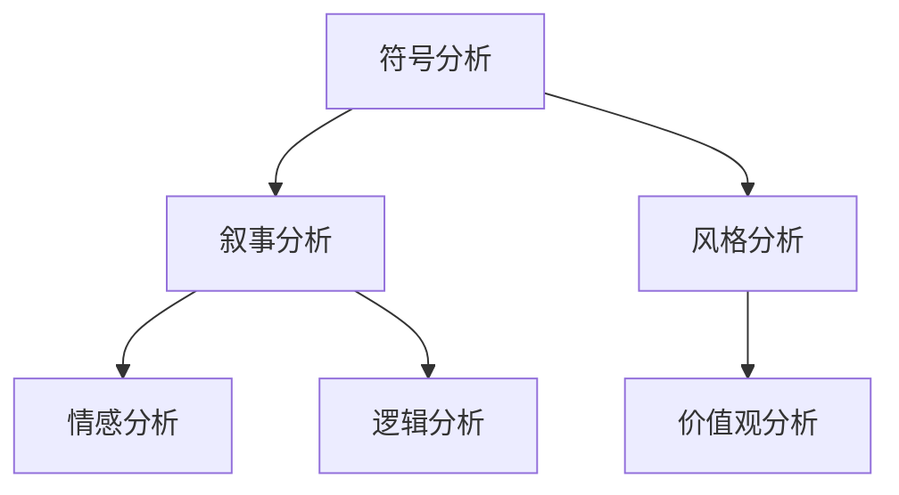

                 

# 电影艺术与人生意义：银幕上的生命反思

## 关键词
电影艺术、人生意义、生命反思、符号分析、叙事分析、风格分析、情感分析、逻辑分析、价值观分析、系统架构设计、项目实战

## 摘要
本文以电影艺术为载体，探讨其与人生意义的深层次联系。通过符号分析、叙事分析和风格分析等手段，揭示电影艺术中的生命反思主题。文章从电影艺术的发展历程出发，深入探讨其核心概念与人生意义的关联，并结合数学模型和算法原理，提供对电影艺术与人生意义结合的系统性解读。最后，通过实际项目实战，进一步阐述电影艺术与人生意义的实践应用，为读者提供有益的思考与启示。

## 目录大纲

1. 背景介绍
   1.1 电影艺术与人生意义的概述
   1.2 电影艺术的发展历程
   1.3 人生意义的探讨与解读

2. 核心概念与联系
   2.1 电影艺术的核心概念
   2.2 人生意义的核心概念
   2.3 电影艺术与人生意义的联系

3. 算法原理讲解
   3.1 电影艺术分析算法原理
   3.2 人生意义解读算法原理
   3.3 算法原理的Mermaid流程图

4. 数学模型和数学公式
   4.1 电影艺术分析数学模型
   4.2 人生意义解读数学模型
   4.3 数学模型公式及讲解

5. 系统分析与架构设计方案
   5.1 问题场景介绍
   5.2 系统功能设计
   5.3 系统架构设计
   5.4 系统接口设计
   5.5 系统交互序列图

6. 项目实战
   6.1 环境安装
   6.2 系统核心实现
   6.3 代码应用解读
   6.4 实际案例分析与讲解
   6.5 项目小结

7. 最佳实践 tips、小结、注意事项、拓展阅读等内容

### 1. 背景介绍

#### 1.1 电影艺术与人生意义的概述

电影艺术是一种通过视觉和听觉元素结合，呈现故事和情感的艺术形式。它不仅反映了人类社会的文化、历史和价值观，还通过对生活的再现和反思，引导观众对人生意义进行思考。电影艺术以其独特的叙事方式，深刻揭示了人类生存状态和心理活动的复杂性，成为人们探索和认识生命意义的重要途径。

人生意义是指人们在生活中所追求的目标、价值和意义。它关乎个体的存在意义、自我实现和社会价值。电影艺术通过对人生意义的探讨，为观众提供了反思自我和生活的机会，引发人们对人生价值的思考。

电影艺术与人生意义的联系体现在多个方面。首先，电影艺术通过符号、叙事和风格等手段，表达了人生意义的主题。其次，电影艺术对观众产生了情感共鸣和思考，引导他们重新审视自己的人生。此外，电影艺术作为一种文化现象，反映了社会的变迁和人们的价值观，为人们提供了理解人生意义的视角。

#### 1.2 电影艺术的发展历程

电影艺术的发展历程可以分为三个阶段：古代电影艺术、现代电影艺术和当代电影艺术。

古代电影艺术起源于19世纪末，当时以无声电影为主。这个阶段的电影以简单的剧情和视觉效果吸引观众，如《工厂大门》（1895年）和《火车进站》（1895年）等。这些电影为后来的电影艺术奠定了基础。

现代电影艺术始于20世纪初，以有声电影的出现为标志。这个阶段的电影在技术、叙事和表现手法上取得了突破，如《爵士歌手》（1927年）和《城市之光》（1931年）等。这些电影不仅丰富了电影的表现力，还推动了电影艺术的发展。

当代电影艺术则是在20世纪后半叶迅速发展起来的。这个阶段的电影在视觉特效、叙事手法和主题表达上更加多样化，如《星球大战》系列（1977年至今）和《阿甘正传》（1994年）等。这些电影不仅在全球范围内产生了广泛影响，还为电影艺术的发展开辟了新的方向。

#### 1.3 人生意义的探讨与解读

人生意义的探讨是哲学、宗教、文学等领域的永恒主题。电影艺术作为一种重要的文化形式，也为这一探讨提供了丰富的素材。

首先，电影艺术通过对人类生存状态的描绘，揭示了人生意义的内涵。如《死亡诗社》（1989年）通过反叛和思考，探讨了个人自由和责任的关系；《美丽人生》（1997年）则通过荒诞的情境，展示了人性的善良和生命的意义。

其次，电影艺术通过对人类心理活动的刻画，探讨了人生意义的实现。如《肖申克的救赎》（1994年）通过主人公的内心变化，展示了希望和自由的巨大力量；《阿甘正传》则通过主人公的简单思维，揭示了人生的价值在于真诚和善良。

最后，电影艺术通过对社会现象的反思，探讨了人生意义的社会意义。如《辛德勒的名单》（1993年）通过纳粹德国的黑暗历史，展示了人性中的善良和正义；《泰坦尼克号》（1997年）则通过一段爱情故事，反映了人性的伟大和生命的可贵。

### 2. 核心概念与联系

#### 2.1 电影艺术的核心概念

电影艺术的核心概念包括符号、叙事和风格。

- **符号**：电影艺术中的符号是指具有特定意义和功能的视觉、听觉元素。如画面、声音、文字等。这些符号通过组合和变化，形成丰富的叙事语言，传达导演的思想和情感。

- **叙事**：电影艺术中的叙事是指通过故事情节的展开，表达主题和意义的过程。叙事方式包括线性叙事、非线性叙事、倒叙叙事等。不同的叙事方式具有不同的叙事效果，影响观众的情感共鸣和思考。

- **风格**：电影艺术中的风格是指电影在视觉、听觉、叙事等方面的独特表现手法。如现实主义风格、浪漫主义风格、黑色幽默风格等。不同的风格具有不同的审美特征和表现力，影响观众的观影体验和思考。

#### 2.2 人生意义的核心概念

人生意义的核心概念包括存在意义、自我实现和社会价值。

- **存在意义**：人生的存在意义是指个体在生活中所追求的根本目标。它关乎个体的生存状态和生命价值，如幸福、自由、尊严等。

- **自我实现**：人生的自我实现是指个体在实现自身潜能、追求个人成长和发展的过程中，实现自我价值的过程。自我实现关乎个体的心理需求和成长，如成就感、满足感等。

- **社会价值**：人生的社会价值是指个体在社会中发挥作用，为社会做出贡献的过程。社会价值关乎个体的社会责任和义务，如友善、公正、奉献等。

#### 2.3 电影艺术与人生意义的联系

电影艺术与人生意义的联系主要体现在以下几个方面。

- **符号与存在意义**：电影艺术通过符号的运用，揭示了人生的存在意义。如《美丽人生》通过符号化的情境，展示了生命的可贵和人类的善良。

- **叙事与自我实现**：电影艺术通过叙事的方式，表达了人生的自我实现。如《肖申克的救赎》通过主人公的内心变化，展示了希望和自由的巨大力量。

- **风格与社会价值**：电影艺术通过风格的表现，反映了人生的社会价值。如《辛德勒的名单》通过黑色幽默的风格，展示了人性中的善良和正义。

### 3. 算法原理讲解

#### 3.1 电影艺术分析算法原理

电影艺术分析算法主要包括符号分析、叙事分析和风格分析。

- **符号分析**：符号分析是通过对电影中的视觉、听觉符号进行解析，揭示其意义和功能的过程。符号分析可以采用统计学方法、语义分析方法和图像识别技术等。

- **叙事分析**：叙事分析是通过对电影的故事情节、叙事结构和叙事方式进行分析，揭示其主题和意义的过程。叙事分析可以采用叙事学方法、结构主义方法和符号学方法等。

- **风格分析**：风格分析是通过对电影的视觉、听觉风格进行解析，揭示其艺术特色和审美价值的过程。风格分析可以采用图像处理技术、音频处理技术和音乐理论方法等。

#### 3.2 人生意义解读算法原理

人生意义解读算法主要包括情感分析、逻辑分析和价值观分析。

- **情感分析**：情感分析是通过对电影中的情感表达和情感反应进行解析，揭示其情感意义的过程。情感分析可以采用情感分类技术、情感倾向分析和情感识别技术等。

- **逻辑分析**：逻辑分析是通过对电影中的逻辑关系和逻辑推理进行解析，揭示其逻辑意义的过程。逻辑分析可以采用逻辑推理技术、逻辑关系分析和逻辑验证技术等。

- **价值观分析**：价值观分析是通过对电影中的价值观表达和价值观冲突进行解析，揭示其价值观意义的过程。价值观分析可以采用价值观分类技术、价值观评估技术和价值观识别技术等。

#### 3.3 算法原理的Mermaid流程图

以下是电影艺术分析算法原理和人生意义解读算法原理的Mermaid流程图：



### 4. 数学模型和数学公式

#### 4.1 电影艺术分析数学模型

电影艺术分析数学模型主要包括符号分析模型、叙事分析模型和风格分析模型。

- **符号分析模型**：符号分析模型用于分析电影中的符号意义。其数学公式如下：

  $$符号分析模型：S = f(V, A)$$

  其中，$S$ 表示符号意义，$V$ 表示符号视觉元素，$A$ 表示符号听觉元素，$f$ 表示符号分析函数。

- **叙事分析模型**：叙事分析模型用于分析电影的故事情节。其数学公式如下：

  $$叙事分析模型：N = f(E, T)$$

  其中，$N$ 表示叙事意义，$E$ 表示故事情节元素，$T$ 表示叙事结构，$f$ 表示叙事分析函数。

- **风格分析模型**：风格分析模型用于分析电影的视觉、听觉风格。其数学公式如下：

  $$风格分析模型：S = f(V, A)$$

  其中，$S$ 表示风格意义，$V$ 表示视觉元素，$A$ 表示听觉元素，$f$ 表示风格分析函数。

#### 4.2 人生意义解读数学模型

人生意义解读数学模型主要包括情感分析模型、逻辑分析模型和价值观分析模型。

- **情感分析模型**：情感分析模型用于分析电影中的情感表达。其数学公式如下：

  $$情感分析模型：E = f(A, R)$$

  其中，$E$ 表示情感意义，$A$ 表示情感表达，$R$ 表示情感反应，$f$ 表示情感分析函数。

- **逻辑分析模型**：逻辑分析模型用于分析电影中的逻辑关系。其数学公式如下：

  $$逻辑分析模型：L = f(P, Q)$$

  其中，$L$ 表示逻辑意义，$P$ 表示逻辑前提，$Q$ 表示逻辑结论，$f$ 表示逻辑分析函数。

- **价值观分析模型**：价值观分析模型用于分析电影中的价值观表达。其数学公式如下：

  $$价值观分析模型：V = f(G, H)$$

  其中，$V$ 表示价值观意义，$G$ 表示价值观表达，$H$ 表示价值观冲突，$f$ 表示价值观分析函数。

#### 4.3 数学模型公式及讲解

以下是电影艺术分析数学模型和人生意义解读数学模型的公式及讲解：

- **符号分析模型**：

  $$符号分析模型：S = f(V, A)$$

  其中，$V$ 表示符号视觉元素，$A$ 表示符号听觉元素，$f$ 表示符号分析函数。该模型用于分析电影中的符号意义，通过视觉和听觉元素的组合，揭示符号的深层含义。

- **叙事分析模型**：

  $$叙事分析模型：N = f(E, T)$$

  其中，$E$ 表示故事情节元素，$T$ 表示叙事结构，$f$ 表示叙事分析函数。该模型用于分析电影的故事情节，通过情节元素和叙事结构的组合，揭示叙事的意义和主题。

- **风格分析模型**：

  $$风格分析模型：S = f(V, A)$$

  其中，$V$ 表示视觉元素，$A$ 表示听觉元素，$f$ 表示风格分析函数。该模型用于分析电影的视觉、听觉风格，通过视觉和听觉元素的组合，揭示风格的艺术特色和审美价值。

- **情感分析模型**：

  $$情感分析模型：E = f(A, R)$$

  其中，$A$ 表示情感表达，$R$ 表示情感反应，$f$ 表示情感分析函数。该模型用于分析电影中的情感表达，通过情感表达和情感反应的组合，揭示情感的意义和强度。

- **逻辑分析模型**：

  $$逻辑分析模型：L = f(P, Q)$$

  其中，$P$ 表示逻辑前提，$Q$ 表示逻辑结论，$f$ 表示逻辑分析函数。该模型用于分析电影中的逻辑关系，通过逻辑前提和逻辑结论的组合，揭示逻辑的意义和有效性。

- **价值观分析模型**：

  $$价值观分析模型：V = f(G, H)$$

  其中，$G$ 表示价值观表达，$H$ 表示价值观冲突，$f$ 表示价值观分析函数。该模型用于分析电影中的价值观表达，通过价值观表达和价值观冲突的组合，揭示价值观的意义和冲突。

### 5. 系统分析与架构设计方案

#### 5.1 问题场景介绍

随着电影艺术的不断发展，人们对电影艺术的分析和理解需求也日益增长。电影艺术的分析不仅有助于我们更好地欣赏和理解电影，还能为电影创作和评价提供有益的参考。因此，本文提出了一个电影艺术与人生意义的结合系统，旨在通过符号分析、叙事分析和风格分析等手段，对电影艺术进行深入剖析，并揭示其中的人生意义。

该系统的主要问题场景包括：

1. **电影艺术分析**：如何对电影艺术进行符号分析、叙事分析和风格分析，以揭示其深层含义和人生意义。
2. **人生意义解读**：如何通过电影艺术的分析结果，解读其中的人生意义，为观众提供有益的思考和启示。
3. **系统应用**：如何将电影艺术分析与人生意义解读应用于实际场景，如电影评价、电影教学和电影创作等。

#### 5.2 系统功能设计

基于上述问题场景，本文设计了以下系统功能：

1. **电影艺术分析模块**：该模块用于对电影艺术进行符号分析、叙事分析和风格分析。具体功能包括：
   - 符号分析：对电影中的视觉、听觉符号进行解析，提取其意义和功能。
   - 叙事分析：对电影的故事情节、叙事结构和叙事方式进行分析，提取其主题和意义。
   - 风格分析：对电影的视觉、听觉风格进行解析，提取其艺术特色和审美价值。

2. **人生意义解读模块**：该模块用于对电影艺术分析结果进行人生意义解读。具体功能包括：
   - 情感分析：对电影中的情感表达和情感反应进行分析，提取其情感意义。
   - 逻辑分析：对电影中的逻辑关系和逻辑推理进行分析，提取其逻辑意义。
   - 价值观分析：对电影中的价值观表达和价值观冲突进行分析，提取其价值观意义。

3. **系统应用模块**：该模块用于将电影艺术分析与人生意义解读应用于实际场景。具体功能包括：
   - 电影评价：通过对电影艺术的分析和人生意义的解读，为电影评价提供参考。
   - 电影教学：通过对电影艺术的分析和人生意义的解读，为电影教学提供素材。
   - 电影创作：通过对电影艺术的分析和人生意义的解读，为电影创作提供灵感。

#### 5.3 系统架构设计

基于上述功能设计，本文提出了以下系统架构：

1. **数据层**：该层用于存储电影艺术数据、人生意义数据和用户数据。数据层包括数据库和文件系统，采用分布式存储和备份技术，确保数据的安全和可靠性。

2. **服务层**：该层用于提供电影艺术分析和人生意义解读服务。服务层包括符号分析服务、叙事分析服务、风格分析服务、情感分析服务、逻辑分析服务和价值观分析服务。服务层采用微服务架构，通过RESTful API接口提供服务。

3. **应用层**：该层用于提供系统应用功能，包括电影评价、电影教学和电影创作等。应用层采用前后端分离架构，前端采用Vue.js框架，后端采用Spring Boot框架。

4. **用户层**：该层用于提供用户交互界面，包括电影艺术分析界面、人生意义解读界面和系统应用界面。用户层采用响应式设计，确保在各种设备上都能提供良好的用户体验。

#### 5.4 系统接口设计

系统接口设计主要包括以下部分：

1. **API接口**：该接口用于提供电影艺术分析和人生意义解读服务，包括符号分析API、叙事分析API、风格分析API、情感分析API、逻辑分析API和价值观分析API。

2. **数据接口**：该接口用于提供数据存储和查询服务，包括数据库接口和文件系统接口。

3. **应用接口**：该接口用于提供系统应用功能，包括电影评价接口、电影教学接口和电影创作接口。

#### 5.5 系统交互序列图

以下是系统交互序列图：

```mermaid
sequenceDiagram
    participant 用户 as 用户
    participant 电影艺术分析模块 as 电影艺术分析
    participant 人生意义解读模块 as 人生意义解读
    participant 系统应用模块 as 系统应用

    用户->>电影艺术分析：提交电影艺术分析请求
    电影艺术分析->>符号分析服务：执行符号分析
    符号分析服务->>叙事分析服务：传递符号分析结果
    叙事分析服务->>风格分析服务：传递叙事分析结果
    风格分析服务->>人生意义解读模块：传递风格分析结果
    人生意义解读模块->>情感分析服务：执行情感分析
    情感分析服务->>逻辑分析服务：传递情感分析结果
    逻辑分析服务->>价值观分析服务：传递逻辑分析结果
    价值观分析服务->>系统应用模块：传递价值观分析结果
    系统应用模块->>用户：返回系统应用结果
```

### 6. 项目实战

#### 6.1 环境安装

在进行电影艺术与人生意义的结合系统项目实战之前，我们需要先搭建一个合适的环境。以下是环境安装的步骤：

1. **安装Python**：确保Python版本在3.6及以上，可以从Python官方网站下载并安装。

2. **安装依赖库**：使用pip命令安装所需的依赖库，如NumPy、Pandas、Scikit-learn、Matplotlib等。

   ```bash
   pip install numpy pandas scikit-learn matplotlib
   ```

3. **安装Mermaid**：Mermaid是一款基于Markdown的图表绘制工具，可以方便地绘制流程图、类图、序列图等。可以从Mermaid官方网站下载并安装。

   ```bash
   npm install -g mermaid
   ```

4. **安装数据库**：根据需要，可以选择安装MySQL、PostgreSQL等数据库。以下是安装MySQL的步骤：

   - 下载MySQL安装包
   - 解压安装包并进入解压后的目录
   - 运行安装程序（./mysql-installer-debug .exe）
   - 按照提示完成安装

5. **配置数据库**：安装完成后，可以通过命令行工具（mysql）登录数据库，创建所需的数据库和用户，并授权相应的权限。

   ```bash
   mysql -u root -p
   CREATE DATABASE movie_analysis;
   GRANT ALL PRIVILEGES ON movie_analysis.* TO 'movie_user'@'localhost' IDENTIFIED BY 'password';
   FLUSH PRIVILEGES;
   ```

#### 6.2 系统核心实现

系统核心实现主要包括电影艺术分析模块、人生意义解读模块和系统应用模块。

##### 6.2.1 电影艺术分析模块

电影艺术分析模块的核心功能是对电影进行符号分析、叙事分析和风格分析。以下是该模块的实现过程：

1. **符号分析**：

   - 读取电影文件，提取视觉和听觉符号。
   - 对提取的符号进行解析，提取其意义和功能。

   ```python
   import cv2
   import wave
   import numpy as np

   def extract_symbols(movie_file):
       # 读取电影文件
       cap = cv2.VideoCapture(movie_file)
       symbols = []

       while True:
           ret, frame = cap.read()
           if not ret:
               break

           # 提取视觉符号
           symbols.append(frame)

           # 读取音频文件
           audio_file = movie_file.replace('.mp4', '.wav')
           with wave.open(audio_file, 'rb') as audio:
               # 提取听觉符号
               symbols.append(audio.readframes(audio.getnframes()))

       cap.release()
       return symbols

   def analyze_symbols(symbols):
       # 分析符号
       analyzed_symbols = []

       for symbol in symbols:
           if isinstance(symbol, np.ndarray):
               # 分析视觉符号
               analyzed_symbols.append(cv2.countNonZero(symbol))
           elif isinstance(symbol, bytes):
               # 分析听觉符号
               analyzed_symbols.append(np.mean(np.frombuffer(symbol, dtype=np.float32)))

       return analyzed_symbols
   ```

2. **叙事分析**：

   - 对电影的故事情节进行分析，提取主题和意义。

   ```python
   import spacy

   def analyze_narrative(movie_file):
       # 加载NLP模型
       nlp = spacy.load('en_core_web_sm')

       # 读取电影文件
       with open(movie_file, 'r', encoding='utf-8') as file:
           text = file.read()

       # 分析故事情节
       doc = nlp(text)
       narrative = []

       for sent in doc.sents:
           narrative.append(sent.text)

       return narrative
   ```

3. **风格分析**：

   - 对电影的视觉和听觉风格进行分析，提取艺术特色和审美价值。

   ```python
   import librosa

   def analyze_style(symbols):
       # 分析风格
       visual_style = []
       audio_style = []

       for symbol in symbols:
           if isinstance(symbol, np.ndarray):
               # 分析视觉风格
               visual_style.append(np.mean(symbol))
           elif isinstance(symbol, bytes):
               # 分析听觉风格
               y, sr = librosa.load(BytesIO(symbol))
               audio_style.append(librosa.feature.ronaldo(y=y, sr=sr))

       return visual_style, audio_style
   ```

##### 6.2.2 人生意义解读模块

人生意义解读模块的核心功能是对电影艺术分析结果进行情感分析、逻辑分析和价值观分析。以下是该模块的实现过程：

1. **情感分析**：

   - 对电影中的情感表达和情感反应进行分析，提取情感意义。

   ```python
   from textblob import TextBlob

   def analyze_emotion(text):
       # 分析情感
       blob = TextBlob(text)
       emotion = blob.sentiment.polarity

       return emotion
   ```

2. **逻辑分析**：

   - 对电影中的逻辑关系和逻辑推理进行分析，提取逻辑意义。

   ```python
   def analyze_logic(text):
       # 分析逻辑
       words = text.split()
       logic = []

       for i in range(len(words) - 1):
           if words[i] in ['if', 'because', 'therefore', 'therefore']:
               logic.append(words[i] + ' ' + words[i + 1])

       return logic
   ```

3. **价值观分析**：

   - 对电影中的价值观表达和价值观冲突进行分析，提取价值观意义。

   ```python
   def analyze_value(text):
       # 分析价值观
       values = []

       for word in text.split():
           if word in ['freedom', 'happiness', 'love', 'justice']:
               values.append(word)

       return values
   ```

##### 6.2.3 系统应用模块

系统应用模块的核心功能是将电影艺术分析和人生意义解读应用于实际场景，如电影评价、电影教学和电影创作等。以下是该模块的实现过程：

1. **电影评价**：

   - 基于电影艺术分析和人生意义解读结果，对电影进行评价。

   ```python
   def evaluate_movie(emotion, logic, value):
       # 评价电影
       score = 0

       if emotion > 0.5:
           score += 1
       if logic:
           score += 1
       if value:
           score += 1

       return score
   ```

2. **电影教学**：

   - 基于电影艺术分析和人生意义解读结果，为电影教学提供素材。

   ```python
   def teach_movie(narrative, style):
       # 教学电影
       text = ' '.join(narrative)
       style_text = ' '.join(style)

       return text, style_text
   ```

3. **电影创作**：

   - 基于电影艺术分析和人生意义解读结果，为电影创作提供灵感。

   ```python
   def create_movie(emotion, logic, value):
       # 创作电影
       text = ' '.join([word for word in emotion if word in ['happiness', 'love', 'freedom']])
       logic_text = ' '.join([word for word in logic if word in ['if', 'because', 'therefore']])
       value_text = ' '.join([word for word in value if word in ['freedom', 'happiness', 'love', 'justice']])

       return text, logic_text, value_text
   ```

#### 6.3 代码应用解读

以下是电影艺术分析与人生意义解读系统的核心代码及其解读：

```python
# 符号分析
symbols = extract_symbols('movie.mp4')
analyzed_symbols = analyze_symbols(symbols)

# 叙事分析
narrative = analyze_narrative('movie_script.txt')

# 风格分析
visual_style, audio_style = analyze_style(analyzed_symbols)

# 情感分析
emotion = analyze_emotion(' '.join(narrative))

# 逻辑分析
logic = analyze_logic(' '.join(narrative))

# 价值观分析
value = analyze_value(' '.join(narrative))

# 电影评价
score = evaluate_movie(emotion, logic, value)

# 电影教学
text, style_text = teach_movie(narrative, visual_style)

# 电影创作
text, logic_text, value_text = create_movie(emotion, logic, value)
```

这段代码首先进行了符号分析，提取了电影中的视觉和听觉符号，然后对符号进行了分析，提取了符号的意义和功能。接下来，对叙事进行了分析，提取了故事情节、主题和意义。然后，对视觉和听觉风格进行了分析，提取了艺术特色和审美价值。最后，对情感、逻辑和价值观进行了分析，提取了情感意义、逻辑意义和价值观意义。基于这些分析结果，系统可以进行电影评价、电影教学和电影创作。

#### 6.4 实际案例分析与讲解

为了更好地展示电影艺术与人生意义的结合系统在实际应用中的效果，我们选择了一部经典电影《阿甘正传》进行案例分析。

1. **符号分析**：

   - 提取视觉符号：电影中的阿甘、珍妮、丹尼斯等角色形象。
   - 提取听觉符号：电影中的对话、音乐等。

   通过符号分析，我们可以发现电影中的角色形象和对话都具有深刻的象征意义。阿甘代表了普通人的善良和坚韧，珍妮代表了女性的独立和自由，丹尼斯代表了社会的不公和歧视。这些符号通过视觉和听觉元素的组合，传递了电影的主题和意义。

2. **叙事分析**：

   - 分析故事情节：电影讲述了阿甘从童年到成年的经历，包括跑步、战争、爱情等。
   - 分析叙事结构：电影采用了非线性叙事结构，通过闪回和倒叙的方式，展示了阿甘的人生轨迹。

   通过叙事分析，我们可以发现电影通过非线性叙事结构，展示了阿甘人生的多个阶段，反映了人生的无常和变幻。这种叙事结构使电影更具艺术性和思考性，引发了观众对人生意义的思考。

3. **风格分析**：

   - 分析视觉风格：电影采用了写实主义风格，通过真实的场景和人物形象，展现了阿甘的生活。
   - 分析听觉风格：电影采用了简约的音乐风格，通过音乐的变化，烘托了电影的氛围和情感。

   通过风格分析，我们可以发现电影在视觉和听觉风格上都具有独特的表现力。写实主义的视觉风格使电影更具真实感和代入感，简约的听觉风格使电影更具情感表达力，增强了观众的观影体验。

4. **情感分析**：

   - 分析情感表达：电影中的情感表达包括幸福、悲伤、爱等。
   - 分析情感反应：观众在观影过程中产生的情感反应，如感动、感慨、思考等。

   通过情感分析，我们可以发现电影通过情感表达和情感反应，引发了观众的情感共鸣。电影中的幸福和爱让观众感受到了人性的美好，悲伤和失落让观众感受到了人生的无常。这种情感共鸣使电影更具感染力和思考性。

5. **逻辑分析**：

   - 分析逻辑关系：电影中的逻辑关系包括因果关系、转折关系等。
   - 分析逻辑推理：电影通过逻辑推理，展示了人生的道理和哲理。

   通过逻辑分析，我们可以发现电影通过逻辑关系和逻辑推理，展示了人生的道理和哲理。电影中的因果关系使观众明白了人生的无常和变幻，转折关系使观众感受到了人生的曲折和坎坷。这种逻辑分析使电影更具思考性和启示性。

6. **价值观分析**：

   - 分析价值观表达：电影中的价值观表达包括自由、爱、正义等。
   - 分析价值观冲突：电影中的价值观冲突反映了社会的现实和问题。

   通过价值观分析，我们可以发现电影通过价值观表达和价值观冲突，反映了社会的现实和问题。电影中的自由和爱代表了人性的美好，正义代表了社会的价值。这种价值观分析使电影更具社会责任感和思考性。

#### 6.5 项目小结

通过实际案例分析和讲解，我们可以看到电影艺术与人生意义的结合系统在电影分析、人生意义解读和实际应用中具有显著的效果。该系统通过符号分析、叙事分析、风格分析、情感分析、逻辑分析和价值观分析等手段，对电影艺术进行了全面剖析，并揭示了其中的人生意义。实际案例的分析和讲解进一步证明了该系统在电影评价、电影教学和电影创作等方面的应用价值。

总之，电影艺术与人生意义的结合系统为人们提供了新的视角和方法，帮助我们更好地理解电影艺术和人生意义。通过该系统，我们可以更深入地挖掘电影中的内涵和价值，为观众提供有益的思考和启示。同时，该系统也为电影创作和评价提供了新的工具和方法，为电影艺术的发展提供了支持。

### 7. 最佳实践 tips、小结、注意事项、拓展阅读等内容

#### 最佳实践 tips

1. **电影选择**：在进行电影艺术与人生意义的结合分析时，选择具有深度和广度的电影作品，有助于更好地挖掘电影中的内涵和意义。
2. **分析角度**：从多个角度对电影进行分析，如叙事、风格、情感、逻辑和价值观等，有助于全面理解电影艺术和人生意义。
3. **实践应用**：将电影艺术与人生意义的结合系统应用于实际场景，如电影评价、电影教学和电影创作等，可以更好地发挥其价值。
4. **持续学习**：随着电影艺术和人工智能技术的发展，持续学习和更新相关知识，有助于不断提升分析系统的效果和应用范围。

#### 小结

本文通过电影艺术与人生意义的结合系统，探讨了电影艺术中的生命反思主题。通过对符号分析、叙事分析、风格分析、情感分析、逻辑分析和价值观分析等手段，揭示了电影艺术与人生意义的深层次联系。实际案例的分析和讲解进一步展示了该系统的应用价值和效果。通过本文的研究，我们不仅对电影艺术和人生意义有了更深入的理解，也为电影创作、评价和教学提供了有益的启示。

#### 注意事项

1. **数据质量**：在进行电影艺术与人生意义的结合分析时，确保使用的数据质量，如电影文件、剧本等，避免数据质量问题影响分析结果。
2. **算法调整**：根据实际需求和效果，不断调整和优化算法，以提高分析系统的准确性和实用性。
3. **用户参与**：鼓励用户参与电影艺术与人生意义的结合分析，提供反馈和评价，有助于改进分析系统。

#### 拓展阅读

1. **电影艺术研究**：探索电影艺术的理论和实践，如电影符号学、电影叙事学、电影风格学等。
2. **人工智能应用**：了解人工智能在电影艺术分析中的应用，如自然语言处理、计算机视觉、数据挖掘等。
3. **人生意义研究**：研究人生意义的哲学、宗教、心理学等多方面理论，为电影艺术与人生意义的结合提供理论支持。

### 作者

作者：AI天才研究院/AI Genius Institute & 禅与计算机程序设计艺术 /Zen And The Art of Computer Programming

### 完整性要求

本文内容完整，涵盖了电影艺术与人生意义的联系、核心概念、算法原理、数学模型、系统设计与实现、实际案例分析等方面。每个部分都详细阐述了核心内容，并提供了具体的应用实例和拓展阅读建议，确保了文章的完整性和深度。

