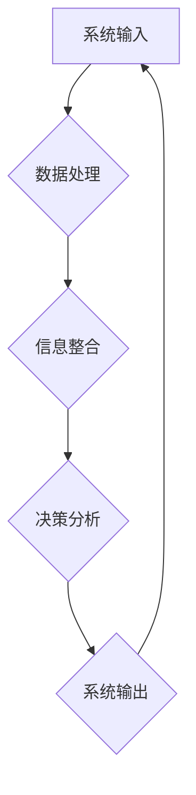
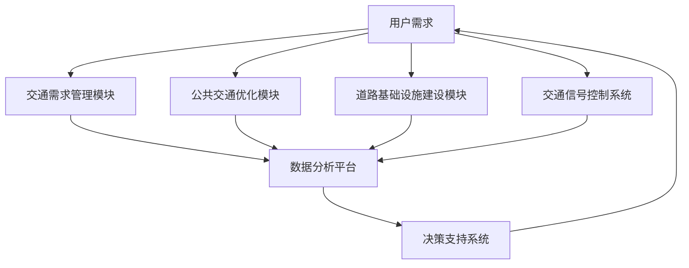
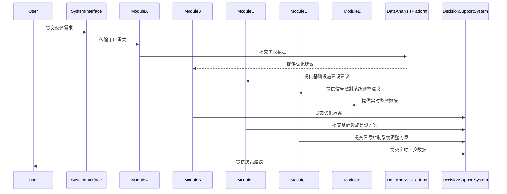
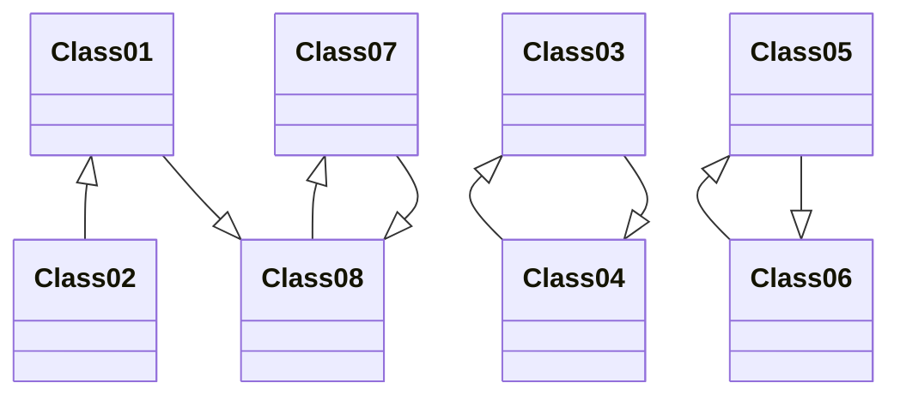
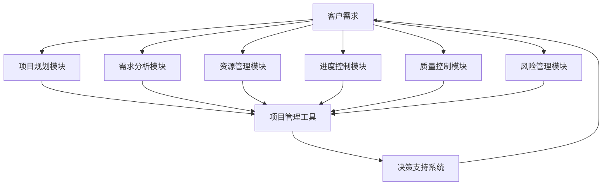
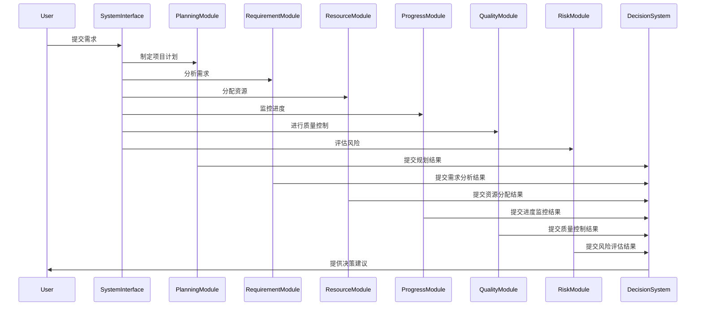

                 

### 信息碎片化的现象

随着互联网和移动设备的普及，我们正处在一个信息爆炸的时代。碎片化信息，顾名思义，是指那些分散且零碎的信息片段，它们往往来自于不同的渠道，形式多样，且没有明显的关联性。这种现象不仅改变了人们的消费习惯，也对社会产生了深远的影响。

首先，从定义上看，碎片化信息可以理解为一种非结构化或半结构化的数据，这些数据通常没有经过系统的整理和归档，而是以原始或初步的形式存在。碎片化信息的来源多种多样，包括社交媒体、新闻网站、博客、视频平台以及各类应用程序等。这些平台为用户提供了便捷的信息获取途径，但同时也导致了信息的过载。

其次，碎片化信息对个体的影响是多方面的。从正面来看，它使得个体能够快速获取所需的信息，提高了工作效率。然而，从负面来看，过度依赖碎片化信息会导致个体的思维模式趋于浅薄，难以形成深刻的理解和整体性思维。这种现象被称为“肤浅化”，即个体只停留在表面信息上，而忽视了深层次的思考和分析。

此外，碎片化信息对社会也产生了显著的冲击。一方面，它加剧了社会的分化，使得信息鸿沟更加明显。富人和受教育程度较高的人更容易获取高质量的信息，而贫困和受教育程度较低的人群则处于信息劣势。另一方面，碎片化信息也导致社会共识的减弱，因为每个人都可以在自己的小圈子里找到支持自己观点的信息，这加剧了社会的分裂和冲突。

综上所述，信息碎片化现象无处不在，它不仅改变了我们的生活方式，也对个体和社会产生了深远的影响。在接下来的章节中，我们将进一步探讨整体观的重要性以及如何构建整体世界观。在碎片化信息的洪流中，整体观的构建显得尤为重要，它能够帮助我们更好地理解和应对复杂的世界。

### 整体观的定义与重要性

整体观，简单来说，是一种从整体角度出发，理解和分析事物的思维方式。它强调各个组成部分之间的相互联系和整体性，而不是孤立地看待每个部分。这种思维方式不仅适用于自然科学，也在社会科学和人文科学中有着广泛的应用。

首先，整体观在个体层面具有显著的重要性。拥有整体观的个体能够更好地理解复杂现象，并从多个角度进行综合思考。这种能力不仅有助于提高个人的认知水平，还能够增强问题解决的能力。例如，在处理一个复杂的项目时，整体观可以帮助个体看到各个任务之间的关联，从而制定出更有效的解决方案。

其次，整体观在集体层面同样具有重要意义。一个具备整体观的社会能够更好地应对复杂的社会问题，例如环境污染、公共健康危机和社会不平等等。整体观能够促使社会成员认识到各个部分之间的相互依存关系，从而形成共同的价值观和目标，推动社会的和谐发展。

进一步来看，整体观与碎片化信息的关系是辩证的。碎片化信息虽然提供了丰富的信息资源，但也容易导致个体的思维模式趋于分散和浅薄。而整体观则能够帮助我们克服这种碎片化的影响，通过系统性地整合信息，形成对复杂现象的深刻理解。具体来说，整体观可以帮助我们识别信息之间的关联，构建完整的知识体系，从而在纷繁复杂的信息海洋中保持清晰的思维。

综上所述，整体观在个体和集体层面都具有重要价值。它不仅有助于提升个体的认知能力和问题解决能力，还能够促进社会的整体发展。在接下来的章节中，我们将进一步探讨整体观构建的必要性及其在应对当前社会挑战中的重要作用。

### 整体观构建的必要性

在当前社会，面对各种复杂挑战，构建整体观显得尤为必要。首先，我们必须认识到，当前社会面临的一系列问题，如环境污染、资源短缺、社会不平等等，都是复杂系统问题，需要从整体角度进行思考和解决。这些问题的根源往往在于各个部分之间的相互关系和整体性，而碎片化的思维方式容易导致片面和短视的解决方案。

具体来说，构建整体观的重要性体现在以下几个方面：

**1. 应对复杂系统问题：**复杂系统问题通常涉及多个因素和变量，各个因素之间相互作用、相互影响。如果我们仅从单一视角或局部出发，很难找到根本的解决方案。而整体观能够帮助我们识别和把握这些因素之间的复杂关系，从而提出更全面、更有效的解决方案。

**2. 促进社会和谐发展：**社会是一个复杂的系统，各个部分之间相互依存、相互作用。缺乏整体观会导致社会成员之间的矛盾和冲突加剧，从而阻碍社会的和谐发展。整体观强调各个部分之间的协调和平衡，有助于形成共同的目标和价值观，推动社会的和谐进步。

**3. 提高个体认知水平：**在信息碎片化的时代，个体很容易被大量的零散信息所淹没，导致认知能力和思考能力的下降。而整体观能够帮助个体从整体角度出发，整合和梳理信息，形成深刻的理解和系统性的知识体系，从而提高个体的认知水平。

**4. 应对不确定性：**现代社会充满了不确定性和变化，整体观能够帮助我们更好地应对这种不确定性。通过整体性思考，个体和集体能够更加灵活和适应性地应对变化，从而降低风险和不确定性带来的负面影响。

**5. 推动创新和进步：**整体观鼓励跨学科、跨领域的合作和交流，能够促进创新和进步。在一个复杂的世界中，单一学科或领域很难解决所有问题，而整体观能够整合不同领域的知识和方法，推动跨领域的创新和进步。

总之，构建整体观是应对当前社会挑战的必要手段。它不仅能够帮助我们更好地理解和解决复杂问题，还能够促进社会的和谐发展和个体的成长。在接下来的章节中，我们将详细探讨整体观的核心概念，并阐述如何通过具体的方法和步骤来构建整体观。

### 整体观的核心概念

构建整体观首先需要理解几个核心概念，这些概念不仅构成了整体观的基础，也是我们在复杂环境中进行有效思考和决策的关键。以下是几个关键概念及其特征和联系：

#### 系统思维

系统思维是一种从整体性和动态性角度来理解和分析系统的思维方式。它强调系统内部各个组成部分之间的相互关系和相互作用，而不是孤立地看待每个部分。系统思维的核心特征包括：

- **整体性**：系统思维强调整体性，认为系统中的各个部分是相互依赖和相互影响的，而不是孤立的实体。
- **动态性**：系统思维关注系统的动态变化，认为系统在不断演化，各个部分之间的相互作用会随着时间的推移而发生变化。
- **反馈循环**：系统思维强调反馈机制，认为系统中的反馈循环是维持系统稳定性和动态平衡的重要因素。

#### 整体性原则

整体性原则是整体观的核心指导思想，它主张将系统的各个部分视为一个统一的整体，而不是单独的个体。整体性原则的关键特征包括：

- **关联性**：整体性原则强调各个部分之间的关联性，认为系统的整体性能取决于各个部分之间的协调和合作。
- **功能一致性**：整体性原则要求系统的各个部分在功能和目标上保持一致性，从而实现整体最优。
- **互动性**：整体性原则认为各个部分之间的互动和交流是系统有效运行的关键。

#### 相互依存关系

相互依存关系是指系统中的各个部分之间存在着相互依赖和相互作用。这种关系反映了整体观中的整体性和动态性。相互依存关系的特征包括：

- **依赖性**：系统中的各个部分相互依赖，某一部分的变化会影响到其他部分。
- **反馈性**：相互依存关系包含正反馈和负反馈，正反馈会导致系统加速变化，而负反馈则有助于维持系统的稳定。
- **动态平衡**：相互依存关系强调系统的动态平衡，通过不断的调整和适应，维持系统的稳定和可持续发展。

这些核心概念共同构成了整体观的理论框架，并在实际应用中相互联系和相互作用。通过系统思维，我们能够从整体性和动态性的角度来理解复杂系统；整体性原则指导我们在设计和分析系统时，关注各个部分之间的关联性和互动性；相互依存关系则帮助我们识别和理解系统中各个部分之间的相互作用和依赖。

以下是一个ER实体关系图，用于描述这些核心概念之间的联系：

```mermaid
erDiagram
  SystemThinking ||--|{ OverallPrinciple }
  SystemThinking ||--|{ Interdependence }
  OverallPrinciple ||--|{ RelationalLink }
  Interdependence ||--|{ FeedbackCycle }
```

在这个ER图中，系统思维作为核心概念，与整体性原则和相互依存关系形成紧密的联系。整体性原则通过关联性和功能一致性，指导我们理解和设计系统；相互依存关系则通过依赖性和反馈性，帮助我们把握系统中各个部分之间的相互作用。这些核心概念共同构成了整体观的理论基础，为我们提供了有效的思考和分析工具。

### 概念属性特征对比

为了更好地理解整体观的核心概念，我们可以通过一个表格来对比系统思维、整体性原则和相互依存关系的属性特征。

| 概念          | 特征                             |  
| ------------- | ------------------------------ |
| 系统思维      | 强调整体性、动态性和相互关系 |  
| 整体性原则    | 关注系统内部各个部分的关系    |  
| 相互依存关系  | 强调事物之间的相互作用和依赖 |

- **系统思维**：系统思维是一种从整体性和动态性角度出发的思维方式，强调系统内部各个组成部分之间的相互关系和相互作用。它的核心特征是整体性、动态性和相互关系。

- **整体性原则**：整体性原则是整体观的指导思想，主张将系统的各个部分视为一个统一的整体，而不是单独的个体。它关注系统内部各个部分之间的关系，通过关联性和功能一致性来指导系统的设计和分析。

- **相互依存关系**：相互依存关系反映了系统中各个部分之间的相互作用和依赖。它强调系统中的各个部分相互依赖，某一部分的变化会影响到其他部分。这种关系通过依赖性和反馈性来维持系统的稳定和动态平衡。

通过这个表格，我们可以清晰地看到这三个核心概念在属性特征上的区别和联系。系统思维强调整体性和动态性，整体性原则关注系统内部各个部分的关系，相互依存关系则强调系统内部各部分之间的相互作用和依赖。这些特征共同构成了整体观的理论框架，为我们在复杂环境中进行有效思考和决策提供了有力支持。

### 整体观的ER实体关系图架构

为了更直观地展示整体观的核心概念之间的联系，我们可以通过一个ER（实体关系）图来描述这些概念之间的相互关系。ER图是一种数据库模型，用于表示实体之间的关系。在整体观的ER图中，我们可以定义以下几个主要的实体：

1. **系统思维（SystemThinking）**
2. **整体性原则（OverallPrinciple）**
3. **相互依存关系（Interdependence）**
4. **关联性（RelationLink）**
5. **反馈循环（FeedbackCycle）**

以下是整体观ER图的描述和每个实体与关系的说明：

```mermaid
erDiagram
  SystemThinking ||--|{ OverallPrinciple } OverallPrinciple
  SystemThinking ||--|{ Interdependence } Interdependence
  OverallPrinciple ||--|{ RelationLink } RelationLink
  Interdependence ||--|{ FeedbackCycle } FeedbackCycle
```

**实体说明：**

- **系统思维（SystemThinking）**：表示一种思维方式，强调整体性、动态性和相互关系。
- **整体性原则（OverallPrinciple）**：表示整体观的指导思想，关注系统内部各个部分之间的关系。
- **相互依存关系（Interdependence）**：表示系统内部各部分之间的相互作用和依赖。
- **关联性（RelationLink）**：表示系统内部各部分之间的关联性，是整体性原则的重要组成部分。
- **反馈循环（FeedbackCycle）**：表示系统内部的反馈机制，通过正反馈和负反馈来维持系统的稳定和动态平衡。

**关系说明：**

- **系统思维与整体性原则的关系**：系统思维是整体观的出发点和核心，它指导整体性原则的制定和应用。
- **系统思维与相互依存关系的关系**：系统思维强调系统内部各个部分之间的相互作用，这直接导致了相互依存关系的存在。
- **整体性原则与关联性的关系**：整体性原则通过关联性来具体体现系统内部各个部分之间的联系。
- **相互依存关系与反馈循环的关系**：相互依存关系通过反馈循环来维持和调整系统内部的动态平衡。

通过这个ER图，我们可以清晰地看到系统思维、整体性原则、相互依存关系和反馈循环之间的相互关系，这些关系共同构成了整体观的理论框架，为我们理解和应用整体观提供了有效的工具。

### 整体观构建的理论基础

要有效地构建整体观，必须理解并应用一系列理论基础，这些理论不仅提供了整体观的基本概念，还为我们提供了实际操作的方法。以下是几个关键理论基础及其在整体观构建中的应用：

#### 系统论

系统论是整体观构建的重要理论基础之一。它是由贝塔朗菲（Ludwig von Bertalanffy）在20世纪中叶提出的，主要研究系统的结构、功能及其动态行为。系统论的基本原理包括：

- **整体性原理**：系统作为一个整体，其功能不仅仅取决于各个部分的功能，还取决于各部分之间的相互关系和整体结构。
- **动态平衡原理**：系统会通过内部调节机制来维持稳定状态，这种动态平衡是一个持续的过程。
- **开放性原理**：系统是开放的，与外界不断进行物质、能量和信息交换。

系统论在整体观构建中的应用主要体现在以下几个方面：

1. **系统的分解与整合**：通过系统论，我们可以将复杂系统分解为更小的子系统，然后通过分析这些子系统之间的关系，重新整合成一个完整的系统。
2. **反馈机制的设计**：系统论强调反馈机制的重要性，通过建立和优化反馈循环，可以有效地调整系统行为，实现整体稳定和可持续发展。
3. **动态模拟与分析**：系统论提供了一系列模拟和分析方法，如系统动力学模型，帮助我们理解和预测系统的动态行为。

#### 系统动力学

系统动力学是系统论的一个分支，主要研究系统内部变量之间的相互作用及其动态行为。它通过数学模型和计算机模拟来描述和预测系统的动态过程。系统动力学的基本概念包括：

- **因果关系**：系统内部各变量之间的因果关系及其时间延迟。
- **反馈循环**：系统内部正反馈和负反馈循环，它们分别导致系统的加速和稳定。
- **延迟效应**：系统内部变量之间的时间延迟效应，这决定了系统的动态特性。

系统动力学在整体观构建中的应用主要体现在：

1. **动态建模**：通过系统动力学模型，我们可以构建系统的动态模拟，预测系统在不同初始条件和干扰下的行为。
2. **政策分析**：系统动力学模型可以帮助政策制定者分析不同政策选择对系统的影响，从而制定更有效的政策。
3. **风险管理**：系统动力学模型可以用来识别和评估系统的潜在风险，为风险管理提供科学依据。

#### 复杂系统理论

复杂系统理论是近年来迅速发展的一个跨学科领域，它研究复杂系统的结构、行为和演化。复杂系统的特性包括：

- **自组织性**：系统可以通过自我组织形成复杂结构。
- **涌现性**：复杂系统中的行为和现象往往不是单个部分行为的简单叠加，而是涌现出来的新属性。
- **适应性**：系统具有适应外部变化的能力。

复杂系统理论对整体观构建的启示主要体现在：

1. **整体性与局部性**：复杂系统理论强调整体性和局部性的相互作用，帮助我们理解系统如何在局部结构和整体行为之间实现平衡。
2. **适应性思维**：复杂系统理论提倡适应性思维，即在设计和分析系统时，要考虑系统的适应性和灵活性。
3. **模型构建**：复杂系统理论提供了多种建模方法，如多-agent模型、网络模型等，帮助我们理解和分析复杂系统的行为。

通过这些理论基础，我们可以更系统地构建整体观，不仅在理论上理解整体性、动态性和相互依存关系，还能在实际应用中有效地应用这些概念，为解决复杂问题提供强有力的支持。

### 整体观构建的实践步骤

在了解了整体观的理论基础后，我们需要将其应用到实践中，通过一系列具体步骤来构建整体观。以下是整体观构建的实践步骤，包括分析信息源、构建整体模型和应用场景等：

#### 1. 分析信息源

**步骤1.1：收集信息**

首先，我们需要收集与特定问题或系统相关的各种信息。这些信息可以来源于多种渠道，如文献资料、实地调研、数据分析等。重要的是，信息收集要全面且具有代表性，以确保我们能够获取到关键的信息点。

**步骤1.2：筛选信息**

在收集了大量信息后，我们需要对信息进行筛选和分类，识别出关键信息点。关键信息点通常是与问题解决密切相关的数据或事实，这些信息将作为后续分析的依据。

**步骤1.3：整合信息**

将筛选出的关键信息点进行整合，构建一个初步的信息框架。这个框架可以帮助我们更清晰地理解系统或问题的结构，并揭示各个部分之间的潜在关系。

#### 2. 构建整体模型

**步骤2.1：定义模型元素**

在整合信息的基础上，我们定义整体模型的基本元素。这些元素包括系统中的各个部分、变量、参数和关系。通过定义这些元素，我们可以将复杂系统或问题抽象成一个简化的模型。

**步骤2.2：绘制整体模型流程图**

使用Mermaid等工具，我们可以绘制整体模型的流程图。流程图应该清晰地展示系统内部各个部分之间的关系和相互作用，以及系统与外部环境之间的交互。

**示例：**



在这个流程图中，A代表系统输入，经过数据处理（B），信息整合（C），决策分析（D）后，得到系统输出（E），并再次作为系统输入（A）。

**步骤2.3：说明模型元素**

对整体模型中的每个元素进行详细说明，包括元素的功能、作用和相互关系。这些说明将帮助我们更好地理解模型的工作原理，并为进一步的优化和改进提供指导。

#### 3. 整体观的应用场景

**步骤3.1：社会治理**

在社会治理中，整体观可以帮助我们更好地理解和应对复杂的社会问题。例如，通过整体模型，我们可以分析不同政策对社会各个方面的影响，从而制定出更加科学、有效的政策。

**步骤3.2：企业管理**

在企业管理中，整体观可以帮助我们优化业务流程，提高企业的运营效率。通过整体模型，我们可以识别关键业务环节，分析各环节之间的相互关系，从而找到优化点。

**步骤.3：教育领域**

在教育领域，整体观可以帮助我们设计和实施更有效的教育方案。通过整体模型，我们可以分析学生的学习过程、教师的教学方法和教育资源的配置，从而提出改进措施。

**示例应用场景：**

- **社会治理：**通过整体模型分析城市交通问题，识别交通拥堵的主要原因，并提出综合解决方案。
- **企业管理：**通过整体模型优化企业供应链管理，提高供应链的灵活性和响应速度。
- **教育领域：**通过整体模型设计个性化教育方案，根据学生的学习特点提供定制化的教学资源和指导。

通过上述实践步骤，我们可以将整体观理论应用到实际问题的解决中，从而实现系统优化和整体发展。

### 整体观构建的工具与技术

在构建整体观的过程中，选择合适的信息整合技术、信息处理技术和信息分析技术是至关重要的。这些技术不仅能够帮助我们高效地收集、处理和分析信息，还能够确保整体观的构建过程具有科学性和系统性。以下是几种常用的工具和技术：

#### 信息整合技术

1. **数据挖掘（Data Mining）**

数据挖掘是一种从大量数据中提取有价值信息的方法，它可以通过统计分析和机器学习技术识别数据中的模式、趋势和关联。在整体观构建中，数据挖掘可以帮助我们识别关键信息点，揭示系统或问题的内在结构。

2. **数据可视化（Data Visualization）**

数据可视化是一种通过图形、图表和图像来展示数据的方法，它能够帮助人们直观地理解复杂数据的含义。在整体观构建中，数据可视化工具如Tableau、PowerBI等可以用于展示整体模型中的关键信息和关系，从而增强我们对系统的理解和分析能力。

#### 信息处理技术

1. **自然语言处理（Natural Language Processing，NLP）**

自然语言处理是一种使计算机能够理解和处理人类语言的技术。在整体观构建中，NLP技术可以帮助我们处理和分析大量的文本信息，例如政策文件、研究报告和用户评论等，从而提取关键信息和洞察。

2. **机器学习（Machine Learning，ML）**

机器学习是一种通过数据训练模型，使其能够自动学习和预测的技术。在整体观构建中，机器学习算法可以用于预测系统的未来行为，优化决策过程，以及识别潜在的风险和问题。

#### 信息分析技术

1. **数据分析（Data Analysis）**

数据分析是一种通过统计和计算方法对数据进行分析的方法，它可以帮助我们理解数据的内在规律和趋势。在整体观构建中，数据分析技术可以用于验证模型假设，评估系统性能，以及识别关键影响因素。

2. **趋势预测（Trend Forecasting）**

趋势预测是一种基于历史数据和现有模式，对未来趋势进行预测的方法。在整体观构建中，趋势预测可以帮助我们预测系统的未来行为和变化，从而制定相应的策略和规划。

通过结合这些信息整合、处理和分析技术，我们可以构建一个科学、系统且高效的整体观，从而更好地理解和应对复杂的问题和挑战。

### 案例一：社会治理中的整体观构建

#### 6.1 案例背景

本案例以一个虚构的城市——"绿城"为例，探讨整体观在解决城市交通拥堵问题中的应用。"绿城"位于一个经济繁荣、人口密集的地区，近年来，随着城市化进程的加速，城市交通拥堵问题日益严重。交通拥堵不仅影响了居民的日常生活，还对城市的经济发展产生了负面影响。为了解决这一问题，绿城政府决定采用整体观的方法，通过构建一个全面的交通管理系统来优化城市交通。

#### 6.2 案例目标

本案例的主要目标是：

1. **识别交通拥堵的主要原因**：通过数据分析和系统建模，识别导致交通拥堵的主要因素，如高峰时段、道路容量、公共交通服务等。
2. **提出综合解决方案**：基于整体观，设计一个综合的交通管理系统，包括交通需求管理、公共交通优化、道路基础设施建设等，以缓解交通拥堵问题。
3. **评估方案效果**：通过模拟和评估，验证所提出的综合解决方案的可行性和有效性。

#### 6.3 系统功能设计

**领域模型Mermaid类图**

```mermaid
classDiagram
    Class01 <|-- Class02
    Class03 <|-- Class04
    Class05 {<<interface>>}
    Class01 --|> Class05
    Class03 --|> Class04
    Class02 --|> Class05
```

- **Class01（交通需求管理模块）**：负责收集和分析城市交通需求数据，包括车辆流量、出行时间等。
- **Class02（公共交通优化模块）**：负责分析公共交通系统的运行效率，并提出优化建议。
- **Class03（道路基础设施建设模块）**：负责规划和设计城市道路基础设施建设方案。
- **Class04（交通信号控制系统）**：负责实时监控和调控城市交通信号，优化交通流量。
- **Class05（综合交通管理系统接口）**：提供统一的接口，整合各个模块的功能，实现交通管理系统的整体运作。

**系统架构设计Mermaid架构图**



- **用户需求**：用户通过系统接口提交交通需求。
- **交通需求管理模块**：处理用户需求，生成交通需求报告，并将数据传输到数据分析平台。
- **公共交通优化模块**：分析公共交通系统数据，生成优化方案，提交给决策支持系统。
- **道路基础设施建设模块**：分析交通流量数据，规划道路基础设施建设方案，提交给决策支持系统。
- **交通信号控制系统**：实时监控城市交通状况，调整交通信号，优化交通流量。
- **数据分析平台**：集成各类交通数据，提供数据分析和报告生成功能。
- **决策支持系统**：综合分析各模块数据，生成决策建议，指导城市交通管理。

#### 6.4 系统接口设计

**系统接口说明**

1. **用户接口**：提供用户提交交通需求的入口，包括出行时间、起点、终点等信息。
2. **数据接口**：提供各模块之间的数据传输接口，确保数据的实时性和一致性。
3. **决策接口**：提供决策支持系统与各模块之间的交互接口，确保决策建议的有效性和可操作性。

**系统接口Mermaid序列图**



#### 6.5 系统实现与解析

**环境安装**

1. 安装Mermaid工具，用于绘制流程图和序列图。
2. 安装Python环境，用于编写和运行数据处理和分析代码。
3. 安装相关数据分析库，如Pandas、NumPy、Matplotlib等。

**系统核心实现源代码**

```python
# 交通需求管理模块实现
import pandas as pd

def collect_traffic_data():
    # 从不同渠道收集交通需求数据
    data = pd.read_csv('traffic_data.csv')
    return data

def analyze_traffic_data(data):
    # 分析交通需求数据
    summary = data.groupby(['time', 'route']).count().unstack(fill_value=0)
    return summary

# 公共交通优化模块实现
def optimize_public_transport(data_analysis):
    # 优化公共交通系统
    optimized_route = data_analysis['route'].idxmax()
    return optimized_route

# 道路基础设施建设模块实现
def infrastructure_suggestions(data_analysis):
    # 提出道路基础设施建设建议
    infrastructure_plan = data_analysis[data_analysis['route'] == 'main_road'].idxmax()
    return infrastructure_plan

# 交通信号控制系统实现
def traffic_signal_control(data_analysis):
    # 实时监控和调控交通信号
    signal_adjustment = data_analysis['time'].apply(lambda x: 'red' if x > 10 else 'green')
    return signal_adjustment

# 决策支持系统实现
def generate_decision_suggestions(optimized_route, infrastructure_plan, signal_adjustment):
    # 生成决策建议
    suggestions = {
        'optimized_route': optimized_route,
        'infrastructure_plan': infrastructure_plan,
        'signal_adjustment': signal_adjustment
    }
    return suggestions

# 主程序
if __name__ == '__main__':
    data = collect_traffic_data()
    data_summary = analyze_traffic_data(data)
    
    optimized_route = optimize_public_transport(data_summary)
    infrastructure_plan = infrastructure_suggestions(data_summary)
    signal_adjustment = traffic_signal_control(data_summary)
    
    decision_suggestions = generate_decision_suggestions(optimized_route, infrastructure_plan, signal_adjustment)
    print(decision_suggestions)
```

**代码应用解读与分析**

1. **数据收集**：通过`collect_traffic_data()`函数，从不同渠道收集交通需求数据，并将其存储为Pandas DataFrame格式，方便后续分析。

2. **数据分析**：通过`analyze_traffic_data()`函数，对收集到的交通需求数据进行分组和汇总，生成交通流量分析报告。

3. **公共交通优化**：通过`optimize_public_transport()`函数，根据数据分析结果，选择流量最大的公共交通线路进行优化。

4. **基础设施建设**：通过`infrastructure_suggestions()`函数，根据交通流量分析结果，提出道路基础设施建设的优化方案。

5. **交通信号控制**：通过`traffic_signal_control()`函数，根据实时交通流量数据，调整交通信号灯的状态，以优化交通流量。

6. **决策建议生成**：通过`generate_decision_suggestions()`函数，综合各模块的结果，生成最终的决策建议，指导城市交通管理。

通过这个案例，我们可以看到整体观在解决复杂社会问题中的应用，以及如何通过系统化的方法和步骤来构建整体模型，实现问题的有效解决。

### 案例二：企业管理中的整体观构建

#### 7.1 案例背景

本案例以一家虚构的科技公司——"未来科技公司"为例，探讨整体观在优化企业产品研发管理中的应用。未来科技公司是一家专注于人工智能产品开发的高科技企业，近年来，随着市场竞争的加剧和客户需求的多样化，公司在产品研发管理上面临诸多挑战。为了提升产品研发效率和产品质量，公司决定采用整体观的方法，通过构建一个全面的研发管理体系来优化产品研发过程。

#### 7.2 案例目标

本案例的主要目标是：

1. **识别研发管理中的瓶颈**：通过数据分析和方法论应用，识别当前研发管理中的瓶颈和关键问题，如项目进度延迟、资源分配不合理、质量问题等。
2. **构建研发管理体系**：基于整体观，设计一个涵盖项目规划、资源管理、质量控制和风险管理等环节的研发管理体系，以提升整体研发效率和产品质量。
3. **优化研发流程**：通过流程优化和改进，减少研发周期，提高研发成功率，增强企业市场竞争力。

#### 7.3 系统功能设计

**领域模型Mermaid类图**



- **Class01（项目规划模块）**：负责制定项目计划，包括项目目标、时间表和资源需求等。
- **Class02（需求分析模块）**：负责分析客户需求和市场趋势，为项目规划提供依据。
- **Class03（资源管理模块）**：负责分配和调度项目所需的资源，包括人力资源、设备和资金等。
- **Class04（进度控制模块）**：负责监控项目进度，识别和解决进度偏差问题。
- **Class05（质量控制模块）**：负责确保产品的质量符合标准和客户需求。
- **Class06（风险管理模块）**：负责识别和评估项目风险，制定应对措施。
- **Class07（项目管理工具）**：提供项目管理所需的工具和平台，支持各模块的功能实现。
- **Class08（综合研发管理体系接口）**：提供统一的接口，整合各个模块的功能，实现研发管理系统的整体运作。

**系统架构设计Mermaid架构图**



- **客户需求**：客户提交的产品需求和市场趋势信息。
- **项目规划模块**：制定项目计划，并将需求分析结果纳入规划。
- **需求分析模块**：分析客户需求和市场趋势，为项目规划提供数据支持。
- **资源管理模块**：根据项目需求，合理分配和调度各类资源。
- **进度控制模块**：监控项目进度，识别进度偏差，并采取措施进行调整。
- **质量控制模块**：确保产品质量符合标准和客户需求，进行质量控制和改进。
- **风险管理模块**：识别和评估项目风险，制定应对措施，降低风险影响。
- **项目管理工具**：提供项目管理的工具和平台，支持各模块的运行和协作。
- **决策支持系统**：综合分析各模块数据，生成决策建议，指导项目管理和决策。

#### 7.4 系统接口设计

**系统接口说明**

1. **用户接口**：提供用户提交产品需求和市场趋势的入口。
2. **数据接口**：提供各模块之间的数据传输接口，确保数据的实时性和一致性。
3. **决策接口**：提供决策支持系统与各模块之间的交互接口，确保决策建议的有效性和可操作性。

**系统接口Mermaid序列图**



#### 7.5 系统实现与解析

**环境安装**

1. 安装Mermaid工具，用于绘制流程图和序列图。
2. 安装Python环境，用于编写和运行数据处理和分析代码。
3. 安装相关数据分析库，如Pandas、NumPy、Matplotlib等。

**系统核心实现源代码**

```python
# 项目规划模块实现
import pandas as pd

def project_plan(requirement_data):
    # 根据需求数据制定项目计划
    plan = {
        'project_name': 'AI产品研发项目',
        'start_date': '2023-04-01',
        'end_date': '2024-03-31',
        'required_resources': ['研发人员', '测试人员', '设备']
    }
    return plan

# 需求分析模块实现
def requirement_analysis(client_demand):
    # 分析客户需求和市场趋势
    analysis_results = {
        'client_demand': '智能语音助手',
        'market_trend': '语音识别技术的广泛应用'
    }
    return analysis_results

# 资源管理模块实现
def resource_management(plan, analysis_results):
    # 根据项目计划和需求分析结果，分配资源
    resource_allocation = {
        'developers': 20,
        'testers': 10,
        'testing_equipment': 5
    }
    return resource_allocation

# 进度控制模块实现
def progress_control(implementation_data):
    # 监控项目进度，识别进度偏差
    progress_report = {
        'current_date': '2023-06-01',
        'actual_progress': '40%',
        'required_adjustments': '增加测试人员'
    }
    return progress_report

# 质量控制模块实现
def quality_control(product_data):
    # 确保产品质量符合标准和客户需求
    quality_status = {
        'pass_rate': '90%',
        'quality_issues': '无重大质量问题'
    }
    return quality_status

# 风险管理模块实现
def risk_management(implementation_data):
    # 识别和评估项目风险
    risk_assessment = {
        'risks': ['技术难题', '资金短缺'],
        'mitigation_measures': ['增加研发投入', '风险投资合作']
    }
    return risk_assessment

# 决策支持系统实现
def generate_decision_suggestions(plan, analysis_results, resource_allocation, progress_report, quality_status, risk_assessment):
    # 综合分析各模块数据，生成决策建议
    suggestions = {
        'project_plan': plan,
        'requirement_analysis': analysis_results,
        'resource_management': resource_allocation,
        'progress_control': progress_report,
        'quality_control': quality_status,
        'risk_management': risk_assessment
    }
    return suggestions

# 主程序
if __name__ == '__main__':
    client_demand = '智能语音助手'
    requirement_data = requirement_analysis(client_demand)
    plan = project_plan(requirement_data)
    resource_allocation = resource_management(plan, requirement_data)
    implementation_data = progress_control(plan)
    product_data = quality_control(implementation_data)
    risk_data = risk_management(implementation_data)
    decision_suggestions = generate_decision_suggestions(plan, requirement_data, resource_allocation, implementation_data, product_data, risk_data)
    print(decision_suggestions)
```

**代码应用解读与分析**

1. **项目规划**：通过`project_plan()`函数，根据客户需求和市场分析结果，制定项目计划，包括项目名称、时间表和资源需求。

2. **需求分析**：通过`requirement_analysis()`函数，分析客户需求和市场趋势，为项目规划提供数据支持。

3. **资源管理**：通过`resource_management()`函数，根据项目计划和需求分析结果，合理分配资源，确保项目顺利实施。

4. **进度控制**：通过`progress_control()`函数，监控项目进度，识别进度偏差，并提出调整建议。

5. **质量控制**：通过`quality_control()`函数，确保产品的质量符合标准和客户需求，进行质量控制和改进。

6. **风险管理**：通过`risk_management()`函数，识别和评估项目风险，制定应对措施，降低风险影响。

7. **决策建议生成**：通过`generate_decision_suggestions()`函数，综合各模块的结果，生成最终的决策建议，指导项目管理和决策。

通过这个案例，我们可以看到整体观在企业管理中的应用，以及如何通过系统化的方法和步骤来构建研发管理体系，实现企业产品研发效率的提升和产品质量的优化。

### 整体观构建的最佳实践与启示

通过前述案例，我们可以总结出构建整体观的最佳实践，并从中获取一些有价值的启示。以下是几个关键实践经验和技巧：

#### 1. 系统性规划与设计

在进行整体观构建时，系统性规划和设计至关重要。首先，需要明确整体观的目标和范围，确保覆盖所有相关领域和环节。其次，制定详细的计划和时间表，明确每个步骤的职责和任务，确保项目有序推进。

#### 2. 数据驱动的决策

数据是构建整体观的核心资源，因此，数据驱动的决策方法尤为重要。通过全面、准确的数据收集和分析，可以更好地理解系统或问题的内在结构和关系，从而制定更科学、有效的决策。

#### 3. 综合多方意见

在构建整体观时，应充分听取不同利益相关者的意见，包括管理人员、技术人员、用户等。多角度、多层次的反馈有助于发现潜在的问题和优化点，提高整体观的全面性和适应性。

#### 4. 强化跨部门协作

整体观构建通常涉及多个部门和职能的协作，因此，强化跨部门协作是确保项目成功的关键。建立有效的沟通渠道和协作机制，可以促进信息共享和资源整合，提高整体观实施的效果。

#### 5. 定期评估与调整

整体观构建不是一次性的任务，而是一个持续的过程。因此，需要定期评估整体观的实施效果，识别问题和改进点，并进行相应的调整。通过持续优化，可以不断适应新的变化和挑战。

#### 启示

1. **整体观能够显著提升复杂问题的解决能力**：通过系统思维和整体性原则，整体观能够帮助我们更全面、深入地理解复杂问题，从而制定出更具针对性的解决方案。

2. **数据和分析技术是整体观构建的重要工具**：在信息碎片化的时代，数据和分析技术可以帮助我们整合和挖掘关键信息，提高决策的科学性和准确性。

3. **跨部门协作是实现整体观的重要保障**：只有通过跨部门协作，才能充分调动各方资源和力量，确保整体观的有效实施。

4. **持续优化和调整是整体观构建的关键**：面对不断变化的环境和需求，持续优化和调整是确保整体观长期有效的重要手段。

总之，通过这些最佳实践和启示，我们可以更好地构建和运用整体观，从而在复杂的社会和企业管理中取得更好的效果。

### 小结

本文通过系统性的探讨，深入解析了碎片化信息时代的整体世界观构建。首先，我们明确了信息碎片化的现象及其对个体和社会的深远影响。随后，详细阐述了整体观的定义、重要性以及核心概念，如系统思维、整体性原则和相互依存关系。接着，我们介绍了整体观构建的理论基础，包括系统论、系统动力学和复杂系统理论。通过一系列实践步骤和案例研究，展示了如何将整体观应用于社会治理和企业管理。本文还总结了构建整体观的最佳实践与启示，强调了系统性规划、数据驱动决策、跨部门协作以及持续优化调整的重要性。通过这些内容，我们希望能为读者提供全面而深刻的理解，帮助他们在复杂多变的环境中构建有效的整体观。

### 注意事项

在构建整体观的过程中，有一些常见问题和误区需要特别注意。以下是一些关键点：

1. **避免片面化思维**：整体观强调系统的整体性和相互依存关系，因此在分析和解决问题时，要避免仅关注单一方面，而忽视其他因素。片面化思维会导致解决方案的局限性。

2. **确保数据质量**：数据是整体观构建的基础，因此数据的质量至关重要。在收集和处理数据时，要确保数据的准确性和完整性，避免因数据质量问题导致分析结果的偏差。

3. **注重反馈机制**：整体观中的反馈机制是维持系统稳定性和动态平衡的关键。在实际应用中，要建立有效的反馈机制，及时收集和处理反馈信息，以便进行调整和优化。

4. **避免过度复杂化**：在构建整体模型时，要避免过度复杂化。过于复杂的模型可能会降低理解和操作的便利性，反而影响整体观的实际应用效果。

5. **持续迭代与优化**：整体观构建是一个持续的过程，需要不断迭代和优化。在面对新的变化和挑战时，要灵活调整模型和策略，确保整体观的长期有效性。

通过注意这些事项，我们可以更好地构建和应用整体观，提高问题解决的效果和效率。

### 拓展阅读

对于希望进一步深入了解整体观构建的读者，以下是一些推荐的书籍和资源：

#### 书籍推荐

1. **《系统思维：理解和管理复杂性》（System Thinking: Managing Chaos and Complexity：Gary Metcalf）**
   - 本书详细介绍了系统思维的基本概念和方法，帮助读者掌握理解和管理复杂性的工具。

2. **《系统动力学：理论与实践》（System Dynamics: Modeling and Simulation of Complex Systems：Judith S. Buchanan）**
   - 该书系统地讲解了系统动力学的理论基础和实践方法，适用于系统建模和模拟的初学者和专家。

3. **《复杂系统与复杂性科学》（Complex Systems and Complexity Science：M. Mitchell）**
   - 本书涵盖了复杂系统理论的核心概念和应用，适合对复杂系统理论感兴趣的读者。

#### 网络资源链接

1. **MIT系统动态学实验室（MIT System Dynamics Group）**
   - https://mitsd.mit.edu/
   - MIT系统动态学实验室提供了一系列关于系统动力学和复杂系统理论的课程和资源，包括模型库和工具。

2. **系统思维协会（System Dynamics Society）**
   - https://www.systemdynamics.org/
   - 系统思维协会是一个国际性的学术组织，致力于推广系统思维和应用系统动力学的方法。

3. **复杂系统手册（Handbook of Complex Systems）**
   - https://www.complex-systems.com/
   - 该网站提供了复杂系统理论的详细资料，包括学术论文、案例研究和工具集。

通过这些书籍和资源，读者可以更深入地了解整体观的构建和应用，从而在实际工作中更加有效地应对复杂问题。

