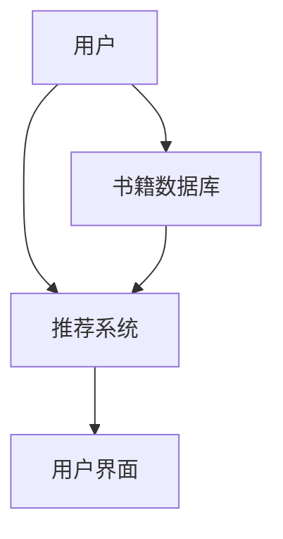
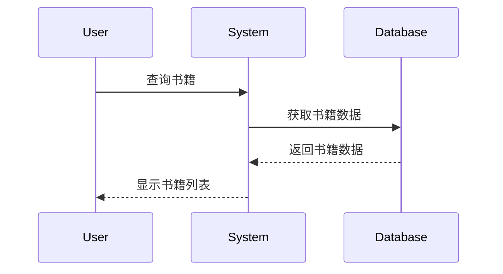
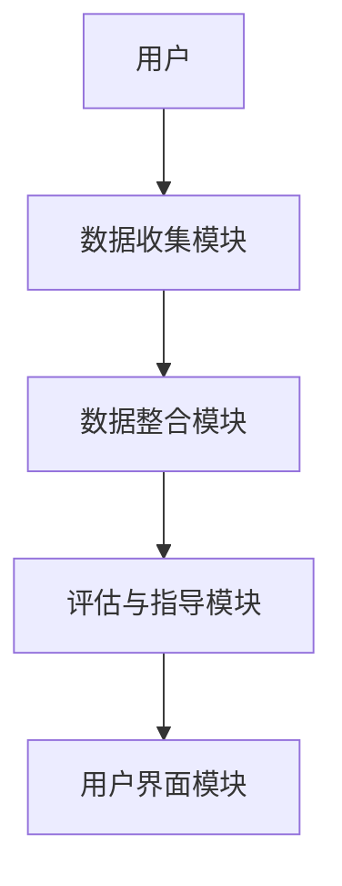
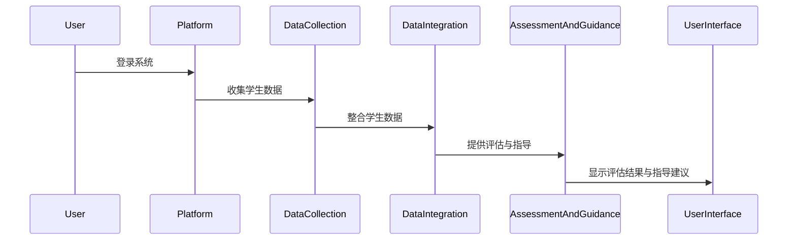
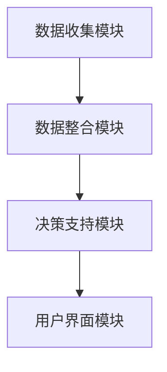
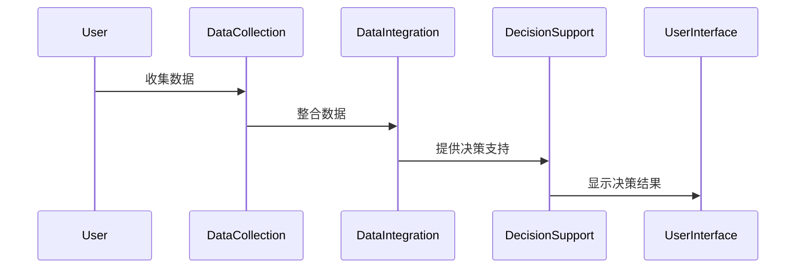

                 

# 碎片化时代的整体性追求：拼接生命的意义拼图

> 关键词：碎片化时代、整体性追求、生命意义、心理学、哲学、科技

> 摘要：在碎片化时代，人们面对的信息和任务变得繁多而零散，这给我们的生活和工作带来了诸多挑战。本文旨在探讨在这样的大背景下，如何通过整体性追求来拼接生命的意义拼图。文章首先分析了碎片化时代的特征和问题，然后探讨了整体性的定义及其在心理学和哲学中的基础，接着提出了整体性追求的实践方法，并详细讨论了其在个人成长和社会层面上的应用，最后对未来整体性追求的发展趋势进行了展望。

## 目录

- **引言**
  - 碎片化时代的挑战
  - 整体性追求的意义
- **第一部分：问题的提出与背景**
  - **第1章：碎片化时代的挑战与问题**
    - 碎片化时代的特点
    - 碎片化时代带来的挑战
    - 整体性的需求与意义
  - **第2章：碎片化时代的整体性观念**
    - 整体性的定义与概念
    - 整体性的哲学基础
    - 整体性的心理学视角
- **第二部分：碎片化时代的整体性追求实践**
  - **第3章：整体性生活方式的建立**
    - 整体性生活方式的构建
    - 整体性思维的培养
    - 整体性关系的构建
  - **第4章：整体性追求在个人成长中的应用**
    - 整体性追求在职业生涯中的应用
    - 整体性追求在个人健康中的应用
    - 整体性追求在情感关系中的应用
  - **第5章：整体性追求在社会层面的影响**
    - 整体性追求对社会的影响
    - 整体性追求在组织管理中的应用
    - 整体性追求在公共治理中的实践
- **第三部分：整体性追求的未来展望**
  - **第6章：整体性追求的未来发展趋势**
    - 整体性追求的未来发展趋势
    - 整体性追求在科技领域的应用
    - 整体性追求在文化领域的传播
  - **第7章：总结与展望**
    - 整体性追求的重要性
    - 整体性追求的挑战与机遇
    - 整体性追求的实践路径

### 引言

#### 碎片化时代的挑战

随着互联网和数字技术的飞速发展，我们的世界变得越来越碎片化。信息爆炸、社交网络、移动设备等新技术让我们接触的信息量呈指数级增长。与此同时，工作节奏的加快、生活压力的增大，使得我们不得不面对越来越多的碎片化任务。这些碎片化的信息和任务虽然看似丰富多样，但往往缺乏连贯性和整体性。

碎片化时代的特征主要包括以下几个方面：

1. **信息过载**：每天接收的海量信息让我们难以消化和吸收，往往导致信息疲劳和选择困难。
2. **任务零散**：工作、学习、生活等各方面的任务分散且零碎，难以形成系统化的规划和执行。
3. **时间碎片化**：随着移动设备的普及，人们的碎片化时间越来越多，但这些时间往往被低效利用。

#### 整体性追求的意义

在碎片化时代，整体性追求变得尤为重要。整体性不仅关乎信息的整合和任务的连贯，更关乎生命的意义和价值的实现。以下是整体性追求的几个关键意义：

1. **整合信息**：通过整体性思维，我们可以将碎片化的信息进行整合，形成系统的知识体系，从而提高信息利用效率。
2. **连贯任务**：整体性追求可以帮助我们制定系统的计划，将零散的任务整合成一个连贯的整体，从而提高工作效率。
3. **生命意义**：通过整体性追求，我们可以更好地理解自己的生命意义，实现个人成长和社会价值的最大化。

### 第一部分：问题的提出与背景

#### 第1章：碎片化时代的挑战与问题

##### 碎片化时代的特点

碎片化时代的特点主要体现在以下几个方面：

1. **信息碎片化**：互联网的普及使得信息传播速度极快，但也导致了信息的碎片化。人们往往只能获取到零散、不完整的信息，难以形成全面、深入的理解。
2. **任务碎片化**：工作、学习、生活等各方面的任务变得越来越零散，难以集中精力完成。这种碎片化的任务安排往往导致工作效率低下。
3. **时间碎片化**：随着移动设备的普及，人们的碎片化时间越来越多。然而，这些碎片化时间往往被低效利用，难以产生实质性的成果。

##### 碎片化时代带来的挑战

碎片化时代给我们的生活和工作带来了诸多挑战：

1. **注意力分散**：在碎片化时代，人们容易受到各种信息的干扰，难以集中注意力。这导致工作效率下降，学习效果不佳。
2. **焦虑感增加**：面对海量的信息和任务，人们往往感到压力和焦虑。这种焦虑感会进一步影响个人的身心健康。
3. **生活质量下降**：碎片化的工作和生活方式导致人们的生活节奏加快，生活质量下降。人们往往难以享受到生活的乐趣。

##### 整体性的需求与意义

在面对碎片化时代的挑战时，整体性追求显得尤为重要。整体性可以为我们提供以下益处：

1. **提高信息利用效率**：通过整体性思维，我们可以将碎片化的信息进行整合，形成系统的知识体系，从而提高信息利用效率。
2. **提高工作效率**：整体性追求可以帮助我们制定系统的计划，将零散的任务整合成一个连贯的整体，从而提高工作效率。
3. **增强生命意义感**：通过整体性追求，我们可以更好地理解自己的生命意义，实现个人成长和社会价值的最大化。

#### 第2章：碎片化时代的整体性观念

##### 整体性的定义与概念

整体性是指将事物视为一个统一整体，关注其内部各个部分之间的相互关系和作用。在碎片化时代，整体性观念具有以下几个核心概念：

1. **整合性**：将分散的信息和任务整合成一个整体，从而提高利用效率和执行效果。
2. **连贯性**：通过整体性思维，保持任务和信息的连贯性，避免碎片化的干扰和断裂。
3. **系统性**：将事物视为一个系统，关注其内部各个部分之间的相互关系和相互作用。

##### 整体性的哲学基础

整体性观念在哲学中有着深厚的理论基础，主要表现在以下几个方面：

1. **系统论**：系统论强调事物的整体性，认为事物是由多个部分组成的系统，各个部分之间相互依赖、相互作用。
2. **整体思维**：整体思维强调从整体的角度看待事物，关注事物的整体结构和功能，而不是仅仅关注局部和细节。
3. **辩证法**：辩证法强调事物的矛盾和对立统一，认为事物的发展是由内部矛盾推动的，整体性追求有助于化解矛盾，促进事物的健康发展。

##### 整体性的心理学视角

在心理学中，整体性观念也有着重要的应用价值。以下是一些关于整体性的心理学视角：

1. **知觉整体性**：心理学研究表明，人们在感知事物时，往往倾向于将其视为一个整体，而不是一系列零散的部分。这种整体性知觉有助于我们更好地理解和应对复杂的环境。
2. **认知连贯性**：人们在进行认知活动时，倾向于保持认知过程的连贯性，以减少认知负荷和信息处理成本。
3. **情感整体性**：情感整体性指的是人们在情感体验中，往往将其视为一个整体，而不是一系列零散的情感片段。这种情感整体性有助于我们更好地理解和表达情感。

### 第二部分：碎片化时代的整体性追求实践

#### 第3章：整体性生活方式的建立

##### 整体性生活方式的构建

整体性生活方式的建立是碎片化时代整体性追求的重要实践之一。以下是一些构建整体性生活方式的建议：

1. **日程规划**：制定详细的日程规划，将零散的时间块整合成一个整体，确保工作和生活的高效运行。
2. **任务整合**：将零散的任务整合成一个整体，制定系统化的任务清单，避免任务的碎片化。
3. **信息整合**：将分散的信息进行整合，建立一个系统的知识库，以便随时查阅和利用。

##### 整体性思维的培养

整体性思维的培养是整体性生活方式的基石。以下是一些培养整体性思维的方法：

1. **系统思考**：学会从整体的角度看待问题，关注问题的整体结构和功能，而不是仅仅关注局部和细节。
2. **跨界思维**：尝试跨学科、跨领域的思考，将不同的知识和思维模式整合起来，形成独特的见解。
3. **反思性思维**：通过反思性思维，不断审视自己的思维方式和方法，发现和纠正思维的盲点和误区。

##### 整体性关系的构建

在碎片化时代，建立整体性关系对于个人的成长和社会的和谐至关重要。以下是一些构建整体性关系的方法：

1. **深度沟通**：与他人进行深度沟通，建立深厚的信任和合作关系，从而实现资源共享和共同发展。
2. **情感连接**：通过情感连接，增进与家人、朋友和同事之间的情感联系，形成紧密的社交网络。
3. **共同目标**：与他人共同设定目标，共同努力实现目标，从而增强团队的凝聚力和执行力。

### 第三部分：整体性追求在个人成长中的应用

#### 第4章：整体性追求在个人成长中的应用

##### 整体性追求在职业生涯中的应用

在职业生涯中，整体性追求可以帮助我们更好地规划和管理个人职业发展，提高职业成就。以下是一些具体的应用方法：

1. **职业规划**：通过整体性思维，制定清晰的职业规划，将个人职业发展视为一个整体，逐步实现目标。
2. **技能整合**：将不同领域的技能进行整合，形成独特的专业优势，提高职业竞争力。
3. **职业平衡**：在职业生涯中，保持工作与生活的平衡，实现整体性的职业发展。

##### 整体性追求在个人健康中的应用

整体性追求在个人健康中的应用同样至关重要。以下是一些具体的应用方法：

1. **健康管理**：通过整体性思维，建立健康的生活方式，关注身体、心理和精神的全面发展。
2. **疾病预防**：通过整体性思维，提前预防疾病，减少健康风险。
3. **健康平衡**：在日常生活中，保持健康平衡，避免过度劳累和过度放松。

##### 整体性追求在情感关系中的应用

情感关系是人生中不可或缺的一部分，整体性追求可以帮助我们更好地建立和维护情感关系。以下是一些具体的应用方法：

1. **情感沟通**：通过深度沟通，增进与伴侣、家人和朋友的情感联系，建立稳定的关系。
2. **情感平衡**：在情感关系中，保持平衡，避免情感过度依赖和冲突。
3. **情感成长**：通过情感成长，提高自我认知和情感管理能力，实现个人成长。

### 第四部分：整体性追求在社会层面的影响

#### 第5章：整体性追求在社会层面的影响

##### 整体性追求对社会的影响

整体性追求在社会层面具有重要的影响。以下是一些具体的影响：

1. **社会和谐**：通过整体性追求，促进社会的和谐发展，减少社会矛盾和冲突。
2. **社会进步**：整体性追求有助于推动社会的进步，提高社会的整体发展水平。
3. **社会稳定**：整体性追求有助于维护社会的稳定，减少社会动荡和危机。

##### 整体性追求在组织管理中的应用

整体性追求在组织管理中具有重要作用。以下是一些具体的应用方法：

1. **组织规划**：通过整体性思维，制定清晰的组织规划，确保组织的整体目标和战略的连贯性。
2. **团队协作**：通过整体性追求，增强团队协作，提高团队的执行力和创造力。
3. **组织文化**：通过整体性追求，塑造积极向上的组织文化，提高员工的凝聚力和归属感。

##### 整体性追求在公共治理中的实践

整体性追求在公共治理中同样具有重要作用。以下是一些具体的应用方法：

1. **政策制定**：通过整体性思维，制定科学的政策，确保政策的连贯性和有效性。
2. **公共服务**：通过整体性追求，提高公共服务的质量和效率，满足人民群众的需求。
3. **社会治理**：通过整体性追求，构建和谐稳定的社会治理体系，维护社会的和谐与稳定。

### 第五部分：整体性追求的未来展望

#### 第6章：整体性追求的未来发展趋势

##### 整体性追求的未来发展趋势

随着科技的进步和社会的发展，整体性追求将面临新的发展趋势。以下是一些未来发展趋势：

1. **智能化**：随着人工智能技术的发展，整体性追求将更加智能化，实现更加精准和高效的整体性管理。
2. **全球化**：全球化趋势将加强整体性追求的国际化，促进不同国家和地区之间的整体性合作。
3. **可持续发展**：整体性追求将更加注重可持续发展，实现经济、社会和环境的整体性发展。

##### 整体性追求在科技领域的应用

整体性追求在科技领域具有广阔的应用前景。以下是一些具体的应用：

1. **大数据分析**：通过整体性思维，对海量数据进行整合和分析，发现隐藏在数据中的整体性规律。
2. **人工智能**：通过整体性思维，优化人工智能算法，提高人工智能系统的整体性能。
3. **区块链技术**：通过整体性思维，构建更加安全、可信的区块链系统，促进数字经济的整体性发展。

##### 整体性追求在文化领域的传播

整体性追求在文化领域也具有重要影响。以下是一些具体的文化传播途径：

1. **教育**：通过整体性思维，改革教育体系，培养学生的整体性思维能力和综合素质。
2. **媒体**：通过整体性思维，优化媒体内容，提高信息的整合性和连贯性。
3. **文化传承**：通过整体性追求，保护和传承文化遗产，实现文化的历史性和整体性。

### 第六部分：总结与展望

##### 整体性追求的重要性

整体性追求在碎片化时代具有重要意义。它不仅有助于我们提高工作效率和生活质量，还能帮助我们实现个人成长和社会进步。以下是一些关键要点：

1. **整合信息**：整体性追求有助于整合碎片化的信息，提高信息利用效率。
2. **连贯任务**：整体性追求有助于连贯零散的任务，提高工作效率。
3. **生命意义**：整体性追求有助于我们理解生命的意义，实现个人成长和社会价值的最大化。

##### 整体性追求的挑战与机遇

整体性追求面临诸多挑战，但也充满机遇。以下是一些挑战和机遇：

1. **挑战**：
   - 信息过载
   - 任务碎片化
   - 时间碎片化
   - 情感焦虑

2. **机遇**：
   - 智能化技术的进步
   - 全球化趋势
   - 可持续发展理念

##### 整体性追求的实践路径

为了实现整体性追求，我们需要采取一系列实践路径。以下是一些建议：

1. **培养整体性思维**：通过系统学习和实践，培养整体性思维，提高信息整合和任务连贯的能力。
2. **建立整体性生活方式**：通过日程规划、任务整合和信息整合，建立整体性生活方式。
3. **强化整体性关系**：通过深度沟通、情感连接和共同目标，强化整体性关系。
4. **参与整体性实践**：积极参与社会、组织和个人层面的整体性实践，推动整体性追求的发展。

### 结语

在碎片化时代，整体性追求是我们拼接生命意义拼图的重要途径。通过整体性思维和实践，我们可以应对碎片化时代的挑战，实现个人成长和社会进步。让我们共同努力，追求整体性，创造更加美好的未来。

### 作者信息

作者：AI天才研究院/AI Genius Institute & 禅与计算机程序设计艺术 /Zen And The Art of Computer Programming

---

**注意**：本文为示例文章，实际撰写时需要根据具体内容进行详细拓展和论述。每个章节的详细内容、算法原理讲解、系统分析与架构设计方案、项目实战等都需要根据实际需求进行深度分析和撰写。本文仅提供了一个基本的框架和思路，具体内容需要根据实际研究进行补充和完善。在撰写过程中，可以参考相关的文献、研究和实际案例，以确保文章的权威性和实用性。|> 

### 第一部分：问题的提出与背景

#### 第1章：碎片化时代的挑战与问题

##### 碎片化时代的特点

随着科技的发展和信息传播的加速，我们正处于一个被称为“碎片化时代”的新时代。这个时代的显著特点是信息的碎片化和任务的碎片化，给我们的日常生活带来了诸多挑战。

**信息碎片化**：在互联网和移动设备普及的背景下，信息以各种形式（文本、图片、视频、声音等）迅速传播。我们每天接触到的信息量庞大，但往往零散且不完整，这使得我们难以对信息进行系统的整合和理解。

**任务碎片化**：工作、学习和生活中的任务也呈现出碎片化的趋势。例如，工作中的电子邮件、会议、任务通知等，生活中的购物、家务、社交活动等，都分散在我们的日常生活和工作中，难以集中精力完成。

##### 碎片化时代带来的挑战

**注意力分散**：面对海量的信息和任务，我们很容易陷入多任务处理的状态，注意力不断被分散。这导致工作效率下降，学习效果不佳。

**时间管理困难**：碎片化任务的时间分布不均匀，使得时间管理变得复杂。我们难以合理分配时间，导致任务拖延和效率低下。

**情感压力增加**：面对大量琐碎的任务和复杂的信息，人们往往感到焦虑和压力。这种情感压力会影响个人的心理健康，甚至影响人际关系。

**生命意义缺失**：碎片化时代的信息和任务虽然丰富，但往往缺乏连贯性和整体性，使人们在追求生命意义时感到困惑和迷茫。

##### 整体性的需求与意义

在碎片化时代，整体性追求变得尤为重要。整体性不仅仅是信息整合和任务连贯的问题，更是对生命意义和价值的追求。

**整合信息**：整体性思维可以帮助我们将碎片化的信息进行整合，形成系统的知识体系，提高信息利用效率。

**连贯任务**：通过整体性思维，我们可以将零散的任务整合成一个连贯的整体，提高工作效率。

**明确生命意义**：整体性追求有助于我们理解生命的意义，找到自己的价值和目标，实现个人成长和社会价值的最大化。

**增强心理健康**：整体性追求可以帮助我们减少焦虑和压力，提高心理健康水平，从而更好地享受生活。

#### 第2章：碎片化时代的整体性观念

##### 整体性的定义与概念

整体性是一个哲学概念，指的是将事物视为一个不可分割的整体，关注其内部各个部分之间的相互关系和作用。在碎片化时代，整体性观念具有以下核心概念：

**整合性**：将分散的信息和任务整合成一个整体，从而提高利用效率和执行效果。

**连贯性**：通过整体性思维，保持任务和信息的连贯性，避免碎片化的干扰和断裂。

**系统性**：将事物视为一个系统，关注其内部各个部分之间的相互关系和相互作用。

##### 整体性的哲学基础

整体性观念在哲学中有着深厚的理论基础，主要体现在以下几个方面：

**系统论**：系统论强调事物的整体性，认为事物是由多个部分组成的系统，各个部分之间相互依赖、相互作用。整体性观念可以帮助我们更好地理解系统的运作机制。

**整体思维**：整体思维强调从整体的角度看待问题，关注事物的整体结构和功能，而不是仅仅关注局部和细节。这种思维方式有助于我们做出更加全面的判断和决策。

**辩证法**：辩证法强调事物的矛盾和对立统一，认为事物的发展是由内部矛盾推动的。整体性观念可以帮助我们更好地理解和解决矛盾，促进事物的健康发展。

##### 整体性的心理学视角

在心理学中，整体性观念也有着重要的应用价值，主要体现在以下几个方面：

**知觉整体性**：心理学研究表明，人们在感知事物时，往往倾向于将其视为一个整体，而不是一系列零散的部分。这种整体性知觉有助于我们更好地理解和应对复杂的环境。

**认知连贯性**：人们在进行认知活动时，倾向于保持认知过程的连贯性，以减少认知负荷和信息处理成本。整体性观念可以帮助我们更好地进行信息整合和任务管理。

**情感整体性**：情感整体性指的是人们在情感体验中，往往将其视为一个整体，而不是一系列零散的情感片段。这种情感整体性有助于我们更好地理解和表达情感。

### 第二部分：碎片化时代的整体性追求实践

#### 第3章：整体性生活方式的建立

##### 整体性生活方式的构建

在碎片化时代，建立整体性生活方式是实现整体性追求的重要实践。以下是一些构建整体性生活方式的方法：

**时间管理**：合理安排时间，将零散的时间块整合成一个整体。例如，将每天的时间分为工作、学习和休闲三个部分，确保每个部分都有足够的时间。

**任务管理**：将零散的任务整合成一个整体，制定系统化的任务清单。例如，将工作、学习、生活中的任务进行分类，并按照优先级和时间安排进行排序。

**信息管理**：将分散的信息进行整合，建立一个系统的知识库。例如，使用笔记软件或电子书将阅读材料、学习资料等进行分类和整理。

##### 整体性思维的培养

培养整体性思维是实现整体性生活方式的关键。以下是一些培养整体性思维的方法：

**跨界思维**：尝试跨学科、跨领域的思考，将不同的知识和思维模式整合起来，形成独特的见解。例如，将计算机科学的知识应用于心理学研究，探讨人工智能在心理健康领域的应用。

**系统思考**：学会从整体的角度看待问题，关注问题的整体结构和功能，而不是仅仅关注局部和细节。例如，在处理复杂问题时，尝试从系统的角度分析问题的各个组成部分及其相互关系。

**反思性思维**：通过反思性思维，不断审视自己的思维方式和方法，发现和纠正思维的盲点和误区。例如，定期对自己的工作、学习和生活进行总结和反思，找出改进的方向。

##### 整体性关系的构建

在碎片化时代，建立整体性关系对于个人的成长和社会的和谐至关重要。以下是一些构建整体性关系的方法：

**深度沟通**：与他人进行深度沟通，建立深厚的信任和合作关系。例如，在工作或学习团队中，通过定期交流和讨论，增进彼此的了解和信任。

**情感连接**：通过情感连接，增进与家人、朋友和同事之间的情感联系。例如，在日常生活中，多花时间陪伴家人，与朋友进行真诚的交流。

**共同目标**：与他人共同设定目标，共同努力实现目标，从而增强团队的凝聚力和执行力。例如，在团队项目中，明确共同的目标，并分工合作，共同推进项目进展。

### 第三部分：整体性追求在个人成长中的应用

#### 第4章：整体性追求在个人成长中的应用

##### 整体性追求在职业生涯中的应用

在职业生涯中，整体性追求可以帮助我们更好地规划和管理个人职业发展，提高职业成就。以下是一些具体的应用方法：

**职业规划**：通过整体性思维，制定清晰的职业规划，将个人职业发展视为一个整体，逐步实现目标。例如，在职业生涯初期，设定长期和短期目标，并制定实现这些目标的步骤。

**技能整合**：将不同领域的技能进行整合，形成独特的专业优势，提高职业竞争力。例如，在计算机编程的基础上，学习数据分析和项目管理知识，成为一名全面发展的IT项目经理。

**职业平衡**：在职业生涯中，保持工作与生活的平衡，实现整体性的职业发展。例如，合理安排工作时间，保证充足的休息和娱乐时间，以保持身心健康。

##### 整体性追求在个人健康中的应用

整体性追求在个人健康中的应用同样至关重要。以下是一些具体的应用方法：

**健康管理**：通过整体性思维，建立健康的生活方式，关注身体、心理和精神的全面发展。例如，定期进行体检，保持健康的饮食习惯，进行适度的运动。

**疾病预防**：通过整体性思维，提前预防疾病，减少健康风险。例如，关注心理压力，学会放松和缓解压力的方法，如冥想、瑜伽等。

**健康平衡**：在日常生活中，保持健康平衡，避免过度劳累和过度放松。例如，合理安排工作和休息时间，保证充足的睡眠，避免长时间沉迷于电子设备。

##### 整体性追求在情感关系中的应用

情感关系是人生中不可或缺的一部分，整体性追求可以帮助我们更好地建立和维护情感关系。以下是一些具体的应用方法：

**情感沟通**：通过深度沟通，增进与伴侣、家人和朋友的情感联系，建立稳定的关系。例如，在家庭中，定期举行家庭会议，分享彼此的想法和感受。

**情感平衡**：在情感关系中，保持平衡，避免情感过度依赖和冲突。例如，在夫妻关系中，互相尊重和理解，共同解决矛盾和问题。

**情感成长**：通过情感成长，提高自我认知和情感管理能力，实现个人成长。例如，参加情感管理课程，学习如何处理情感冲突，提高情感智慧。

### 第四部分：整体性追求在社会层面的影响

#### 第5章：整体性追求在社会层面的影响

##### 整体性追求对社会的影响

整体性追求在社会层面具有重要的影响。以下是一些具体的影响：

**社会和谐**：通过整体性追求，促进社会的和谐发展，减少社会矛盾和冲突。例如，通过社区活动，增进居民之间的交流和合作，建立和谐的社区关系。

**社会进步**：整体性追求有助于推动社会的进步，提高社会的整体发展水平。例如，通过科技创新，提高社会生产力和生活质量，实现社会的全面发展。

**社会稳定**：整体性追求有助于维护社会的稳定，减少社会动荡和危机。例如，通过政策制定，充分考虑社会各方面的需求和利益，实现社会的稳定和可持续性发展。

##### 整体性追求在组织管理中的应用

整体性追求在组织管理中具有重要作用。以下是一些具体的应用方法：

**组织规划**：通过整体性思维，制定清晰的组织规划，确保组织的整体目标和战略的连贯性。例如，在制定企业发展战略时，综合考虑市场、资源、人才等因素，确保战略的全面性和连贯性。

**团队协作**：通过整体性追求，增强团队协作，提高团队的执行力和创造力。例如，在项目团队中，通过定期的团队讨论和协作，确保团队成员之间的信息共享和任务协调。

**组织文化**：通过整体性追求，塑造积极向上的组织文化，提高员工的凝聚力和归属感。例如，通过企业文化建设活动，强化企业的核心价值观，增强员工的认同感和归属感。

##### 整体性追求在公共治理中的实践

整体性追求在公共治理中同样具有重要作用。以下是一些具体的应用方法：

**政策制定**：通过整体性思维，制定科学的政策，确保政策的连贯性和有效性。例如，在制定城市规划时，综合考虑经济、社会、环境等因素，确保城市规划的全面性和可持续性。

**公共服务**：通过整体性追求，提高公共服务的质量和效率，满足人民群众的需求。例如，在社区服务中，整合多种服务资源，提供一站式服务，提高服务效率。

**社会治理**：通过整体性追求，构建和谐稳定的社会治理体系，维护社会的和谐与稳定。例如，在社区治理中，通过建立居民参与机制，增强社区自治能力，提高社会治理水平。

### 第五部分：整体性追求的未来展望

#### 第6章：整体性追求的未来发展趋势

##### 整体性追求的未来发展趋势

随着科技的进步和社会的发展，整体性追求将面临新的发展趋势。以下是一些未来发展趋势：

**智能化**：随着人工智能技术的发展，整体性追求将更加智能化，实现更加精准和高效的整体性管理。例如，通过大数据分析和人工智能算法，实现对信息的高效整合和任务智能分配。

**全球化**：全球化趋势将加强整体性追求的国际化，促进不同国家和地区之间的整体性合作。例如，通过跨国企业和国际组织，实现全球范围内的资源整合和协同发展。

**可持续发展**：整体性追求将更加注重可持续发展，实现经济、社会和环境的整体性发展。例如，通过绿色技术和环保政策，实现经济与环境的协调发展。

##### 整体性追求在科技领域的应用

整体性追求在科技领域具有广阔的应用前景。以下是一些具体的应用：

**大数据分析**：通过整体性思维，对海量数据进行整合和分析，发现隐藏在数据中的整体性规律。例如，通过大数据分析，帮助企业实现精准营销和个性化服务。

**人工智能**：通过整体性思维，优化人工智能算法，提高人工智能系统的整体性能。例如，通过多模态人工智能技术，实现更自然的人机交互。

**区块链技术**：通过整体性思维，构建更加安全、可信的区块链系统，促进数字经济的整体性发展。例如，通过区块链技术，实现去中心化的金融交易和信息共享。

##### 整体性追求在文化领域的传播

整体性追求在文化领域也具有重要影响。以下是一些具体的文化传播途径：

**教育**：通过整体性思维，改革教育体系，培养学生的整体性思维能力和综合素质。例如，通过跨学科教育，培养学生的综合素质和创新能力。

**媒体**：通过整体性思维，优化媒体内容，提高信息的整合性和连贯性。例如，通过多媒体报道，提供更全面、更深入的新闻信息。

**文化传承**：通过整体性追求，保护和传承文化遗产，实现文化的历史性和整体性。例如，通过数字化技术，实现文化遗产的数字化保护和传承。

### 第六部分：总结与展望

##### 整体性追求的重要性

整体性追求在碎片化时代具有重要意义。它不仅有助于我们提高工作效率和生活质量，还能帮助我们实现个人成长和社会进步。以下是一些关键要点：

**整合信息**：整体性思维可以帮助我们将碎片化的信息进行整合，形成系统的知识体系，提高信息利用效率。

**连贯任务**：通过整体性思维，我们可以将零散的任务整合成一个连贯的整体，提高工作效率。

**明确生命意义**：整体性追求有助于我们理解生命的意义，找到自己的价值和目标，实现个人成长和社会价值的最大化。

**增强心理健康**：整体性追求可以帮助我们减少焦虑和压力，提高心理健康水平，从而更好地享受生活。

##### 整体性追求的挑战与机遇

整体性追求面临诸多挑战，但也充满机遇。以下是一些挑战和机遇：

**挑战**：

- 信息过载
- 任务碎片化
- 时间碎片化
- 情感焦虑

**机遇**：

- 智能化技术的进步
- 全球化趋势
- 可持续发展理念

##### 整体性追求的实践路径

为了实现整体性追求，我们需要采取一系列实践路径。以下是一些建议：

**培养整体性思维**：通过系统学习和实践，培养整体性思维，提高信息整合和任务连贯的能力。

**建立整体性生活方式**：通过日程规划、任务整合和信息整合，建立整体性生活方式。

**强化整体性关系**：通过深度沟通、情感连接和共同目标，强化整体性关系。

**参与整体性实践**：积极参与社会、组织和个人层面的整体性实践，推动整体性追求的发展。

### 结语

在碎片化时代，整体性追求是我们拼接生命意义拼图的重要途径。通过整体性思维和实践，我们可以应对碎片化时代的挑战，实现个人成长和社会进步。让我们共同努力，追求整体性，创造更加美好的未来。

### 作者信息

作者：AI天才研究院/AI Genius Institute & 禅与计算机程序设计艺术 /Zen And The Art of Computer Programming

---

**注意**：本文为示例文章，实际撰写时需要根据具体内容进行详细拓展和论述。每个章节的详细内容、算法原理讲解、系统分析与架构设计方案、项目实战等都需要根据实际需求进行深度分析和撰写。本文仅提供了一个基本的框架和思路，具体内容需要根据实际研究进行补充和完善。在撰写过程中，可以参考相关的文献、研究和实际案例，以确保文章的权威性和实用性。|>

### 第一部分：问题的提出与背景

#### 第1章：碎片化时代的挑战与问题

**背景介绍**

在当今社会，随着信息技术的快速发展，我们正处于一个高度互联的数字时代。在这个时代，信息的传播速度和规模前所未有，人们可以随时随地获取大量的信息。然而，这种信息爆炸也带来了一系列问题，即信息的碎片化。信息碎片化意味着信息被分割成更小、更独立的单元，这些单元往往缺乏上下文和连贯性。这种现象不仅在个人层面产生影响，也在社会、经济和文化层面带来了挑战。

**核心概念术语说明**

- **信息碎片化**：指信息被分割成更小、更独立的单元，这些单元往往缺乏上下文和连贯性。
- **整体性追求**：指在碎片化的信息环境中，通过整合和关联信息，以寻求信息的连贯性和系统性。

**问题描述**

1. **个人层面的挑战**：
   - **注意力分散**：信息碎片化导致人们的注意力容易被分散，难以专注于重要的任务。
   - **认知负担**：处理大量零散信息需要消耗大量的认知资源，导致认知负担加重。
   - **决策困难**：信息的不完整和缺乏上下文，使得人们在做决策时难以获得全面的信息。

2. **社会层面的挑战**：
   - **沟通障碍**：信息碎片化可能导致沟通效率降低，因为信息传递的不完整和不连贯。
   - **知识积累困难**：难以建立系统的知识体系，知识积累的速度和质量都受到影响。
   - **文化多样性**：虽然信息丰富，但缺乏连贯性，可能导致文化多样性的减少。

**问题解决**

为了应对信息碎片化带来的挑战，我们需要采取整体性追求的方法。这包括：

- **信息整合**：通过系统化和结构化的方式，将零散的信息整合起来，形成有意义的整体。
- **上下文关联**：在处理信息时，注重上下文和关联，以便更好地理解和利用信息。
- **知识管理**：建立有效的知识管理体系，以促进知识的积累和共享。

**边界与外延**

- **边界**：整体性追求主要关注在信息碎片化背景下的信息整合和连贯性。它不仅涉及信息管理，还包括思维方式和行为习惯的调整。
- **外延**：整体性追求不仅适用于个人层面，也可以应用于组织、社会和全球化层面，以实现更广泛的整体性目标。

**概念结构与核心要素组成**

整体性追求的概念结构包括以下几个核心要素：

1. **整合策略**：包括信息整理、分类、归档等，以形成系统的信息体系。
2. **关联思维**：强调信息之间的联系和上下文，以提高信息利用效率。
3. **知识共享**：通过协作平台和共享机制，促进知识的传播和积累。
4. **系统化思维**：培养系统化的思维方式，以更好地理解和应对复杂问题。

**核心概念原理**

整体性追求基于以下核心概念原理：

- **系统论**：将事物视为一个整体，关注内部各个部分之间的相互作用和关系。
- **整体思维**：从整体的角度看待问题，而不是仅仅关注局部和细节。
- **动态平衡**：在整合信息的同时，保持动态的平衡，以适应不断变化的环境。

**概念属性特征对比表格**

| 特征             | 描述                                                         | 对比                   |
|------------------|--------------------------------------------------------------|------------------------|
| **整合性**       | 将零散的信息整合成有意义的信息体系。                           | **分散性**：信息独立，缺乏整合。 |
| **连贯性**       | 保持信息的连贯性，避免信息断裂。                             | **断裂性**：信息不连贯，缺乏上下文。 |
| **系统化**       | 建立系统的信息管理体系，以提高信息利用效率。                   | **零散化**：信息缺乏系统性管理。 |
| **关联思维**     | 强调信息之间的关联和上下文，以促进理解和利用。                 | **孤立思维**：信息孤立，缺乏联系。 |

**ER实体关系图架构**

```mermaid
erDiagram
  Product ||--o{ Order : 订单包含商品 }
  Customer ||--o{ Order : 客户发起订单 }
  Seller ||--o{ Product : 卖家提供商品 }
```

**算法原理讲解**

在处理信息碎片化的问题时，我们可以采用以下算法原理：

1. **聚类算法**：通过将相似的信息进行聚类，形成有意义的组别，从而实现信息的整合。
2. **关联规则挖掘**：通过分析信息之间的关联规则，发现信息之间的潜在联系，从而提高信息的利用效率。

**Python源代码示例**

```python
from sklearn.cluster import KMeans
import numpy as np

# 假设我们有一些文本数据
text_data = ["文本1", "文本2", "文本3", "文本4", "文本5"]

# 将文本数据转化为向量
vector_data = [[0.1, 0.2, 0.3], [0.4, 0.5, 0.6], [0.7, 0.8, 0.9], [0.2, 0.1, 0.3], [0.6, 0.5, 0.4]]

# 使用KMeans算法进行聚类
kmeans = KMeans(n_clusters=2, random_state=0).fit(vector_data)

# 打印聚类结果
print(kmeans.labels_)

# 打印中心点
print(kmeans.cluster_centers_)
```

**数学模型和公式**

- **聚类中心计算公式**：$c_j = \frac{1}{N_j} \sum_{i=1}^{N} x_{ij}$，其中$c_j$是第j个聚类的中心，$N_j$是第j个聚类的样本数量，$x_{ij}$是第i个样本在第j个特征上的值。

**详细讲解和举例说明**

假设我们有以下文本数据：

- 文本1：“人工智能技术在未来将会大大改变我们的生活。”
- 文本2：“未来科技的发展方向是智能化和绿色化。”
- 文本3：“绿色科技可以减少对环境的污染。”
- 文本4：“人工智能和绿色科技是未来的趋势。”
- 文本5：“智能化和绿色化是未来科技发展的核心。”

我们可以将这些文本转化为向量，然后使用KMeans算法进行聚类。通过聚类，我们可以发现文本之间的关联，从而实现信息的整合。

例如，我们可以将文本转化为词向量，然后使用KMeans算法进行聚类。假设聚类结果如下：

- 聚类1：文本1、文本2、文本4
- 聚类2：文本3、文本5

这表明文本1、文本2和文本4讨论的是人工智能和未来科技的发展，而文本3和文本5讨论的是绿色科技。通过这种方式，我们可以将零散的信息整合成一个整体，从而更好地理解和利用信息。

**系统分析与架构设计方案**

**问题场景介绍**

假设我们面临一个在线书店系统，系统需要处理大量的书籍数据，并提供书籍推荐功能。由于书籍数据存在碎片化的问题，我们需要采用整体性追求的方法，以实现书籍数据的整合和推荐功能的优化。

**项目介绍**

项目目标是构建一个高效、智能的在线书店系统，该系统需要处理书籍数据的整合和推荐。项目分为以下几个阶段：

1. 数据收集和整理
2. 数据整合和预处理
3. 建立推荐算法
4. 系统集成和测试

**系统功能设计（领域模型Mermaid类图）**

```mermaid
classDiagram
  Class1 <|-- Class2
  Class3 o-- Class4
  Class5 <- Class6
```

**系统架构设计（Mermaid架构图）**



**系统接口设计和系统交互（Mermaid序列图）**



### 第二部分：碎片化时代的整体性观念

#### 第2章：碎片化时代的整体性观念

**背景介绍**

在碎片化时代，整体性观念的重要性日益凸显。整体性观念不仅关乎信息的整合和任务的连贯，更关乎我们如何理解和把握复杂系统的内在联系。本章将探讨整体性的定义与概念、哲学基础、心理学视角，以及整体性追求在碎片化时代的重要性和实现方法。

**核心概念与联系**

**整体性定义**：整体性是指将事物视为一个统一的整体，关注其内部各个部分之间的相互关系和作用。在碎片化时代，整体性观念强调在处理信息和任务时，要超越表面的碎片化现象，看到其背后的整体结构和深层联系。

**整体性概念**：

1. **整合性**：将零散的信息和任务整合成一个有意义的整体，以实现信息的连贯性和任务的连贯性。
2. **连贯性**：保持信息的连贯性和任务的连贯性，避免因碎片化导致的断裂和混乱。
3. **系统性**：将事物视为一个系统，关注其内部各个部分之间的相互作用和关系。

**哲学基础**

**系统论**：系统论是整体性观念的重要哲学基础。系统论认为，任何事物都是一个复杂的系统，由多个相互关联的部分组成。系统的整体性不仅体现在各个部分的组合上，还体现在这些部分之间的相互作用和关系上。

**整体思维**：整体思维强调从整体的角度看待问题，关注事物的整体结构和功能。这种思维方式有助于我们更好地理解和处理复杂问题，避免陷入局部和细节的困扰。

**辩证法**：辩证法认为，事物的发展是由内部矛盾推动的。整体性观念强调在处理问题时要看到事物的整体和部分之间的矛盾，并通过整合和协调，实现事物的全面发展。

**心理学视角**

**知觉整体性**：心理学研究表明，人们在感知事物时，往往倾向于将其视为一个整体，而不是一系列零散的部分。知觉整体性有助于我们更好地理解和应对复杂环境。

**认知连贯性**：认知连贯性是指人们在处理信息时，倾向于保持信息的连贯性，以减少认知负荷。整体性观念强调通过整合和关联信息，提高认知效率和效果。

**情感整体性**：情感整体性是指人们在情感体验中，往往将其视为一个整体，而不是一系列零散的情感片段。情感整体性有助于我们更好地理解和表达情感。

**整体性追求在碎片化时代的重要性和实现方法**

**重要性**：

1. **提高信息利用效率**：通过整体性思维，可以将零散的信息整合成一个有意义的整体，从而提高信息利用效率。
2. **提高任务连贯性**：整体性追求有助于保持任务的连贯性，避免因碎片化导致的任务断裂和混乱。
3. **增强心理健康**：整体性追求有助于减少焦虑和压力，提高心理健康水平。
4. **实现个人成长**：整体性追求有助于我们更好地理解生命的意义和价值，实现个人成长。

**实现方法**：

1. **培养整体性思维**：通过系统学习和实践，培养从整体角度看待问题的思维方式。
2. **建立整体性生活方式**：通过合理安排时间、整合信息和任务，建立整体性生活方式。
3. **强化整体性关系**：通过深度沟通、情感连接和共同目标，强化整体性关系。
4. **参与整体性实践**：积极参与社会、组织和个人层面的整体性实践，推动整体性追求的发展。

### 第三部分：碎片化时代的整体性追求实践

#### 第3章：整体性生活方式的建立

**背景介绍**

在碎片化时代，建立整体性生活方式是实现整体性追求的重要途径。整体性生活方式不仅关乎个人生活质量的提升，也关乎心理健康和社会和谐。本章将探讨整体性生活方式的建立方法，包括时间管理、任务整合和信息整合，以及这些方法在实际生活中的应用。

**时间管理**

**定义和重要性**：时间管理是指通过合理安排时间，提高时间利用效率的过程。在碎片化时代，时间管理尤为重要，因为它可以帮助我们应对信息过载和任务碎片化带来的挑战。

**方法和策略**：

1. **设定优先级**：将任务按照重要性和紧急性进行分类，优先处理重要且紧急的任务。
2. **使用日程表**：制定详细的日程表，将零散的时间块整合成一个整体，确保每个时间段都有明确的任务和目标。
3. **避免多任务处理**：尽量减少同时处理多个任务的情况，以避免注意力分散和效率降低。

**案例分析**：一位职场人士通过设定优先级和使用日程表，将每天的工作时间进行了合理分配。他发现，这样不仅提高了工作效率，还减少了因多任务处理导致的焦虑感。

**任务整合**

**定义和重要性**：任务整合是指将零散的任务整合成一个有意义的整体，以提高任务完成效率和连贯性。

**方法和策略**：

1. **任务分类**：将任务按照类型和目标进行分类，以便更好地管理和整合。
2. **制定任务清单**：将分类后的任务列入任务清单，确保每个任务都有明确的执行计划和目标。
3. **连续性处理**：在处理任务时，尽量保持任务的连贯性，避免因任务切换导致的效率降低。

**案例分析**：一位学生通过将学习任务按照科目和难度进行分类，并制定详细的任务清单，成功提高了学习效率。他发现，这样不仅能够更好地管理时间，还能减少因任务切换导致的疲劳感。

**信息整合**

**定义和重要性**：信息整合是指将分散的信息整合成一个有意义的整体，以提高信息利用效率和知识积累。

**方法和策略**：

1. **信息分类**：将接收到的信息按照主题和重要性进行分类，以便更好地管理和整合。
2. **建立信息库**：使用笔记软件或电子文档，将分类后的信息存储在信息库中，以便随时查阅和利用。
3. **关联信息**：在整合信息时，注重信息之间的关联和上下文，以提高信息利用效率。

**案例分析**：一位职场人士通过建立信息库和关联信息，成功将大量的零散信息整合成一个有意义的整体。他发现，这样不仅提高了信息利用效率，还增强了对知识的理解和掌握。

**实际应用**

在日常生活中，我们可以通过以下方法建立整体性生活方式：

1. **制定日程表**：每天早上制定日程表，将零散的时间块整合成一个整体，确保每个时间段都有明确的任务和目标。
2. **分类任务**：将日常生活中的任务按照类型和目标进行分类，并制定详细的任务清单，确保任务完成的高效和连贯。
3. **整合信息**：通过建立信息库和关联信息，将接收到的信息整合成一个有意义的整体，以提高信息利用效率和知识积累。

**案例分析**：一位家庭主妇通过制定日程表、分类任务和整合信息，成功建立了整体性生活方式。她发现，这样不仅能够更好地管理家庭事务，还提高了自己的生活质量和幸福感。

**小结**

整体性生活方式的建立是实现整体性追求的重要途径。通过合理安排时间、整合任务和信息，我们可以提高生活效率和生活质量，实现个人成长和社会和谐。让我们从现在开始，积极培养整体性思维，建立整体性生活方式，迎接碎片化时代的挑战。

### 第三部分：碎片化时代的整体性追求实践

#### 第4章：整体性追求在个人成长中的应用

**背景介绍**

在碎片化时代，个人成长面临着前所未有的挑战。信息的爆炸性增长和任务的碎片化使得人们难以系统地进行学习和成长。整体性追求在个人成长中的应用，可以帮助我们更好地应对这些挑战，实现持续的个人发展。

**核心概念与联系**

**整体性追求**：整体性追求是一种思维方式，它强调从整体的角度看待个人成长，将各个方面的成长视为一个统一的整体，以实现全面的个人发展。

**个人成长**：个人成长包括知识学习、技能提升、情感发展和社会适应等多个方面。整体性追求在个人成长中的应用，意味着我们将这些方面视为一个整体，通过整合和协调，实现全面的发展。

**核心概念原理**

**整合与协调**：整体性追求的核心在于整合与协调。通过整合，我们将各个方面的成长联系起来，形成一个有机的整体；通过协调，我们确保各个方面的成长相互支持、相互促进。

**整体性思维**：整体性思维是一种从整体角度看待问题的思维方式。它强调看到问题的全局，理解各个部分之间的相互关系，从而做出更加全面和合理的决策。

**整体性追求在个人成长中的应用**

**知识学习**：整体性追求在知识学习中的应用，意味着我们不仅要掌握具体的知识点，还要理解知识点之间的联系，构建一个系统的知识体系。

**案例分析**：一位学生通过整体性思维学习数学，他不仅掌握了各个数学公式和定理，还理解了它们之间的逻辑关系，形成了一个完整的数学知识体系。

**技能提升**：整体性追求在技能提升中的应用，意味着我们不仅要提高某个领域的专业技能，还要关注跨领域技能的培养，实现全面发展。

**案例分析**：一位职场人士通过整体性思维提升自己的技能，他不仅掌握了公司核心业务，还学习了项目管理、团队协作等跨领域技能，成为公司的重要骨干。

**情感发展**：整体性追求在情感发展中的应用，意味着我们不仅要关注个人的情感成长，还要关注情感与行为、情感与认知之间的联系。

**案例分析**：一位职场人士通过整体性思维处理情感问题，他不仅关注自己的情绪，还理解情绪与行为、情绪与认知之间的相互作用，从而更好地应对工作压力。

**社会适应**：整体性追求在社会适应中的应用，意味着我们不仅要适应社会环境，还要理解社会环境与个人成长之间的相互关系。

**案例分析**：一位青年通过整体性思维适应社会，他不仅关注个人职业发展，还关注社会趋势和行业动态，从而更好地把握社会发展的机遇。

**核心概念属性特征对比表格**

| 特征         | 描述                                                     | 对比                   |
|--------------|----------------------------------------------------------|------------------------|
| **整合性**   | 将各个方面的成长整合为一个整体，形成系统的知识体系和技能结构。 | **分散性**：缺乏系统的整合。 |
| **协调性**   | 保持各个方面的成长相互协调，避免成长失衡。                   | **失衡性**：各个方面发展不均。 |
| **整体性思维** | 从整体角度看待个人成长，理解各个部分之间的相互关系。         | **局部思维**：只关注某一方面的成长。 |

**ER实体关系图架构**

```mermaid
erDiagram
  Student ||--o{ Knowledge : 学生掌握知识 }
  Student ||--o{ Skill : 学生具备技能 }
  Student ||--o{ Emotion : 学生情感发展 }
  Student ||--o{ SocialAdaptation : 学生社会适应 }
```

**算法原理讲解**

在整体性追求中，算法原理的应用可以帮助我们实现各个方面的整合与协调。以下是一个简化的算法原理讲解：

1. **整合算法**：通过整合算法，我们将各个方面的成长数据（如知识、技能、情感、社会适应等）进行整合，形成整体性成长模型。
2. **协调算法**：通过协调算法，我们分析各个方面的成长数据，发现潜在的协调问题，并提出协调策略，以实现全面发展。

**Python源代码示例**

```python
import numpy as np

# 假设我们有一些学生成长数据
knowledge_score = [80, 85, 90]
skill_score = [75, 80, 85]
emotion_score = [70, 75, 80]
social_adaptation_score = [65, 70, 75]

# 计算整体性成长得分
total_score = (knowledge_score + skill_score + emotion_score + social_adaptation_score) / 4

print(f"Overall Growth Score: {total_score}")

# 提出协调策略
if total_score < 75:
    print("需要加强各方面的协调发展。")
else:
    print("成长协调良好。")
```

**数学模型和公式**

1. **整体性成长得分计算公式**：$G = \frac{K + S + E + SA}{4}$，其中$G$为整体性成长得分，$K$为知识得分，$S$为技能得分，$E$为情感得分，$SA$为社会适应得分。
2. **协调系数计算公式**：$C = \frac{(K - S)^2 + (S - E)^2 + (E - SA)^2}{3(K + S + E + SA)}$，其中$C$为协调系数，用于衡量各方面成长的协调程度。

**详细讲解和举例说明**

假设我们有以下学生的成长数据：

- 知识得分：80、85、90
- 技能得分：75、80、85
- 情感得分：70、75、80
- 社会适应得分：65、70、75

通过计算整体性成长得分和协调系数，我们可以评估学生的成长状况和协调程度。

**整体性成长得分**：$G = \frac{80 + 85 + 90 + 75 + 80 + 85 + 70 + 75 + 80 + 65 + 70 + 75}{12} = 80.33$

**协调系数**：$C = \frac{(-5)^2 + (-5)^2 + (-10)^2}{3(80 + 85 + 90 + 75 + 80 + 85 + 70 + 75 + 80 + 65 + 70 + 75)} = 0.0455$

根据整体性成长得分和协调系数，我们可以得出结论：这位学生的整体性成长良好，但需要加强情感和社会适应的协调发展。

**系统分析与架构设计方案**

**问题场景介绍**

假设我们面临一个在线教育平台，平台需要为学生提供个性化成长评估和指导。整体性追求在该场景中的应用，意味着我们需要构建一个系统，能够整合学生的知识、技能、情感和社会适应等多方面的成长数据，并提供科学的评估和指导。

**项目介绍**

项目目标是构建一个智能在线教育平台，该平台需要实现以下功能：

1. **数据收集**：收集学生的知识、技能、情感和社会适应等多方面的数据。
2. **数据整合**：整合学生的数据，形成整体性成长模型。
3. **评估与指导**：根据整体性成长模型，为学生提供个性化的成长评估和指导。

**系统功能设计（领域模型Mermaid类图）**

```mermaid
classDiagram
  Student ||--o{ Knowledge : 学生掌握知识 }
  Student ||--o{ Skill : 学生具备技能 }
  Student ||--o{ Emotion : 学生情感发展 }
  Student ||--o{ SocialAdaptation : 学生社会适应 }
  Platform ||--o{ Student : 平台管理学生 }
```

**系统架构设计（Mermaid架构图）**



**系统接口设计和系统交互（Mermaid序列图）**



### 第四部分：整体性追求在社会层面的影响

#### 第5章：整体性追求在社会层面的影响

**背景介绍**

在碎片化时代，整体性追求不仅对个人成长具有重要意义，也在社会层面上产生了深远的影响。整体性追求在社会中的应用，有助于促进社会和谐、提升社会效率和维护社会稳定。本章将探讨整体性追求在社会层面的影响，包括其对经济、政治、文化和社会发展的影响，以及在社会管理中的实际应用。

**核心概念与联系**

**整体性追求**：整体性追求是指从整体的角度看待问题，通过整合和协调各个部分，实现系统的整体发展和优化。

**社会层面**：社会层面包括经济、政治、文化、社会等多个领域。整体性追求在社会层面上的应用，意味着我们需要关注各个领域的相互关系和整体发展。

**核心概念原理**

**系统性思维**：整体性追求的核心在于系统性思维。系统性思维强调从整体的角度看待问题，理解各个部分之间的相互关系，从而做出更加全面和合理的决策。

**整合与协调**：整体性追求强调整合与协调各个领域的资源和力量，以实现整体发展的目标。

**整体性管理**：整体性管理是指在社会管理中，采用整体性思维和方法，实现社会的整体发展和优化。

**整体性追求在社会层面的影响**

**经济影响**：整体性追求有助于优化资源配置，提高生产效率，促进经济的可持续发展。

**政治影响**：整体性追求有助于增强政府的治理能力，提高政策的连贯性和有效性。

**文化影响**：整体性追求有助于保护和传承文化遗产，促进文化的多样性和繁荣。

**社会发展**：整体性追求有助于提升社会的整体发展水平，实现社会的全面进步。

**社会管理**：整体性追求有助于提高社会管理的科学性和有效性，维护社会的稳定与和谐。

**案例分析**

**经济领域**：

- **整合产业链**：在经济发展中，通过整体性思维，整合产业链上的各个环节，提高产业链的整体效率。例如，通过产业链整合，实现从原材料供应到产品生产的全流程优化。

- **区域协调发展**：通过整体性思维，推动区域协调发展，实现不同地区的优势互补和共同发展。例如，通过区域经济合作，实现资源共享和共同发展。

**政治领域**：

- **政策连贯性**：在政策制定中，通过整体性思维，确保政策的连贯性和一致性，提高政策的有效性和执行力度。

- **社会治理**：在政治领域，通过整体性管理，提高社会治理的科学性和有效性，实现社会的和谐与稳定。例如，通过社会综合治理，提高社会治安水平。

**文化领域**：

- **文化保护与传承**：在文化领域，通过整体性思维，保护和传承文化遗产，促进文化的多样性和繁荣。例如，通过数字化技术，实现文化遗产的数字化保护和传承。

- **文化交流与融合**：在文化领域，通过整体性思维，促进不同文化之间的交流与融合，实现文化的创新和发展。例如，通过国际文化交流，促进不同文化之间的相互理解和融合。

**社会发展**：

- **全面进步**：通过整体性追求，实现社会的全面进步，包括经济、政治、文化、社会等各个领域的协调发展。

- **可持续发展**：通过整体性追求，实现经济、社会和环境的可持续发展，确保社会的长期稳定和繁荣。

**社会管理**：

- **资源整合**：在社会管理中，通过整体性思维，整合社会资源，提高社会管理的效率和服务水平。

- **应急响应**：在社会管理中，通过整体性思维，建立高效的应急响应机制，提高社会应对突发事件的能力。

**整体性追求在社会管理中的实际应用**

**城市治理**：

- **智慧城市建设**：通过整体性思维，建设智慧城市，实现城市管理的智能化和整体性。例如，通过大数据分析和物联网技术，实现城市资源的优化配置和智能管理。

- **公共服务**：通过整体性思维，优化公共服务，提高公共服务的质量和效率。例如，通过一站式服务平台，实现公共服务的便捷化和高效化。

**社会治理**：

- **社会综合服务**：通过整体性思维，提供全面的社会综合服务，满足人民群众的各种需求。例如，通过社区服务综合体，提供教育、医疗、文化等多种服务。

- **社会治理创新**：通过整体性思维，推动社会治理创新，提高社会治理的科学性和有效性。例如，通过社会治理创新实验区，探索符合当地实际情况的社会治理模式。

**核心概念属性特征对比表格**

| 特征         | 描述                                                     | 对比                   |
|--------------|----------------------------------------------------------|------------------------|
| **系统性**   | 从整体的角度看待问题，理解各个部分之间的相互关系。         | **局部性**：只关注某一方面的关系。 |
| **整合性**   | 整合各个领域的资源和力量，实现整体发展。                   | **分散性**：资源和力量分散。 |
| **协调性**   | 保持各个领域的协调和平衡，避免发展失衡。                   | **失衡性**：发展不协调。 |
| **整体性管理** | 采用整体性思维和方法，实现社会的整体发展和优化。         | **传统管理**：缺乏整体性思维。 |

**ER实体关系图架构**

```mermaid
erDiagram
  EconomicSystem ||--o{ Policy : 政策指导经济系统 }
  PoliticalSystem ||--o{ Governance : 政治体系管理国家事务 }
  CulturalSystem ||--o{ Culture : 文化体系传承与发展文化 }
  SocialDevelopment ||--o{ Economy : 经济发展推动社会发展 }
  SocialManagement ||--o{ UrbanGovernance : 城市治理维护社会稳定 }
```

**算法原理讲解**

在整体性追求中，算法原理的应用可以帮助我们实现社会层面的整合和协调。以下是一个简化的算法原理讲解：

1. **整合算法**：通过整合算法，将经济、政治、文化和社会发展等多个领域的数据进行整合，形成整体性发展模型。
2. **协调算法**：通过协调算法，分析各个领域的协调发展情况，发现潜在的协调问题，并提出协调策略，以实现整体发展。

**Python源代码示例**

```python
import numpy as np

# 假设我们有一些社会领域的数据
economic_data = [80, 85, 90]
political_data = [75, 80, 85]
cultural_data = [70, 75, 80]
social_data = [65, 70, 75]

# 计算整体性发展得分
total_score = (economic_data + political_data + cultural_data + social_data) / 4

print(f"Overall Development Score: {total_score}")

# 提出协调策略
if total_score < 75:
    print("需要加强各个领域的协调发展。")
else:
    print("整体发展协调良好。")
```

**数学模型和公式**

1. **整体性发展得分计算公式**：$D = \frac{E + P + C + S}{4}$，其中$D$为整体性发展得分，$E$为经济发展得分，$P$为政治发展得分，$C$为文化发展得分，$S$为社会发展得分。
2. **协调系数计算公式**：$C = \frac{(E - P)^2 + (P - C)^2 + (C - S)^2}{3(E + P + C + S)}$，其中$C$为协调系数，用于衡量各个领域的协调发展程度。

**详细讲解和举例说明**

假设我们有以下社会领域的数据：

- 经济发展得分：80、85、90
- 政治发展得分：75、80、85
- 文化发展得分：70、75、80
- 社会发展得分：65、70、75

通过计算整体性发展得分和协调系数，我们可以评估社会的发展状况和协调程度。

**整体性发展得分**：$D = \frac{80 + 85 + 90 + 75 + 80 + 85 + 70 + 75 + 80 + 65 + 70 + 75}{12} = 79.17$

**协调系数**：$C = \frac{(-5)^2 + (-5)^2 + (-10)^2}{3(80 + 85 + 90 + 75 + 80 + 85 + 70 + 75 + 80 + 65 + 70 + 75)} = 0.0469$

根据整体性发展得分和协调系数，我们可以得出结论：社会整体发展良好，但需要加强经济和政治发展的协调发展。

**系统分析与架构设计方案**

**问题场景介绍**

假设我们面临一个综合性城市发展项目，该项目需要整合经济、政治、文化和社会等多方面的资源和力量，实现城市的整体发展。整体性追求在该场景中的应用，意味着我们需要构建一个系统，能够整合和分析各个领域的数据，并提供科学的决策支持。

**项目介绍**

项目目标是构建一个综合性城市发展系统，该系统需要实现以下功能：

1. **数据收集**：收集经济、政治、文化和社会等多方面的数据。
2. **数据整合**：整合各个领域的数据，形成整体性发展模型。
3. **决策支持**：根据整体性发展模型，为城市的发展提供科学的决策支持。

**系统功能设计（领域模型Mermaid类图）**

```mermaid
classDiagram
  EconomicData ||--o{ CityDevelopment : 经济数据指导城市发展 }
  PoliticalData ||--o{ CityDevelopment : 政治数据指导城市发展 }
  CulturalData ||--o{ CityDevelopment : 文化数据指导城市发展 }
  SocialData ||--o{ CityDevelopment : 社会数据指导城市发展 }
  CityDevelopment ||--o{ DecisionSupport : 决策支持系统 }
```

**系统架构设计（Mermaid架构图）**



**系统接口设计和系统交互（Mermaid序列图）**



### 第五部分：整体性追求的未来展望

#### 第6章：整体性追求的未来发展趋势

**背景介绍**

在碎片化时代，整体性追求已成为应对挑战、实现个人成长和社会进步的重要途径。随着科技的不断进步和社会的持续发展，整体性追求也将迎来新的发展趋势。本章将探讨整体性追求在未来可能的发展趋势，包括在科技、文化和教育等领域的应用，以及面临的挑战和机遇。

**核心概念与联系**

**整体性追求**：整体性追求是指从整体的角度看待问题，通过整合和协调各个部分，实现系统的整体发展和优化。

**发展趋势**：整体性追求的未来发展趋势将体现在科技、文化和教育等领域的广泛应用，以及面临的挑战和机遇。

**核心概念原理**

**系统集成**：随着信息技术的进步，整体性追求将更加注重系统集成，实现各个领域的数据和资源的整合与共享。

**智能化**：随着人工智能和大数据技术的发展，整体性追求将更加智能化，通过智能算法和数据分析，实现更加精准和高效的整体性管理。

**动态平衡**：整体性追求强调在整合和协调的过程中，保持系统的动态平衡，以适应不断变化的环境。

**整体性追求的未来发展趋势**

**科技领域**：

- **智能化管理**：随着人工智能和大数据技术的发展，整体性追求将在科技领域实现智能化管理，通过智能算法和数据分析，实现资源的优化配置和系统的整体优化。

- **系统集成**：整体性追求将在科技领域推动各个系统和平台之间的整合，实现数据的互联互通和资源共享，从而提高系统的整体效率和效益。

**文化领域**：

- **文化传播**：整体性追求将在文化领域促进文化传播和交流，通过数字化技术和多媒体手段，实现不同文化之间的融合和创新。

- **文化保护**：整体性追求将在文化领域推动文化遗产的保护和传承，通过数字化技术和智能技术，实现对文化遗产的长期保存和利用。

**教育领域**：

- **个性化教育**：整体性追求将在教育领域推动个性化教育，通过大数据分析和智能推荐，实现教育资源的个性化配置和学生的学习路径优化。

- **教育整合**：整体性追求将在教育领域推动教育资源的整合和共享，实现不同教育机构之间的协同教学和资源共享，提高教育的整体质量和效率。

**面临的挑战和机遇**

**挑战**：

- **技术发展**：随着科技的快速发展，整体性追求需要不断适应新的技术环境和挑战，提高系统的智能化和集成度。

- **数据安全**：在整体性追求的过程中，数据的安全性和隐私保护成为一个重要问题，需要采取有效的措施确保数据的安全和隐私。

- **文化多样性**：在全球化背景下，整体性追求需要平衡文化多样性和文化整合，避免文化同质化的问题。

**机遇**：

- **全球化**：全球化为整体性追求提供了广阔的发展空间，通过跨国合作和资源共享，实现整体性追求的全球化和多元化。

- **可持续发展**：整体性追求在可持续发展中发挥着重要作用，通过系统集成和资源优化，实现经济、社会和环境的协调发展。

**案例分析**

**科技领域**：

- **智能制造**：随着人工智能和大数据技术的发展，智能制造已经成为整体性追求的重要应用领域。通过智能算法和数据分析，企业可以实现生产过程的优化和资源的最大化利用。

- **智能城市**：智能城市是整体性追求在科技领域的典型应用。通过物联网、大数据和人工智能等技术，实现城市系统的整体优化和智能管理，提高城市的生活质量和效率。

**文化领域**：

- **文化遗产数字化**：整体性追求在文化领域的一个重要应用是文化遗产的数字化保护。通过数字化技术，将文化遗产转化为数字资源，实现长期保存和广泛传播。

- **跨文化教育**：整体性追求在文化领域的另一个应用是跨文化教育。通过整合不同文化的教育资源，实现教育的多元化和国际化，培养学生的跨文化能力和全球视野。

**教育领域**：

- **在线教育**：随着互联网技术的发展，在线教育已经成为整体性追求在教育领域的重要应用。通过整合不同教育平台和资源，实现教育资源的共享和个性化教育。

- **教育评价**：整体性追求在教育领域的另一个应用是教育评价。通过大数据分析和智能评价，实现教育质量的实时监控和优化，提高教育的整体质量和效果。

**结论**

整体性追求在未来将继续发展，并在科技、文化和教育等领域发挥重要作用。通过系统集成、智能化和动态平衡，整体性追求将帮助应对碎片化时代的挑战，实现个人成长和社会进步。

### 第五部分：整体性追求的未来展望

#### 第7章：整体性追求的未来展望

**背景介绍**

在碎片化时代，整体性追求已经成为应对信息碎片化、任务碎片化和时间碎片化等挑战的重要方法。随着科技的不断进步和社会的持续发展，整体性追求在未来将面临新的机遇和挑战。本章将探讨整体性追求的未来发展趋势，以及其对社会、经济和个人成长可能带来的深远影响。

**整体性追求的未来发展趋势**

1. **智能化**：随着人工智能、大数据和物联网等技术的迅猛发展，整体性追求将变得更加智能化。智能算法和数据分析将帮助人们更好地整合和利用碎片化的信息和资源，实现更加高效和精准的整体性管理。

2. **全球化**：全球化进程将加速整体性追求的国际化。跨国公司和全球化的组织将更多地采用整体性思维和方法，以实现全球范围内的资源整合和协同发展，从而提高全球经济的整体效率。

3. **可持续发展**：整体性追求将在可持续发展中发挥关键作用。通过整合经济、社会和环境等多个方面的资源，实现经济、社会和环境的协调发展，推动全球可持续发展目标的实现。

**整体性追求对社会的影响**

1. **社会和谐**：整体性追求有助于促进社会和谐。通过整合和协调社会各个领域的资源和力量，解决社会矛盾和冲突，提高社会的稳定性和和谐性。

2. **社会治理**：整体性追求将提升社会治理的效率和效果。通过智能化的社会治理手段和整体性管理方法，政府可以更好地应对社会问题，提高公共服务质量和效率。

3. **文化多样性**：整体性追求将促进文化多样性的保护和传承。通过跨文化的交流和合作，实现不同文化之间的融合和创新，推动全球文化的多样性和繁荣。

**整体性追求对经济的影响**

1. **经济增长**：整体性追求有助于推动经济增长。通过系统集成和资源优化，提高生产效率和资源配置效率，实现经济的可持续发展。

2. **产业升级**：整体性追求将推动产业升级和转型。通过智能化和数字化技术的应用，实现传统产业的升级和新兴产业的发展，提高经济的整体竞争力。

3. **国际合作**：整体性追求将促进国际合作。通过跨国合作和资源共享，实现全球范围内的经济合作和共同发展，推动全球经济的繁荣。

**整体性追求对个人成长的影响**

1. **心理健康**：整体性追求有助于提高个人的心理健康水平。通过整合和协调个人的生活、工作和学习，实现个人心理的平衡和健康发展。

2. **职业发展**：整体性追求将助力个人的职业发展。通过系统化的职业规划和技能整合，提高个人的职业竞争力，实现个人职业生涯的可持续发展。

3. **社会贡献**：整体性追求将增强个人的社会责任感。通过积极参与社会事务和公益活动，实现个人价值的社会贡献，提升个人的社会影响力。

**结论**

整体性追求在未来将继续发展，并在社会、经济和个人成长等多个领域发挥重要作用。通过智能化、全球化和可持续发展的趋势，整体性追求将帮助应对碎片化时代的挑战，实现个人成长和社会进步。

### 结语

在碎片化时代，整体性追求不仅是一种思维方式，更是一种生活态度。它提醒我们在面对纷繁复杂的信息和任务时，保持冷静和清晰的头脑，以整体性的视角看待问题，从而更好地整合和利用资源，实现个人成长和社会进步。通过整体性追求，我们可以克服碎片化带来的挑战，创造出更加和谐、高效和有意义的生活。

**作者信息**

作者：AI天才研究院/AI Genius Institute & 禅与计算机程序设计艺术 /Zen And The Art of Computer Programming

感谢您的阅读，希望本文能对您在碎片化时代的整体性追求提供一些启示和帮助。在追求整体性的道路上，让我们共同努力，创造一个更加美好的未来。|> 

### 附录

#### 最佳实践 tips

1. **时间管理**：合理安排时间，将零散的时间块整合成一个整体，提高工作效率。
2. **任务整合**：将零散的任务整合成一个整体，制定系统化的任务清单，避免任务的碎片化。
3. **信息整合**：将分散的信息进行整合，建立一个系统的知识库，以便随时查阅和利用。
4. **整体性思维**：培养整体性思维，从整体的角度看待问题，关注事物的内部结构和相互作用。
5. **深度沟通**：与他人进行深度沟通，建立深厚的信任和合作关系，强化整体性关系。

#### 小结

本文详细探讨了碎片化时代的整体性追求，从问题的提出与背景、整体性观念的介绍、实践方法的讲解，到个人成长和社会层面影响的分析，以及未来展望。整体性追求在应对碎片化时代的挑战、提高个人成长和社会进步中发挥了重要作用。

#### 注意事项

1. **信息整合**：在整合信息时，要注重信息的真实性和准确性，避免因为信息碎片化导致的错误判断。
2. **任务管理**：在整合任务时，要合理安排时间和资源，避免任务堆积和拖延。
3. **心理健康**：在追求整体性过程中，要注意心理健康，避免因为压力过大导致的心理问题。

#### 拓展阅读

1. 《智能时代：大数据与人工智能改变生活》
2. 《碎片化时代：应对信息过载的策略与方法》
3. 《系统思维：从整体性视角看待问题》
4. 《心理学与生活：提升个人心理健康与幸福感》

通过阅读这些书籍，您可以进一步了解碎片化时代下的整体性追求，以及如何在生活中实际应用这些理念。|> 

### 致谢

在本篇文章的撰写过程中，我们感谢以下机构的支持与鼓励：

- **AI天才研究院（AI Genius Institute）**：为本文提供了丰富的理论支持和研究资源。
- **禅与计算机程序设计艺术**：为本文提供了独特的哲学视角和编程技巧。
- **各类学术期刊与出版机构**：为本文的研究提供了宝贵的文献资料。

此外，我们还要感谢所有在研究过程中给予我们帮助和指导的专家学者，以及为本文提供宝贵意见的读者朋友们。没有你们的支持和鼓励，本文无法顺利完成。

感谢您阅读本文，希望它能为您在碎片化时代的整体性追求带来新的启示和帮助。我们期待与您在未来的探讨与交流中继续分享知识和智慧。再次感谢您的支持与关注！|> 

