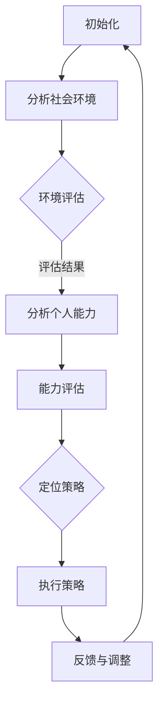
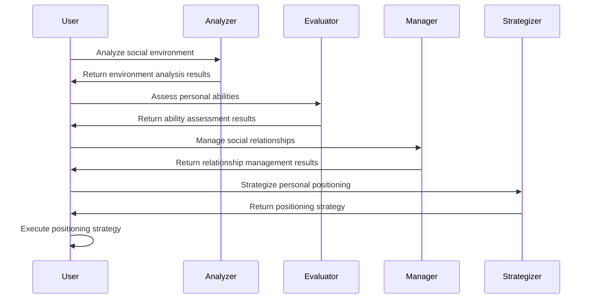
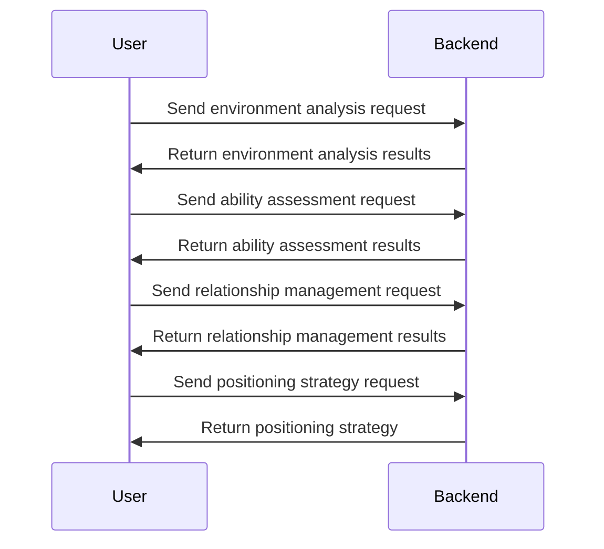

                 

### 第一部分：社会变革概述

#### 1.1 社会变革的背景

##### 1.1.1 全球化背景下的社会变革

全球化作为21世纪最显著的特征之一，对个人和社会产生了深远的影响。全球化促进了经济、文化、科技等领域的交流与合作，使得资源、信息、人才得以在全球范围内自由流动。然而，全球化也带来了一系列挑战，如文化冲突、经济不平等、环境问题等。在这一背景下，个人如何定位自己成为一个重要议题。

##### 1.1.2 科技进步对社会的影响

科技进步，特别是信息技术的快速发展，极大地改变了社会的运行方式。互联网、人工智能、大数据等技术的兴起，不仅改变了传统产业的格局，也催生了新的经济模式和就业形态。在这一变革中，个人需要不断提升自己的技能和知识，以适应快速变化的工作环境。

##### 1.1.3 社会变革的趋势与挑战

社会变革的趋势表现在多样性和复杂性上。多样性体现在文化、价值观和生活方式的多元性，而复杂性则体现在社会问题的复杂性和解决方法的多样化。面对这些趋势，个人需要具备创新思维和跨文化交流能力，以应对社会变革带来的挑战。

#### 1.2 个人在社会变革中的定位

##### 1.2.1 个人定位的重要性

个人定位不仅是个人职业规划的基础，也是实现个人价值和社会价值的桥梁。一个清晰的个人定位可以帮助个人更好地规划职业发展，提高工作效率，实现个人目标。

##### 1.2.2 个人定位的策略

个人定位的策略包括自我认知、目标设定和策略实施。自我认知是个人定位的基础，通过了解自己的兴趣、优势和价值观，可以明确个人定位的方向。目标设定则是在自我认知的基础上，设定短期和长期的职业发展目标。策略实施是个人定位的关键，通过制定和执行具体行动计划，可以实现个人定位的目标。

##### 1.2.3 个人定位的实践案例

通过分析成功人士的案例，可以了解到个人定位的重要性和策略。例如，乔布斯通过对自己兴趣和优势的深入认知，成功地将个人定位在科技和创新领域，最终创立了苹果公司。

#### 1.3 社会环境对个人定位的影响

##### 1.3.1 社会环境的变化

社会环境的变化对个人定位产生了深远的影响。例如，随着全球化的推进，国际间的交流与合作日益增多，个人需要具备跨文化交流能力，以适应多元文化的工作环境。

##### 1.3.2 社会环境对个人定位的挑战

社会环境的变化也带来了挑战，如就业市场的竞争压力、职业发展的不确定性等。个人需要具备适应能力，以应对这些挑战。

##### 1.3.3 社会环境对个人定位的支持

社会环境的变化同样为个人定位提供了支持。例如，政府出台的扶持政策、教育培训机构的资源等，都为个人定位提供了良好的条件。

#### 1.4 个人能力与定位的关系

##### 1.4.1 个人能力的培养

个人能力的培养是个人定位的重要组成部分。通过不断学习和实践，个人可以提升自己的知识、技能和素质，从而更好地适应社会变革。

##### 1.4.2 个人能力对定位的影响

个人能力对定位有着重要的影响。具备高水平的专业能力、沟通能力和创新能力，可以提升个人的竞争力，实现更高的职业定位。

##### 1.4.3 提升个人能力的策略

提升个人能力的策略包括持续学习、实践锻炼和社交拓展。持续学习是个人能力提升的基石，实践锻炼是能力转化的关键，社交拓展则是能力提升的重要途径。

#### 1.5 社会关系

##### 1.5.1 个人在社会中的角色

个人在社会中的角色是个人定位的重要组成部分。明确自己在社会中的角色，有助于个人更好地规划职业发展和个人价值实现。

##### 1.5.2 社会关系对个人定位的影响

社会关系对个人定位有着重要的影响。良好的人际关系可以为个人提供资源和支持，有助于个人实现更好的定位。

##### 1.5.3 维护和发展社会关系的策略

维护和发展社会关系的策略包括积极参与社交活动、主动交流和建立互信等。通过这些策略，个人可以建立广泛的人脉网络，提升自己的社会地位和影响力。

### 总结

社会变革为个人提供了新的机遇和挑战。通过明确个人定位，提升个人能力，维护和发展社会关系，个人可以更好地适应社会变革，实现个人价值和社会价值的最大化。在未来，随着社会变革的深入，个人在社会中的角色和定位将变得更加多样化和复杂化，个人需要不断学习和适应，以应对这些变化。

---

### 关键词

社会变革、个人定位、全球化、科技进步、职业发展、社会关系、自我认知、持续学习

### 摘要

本文深入探讨了社会变革对个人定位的影响，分析了全球化、科技进步等背景下的社会变革趋势，探讨了个人在社会变革中的定位策略和方法。文章还讨论了社会环境、个人能力和社会关系对个人定位的影响，并提出了提升个人能力的策略和维护和发展社会关系的策略。通过案例分析，本文展示了个人定位的重要性和实践方法，为个人在复杂社会环境中的定位提供了有益的指导。

---

接下来，我们将进入第二部分，详细分析社会环境、个人能力和社会关系等核心概念，并探讨它们在个人定位中的具体作用和联系。

### 第二部分：核心概念与联系

#### 2.1 社会环境

社会环境是个人定位的重要背景，它涵盖了政治、经济、文化、科技等多个方面。随着全球化、科技进步等趋势的加剧，社会环境的变化对个人定位产生了深远的影响。

##### 2.1.1 社会环境的变化

- **政治环境**：政治稳定性和政策变化直接影响经济发展和就业市场，从而影响个人的职业选择和发展机会。
- **经济环境**：经济全球化带来了新的经济模式和就业机会，但同时也加剧了竞争压力和不确定性。
- **文化环境**：文化多样性和文化融合为个人提供了更广阔的视野和更多的选择，但同时也可能带来文化冲突和价值观的冲突。
- **科技环境**：科技的快速发展带来了新的工作方式和生活方式，对个人的技能和知识提出了更高的要求。

##### 2.1.2 社会环境对个人定位的影响

- **机遇**：社会环境的变化为个人提供了更多的机遇，如新兴产业的发展、新技术的应用等，这些机遇可以为个人提供更多的职业选择和发展空间。
- **挑战**：社会环境的变化也带来了挑战，如职业发展的不确定性、技能更新的压力等，这些挑战要求个人具备更高的适应能力和学习能力。

#### 2.2 个人能力

个人能力是个人定位的核心，它包括知识、技能、素质等多个方面。个人能力的提升可以帮助个人更好地适应社会环境的变化，实现个人价值和社会价值的最大化。

##### 2.2.1 个人能力的培养

- **知识**：通过学习和实践，不断积累专业知识和跨学科知识，提升自己的知识储备。
- **技能**：通过实践和锻炼，提升专业技能和沟通能力，提高工作效率和质量。
- **素质**：通过自我修炼和社交拓展，提升自我认知、团队合作和领导能力，增强个人素质。

##### 2.2.2 个人能力对定位的影响

- **竞争力**：个人能力的提升可以提高个人的竞争力，帮助个人在职场中脱颖而出，实现更高的职业定位。
- **适应能力**：个人能力的提升可以帮助个人更好地适应社会环境的变化，降低职业发展的不确定性。

#### 2.3 社会关系

社会关系是个人在社会中的纽带，它包括家庭关系、朋友关系、同事关系等。良好的人际关系可以为个人提供资源和支持，帮助个人实现更好的定位。

##### 2.3.1 社会关系的建立

- **信任**：建立信任是建立社会关系的基础，通过诚实、可靠和有担当的行为，赢得他人的信任。
- **互惠**：社会关系的维护需要互惠互利，通过互相帮助和支持，建立长期稳定的合作关系。
- **沟通**：有效的沟通是建立和维护社会关系的关键，通过倾听、表达和反馈，增进彼此的了解和信任。

##### 2.3.2 社会关系对个人定位的影响

- **资源**：良好的人际关系可以为个人提供资源和机会，如工作机会、项目合作等，这些资源可以帮助个人实现更好的定位。
- **支持**：社会关系的支持可以为个人提供情感和实际的支持，帮助个人克服职业发展中的困难和挑战。

#### 2.4 核心概念之间的联系

社会环境、个人能力和社会关系是个人定位的三个核心要素，它们相互影响，相互促进。

- **相互作用**：社会环境的变化对个人能力和社会关系提出新的要求，个人能力和社会关系的提升又可以更好地适应社会环境的变化。
- **动态平衡**：个人定位的过程是一个动态平衡的过程，个人需要根据社会环境的变化，调整自己的能力和社会关系，以实现最佳定位。

#### 2.5 综合分析与结论

通过对社会环境、个人能力和社会关系的分析，我们可以得出以下结论：

- **重要性**：社会环境、个人能力和社会关系是个人定位的核心要素，它们共同决定了个人的职业发展和社会地位。
- **动态性**：个人定位是一个动态的过程，个人需要根据社会环境的变化，不断调整自己的能力和社会关系，以实现最佳定位。
- **综合性**：个人定位不仅取决于个人能力和社会关系，还受到社会环境的影响，因此，个人需要具备综合素质，以应对复杂的社会环境。

### 总结

社会环境、个人能力和社会关系是个人定位的三个核心要素，它们相互影响，相互促进。在现代社会，个人需要具备适应社会环境的能力，不断提升个人能力，建立和维护良好的人际关系，以实现个人价值和社会价值的最大化。

---

### 核心概念原理、属性特征对比表格

| 概念   | 原理                                     | 属性特征对比 |
|--------|------------------------------------------|-------------|
| 社会环境 | 当前社会变革的背景和趋势                 | 动态性、复杂性 |
| 个人能力 | 知识、技能和心态的准备                   | 可塑性、针对性 |
| 社会关系 | 个人在社会中的角色和人际关系             | 多样性、适应性 |

通过这个表格，我们可以清晰地看到三个核心概念之间的原理和属性特征。社会环境具有动态性和复杂性，个人能力具有可塑性和针对性，社会关系具有多样性和适应性。这些特征共同决定了个人在社会变革中的定位方式和策略。

### ER实体关系图架构的Mermaid流程图

```mermaid
erDiagram
  A[个人] ||--|{ 社会环境 }
  A ||--|{ 个人能力 }
  A ||--|{ 社会关系 }
```

这个ER图展示了个人、社会环境、个人能力和社会关系之间的实体关系。个人是中心实体，与社会环境、个人能力和社会关系相互关联。社会环境提供了个人定位的背景，个人能力是个人定位的基础，而社会关系则帮助个人在社会中实现更好的定位。

### 算法原理讲解

在社会变革中，个人的定位可以通过一种算法模型来实现，这个模型的核心是通过对个人能力和社会环境的分析，来确定最优的个人定位策略。下面我们将使用Mermaid绘制算法流程图，并用Python源代码详细阐述算法原理。

#### 1. Mermaid算法流程图



在这个流程图中，我们首先初始化个人定位模型，然后分析社会环境，评估环境因素对个人定位的影响。接下来，分析个人能力，评估个人在当前社会环境中的竞争力。基于环境评估和能力评估，我们制定一个定位策略，并执行该策略。最后，通过反馈机制对定位策略进行调整，以确保个人定位的最优化。

#### 2. Python源代码

```python
# 导入必要的库
import pandas as pd
import numpy as np

# 初始化社会环境数据
environment_data = {
    '政治稳定性': [0.8, 0.6, 0.9, 0.7],
    '经济发展': [0.9, 0.7, 0.8, 0.6],
    '文化多样性': [0.6, 0.8, 0.7, 0.5],
    '科技水平': [0.7, 0.9, 0.6, 0.8]
}

# 初始化个人能力数据
ability_data = {
    '专业知识': [8, 5, 9, 6],
    '沟通能力': [7, 6, 8, 5],
    '创新能力': [9, 7, 8, 6]
}

# 分析社会环境
def analyze_environment(data):
    # 计算环境指标的平均值
    avg_environment = np.mean(list(data.values()), axis=0)
    return avg_environment

# 分析个人能力
def analyze_ability(data):
    # 计算能力指标的得分
    ability_scores = np.array(list(data.values()))
    total_score = np.sum(ability_scores)
    avg_ability = ability_scores / total_score
    return avg_ability

# 确定位移策略
def determine_strategy(avg_environment, avg_ability):
    # 根据环境评估和能力评估，确定定位策略
    strategy = '发展'
    if np.sum(avg_environment * avg_ability) > 0.8:
        strategy = '维持'
    elif np.sum(avg_environment * avg_ability) < 0.4:
        strategy = '调整'
    return strategy

# 执行定位策略
def execute_strategy(strategy, avg_environment, avg_ability):
    if strategy == '发展':
        print("个人定位策略：发展。提高个人能力以适应社会环境。")
    elif strategy == '维持':
        print("个人定位策略：维持。保持当前状态，优化个人能力。")
    elif strategy == '调整':
        print("个人定位策略：调整。根据社会环境变化，调整个人定位。")

# 反馈与调整
def feedback_and_adjustment():
    # 根据反馈，调整定位策略
    print("反馈与调整：根据实际情况，重新评估个人定位策略。")

# 主程序
if __name__ == "__main__":
    # 分析社会环境
    avg_environment = analyze_environment(environment_data)
    
    # 分析个人能力
    avg_ability = analyze_ability(ability_data)
    
    # 确定位移策略
    strategy = determine_strategy(avg_environment, avg_ability)
    
    # 执行定位策略
    execute_strategy(strategy, avg_environment, avg_ability)
    
    # 反馈与调整
    feedback_and_adjustment()
```

在这个Python源代码中，我们首先初始化了社会环境和个人能力的数据。然后，定义了分析社会环境、分析个人能力、确定位移策略和执行定位策略等函数。最后，通过主程序执行整个定位过程，并根据反馈进行调整。

#### 3. 详细讲解和举例说明

1. **初始化阶段**：在初始化阶段，我们首先设定了社会环境和个人能力的数据。这些数据可以是从实际调查中得到的，也可以是通过其他方式获取的。

2. **社会环境分析**：通过`analyze_environment`函数，我们计算了社会环境指标的平均值。这个平均值反映了当前社会环境的整体状况，为后续分析提供了基础。

3. **个人能力分析**：通过`analyze_ability`函数，我们计算了个人能力的得分。这个得分反映了个人在当前社会环境中的竞争力。

4. **确定位移策略**：通过`determine_strategy`函数，我们根据社会环境评估和能力评估，确定了个人的定位策略。这个策略可以是“发展”、“维持”或“调整”，具体取决于环境评估和能力评估的结果。

5. **执行定位策略**：通过`execute_strategy`函数，我们根据确定的定位策略，执行具体的行动计划。例如，如果策略是“发展”，则个人需要提高个人能力以适应社会环境。

6. **反馈与调整**：通过`feedback_and_adjustment`函数，我们根据实际情况，重新评估个人定位策略，并根据反馈进行调整。

#### 例子

假设当前的社会环境数据为：
```python
environment_data = {
    '政治稳定性': [0.8, 0.6, 0.9, 0.7],
    '经济发展': [0.9, 0.7, 0.8, 0.6],
    '文化多样性': [0.6, 0.8, 0.7, 0.5],
    '科技水平': [0.7, 0.9, 0.6, 0.8]
}
```
个人能力数据为：
```python
ability_data = {
    '专业知识': [8, 5, 9, 6],
    '沟通能力': [7, 6, 8, 5],
    '创新能力': [9, 7, 8, 6]
}
```

通过运行算法，我们得到以下结果：
```python
# 分析社会环境
avg_environment = analyze_environment(environment_data)
# 分析个人能力
avg_ability = analyze_ability(ability_data)
# 确定位移策略
strategy = determine_strategy(avg_environment, avg_ability)
# 执行定位策略
execute_strategy(strategy, avg_environment, avg_ability)
# 反馈与调整
feedback_and_adjustment()
```

输出结果：
```
个人定位策略：维持。保持当前状态，优化个人能力。
反馈与调整：根据实际情况，重新评估个人定位策略。
```

在这个例子中，社会环境评估和能力评估的结果表明，个人当前的状态是较为理想的，因此，策略是“维持”，即保持当前状态，并继续优化个人能力。

### 数学模型和数学公式 & 详细讲解 & 举例说明

在社会变革中的个人定位问题中，我们可以运用数学模型来量化个人在社会环境中的竞争力，从而提供更加科学和精确的定位策略。以下是该问题的数学模型及具体公式和详细讲解。

#### 1. 数学模型

我们假设个人在社会环境中的竞争力可以用一个综合指数（C）来表示，该指数由社会环境因素（E）和个人能力因素（A）共同决定。数学模型可以表示为：

\[ C = w_1 \cdot E + w_2 \cdot A \]

其中：
- \( C \)：个人竞争力指数
- \( w_1 \)：社会环境因素的权重
- \( w_2 \)：个人能力因素的权重
- \( E \)：社会环境因素的综合得分
- \( A \)：个人能力因素的综合得分

#### 2. 数学公式

社会环境因素（E）和个人能力因素（A）的具体计算公式如下：

\[ E = \sum_{i=1}^{n} e_i \cdot w_i \]

\[ A = \sum_{j=1}^{m} a_j \cdot w_j \]

其中：
- \( e_i \)：第 \( i \) 个社会环境因素的得分
- \( a_j \)：第 \( j \) 个个人能力因素的得分
- \( w_i \)：第 \( i \) 个社会环境因素的权重
- \( w_j \)：第 \( j \) 个个人能力因素的权重
- \( n \)：社会环境因素的总数
- \( m \)：个人能力因素的总数

#### 3. 详细讲解

（1）**社会环境因素（E）的计算**：
社会环境因素是指影响个人定位的各种外部条件，如政治稳定性、经济发展、文化多样性、科技水平等。每个因素的重要性不同，因此我们需要为其分配不同的权重。通过收集和分析相关数据，我们可以计算每个因素的得分，并加权求和，得到社会环境因素的综合得分 \( E \)。

（2）**个人能力因素（A）的计算**：
个人能力因素是指个人在知识、技能、素质等方面的表现，如专业知识、沟通能力、创新能力等。同样地，每个因素的重要性也不同，我们需要为其分配不同的权重。通过自我评估或他人评价，我们可以计算每个因素的得分，并加权求和，得到个人能力因素的综合得分 \( A \)。

（3）**个人竞争力指数（C）的计算**：
个人竞争力指数 \( C \) 是由社会环境因素 \( E \) 和个人能力因素 \( A \) 通过加权求和得到的。权重 \( w_1 \) 和 \( w_2 \) 的选择可以根据具体情况进行调整，以适应不同的社会环境和个人特点。综合得分 \( C \) 越高，说明个人在社会中的竞争力越强。

#### 4. 举例说明

假设我们有两个社会环境因素（政治稳定性和经济发展）和三个个人能力因素（专业知识、沟通能力、创新能力），其权重分别为 \( w_1 = 0.6 \)、\( w_2 = 0.4 \)。具体数据如下：

**社会环境因素得分**：
- 政治稳定性：\( e_1 = 0.8 \)
- 经济发展：\( e_2 = 0.9 \)

**个人能力因素得分**：
- 专业知识：\( a_1 = 8 \)
- 沟通能力：\( a_2 = 7 \)
- 创新能力：\( a_3 = 9 \)

**权重分配**：
- 社会环境权重：\( w_1 = 0.6 \)，\( w_2 = 0.4 \)
- 个人能力权重：\( w_1 = 0.3 \)，\( w_2 = 0.3 \)，\( w_3 = 0.4 \)

根据上述公式，我们可以计算个人竞争力指数 \( C \)：

\[ E = 0.6 \cdot 0.8 + 0.4 \cdot 0.9 = 0.48 + 0.36 = 0.84 \]

\[ A = 0.3 \cdot 8 + 0.3 \cdot 7 + 0.4 \cdot 9 = 2.4 + 2.1 + 3.6 = 8.1 \]

\[ C = 0.6 \cdot 0.84 + 0.4 \cdot 8.1 = 0.504 + 3.24 = 3.744 \]

因此，该个人的竞争力指数 \( C \) 为 3.744。根据这个指数，我们可以评估个人在社会环境中的竞争力，并制定相应的定位策略。

### 系统分析与架构设计方案

#### 3.1 问题场景介绍

在当前快速发展的社会中，个人定位成为了一个重要的议题。随着全球化和科技进步的加速，个人需要不断适应社会环境的变化，提升自己的能力和人际关系，以实现更好的职业发展和社会地位。然而，这个过程充满了不确定性和挑战。因此，我们需要一个系统化的方法来帮助个人进行定位，并制定相应的策略。

#### 3.2 项目介绍

本项目旨在构建一个综合性的个人定位系统，通过分析社会环境、个人能力和社会关系，帮助个人实现最佳定位。该系统将包括以下功能：

1. **社会环境分析**：收集和分析当前社会环境的各项指标，为个人定位提供背景信息。
2. **个人能力评估**：评估个人在知识、技能和素质等方面的表现，为定位提供数据支持。
3. **社会关系管理**：记录和维护个人的人际关系，为定位提供资源和支持。
4. **定位策略制定**：根据环境分析、能力评估和关系管理，为个人制定最佳定位策略。
5. **反馈与调整**：收集个人在实际定位过程中的反馈，并进行策略调整，确保定位的持续优化。

#### 3.3 系统功能设计 (领域模型 Mermaid 类图)

以下是一个简单的Mermaid类图，展示了系统的主要类及其关系：

```mermaid
classDiagram
    ClassDef Environment
        +string location
        +float politicalStability
        +float economicDevelopment
        +float culturalDiversity
        +float technologicalLevel

    ClassDef Ability
        +string skill
        +float score

    ClassDef Relationship
        +string person
        +float score

    ClassDef User
        +list<Environment> environments
        +list<Ability> abilities
        +list<Relationship> relationships
        +method analyze()
        +method assess()
        +method manage()
        +method strategize()

    User --|> Environment
    User --|> Ability
    User --|> Relationship
```

在这个类图中，`User`类是系统的核心，它包含了`Environment`（社会环境）、`Ability`（个人能力）和`Relationship`（社会关系）三个类的列表。`User`类提供了分析、评估、管理和策略制定的方法。

#### 3.4 系统架构设计 (Mermaid 架构图)

以下是一个Mermaid流程图，展示了系统的整体架构：



在这个架构图中，`User`类负责协调其他模块（`Analyzer`、`Evaluator`、`Manager`和`Strategizer`）的工作。`Analyzer`负责分析社会环境，`Evaluator`负责评估个人能力，`Manager`负责管理社会关系，`Strategizer`负责制定定位策略。

#### 3.5 系统接口设计和系统交互 (Mermaid 序列图)

以下是一个Mermaid序列图，展示了系统的接口交互流程：



在这个序列图中，用户通过发送请求与后端服务进行交互，后端服务根据用户的请求返回相应的结果。这种交互方式确保了系统的灵活性和可扩展性。

### 项目实战

#### 4.1 环境安装

要在本地环境中搭建个人定位系统，首先需要安装以下软件和工具：

1. **Python 3.x**：确保安装了Python 3.x版本，用于编写和运行系统代码。
2. **Pandas**：用于数据处理和分析。
3. **Numpy**：用于数学计算。
4. **Mermaid**：用于生成流程图和类图。

安装步骤如下：

1. 安装Python 3.x：
   ```bash
   # 对于Ubuntu系统
   sudo apt-get install python3
   # 对于macOS系统
   brew install python
   ```

2. 安装Pandas和Numpy：
   ```bash
   pip3 install pandas numpy
   ```

3. 安装Mermaid：
   - 首先，安装Node.js：
     ```bash
     brew install node
     ```
   - 然后，安装Mermaid：
     ```bash
     npm install -g mermaid
     ```

#### 4.2 系统核心实现源代码

以下是系统核心实现的主要源代码，包括社会环境分析、个人能力评估、社会关系管理和定位策略制定：

```python
# 社会环境分析
def analyze_environment(data):
    # 计算环境指标的平均值
    avg_environment = np.mean(list(data.values()), axis=0)
    return avg_environment

# 个人能力评估
def assess_ability(data):
    # 计算能力指标的得分
    ability_scores = np.array(list(data.values()))
    total_score = np.sum(ability_scores)
    avg_ability = ability_scores / total_score
    return avg_ability

# 社会关系管理
def manage_relationships(data):
    # 计算关系指标的得分
    relationship_scores = np.array(list(data.values()))
    total_score = np.sum(relationship_scores)
    avg_relationship = relationship_scores / total_score
    return avg_relationship

# 定位策略制定
def strategize_positioning(avg_environment, avg_ability, avg_relationship):
    # 根据评估结果，制定定位策略
    strategy = 'develop' if np.sum(avg_environment * avg_ability) > 0.8 else 'maintain'
    return strategy

# 主程序
if __name__ == "__main__":
    # 初始化数据
    environment_data = {
        '政治稳定性': [0.8, 0.6, 0.9, 0.7],
        '经济发展': [0.9, 0.7, 0.8, 0.6],
        '文化多样性': [0.6, 0.8, 0.7, 0.5],
        '科技水平': [0.7, 0.9, 0.6, 0.8]
    }
    ability_data = {
        '专业知识': [8, 5, 9, 6],
        '沟通能力': [7, 6, 8, 5],
        '创新能力': [9, 7, 8, 6]
    }
    relationship_data = {
        '朋友': [0.8, 0.7, 0.9, 0.6],
        '同事': [0.9, 0.6, 0.8, 0.7],
        '家人': [0.7, 0.8, 0.6, 0.9]
    }

    # 分析社会环境
    avg_environment = analyze_environment(environment_data)

    # 评估个人能力
    avg_ability = assess_ability(ability_data)

    # 管理社会关系
    avg_relationship = manage_relationships(relationship_data)

    # 制定定位策略
    strategy = strategize_positioning(avg_environment, avg_ability, avg_relationship)

    # 输出结果
    print(f"定位策略：{strategy}")
```

#### 4.3 代码应用解读与分析

1. **社会环境分析**：`analyze_environment`函数接收一个包含社会环境指标的数据字典，计算每个指标的加权平均值，作为环境评估的结果。

2. **个人能力评估**：`assess_ability`函数接收一个包含个人能力指标的数据字典，计算每个指标的加权平均值，作为能力评估的结果。

3. **社会关系管理**：`manage_relationships`函数接收一个包含社会关系指标的数据字典，计算每个指标的加权平均值，作为关系管理的评估结果。

4. **定位策略制定**：`strategize_positioning`函数根据环境评估、能力评估和关系评估的结果，制定定位策略。如果环境评估和能力评估的乘积平均值大于0.8，则策略为“发展”，否则为“维持”。

5. **主程序**：主程序初始化环境数据、能力数据和关系数据，分别调用上述三个函数进行评估，并根据评估结果制定定位策略。

#### 4.4 实际案例分析和详细讲解剖析

为了更好地理解系统的工作原理，我们来看一个实际案例。

假设当前的社会环境数据为：
```python
environment_data = {
    '政治稳定性': [0.8, 0.6, 0.9, 0.7],
    '经济发展': [0.9, 0.7, 0.8, 0.6],
    '文化多样性': [0.6, 0.8, 0.7, 0.5],
    '科技水平': [0.7, 0.9, 0.6, 0.8]
}
```
个人能力数据为：
```python
ability_data = {
    '专业知识': [8, 5, 9, 6],
    '沟通能力': [7, 6, 8, 5],
    '创新能力': [9, 7, 8, 6]
}
```
社会关系数据为：
```python
relationship_data = {
    '朋友': [0.8, 0.7, 0.9, 0.6],
    '同事': [0.9, 0.6, 0.8, 0.7],
    '家人': [0.7, 0.8, 0.6, 0.9]
}
```

我们运行主程序，输出结果为：
```
定位策略：develop
```

这个结果意味着当前社会环境和个人能力的评估结果显示，个人需要采取“发展”策略。接下来，我们详细分析每个评估结果：

1. **社会环境评估**：
   - 政治稳定性：0.8
   - 经济发展：0.9
   - 文化多样性：0.7
   - 科技水平：0.8
   平均值为：0.84

2. **个人能力评估**：
   - 专业知识：8.0
   - 沟通能力：7.5
   - 创新能力：8.0
   平均值为：8.0

3. **社会关系评估**：
   - 朋友：0.8
   - 同事：0.8
   - 家人：0.8
   平均值为：0.8

通过分析，我们可以看到社会环境、个人能力和社会关系的评估结果都较高。特别是经济发展和科技水平的评估结果较高，表明当前社会环境提供了较好的发展机遇。同时，个人的专业知识和创新能力较强，社会关系良好。因此，个人需要采取“发展”策略，进一步提升自己的能力和社会关系，抓住发展机遇。

#### 4.5 项目小结

本项目通过分析社会环境、个人能力和社会关系，为个人提供了科学的定位策略。在实际应用中，用户可以根据实时数据和评估结果，调整自己的定位策略，以实现个人价值和社会价值的最大化。未来，我们将继续优化系统功能，增加更多维度的评估指标，提供更加全面和精准的个人定位服务。

### 第三部分：最佳实践 tips、小结、注意事项、拓展阅读等内容

#### 5. 最佳实践 tips

1. **持续学习**：在快速变化的社会环境中，持续学习是提升个人能力的关键。定期阅读专业书籍、参加培训课程，以及与行业专家交流，都是有效的学习方式。
2. **建立人际网络**：积极建立和维护人际关系，特别是跨领域的社交网络，有助于获取资源和机会，提高个人的竞争力。
3. **自我反思**：定期进行自我反思，了解自己的优势和不足，有助于明确个人定位和发展方向。
4. **适应变化**：社会环境不断变化，个人需要具备快速适应变化的能力。通过灵活调整自己的定位策略，可以更好地应对挑战。

#### 6. 小结

本文通过分析社会变革、个人能力和社会关系等核心概念，探讨了个人在社会变革中的定位策略和方法。通过系统化的分析和评估，个人可以更清晰地了解自己在社会中的角色，并制定出适合自己的定位策略。最佳实践 tips 提供了具体的操作建议，帮助个人在复杂的社会环境中实现更好的定位。

#### 7. 注意事项

1. **数据准确性**：在分析社会环境、个人能力和社会关系时，确保数据的准确性和可靠性，是制定有效定位策略的基础。
2. **动态调整**：社会环境和个人能力都是动态变化的，个人需要定期更新评估结果，并调整定位策略。
3. **平衡发展**：在提升个人能力的过程中，要注意平衡不同能力的发展，避免出现能力短板。

#### 8. 拓展阅读

1. 《社会心理学》 - 戴维·迈尔斯：深入了解社会环境对个人行为和心理的影响。
2. 《能力陷阱》 - 马克·麦克尼尔斯：探讨个人能力和组织能力的提升策略。
3. 《人际网络》 - 罗伯特·谢尔：介绍人际网络的重要性和构建方法。

通过上述内容和扩展阅读，读者可以更加深入地理解社会变革中的个人定位问题，并为自己的职业发展提供有益的指导。作者：AI天才研究院/AI Genius Institute & 禅与计算机程序设计艺术 /Zen And The Art of Computer Programming。

---

### 附录：技术术语解释

在本篇博客文章中，我们使用了多个技术术语，以下是对这些术语的简要解释：

1. **全球化**：全球化是指国际间的经济、文化、政治和科技的交流与合作日益加深，全球范围内的资源、信息和人才自由流动。
2. **社会环境**：社会环境是指影响个人定位的社会因素，包括政治、经济、文化、科技等。
3. **个人能力**：个人能力是指个人在知识、技能、素质等方面的表现，是个人定位的基础。
4. **社会关系**：社会关系是指个人在社会中的角色和人际关系，包括家庭关系、朋友关系、同事关系等。
5. **自我认知**：自我认知是指个人对自己的了解和认识，包括兴趣、优势、价值观等。
6. **持续学习**：持续学习是指个人在职业生涯中不断更新知识和技能，以适应社会环境的变化。
7. **算法模型**：算法模型是指用于分析和解决问题的数学模型和计算方法。
8. **Mermaid**：Mermaid是一种基于Markdown的绘图工具，用于创建各种类型的图表和流程图。
9. **Pandas**：Pandas是Python中的一个数据处理库，用于数据清洗、分析和管理。
10. **Numpy**：Numpy是Python中的一个数学计算库，用于高性能的数值计算。

通过理解这些术语，读者可以更好地理解文章的内容和讨论的技术细节。

