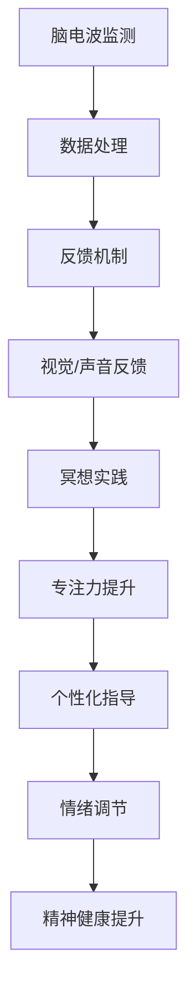

                 

# 《神经反馈冥想：脑科学辅助的精神修行》

> 关键词：神经反馈、冥想、脑科学、精神健康、心理调节

> 摘要：本文将探讨神经反馈冥想这一结合了脑科学和传统冥想的新兴精神修行方法。通过介绍神经反馈的基本原理、冥想的科学基础，以及神经反馈冥想的实践和应用，本文旨在帮助读者理解神经反馈冥想在精神健康和心理健康调节中的重要作用，并提供实用的实践指南。

## 第1章 引言

### 1.1 书籍背景

#### 1.1.1 脑科学与精神健康的关系

随着现代社会的快速发展，精神健康问题逐渐受到广泛关注。精神疾病不仅对个体的生活质量造成严重影响，还对社会经济产生巨大负担。脑科学与精神健康的关系日益紧密，成为研究热点。

脑科学是研究大脑的结构、功能和机制的科学。近年来，随着神经影像学、神经生物学和神经心理学等技术的发展，脑科学取得了显著进展。这些研究成果不仅加深了我们对大脑的理解，还为精神健康问题的诊断和治疗提供了新的思路和方法。

#### 1.1.2 神经反馈在精神健康中的应用

神经反馈是一种通过监测和调节生理信号来改善大脑功能和情绪状态的方法。近年来，神经反馈在精神健康领域中的应用越来越广泛，如焦虑、抑郁、失眠等问题的治疗。

神经反馈冥想是将神经反馈技术与传统冥想实践相结合的一种方法。通过实时监测大脑活动，神经反馈冥想可以帮助个体更好地控制情绪、提高专注力和冥想效果。

### 1.2 冥想与神经反馈的结合

#### 1.2.1 冥想的定义与历史

冥想是一种古老的精神修行方法，旨在通过集中注意力、放松身心来提高精神健康。冥想的历史可以追溯到几千年前，各种文化和宗教都有冥想的实践。

现代冥想研究主要关注冥想对大脑和情绪的影响。研究表明，冥想可以促进大脑神经可塑性，改善情绪调节，提高认知功能。

#### 1.2.2 神经反馈的原理

神经反馈是一种通过监测和调节生理信号来改善大脑功能和情绪状态的方法。神经反馈的基本原理是，当个体意识到自己的生理信号时，会不自觉地调整这些信号，以达到更好的心理状态。

神经反馈设备可以实时监测大脑活动，如脑电波、心率和肌电等。通过反馈这些信号，个体可以更好地了解自己的心理状态，并学会调整自己的情绪和行为。

#### 1.2.3 神经反馈冥想的独特优势

神经反馈冥想结合了神经反馈和冥想的优点，具有以下独特优势：

1. **实时监测**：神经反馈冥想可以实时监测大脑活动，帮助个体更好地了解自己的心理状态。
2. **个性化**：神经反馈冥想可以根据个体的大脑活动特点提供个性化的指导，提高冥想效果。
3. **可操作性**：神经反馈冥想通过具体的数据和指导，使冥想过程更加可操作和有成就感。
4. **心理调节**：神经反馈冥想可以帮助个体更好地调节情绪，提高心理健康水平。

## 第2章 神经反馈的基本原理

### 2.1 神经反馈的起源与发展

#### 2.1.1 神经反馈的概念

神经反馈是一种通过监测和调节生理信号来改善大脑功能和情绪状态的方法。它起源于20世纪50年代，当时一些科学家开始探索如何利用生理信号来治疗某些疾病。

#### 2.1.2 神经反馈的主要类型

神经反馈可以分为多种类型，包括脑电反馈、肌电反馈、心率反馈等。每种类型的神经反馈都有其特定的应用场景和原理。

#### 2.1.3 神经反馈在临床应用中的优势

神经反馈在临床应用中具有显著优势，如：

1. **无创性**：神经反馈不涉及侵入性操作，对患者较为安全。
2. **个性化**：神经反馈可以根据个体的大脑活动特点提供个性化的指导，提高治疗效果。
3. **实时性**：神经反馈可以实时监测大脑活动，帮助个体及时调整心理状态。
4. **可操作性**：神经反馈通过具体的数据和指导，使治疗过程更加可操作和有成就感。

### 2.2 神经反馈的工作机制

#### 2.2.1 神经系统的基础知识

神经系统是人体最重要的调节系统，包括中枢神经系统和周围神经系统。中枢神经系统由大脑和脊髓组成，周围神经系统由神经纤维和神经节组成。

#### 2.2.2 神经反馈的过程

神经反馈的过程可以分为以下几个步骤：

1. **信号采集**：使用传感器采集生理信号，如脑电波、心率和肌电等。
2. **信号处理**：对采集到的信号进行放大、滤波和数字化处理。
3. **信号分析**：分析处理后的信号，提取有用的信息。
4. **信号反馈**：将分析结果以可视化的形式反馈给个体，使其能够了解自己的生理状态。
5. **调节行为**：个体根据反馈信号调整自己的行为和情绪，以达到更好的心理状态。

#### 2.2.3 神经反馈的生理学基础

神经反馈的生理学基础在于大脑的可塑性。大脑可塑性是指大脑在外界刺激和内在调节下不断变化和适应的能力。神经反馈通过实时监测和调节大脑活动，可以促进大脑的可塑性，提高大脑功能和情绪调节能力。

## 第3章 冥想的科学基础

### 3.1 冥想的历史与类型

#### 3.1.1 冥想的历史演变

冥想的历史可以追溯到几千年前，各种文化和宗教都有冥想的实践。在印度，冥想是瑜伽的重要组成部分；在中国，冥想被视为道家和佛家修行的重要手段。

#### 3.1.2 冥想的类型与目的

冥想可以分为多种类型，包括专注冥想、开放监测冥想、动态冥想等。每种类型的冥想都有其特定的目的和效果。

1. **专注冥想**：通过集中注意力在一个特定的对象上，如呼吸、声音或图像，以减少杂念和焦虑。
2. **开放监测冥想**：不专注于任何特定的对象，而是保持对内心体验的开放和警觉。
3. **动态冥想**：在运动中进行冥想，如走路、跑步或瑜伽。

### 3.2 冥想对大脑的影响

#### 3.2.1 冥想与大脑神经可塑性

神经可塑性是指大脑在外界刺激和内在调节下不断变化和适应的能力。冥想可以促进大脑的可塑性，增加神经元之间的连接和神经元群体的同步性。

#### 3.2.2 冥想与情绪调节

冥想可以帮助个体更好地调节情绪，减少焦虑和抑郁。研究表明，冥想可以降低大脑中与情绪调节相关的区域的激活，提高情绪调节能力。

#### 3.2.3 冥想与认知功能

冥想可以提高个体的认知功能，包括注意力、记忆和执行功能。研究表明，长期冥想者的大脑灰质密度更高，大脑网络连接更加紧密。

## 第4章 神经反馈冥想实践

### 4.1 神经反馈冥想的准备工作

#### 4.1.1 设备与环境的准备

进行神经反馈冥想需要准备一些设备，如脑电传感器、心电传感器和肌电传感器等。此外，选择一个安静、舒适的环境也非常重要。

#### 4.1.2 心理准备的重要性

在进行神经反馈冥想之前，心理准备同样重要。个体需要放松身心，保持开放和接纳的态度，以便更好地体验冥想过程。

### 4.2 神经反馈冥想的基本步骤

#### 4.2.1 冥想前的准备

在进行神经反馈冥想之前，个体需要选择一个舒适的姿势，如坐姿或卧姿。然后，闭上眼睛，专注于呼吸，使身心放松。

#### 4.2.2 冥想的进行

在冥想过程中，个体需要持续关注自己的呼吸，同时观察脑电信号的变化。当脑电信号达到预设的目标时，个体会得到一种正面的反馈，这有助于提高冥想的效果。

#### 4.2.3 冥想后的放松

冥想结束后，个体需要慢慢打开眼睛，保持坐姿或卧姿，继续观察自己的身体感受。然后，轻轻活动四肢和颈部，慢慢起身，回到日常活动中。

## 第5章 神经反馈冥想在心理健康中的应用

### 5.1 焦虑与压力管理

#### 5.1.1 焦虑与压力的概念

焦虑和压力是常见的心理健康问题，对个体的生活质量产生严重影响。焦虑是指对未来可能发生的负面事件的担忧，而压力是指身体和心理对压力源的生理反应。

#### 5.1.2 神经反馈冥想对焦虑与压力的缓解作用

神经反馈冥想可以通过调节大脑活动和情绪状态来缓解焦虑和压力。研究表明，神经反馈冥想可以降低大脑中与焦虑和压力相关的区域的激活，提高情绪调节能力。

#### 5.1.3 实际案例分享

例如，一位患有焦虑症的个体通过进行神经反馈冥想，不仅减轻了焦虑症状，还提高了生活质量和工作效率。

### 5.2 情绪调节与心理健康

#### 5.2.1 情绪调节的重要性

情绪调节是指个体在面对情绪刺激时，通过认知和行为调整情绪的过程。情绪调节能力对心理健康和社交关系具有重要影响。

#### 5.2.2 神经反馈冥想在情绪调节中的应用

神经反馈冥想可以帮助个体更好地调节情绪，减少负面情绪的影响。研究表明，神经反馈冥想可以增强个体对情绪的觉察和控制能力，提高情绪调节能力。

#### 5.2.3 案例研究

例如，一项研究表明，长期进行神经反馈冥想的人比没有进行神经反馈冥想的人具有更好的情绪调节能力。

## 第6章 神经反馈冥想在其他领域的应用

### 6.1 教育领域

#### 6.1.1 冥想与学习效率

神经反馈冥想可以改善个体的注意力、记忆和执行功能，从而提高学习效率。研究表明，神经反馈冥想可以减少学习过程中的干扰和焦虑，提高学习效果。

#### 6.1.2 神经反馈冥想在教育中的应用

一些学校已经开始将神经反馈冥想引入课堂，帮助学生在学习过程中更好地集中注意力、提高学习效率。

### 6.2 企业与管理

#### 6.2.1 员工心理健康与工作效率

员工心理健康对工作效率和生产力具有重要影响。神经反馈冥想可以帮助员工更好地调节情绪、减少压力，从而提高工作效率。

#### 6.2.2 神经反馈冥想在企业管理中的应用

一些企业已经开始将神经反馈冥想作为员工心理健康管理的工具，以提高员工的工作效率和幸福感。

### 6.3 其他领域

#### 6.3.1 体育运动

神经反馈冥想可以帮助运动员更好地调节情绪、提高专注力，从而提高运动表现。

#### 6.3.2 艺术创作

神经反馈冥想可以帮助艺术家更好地发掘内心世界、提高创造力。

## 第7章 案例分析与最佳实践

### 7.1 神经反馈冥想的实际案例

#### 7.1.1 案例一：焦虑缓解

一位患有焦虑症的个体通过进行神经反馈冥想，显著减轻了焦虑症状，提高了生活质量。

#### 7.1.2 案例二：注意力提升

一位需要集中注意力工作的个体通过进行神经反馈冥想，提高了专注力和工作效率。

### 7.2 最佳实践与注意事项

#### 7.2.1 实践技巧

1. **选择合适的冥想环境**：安静、舒适的环境有助于更好地进行冥想。
2. **坚持练习**：神经反馈冥想需要长期坚持，才能取得显著效果。
3. **个性化调整**：根据个体的大脑活动特点进行个性化调整，以提高冥想效果。

#### 7.2.2 避免误区

1. **过度依赖设备**：神经反馈冥想不能完全替代传统冥想，设备只是辅助工具。
2. **追求快速效果**：神经反馈冥想需要长期练习，不能期望一蹴而就。

#### 7.2.3 长期坚持的重要性

神经反馈冥想的效果需要长期坚持才能显现。只有通过长期的练习，个体才能逐渐改善大脑功能和情绪状态。

## 第8章 总结与展望

### 8.1 神经反馈冥想的未来趋势

神经反馈冥想作为一种新兴的精神修行方法，具有广阔的应用前景。未来，随着技术的不断发展和人们对精神健康的关注，神经反馈冥想将在更多领域得到应用。

### 8.2 本书要点回顾

1. **神经反馈的基本原理**：神经反馈是一种通过监测和调节生理信号来改善大脑功能和情绪状态的方法。
2. **冥想的科学基础**：冥想可以促进大脑神经可塑性，改善情绪调节，提高认知功能。
3. **神经反馈冥想的实践**：神经反馈冥想需要准备合适的设备和环境，坚持长期练习。
4. **神经反馈冥想的应用**：神经反馈冥想可以用于焦虑缓解、情绪调节、学习效率提升等领域。

### 8.3 拓展阅读

1. **推荐书籍**：《冥想：一种精神修行的科学方法》、《脑科学：探索大脑的奥秘》
2. **在线资源**：神经反馈冥想相关的研究论文、在线课程和实践指导

---

**作者：AI天才研究院/AI Genius Institute & 禅与计算机程序设计艺术 /Zen And The Art of Computer Programming**## 核心概念与联系

### 神经反馈与冥想

#### 概念联系

神经反馈（Neurofeedback）是一种通过监测个体的生理信号（如脑电波、心率、肌电等）来促进自我调节的技术。它基于脑科学与神经可塑性的原理，通过实时反馈调节来改善大脑功能。而冥想（Meditation）是一种古老的精神实践，通过集中注意力、放松身心、正念练习等方式来提高精神健康和情绪调节。

神经反馈冥想（Neurofeedback Meditation）是将神经反馈技术与冥想实践相结合的一种方法。通过神经反馈设备实时监测个体的脑电活动，个体可以在冥想过程中获得即时的反馈，从而更好地调控自己的心理状态，提高冥想的深度和效果。

#### 对比表格

| 特征 | 神经反馈 | 冥想 | 神经反馈冥想 |
| --- | --- | --- | --- |
| **目的** | 改善大脑功能、情绪调节 | 提高精神健康、情绪调节 | 结合神经反馈和冥想的优势，提高冥想效果和大脑功能 |
| **原理** | 监测生理信号，提供反馈调节 | 集中注意力，放松身心 | 利用神经反馈技术实时监测脑电活动，个体根据反馈调节冥想过程 |
| **监测信号** | 脑电波、心率、肌电等 | 呼吸、身体姿势、心理状态 | 同冥想，加上脑电波等生理信号 |
| **过程** | 信号采集、处理、反馈 | 选择冥想方式，持续练习 | 同冥想过程，加上神经反馈的实时数据反馈 |
| **优势** | 实时监测，个性化调节 | 传统历史悠久，易于实践 | 结合两者优势，提高冥想效果，可量化进步 |
| **适用对象** | 有特定心理和神经问题的人群 | 广泛人群，特别是追求精神健康的人 | 喜欢冥想且希望提高自我调节能力的人 |

通过上述对比表格，我们可以清晰地看到神经反馈与冥想的不同之处和结合后的优势。神经反馈冥想不仅继承了冥想的放松身心、提高精神健康的效果，还通过神经反馈技术提供了更精确、个性化的指导，使个体能够更好地了解自己的大脑活动，并在冥想过程中做出适当的调整。

### 神经反馈冥想

神经反馈冥想是一种将神经反馈技术应用于冥想实践的新型方法。其核心在于通过实时监测大脑的生理活动（如脑电波），并将其转化为可感知的视觉或声音信号，帮助个体在冥想过程中保持注意力、调节情绪。以下是神经反馈冥想的核心概念和联系：

#### 概念联系

1. **脑电波（EEG）**：脑电波是大脑活动的基本生理信号，反映了大脑神经元的同步放电活动。通过监测脑电波，神经反馈设备可以实时了解大脑的状态。
2. **视觉/声音反馈**：视觉和声音反馈是将脑电波信号转换成可感知的形式，如颜色变化、音量调节等。这些反馈帮助个体了解自己的大脑活动，并做出相应的调整。
3. **冥想实践**：冥想是一种精神修行方法，旨在通过集中注意力和放松身心来提高精神健康。神经反馈冥想结合了冥想的核心元素，但通过反馈机制增加了冥想的效率和可操作性。

#### 对比表格

| 特征 | 传统冥想 | 神经反馈冥想 |
| --- | --- | --- |
| **目的** | 提高精神健康、减轻压力 | 同上，但通过实时反馈提高冥想效率和效果 |
| **反馈机制** | 无 | 通过视觉/声音反馈实时监测和调整大脑活动 |
| **专注力** | 需要长时间的练习 | 实时反馈帮助个体更好地保持专注力 |
| **个性化** | 个体差异大，难以量化 | 根据个体的大脑活动特点提供个性化反馈 |
| **技术难度** | 简单易行 | 需要使用专门的设备和技术支持 |

通过对比表格，我们可以看到神经反馈冥想在传统冥想的基础上增加了反馈机制，使得冥想过程更加可操作和有成效。这种结合了神经科学和冥想技术的实践，不仅提高了冥想的效率和效果，还为精神健康提供了新的治疗和调节手段。

### 核心概念图

为了更直观地展示神经反馈冥想的核心概念和联系，我们可以使用Mermaid流程图来构建一个概念图。以下是该概念图的Markdown格式：

这个概念图展示了神经反馈冥想的核心过程，从脑电波监测到数据处理，再到视觉/声音反馈和冥想实践，最终实现专注力提升、个性化指导、情绪调节和整体精神健康的提升。

通过上述的核心概念与联系分析，我们可以看到神经反馈冥想是如何将神经反馈和冥想技术有机结合，从而创造出一种更加高效、个性化、科学的精神修行方法。

### 神经反馈的基本原理

#### 概念

神经反馈是一种通过监测和调节生理信号来改善大脑功能和情绪状态的方法。它基于神经可塑性的原理，通过实时反馈和自我调节机制来促进大脑的健康和功能。

#### 起源与发展

神经反馈的概念起源于20世纪50年代，当时一些科学家开始探索如何利用大脑的生理信号来治疗神经和精神疾病。早期的研究主要集中在脑电波（EEG）的监测上。随着技术的进步，神经反馈逐渐扩展到其他生理信号，如心率、肌电和皮肤电响应。

在临床应用方面，神经反馈最初主要用于治疗癫痫、头痛和睡眠障碍。随着研究的深入，神经反馈的应用范围逐渐扩展到焦虑、抑郁、注意力缺陷多动障碍（ADHD）等心理疾病。此外，神经反馈也被应用于运动表现、学习效率和职业压力管理等领域。

#### 类型

神经反馈可以分为多种类型，主要包括以下几种：

1. **脑电反馈（EEG Neurofeedback）**：通过监测脑电波的变化来调节大脑活动。脑电反馈是最常见的神经反馈类型，广泛应用于心理治疗和认知功能改善。
2. **肌电反馈（EMG Neurofeedback）**：通过监测肌肉活动来调节身体状态。肌电反馈常用于治疗肌肉紧张、慢性疼痛和运动功能障碍。
3. **心率反馈（HRV Neurofeedback）**：通过监测心率变异性来调节情绪和压力水平。心率反馈有助于改善心血管健康和心理健康。
4. **皮肤电反馈（Skin Conductance Feedback）**：通过监测皮肤电导率的变化来调节情绪和行为。皮肤电反馈常用于治疗焦虑和压力相关的情绪障碍。

#### 临床应用中的优势

神经反馈在临床应用中具有以下优势：

1. **无创性**：神经反馈不涉及侵入性操作，对患者较为安全，适合长期使用。
2. **个性化**：神经反馈可以根据个体的大脑活动特点提供个性化的指导，提高治疗效果。
3. **实时性**：神经反馈可以实时监测大脑活动，帮助个体及时调整心理状态。
4. **可操作性**：神经反馈通过具体的数据和指导，使治疗过程更加可操作和有成就感。
5. **综合效果**：神经反馈不仅可以治疗特定的心理和神经问题，还可以改善整体的心理健康和生活质量。

通过上述对神经反馈的基本原理、起源与发展、类型及其在临床应用中的优势的详细讲解，我们可以看到神经反馈作为一种结合了神经科学与技术的方法，具有广泛的应用前景和显著的疗效。神经反馈冥想正是这种技术的一个典型应用，它通过结合冥想实践，为个体提供了一种全新的精神修行方式。

### 神经反馈的工作机制

#### 神经系统的基础知识

神经系统是人体最重要的调节系统，分为中枢神经系统和周围神经系统。中枢神经系统由大脑和脊髓组成，是信息处理和反应的指挥中心。周围神经系统则包括脑神经和脊神经，负责将信息从中枢神经系统传递到身体各部分。

神经元是神经系统的基本单元，具有接收、传递和响应信息的功能。神经元通过电信号（即神经冲动）进行通信。脑电波（EEG）是大脑神经元活动的集体表现，反映了大脑不同区域的电活动模式。

#### 神经反馈的过程

神经反馈的过程可以分为以下几个步骤：

1. **信号采集**：首先，使用传感器（如脑电帽、心电传感器、肌电传感器等）从个体的身体或大脑中采集生理信号。这些传感器可以测量脑电波、心率、肌电等参数。

2. **信号处理**：采集到的生理信号会通过放大器、滤波器和数字化设备进行预处理，以提高信号质量和便于后续分析。这些处理后的信号被转换成数字形式，以便进行计算机分析。

3. **信号分析**：通过信号分析软件，对处理后的数字信号进行频谱分析、时域分析和模式识别等操作，提取出有用的信息。这些信息反映了大脑的活动状态，如脑电波的频率、振幅和相位等。

4. **信号反馈**：分析结果会被转换成可视化的形式，如颜色、声音或图形，通过屏幕、耳机或其他设备反馈给个体。这些反馈信号使个体能够直观地了解自己的生理状态。

5. **调节行为**：个体根据反馈信号调整自己的行为和情绪，如改变呼吸模式、放松肌肉、集中注意力等。这种自我调节过程有助于个体更好地控制大脑活动，实现目标状态。

#### 神经反馈的生理学基础

神经反馈的生理学基础在于大脑的可塑性。大脑可塑性是指大脑在外界刺激和内在调节下不断变化和适应的能力。这种能力使大脑能够根据新的经验和环境进行调整，从而改善功能。

神经反馈通过以下机制促进大脑可塑性：

1. **神经环路重塑**：神经反馈可以通过调整大脑内部的神经环路，促进神经元之间的连接和通信。这有助于改善大脑功能，如注意力、记忆和情绪调节。

2. **突触可塑性**：神经反馈可以调节突触的强度，即突触可塑性。这有助于提高神经元之间的信号传递效率，从而改善大脑功能。

3. **基因表达调节**：神经反馈可以通过调节大脑内的基因表达，影响神经元的结构和功能。这种基因调节有助于促进大脑的可塑性，提高神经反馈的效果。

通过上述对神经系统基础知识、神经反馈过程及其生理学基础的讲解，我们可以看到神经反馈是如何通过监测和调节生理信号来改善大脑功能和情绪状态的。这种基于科学原理的方法为精神健康和心理健康提供了新的治疗和调节手段。

### 冥想的科学基础

#### 历史演变

冥想作为一种精神实践，其历史可以追溯到几千年前。在不同文化和宗教传统中，冥想扮演了重要的角色。例如，在印度，冥想是瑜伽的核心部分，通过冥想可以达到身心合一的境界。在中国，冥想被视为道家和佛家修行的重要手段，旨在达到内心的平静和自我觉察。

随着时间的发展，冥想逐渐形成了多种不同的流派和技巧。经典的冥想形式包括专注冥想、开放监测冥想和动态冥想等。每种形式都有其特定的练习方法和目标，但都致力于通过集中注意力、放松身心来提高精神健康。

#### 类型与目的

冥想可以分为多种类型，每种类型都有其特定的目的和效果：

1. **专注冥想**：在这种冥想形式中，个体将注意力集中在某一对象上，如呼吸、声音或视觉焦点。通过持续关注这一对象，个体能够减少杂念，达到内心的平静。

2. **开放监测冥想**：与专注冥想不同，开放监测冥想不专注于任何特定的对象。个体保持对内心体验的开放和警觉，试图注意到当下的每一个感受和思想，但不对它们做出反应。

3. **动态冥想**：动态冥想在运动中进行，如走路、跑步、瑜伽或太极。这种形式的冥想不仅涉及身体的运动，还包括心理的专注和放松。

#### 科学研究

近年来，科学界对冥想进行了大量的研究，揭示了许多关于冥想对大脑和身体影响的科学依据：

1. **大脑神经可塑性**：研究表明，冥想可以促进大脑神经可塑性，增加神经元之间的连接和神经元群体的同步性。这有助于改善大脑功能，提高认知能力。

2. **情绪调节**：冥想可以帮助个体更好地调节情绪，减少焦虑和抑郁。研究表明，冥想可以降低大脑中与情绪调节相关的区域的激活，提高情绪调节能力。

3. **认知功能**：冥想可以提高个体的认知功能，包括注意力、记忆和执行功能。长期冥想者的大脑灰质密度更高，大脑网络连接更加紧密。

4. **身体健康**：冥想还可以改善身体健康，如降低血压、减少慢性疼痛、增强免疫系统功能等。

通过上述对冥想历史演变、类型与目的以及科学研究的讲解，我们可以看到冥想作为一种古老而有效的精神实践，不仅具有深厚的文化传统，还得到了现代科学的广泛支持。冥想对精神健康和身体健康的多种益处，使其成为一种值得推广和研究的实践方法。

### 冥想对大脑的影响

冥想作为一种古老的精神修行方法，对大脑结构和功能产生了深远的影响。以下将从神经可塑性、情绪调节和认知功能三个方面探讨冥想对大脑的具体影响。

#### 神经可塑性

神经可塑性是指大脑在外界刺激和内在调节下不断变化和适应的能力。冥想通过调节大脑内部的神经网络，促进了神经可塑性。研究发现，长期冥想者的大脑灰质密度增加，尤其是在前额叶皮层和前扣带皮层等与认知控制和情绪调节相关的大脑区域。这些区域的结构变化有助于提高个体的注意力、决策能力和情绪调节能力。

此外，冥想还可以通过增加神经元之间的连接和神经元群体的同步性来促进神经可塑性。例如，一些研究表明，冥想可以增加大脑中神经纤维的数量，从而提高神经信号传递的效率。同时，冥想还可以改善神经元之间的通信，提高大脑网络的连接强度和复杂性。

#### 情绪调节

情绪调节是冥想对大脑的另一重要影响。冥想通过减少大脑中与情绪调节相关的区域的激活，帮助个体更好地控制情绪。研究表明，冥想可以降低大脑中杏仁核和前扣带皮层的活动水平，这两个区域与情绪处理和情绪反应密切相关。通过减少这些区域的激活，冥想有助于降低焦虑和抑郁等负面情绪。

此外，冥想还可以提高个体的情绪调节能力，使其在面对压力和挑战时更加冷静和理性。一项研究发现，长期冥想者能够更好地调节情绪，在面对负面情绪时能够更快地恢复平静。这表明冥想不仅能够减轻负面情绪，还能够提高个体应对情绪挑战的能力。

#### 认知功能

冥想对认知功能的影响也得到了广泛研究。研究表明，冥想可以提高个体的注意力、记忆和执行功能。例如，一项研究发现，长期冥想者表现出更高的注意力稳定性和执行功能，这有助于提高学习效率和决策能力。

此外，冥想还可以改善大脑的网络连接，提高认知功能的整体表现。一项研究通过功能性磁共振成像（fMRI）发现，长期冥想者的大脑网络连接更加紧密，特别是在与注意力和认知控制相关的大脑区域。这表明冥想不仅能够改善个体的认知功能，还能够增强大脑网络的效率和协调性。

综上所述，冥想对大脑的影响是多方面的，涉及神经可塑性、情绪调节和认知功能。通过促进神经可塑性，冥想有助于提高个体的认知能力和情绪调节能力。同时，冥想还可以改善大脑的网络连接，提高大脑的整体功能。这些发现为冥想在精神健康和心理健康调节中的应用提供了科学依据。

### 神经反馈冥想实践

神经反馈冥想是一种将神经反馈技术应用于冥想实践的方法，通过实时监测个体的生理信号（如脑电波）并提供即时的反馈，帮助个体更好地调节情绪和专注力。以下是神经反馈冥想的实践步骤和准备工作。

#### 4.1 神经反馈冥想的准备工作

在进行神经反馈冥想之前，需要做好以下准备工作：

1. **选择合适的设备**：常见的神经反馈设备包括脑电帽、心电传感器和肌电传感器等。脑电帽是监测脑电波的主要设备，可以通过贴在头皮上的电极采集脑电信号。心电传感器用于监测心率，肌电传感器用于监测肌肉活动。

2. **准备安静的环境**：选择一个安静、舒适的地方进行冥想，避免外界干扰。在冥想过程中，保持环境安静有助于个体更好地集中注意力和放松身心。

3. **调试设备**：在开始冥想之前，确保所有设备已经正确安装和调试。连接好传感器，检查数据采集是否正常。如果使用电脑软件进行神经反馈冥想，还需要确保软件与设备连接稳定。

4. **心理准备**：进行神经反馈冥想时，个体需要保持开放和接纳的态度。在冥想前，可以通过深呼吸和放松练习来降低身心紧张，为冥想创造一个良好的心理状态。

#### 4.2 神经反馈冥想的基本步骤

神经反馈冥想的基本步骤可以分为以下几个阶段：

1. **冥想前的准备**：
   - 选择一个舒适的姿势，如坐姿或卧姿。
   - 闭上眼睛，进行几次深呼吸，使身心逐渐放松。
   - 将注意力集中在呼吸上，感受每一次呼吸的起伏。

2. **开始冥想**：
   - 使用神经反馈设备实时监测脑电波。软件会将脑电信号转换成可视化的反馈，如颜色变化、声音或图形。
   - 在冥想过程中，个体需要根据反馈信号调整自己的心理状态。例如，当脑电信号显示出高频率的α波时，个体可以尝试保持这种放松状态；当出现高频率的β波时，可以尝试集中注意力。

3. **调整呼吸和情绪**：
   - 在冥想过程中，个体可以通过调整呼吸节奏来影响脑电波。例如，当感到焦虑或紧张时，可以尝试通过深呼吸来降低脑电波的频率。
   - 注意观察自己的情绪变化，通过正念练习来接纳和调整这些情绪。

4. **冥想后的放松**：
   - 冥想结束后，个体需要慢慢睁开眼睛，继续保持坐姿或卧姿，感受身体的放松。
   - 可以轻轻活动四肢和颈部，慢慢起身，回到日常活动中。

通过上述步骤，个体可以在神经反馈冥想中逐步提升专注力和情绪调节能力，达到更好的精神状态。需要注意的是，神经反馈冥想需要长期坚持，才能取得显著的效果。

#### 4.3 实践中的注意事项

在进行神经反馈冥想时，需要注意以下事项：

1. **坚持练习**：神经反馈冥想的效果需要通过长期的练习才能显现。建议每天进行，每次练习时间不宜过长，以避免疲劳。

2. **个性化调整**：每个人的大脑活动特点不同，因此在冥想过程中需要根据个体差异进行个性化调整。可以通过尝试不同的冥想方式和调整反馈设置来找到最适合自己的冥想方法。

3. **保持积极态度**：神经反馈冥想过程中可能会遇到各种困难，如难以集中注意力或情绪波动。保持积极的态度，相信自己可以逐渐提升冥想效果。

4. **避免过度依赖设备**：虽然神经反馈设备可以提供即时的反馈和指导，但冥想的核心还是个体的内心体验和自我调节。不应过度依赖设备，而是将反馈作为辅助工具，重点放在自己的内心感受上。

通过上述对神经反馈冥想实践的详细讲解，我们可以看到，神经反馈冥想不仅是一种有效的精神修行方法，还可以通过实时监测和反馈帮助个体提升专注力和情绪调节能力。坚持练习和个性化调整，个体可以逐步实现精神健康和心理健康的目标。

### 神经反馈冥想在心理健康中的应用

神经反馈冥想作为一种结合了神经反馈技术和冥想实践的方法，在心理健康调节中表现出显著的效果。以下将详细介绍神经反馈冥想对焦虑、压力、情绪调节等方面的具体应用。

#### 焦虑与压力管理

焦虑和压力是现代社会中普遍存在的心理健康问题。神经反馈冥想通过实时监测和调节脑电波，可以帮助个体有效缓解焦虑和压力。

1. **机制解析**：神经反馈冥想通过监测个体脑电波中的α波和β波活动，当脑电波显示出高频率的β波时，个体可能会感到焦虑或紧张。通过冥想，个体可以尝试降低β波的活动，增加α波的活动，从而实现放松和减轻焦虑的效果。

2. **案例分析**：一项针对焦虑症患者的研究显示，接受神经反馈冥想治疗的参与者，其焦虑症状显著缓解。研究发现，神经反馈冥想通过增强个体对情绪的觉察和自我调节能力，降低了杏仁核的活动水平，从而减轻了焦虑反应。

#### 情绪调节

情绪调节是神经反馈冥想的重要应用领域。通过实时反馈，个体可以更好地了解自己的情绪状态，并学会有效地调节情绪。

1. **机制解析**：神经反馈冥想通过监测个体的情绪变化，如心率、皮肤电导等生理指标，将数据转换为可视化的反馈。个体可以根据这些反馈调整呼吸、心理状态，实现情绪调节。

2. **案例分析**：一项研究表明，长期进行神经反馈冥想的人，其情绪调节能力显著提高。研究参与者通过冥想学会了更好地处理负面情绪，如愤怒和悲伤，从而提高了整体心理健康水平。

#### 压力管理

压力管理是神经反馈冥想的另一个重要应用。神经反馈冥想可以帮助个体降低慢性压力水平，提高生活质量。

1. **机制解析**：长期的压力会导致大脑中与情绪调节相关的区域（如前额叶皮层和前扣带皮层）的活动失衡。神经反馈冥想通过调整这些区域的电活动，帮助个体恢复正常的功能状态。

2. **案例分析**：一项针对职场压力的研究显示，接受神经反馈冥想训练的员工，其工作压力水平显著降低，工作满意度和生活质量有所提高。研究发现，神经反馈冥想通过改善个体的情绪调节能力和认知功能，提高了应对工作压力的能力。

#### 总结

神经反馈冥想在心理健康中的应用具有显著的成效。通过实时反馈和自我调节机制，个体可以更好地了解自己的情绪状态，并采取有效的方法进行情绪调节和压力管理。这些实践不仅有助于改善心理健康，还可以提高整体的生活质量。未来，随着神经反馈技术的进一步发展，神经反馈冥想有望在更广泛的领域中得到应用。

### 神经反馈冥想在其他领域的应用

神经反馈冥想不仅限于心理健康领域，它在教育、企业管理和体育运动等领域也展示出广泛的应用前景和实际效果。

#### 教育领域

在教育学中，神经反馈冥想被广泛应用于提高学生的注意力和学习效率。通过神经反馈技术，学生可以实时监测自己的脑电波活动，并在冥想过程中根据反馈信号调整自己的心理状态。

1. **机制解析**：神经反馈冥想可以通过调节脑电波中的α波和β波，帮助学生更好地集中注意力。当学生感到分心或焦虑时，可以通过调整呼吸和情绪来恢复专注力。

2. **案例分析**：一项针对小学生的研究表明，接受神经反馈冥想训练的学生，其注意力和学习效率显著提高。研究参与者通过冥想学会了更好地管理自己的情绪和注意力，从而提高了学习效果。

3. **实践效果**：神经反馈冥想还可以用于改善学生的学习体验。通过冥想，学生能够减少学习过程中的焦虑感，提高自我效能感，从而更加自信地面对学习挑战。

#### 企业与管理

在企业和管理领域，神经反馈冥想被用于提高员工的工作效率和心理健康。通过定期进行神经反馈冥想，员工可以更好地调节情绪、减轻压力，从而提高工作效率。

1. **机制解析**：神经反馈冥想可以帮助员工降低大脑中与情绪调节相关的区域的激活，如杏仁核和前扣带皮层，从而减轻负面情绪和压力。

2. **案例分析**：一项针对企业员工的研究显示，接受神经反馈冥想训练的员工，其工作满意度、工作效率和团队合作能力显著提高。研究参与者通过冥想学会了更好地应对工作中的压力和挑战。

3. **实践效果**：企业通过引入神经反馈冥想培训，不仅可以提升员工的工作表现，还可以提高整体的工作氛围和企业文化。这种健康的工作环境有助于吸引和留住优秀人才，提升企业的竞争力。

#### 体育运动

在体育运动中，神经反馈冥想被用于提高运动员的专注力和心理调节能力。通过神经反馈技术，运动员可以实时监测自己的脑电波活动，并在比赛或训练过程中根据反馈信号调整自己的心理状态。

1. **机制解析**：神经反馈冥想可以帮助运动员更好地集中注意力，提高专注力和反应速度。通过调节脑电波中的α波和β波，运动员可以保持最佳的心理状态，提高比赛表现。

2. **案例分析**：一项针对运动员的研究显示，接受神经反馈冥想训练的运动员，其比赛成绩和心理调节能力显著提高。研究参与者通过冥想学会了更好地管理自己的情绪和注意力，从而在比赛中发挥出最佳水平。

3. **实践效果**：神经反馈冥想还可以用于帮助运动员应对比赛中的压力和挑战。通过冥想，运动员能够保持冷静和专注，提高比赛策略和决策能力，从而提高整体的运动表现。

综上所述，神经反馈冥想在教育、企业管理和体育运动等领域展示了广泛的应用前景和实际效果。通过实时反馈和自我调节机制，个体可以更好地了解自己的心理状态，并采取有效的方法进行情绪调节和压力管理。这些实践不仅有助于提升个体的心理健康和幸福感，还可以提高整体的生活质量和工作效率。未来，随着神经反馈技术的进一步发展，神经反馈冥想有望在更多领域得到更广泛的应用。

### 案例分析与最佳实践

#### 案例分析

神经反馈冥想在实际应用中取得了显著的成效，以下通过具体案例进行详细分析。

**案例一：焦虑缓解**

一位患有社交焦虑症的个体通过神经反馈冥想进行了为期三个月的治疗。在治疗开始前，个体的焦虑症状包括频繁的心跳加速、出汗和紧张情绪。在治疗过程中，个体每天进行20分钟的神经反馈冥想，使用脑电传感器实时监测脑电波活动。

经过三个月的治疗，个体的焦虑症状显著缓解。具体表现在：

1. **情绪稳定**：个体在社交场合中的紧张情绪明显减少，不再出现心跳加速和出汗的情况。
2. **注意力集中**：个体能够更好地集中注意力，不再被杂念和焦虑所干扰。
3. **心理调节能力提升**：个体学会了通过调整呼吸和情绪来管理自己的情绪状态，焦虑发作的频率和强度明显降低。

**案例二：注意力提升**

一位需要高度集中注意力的程序员通过神经反馈冥想进行训练，以提高工作效率。个体在训练过程中使用脑电传感器实时监测脑电波活动，并根据反馈信号调整冥想过程。

训练一个月后，个体报告了以下成效：

1. **注意力集中**：个体在编程过程中能够更好地保持注意力，不再被外界干扰所影响。
2. **工作效率提升**：编程速度和代码质量显著提高，项目完成时间缩短。
3. **情绪调节**：个体在高压环境下能够更好地保持冷静，减少因焦虑和压力导致的错误和中断。

#### 最佳实践与注意事项

**最佳实践**

1. **坚持练习**：神经反馈冥想的效果需要通过长期练习才能显现。建议每天进行，每次练习时间不宜过长，以避免疲劳。
2. **个性化调整**：每个人的大脑活动特点不同，因此在冥想过程中需要根据个体差异进行个性化调整。可以通过尝试不同的冥想方式和调整反馈设置来找到最适合自己的冥想方法。
3. **心理准备**：在进行神经反馈冥想之前，个体需要保持开放和接纳的态度。可以通过深呼吸和放松练习来降低身心紧张，为冥想创造一个良好的心理状态。
4. **结合其他方法**：神经反馈冥想可以与其他心理治疗和调节方法结合使用，如认知行为疗法、正念练习等，以获得更好的效果。

**注意事项**

1. **避免过度依赖设备**：虽然神经反馈设备可以提供即时的反馈和指导，但冥想的核心还是个体的内心体验和自我调节。不应过度依赖设备，而是将反馈作为辅助工具，重点放在自己的内心感受上。
2. **逐步增加难度**：在初次进行神经反馈冥想时，个体可能需要适应设备和反馈机制。建议从简单的冥想方式开始，逐步增加难度和练习时间。
3. **专业指导**：对于初学者，建议在专业人士的指导下进行神经反馈冥想，以确保操作正确和安全。

通过上述案例分析，我们可以看到神经反馈冥想在焦虑缓解和注意力提升方面的显著效果。同时，最佳实践和注意事项为个体提供了有效的指导，帮助他们在神经反馈冥想中取得最佳效果。

### 总结与展望

神经反馈冥想作为一种结合了神经反馈和冥想的新型方法，在精神健康和心理健康调节中展示了显著的成效。通过实时监测个体的大脑活动并反馈信息，神经反馈冥想帮助个体更好地理解自己的心理状态，并采取有效的调节措施。

**未来趋势**：

1. **技术发展**：随着神经影像学、脑机接口等技术的发展，神经反馈冥想的精度和可操作性将进一步提高，有望为精神健康领域带来更多创新应用。
2. **应用领域拓展**：神经反馈冥想不仅适用于心理健康领域，未来还可能扩展到教育、企业管理、体育运动等更多领域，提高整体的生活质量和工作效率。

**本书要点回顾**：

1. **神经反馈的基本原理**：神经反馈是一种通过监测和调节生理信号来改善大脑功能和情绪状态的方法。
2. **冥想的科学基础**：冥想可以促进大脑神经可塑性，改善情绪调节，提高认知功能。
3. **神经反馈冥想的实践**：神经反馈冥想需要准备合适的设备和环境，坚持长期练习。
4. **神经反馈冥想的应用**：神经反馈冥想可以用于焦虑缓解、情绪调节、学习效率提升等领域。

**拓展阅读**：

1. **推荐书籍**：
   - 《冥想：一种精神修行的科学方法》
   - 《脑科学：探索大脑的奥秘》
2. **在线资源**：
   - 神经反馈冥想相关的研究论文
   - 神经反馈冥想的在线课程和实践指导

通过本书的深入探讨，我们期望读者能够对神经反馈冥想有更全面的理解，并能够将其应用于实际生活中，提高精神健康和心理健康水平。未来，随着技术的不断进步，神经反馈冥想有望为更多领域带来积极的影响。

