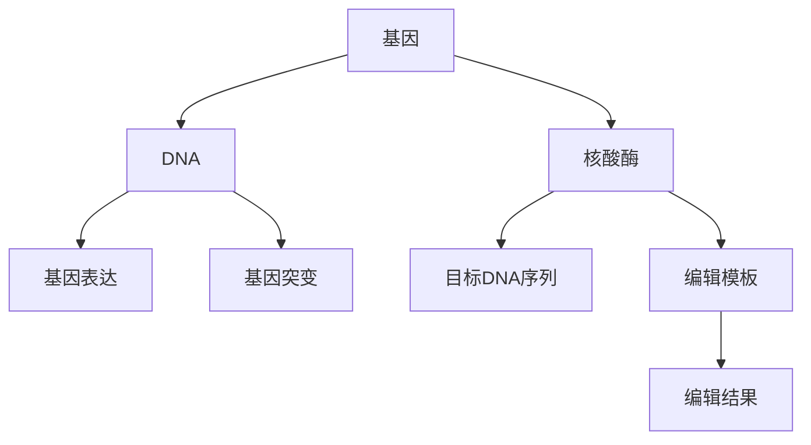
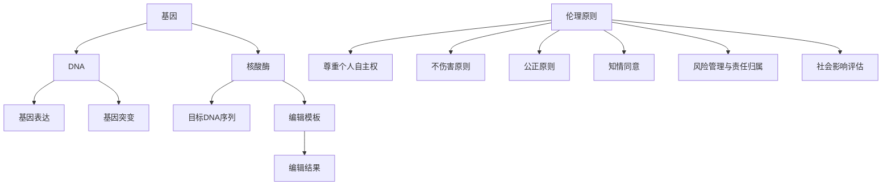
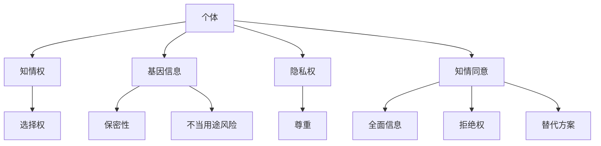
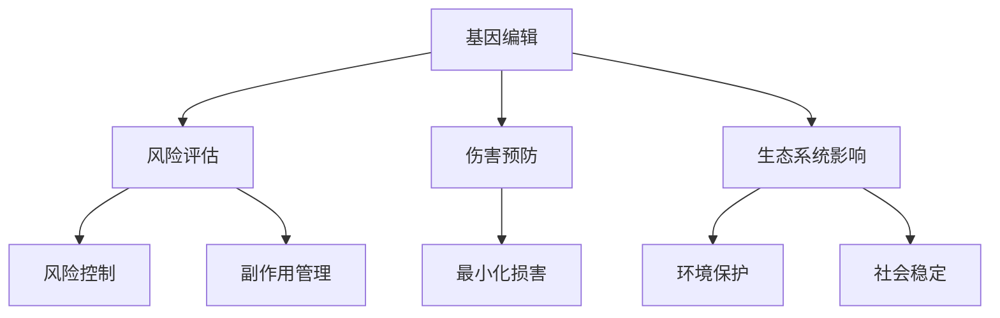
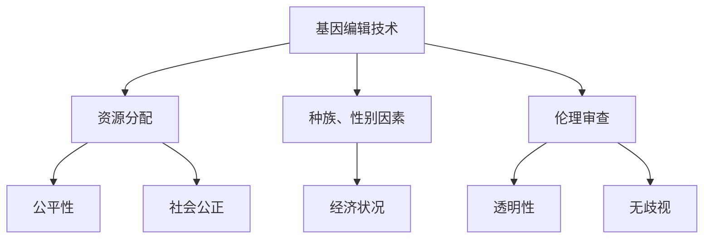

                 

# 《科技伦理的前沿问题：人类基因编辑的道德思考》

> 关键词：基因编辑、伦理、道德思考、科技前沿

> 摘要：本文从科技伦理的角度，深入探讨了人类基因编辑所带来的道德思考问题。文章首先介绍了基因编辑的背景和核心概念，然后分析了基因编辑相关的伦理原则和理论，随后探讨了基因编辑在医疗、科研和军事领域的具体应用及伦理问题，并通过案例研究深入分析了这些伦理问题。最后，文章总结了不同国家和国际组织在人类基因编辑方面的法规和政策，并对未来基因编辑技术的发展及其可能带来的伦理挑战进行了展望，提出了相应的对策建议。

## 目录大纲

1. **背景介绍**
   - 问题的背景
   - 问题描述
   - 问题解决
   - 边界与外延
   - 核心概念与概念结构与核心要素组成

2. **核心概念与联系**
   - 基因编辑的概念
   - 常见基因编辑技术
   - 伦理原则与理论
   - 概念间联系Mermaid流程图

3. **伦理原则和理论**
   - 尊重个人自主权
   - 不伤害原则
   - 公正原则
   - 其他伦理原则

4. **人类基因编辑的具体应用**
   - 医疗领域
   - 科研领域
   - 军事领域

5. **案例研究**
   - 案例一：CRISPR-Cas9技术的应用
   - 案例二：基因编辑婴儿事件
   - 案例三：基因治疗的安全性争议

6. **国际法规与政策**
   - 国际法规概述
   - 不同国家的法规
   - 国际组织的政策

7. **未来展望**
   - 技术发展
   - 伦理挑战
   - 社会影响

8. **总结与建议**
   - 主要观点总结
   - 对策建议

9. **拓展阅读**

## 背景介绍

### 问题的背景

基因编辑技术作为现代生物科技的重要突破，为人类带来了巨大的医疗、科研和军事潜力。然而，这项技术也引发了深刻的伦理争议。基因编辑涉及到人类基因组的改变，这可能对个人、社会和人类种群的未来产生深远的影响。因此，如何平衡科技的发展与伦理的考虑，成为了亟待解决的问题。

基因编辑技术的发展历程可以追溯到20世纪末，特别是CRISPR-Cas9技术的出现，使得基因编辑变得更加高效和便捷。这项技术通过使用特定的核酸酶对DNA进行精准切割，从而实现基因的添加、删除或修改。基因编辑的应用范围广泛，包括疾病治疗、遗传病预防、生物科研和军事应用等。

然而，基因编辑技术的应用也引发了一系列伦理问题，例如：

- **个人自主权**：基因编辑是否应该用于人类？如果可以，那么如何确保个体的自主权和知情权？
- **不伤害原则**：基因编辑技术可能带来未知的副作用和风险，如何确保不对个人和社会造成伤害？
- **公正原则**：基因编辑技术可能导致社会不公，如何确保技术公平地分配和使用？
- **社会影响**：基因编辑技术可能会改变人类的遗传特征，甚至导致种群的遗传多样性减少，这将对人类社会产生什么样的影响？

### 问题描述

基因编辑技术引发的伦理问题非常复杂，涉及到多个层面。首先，个人层面的伦理问题包括个体自主权、隐私权和知情权。基因编辑可能涉及到个人的遗传信息，这需要确保个人对这些信息的知情权和自主权。

其次，社会层面的伦理问题包括公平性、风险管理和责任归属。基因编辑技术的应用可能导致社会不公，特别是当技术只被富裕人群所拥有时。此外，基因编辑技术可能带来一系列风险和未知后果，如何进行有效的风险管理和责任归属是一个重要的伦理问题。

最后，全球层面的伦理问题包括国际合作、生物安全和人类种群的未来。基因编辑技术的应用需要全球范围内的合作和监管，以确保技术的安全性和公平性。此外，基因编辑技术可能对人类种群的遗传多样性产生深远的影响，这将对人类的未来产生重要的伦理挑战。

### 问题解决

解决基因编辑引发的伦理问题需要从多个层面进行综合考虑。首先，在个人层面，需要建立透明的基因编辑指南和监管机制，确保个人在知情和自主的情况下参与基因编辑。

其次，在社会层面，需要制定公平的基因编辑政策，确保技术能够公平地分配和使用。同时，建立有效的风险管理和责任归属机制，以应对基因编辑可能带来的风险和未知后果。

最后，在全球化层面，需要加强国际合作，建立全球性的基因编辑监管机构，确保技术的安全性和公平性。此外，还需要进行长期的生物安全研究，以评估基因编辑技术对人类种群的影响。

### 边界与外延

基因编辑技术的伦理问题并不仅限于科学和医疗领域，它还涉及到法律、政治、社会和文化等多个方面。首先，在科学和医疗领域，基因编辑技术需要遵循医学伦理原则，如尊重个人自主权、不伤害原则和公正原则。其次，在法律层面，需要制定相应的法律法规来规范基因编辑技术的应用。此外，基因编辑技术还涉及到政治决策和公共政策的制定，这需要政府、科学家和社会各界的共同参与。

### 核心概念与概念结构与核心要素组成

基因编辑的核心概念包括基因、DNA、基因表达和基因突变。基因是DNA序列的一部分，它携带着生物体遗传信息的指令。DNA是构成基因的化学物质，它通过双螺旋结构存储和传递遗传信息。基因表达是指基因在生物体细胞内的活性过程，通过转录和翻译生成蛋白质。基因突变是指基因序列的改变，可能导致基因表达的变化和生物体性状的改变。

基因编辑技术的核心要素包括核酸酶、目标DNA序列、编辑模板和编辑结果。核酸酶是用于切割DNA的酶，如CRISPR-Cas9系统中的Cas9核酸酶。目标DNA序列是基因编辑要修改的DNA序列。编辑模板是用于指导核酸酶切割的DNA序列。编辑结果是基因编辑后的DNA序列，它可能是一个新的基因序列或基因表达的变化。

### 核心概念与联系

为了更好地理解基因编辑的伦理问题，我们需要了解其核心概念及其之间的联系。以下是一个简单的Mermaid流程图，展示了基因编辑的核心概念及其联系：

在这个流程图中，基因是DNA的一部分，DNA通过基因表达生成蛋白质，也可能发生突变。基因编辑通过核酸酶对目标DNA序列进行切割，使用编辑模板指导核酸酶的作用，最终产生编辑结果。

## 核心概念与联系

### 基因编辑的概念

基因编辑是指利用特定的技术手段对生物体的基因组进行精确修改的过程。这种技术可以用来添加、删除或替换基因序列，从而改变生物体的遗传特征。基因编辑的核心在于其精确性，通过特定的核酸酶（如CRISPR-Cas9系统中的Cas9核酸酶）在DNA上切割出特定的序列，然后通过DNA修复机制引入改变。

基因编辑技术可以分为两类：第一类是基于核酸酶的基因编辑技术，如CRISPR-Cas9、TALEN和ZFN；第二类是基于DNA定向打靶的基因编辑技术，如电融合、核移植和基因枪。

### 常见基因编辑技术

1. **CRISPR-Cas9**：CRISPR-Cas9系统是一种基于细菌天然免疫机制的基因编辑技术。该技术使用RNA引导Cas9核酸酶识别并切割特定的DNA序列，从而实现对基因的编辑。CRISPR-Cas9技术的优势在于其简单、高效和成本较低，已成为基因编辑领域的主要工具。

2. **TALEN和ZFN**：TALEN（Transcription Activator-Like Effector Nucleases）和ZFN（Zinc Finger Nucleases）是另一种基于核酸酶的基因编辑技术。这些技术使用人工设计的DNA结合域来引导核酸酶切割DNA，与CRISPR-Cas9相比，TALEN和ZFN在切割效率和特异性方面具有优势。

3. **电融合**：电融合是一种基于物理方法的基因编辑技术，通过电脉冲将外源DNA导入细胞内，从而实现基因编辑。电融合技术适用于多种细胞类型，但其效率相对较低。

4. **核移植**：核移植是一种将细胞核移植到去核的卵细胞中，从而实现基因编辑的技术。核移植技术可以用于动物模型的构建和基因功能研究。

5. **基因枪**：基因枪是一种将外源DNA通过高速微粒加速射入细胞的技术。基因枪适用于植物和微生物的基因编辑，但效率较低且存在一定的生物安全风险。

### 伦理原则与理论

基因编辑技术涉及到的伦理问题复杂多样，需要基于一系列伦理原则和理论进行分析。以下是一些关键的伦理原则和理论：

1. **尊重个人自主权**：基因编辑技术涉及到个人基因信息的修改，因此尊重个人自主权是至关重要的。个人应该有权决定是否进行基因编辑，以及编辑的程度和目的。

2. **不伤害原则**：基因编辑技术可能带来未知的副作用和风险，因此必须确保不伤害原则得到遵守。在进行基因编辑时，需要评估潜在的风险，并采取必要的措施降低风险。

3. **公正原则**：基因编辑技术的应用可能导致社会不公，因此公正原则必须得到遵守。确保技术公平地分配和使用，避免技术垄断和不公平现象的发生。

4. **知情同意**：知情同意是基因编辑伦理问题中的一个重要原则。个人在进行基因编辑之前，应该充分了解相关风险、潜在后果和可能的选择，并在此基础上做出知情决策。

5. **风险管理与责任归属**：基因编辑技术可能带来一系列风险，包括健康风险、社会风险和环境风险。因此，需要建立有效的风险管理和责任归属机制，以应对可能发生的风险和争议。

6. **社会影响评估**：基因编辑技术的应用可能对人类社会产生深远的影响，因此需要进行社会影响评估。这包括评估技术对社会结构、文化、伦理和道德的影响，以及可能产生的经济和社会不平等。

### 概念间联系Mermaid流程图

为了更好地展示基因编辑的核心概念及其联系，我们可以使用Mermaid流程图进行描述。以下是一个简化的Mermaid流程图，展示了基因编辑的核心概念及其相互关系：

在这个流程图中，基因是DNA的一部分，DNA通过基因表达生成蛋白质，也可能发生突变。基因编辑通过核酸酶对目标DNA序列进行切割，使用编辑模板指导核酸酶的作用，最终产生编辑结果。同时，伦理原则和理论贯穿于基因编辑的全过程，确保技术的合法、安全、公正和有责任地进行。

## 伦理原则和理论

### 尊重个人自主权

尊重个人自主权是基因编辑伦理问题中的一个核心原则。基因编辑技术涉及到对个体基因组的改变，这可能对个体的身体、心理健康以及社会关系产生深远的影响。因此，确保个体的自主权在基因编辑过程中得到尊重至关重要。

**概念与属性特征对比表格**：

| 原则       | 定义                                                         | 属性特征对比 |
|------------|--------------------------------------------------------------|--------------|
| 尊重个人自主权 | 确保个体在基因编辑过程中拥有知情权和选择权                       | - 个体有权决定是否接受基因编辑 - 个体有权了解基因编辑的风险和潜在后果 - 个体有权选择基因编辑的目的和方法 |
| 个人隐私权   | 保护个体的基因信息，防止未经授权的获取和滥用                   | - 确保基因信息的保密性 - 避免基因信息被用于不当目的 - 确保个体的隐私权得到尊重 |
| 知情同意     | 在基因编辑之前，确保个体充分了解相关信息，并在此基础上做出决策 | - 个体有权获得全面的信息 - 个体有权拒绝基因编辑 - 个体有权了解可能的选择和替代方案 |

**ER实体关系图架构的Mermaid流程图**：

在这个流程图中，个体作为基因编辑的主体，拥有知情权、选择权和隐私权。知情权确保个体在基因编辑之前获得全面的信息，选择权确保个体有权决定是否接受基因编辑，隐私权确保个体的基因信息得到保护，不被滥用。知情同意则贯穿于整个基因编辑过程，确保个体在充分了解相关信息的基础上做出决策。

### 不伤害原则

不伤害原则是伦理学中的一个基本原则，主张在任何行为中都不应造成不必要的伤害。在基因编辑领域，不伤害原则尤为重要，因为基因编辑可能带来一系列未知的副作用和风险。

**概念与属性特征对比表格**：

| 原则       | 定义                                                         | 属性特征对比 |
|------------|--------------------------------------------------------------|--------------|
| 不伤害原则 | 确保基因编辑过程中不对个人、社会和生态系统造成不必要的伤害     | - 评估潜在风险 - 降低风险 - 减少副作用 - 采取预防措施 |
| 损害最小化 | 在不可避免的情况下，尽量减少基因编辑带来的伤害和负面影响       | - 最小化风险暴露 - 选择最小损伤的方案 - 采取修复措施 |
| 风险控制    | 对基因编辑过程中的风险进行有效控制，确保个体和社会的安全       | - 制定风险管理计划 - 监控风险指标 - 建立应急预案 |

**ER实体关系图架构的Mermaid流程图**：

在这个流程图中，基因编辑作为主体，需要进行风险评估和控制，以预防不必要的伤害。风险评估旨在识别潜在的风险，风险控制则旨在采取措施降低这些风险，副作用管理则关注如何减少基因编辑带来的副作用。同时，基因编辑还需要考虑对生态系统和社会的影响，确保不会对环境和人类社会的稳定造成破坏。

### 公正原则

公正原则是伦理学中的一个重要原则，主张资源和服务应公平地分配，不应因种族、性别、经济状况等因素而产生不公平。在基因编辑领域，公正原则尤为重要，因为基因编辑技术的应用可能带来社会不公，影响人类种群的遗传多样性。

**概念与属性特征对比表格**：

| 原则       | 定义                                                         | 属性特征对比 |
|------------|--------------------------------------------------------------|--------------|
| 公正原则   | 确保基因编辑技术公平地分配和使用，避免社会不公                 | - 资源分配公平 - 服务提供平等 - 避免种族、性别、经济状况等因素的影响 |
| 社会公正   | 确保基因编辑技术的应用不会加剧社会不平等，促进社会和谐与进步   | - 避免基因编辑技术垄断 - 减少经济不平等 - 保障弱势群体的权益 |
| 公平性     | 确保基因编辑技术的应用过程和结果公平，无歧视和不偏袒           | - 消除歧视性政策 - 透明决策过程 - 公正的伦理审查 |

**ER实体关系图架构的Mermaid流程图**：

在这个流程图中，基因编辑技术作为主体，需要确保资源分配公平，服务提供平等，避免因种族、性别、经济状况等因素而产生不公平。伦理审查则关注决策过程的透明性、无歧视性和公正性，以确保基因编辑技术的应用不会加剧社会不公。

### 其他伦理原则

除了上述的核心原则，基因编辑领域还涉及到其他一些伦理原则，如知情同意、风险管理、社会责任等。

**知情同意**：

知情同意是基因编辑过程中不可或缺的原则，确保个体在充分了解相关信息的基础上做出决策。知情同意包括以下方面：

- **全面信息**：个体应获得关于基因编辑技术、潜在风险、可能后果和替代方案等全面信息。
- **理解能力**：个体应具备理解所提供信息的能力，如果需要，应提供辅助工具或解释服务。
- **自愿选择**：个体应有权自愿选择是否接受基因编辑，不应受到任何形式的强制或诱导。

**风险管理**：

风险管理是确保基因编辑过程安全的关键原则。风险管理包括以下方面：

- **风险评估**：对基因编辑过程中的潜在风险进行评估，包括健康风险、社会风险和环境风险。
- **风险控制**：采取有效措施降低风险，包括制定风险管理计划、实施监控和建立应急预案。
- **信息公开**：确保相关风险信息公开透明，个体能够了解风险并做出明智的决策。

**社会责任**：

社会责任是基因编辑技术应用的道德要求，确保技术应用不损害社会利益。社会责任包括以下方面：

- **伦理审查**：建立独立的伦理审查机构，对基因编辑技术的应用进行审查，确保符合伦理标准。
- **社会影响评估**：对基因编辑技术的应用进行社会影响评估，包括对经济、社会和文化等方面的影响。
- **公平分配**：确保基因编辑技术公平分配，避免技术垄断和社会不公。

通过上述伦理原则的指导，我们可以更好地规范基因编辑技术的应用，确保其在医疗、科研和军事等领域的应用符合伦理标准，为人类的健康和社会进步做出贡献。

## 人类基因编辑的具体应用

### 医疗领域

基因编辑技术在医疗领域具有巨大的潜力，尤其是在治疗遗传性疾病和癌症方面。通过精准修改致病基因，基因编辑技术有望治愈许多以往无法治疗的疾病。

**基因治疗**：基因治疗是基因编辑在医疗领域的主要应用之一。通过将功能正常的基因引入到患者的细胞中，可以纠正致病基因的错误，从而治疗遗传性疾病。例如，脊髓性肌萎缩症（SMA）是一种由于SMN1基因缺陷引起的疾病，通过CRISPR-Cas9技术修复SMN1基因，已经取得了一定的治疗效果。

**基因筛查**：基因筛查是另一种重要的医疗应用。通过检测个体基因组的特定区域，可以预测个体患某种遗传性疾病的风险。例如，通过基因筛查可以早期发现乳腺癌、肺癌等癌症的遗传风险，从而进行早期预防和干预。

### 科研领域

基因编辑技术在生物科研领域发挥着重要作用，推动了生命科学的发展。通过基因编辑，科学家可以精确地修改或删除特定基因，研究基因的功能和相互作用。

**基因功能研究**：基因编辑技术可以帮助科学家了解基因的功能。例如，通过CRISPR-Cas9技术，科学家可以敲除特定基因，观察生物体在缺少该基因时的表现，从而推断该基因的功能。

**基因组结构解析**：基因编辑技术还可以用于基因组结构的研究。例如，通过CRISPR-Cas9技术，科学家可以创建基因敲除或插入突变的小鼠模型，用于研究基因组结构对生物体功能的影响。

### 军事领域

基因编辑技术在军事领域也具有潜在的应用价值，特别是在生物武器和防御方面。

**生物武器**：基因编辑技术可以用于创建具有特定生物战能力的微生物。例如，通过基因编辑，可以增强病原体的毒性、传播能力或抗药性，从而开发出更有效的生物武器。

**生物防御**：基因编辑技术还可以用于生物防御，通过编辑病原体的基因组，降低其毒性和传播能力，从而提高人类对生物武器的防御能力。例如，通过CRISPR-Cas9技术，科学家可以创建一种能够抵御特定病原体的微生物，用于生物防御。

### 伦理问题

基因编辑在医疗、科研和军事领域的应用带来了许多伦理问题，需要我们深入思考。

**个人自主权**：基因编辑技术的应用需要确保个体的自主权。在医疗领域，患者应有权决定是否接受基因编辑治疗，并充分了解相关的风险和潜在后果。在科研领域，研究者应尊重实验对象的知情权和选择权。在军事领域，基因编辑技术的应用需要遵循军事伦理准则，确保不会对平民造成伤害。

**不伤害原则**：基因编辑技术可能带来一系列风险和副作用，需要确保不伤害原则得到遵守。在医疗领域，基因编辑治疗的安全性需要经过严格的临床试验和审批。在科研领域，基因编辑实验需要遵循动物福利和伦理标准。在军事领域，基因编辑技术的应用应避免对平民造成伤害。

**公正原则**：基因编辑技术的应用可能导致社会不公，需要确保公正原则得到遵守。在医疗领域，基因编辑治疗应公平分配，不应仅限于富裕人群。在科研领域，基因编辑技术的研发和应用应公平地惠及社会各个阶层。在军事领域，基因编辑技术的应用应遵循国际法和伦理准则，确保不会加剧军事不公。

**社会影响**：基因编辑技术的应用可能对人类社会产生深远的影响，需要我们进行社会影响评估。在医疗领域，基因编辑技术可能改变疾病治疗模式，影响医学伦理和社会观念。在科研领域，基因编辑技术可能推动生命科学的发展，但也可能引发伦理和道德争议。在军事领域，基因编辑技术的应用可能改变战争模式，影响国际安全和人类未来。

通过深入探讨基因编辑在医疗、科研和军事领域的具体应用及其伦理问题，我们可以更好地理解基因编辑技术的复杂性和挑战，为未来的科技发展提供伦理指导。

## 案例研究

### 案例一：CRISPR-Cas9技术的应用

CRISPR-Cas9技术作为一种高效、便捷的基因编辑工具，已经在医学、科研和农业等领域取得了显著的应用成果。然而，其应用也引发了一系列伦理争议，尤其是在人类胚胎基因编辑方面的应用。

**背景**：

2018年，中国科学家贺建奎宣布成功利用CRISPR-Cas9技术对一对双胞胎胚胎进行基因编辑，旨在使他们获得对HIV的天然免疫力。这一消息一经公布，立即引起了全球科学界和伦理学界的广泛关注和强烈反对。

**伦理问题**：

1. **尊重个人自主权**：贺建奎在未经双胞胎父母和受试者充分知情和同意的情况下进行基因编辑，违反了尊重个人自主权的伦理原则。

2. **不伤害原则**：基因编辑可能带来未知的副作用和风险，而这些风险在未经充分评估的情况下对双胞胎及其后代可能造成不可逆的伤害。

3. **公正原则**：基因编辑技术的应用可能导致社会不公，特别是当技术只被富裕人群所拥有时，这加剧了社会的不公平。

4. **社会影响**：基因编辑技术的滥用可能对人类社会产生深远的影响，改变人类种群的遗传多样性，甚至导致基因编辑技术的滥用和道德沦丧。

**结论**：

CRISPR-Cas9技术的应用在人类胚胎基因编辑方面的伦理争议突出，其违反了伦理原则，对人类社会可能造成负面影响。这一案例提醒我们，在推动基因编辑技术发展的同时，必须严格遵循伦理原则，确保技术的合法、安全、公正和有责任地进行。

### 案例二：基因编辑婴儿事件

2018年，中国科学家贺建奎宣布成功利用CRISPR-Cas9技术创造了全球首例基因编辑婴儿，这一事件引发了全球科学界和伦理学界的强烈谴责。

**背景**：

贺建奎团队在未经伦理审查和患者知情同意的情况下，利用CRISPR-Cas9技术对一对双胞胎胚胎进行基因编辑，使其获得对HIV的天然免疫力。这一行为严重违反了伦理原则和法律法规。

**伦理问题**：

1. **知情同意**：贺建奎在未经双胞胎父母和受试者充分知情和同意的情况下进行基因编辑，违反了知情同意的伦理原则。

2. **伦理审查**：基因编辑技术的应用需要经过严格的伦理审查，以确保其符合伦理标准和法律法规。贺建奎的行为未经过伦理审查，违反了伦理审查的规范。

3. **不伤害原则**：基因编辑可能带来未知的副作用和风险，而这些风险在未经充分评估的情况下对双胞胎及其后代可能造成不可逆的伤害。

4. **社会影响**：基因编辑技术的滥用可能对人类社会产生深远的影响，改变人类种群的遗传多样性，甚至导致基因编辑技术的滥用和道德沦丧。

**结论**：

基因编辑婴儿事件暴露了基因编辑技术伦理问题的严重性，其违反了伦理原则和法律法规，对人类社会可能造成负面影响。这一事件提醒我们，必须加强伦理审查和监管，确保基因编辑技术的合法、安全、公正和有责任地进行。

### 案例三：基因治疗的安全性争议

基因治疗是一种利用基因编辑技术治疗遗传性疾病的方法，尽管在医学领域取得了显著进展，但其安全性仍然存在争议。

**背景**：

2019年，美国一家基因治疗公司对一名患有罕见遗传性视网膜病变的男孩进行基因治疗。然而，治疗过程中出现了严重副作用，导致男孩视力丧失，引发了对基因治疗安全性的广泛讨论。

**伦理问题**：

1. **风险控制**：基因治疗的安全性风险需要得到充分评估和控制。在未经充分评估的情况下，对高风险的基因编辑治疗可能导致严重副作用。

2. **知情同意**：患者在接受基因治疗前应充分了解治疗的风险和潜在后果，并在知情同意的基础上做出决策。然而，一些患者可能由于信息不足或误解而未能做出明智的决定。

3. **不伤害原则**：基因治疗应确保不伤害患者，尽管治疗过程中可能出现副作用，但这些副作用应在可接受的范围内。

4. **社会责任**：基因治疗公司有责任确保其产品的安全性和有效性，并在治疗过程中承担社会责任。

**结论**：

基因治疗的安全性问题提醒我们，在推动基因治疗技术发展的同时，必须严格评估和控制风险，确保患者的安全和权益。同时，基因治疗公司和科研机构应承担社会责任，确保技术的合法、安全和有责任地进行。

## 国际法规与政策

### 国际法规概述

随着基因编辑技术的快速发展，国际社会逐渐认识到其潜在的风险和伦理挑战。为了规范基因编辑技术的应用，多个国际组织和国家开始制定相关的法规和政策。

**国际组织**：

1. **联合国**：联合国下属的生物多样性公约（CBD）和人类基因组组织（OGH）等机构在基因编辑技术方面提出了一系列指导原则和建议。

2. **世界卫生组织（WHO）**：WHO发布了《人类基因组编辑的国际指导原则》，强调在基因编辑技术应用前进行风险评估、伦理审查和国际合作的重要性。

3. **国际生物伦理学委员会（IBEC）**：IBEC致力于推动全球生物伦理学研究，为基因编辑技术的伦理规范提供指导。

**国家法规**：

不同国家根据自身的科技发展水平和伦理观念，制定了各自的基因编辑法规和政策。

1. **美国**：美国国立卫生研究院（NIH）和食品和药物管理局（FDA）对基因编辑技术进行了严格的监管，要求进行充分的伦理审查和临床试验。

2. **欧洲**：欧盟委员会发布了《基因编辑技术指南》，强调基因编辑技术的安全评估和伦理审查，并要求在临床试验前进行充分的风险评估。

3. **中国**：中国科学技术部和卫生健康委员会发布了《基因编辑技术应用管理暂行办法》，对基因编辑技术进行了明确的监管框架。

### 不同国家的法规

不同国家在基因编辑技术方面的法规和政策存在显著差异，主要表现在以下几个方面：

1. **监管强度**：一些国家，如美国和欧盟，对基因编辑技术的监管较为严格，要求进行严格的伦理审查和临床试验。而一些国家，如中国，虽然也进行了监管，但相对较为宽松。

2. **伦理审查**：大多数国家要求基因编辑技术进行伦理审查，确保其符合伦理原则和道德标准。不同国家的伦理审查机构有所不同，例如美国的伦理审查委员会（IRB）和欧盟的伦理审查委员会（ECR）。

3. **临床试验**：基因编辑技术的临床试验在不同国家的要求也有所不同。一些国家要求在临床试验前进行详细的风险评估，并制定风险管理计划。例如，美国要求进行充分的临床试验和风险管理。

4. **社会影响评估**：一些国家，如欧盟，要求进行社会影响评估，以评估基因编辑技术对经济、社会和文化等方面的影响。

### 国际组织的政策

国际组织在基因编辑技术方面的政策主要包括以下方面：

1. **国际合作**：国际组织鼓励基因编辑技术的国际合作，以推动技术标准的统一和监管体系的完善。例如，WHO推动全球基因编辑技术的监管合作。

2. **伦理指导原则**：国际组织制定了基因编辑技术的伦理指导原则，以提供全球范围内的伦理规范。这些原则包括尊重个人自主权、不伤害原则、公正原则等。

3. **风险评估**：国际组织强调在基因编辑技术应用前进行充分的风险评估，以识别和降低潜在风险。

4. **伦理审查**：国际组织鼓励进行伦理审查，确保基因编辑技术的应用符合伦理原则和道德标准。

### 对比与评价

不同国家和国际组织在基因编辑技术方面的法规和政策存在差异，这反映了各国在科技发展、伦理观念和社会价值观等方面的不同。以下是对不同法规和政策的对比与评价：

1. **监管强度**：美国和欧盟的监管较为严格，有助于确保技术的安全性和伦理合规性。然而，过于严格的监管可能会限制技术的创新和应用。

2. **伦理审查**：伦理审查是确保基因编辑技术符合伦理原则的重要手段。不同国家的伦理审查机构存在差异，但都强调在基因编辑技术应用前进行充分审查。

3. **临床试验**：临床试验是验证基因编辑技术安全性和有效性的重要步骤。美国和欧盟在临床试验方面的要求较为严格，有助于确保技术的安全性。

4. **社会影响评估**：社会影响评估有助于全面了解基因编辑技术对经济、社会和文化等方面的影响。欧盟在社会影响评估方面的要求较为严格，有助于确保技术的公平性和社会接受度。

总体而言，国际法规和政策在基因编辑技术方面起到了规范和指导作用，有助于确保技术的安全、合法和伦理合规。然而，不同法规和政策的差异也反映了全球科技发展中的伦理挑战和协调难题。

## 未来展望

### 技术发展

随着基因编辑技术的不断进步，其应用领域将更加广泛，技术也将更加精准和高效。未来的基因编辑技术可能包括以下方面：

1. **基因编辑效率的提升**：随着CRISPR-Cas9等技术的优化，基因编辑的效率将进一步提高，降低编辑过程中的错误率。

2. **新型基因编辑工具的开发**：除了CRISPR-Cas9，科学家们还在开发其他新型基因编辑工具，如RNA编辑技术（如RNA剪接酶）和基于纳米技术的基因编辑工具。

3. **基因编辑的可视化和实时监控**：通过结合基因编辑技术和先进成像技术，可以实现基因编辑过程的可视化和实时监控，提高编辑的精准性和效率。

4. **基因编辑在个体化医学中的应用**：基因编辑技术有望在个体化医学中发挥重要作用，通过精准编辑患者的基因组，实现个性化治疗。

### 伦理挑战

随着基因编辑技术的快速发展，其应用也带来了一系列新的伦理挑战：

1. **安全性问题**：基因编辑技术可能引发未知的副作用和风险，如基因编辑导致的基因突变、基因编辑导致的基因表达异常等。

2. **公平性问题**：基因编辑技术的应用可能导致社会不公，特别是当技术只被富裕人群所拥有时。

3. **隐私问题**：基因编辑涉及到个人基因信息的修改，如何保护个人隐私和数据安全成为重要挑战。

4. **社会接受度**：基因编辑技术的广泛应用可能改变人类种群的遗传特征，这需要社会广泛的接受和认同。

### 社会影响

基因编辑技术的广泛应用将对人类社会产生深远的影响：

1. **医疗领域**：基因编辑技术有望治愈许多遗传性疾病，提高人类健康水平。

2. **农业领域**：基因编辑技术可以改良作物品种，提高农业产量和抗病虫害能力。

3. **环境保护**：基因编辑技术可以用于环境保护，例如通过基因编辑改善污染环境的生物修复能力。

4. **社会伦理**：基因编辑技术的应用可能导致新的社会伦理问题，如人类基因改造、种群遗传多样性等。

总之，基因编辑技术的发展带来巨大的机遇，同时也伴随着一系列伦理挑战和社会影响。为了实现基因编辑技术的可持续发展，我们需要在科技发展、伦理规范和社会治理等方面进行深入探讨和合作。

## 总结与建议

### 主要观点总结

本文从科技伦理的角度，深入探讨了人类基因编辑所带来的道德思考问题。通过分析基因编辑技术的背景、核心概念、伦理原则和应用，我们发现基因编辑技术虽然具有巨大的医疗、科研和军事潜力，但也引发了深刻的伦理争议。具体观点总结如下：

1. **尊重个人自主权**：基因编辑技术必须确保个体在知情和自主的情况下参与，确保个体的知情权和选择权。
2. **不伤害原则**：基因编辑技术需要确保不对个人和社会造成不必要的伤害，进行充分的风险评估和控制。
3. **公正原则**：基因编辑技术的应用应确保公平分配，避免加剧社会不公，保障弱势群体的权益。
4. **社会影响评估**：基因编辑技术的应用需要对经济、社会和文化等方面进行评估，确保技术的公平和可持续性。
5. **国际合作**：全球范围内的合作和监管是确保基因编辑技术安全、合法和伦理合规的关键。

### 对策建议

为了应对基因编辑技术带来的伦理挑战，我们提出以下对策建议：

1. **建立透明和公正的监管机制**：政府应建立透明、公正的基因编辑监管机制，确保技术的合法、安全和有责任地进行。同时，加强伦理审查，确保技术应用符合伦理原则。

2. **加强国际合作**：国际社会应加强在基因编辑技术领域的合作，制定统一的伦理准则和监管标准，确保全球范围内的技术安全和公平。

3. **推动公众教育和科普**：通过公众教育和科普宣传，提高公众对基因编辑技术的了解和认识，增强社会对技术的接受度和认同感。

4. **开展长期的社会影响研究**：对基因编辑技术的应用进行长期的社会影响研究，评估其对社会结构、文化、伦理和道德等方面的影响，制定相应的应对策略。

5. **确保技术透明性和公平性**：在基因编辑技术的研发和应用过程中，确保技术透明性和公平性，避免技术垄断和社会不公。

通过上述对策，我们可以更好地应对基因编辑技术带来的伦理挑战，确保其在医疗、科研和军事等领域的可持续发展。

## 拓展阅读

为了深入了解人类基因编辑的伦理问题，读者可以参考以下书籍、文献和在线资源：

### 书籍推荐：

1. **《基因编辑：改变人类未来的科技革命》** - 作者：罗纳德·M·迪金森
   - 本书详细介绍了基因编辑技术的发展及其在医疗、农业和环境保护等领域的应用，并对伦理问题进行了深入探讨。

2. **《基因伦理学：基因编辑的社会、法律和道德问题》** - 作者：萨利·萨默斯
   - 本书从伦理学角度分析了基因编辑技术的伦理问题，包括尊重个人自主权、不伤害原则和公正原则等。

3. **《基因组编辑：科学、伦理与社会影响》** - 作者：玛莎·斯图尔特
   - 本书探讨了基因编辑技术的科学原理、伦理挑战和社会影响，提供了一系列有针对性的建议。

### 文献推荐：

1. **《人类基因组编辑的国际指导原则》** - 世界卫生组织
   - 该指导原则提供了全球范围内基因编辑技术的伦理指导和监管建议。

2. **《基因编辑的法律与伦理问题》** - 美国国立卫生研究院
   - 本文详细分析了基因编辑技术的法律和伦理问题，包括伦理审查、知情同意和安全评估等。

### 在线资源：

1. **人类基因编辑研究数据库** - https://www.genomeeditingdatabase.org/
   - 该数据库提供了全球范围内基因编辑研究的最新信息和文献资源。

2. **基因编辑伦理专题网站** - https://www.genomeethics.org/
   - 该网站提供了关于基因编辑伦理问题的深度分析和讨论，包括政策、案例研究和专家观点。

通过阅读这些书籍、文献和在线资源，读者可以进一步深入了解基因编辑技术的伦理问题，为未来的科技发展提供深刻的思考和指导。作者：AI天才研究院/AI Genius Institute & 禅与计算机程序设计艺术 /Zen And The Art of Computer Programming。

