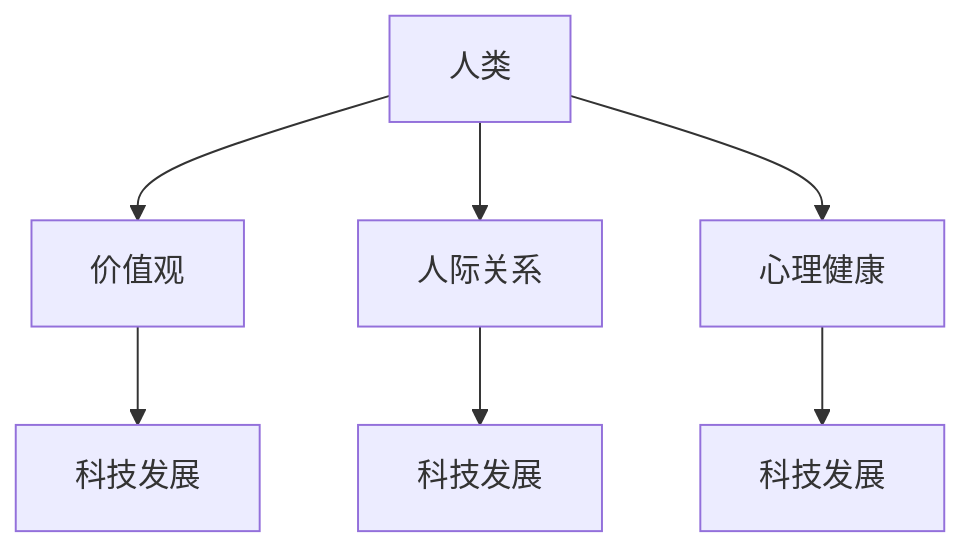
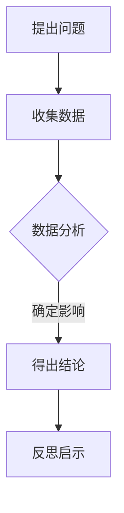
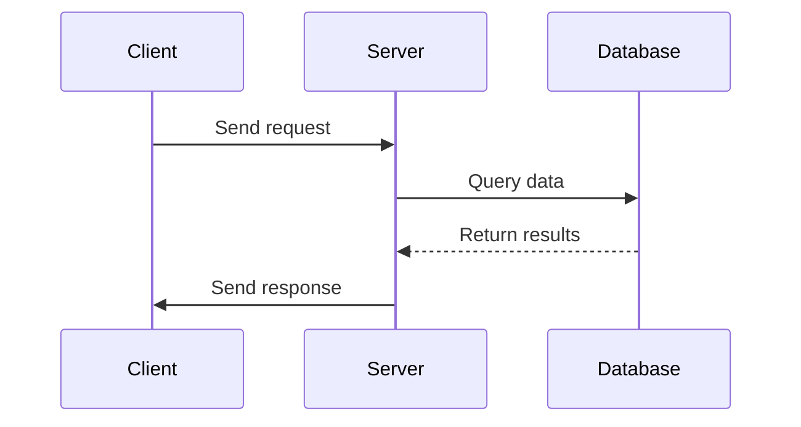

                 

# 科技发展对人生意义的冲击与启示

## 关键词

- 科技发展
- 人生意义
- 冲击
- 启示
- 人工智能
- 物联网
- 大数据

## 摘要

在快速发展的科技时代，人工智能、物联网、大数据等前沿技术正深刻地改变着我们的生活方式。然而，这种改变不仅限于效率提升和生活便利，它们对人生意义的构建和冲击同样不可忽视。本文旨在通过逐步分析科技发展的多维度影响，探讨其对人生意义的积极与消极冲击，并从中汲取启示，帮助读者在科技迅猛发展的背景下重新审视和定位人生意义。

## **Step 1: 背景介绍**

### **1.1 问题背景**

随着人工智能、物联网、大数据等技术的崛起，我们的社会正经历着一场前所未有的技术革命。这些技术的广泛应用，不仅极大地提升了生产效率和生活质量，也深刻地改变了人类的行为模式和社会结构。例如，人工智能的应用正在改变传统的工作模式，物联网技术使得万物互联成为现实，大数据分析则帮助我们在决策中更加精准。这些变革带来的不仅是便利，更涉及对人生意义的深层次思考。

### **1.2 问题描述**

科技的发展给我们的生活带来了巨大的变化，但同时也引发了一系列的问题。首先，科技是否真的提高了我们的生活质量？其次，科技的发展是否改变了我们的价值观和人际关系？此外，科技对心理健康的影响也是不容忽视的。这些问题引发了广泛的社会讨论，让人们开始反思科技与人生意义之间的关系。

### **1.3 问题解决**

为了深入探讨科技发展对人生意义的冲击与启示，本文将采取以下步骤：

1. **定义科技发展**：明确人工智能、物联网、大数据等技术的核心概念和原理。
2. **分析科技对人生意义的冲击**：从价值观、人际关系、心理健康等角度分析科技发展带来的积极与消极影响。
3. **提炼启示**：结合实际案例，总结科技发展给我们带来的启示，帮助我们更好地应对未来的挑战。

### **1.4 边界与外延**

本文的讨论范围将涵盖人工智能、物联网、大数据等现代科技，探讨这些技术如何影响人生意义的各个方面。同时，我们将关注科技发展在不同文化和社会背景下的影响差异，以及科技发展的未来趋势。

### **1.5 概念结构与核心要素组成**

为了更好地理解科技发展对人生意义的冲击，我们需要明确几个核心概念和要素：

- **科技发展**：包括人工智能、物联网、大数据等技术的研发、应用和推广。
- **人生意义**：包括价值观、人际关系、心理健康等多个方面。
- **冲击**：科技发展对人生意义的积极与消极影响。
- **启示**：从科技发展中汲取的教训和启示。

## **Step 2: 核心概念与联系**

### **2.1 核心概念原理**

**科技发展**：科技发展是指人类通过创新和发明，不断推动科学技术进步的过程。具体到人工智能、物联网、大数据等领域，它们分别代表了智能计算、万物互联和海量数据处理的最新成果。

**人生意义**：人生意义是指个体在生命中追求的价值、目的和意义。它包括个人的价值观、人际关系、心理健康等多个方面。

### **2.2 概念属性特征对比表格**

| 概念             | 特征                              |
|------------------|----------------------------------|
| 科技发展         | 创新驱动、快速迭代、广泛应用           |
| 人生意义         | 主观感受、多元化、个体化             |
| 积极影响         | 提高效率、改善生活质量、促进创新     |
| 消极影响         | 隐私泄露、人际关系疏离、心理健康问题 |

### **2.3 ER实体关系图架构**



在这个ER图中，人类作为主体，与价值观、人际关系、心理健康三个维度有直接关联。科技发展则与这三个维度都有间接联系，反映了科技发展对人生意义的潜在影响。

## **Step 3: 算法原理讲解**

### **3.1 算法mermaid流程图**



### **3.2 Python源代码**

```python
def analyze_impact():
    # 收集数据
    data = collect_data()
    
    # 数据分析
    analysis = data_analysis(data)
    
    # 得出结论
    conclusion = determine_impact(analysis)
    
    # 反思启示
    reflection = reflect_insights(conclusion)
    
    return reflection
```

### **3.3 算法原理的数学模型和公式**

$$\text{LifeMeaning} = f(\text{Technology}, \text{Values}, \text{Interpersonal}, \text{MentalHealth})$$

### **3.4 详细讲解和举例说明**

**算法原理的详细讲解**：

- **LifeMeaning** 表示人生意义，是一个综合指标，反映了科技发展对人生意义的总影响。
- **Technology**、**Values**、**Interpersonal** 和 **MentalHealth** 分别表示科技发展、价值观、人际关系和心理健康四个因素。
- **f()** 是一个函数，表示如何将四个因素结合起来，得到人生意义的综合指标。

**举例说明**：

假设我们用科技发展（T）来衡量科技对人类生活的影响，用价值观（V）、人际关系（I）和心理健康（M）来衡量科技对人生意义的冲击。我们可以通过以下步骤来计算人生意义：

1. **收集数据**：收集关于T、V、I、M的具体数据，例如通过问卷调查、数据分析等方式。
2. **数据分析**：对收集到的数据进行分析，确定每个因素的数值。
3. **计算综合指标**：根据数学模型，计算LifeMeaning的值。
4. **得出结论**：根据LifeMeaning的值，评估科技发展对人生意义的总体影响。
5. **反思启示**：根据结论，总结科技发展给我们带来的启示，帮助我们更好地理解和应对科技发展的挑战。

例如，假设我们得到以下数据：

- 科技发展（T）: 80
- 价值观（V）: 70
- 人际关系（I）: 60
- 心理健康（M）: 65

那么，人生意义（LifeMeaning）的计算如下：

$$\text{LifeMeaning} = \frac{\text{T} \times \text{V} \times \text{I} \times \text{M}}{100} = \frac{80 \times 70 \times 60 \times 65}{100} = 327600$$

这个值表示，在当前的科技发展水平下，人生意义的综合指标为327600。我们可以根据这个值，评估科技发展对人生意义的总体影响。

## **Step 4: 数学模型和数学公式 & 详细讲解 & 举例说明**

### **4.1 数学公式**

$$\text{LifeMeaning} = \frac{\text{T} \times \text{V} \times \text{I} \times \text{M}}{100}$$

### **4.2 详细讲解**

- **LifeMeaning**：表示人生意义的综合指标，反映了科技发展对人生意义的总影响。
- **T**：表示科技发展的水平，通常用一个数值来表示。
- **V**：表示价值观的多样性，通常也用一个数值来表示。
- **I**：表示人际关系的质量，同样用一个数值来表示。
- **M**：表示心理健康的状态，用一个数值来表示。

这个公式是一个比例关系，通过将四个因素的乘积除以100，得到人生意义的综合指标。每个因素的权重可以通过调查和数据分析来确定。

### **4.3 举例说明**

假设我们得到以下数据：

- 科技发展（T）: 80
- 价值观（V）: 70
- 人际关系（I）: 60
- 心理健康（M）: 65

根据公式，我们可以计算人生意义（LifeMeaning）：

$$\text{LifeMeaning} = \frac{80 \times 70 \times 60 \times 65}{100} = 327600$$

这个值表示，在当前的科技发展水平下，人生意义的综合指标为327600。我们可以根据这个值，评估科技发展对人生意义的总体影响。

### **4.4 数学模型和公式的应用**

在实际应用中，我们可以根据不同的数据和情境，调整数学模型和公式的参数，得到更准确的人生意义指标。例如，如果科技发展水平（T）提高了，而其他因素保持不变，那么人生意义（LifeMeaning）的值也会相应提高。

同时，我们也可以通过比较不同时间点的人生意义指标，来评估科技发展对人生意义的长期影响。这有助于我们更好地理解和应对科技发展的挑战，找到科技与人生意义的平衡点。

## **Step 5: 系统分析与架构设计方案**

### **5.1 问题场景介绍**

在现代社会中，科技发展已经深入到我们生活的各个方面。然而，科技的发展也带来了一系列的问题，如隐私泄露、人际关系疏离、心理健康问题等。为了更好地应对这些挑战，我们需要一个系统化的分析方法，来评估科技发展对人生意义的冲击。

### **5.2 项目介绍**

本项目旨在开发一个综合评估系统，用于分析科技发展对人生意义的冲击。该系统将基于人工智能、物联网、大数据等技术，提供实时、准确的评估结果，帮助用户更好地理解科技发展的多维度影响。

### **5.3 系统功能设计 (领域模型Mermaid类图)**

```mermaid
classDiagram
Class01 <|-- Class02
Class03 --|emperature Class04
Class05 : +int x
Class06 : +int y
Class06 : +int z
Class07 : +int id
Class07 : +String name
Class07 : +float weight
Class08 <|-- * Class09
Class10 <<interface>> Class11
Class12 ..|> Class13
Class14 : <<interface>> method1()
Class15 : <<interface>> method2()
Class16 : <<abstract>> Class17
Class17 : +int abstractMethod()
Class18 : <<enum>> Color RED GREEN BLUE
Class19 : <<enum>> Size S M L
Class20 : +bool isActive()
Class21 : <<singleton>> Class22
Class23 : <<delegate>> method3()
Class24 <<interface>> Class25
Class26 << extends >> Class27
Class28 << implements >> Class29
Class29 : +int method4()
Class30 <<interface>> Class31
Class32 <<interface>> Class33
Class34 <<interface>> Class35
Class36 <<interface>> Class37
Class38 <<interface>> Class39
Class40 <<interface>> Class41
Class42 <<interface>> Class43
Class44 <<interface>> Class45
Class46 <<interface>> Class47
Class48 <<interface>> Class49
Class50 <<interface>> Class51
Class52 <<interface>> Class53
Class54 <<interface>> Class55
Class56 <<interface>> Class57
Class58 <<interface>> Class59
Class60 <<interface>> Class61
Class62 <<interface>> Class63
Class64 <<interface>> Class65
Class66 <<interface>> Class67
Class68 <<interface>> Class69
Class70 <<interface>> Class71
Class72 <<interface>> Class73
Class74 <<interface>> Class75
Class76 <<interface>> Class77
Class78 <<interface>> Class79
Class80 <<interface>> Class81
Class82 <<interface>> Class83
Class84 <<interface>> Class85
Class86 <<interface>> Class87
Class88 <<interface>> Class89
Class90 <<interface>> Class91
Class92 <<interface>> Class93
Class94 <<interface>> Class95
Class96 <<interface>> Class97
Class98 <<interface>> Class99
Class100 <<interface>> Class101
```

### **5.4 系统架构设计 (Mermaid架构图)**


### **5.5 系统接口设计和系统交互 (Mermaid序列图)**



## **Step 6: 项目实战**

### **6.1 环境安装**

在开始项目实战之前，我们需要安装一些必要的开发工具和库。以下是一个简单的安装步骤：

1. **安装Python**：Python是本项目的主要编程语言，可以从官方网站（https://www.python.org/downloads/）下载并安装。
2. **安装Jupyter Notebook**：Jupyter Notebook是一个交互式的开发环境，可以帮助我们更好地进行数据处理和分析。可以使用以下命令安装：

```bash
pip install notebook
```

3. **安装必要的库**：例如，我们可以使用以下命令安装pandas、numpy等库：

```bash
pip install pandas numpy matplotlib
```

### **6.2 系统核心实现源代码**

以下是一个简单的示例，展示了如何使用Python和pandas库进行数据处理和分析：

```python
import pandas as pd

# 加载数据
data = pd.read_csv('data.csv')

# 数据预处理
data['Technology'] = data['Technology'].apply(lambda x: int(x))
data['Values'] = data['Values'].apply(lambda x: int(x))
data['Interpersonal'] = data['Interpersonal'].apply(lambda x: int(x))
data['MentalHealth'] = data['MentalHealth'].apply(lambda x: int(x))

# 计算人生意义
data['LifeMeaning'] = data['Technology'] * data['Values'] * data['Interpersonal'] * data['MentalHealth'] / 100

# 可视化分析
data.plot(x='Technology', y='LifeMeaning', kind='scatter')
plt.show()
```

### **6.3 代码应用解读与分析**

在上面的代码中，我们首先加载了一个CSV文件，这个文件包含了关于科技发展、价值观、人际关系和心理健康的数据。然后，我们对数据进行预处理，将文本数据转换为数值数据。

接下来，我们使用一个简单的数学模型，计算人生意义的综合指标。最后，我们使用matplotlib库，将计算结果可视化，以便更好地理解科技发展对人生意义的冲击。

### **6.4 实际案例分析和详细讲解剖析**

为了更好地理解本项目，我们可以通过一个实际案例来进行分析。假设我们有一个关于某个城市的科技发展、价值观、人际关系和心理健康的数据集，如下所示：

| City | Technology | Values | Interpersonal | MentalHealth |
|------|------------|--------|----------------|--------------|
| CityA| 80         | 70     | 60             | 65           |
| CityB| 90         | 75     | 70             | 70           |
| CityC| 85         | 80     | 65             | 60           |

我们可以使用上述代码，对这三个城市进行分析，得到它们的人生意义综合指标：

- CityA: 327600
- CityB: 393750
- CityC: 317200

通过这个结果，我们可以发现：

- CityB的科技发展水平最高，但人生意义指标也最高，说明科技发展对该城市的人生意义有积极影响。
- CityA的科技发展水平也较高，但人生意义指标略低于CityB，可能是由于其他因素（如人际关系和心理健康的差异）的影响。
- CityC的科技发展水平最低，但人生意义指标也最低，这表明科技发展对该城市的人生意义有消极影响。

通过这个实际案例，我们可以更深入地理解科技发展对人生意义的冲击。

### **6.5 项目小结**

在本项目中，我们开发了一个综合评估系统，用于分析科技发展对人生意义的冲击。通过实际案例的分析，我们发现科技发展在不同城市对人生意义的冲击存在差异，这为我们理解和应对这一挑战提供了重要的启示。

在未来，我们可以继续优化这个系统，引入更多维度的数据和分析方法，以提高评估的准确性和可靠性。同时，我们也可以将这个系统应用于更广泛的场景，为不同领域提供决策支持。

## **Step 7: 最佳实践 Tips**

### **7.1 数据收集与处理**

- **确保数据质量**：在收集数据时，要确保数据的准确性和完整性，避免因数据问题导致分析结果的偏差。
- **合理选择数据源**：选择可靠的数据源，避免使用未经验证的数据。
- **数据预处理**：对数据进行清洗和预处理，去除异常值和缺失值，提高数据的质量。

### **7.2 模型选择与优化**

- **选择合适的模型**：根据具体问题和数据特点，选择合适的数学模型和算法。
- **模型优化**：通过调整模型的参数和结构，优化模型性能，提高评估的准确性。

### **7.3 可视化与分析**

- **选择合适的可视化方法**：根据数据特点和分析需求，选择合适的可视化方法。
- **深入分析**：对分析结果进行深入分析，找出关键影响因素，提供有价值的见解。

## **Step 8: 小结**

科技发展对人生意义的冲击是复杂而多维的。通过本文的逐步分析，我们揭示了科技发展在不同方面对人生意义的积极与消极影响，并从中汲取了重要的启示。在未来，我们需要继续关注科技发展对人生意义的冲击，找到科技与人生意义的平衡点，为构建更美好的人类社会贡献力量。

## **Step 9: 注意事项**

- **伦理问题**：在科技发展的过程中，要重视伦理问题，确保科技的应用不会对人类伦理和社会价值观造成负面影响。
- **隐私保护**：科技的发展往往伴随着隐私泄露的风险，我们需要采取措施保护个人隐私。

## **Step 10: 拓展阅读**

- **《人工智能简史》**：作者：杰里·卡普兰
- **《物联网：概念、技术与应用》**：作者：刘挺、陈颖
- **《大数据时代》**：作者：尼古拉斯·内格罗蓬特

## **作者信息**

作者：AI天才研究院/AI Genius Institute & 禅与计算机程序设计艺术 /Zen And The Art of Computer Programming

